Breif introduction

<!--more-->

------

* TOC
{:toc}
------


## Introduction

MLOps is the integration of Machine Learning and Operations. It unifies people, technology, and processes to deliver collaborative ML solutions.

- **Key Components of MLOps**:
  - *People*: Teams with appropriate skills working together.
  - *Technology*: ML infrastructure and orchestration tools.
  - *Processes*: Workflows and systems that track vital KPIs.
- **Importance**:
  - MLOps fosters collaboration between software development, operations, data engineering, and data science.
  - It enables organisations to get ML workloads into production and maintain them effectively.
- **Disciplines and Methodology**:
  - Standardised processes and automation are vital for managing the ML lifecycle, including training, deployment, and governance.
  - Successful operation requires capturing information and utilising lifecycle management systems.

Here is a summary of **MLOps and the ML Lifecycle,** organised with main points and descriptive paragraphs:

**What is MLOps?**
 MLOps is a set of practices that automates and simplifies machine learning workflows and deployments. It builds upon DevOps principles, but adds specialised operational processes for ML projects. The unique aspect of machine learning is that, unlike traditional software, where code shapes the product, ML models are shaped primarily by data, making data management as critical as code management in these workflows.

**Key Components Managed in MLOps**
 MLOps centres on the management of three core elements throughout the machine learning lifecycle: 

- data, 
- code, and 
- models

This comprehensive approach ensures that each stage of the ML process is well-coordinated and that transitions between stages remain efficient and reliable.

### Lifecycle Stages

 The ML lifecycle typically consists of six steps: 

1. data preparation, 

    

2. model building, 

3. model evaluation, 

4. model selection, 

5. deployment, and 

6. monitoring

Data management is an essential part of every step except deployment, as each phase relies on accurate data handling to ensure successful model performance and reliability.

**Types of Data in ML Workflows**
 Multiple sources of data are integral to ML workflows. 

- Training data is used to teach algorithms, validation data is used to challenge the trained models, and 
- test data provides an unbiased assessment of model performance. 
- Metadata tracks and describes the data used and produced, metrics help evaluate and select models, and 
- Production data is monitored to ensure optimal solutions in real-world settings.

**The Roles of Data, Code, and Model**
 In MLOps, data trains the models, code processes the data and builds the models, while the trained model makes predictions based on new data. Each component has a distinct but interconnected role, making its joint management critical for successful ML deployments.


-   Candidate models - model variations derived from different hyperparameters or algorithms.
    
-   Model meets metrics - models are evaluated for their predictive capability against a set of metrics.
    
-   Deployment - once a suitable model is found, you must decide how it will be used in production.

**Focus of MLOps**
 The primary focus of MLOps is to streamline the deployment and continuous management of ML models. By applying best practices to handle code, data, and models throughout their lifecycle, MLOps helps organisations deliver reliable, scalable, and effective machine learning solutions. The following are common in both DevOps and MLOps:

1. code versioning
2. CI/CD
3. Monitoring

However, in addition to DevOps, MLOps has the following:

> MLOps: Streamlining the deployment and management of ML models.
{:.info-box}


1. Data Provenance
2. DataSet management
3. Model management & Deployment
4. Model building workflows
5. Model deployment workflows

**Implementation considerations for ML:**
Consistency, flexibility, reproducibility, scalability, auditability, and explainability are important when choosing technology for ML.

**Core MLOps technology components:**

- ML infrastructure (training environment, hyperparameter optimisation, dataset management, deployment, monitoring, repositories)
- Task orchestration (workflow creation, ML automation using pipelines, CI/CD practices)

**Tool selection:**
Choose between building your own ML components (using AWS EC2, ECS, or EKS) or utilising managed AWS services.

**Workflow automation:**
Automate workflows using tools like Amazon SageMaker Pipelines, AWS Step Functions, Apache Airflow, MLflow, and Kubeflow.

**MLOps practices & ML lifecycle:**
Separate training and deployment pipelines, with model registry acting as a gate for quality and compliance before deployment. The deployment pipeline mimics CI/CD, and a monitoring pipeline ensures ongoing feedback for live models.


> If a model meets baseline performance metrics (**Model Performance**), it can be registered with a model registry.

The model registry can be used to approve or reject model versions. The model approval action can act as an initiation to start the **deployment pipeline**.

### Security and Governance in MLOps

The focus is on the importance of security and governance in machine learning (ML) solutions, emphasising that ML models impact individuals, organisations, and society.

Security should be integrated by design throughout the ML lifecycle, utilising automation and dynamic protections to ensure systems remain secure and compliant. 

The concept of **MLSecOps** is introduced, which brings together security and ML operations, emphasising collaboration, automated security testing in CI/CD pipelines, and ongoing monitoring for compliance.


The core objective of **ML governance** is to guarantee that ML systems are used ethically, with fairness, transparency, and accountability prioritised at every stage.


### MLOps Maturity Model

AWS introduces the 4 MLOps maturity[^2] levels for organisations:
1. **Initial**
2. **Repeatable**
3. **Reliable**
4. **Scalable**

At the scalable level, standardised templates are used across multiple teams. Different aspects of an organisation (people, processes, technology) may be at various maturity levels. The journey to MLOps maturity involves progressing through these stages in each category (people, processes, technology).


## Initial - Secure Experimentation

- **ML Experimentation Is Iterative:** The process involves experimenting with different data, algorithms, and parameters, resulting in many training runs and versions. Manual experimentation in local environments makes tracking and comparison difficult.
- **Amazon SageMaker for MLOps:** SageMaker Studio provides tools to automate and standardise ML processes:
    - Enables repeatable training workflows
    - Central catalogues for reproducible models and governance
    - Easy CI/CD integration for fast deployment
    - Continuous monitoring in production


- **Containers in SageMaker:** SageMaker utilises Docker containers to run scripts, train models, and deploy them. There are multiple strategies:
    - **AWS-managed containers:** For common ML frameworks (with options like "Bring Your Own Script(**BYOS**)/Algorithm "). Provide your own custom training algorithms.
    - **Customer-managed containers:** Extend prebuilt containers or "Bring Your Own Container(**BYOC**)/Model" for more customisation (if you need more control over the algorithm, framework, dependencies, or settings).
    - Bring your own model (**BYOM**) from outside of SageMaker and adapt the model container to work with SageMaker. 
- **Considerations:** Use separate or combined containers for training and inference, being mindful of container size, startup speed, and logging to CloudWatch.

In addition to the PyPi, AWS-managed containers includes deep learning frameworks such as 

- PyTorch, 
- TensorFlow, 
- Scikit-Learn, 
- MXNet, 
- Chainer, 
- Hugging face 

AWS manages the Sagemaker containers to keep frameworks updated and optimised for performance. 

> Deep Learning Containers provide optimised environments with TensorFlow and MXNet, as well as Nvidia CUDA (for GPU instances) and Intel MKL (for CPU instances) libraries.

The Amazon sm-docker CLI[^3] lets you build Amazon SageMaker-compatible Docker images directly from your Amazon SageMaker Studio.

> A single container image can include both training algorithm and inference code. Alternatively, you can create a separate container image for each duplicating libraries and logs are reported to CloudWatch.

## SageMaker Domain

The typical Sagemaker domain you can create from the following architecture.

```mermaid
graph TB
    subgraph AWS["☁️ AWS Cloud"]
        subgraph ServiceCatalog["🎯 AWS Service Catalog"]
            DomainProduct["🤖 SageMaker Domain<br/>product"]
            UserProfileProduct["🤖 SageMaker user profile<br/>product"]
        end
        
        subgraph SageMaker["🎓 SageMaker Domain"]
            UserProfile["👤 SageMaker<br/>user profile"]
            Studio["📓 SageMaker Studio<br/>Jupyter notebook"]
        end
    end
    
    MLOpsEngineer["👷 MLOps engineer<br/>🔑 IAM role<br/>(AWSLabsUser)"]
    DataScientist["🔐 Data scientist<br/>IAM user<br/>(data-scientist-test-user)"]
    DataScientistPerson["👨‍🔬 Data scientist"]
    
    MLOpsEngineer -->|provisions| DomainProduct
    MLOpsEngineer -->|provisions| UserProfileProduct
    
    DomainProduct -->|creates| SageMaker
    UserProfileProduct -->|creates| UserProfile
    
    DataScientistPerson -->|assumes| DataScientist
    DataScientist -->|accesses| UserProfile
    UserProfile -->|launches| Studio
    
    style ServiceCatalog fill:#ffb3d9
    style SageMaker fill:#b3f0e6
    style AWS fill:#f5f5f5
```



Here the sample execution role:

```json
{
    "Version": "2012-10-17",
    "Statement": [
        {
            "Action": [
                "logs:DescribeLogStreams",
                "logs:GetLogEvents"
            ],
            "Resource": "*",
            "Effect": "Allow"
        },
        {
            "Action": [
                "logs:CreateLogGroup",
                "logs:CreateLogStream",
                "logs:PutLogEvents"
            ],
            "Resource": [
                "arn:aws:logs:<region>:<AWS-Account>:log-group:/aws/sagemaker/*",
                "arn:aws:logs:<region>:<AWS-Account>:log-group:/aws/codebuild/*",
                "arn:aws:logs:<region>:<AWS-Account>:log-group:/aws/codebuild/*:*"
            ],
            "Effect": "Allow"
        },
        {
            "Action": [
                "cloudwatch:PutMetricData",
                "cloudwatch:PutMetricAlarm"
            ],
            "Resource": "*",
            "Effect": "Allow"
        },
        {
            "Action": [
                "s3:PutObject",
                "s3:GetObject",
                "s3:DeleteObject"
            ],
            "Resource": [
                "arn:aws:s3:::sagemaker-<region>-<AWS-Account>/*",
                "arn:aws:s3:::databucket-<region>-2459960547133349/*"
            ],
            "Effect": "Allow"
        },
        {
            "Action": [
                "s3:ListBucket"
            ],
            "Resource": [
                "arn:aws:s3:::sagemaker-<region>-<AWS-Account>",
                "arn:aws:s3:::databucket-<region>-2459960547133349"
            ],
            "Effect": "Allow"
        },
        {
            "Action": [
                "s3:ListAllMyBuckets"
            ],
            "Resource": "*",
            "Effect": "Allow"
        },
        {
            "Action": [
                "s3:CreateBucket",
                "s3:DeleteBucket",
                "s3:PutBucketPolicy"
            ],
            "Resource": [
                "arn:aws:s3:::sagemaker-<region>-<AWS-Account>-*"
            ],
            "Effect": "Allow"
        },
        {
            "Action": [
                "ecr:CreateRepository",
                "ecr:SetRepositoryPolicy",
                "ecr:CompleteLayerUpload",
                "ecr:UploadLayerPart",
                "ecr:InitiateLayerUpload",
                "ecr:PutImage",
                "ecr:DescribeRepositories",
                "ecr:BatchCheckLayerAvailability",
                "ecr:BatchGetImage",
                "ecr:GetDownloadUrlForLayer",
                "ecr:DescribeImages",
                "ecr:ListImages",
                "ecr:BatchDeleteImage"
            ],
            "Resource": "arn:aws:ecr:*:*:repository/sagemaker*",
            "Effect": "Allow"
        },
        {
            "Action": [
                "ecr:GetAuthorizationToken"
            ],
            "Resource": "*",
            "Effect": "Allow"
        },
        {
            "Condition": {
                "StringEquals": {
                    "iam:PassedToService": [
                        "sagemaker.amazonaws.com",
                        "s3.amazonaws.com",
                        "codebuild.amazonaws.com"
                    ]
                }
            },
            "Action": [
                "iam:PassRole"
            ],
            "Resource": "arn:aws:iam::<AWS-Account>:role/notebook-role",
            "Effect": "Allow"
        },
        {
            "Condition": {
                "StringEquals": {
                    "iam:AWSServiceName": "sagemaker.amazonaws.com"
                }
            },
            "Action": [
                "iam:CreateServiceLinkedRole"
            ],
            "Resource": "arn:aws:iam::*:role/aws-service-role/sagemaker.amazonaws.com/*",
            "Effect": "Allow"
        },
        {
            "Action": [
                "sagemaker:CreateProcessingJob",
                "sagemaker:AddTags",
                "sagemaker:DeleteTags"
            ],
            "Resource": "arn:aws:sagemaker:<region>:<AWS-Account>:processing-job/*",
            "Effect": "Allow"
        },
        {
            "Action": [
                "sagemaker:CreatePresignedDomainUrl"
            ],
            "Resource": [
                "arn:aws:sagemaker:<region>:<AWS-Account>:domain/*",
                "arn:aws:sagemaker:<region>:<AWS-Account>:user-profile/*"
            ],
            "Effect": "Allow"
        },
        {
            "Action": [
                "codebuild:DeleteProject",
                "codebuild:CreateProject",
                "codebuild:StartBuild",
                "codebuild:BatchGetBuilds"
            ],
            "Resource": "arn:aws:codebuild:<region>:<AWS-Account>:project/*",
            "Effect": "Allow"
        }
    ]
}
```

Example product template:

```yaml
Parameters:
  VpcId:
    Type: String
    Description: "The ID of the Amazon Virtual Private Cloud (VPC) that SageMaker uses for communication."
    
  Subnets:
    Type: String
    Description: "The comma separated list of VPC subnet IDs that SageMaker uses for communication."

Mappings:
  RegionMapARN:
    us-east-1:
      sdistributionarn: "arn:aws:sagemaker:us-east-1:<account for the region>:image/sagemaker-distribution-cpu"
    us-west-2:
      sdistributionarn: "arn:aws:sagemaker:us-west-2:<account for the region>:image:image/sagemaker-distribution-cpu"

Resources:
  SageMakerDomain:
    Type: AWS::SageMaker::Domain
    Properties:
      DomainName: SageMaker-Domain
      VpcId: !Ref VpcId
      SubnetIds: !Split [',', !Ref Subnets ]
      AuthMode: IAM
      DefaultSpaceSettings:
        ExecutionRole: !Join ["", ["arn:aws:iam::", !Ref AWS::AccountId, ":role/notebook-role"] ]
      DefaultUserSettings:
        ExecutionRole: !Join ["", ["arn:aws:iam::", !Ref AWS::AccountId, ":role/notebook-role"] ]
        SharingSettings:
          NotebookOutputOption: Allowed
        StudioWebPortalSettings:
          HiddenAppTypes:
            ["CodeEditor", "Canvas", "JupyterServer", "RStudioServerPro"]
          HiddenMlTools: [
              "Experiments",
              "DataWrangler",
              "FeatureStore",
              "EmrClusters",
              "JumpStart",
              "InferenceRecommender",
              "Projects"
            ]

```

Example user profile:

```yaml
Parameters:
  DomainId:
    Type: String
    Description: ID of the SageMaker Domain
  UserProfileName:
    Type: String
    Description: Name the new user profile


Resources:
  UserProfile:
    Type: AWS::SageMaker::UserProfile
    Properties:
      UserProfileName: !Ref UserProfileName
      DomainId: !Ref DomainId
      UserSettings:
        ExecutionRole: !Sub "arn:aws:iam::${AWS::AccountId}:role/notebook-role"
        JupyterLabAppSettings:
          CodeRepositories: [{ "RepositoryUrl": !Ref LabRepoUrl }]
          DefaultResourceSpec:
            InstanceType: ml.t3.medium

  SageMakerSpace:
    DependsOn: UserProfile
    Type: AWS::SageMaker::Space
    Properties:
      DomainId: !Ref DomainId
      OwnershipSettings: { "OwnerUserProfileName": !Ref UserProfileName }
      SpaceDisplayName: SageMakerSpace
      SpaceName: LabSpace
      SpaceSettings:
        AppType: JupyterLab
        JupyterLabAppSettings:
          CodeRepositories: [{ "RepositoryUrl": !Ref LabRepoUrl }]
          DefaultResourceSpec:
            InstanceType: ml.t3.medium
      SpaceSharingSettings: { "SharingType": "Shared" }

```

### Products

#### Product: Sagemaker domain

Create a product for Sagemaker domain:


In the next page


#### Product: user profile

Create a product with user profile:

A SageMaker user profile represents a single user within a Domain.


## AWS Service Catalogue portfolio

Select the portfolio as follows in the AWS Console:


Create the portfolio:


Add the domain to the portfolio:


Add the Sagemaker domain


Then add the user profile also


In the access tab grant grant portfolio access to your *data-scientist-test-user*.:


Add grant as:


## Launch AWS Service Catalog products

Log in as a user, launch two AWS Service Catalog products, and launch a JupyterLab workspace from SageMaker Studio


Select Genrate name for the Provisioned product name and provide your VPC and Private subnet


### Launch a SageMaker user profile

In the **Resources** section in the Cloudformation Instance, copy the **Physical ID** value. You use this information to launch the **SageMaker user profile**.


Base on the user profile yaml provided above you have to fill the parameter values and launch the product:


In the Sagemaker AI, in the Domains under Admin configurations, click the Sagemaker-Domain option.


You are in the studio and select the JupyterLab(1):

{:width="50%" height="50%"}

> You can clone `https://git-codecommit.us-east-1.amazonaws.com/v1/repos/StudioRepo` in the Jupyter notebook which explain how to  "Bring your own container to SageMaker Studio".

An Amazon SageMaker Domain consists of 

- storage resources 
- authorized users
- variety of security 
- application 
- Policies 
- VPC configurations

Users within a Domain represents a single user within a domain can share notebook files and other artifacts with each other. An account can have multiple Domains.

**Spaces in Amazon SageMaker Studio** help manage storage and resources for applications. Each space is linked directly to one app instance. Spaces can be:

- **Private:** Only accessible by the individual user, not shareable.
- **Shared:** Accessible by all users within the SageMaker Domain.

SageMaker Studio currently supports 4 types of apps: 

1. JupyterServer 
2. KernelGateway 
3. RstudioServerPro
4. Rsession 

Domain Configuration Options:

- **Quick Setup:** single user or first-time explorer
- **Standard Setup:** Designed for admins, requires VPC and identity configurations for larger groups.
- **Templated SageMaker Domain:** Available via AWS Service Catalog for organizations with strict regulatory requirements (e.g. HIPAA, PCI and so on).

MLOps use Service Catalogue to create Sagemaker Domain:

**Stage 1 - Product Creation:**

- MLOps Engineer interacts with Service Catalog to set up products
- CloudFormation templates define the infrastructure
- IAM policies are attached as guardrails to prevent misconfigurations

**Stage 2 - Self-Service Deployment:**

- Data Scientists browse and select products from the catalog
- CloudFormation orchestrates the deployment with IAM validation at each step
- First, the SageMaker Domain is created
- Then, the User Profile is created and attached to the domain
- IAM policies actively prevent users from overriding best practices

**Stage 3 - Application Usage:**

- Data Scientists access Studio through their User Profile
- They launch Studio apps and notebooks
- Development work begins in a governed environment

Here the complete sequence diagram of creating the Sagemaker protfolio from the AWS Service catalogue:


## Repleatable

{:width="50%" height="50%"}

In the repeatable MLOps maturity level, two different domains:

1. Store the artifacts, such as our data, our model, and our code. 
2. Automating some of the activities that take place in our machine learning pipeline.

Consider

- Standard Repositories (Data, Model and Code)
- Automated Deployments
    - Sagemaker Pipeline
    - Step Functions
    - MWAA
    - Third-party


As shown in the above mindmap, everything should be treated as a versioned object. AWS services, 

- **SageMaker Feature Store** 
- **SageMaker Model Registry**
- AWS **CodeCommit** (or GitHub/Bitbucket) 

Use to develop robust, repeatable workflows for deploying and maintaining MLs.


{:gtxt: .message color="green"}


[^1]: [Machine Learning with SageMaker](https://learning.oreilly.com/course/machine-learning-with/9780135479452/)

[^2]: [MLOps foundation roadmap for enterprises with Amazon SageMaker](https://aws.amazon.com/blogs/machine-learning/mlops-foundation-roadmap-for-enterprises-with-amazon-sagemaker/)

[^3]: [Amazon SageMaker Studio Image Build CLI](https://aws.amazon.com/blogs/machine-learning/using-the-amazon-sagemaker-studio-image-build-cli-to-build-container-images-from-your-studio-notebooks/)

ß
