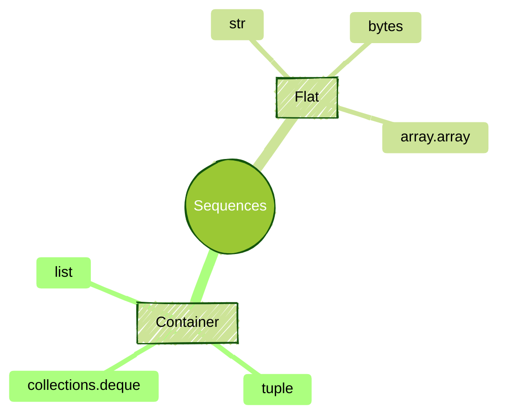
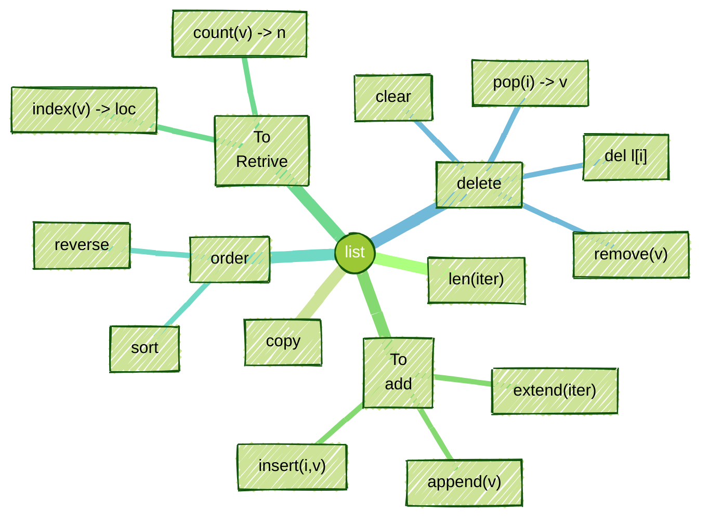

Breif introduction

<!--more-->

------

* TOC
{:toc}
------

## Introduction



## Python Built-In Sequences

Python offer 2 types of sequences.

1. Container seqquences such as `list`, `tuple`, and `collections.deque`
2. Flat sequences such as `str`, `byte` and `array.arry`. Only hold primitive types: `bytes`, `int` and so on.

A container sequence holds references to the objects it contains, which may be of any type, while a flat sequence stores the value of its contents in its own memory space, not as distinct Python objects[^1].

> 📝 The `tuple`, `str` and `bytes` types are immutable. Mutable sequences inherit all methods from immutable sequences, and implement additional methods.
{:.yellow}

The `tuple` is a subclass of the `abc.Sequence`:


    issubclass(tuple, Sequence) = True


## Lists



Mutable ordered collection can contains any sort of objects such as numbers, strings and so on.

1. Ordered collections of arbitrary objects
2. Accessed by Offset
3. Arbitrarily nesteable and Varing length with Heterogeneous elements
4. Although mutable, **concatenation** and **slicing** returns new `lists`.
5. List is a Arrays of object references.


### List Manipulations
#### List Creation
You can create empty list `l = []` or `l = list()`. When pass the literal express, list create series objects and store the references:


```python
v = ["Hello", "Ojitha"]
print(
    f'{v = }'
)
```

    v = ['Hello', 'Ojitha']


what is the difference between `list('code')`  and `['code']` ?

    list("code") = ['c', 'o', 'd', 'e'] # only iterable can be passed to list()
    ["code"] = ['code']


Lets iterate over the list:


```python
for i in list("code"):
    print(i)
```

    c
    o
    d
    e

#### Positive vs Negative Indexes


Similar to C++, with Python `list`, you can use neg and pos idexes.
{:width="150px" height="100px"}

    l =   [1, 2, 3, 4, 5]
    l[2] = 3 # access 3rd element
    l[-2] = 4 # access 2nd last element


#### Lists operations
You can concatinate (1) as well as repeat (2):

    [1,2,3] + [4,5,6] = [1, 2, 3, 4, 5, 6]  <~~~(1) Concatenation
    [1,2,3] * 3 = [1, 2, 3, 1, 2, 3, 1, 2, 3] <~~~(2) Repetition


you can multuply by integer as show in the (2). Otherwise, error as shown in the below code:


```python
print(
    f'{[1,2,3] * [4,5,6] = }  <~~~(2) Repetition' 
    , sep='\n'
)
```


    ---------------------------------------------------------------------------
    
    TypeError                                 Traceback (most recent call last)
    
    Cell In[18], line 2
          1 print(
    ----> 2     f'{[1,2,3] * [4,5,6] = }  <~~~(2) Repetition' 
          3     , sep='\n'
          4 )


    TypeError: can't multiply sequence by non-int of type 'list'


In the list, you can have nested lists. These list are still not possible to multuply. For example, *matrix* you can show. Example here is basic 3 x 3 2-dimenstional matrics:

    matrix = [[1, 2, 3], [4, 5, 6], [7, 8, 9]]
    matrix[0] = [1, 2, 3] # first row
    matrix[1][2] = 6 # 3rd element in 2nd row
    matrix[2][1] = 8 # 2nd element in 3rd row
    matrix[1][0:2] = [4, 5] # first two elements in 2nd row
    matrix[0][1:] = [2, 3] # elements from 2nd element in 1st row


#### Comparison
Comparing two list are possible:

    [1,2,3] == [1,2,3]   = True  ①
    [1,2,3] != [4,5,6]   = True  ②
    [1,2,3] < [1,2,4]    = True  ③
    [1,2,3] > [1,2,2]    = True  ④
    [1,2,3] <= [1,2,3]   = True  ⑤
    [1,2,3] >= [1,2,3]   = True  ⑥
    [1,2,3] < [1,2,3,4]  = True  ⑦
    [1,2,3] > [1,2,3,2]  = False ⑧
    [1,2,3] <= [1,2,3,4] = True  ⑨
    [1,2,3] >= [1,2,3,2] = False ⑩


Importa to notice that 1, 3, 4, 7 and 8.

    [1,2,3] == [2,1,3] = False  <~~~①
    [1,2,3] < [1,3,2] = True  <~~~③
    [1,2,3] > [2,1,3] = False  <~~~④
    [3,2,1] < [1,2,3,4] = False  <~~~⑦
    [1,2,3,2] < [2,1,3,2] = True  <~~~⑧


Another important is checking the membership. You can use `not` to negate as shown in the (2) in the followin code.

    "a" in ["a","b","c"] = True  <~~~(1)
    3 not in [1,2,3] = False  <~~~(2)


You can have duplicates in the list

    ["a","b","c","d","a"].count("a") =2


#### Important methods
There are some important method associated with list. You can use list as a stack where you can do pop operation. 

    ["a","b","c","d"].index("c") = 2 <~~~(1)
    [1,2,3,4].pop() = 4
    ["a","b","c","d"].pop(1) = 'b'
    [1,2,3,4].copy() = [1, 2, 3, 4]


As shown in the above (1), there is *zero based* index location of the element is returned. 


```python
l = []
l.append(1)
l.append(2)
l.append(3)
l.append(4) 
l.append(5) 
l.pop()
l.pop()
l
```


    [1, 2, 3]


As a Queue (FIFO)


```python
l = []
l.append(1)
l.append(2)
l.append(3)
l.append(4) 
l.append(5) 
l.pop(0)
l.pop(0)
l
```


    [3, 4, 5]


Not only append as show above, you can insert to particular location in the list:


```python
#    0,1,2,3  zero-based index
l = [1,2,3,4]
l.insert(1, 5)
print(f'{l = }') 
```

    l = [1, 5, 2, 3, 4]


The `list` can be extended as follows:


```python
l1 = [1,2,3,4]
l2 = [5,6,7,8] # iterable
l1.extend(l2) # extend the list l1 with another iterable (l2)
l1
```


    [1, 2, 3, 4, 5, 6, 7, 8]


You can remove element by its value:


```python
l = ["NSW", "ACT", "VIC", "SA", "QLD"]
l.remove("SA")
print(f'{l = }')
```

    l = ['NSW', 'ACT', 'VIC', 'QLD']


if duplicates are there, how the remove worked


```python
# if duplicates are there, how the remove worked
l = list("This is ice" )
print(f'before remove {l.count("i") = }')
l.remove("i")
print(f'after remove {l.count("i") = }')
print(f'{l = } # first occurence is removed') 
```

    before remove l.count("i") = 3
    after remove l.count("i") = 2
    l = ['T', 'h', 's', ' ', 'i', 's', ' ', 'i', 'c', 'e'] # first occurence is removed


The `del` statement is to remove the element from the list.


```python
#     0 ,  1 ,  2 ,  3  zero-based index
l = ['a', 'b', 'c', 'd']

# delete the 3rd element 
# because index starts from 0
del l[2] 
l
```


    ['a', 'b', 'd']


To clear


```python
l = [1,2,3,4]
l.clear()
print(f'{l = }')
```

    l = []


Simply you can use `sort` method to sort the list:


```python
l = [5,4,2,3,1] # unsorted list
l.sort() # sort the list in ascending order
l
```


    [1, 2, 3, 4, 5]


Sort on a key


```python
l = list([("Ojitha", "Kumanayaka"), ("John", "Doe")])
print(f'{l = }') 
l.sort(key=lambda x: x[1])
print(f'{l = }') 
```

    l = [('Ojitha', 'Kumanayaka'), ('John', 'Doe')]
    l = [('John', 'Doe'), ('Ojitha', 'Kumanayaka')]


To sort list, you can use built in function `sorted` which <span>doesn't change the original list, but return a new list</span>{:gtxt}.


```python
l = list([("Ojitha", "Kumanayaka"), ("John", "Doe")])
print(f'{l = }') 
sorted_list = sorted(l, key=lambda x: x[1])
print(f'{sorted_list = }') # sort by last name
```

    l = [('Ojitha', 'Kumanayaka'), ('John', 'Doe')]
    sorted_list = [('John', 'Doe'), ('Ojitha', 'Kumanayaka')]


However, <span>mixing types fail the sort</span>{:rtxt}


```python
l = ["a","b",3,4]
l.sort()
```


    ---------------------------------------------------------------------------
    
    TypeError                                 Traceback (most recent call last)
    
    Cell In[100], line 2
          1 l = ["a","b",3,4]
    ----> 2 l.sort()


    TypeError: '<' not supported between instances of 'int' and 'str'


if you want to reverse above


```python
l = [5,4,2,3,1] # unsorted list
l.reverse() # reverse the list
l
```


    [1, 3, 2, 4, 5]


to sort on desending order:


```python
l = [5,4,2,3,1] # unsorted list
l.sort(reverse=True) # reverse the list
l
```


    [5, 4, 3, 2, 1]


#### Slicing

Same as String, slicing and indexing is possible on list as well. **Index assignment** is simple as `l[0] = "x"`. 

Following code shows **slice assignment**:

1. Delete the slice
2. Insert new items


```python
l = list(range(1,6)) 
print(f'{l =   } <~~~(1)')

l[3:] = ['a', 'b', 'c','d'] # slice from 4th element
print(f'{l =   } <~~~(2)')

l[3:] = ['a'] 
print(f'{l =   } <~~~(3)') # slice from 4th element is replaced with 'a'
```

    l =   [1, 2, 3, 4, 5] <~~~(1)
    l =   [1, 2, 3, 'a', 'b', 'c', 'd'] <~~~(2)
    l =   [1, 2, 3, 'a'] <~~~(3)


Possitve and negative slicing:

{:width="50%" height="50%"}

    l =   [1, 2, 3, 4, 5]
    l[3:] = [4, 5] # slice from 4th element <~~~(1)
    l[:3] = [1, 2, 3] # slice upto 4th element <~~~(2)


Important to notice that
1. 4th element is <span>included in the lower bound</span>{:gtxt}
2. 4th element is <span>excluded in the upper bound</span>{:rtxt}

as shown in the above code when slcing the list.

When slice with negative number:

{:width="50%" height="50%"}

    l =   [1, 2, 3, 4, 5]
    l[-3:] = [3, 4, 5] # slice from 4th element <~~~(1)
    l[:-3] = [1, 2] # slice upto 4th element <~~~(2)


### Comprehensions

In the list comprehensios, *varaibles assigned with the `:=` available after the return which is unlike the local variables*.

> In Python 3, `list`, `set` and `dict` comprehensions, generator expressions have local scope to hold the variables assigned in the **For** clause.
{:.green}

As shown in the follwoing example, `i` (1) is a local variable which is note visible outside.

    l =   [1, 2, 3, 4, 5]
    [ 2 * i for i in l if i % 2 == 0 ] = [4, 8] <~~~(1)
    [ val := 2 * i for i in l if i % 2 == 0 ] = [4, 8] <~~~(2)
    val = 8 <~~~(3)


However, `val` at (2) in the above code is remain after the List comprehension execution as shown at (3).  

#### Compare to built-in fuctions

List comprehension can do whatever `map` and `filter` functions can do using labmda. 

Above (1) can be written as:

    list(map(lambda x: 2 * x, filter(lambda x: x % 2 == 0, l))) = [4, 8] <~~~(1)


you can do cartesian product with List comprehension: 

    letters = ['a', 'b', 'c', 'd']
    numbers = [1, 2, 3, 4]
    [ (x, y) for x in letters for y in numbers ] = [('a', 1), ('a', 2), ('a', 3), ('a', 4), ('b', 1), ('b', 2), ('b', 3), ('b', 4), ('c', 1), ('c', 2), ('c', 3), ('c', 4), ('d', 1), ('d', 2), ('d', 3), ('d', 4)] <~~~(1)


### Generators
Use the same syntax as list comprehension, but enclosed with `()` instead of `[]`.

For example in the follwoing code generator created at (1).

    l =   [1, 2, 3, 4, 5]
    ( 2 * i for i in l if i % 2 == 0 ) = <generator object <genexpr> at 0x10903c2b0> <~~~(1)


Above <span>generator never created in memory</span>{:gtxt} until use it (3). 

For example,

    g = <generator object <genexpr> at 0x10903c040> <~~~(2)
    list(g) = [4, 8] <~~~(3)


> If the generator expression is the single argument in a function call, there is no need to duplicate the enclosing parentheses, otherwise parentheses around the generator expression are mandatory.
{:.yellow}

For example, in the following example, `array` construct need parantheses around the generator, see (1) in the following code:

    l =   [1, 2, 3, 4, 5]
    array.array('B',( 2 * i for i in l if i % 2 == 0 )) = array('B', [4, 8]) <~~~(1))


### Unpacking
Before introduce Extended Iterable Unpacking[^3], unpacking was using the Python modules: 


```python
from itertools import chain
```

    xs = [1, 2, 3]
    ys = [4, 5, 6]
    list(chain(xs, ys)) = [1, 2, 3, 4, 5, 6] # chanin --> iterator


As per my understanding, Additional Unpacking Generalizations[^4] simplified above as follows. 


```python
print(*[1], *[2], 3)
```

    1 2 3


Even inside the list:


```python
[*range(4), 4]
```


    [0, 1, 2, 3, 4]


Left and right of the unpacking should be same number of elements.


```python
a, b = 1, 2
print(
    f'{a = } ',
    f'{b = } ',
sep='\n')
```

    a = 1 
    b = 2 


to unpack more than you are expecting:


```python
a, b, *c = 1, 2, 3, 4, 5
print(
    f'{a = } ',
    f'{b = } ',
    f'{c = } ',
sep='\n')
```

    a = 1 
    b = 2 
    c = [3, 4, 5] 


List literals are support <span>`*` syntax that unpacks the contents of any iterable</span>{:gtxt}[^2] at the top level of the list beign created.

    l1 =   [1, 2, 3, 4, 5] <~~~(1)
    l2 =   ['a', 'b', 'c', 'd'] <~~~(2)
    --- list of lists
    [l1, l2] =   [[1, 2, 3, 4, 5], ['a', 'b', 'c', 'd']] # list of lists
    --- unpacking
    [*l1, *l2] =   [1, 2, 3, 4, 5, 'a', 'b', 'c', 'd'] <~~~(3) # unpack


As shown in the above code (1) and (2) create number list and character list. At (3), unpack both to a single list.

May be unpacking is not required as above because concatination do the work as shown in the following (4):

    l1 + l2 =   [1, 2, 3, 4, 5, 'a', 'b', 'c', 'd'] <~~~(4) # unpack with concatenation


{:gtxt: .message color="green"}
{:ytxt: .message color="yellow"}
{:rtxt: .message color="red"}

[^1]: Chapter 2. An Array of Sequences, Fluent Python, 2nd Edition
[^2]: Capter 8. Lists and Dictionaries, Learning Python, 6th Edition
[^3]: [PEP 3132 – Extended Iterable Unpacking \| peps.python.org](https://peps.python.org/pep-3132/)
[^4]: [PEP 448 – Additional Unpacking Generalizations \| peps.python.org](https://peps.python.org/pep-0448/)
