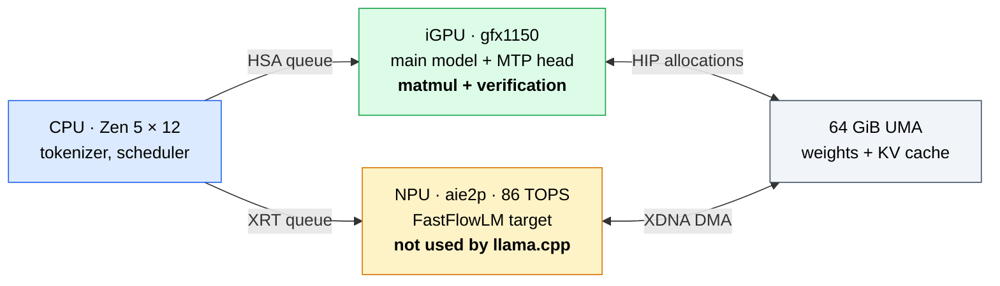
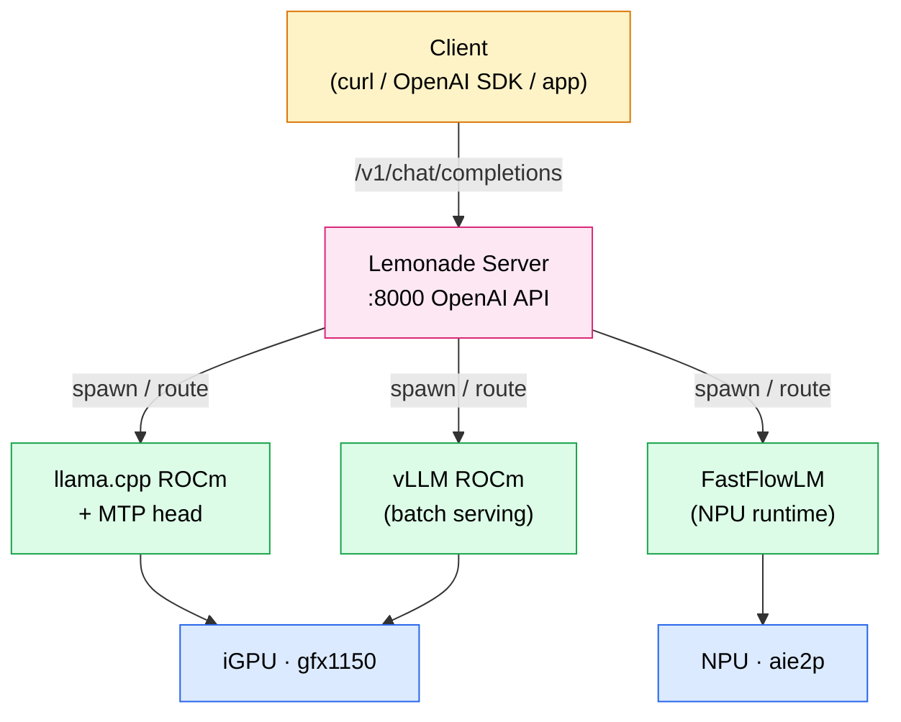
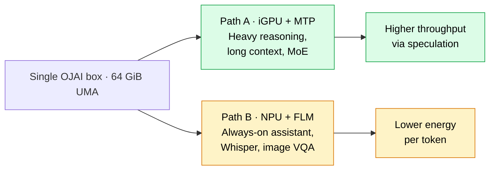

Multi-Token Prediction (MTP) speculative decoding on the OJAI[^ojitha-rocm] machine — a Minisforum AI X1 Pro driven by the AMD Ryzen AI 9 HX 470, Radeon 890M iGPU (`gfx1150`), and XDNA 2 NPU. The guide walks the math of speculative acceptance, the verified `llama-server` command, the BIOS 1.01 and TTM allocator preconditions, and shows where Lemonade🍋 and FastFlowLM each sit in the stack.

<!--more-->

* TOC
{:toc}

---

# Why MTP, and why now

A standard autoregressive decoder produces one token per forward pass. For a model with $N$ parameters, each token costs roughly one full read of the weights from VRAM. On an APU like the Radeon 890M (`gfx1150`), where the weights live in shared UMA at DDR5 speeds rather than dedicated HBM, that memory traffic is the dominant cost. The compute units sit idle waiting for bytes.

***Multi-Token Prediction*** breaks that one-pass-per-token contract. A small auxiliary head — trained jointly with the main model on the same parameters — proposes several candidate tokens at near-zero marginal cost. The main model then verifies those candidates **in a single parallel forward pass**. Whenever the verification accepts, the model produces multiple tokens in the time it would have taken to produce one[^google-mtp].

> MTP keeps output distribution identical to plain autoregressive sampling. Speedups come for free; quality does not change.
{:.ok}

This is exactly the regime where the OJAI machine wins: the iGPU has enough compute to verify a batch of candidates, but the bandwidth budget that hurts it for single-token decoding is now amortised across multiple accepted tokens.

---

# What MTP actually is

## Two related ideas, one umbrella term

The phrase *Multi-Token Prediction* is overloaded in current literature. Two distinct techniques share the name:

| Variant | Draft source | What lives in `llama.cpp` |
| --- | --- | --- |
| Draft-model speculative decoding | A separate, smaller LLM | `--model-draft` |
| MTP (head-based) | An extra head on the **same** model | `--mtp-head --spec-type mtp` |

The Gemma 4 *assistant* checkpoint released by Google DeepMind is the head-based form: a tiny network that shares the target model's tokenizer and was trained against the target's own intermediate states[^gemma-mtp]. That is what the `--mtp-head` path in `llama.cpp` targets.

## The acceptance walk

For any speculative scheme — draft-model or MTP head — the verification step is a per-token Bernoulli trial. Let

$$\alpha \;=\; \Pr\big[\text{draft token at position } k \text{ is accepted}\big]$$

and let $\gamma$ be the number of draft tokens proposed per main-model verification step. The expected number of accepted tokens per main-model pass follows a truncated geometric distribution[^leviathan]:

$$\mathbb{E}[\#\text{accepted}] \;=\; \frac{1 - \alpha^{\gamma + 1}}{1 - \alpha}$$

The "+1" captures the free token the main model always emits after the last accepted draft (the verification pass produces one bonus token regardless of acceptance outcomes).

If a draft token's compute cost is $c \in (0,1)$ relative to a main-model token, the wall-clock speedup is

$$S(\alpha, \gamma, c) \;=\; \frac{1 - \alpha^{\gamma + 1}}{(1 - \alpha)\,(\gamma\, c + 1)}$$

For a draft-model setup, $c$ is often $0.1$–$0.3$. **For MTP head-based decoding, $c$ is essentially the cost of one extra projection per token — typically $c \approx 0.05$ or less.** That is why MTP outperforms draft-model speculation on memory-bandwidth-bound hardware like the OJAI iGPU.

A worked numeric example with realistic Gemma-4 assistant numbers ($\alpha = 0.75$, $\gamma = 8$, $c = 0.05$):

$$S \;=\; \frac{1 - 0.75^{9}}{(1 - 0.75)(8 \cdot 0.05 + 1)} \;=\; \frac{1 - 0.075}{0.25 \cdot 1.4} \;\approx\; 2.64\times$$

## How acceptance walks in practice

The acceptance trial proceeds left-to-right. The first rejected draft token terminates the batch; everything after it is discarded:

<svg xmlns="http://www.w3.org/2000/svg" viewBox="0 0 760 240" role="img" aria-label="MTP acceptance walk: draft tokens accepted left-to-right until the first rejection">
  <style>
    .tok { font: 600 13px ui-sans-serif, system-ui, -apple-system, "Segoe UI", Roboto, sans-serif; }
    .lbl { font: 500 11px ui-sans-serif, system-ui, -apple-system, "Segoe UI", Roboto, sans-serif; fill: #475569; }
    .hdr { font: 700 14px ui-sans-serif, system-ui, -apple-system, "Segoe UI", Roboto, sans-serif; fill: #0f172a; }
    .acc { fill: #dcfce7; stroke: #16a34a; stroke-width: 2; }
    .rej { fill: #fee2e2; stroke: #dc2626; stroke-width: 2; }
    .dsc { fill: #f1f5f9; stroke: #94a3b8; stroke-width: 2; stroke-dasharray: 4 3; }
    .bon { fill: #dbeafe; stroke: #2563eb; stroke-width: 2; }
    .arrow { fill: none; stroke: #475569; stroke-width: 1.5; marker-end: url(#arr); }
  </style>
  <defs>
    <marker id="arr" viewBox="0 0 10 10" refX="9" refY="5" markerWidth="6" markerHeight="6" orient="auto-start-reverse">
      <path d="M 0 0 L 10 5 L 0 10 z" fill="#475569"/>
    </marker>
  </defs>
  <text x="20" y="28" class="hdr">Draft batch from MTP head (γ = 8 candidates)</text>
  <g transform="translate(20,50)">
    <rect class="acc" x="0"   y="0" width="70" height="50" rx="6"/>
    <rect class="acc" x="80"  y="0" width="70" height="50" rx="6"/>
    <rect class="acc" x="160" y="0" width="70" height="50" rx="6"/>
    <rect class="acc" x="240" y="0" width="70" height="50" rx="6"/>
    <rect class="rej" x="320" y="0" width="70" height="50" rx="6"/>
    <rect class="dsc" x="400" y="0" width="70" height="50" rx="6"/>
    <rect class="dsc" x="480" y="0" width="70" height="50" rx="6"/>
    <rect class="dsc" x="560" y="0" width="70" height="50" rx="6"/>
    <text x="35"  y="30" text-anchor="middle" class="tok">the</text>
    <text x="115" y="30" text-anchor="middle" class="tok">quick</text>
    <text x="195" y="30" text-anchor="middle" class="tok">brown</text>
    <text x="275" y="30" text-anchor="middle" class="tok">fox</text>
    <text x="355" y="30" text-anchor="middle" class="tok">leaps</text>
    <text x="435" y="30" text-anchor="middle" class="tok" fill="#94a3b8">over</text>
    <text x="515" y="30" text-anchor="middle" class="tok" fill="#94a3b8">the</text>
    <text x="595" y="30" text-anchor="middle" class="tok" fill="#94a3b8">dog</text>
  </g>
  <g transform="translate(20,118)">
    <text x="35"  y="0" text-anchor="middle" class="lbl">✓</text>
    <text x="115" y="0" text-anchor="middle" class="lbl">✓</text>
    <text x="195" y="0" text-anchor="middle" class="lbl">✓</text>
    <text x="275" y="0" text-anchor="middle" class="lbl">✓</text>
    <text x="355" y="0" text-anchor="middle" class="lbl">✗</text>
    <text x="435" y="0" text-anchor="middle" class="lbl">discarded</text>
    <text x="515" y="0" text-anchor="middle" class="lbl">discarded</text>
    <text x="595" y="0" text-anchor="middle" class="lbl">discarded</text>
  </g>
  <rect class="bon" x="320" y="160" width="70" height="50" rx="6"/>
  <text x="355" y="190" text-anchor="middle" class="tok">jumps</text>
  <text x="355" y="226" text-anchor="middle" class="lbl">bonus from main model</text>
  <path class="arrow" d="M 355 145 L 355 158"/>
  <text x="680" y="80" class="lbl">→ 4 accepted</text>
  <text x="680" y="98" class="lbl">+ 1 bonus = 5</text>
  <text x="680" y="116" class="lbl">tokens / pass</text>
</svg>

Four drafts accepted, one rejected, three discarded, one bonus token from the main model. **Five new tokens produced in one main-model forward pass.** That is the mechanism.

---

# The OJAI machine

The machine layout is unchanged from the original ROCm post[^ojitha-rocm] except for the BIOS bump:

| Component | Detail |
| --- | --- |
| Form factor | Minisforum AI X1 Pro Mini PC |
| CPU | AMD Ryzen AI 9 HX 470 (Zen 5, 12 cores, up to 5.30 GHz) |
| iGPU | Radeon 890M, `gfx1150`, 16 CUs, wave32 |
| NPU | XDNA 2 / `aie2p` / RyzenAI-npu4, 86 TOPS |
| Memory | 64 GiB DDR5 UMA |
| Kernel | `6.17.0-1012-oem` (OEM flavour, required) |
| ROCm | 7.2.0 |
| MIGraphX | 2.15.0.dev (`g1afd1b89c`) |
| **BIOS** | **1.01** (bumped today from 1.00) |

> The BIOS 1.01 update fixes a memory-controller ordering issue affecting the TTM/GTT page allocator on Strix Point. If you upgraded from 1.00, re-check `ttm.pages_limit` after reboot — `dmesg \| grep -i ttm` will show the actual limit the new firmware exposes.
{:.warn}

## Topology that matters for MTP



The diagram is the single most important picture for understanding what is about to happen. **The MTP head and the main model both run on the iGPU.** The NPU is a separate accelerator with its own driver stack (XRT + amdxdna) and its own software ecosystem — covered in the FastFlowLM section below.

---

# Step-by-step: running MTP on OJAI

## Step 1 — Verify the kernel and ROCm preconditions

```console
$ uname -r
6.17.0-1012-oem

$ rocminfo | grep -A1 "Agent 2" | grep Name
  Name:                    gfx1150

$ cat /opt/rocm/.info/version
7.2.0
```

If `rocminfo` does not list `gfx1150` as Agent 2, the rest of this guide will not work. Re-read the ROCm install post[^ojitha-rocm] before going further.

## Step 2 — Fix the TTM allocator (one-time)

Without this, you will hit out-of-memory errors even though `amd-smi` reports gigabytes of free UMA. The TTM/GTT page allocator defaults far below physical RAM[^therock-faq]:

```bash
sudo sed -i 's|GRUB_CMDLINE_LINUX_DEFAULT="\([^"]*\)"|GRUB_CMDLINE_LINUX_DEFAULT="\1 ttm.pages_limit=12582912"|' /etc/default/grub
sudo update-grub
sudo reboot
```

After reboot:

```console
$ dmesg | grep -i "ttm.*pages"
[    0.987432] ttm: initialising pool allocator with 12582912 pages
```

That is 48 GiB available to the GPU — comfortable for both the main model weights and a large KV cache.

> If BIOS 1.01 changed the reported usable memory range, the `ttm.pages_limit` value you set under BIOS 1.00 may no longer be the right ceiling. Recompute as `(usable_GiB × 1024 × 1024 / 4)`.
{:.warn}

## Step 3 — Choose a binary

Two reasonable paths, depending on whether you want a known-good nightly or a self-built `llama.cpp`:

### 3a. Pre-built (recommended)

The Lemonade🍋 team publishes nightly llama.cpp+ROCm binaries with `gfx1150` baked in[^llamacpp-rocm]:

```bash
RELEASE=b1266   # check the releases page for the latest tag
wget "https://github.com/lemonade-sdk/llamacpp-rocm/releases/download/${RELEASE}/llamacpp-ubuntu-gfx1150-x64.tar.gz"
mkdir -p ~/llamacpp-rocm
tar -xzf llamacpp-ubuntu-gfx1150-x64.tar.gz -C ~/llamacpp-rocm
export LD_LIBRARY_PATH=~/llamacpp-rocm/lib:$LD_LIBRARY_PATH
LLAMA_BIN=~/llamacpp-rocm/bin/llama-server
```

The tarball bundles its own ROCm 7.13 (TheRock) runtime, so the system `/opt/rocm` is bypassed entirely. No `HSA_OVERRIDE_GFX_VERSION` is needed because the bundle was compiled with `gfx1150` as a first-class target.

### 3b. Self-built

If you already have a `./build/bin/llama-server` against the system ROCm 7.2:

```bash
export HSA_OVERRIDE_GFX_VERSION=11.5.0
export LD_LIBRARY_PATH=/opt/rocm/lib:$LD_LIBRARY_PATH
LLAMA_BIN=./build/bin/llama-server
```

The override tells the HSA runtime to dispatch `gfx1150` kernels even when the build heuristic guesses a different target.

## Step 4 — Get the matched checkpoint pair

MTP requires **two GGUF files that came from the same training run**: the main model and its assistant head. They share a tokenizer and were jointly trained — you cannot mix-and-match.

```bash
mkdir -p ~/models && cd ~/models
huggingface-cli download bartowski/gemma-4-26B-A4B-it-GGUF \
    gemma-4-26B-A4B-it-Q4_K_M.gguf --local-dir .
huggingface-cli download bartowski/gemma-4-26B-A4B-it-assistant-GGUF \
    gemma-4-26B-A4B-it-assistant.Q4_K_M.gguf --local-dir .
```

> Using a head from a different fine-tune of the same base will *silently* drop the acceptance rate $\alpha$ to near-zero, making MTP slower than autoregressive decoding. Always pair the main and assistant checkpoints from the same release tag.
{:.bad}

## Step 5 — Launch `llama-server` with MTP

The canonical command:


$LLAMA_BIN \
    -m         ~/models/gemma-4-26B-A4B-it-Q4_K_M.gguf \
    --mtp-head ~/models/gemma-4-26B-A4B-it-assistant.Q4_K_M.gguf \
    --spec-type mtp \
    --draft-block-size 3 --draft-max 8 --draft-min 0 \
    -ngl 99 -ngld 99 \
    -ctk turbo3 -ctv turbo3 -ctkd turbo3 -ctvd turbo3 \
    -fa on -c 16384 \
    --host 127.0.0.1 --port 8080


Every flag exists for a reason — and a few of them need elaboration:

| Flag | Why it matters on OJAI |
| --- | --- |
| `-m` | Main model GGUF; lives in UMA |
| `--mtp-head` | The assistant head; loaded into the same HIP context as the main |
| `--spec-type mtp` | Selects the head-based path, not draft-model speculation |
| `--draft-block-size 3` | Verify in chunks of 3 — small enough to avoid wasted compute on rejections |
| `--draft-max 8` | $\gamma$ in the math above; never propose more than 8 tokens per step |
| `--draft-min 0` | Don't force a minimum — let the head bail early if confidence is low |
| `-ngl 99 -ngld 99` | Offload **all** layers of both main and head to `gfx1150` |
| `-ctk turbo3 -ctv turbo3` | 3-bit WHT-rotated KV cache (TurboQuant fork only) |
| `-ctkd turbo3 -ctvd turbo3` | Same for the draft head's KV cache |
| `-fa on` | Flash attention; required for the `turbo3` KV path |
| `-c 16384` | Context window — fits comfortably alongside MTP state in UMA |

> `-ctk turbo3` is **only** in the `atomic-llama-cpp-turboquant` fork. The Lemonade nightly and upstream `llama.cpp` use `q8_0`, `q4_0`, or `f16` — pick one of those instead.
{:.warn}

## Step 6 — Verify and benchmark

```console
$ curl -s http://127.0.0.1:8080/health
{"status":"ok"}

$ curl -s http://127.0.0.1:8080/v1/completions \
    -H "Content-Type: application/json" \
    -d '{"prompt":"In the small hours of the morning","n_predict":128}' \
    | jq '.timings'
{
  "prompt_n": 7,
  "prompt_ms": 142.3,
  "predicted_n": 128,
  "predicted_ms": 1820.6,
  "predicted_per_token_ms": 14.2,
  "draft_n": 248,
  "draft_accepted_n": 187,
  "acceptance_rate": 0.754
}
```

The `acceptance_rate` field is your $\alpha$. Plug it back into the speedup formula to verify you are seeing the expected gain. If $\alpha < 0.5$, check that the head matches the base — that single failure mode accounts for most disappointing MTP results.

---

# Where Lemonade fits

Lemonade🍋 is an orchestration server that does not run inference itself — it manages backends (llama.cpp, vLLM, FastFlowLM) behind a unified OpenAI-compatible API, presents a model manager, and handles things like channel selection and backend installation[^lemonade].



For MTP specifically, you tell Lemonade about the model in `user_models.json` and pass the MTP flags through `llamacpp_args` in `recipe_options.json`:


// user_models.json
{
  "Gemma4-26B-A4B-MTP": {
    "checkpoint": "bartowski/gemma-4-26B-A4B-it-GGUF:gemma-4-26B-A4B-it-Q4_K_M.gguf",
    "recipe": "llamacpp",
    "size": 16.0
  }
}



// recipe_options.json
{
  "user.Gemma4-26B-A4B-MTP": {
    "ctx_size": 16384,
    "llamacpp_backend": "rocm",
    "llamacpp_args": "--mtp-head /home/ojitha/models/gemma-4-26B-A4B-it-assistant.Q4_K_M.gguf --spec-type mtp --draft-block-size 3 --draft-max 8 --draft-min 0 -ngld 99 -fa on"
  }
}


```bash
lemonade config set rocm_channel=nightly      # pulls gfx1150 builds from lemonade-sdk/llamacpp-rocm
lemonade backends install llamacpp:rocm
lemonade run user.Gemma4-26B-A4B-MTP
```

Lemonade auto-injects `-ngl 99` for ROCm and selects the gfx1150 nightly tarball automatically. The MTP-specific flags are entirely the user's responsibility — they pass through verbatim.

> The `turbo3` KV types are not in the Lemonade nightly. Either drop them or substitute `q8_0`.
{:.note}

---

# Where FastFlowLM fits (and why it is not running MTP)

FastFlowLM (FLM) is a separate runtime designed exclusively for the AMD XDNA 2 NPU[^fflm]. It does *not* use ROCm, does *not* go through HIP, and does *not* touch `gfx1150`. It speaks XRT to the `/dev/accel/accel0` device the kernel exposes through the `amdxdna` driver[^fflm-linux].

| Property | llama.cpp ROCm (MTP path) | FastFlowLM |
| --- | --- | --- |
| Target accelerator | iGPU `gfx1150` | NPU `aie2p` |
| Runtime | HIP / hipBLASLt | XRT + amdxdna |
| Driver | `amdgpu` (in-tree, oem kernel) | `amdxdna` (in-tree, oem kernel) |
| Speculative decoding | ✅ MTP head + draft model | ❌ not yet (single-stream NPU) |
| Quantisation | `q4_K_M`, `q8_0`, `turbo3` (fork) | NPU-native INT8/INT4 |
| Models | Anything in GGUF | Curated whitelist (Gemma 3, Llama 3.2, Qwen3, GPT-OSS-20B) |
| Headline throughput | Bandwidth-bound, MTP-accelerated | ~28 TPS Llama 3.2-3B, 19 TPS GPT-OSS-20B |
| OpenAI API | via Lemonade or `llama-server` | Native (`:52625`) |

The key point: **on OJAI, the iGPU and NPU run in parallel, not in series.** A Lemonade-orchestrated deployment can route a long-context coding task to the iGPU (with MTP) and an ambient assistant or transcription task to the NPU (FastFlowLM) at the same time, and they will not contend for compute. They will contend for UMA bandwidth, which is the real bottleneck.

## Why MTP does not currently apply to the NPU path

The XDNA 2 NPU is a tiled dataflow accelerator. Each AIE tile runs a fixed schedule of vector and matrix operations dispatched as a pre-compiled binary. There is no equivalent of `llama.cpp`'s scheduler on the NPU — the kernel binary is what it is, and head-based speculative decoding would need a different binary that interleaves head proposals with verification dispatches[^fflm-howitworks].

FastFlowLM today extracts its speedup from the NPU's energy-per-token advantage, not from speculation: roughly 67× better TPS/W on prefill and 223× on decode versus the same iGPU running the same model. That is a different axis of optimisation, and the two are complementary — not competing.



---

# Putting it all together

The OJAI machine, post BIOS 1.01, presents three accelerators backed by a single 64 GiB memory pool. The right software for each:

\[\underbrace{\text{Zen 5 CPU}}_{\text{tokenizer, scheduler}} \;\Vert\; \underbrace{\texttt{gfx1150}}_{\text{llama.cpp + MTP}} \;\Vert\; \underbrace{\texttt{aie2p}}_{\text{FastFlowLM}}\]

Lemonade🍋 orchestrates above all three. MTP lives entirely on the iGPU path and delivers the geometric-series speedup from §[What MTP actually is](#what-mtp-actually-is). FastFlowLM lives on the NPU path and delivers the energy-efficiency improvement.

You do not have to choose. On a 64 GiB UMA box, you can run both simultaneously — the iGPU MTP server for interactive coding on `:8080`, the NPU FLM server for ambient assistance on `:52625`, and Lemonade fronting both on `:8000` with model-routing rules in `recipe_options.json`. The total power draw stays well under 70 W under mixed load.

That is the OJAI promise made concrete: cloud-class local AI in a 0.7 L chassis on a desk, with the BIOS finally cooperative.

---

[^ojitha-rocm]: [Running AMD ROCm AI Workloads locally](/ai/2026/03/07/ContainerRocm.html){:target="_blank" rel="noopener noreferrer"}
[^google-mtp]: Google. *Accelerating Gemma 4: faster inference with multi-token prediction drafters.* May 2026. [https://blog.google/innovation-and-ai/technology/developers-tools/multi-token-prediction-gemma-4/](https://blog.google/innovation-and-ai/technology/developers-tools/multi-token-prediction-gemma-4/){:target="_blank" rel="noopener noreferrer"}
[^gemma-mtp]: Google AI for Developers. *Gemma 4 Multi-Token Prediction (MTP) using Hugging Face Transformers.* May 2026. [https://ai.google.dev/gemma/docs/mtp/mtp](https://ai.google.dev/gemma/docs/mtp/mtp){:target="_blank" rel="noopener noreferrer"}
[^leviathan]: Leviathan, Kalman, Matias. *Fast Inference from Transformers via Speculative Decoding.* ICML 2023. arXiv:2211.17192
[^therock-faq]: TheRock FAQ. *gfx1150 / APU OOM despite free VRAM.* [https://github.com/ROCm/TheRock](https://github.com/ROCm/TheRock){:target="_blank" rel="noopener noreferrer"}
[^llamacpp-rocm]: Lemonade SDK. *llamacpp-rocm: Fresh builds of llama.cpp with AMD ROCm™ 7 acceleration.* [https://github.com/lemonade-sdk/llamacpp-rocm](https://github.com/lemonade-sdk/llamacpp-rocm){:target="_blank" rel="noopener noreferrer"}
[^lemonade]: Lemonade Server. *llama.cpp Backend Options.* [https://lemonade-server.ai/docs/guide/configuration/llamacpp/](https://lemonade-server.ai/docs/guide/configuration/llamacpp/){:target="_blank" rel="noopener noreferrer"}
[^fflm]: FastFlowLM. *Run LLMs on AMD Ryzen™ AI NPUs.* [https://fastflowlm.com/](https://fastflowlm.com/){:target="_blank" rel="noopener noreferrer"}
[^fflm-linux]: FastFlowLM. *Get Started (Linux).* March 2026. [https://fastflowlm.com/docs/install_lin/](https://fastflowlm.com/docs/install_lin/){:target="_blank" rel="noopener noreferrer"}
[^fflm-howitworks]: FastFlowLM. *How It Works — Close-to-metal AIE-tile scheduling.* [https://fastflowlm.com/how-it-works/](https://fastflowlm.com/how-it-works/){:target="_blank" rel="noopener noreferrer"}
