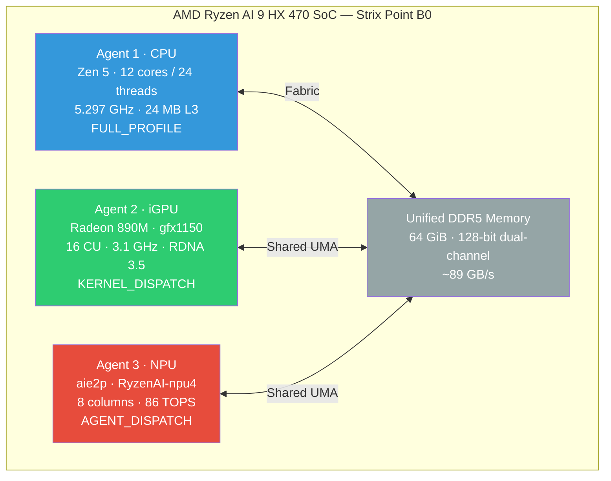
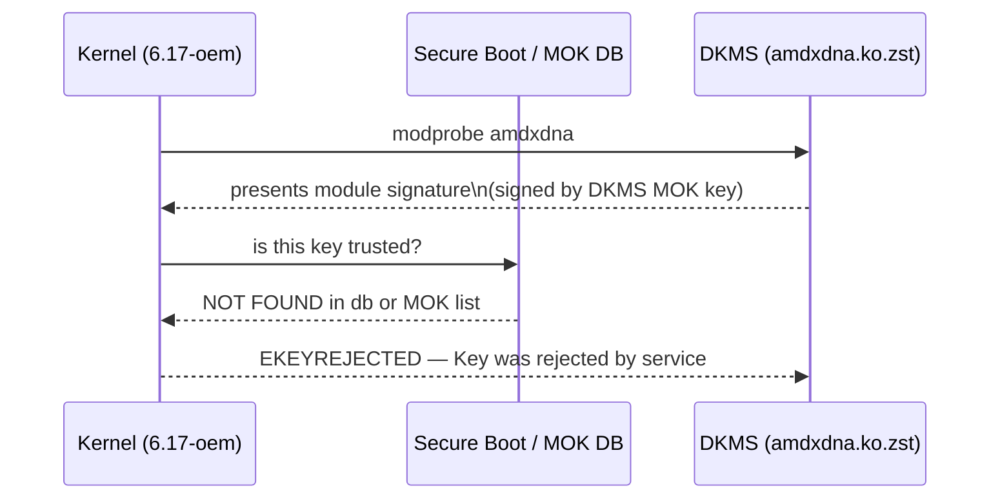
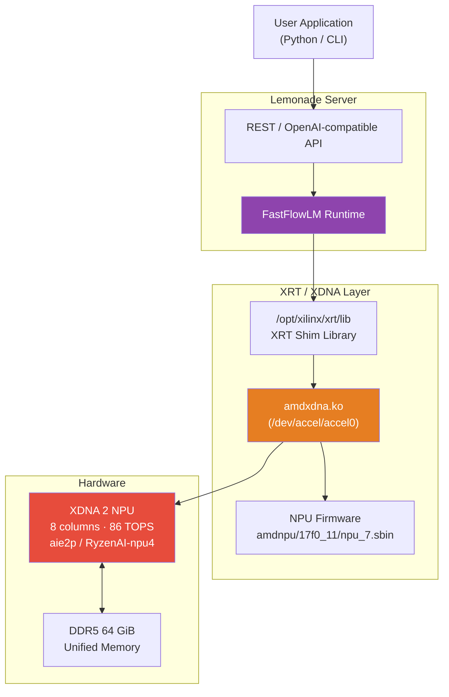
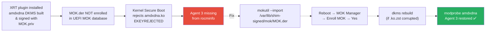

This is a follow-up to [Running AMD ROCm AI Workloads locally][rocm-post], where the OJAI machine
(MINISFORUM AI X1 Pro-470[^minisforum]) is introduced with its three HSA agents. After a kernel update
the NPU silently disappeared, despite the XRT driver package being installed and DKMS reporting the
module as built. This post is the complete diagnosis and resolution.

> **BIOS note:** The AI X1 Pro BIOS has been updated to **version 1.01** (up from 1.00 documented in the
> [previous post][rocm-post]). If BIOS 1.00 did not expose the NPU device in `lspci`, flashing 1.01 is
> a prerequisite before following this guide.

---

- [BIOS Update](#bios-update)
- [Background — the Three-Agent Architecture](#background--the-three-agent-architecture)
- [Symptom — Agent 3 Disappears](#symptom--agent-3-disappears)
- [Step 1 — Confirm the Kernel Module Exists](#step-1--confirm-the-kernel-module-exists)
- [Step 2 — Rule Out the IOMMU Trap](#step-2--rule-out-the-iommu-trap)
- [Step 3 — Load the Module — First Failure](#step-3--load-the-module--first-failure)
- [Step 4 — Understand the Secure Boot Rejection Chain](#step-4--understand-the-secure-boot-rejection-chain)
- [Step 5 — Find the Real Signing Key](#step-5--find-the-real-signing-key)
- [Step 6 — Enrol the DKMS MOK Key](#step-6--enrol-the-dkms-mok-key)
- [Step 7 — Rebuild the Corrupted Module](#step-7--rebuild-the-corrupted-module)
- [Step 8 — Final Verification](#step-8--final-verification)
- [Making the Module Persistent](#making-the-module-persistent)
- [Lemonade and FastFlowLM on the NPU](#lemonade-and-fastflowlm-on-the-npu)
- [Summary](#summary)

---

## BIOS Update

The AI X1 Pro-470 shipped with BIOS **1.00**. Version **1.01** (released 9 April 2026) is required
for reliable NPU enumeration — on 1.00 the NPU device may not appear in `lspci` at all, making the
driver setup steps below pointless. Flash the BIOS before doing anything else.

> **Risk notice:** A BIOS flash that is interrupted by power loss can permanently brick the machine.
> Read every step before starting. Do not proceed on battery power alone.

### Step 1 — Check your current BIOS version

```bash
sudo dmidecode -s bios-version
sudo dmidecode -s bios-release-date
```

If the output is `1.01` and `04/09/2026` (or later), you are already on the latest BIOS — skip this
section entirely. If it shows `1.00` or an earlier date, continue below.

### Step 2 — Download the BIOS archive

The official BIOS file is distributed by MINISFORUM via their S3 CDN. Download it on any machine
that has a working internet connection (it does not have to be the AI X1 Pro itself):

```
https://pc-file.s3.us-west-1.amazonaws.com/AI+X1+Pro-470/BIOS/GPBAC_1.01_260409.7z
```

Filename breakdown:

| Field | Value | Meaning |
|-------|-------|---------|
| `GPBAC` | model code | Internal MINISFORUM code for AI X1 Pro-470 |
| `1.01` | BIOS version | Target version after flashing |
| `260409` | date stamp | 9 April 2026 release date |

Verify the archive is not corrupted before extracting. On Ubuntu:

```bash
# Install 7zip if not already present
sudo apt install p7zip-full

# Test the archive integrity
7z t GPBAC_1.01_260409.7z
```

Expected output ends with `Everything is Ok`. If it reports errors, re-download.

### Step 3 — Prepare the USB drive

The AI X1 Pro-470 BIOS is flashed from a FAT32-formatted USB drive using the EFI shell built into
the firmware. The USB drive must be dedicated to this operation — its entire contents will be replaced.

#### 3a — Identify and wipe the USB drive

Insert the USB drive and identify its device node:

```bash
lsblk -o NAME,SIZE,TRAN,LABEL
```

Look for a device with `TRAN=usb`. It will appear as `/dev/sdX` (e.g. `/dev/sdb`). Confirm the size
matches your USB drive before proceeding — **do not confuse it with an internal NVMe**.

```bash
# Replace sdX with your actual device — double-check before running
sudo wipefs -a /dev/sdX
```

#### 3b — Create a single FAT32 partition

```bash
sudo parted /dev/sdX --script \
  mklabel msdos \
  mkpart primary fat32 1MiB 100%

sudo mkfs.vfat -F 32 -n BIOS /dev/sdX1
```

Verify the filesystem:

```bash
sudo blkid /dev/sdX1
# Should show TYPE="vfat"
```

#### 3c — Extract and copy BIOS files to the USB

```bash
# Mount the USB
sudo mkdir -p /mnt/usbflash
sudo mount /dev/sdX1 /mnt/usbflash

# Extract the 7z archive
7z x GPBAC_1.01_260409.7z -o/tmp/bios_extract/

# Copy all extracted files to the USB root
sudo cp -r /tmp/bios_extract/* /mnt/usbflash/

# Confirm the contents
ls -lh /mnt/usbflash/

# Sync and unmount
sync
sudo umount /mnt/usbflash
```

The USB root should contain the BIOS binary (typically a `.bin` or `.rom` file) and a flash
utility or script (commonly an `.efi` file or a `startup.nsh` EFI shell script). Read any
`README` or `readme.txt` in the archive — MINISFORUM occasionally changes the flash procedure
between revisions.

### Step 4 — Pre-flash checklist

Complete every item before booting from the USB:

- [ ] Machine is plugged into mains power (AC adapter connected, not running on battery alone)
- [ ] External USB/OCuLink devices disconnected except the BIOS USB drive and keyboard
- [ ] Current BIOS settings noted (UMA frame buffer size, boot order, any custom settings)
- [ ] Ubuntu is shut down — not suspended, not rebooted — fully powered off

```bash
# Note your current UMA allocation before shutting down
sudo dmidecode -t memory | grep -i size
# Also note via amd-smi if the machine is still up
amd-smi static --gpu 0 | grep -A3 VRAM
```

### Step 5 — Flash from the EFI shell

1. Insert the prepared USB drive.
2. Power on the machine and press **`Delete`** or **`F7`** repeatedly to enter the BIOS/boot menu.
3. Select the USB drive as the boot device. The system will boot into the EFI shell or directly
   run the MINISFORUM flash utility.
4. If the EFI shell prompt appears (`Shell>`), navigate to the USB and run the flash script:

```
Shell> fs0:
fs0:\> startup.nsh
```

   If the archive contained an `.efi` flash tool instead of a script, run it directly:

```
fs0:\> AfuEfix64.efi <biosfile>.bin /P /B /N /X
```

5. The flash utility will display progress. **Do not power off, press any key, or disconnect
   anything** until it explicitly says the flash is complete and prompts you to reboot.
6. When prompted, remove the USB drive and allow the system to reboot.

The first boot after a BIOS update is slower than normal — the firmware re-initialises hardware
and resets settings to defaults. This is expected.

### Step 6 — Post-flash verification

After Ubuntu boots:

```bash
# Confirm the new BIOS version
sudo dmidecode -s bios-version
# Expected: 1.01

sudo dmidecode -s bios-release-date
# Expected: 04/09/2026
```

Re-apply any BIOS settings that were reset to defaults (UMA frame buffer size is the most
important for ROCm — set it back to your previous value, typically 512 MB minimum as recommended
by AMD).

Confirm the NPU is now visible to the OS:

```bash
lspci -nn | grep 17f0
# Expected: c5:00.1  Signal processing controller [1180]: AMD  Strix/Krackan NPU [1022:17f0] (rev 11)
```

If the NPU device appears in `lspci`, the BIOS update succeeded. Proceed with the driver setup
in the sections below.

---

## Background — the Three-Agent Architecture

The AMD Ryzen AI 9 HX 470 inside the AI X1 Pro is a single SoC that presents three independent compute
agents to the HSA runtime. Each agent has a distinct role in an AI inference pipeline. The XDNA 2 NPU
in Strix Point uses a spatially-arranged 2D array of compute and memory tiles[^xdna-arch]
configured as **4 rows × 8 columns** of AIE tiles with 4096 KB of on-chip L2 memory[^kernel-amdnpu-doc],
a fivefold increase over the original XDNA in Phoenix/Hawk Point[^xdna-wiki].



| Agent | Device | ISA | Dispatch Model | Primary use |
|-------|--------|-----|----------------|-------------|
| 1 | AMD Ryzen AI 9 HX 470 | x86-64 | CPU threads | Orchestration, tokenisation |
| 2 | AMD Radeon Graphics (gfx1150) | amdgcn–gfx1150 | `KERNEL_DISPATCH` | ROCm, PyTorch, MIGraphX, vLLM |
| 3 | RyzenAI-npu4 (aie2p) | AIE tile ISA | `AGENT_DISPATCH` | XDNA 2, FastFlowLM, ONNX Vitis AI EP |

When `rocminfo` lists all three, the stack is fully healthy. When Agent 3 is absent, the NPU kernel driver
(`amdxdna`) has not loaded.

---

## Symptom — Agent 3 Disappears

After installing the `xrt_plugin...amdxdna.deb` package and rebooting, `rocminfo` only showed two agents:

```bash
lsmod | grep amdxdna
# (no output)
```

`rocminfo` confirmed:

```
Agent 1  …  CPU
Agent 2  …  gfx1150  GPU
*** Done ***
```

Agent 3 is gone. The NPU is physically present — confirmed via `lspci`:

```bash
lspci -nn | grep 17f0
# c5:00.1  Signal processing controller [1180]: AMD  Strix/Krackan NPU [1022:17f0] (rev 11)
```

Device ID `1022:17f0` is the Strix XDNA 2 NPU. The hardware is there; the driver is not.

---

## Step 1 — Confirm the Kernel Module Exists

```bash
modinfo amdxdna
```

```
filename:       /lib/modules/6.17.0-1023-oem/updates/dkms/amdxdna.ko.zst
description:    amdxdna driver
author:         XRT Team <runtimeca39d@amd.com>
license:        GPL
firmware:       amdnpu/17f0_11/npu_7.sbin
firmware:       amdnpu/17f0_10/npu_7.sbin
...
signer:         ojai Secure Boot Module Signature key
sig_key:        78:E9:F3:52:F0:75:8C:2A:14:...
vermagic:       6.17.0-1023-oem SMP preempt mod_unload modversions
```

Key observations:

- The module is built for `6.17.0-1023-oem` — matching the running kernel (`uname -r`).
- The firmware path `amdnpu/17f0_11/` exists at `/lib/firmware/amdnpu/17f0_11/` — firmware is present.
- The module carries a **signature** from "ojai Secure Boot Module Signature key".

The firmware directory confirms:

```bash
ls /lib/firmware/amdnpu/
# 1502_00  17f0_10  17f0_11
```

`17f0_11` is the correct firmware for Strix B0 (revision `11`). Nothing is missing at the firmware layer.

---

## Step 2 — Rule Out the IOMMU Trap

A common performance optimisation for APU GPU workloads is to add `amd_iommu=off` to the kernel command
line. This increases GPU throughput in llama.cpp but **completely disables the NPU** because the XDNA
driver requires AMD IOMMU SVA (Shared Virtual Addressing) to manage NPU memory contexts[^xdna-driver-readme].
Linux v6.10 was the first kernel version to officially support AMD IOMMU SVA for the XDNA NPU[^xdna-deepwiki].

```bash
cat /proc/cmdline | grep iommu
```

Nothing returned — `amd_iommu=off` is not set. This is not the cause. If it had been set, the fix
would be to remove it from `/etc/default/grub` and run `sudo update-grub && sudo reboot`.

> **Rule:** Never set `amd_iommu=off` on a Strix system if you intend to use the NPU. The ~3% GPU
> throughput gain is not worth losing 86 TOPS of NPU compute.

---

## Step 3 — Load the Module — First Failure

```bash
sudo modprobe amdxdna
```

```
modprobe: ERROR: could not insert 'amdxdna': Key was rejected by service
```

The kernel's Secure Boot lockdown rejected the module. The error code `EKEYREJECTED` means the module's
embedded signature was verified against the kernel's trusted keyring and found to be signed by a key
that is **not enrolled** in the UEFI Secure Boot database (db) or the MOK (Machine Owner Key) list.

---

## Step 4 — Understand the Secure Boot Rejection Chain

With Secure Boot enabled, every kernel module must be signed by a key that chains to either:

- A key in the UEFI Secure Boot **db** (system-wide, set by the OEM / Canonical), or  
- A key in the **MOK** (Machine Owner Key) list, managed per-machine via `mokutil`.

Ubuntu's `shim` bootloader maintains the MOK trust database that the kernel consults during module
loading[^ubuntu-secureboot-doc]. The `mokutil` userspace tool can stage key additions, but enrolment
itself must be confirmed at the UEFI firmware level via the MokManager screen at boot — this is by
design, to prevent user-space malware from silently enrolling its own keys[^ubuntu-wiki-secureboot].



The DKMS package signed the module with the machine's DKMS MOK private key
(`/var/lib/shim-signed/mok/MOK.priv`) during the `dkms install` step. However, the corresponding
public certificate (`MOK.der`) had never been enrolled into the UEFI MOK database. This enrolment
requires a physical reboot confirmation at the firmware level — it cannot be done purely in software —
which is why the package installer cannot do it automatically.

---

## Step 5 — Find the Real Signing Key

The investigation initially looked in the wrong location. DKMS on Ubuntu uses two possible key stores[^debian-secureboot]:

| Path | Used when |
|------|-----------|
| `/var/lib/dkms/mok.key` + `/var/lib/dkms/mok.pub` | Debian default (manual configuration on Ubuntu) |
| `/var/lib/shim-signed/mok/MOK.priv` + `/MOK.der` | Ubuntu's `shim-signed` default[^ubuntu-secureboot-dkms] |

The XRT plugin package uses **Ubuntu's shim-signed path**[^lp-1748983]. This was revealed when rebuilding:

```bash
sudo dkms install amdxdna/7.0.0-rc1+git20260310.6b13cb8f4 -k 6.17.0-1023-oem
```

```
Sign command: /usr/bin/kmodsign
Signing key: /var/lib/shim-signed/mok/MOK.priv
Public certificate (MOK): /var/lib/shim-signed/mok/MOK.der
```

The correct certificate to enrol is `/var/lib/shim-signed/mok/MOK.der`.

> **Do not** generate a new key pair unless the shim-signed directory is missing entirely. Creating a
> second key (e.g. at `/var/lib/dkms/mok.pub`) and signing the module manually with `sign-file` will
> corrupt `.ko.zst` files because `sign-file` appends a signature to the raw ELF and does not
> understand the zstd compression wrapper[^ubuntu-sign-blog].

---

## Step 6 — Enrol the DKMS MOK Key

```bash
sudo mokutil --import /var/lib/shim-signed/mok/MOK.der
```

`mokutil` will prompt for a one-time enrolment password. Choose something short — you will type it
on the next boot's blue UEFI screen.

```bash
sudo reboot
```

At the **blue MOK Manager screen** (appears before GRUB):

```
Perform MOK management
  → Enroll MOK
  → Continue
  → Yes
  → [type your one-time password]
  → Reboot
```

This is the only point at which keys can be added to the MOK list — userspace cannot complete the
enrolment[^ubuntu-secureboot-doc]. After the system boots back into Ubuntu, verify the key is enrolled:

```bash
sudo mokutil --list-enrolled | grep -A4 "ojai"
```

```
        Issuer: CN=ojai Secure Boot Module Signature key
        Validity
            Not Before: May 15 03:58:19 2026 GMT
            Not After : Apr 21 03:58:19 2126 GMT
        Subject: CN=ojai Secure Boot Module Signature key
```

The UEFI firmware now trusts modules signed by this key for the lifetime of the machine.

---

## Step 7 — Rebuild the Corrupted Module

> **Skip this step** if you did not attempt to manually run `sign-file` on the `.ko.zst` file.
> If you did, the file is corrupted and must be rebuilt.

The symptom of a corrupted module is this error from `modinfo`:

```
libkmod: ERROR ../libkmod/libkmod-file.c:136 zstd_decompress_block: zstd: Unknown frame descriptor
```

`sign-file` appended an ELF signature trailer to the zstd container, invalidating the frame header.
DKMS must rebuild the module from source:

```bash
sudo dkms remove amdxdna/7.0.0-rc1+git20260310.6b13cb8f4 -k 6.17.0-1023-oem
sudo dkms install amdxdna/7.0.0-rc1+git20260310.6b13cb8f4 -k 6.17.0-1023-oem
```

The rebuild output confirms correct signing:

```
Sign command: /usr/bin/kmodsign
Signing key: /var/lib/shim-signed/mok/MOK.priv
Public certificate (MOK): /var/lib/shim-signed/mok/MOK.der
Building module:
...
Signing module /var/lib/dkms/amdxdna/.../build/amdxdna.ko
...
Installing to /lib/modules/6.17.0-1023-oem/updates/dkms/
depmod...
```

Verify the rebuilt module is intact:

```bash
sudo modinfo amdxdna | grep -E "signer|sig_key|vermagic|filename"
```

```
filename:       /lib/modules/6.17.0-1023-oem/updates/dkms/amdxdna.ko.zst
vermagic:       6.17.0-1023-oem SMP preempt mod_unload modversions
signer:         ojai Secure Boot Module Signature key
sig_key:        78:E9:F3:52:F0:75:8C:2A:14:78:99:29:57:B4:DE:84:1E:77:B0:F5
```

No zstd error — the module is clean.

---

## Step 8 — Final Verification

```bash
sudo modprobe amdxdna
lsmod | grep amdxdna
```

```
amdxdna               159744  0
gpu_sched              65536  2 amdxdna,amdgpu
```

```bash
rocminfo | grep -A5 "Agent 3"
```

```
Agent 3
*******
  Name:                    aie2p
  Uuid:                    AIE-XX
  Marketing Name:          RyzenAI-npu4
  Vendor Name:             AMD
```

All three agents are active. Run the FastFlowLM validator to confirm the full NPU stack:

```bash
flm validate
```

```
[Linux]  Kernel: 6.17.0-1023-oem
[Linux]  NPU: /dev/accel/accel0 with 8 columns
[Linux]  NPU FW Version: 1.1.2.64
[Linux]  amdxdna version: 0.6
[Linux]  Memlock Limit: infinity
```

| Check | Value | Meaning |
|-------|-------|---------|
| NPU device | `/dev/accel/accel0` | Character device created by amdxdna driver |
| Columns | 8 | All 8 AIE tile columns enumerated (Strix B0 exposes 8) |
| FW Version | 1.1.2.64 | Firmware loaded from `amdnpu/17f0_11/npu_7.sbin` |
| amdxdna version | 0.6 | XRT plugin driver ABI version |
| Memlock | infinity | systemd unit sets `LimitMEMLOCK=infinity` (required for DMA buffers) |

---

## Making the Module Persistent

The `/etc/modules-load.d/` configuration created earlier loads `amdxdna` at every boot:

```bash
cat /etc/modules-load.d/amdxdna.conf
# amdxdna
```

Source the XRT environment for any userspace NPU tooling:

```bash
echo 'source /opt/xilinx/xrt/setup.sh' >> ~/.bashrc
source ~/.bashrc
```

Verify with `xrt-smi`:

```bash
xrt-smi examine
```

```
Device(s) Present
|BDF             |Name       |
|----------------|-----------|
|[0000:c5:00.1]  |NPU Strix  |
```

BDF `c5:00.1` is the virtual PCI address the kernel assigns to the NPU — note it is `.1` (function 1
of the same device as the GPU at `c5:00.0`), reflecting the Strix SoC's internal PCI fabric layout.

---

## Lemonade and FastFlowLM on the NPU

With the `amdxdna` driver loaded and the XRT stack in place, the NPU is accessible to two key runtimes.

### Software Stack



### FastFlowLM

FastFlowLM[^flm][^flm-github] is a lightweight LLM inference runtime specifically optimised for AMD XDNA 2 NPUs.
It uses precompiled NPU kernels (via AMD's IRON compiler[^iron-mlir-aie]) and communicates with the hardware exclusively
through XRT. It requires:

- `/dev/accel/accel0` to exist (created by `amdxdna` on load)
- `LimitMEMLOCK=infinity` (for pinning DMA buffers in system RAM)
- NPU firmware version ≥ 1.1.0.0

> **Important:** The XDNA 2 NPU (Ryzen AI 300-series, Strix) is required. XDNA 1 (Ryzen AI 7000/8000
> series, Phoenix/Hawk Point) is **not supported** by FastFlowLM.

### Lemonade

Lemonade[^lemonade][^lemonade-github] wraps FastFlowLM with an OpenAI-compatible REST API and a systemd service unit.
Its service unit sets `LimitMEMLOCK=infinity` automatically — which is why `flm validate` reports
`Memlock Limit: infinity` without any manual `/etc/security/limits.conf` changes[^flm].

Install via the Lemonade PPA:

```bash
sudo add-apt-repository ppa:lemonade-team/stable
sudo apt update
sudo apt install lemonade
```

To run FastFlowLM outside the systemd service (e.g. in a terminal session), set the memlock limit
manually for that session:

```bash
ulimit -l unlimited
flm validate
```

### Memory model for NPU inference

The NPU does not have its own VRAM — it shares the unified DDR5 pool with the CPU and GPU. The weight
tensor for a 1B-parameter INT8 model occupies roughly:

$$W_{\text{bytes}} = P \times Q_{\text{bytes}} = 1 \times 10^9 \times 1 = 1\text{ GiB}$$

where $$Q_{\text{bytes}} = 1$$ for INT8 quantisation. With 64 GiB of shared memory, the NPU can hold
several models in memory simultaneously, provided the GPU is not also loaded with a large model.

A practical allocation for this machine running Gemma 4 E4B on the GPU alongside a 1B NPU model:

| Consumer | Allocation |
|----------|-----------|
| OS + Desktop | ~1.5 GiB |
| Radeon 890M (vLLM, Gemma 4 E4B BF16) | ~10 GiB |
| XDNA NPU model weights (INT8, 1B) | ~1 GiB |
| KV cache (GPU, 128K context) | ~8 GiB |
| **Free headroom** | **~43.5 GiB** |

The NPU and GPU can run concurrently — they issue workloads to separate scheduling queues (`KERNEL_DISPATCH`
for the GPU, `AGENT_DISPATCH` for the NPU) and access memory through independent DMA controllers.

---

## Summary

The complete cause-and-fix chain was:



The critical insight: DKMS on Ubuntu signs modules using `/var/lib/shim-signed/mok/MOK.priv` by default,
not the `mok.key`/`mok.pub` pair under `/var/lib/dkms/`. The `find` commands during diagnosis returned
nothing because the `.pub` extension was searched — the actual cert is `MOK.der` (DER-encoded X.509)
at the shim-signed path. Until that cert is enrolled via `mokutil` and the one-time UEFI confirmation,
the kernel will reject every module the XRT plugin builds, regardless of how many times DKMS is
reinstalled.

---

<!-- Hardware -->

[^minisforum]: MINISFORUM. *AI X1 Pro Mini PC — AMD Ryzen AI 9 HX 470 — AI Computer*. [https://au.minisforum.com/products/minisforum-ai-x1-pro-470](https://au.minisforum.com/products/minisforum-ai-x1-pro-470){:target="_blank" rel="noopener noreferrer"}

[^xdna-wiki]: Wikipedia. *AMD XDNA — generations and performance*. [https://en.wikipedia.org/wiki/AMD_XDNA](https://en.wikipedia.org/wiki/AMD_XDNA){:target="_blank" rel="noopener noreferrer"}

[^xdna-arch]: Tom's Hardware. *AMD deep-dives Zen 5, RDNA 3.5, and XDNA 2 architectures*. [https://www.tomshardware.com/pc-components/cpus/amd-deep-dives-zen-5-ryzen-9000-and-strix-point-cpu-rdna-35-gpu-and-xdna-2-architectures/5](https://www.tomshardware.com/pc-components/cpus/amd-deep-dives-zen-5-ryzen-9000-and-strix-point-cpu-rdna-35-gpu-and-xdna-2-architectures/5){:target="_blank" rel="noopener noreferrer"}

<!-- Linux Kernel and Drivers -->

[^kernel-amdnpu-doc]: The Linux Kernel Documentation. *AMD NPU — accel/amdxdna NPU driver*. [https://docs.kernel.org/accel/amdxdna/amdnpu.html](https://docs.kernel.org/accel/amdxdna/amdnpu.html){:target="_blank" rel="noopener noreferrer"}

[^xdna-driver-readme]: amd/xdna-driver — README. *XDNA Driver build, install, and kernel requirements (CONFIG_AMD_IOMMU, CONFIG_DRM_ACCEL)*. [https://github.com/amd/xdna-driver/blob/main/README.md](https://github.com/amd/xdna-driver/blob/main/README.md){:target="_blank" rel="noopener noreferrer"}

[^xdna-deepwiki]: DeepWiki. *amd/xdna-driver — System Architecture and Requirements*. [https://deepwiki.com/amd/xdna-driver](https://deepwiki.com/amd/xdna-driver){:target="_blank" rel="noopener noreferrer"}

[^iron-mlir-aie]: Xilinx. *MLIR-AIE — IRON compiler for AMD XDNA Array NPU*. [https://github.com/Xilinx/mlir-aie](https://github.com/Xilinx/mlir-aie){:target="_blank" rel="noopener noreferrer"}

<!--Secure Boot and DKMS -->

[^ubuntu-secureboot-doc]: Canonical. *UEFI Secure Boot — Ubuntu security documentation*. [https://documentation.ubuntu.com/security/security-features/platform-protections/secure-boot/](https://documentation.ubuntu.com/security/security-features/platform-protections/secure-boot/){:target="_blank" rel="noopener noreferrer"}

[^ubuntu-wiki-secureboot]: Ubuntu Wiki. *UEFI/SecureBoot — shim, MOK, and mokutil*. [https://wiki.ubuntu.com/UEFI/SecureBoot](https://wiki.ubuntu.com/UEFI/SecureBoot){:target="_blank" rel="noopener noreferrer"}

[^ubuntu-secureboot-dkms]: Ubuntu Wiki. *UEFI/SecureBoot/DKMS — signing DKMS modules*. [https://wiki.ubuntu.com/UEFI/SecureBoot/DKMS](https://wiki.ubuntu.com/UEFI/SecureBoot/DKMS){:target="_blank" rel="noopener noreferrer"}

[^debian-secureboot]: Debian Wiki. *SecureBoot — DKMS module signing and MOK locations*. [https://wiki.debian.org/SecureBoot](https://wiki.debian.org/SecureBoot){:target="_blank" rel="noopener noreferrer"}

[^lp-1748983]: Launchpad. *Bug #1748983 — Generate per-machine MOK for DKMS signing (shim-signed package)*. [https://bugs.launchpad.net/ubuntu/+source/shim-signed/+bug/1748983](https://bugs.launchpad.net/ubuntu/+source/shim-signed/+bug/1748983){:target="_blank" rel="noopener noreferrer"}

[^ubuntu-sign-blog]: Trudel-Lapierre, M. *How to sign things for Secure Boot*. Ubuntu Blog, 2017. [https://ubuntu.com/blog/how-to-sign-things-for-secure-boot](https://ubuntu.com/blog/how-to-sign-things-for-secure-boot){:target="_blank" rel="noopener noreferrer"}

<!-- NPU Software Stack -->

[^flm]: AMD / Lemonade Server. *LLMs on Linux with FastFlowLM*. [https://lemonade-server.ai/flm_npu_linux.html](https://lemonade-server.ai/flm_npu_linux.html){:target="_blank" rel="noopener noreferrer"}

[^flm-github]: FastFlowLM/FastFlowLM. *Run LLMs on AMD Ryzen™ AI NPUs in minutes — GitHub repository*. [https://github.com/FastFlowLM/FastFlowLM](https://github.com/FastFlowLM/FastFlowLM){:target="_blank" rel="noopener noreferrer"}

[^lemonade]: Launchpad. *Lemonade PPA — lemonade-team/stable*. [https://launchpad.net/~lemonade-team/+archive/ubuntu/stable](https://launchpad.net/~lemonade-team/+archive/ubuntu/stable){:target="_blank" rel="noopener noreferrer"}

[^lemonade-github]: lemonade-sdk/lemonade. *Local LLM Server with GPU and NPU Acceleration — GitHub repository*. [https://github.com/lemonade-sdk/lemonade](https://github.com/lemonade-sdk/lemonade){:target="_blank" rel="noopener noreferrer"}

<!-- Related Posts -->

[rocm-post]: https://ojitha.github.io/ai/2026/03/07/ContainerRocm.html
[gemma4-post]: https://ojitha.github.io/ai/2026/05/05/Gemma4.html