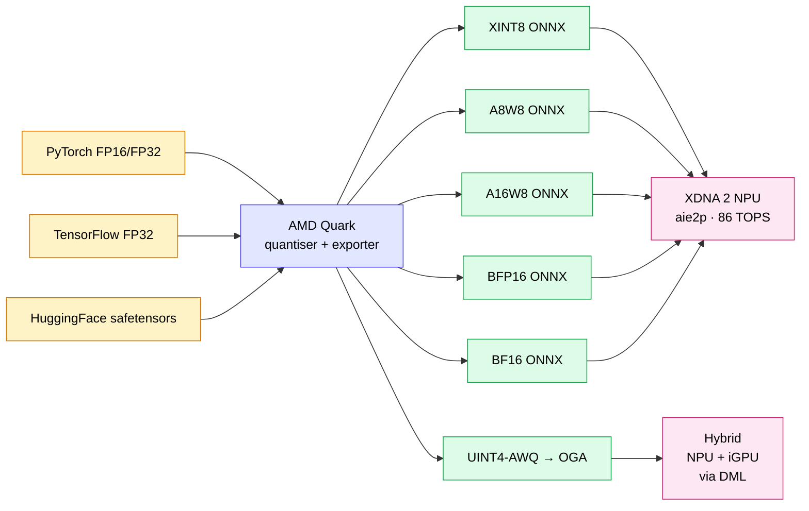
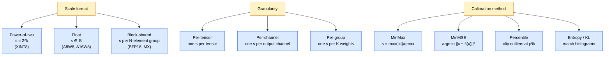
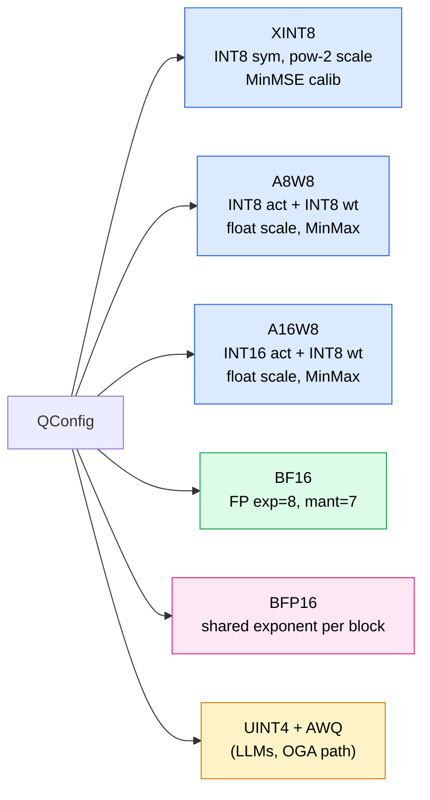
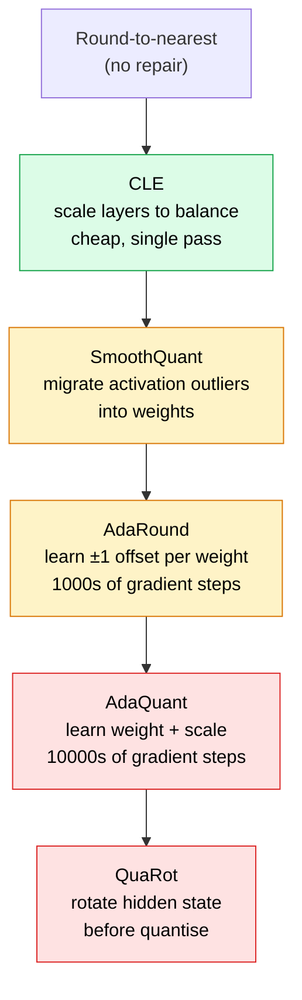
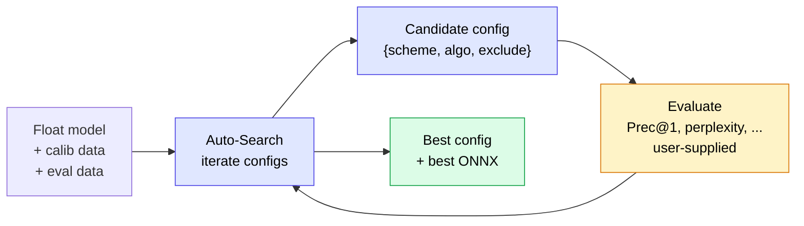
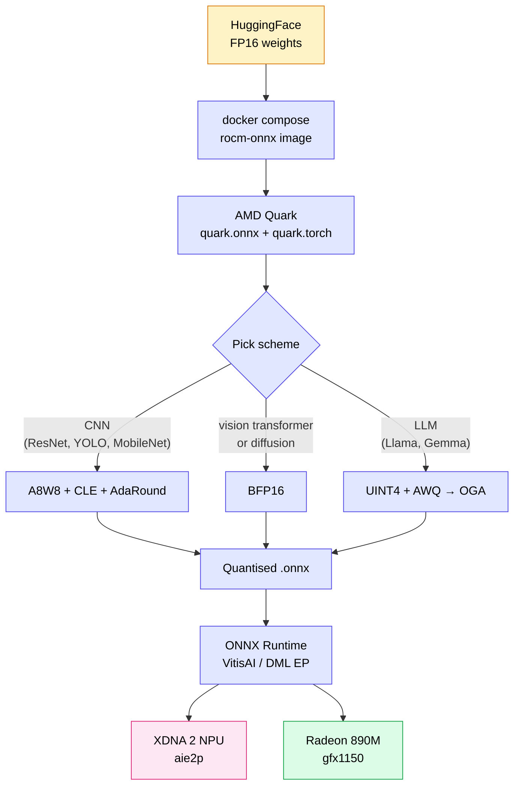

The Minisforum AI X1 Pro-470 — *OJAI* in earlier posts[^ojitha-rocm] — has three compute engines sharing one 64 GiB UMA pool: a 12-core Zen 5 CPU, a `gfx1150` Radeon 890M iGPU, and an `aie2p` XDNA 2 NPU rated at 86 TOPS. The interesting one for deployment is the NPU. It does not run FP16 transformer code paths like the iGPU does under vLLM[^ojitha-gemma4]; it wants **quantised** integer or block-float operators, and it wants them in **ONNX** shape, routed by the Ryzen AI runtime.

That gap — getting an FP32 / FP16 PyTorch model into a form the NPU actually likes — is what **AMD Quark** is built for.

<!--more-->

* TOC
{:toc}

> **BIOS update note.** The earlier ROCm post[^ojitha-rocm] was written on BIOS **1.00**; today I flashed the Minisforum AI X1 Pro-470 to BIOS **1.01**. After the update `rocminfo` still reports `gfx1150` with 16 CUs at 3100 MHz max clock and the `aie2p` agent with `RyzenAI-npu4` marketing name — the agent topology is unchanged — but the IFWI on the GPU now reports `STRIX_B0_GENERIC` build date `2025/08/14` and `amd-smi` reads ROCm `7.2.0` with `MIGraphX 2.15.0.dev+20250912-17-195-g1afd1b89c` cleanly. If you skipped the BIOS update, *fix UMA to ≥ 32 GiB* before running anything quantised — vLLM and the Ryzen AI runtime both die silently when `/sys/module/amdgpu/version` is missing on dynamic VRAM[^ollama-issue].
{:.warn}

---


# Part I — Why Quark, why now

## The deployment gap

The Gemma 4 E4B run[^ojitha-gemma4] uses FP16 weights on the iGPU and tops out around 6–11 tok/s decode — bandwidth-bound on DDR5. That path leaves the NPU idle. The NPU's compute density only shows up when the model is **integer-quantised** (INT8, UINT4) or in a **block-float** format (BFP16) it can pipeline natively.



Quark is **the** quantiser that produces models the Ryzen AI runtime will actually load[^quark-quickstart]. Everything in this post is its `quark.onnx` and `quark.torch` Python APIs aimed at the *Ryzen AI* deployment target — not the AMD Instinct path, which uses the same library but a different config family.

## The four problems Quark solves

| Problem | What Quark does |
| --- | --- |
| **Numeric format** | Maps FP32/FP16 tensors into INT8, INT16, UINT4, BF16, or BFP16 — chosen per op-type, per layer, per group. |
| **Scale calibration** | Walks a representative dataset through the model and records activation min/max/percentile/MSE statistics, then derives per-tensor or per-channel scales. |
| **Accuracy repair** | Applies CLE, AdaRound, AdaQuant, SmoothQuant, GPTQ, AWQ, or QuaRot to recover the accuracy the naive round-to-nearest loses. |
| **Export** | Writes a Ryzen-AI-compatible `.onnx` (or HF safetensors, or GGUF) — including the operator metadata the NPU compiler needs to schedule onto AIE tiles. |


# Part II — Quantisation, with math

## The base mapping

A real-valued tensor $x \in \mathbb{R}^{n}$ maps to a quantised integer tensor $\hat{x} \in \mathbb{Z}^{n}$ through

$$
\hat{x} \;=\; \operatorname{round}\!\bigl( x / s \bigr) + z, \qquad
\tilde{x} \;=\; s \cdot (\hat{x} - z)
\tag{1}
$$

where $s \in \mathbb{R}_{>0}$ is the **scale**, $z \in \mathbb{Z}$ is the **zero-point**, and $\tilde{x}$ is the dequantised reconstruction. The quantisation error is $e = x - \tilde{x}$, and minimising $\mathbb{E}[\|e\|_2^2]$ — or some weighted variant — is what every calibration algorithm in Quark is ultimately doing.

**Symmetric** quantisation sets $z = 0$ and stores only $s$:

$$
\hat{x} \;=\; \operatorname{clip}\!\Bigl(\operatorname{round}(x / s),\, -2^{b-1},\, 2^{b-1}-1\Bigr)
\tag{2}
$$

**Asymmetric** quantisation keeps a non-zero $z$ so the representable range straddles whatever empirical interval the calibration data actually lives in.

## Scale strategies

Quark exposes three independent axes when configuring a quantiser:



The choice is *jointly* a compute and accuracy decision. Power-of-two scales replace `floor(x * s)` with a cheap bit-shift inside the NPU's AIE tiles[^quark-xint8]. Float scales pay a real multiply per element but represent dynamic range that bit-shifts can't. Block-shared scales hit the sweet spot for transformer activations whose magnitude varies smoothly along the sequence dimension.

## Why per-channel for weights is non-negotiable

Convolution and matmul weights have very different per-output-channel statistics. A single scalar $s$ for an entire $W \in \mathbb{R}^{C_\text{out} \times C_\text{in} \times \ldots}$ blows the tails out for some channels and wastes resolution on others. Per-channel scales fix it:

$$
\hat{W}_{j, \cdot} \;=\; \operatorname{round}\!\bigl( W_{j, \cdot} / s_j \bigr), \qquad
s_j = \frac{\max_{k} |W_{j, k}|}{2^{b-1}-1}
\tag{3}
$$

This is the *default* in every Quark Ryzen-AI weight spec; you only deviate for the very few operators where per-tensor symmetric is required by a fused-op constraint in the downstream NPU compiler.

---


# Part III — The Quark Ryzen-AI quantisation schemes

Five schemes are produced for Ryzen-AI deployment. Each maps to a different NPU compute path.



## XINT8 — power-of-two scales

XINT8 quantises both activations and weights to symmetric INT8 with $s = 2^{-k}$ for integer $k \ge 0$. The dequantise step then becomes

$$
\tilde{x} \;=\; \hat{x} \cdot 2^{-k} \;\equiv\; \hat{x} \gg k
$$

— a right-shift inside the AIE. This is why XINT8 is the fastest scheme on the XDNA NPU: there is no multiply in the dequantise path, only shifts. The cost is **dynamic range**: power-of-two scales can only represent values whose magnitude is well-bounded, so XINT8 needs the **MinMSE** calibration method to pick $k$ that minimises reconstruction error over the activation distribution, not the looser MinMax extremes[^quark-xint8] [^quark-best-practice].

```python
from quark.onnx import ModelQuantizer, QConfig

quantization_config = QConfig.get_default_config("XINT8")
quantizer = ModelQuantizer(quantization_config)
quantizer.quantize_model(
    "models/resnet50-v1-12.onnx",
    "models/resnet50-v1-12_xint8.onnx",
    calib_data_reader,
)
```

## A8W8 — float scales, INT8 both sides

A8W8 keeps activations and weights at INT8 but uses real-valued (FP32) scales. Calibration is MinMax. This is the **default** Ryzen-AI scheme — slightly slower than XINT8 in the NPU dequantise path (a real multiply per element) but consistently more accurate on CNNs because it represents the actual activation extrema rather than rounding to the nearest power of two[^quark-a8w8].

| Aspect | XINT8 | A8W8 |
| --- | --- | --- |
| Activation type | INT8 sym | INT8 sym |
| Weight type | INT8 sym | INT8 sym |
| Scale | $2^{-k}$ | $s \in \mathbb{R}_{>0}$ |
| Calibration | MinMSE | MinMax |
| NPU dequant | bit-shift | multiply |
| Typical Top-1 drop on ResNet-50 | ~0.6 % | ~0.5 % |


## A16W8 — wider activations

A16W8 pushes activations to INT16 while keeping weights at INT8. Activations carry more of the dynamic range than weights — they're sums of many quantised products and tend to grow — so allowing the activation pathway 65,536 levels instead of 256 buys back most of the loss caused by aggressive weight compression, *without* paying for the larger weight buffers[^quark-a8w8].

I reach for A16W8 when the FP32 baseline already accumulates in FP32 (most BatchNorm-heavy CNNs) and the output of a residual block has a long-tailed distribution. The model size is barely bigger than A8W8 — only the activation **scale tables** widen — and Top-1 typically lands within 0.2 % of the float baseline.

## BF16 — drop precision, keep range

BF16 has the same 8-bit exponent as FP32 (same dynamic range) but only 7-bit mantissa (much less precision). For the NPU, BF16 is *not* really "quantisation" in the dynamic-range-clipping sense — it's a precision reduction. Quark's `BF16` config converts every weight, bias, and activation tensor that the downstream Ryzen-AI compiler will lower to a BF16 op[^quark-bf16-convert].

$$
\text{FP32}: \underbrace{1}_{\text{sign}}\, \underbrace{8}_{\text{exp}}\, \underbrace{23}_{\text{mantissa}}
\quad\Longrightarrow\quad
\text{BF16}: \underbrace{1}_{\text{sign}}\, \underbrace{8}_{\text{exp}}\, \underbrace{7}_{\text{mantissa}}
$$

Use BF16 when the model has **wild activation distributions** that defeat INT8 calibration — common in some attention-heavy vision transformers and most diffusion models — and you want the NPU but cannot tolerate the integer rounding noise.

## BFP16 — block floating point

BFP16 shares one exponent across a block of mantissas. A length-8 block stores 8 mantissas plus one shared 8-bit exponent (so ~17 bits per value averaged, hence "BFP16"). The reconstruction is

$$
\tilde{x}_i \;=\; m_i \cdot 2^{e_{\text{shared}}}, \qquad i \in \{0, 1, \dots, 7\}
$$

where $m_i$ is the per-element mantissa and $e_\text{shared}$ is the block exponent. This format is built for activations whose magnitude varies smoothly along a tensor axis — exactly the structure transformer self-attention produces. The NPU's AIE2 tiles pipeline a BFP16 dot-product natively[^quark-best-practice].

## UINT4 + AWQ — the LLM path

LLMs are not CNNs. The weight distribution has long tails, the activation distribution has a small handful of "salient" outlier channels that carry most of the signal, and the cost function (next-token NLL) is unforgiving of channel-level distortion. Static INT8 PTQ on a 7 B model usually loses 1–3 perplexity points; UINT4 PTQ without help loses 5–10.

**AWQ — Activation-aware Weight Quantization** — fixes this by **scaling weights inversely** to the magnitude of the activations that multiply them, so that the salient channels are preserved through quantisation. Formally, for a linear layer $y = W x$ AWQ finds a per-channel scaling $s \in \mathbb{R}^{C_\text{in}}$ such that

$$
y \;=\; W x \;=\; (W \cdot \operatorname{diag}(s)) \cdot (\operatorname{diag}(s)^{-1} x)
\tag{4}
$$

is mathematically identical but quantises $W \cdot \operatorname{diag}(s)$ much better because the high-impact channels have been scaled up before rounding[^quark-uint4-oga]. Quark applies AWQ in `--quant_algo awq` with default group size 128:

```bash
python3 quantize_quark.py \
  --model_dir <hf-checkpoint> \
  --output_dir <quark-output> \
  --quant_scheme uint4_wo_128 \
  --num_calib_data 128 \
  --quant_algo awq \
  --dataset pileval_for_awq_benchmark \
  --seq_len 512 \
  --model_export hf_format \
  --data_type float16 \
  --custom_mode awq
```

The `_wo_128` suffix means **weight-only, group size 128**: every 128 contiguous weights along the input dimension share one float scale. Smaller groups (32 or 64) are available and improve accuracy at the cost of more scale-table memory[^quark-uint4-oga]. Group sizes can even differ per-layer — typically `lm_head` benefits from group 32 while the bulk of the transformer is fine at 128.

Once Quark has emitted the UINT4 safetensors, the **ONNX Runtime GenAI Model Builder** packages them into the ONNX shape OGA expects:

```bash
python3 -m onnxruntime_genai.models.builder \
  -i  <quark-output> \
  -o  <onnx-output> \
  -p  int4 \
  -e  dml      # → hybrid NPU + iGPU via DirectML
```

`-e dml` produces FP16-activation ONNX wired for the **hybrid NPU + iGPU** flow. `-e cpu` produces FP32-activation ONNX for **NPU-only** flow. Both are UINT4 weights — the difference is which device the activation arithmetic lands on[^quark-uint4-oga].

---


# Part IV — Accuracy-repair algorithms

Naive round-to-nearest is the *worst* way to quantise. Quark ships five repair algorithms, ordered roughly by how much work they do.



## CLE — Cross-Layer Equalization

When two consecutive layers have radically different weight magnitudes — typical of ReLU networks — quantising both per-tensor wastes resolution on the bigger one. CLE rescales successive layers so that their per-channel dynamic ranges are balanced. The transformation is **mathematically equivalent** at FP32; it only changes how rounding errors distribute. For a Conv → ReLU → Conv triple with positive activations, CLE finds a positive scalar $\alpha_j$ per channel and rewrites

$$
W^{(2)}_{\cdot, j} \;\leftarrow\; W^{(2)}_{\cdot, j} \cdot \alpha_j, \qquad
W^{(1)}_{j, \cdot} \;\leftarrow\; W^{(1)}_{j, \cdot} / \alpha_j
$$

so both weight tensors end up with comparable channel magnitudes before quantisation[^quark-best-practice]. It is the cheapest accuracy boost in the toolkit — a single pass, no gradient descent — and the documentation recommends running it before anything more expensive.

```bash
python quantize_quark.py --input_model_path models/resnet50.onnx \
                          --calib_data_path calib_data \
                          --output_model_path models/resnet50_xint8_cle.onnx \
                          --config XINT8 --cle
```

## AdaRound — adaptive rounding

Naive rounding always picks the nearest integer. AdaRound observes that *flipping* some weights to the second-nearest integer can reduce the layer's output reconstruction error, because rounding errors interact across channels through the next layer's matmul. AdaRound learns a per-weight binary flip variable by minimising

$$
\mathcal{L}_\text{ada} \;=\; \bigl\| W x - \hat{W}(\theta)\, x \bigr\|_2^2 \;+\; \lambda \cdot R(\theta)
$$

where $\hat{W}(\theta)$ is the quantised weight under the learned rounding $\theta \in [0,1]^{|W|}$ and $R(\theta)$ is a regulariser pushing $\theta_i$ toward 0 or 1. Default Quark settings are 1000 iterations at LR $0.1$ on CPU — slow but still hours, not days[^quark-resnet50-tutorial].

```bash
python quantize_quark.py --config XINT8 --adaround \
  --learning_rate 0.1 --num_iters 3000 ...
```

Effect: on the ResNet-50 example in the Quark docs, AdaRound brings the post-quantisation L2 reconstruction loss from $9.78$ (plain A8W8) down to $1.43$[^quark-quickstart].

## AdaQuant — adaptive quantisation

AdaQuant extends AdaRound by letting the **scale and zero-point** themselves be learnable, not just the rounding direction:

$$
\mathcal{L}_\text{aq} \;=\; \bigl\| W x - \operatorname{Q}_{s, z}\!(W)\, x \bigr\|_2^2
$$

with $s$ and $z$ in the gradient. This is the heaviest tool in the box — default 10,000 iterations at LR $10^{-5}$ — and it pushes the same ResNet-50 example down to L2 loss $1.15$. Use it when AdaRound + CLE leaves you 0.5–1 % short of the target Top-1[^quark-quickstart].

## SmoothQuant — activation outlier migration

For transformer LLMs, the trouble is activation outliers — a handful of dimensions of the hidden state that take values 10–100× larger than the rest. SmoothQuant migrates that pressure into the weights, where per-channel quantisation can absorb it. For a linear layer:

$$
y \;=\; W x \;=\; \bigl(W \cdot \operatorname{diag}(s)\bigr)\bigl(\operatorname{diag}(s)^{-1} x\bigr)
$$

— the same algebraic identity AWQ uses, but with a different choice of $s$ aimed at flattening activations rather than amplifying salient weights. The two algorithms are duals; for LLMs Quark prefers AWQ for UINT4 weight-only paths and SmoothQuant for A8W8 paths.

---


# Part V — Auto-Search

For all the tuning knobs above, the right combination is model-dependent. Quark ships an **automatic search** that tries combinations of scheme + algorithm + per-node exclusions, evaluates each against a user-defined accuracy metric, and returns the Pareto-best configuration[^quark-resnet50-tutorial].



The Auto-Search workflow for the **ResNet-50** example reaches **Top-1 73.56 %** vs. an FP32 baseline of **74.11 %** — a 0.55-point drop while shrinking the model from **97.8 MB → 25.6 MB**[^quark-resnet50-tutorial]. The point isn't the absolute numbers; it's that the search finds them automatically, without hand-tuning AdaRound iteration counts per layer.

```python
# Sketch — the actual evaluator is application-specific
from quark.onnx import AutoSearch, QConfig

search = AutoSearch(
    base_config="A8W8",
    candidate_algos=["cle", "adaround", "adaquant"],
    target_metric_fn=lambda m: top1_imagenet(m),
    metric_threshold=0.74,    # accept any config within 0.74 Top-1
    max_trials=12,
)
best_config, best_model_path = search.run(
    float_model_path="models/resnet50-v1-12.onnx",
    calib_data_reader=calib_data_reader,
    eval_loader=val_loader,
)
```

For the **YOLOv8** and **MobileNetv2-50** variants, the same machinery applies with a different metric (mAP and Top-1 respectively). For LLMs the search loop swaps in perplexity on a held-out chunk of the calibration corpus[^quark-resnet50-tutorial].

---


# Part VI — The OJAI quantisation pipeline

Putting the pieces together for the Minisforum AI X1 Pro-470:



## Setup on top of the existing ROCm container

The earlier post[^ojitha-rocm] established the `rocm-pytorch` and `rocm-onnx` Docker images. To add Quark, extend the existing Dockerfile:

```dockerfile
FROM rocm/pytorch:rocm7.2_ubuntu24.04_py3.12_pytorch_release_2.9.1

# Install MIGraphX + ONNX Runtime MIGraphX EP (as before)
RUN apt-get update && apt-get install -y \
    migraphx migraphx-dev half \
    && rm -rf /var/lib/apt/lists/*

RUN pip3 install numpy==1.26.4

RUN pip3 uninstall -y onnxruntime-migraphx || true && \
    pip3 install onnxruntime-migraphx \
      -f https://repo.radeon.com/rocm/manylinux/rocm-rel-7.2/

# NEW: install Quark + OGA model builder
RUN pip3 install amd-quark onnxruntime-genai

WORKDIR /workspace
```

```yaml
# docker-compose.yaml
services:
  quark:
    build: .
    image: quark-ryzenai:rocm7.2
    cap_add: [SYS_PTRACE]
    security_opt: [seccomp=unconfined]
    devices: [/dev/kfd, /dev/dri]
    group_add: [video, render]
    ipc: host
    shm_size: 16g
    volumes:
      - ./workspace:/workspace
      - ./hf-cache:/root/.cache/huggingface
```

Smoke-test:

```bash
docker compose run --rm quark python3 -c \
  "from quark.onnx import ModelQuantizer, QConfig; \
   print(QConfig.get_default_config('A8W8'))"
```

## Recipe 1 — ResNet-50 to XINT8 with CLE + AdaRound

Following the Quark docs[^quark-resnet50-tutorial], the minimal pipeline is:

```python
from quark.onnx import (
    AdaRoundConfig, CLEConfig, ModelQuantizer,
    QConfig, QLayerConfig, XInt8Spec,
)

algos = [
    CLEConfig(),
    AdaRoundConfig(learning_rate=0.1, num_iterations=3000),
]

quant_config = QConfig(
    global_config=QLayerConfig(activation=XInt8Spec(), weight=XInt8Spec()),
    algo_config=algos,
)

quantizer = ModelQuantizer(quant_config)
quantizer.quantize_model(
    "models/resnet50-v1-12.onnx",
    "models/resnet50_xint8_cle_adaround.onnx",
    calib_data_reader,    # ImageNet 1000 images
)
```

Expected outcome on the OJAI machine, replicating the Quark tutorial: **97.8 MB → 25.6 MB**, Top-1 within ~0.6 % of FP32, ready to load on the NPU through the VitisAI EP[^quark-resnet50-tutorial].

## Recipe 2 — Llama-style model to UINT4 with AWQ

```bash
# Inside the quark container
cd /workspace/llm_ptq

# Step 1 — quantise weights with AWQ
python3 quantize_quark.py \
  --model_dir   /root/.cache/huggingface/hub/<llama-folder> \
  --output_dir  /workspace/out/llama-uint4-awq \
  --quant_scheme uint4_wo_128 \
  --num_calib_data 128 \
  --quant_algo  awq \
  --dataset     pileval_for_awq_benchmark \
  --seq_len     512 \
  --model_export hf_format \
  --data_type   float16 \
  --custom_mode awq

# Step 2 — package for OGA hybrid NPU+iGPU path
python3 -m onnxruntime_genai.models.builder \
  -i  /workspace/out/llama-uint4-awq \
  -o  /workspace/out/llama-uint4-onnx \
  -p  int4 \
  -e  dml
```

The `-e dml` flag yields an ONNX wired for the **hybrid** NPU + iGPU flow: weights live as UINT4 on the NPU, activations stream through the iGPU at FP16. On a 7B-class model the typical resident memory is ~4 GB weights + ~1–2 GB KV cache, leaving plenty of headroom in the 64 GiB UMA pool[^quark-uint4-oga].

## Where each scheme should run

| Model class | Scheme | Algorithm stack | Where it lands |
| ---- | ---- | ---- | ---- |
| Image classification (ResNet, MobileNet) | XINT8 | CLE + AdaRound | NPU |
| Object detection (YOLOv8) | A8W8 | CLE + AdaRound | NPU |
| Vision transformer | BFP16 | (often none) | NPU |
| Diffusion U-Net | BF16 | (range > precision) | NPU |
| 1–8 B dense LLM | UINT4 + AWQ | AWQ | Hybrid NPU+iGPU (DML) |
| MoE / 26 B+ LLM | FP16 (vLLM) | — | iGPU only |


# Part VII — Verifying the result

After quantising, two checks matter: **the model still loads** and **the metric is within tolerance**.

## Load test

```python
import onnxruntime as ort

sess = ort.InferenceSession(
    "models/resnet50_xint8_cle_adaround.onnx",
    providers=["MIGraphXExecutionProvider", "CPUExecutionProvider"],
)
print("Inputs :", [(i.name, i.type, i.shape) for i in sess.get_inputs()])
print("Outputs:", [(o.name, o.type, o.shape) for o in sess.get_outputs()])
```

If MIGraphX rejects an op, the runtime falls back to CPU automatically — but you've then quantised for nothing. Read the warnings.

## Accuracy delta

Quark ships a `quark.onnx.tools.evaluate` helper that runs the float and quantised models on a common input set and reports L2 loss. The pattern from the Quick Start guide[^quark-quickstart]:

```bash
# Dump outputs for both models
python -m quark.onnx.tools.inference \
  --input_model_path models/resnet50-v1-12.onnx \
  --calib_data_path  calib_data \
  --output_path      float_output

python -m quark.onnx.tools.inference \
  --input_model_path models/resnet50_xint8_cle_adaround.onnx \
  --calib_data_path  calib_data \
  --output_path      quantized_output

# Compare
python -m quark.onnx.tools.evaluate \
  --baseline_results_folder  float_output \
  --quantized_results_folder quantized_output
```

The benchmark table from the Quark Quick Start sets the order of magnitude to expect:

| Config | Model size | L2 loss vs FP32 |
| --- | --- | --- |
| Float ResNet-50 | 99 MB | 0 |
| Random-data quant | 25 MB | 30.26 |
| A8W8 + calibration | 25 MB | 9.78 |
| A8W8 + AdaRound | 25 MB | 1.43 |
| A8W8 + AdaQuant | 25 MB | **1.15** |

# Part VIII — The cover diagram, embedded SVG

The five-scheme decision tree from Part III, as a one-shot SVG to drop into the post's hero block:

<svg xmlns="http://www.w3.org/2000/svg" viewBox="0 0 720 420" role="img" aria-label="Quark Ryzen-AI quantisation scheme decision tree" style="max-width:100%;height:auto;">
  <defs>
    <style>
      .box { fill:#ffffff; stroke:#0f172a; stroke-width:1.5; rx:8; ry:8; }
      .root { fill:#fef3c7; stroke:#d97706; stroke-width:1.5; }
      .int { fill:#dbeafe; stroke:#2563eb; }
      .fp  { fill:#dcfce7; stroke:#16a34a; }
      .blk { fill:#fce7f3; stroke:#db2777; }
      .llm { fill:#fef3c7; stroke:#d97706; }
      .label { font:600 13px/1.2 -apple-system,BlinkMacSystemFont,Segoe UI,sans-serif; fill:#0f172a; text-anchor:middle; }
      .sub   { font:11px -apple-system,BlinkMacSystemFont,Segoe UI,sans-serif; fill:#475569; text-anchor:middle; }
      .edge  { stroke:#94a3b8; stroke-width:1.5; fill:none; }
    </style>
  </defs>
  <!-- root -->
  <rect class="box root" x="290" y="20"  width="140" height="56"/>
  <text class="label" x="360" y="45">QConfig</text>
  <text class="sub"   x="360" y="62">quark.onnx</text>

  <!-- edges -->
  <path class="edge" d="M360 76 C 100 110, 100 150, 100 170"/>
  <path class="edge" d="M360 76 C 240 110, 240 150, 240 170"/>
  <path class="edge" d="M360 76 C 380 110, 380 150, 380 170"/>
  <path class="edge" d="M360 76 C 520 110, 520 150, 520 170"/>
  <path class="edge" d="M360 76 C 660 110, 660 150, 660 170"/>

  <!-- XINT8 -->
  <rect class="box int" x="30"  y="170" width="140" height="70"/>
  <text class="label" x="100" y="195">XINT8</text>
  <text class="sub"   x="100" y="212">INT8 sym · s = 2^k</text>
  <text class="sub"   x="100" y="228">MinMSE calib</text>

  <!-- A8W8 -->
  <rect class="box int" x="170" y="170" width="140" height="70"/>
  <text class="label" x="240" y="195">A8W8</text>
  <text class="sub"   x="240" y="212">INT8 act + INT8 wt</text>
  <text class="sub"   x="240" y="228">float scale · MinMax</text>

  <!-- A16W8 -->
  <rect class="box int" x="310" y="170" width="140" height="70"/>
  <text class="label" x="380" y="195">A16W8</text>
  <text class="sub"   x="380" y="212">INT16 act + INT8 wt</text>
  <text class="sub"   x="380" y="228">float scale</text>

  <!-- BF16 -->
  <rect class="box fp" x="450" y="170" width="140" height="70"/>
  <text class="label" x="520" y="195">BF16</text>
  <text class="sub"   x="520" y="212">exp 8 · mantissa 7</text>
  <text class="sub"   x="520" y="228">precision drop</text>

  <!-- BFP16 -->
  <rect class="box blk" x="590" y="170" width="120" height="70"/>
  <text class="label" x="650" y="195">BFP16</text>
  <text class="sub"   x="650" y="212">shared exp</text>
  <text class="sub"   x="650" y="228">per block</text>

  <!-- UINT4 -->
  <rect class="box llm" x="220" y="290" width="280" height="80"/>
  <text class="label" x="360" y="318">UINT4 + AWQ  →  OGA</text>
  <text class="sub"   x="360" y="338">group 32 / 64 / 128 · activation-aware scaling</text>
  <text class="sub"   x="360" y="354">hybrid NPU+iGPU via DirectML  ·  for LLMs</text>

  <!-- LLM edge from root -->
  <path class="edge" d="M360 76 C 360 200, 360 230, 360 290"/>

  <!-- target band -->
  <rect class="box" x="30" y="380" width="660" height="28" fill="#f8fafc" stroke="#cbd5e1"/>
  <text class="sub" x="360" y="398">Target: AMD XDNA 2 NPU (aie2p, RyzenAI-npu4) and Radeon 890M iGPU (gfx1150), unified via Ryzen AI runtime</text>
</svg>

# Closing

The OJAI machine's NPU does nothing until a model is quantised. Quark is the bridge: it picks the numeric format, calibrates scales, runs the repair algorithms that recover the accuracy naïve rounding throws away, and exports an ONNX the Ryzen AI runtime will accept. For CNNs the well-trodden path is A8W8 (or XINT8 for the bit-shift speedup) with CLE then AdaRound; for transformer LLMs it is UINT4 weight-only with AWQ feeding the OGA Model Builder. Auto-Search resolves the combinatorial knob-tuning when none of those defaults are quite enough.

The next post in this series will run a concrete A8W8 ResNet-50 and a UINT4-AWQ Gemma-class model on the OJAI NPU end-to-end and measure the actual latency split between `gfx1150` and `aie2p`.

[^ojitha-rocm]: Ojitha Hewa Kumanayaka. *Running AMD ROCm AI Workloads locally.* 7 Mar 2026. [/ai/2026/03/07/ContainerRocm.html](/ai/2026/03/07/ContainerRocm.html){:target="_blank" rel="noopener noreferrer"}
[^ojitha-gemma4]: Ojitha Hewa Kumanayaka. *Running Gemma 4 E4B on the AMD ROCm.* 5 May 2026. [/ai/2026/05/05/Gemma4.html](/ai/2026/05/05/Gemma4.html){:target="_blank" rel="noopener noreferrer"}
[^quark-quickstart]: AMD. *Quick Start for Ryzen AI — AMD Quark 0.11.1.* [https://quark.docs.amd.com/latest/supported_accelerators/ryzenai/tutorial_quick_start_for_ryzenai.html](https://quark.docs.amd.com/latest/supported_accelerators/ryzenai/tutorial_quick_start_for_ryzenai.html){:target="_blank" rel="noopener noreferrer"}
[^quark-best-practice]: AMD. *Best Practice for Ryzen AI in AMD Quark ONNX.* [https://quark.docs.amd.com/latest/supported_accelerators/ryzenai/ryzen_ai_best_practice.html](https://quark.docs.amd.com/latest/supported_accelerators/ryzenai/ryzen_ai_best_practice.html){:target="_blank" rel="noopener noreferrer"}
[^quark-resnet50-tutorial]: AMD. *Auto-Search for Ryzen AI ONNX Model Quantization — ResNet-50 tutorial.* [https://quark.docs.amd.com/latest/tutorials/onnx/ryzen_ai/resnet50/onnx_ryzen_ai_resnet50_tutorial.html](https://quark.docs.amd.com/latest/tutorials/onnx/ryzen_ai/resnet50/onnx_ryzen_ai_resnet50_tutorial.html){:target="_blank" rel="noopener noreferrer"}
[^quark-uint4-oga]: AMD. *Quantizing LLMs for ONNX Runtime GenAI.* [https://quark.docs.amd.com/latest/supported_accelerators/ryzenai/tutorial_uint4_oga.html](https://quark.docs.amd.com/latest/supported_accelerators/ryzenai/tutorial_uint4_oga.html){:target="_blank" rel="noopener noreferrer"}
[^quark-bf16-convert]: AMD. *FP32/FP16 to BF16 Model Conversion.* [https://quark.docs.amd.com/latest/supported_accelerators/ryzenai/tutorial_convert_fp32_or_fp16_to_bf16.html](https://quark.docs.amd.com/latest/supported_accelerators/ryzenai/tutorial_convert_fp32_or_fp16_to_bf16.html){:target="_blank" rel="noopener noreferrer"}
[^quark-xint8]: AMD. *Power-of-Two Scales (XINT8) Quantization.* [https://quark.docs.amd.com/latest/supported_accelerators/ryzenai/tutorial_xint8_quantize.html](https://quark.docs.amd.com/latest/supported_accelerators/ryzenai/tutorial_xint8_quantize.html){:target="_blank" rel="noopener noreferrer"}
[^quark-a8w8]: AMD. *Float Scales (A8W8 and A16W8) Quantization.* [https://quark.docs.amd.com/latest/supported_accelerators/ryzenai/tutorial_a8w8_and_a16w8_quantize.html](https://quark.docs.amd.com/latest/supported_accelerators/ryzenai/tutorial_a8w8_and_a16w8_quantize.html){:target="_blank" rel="noopener noreferrer"}
[^ollama-issue]: ollama/ollama GitHub issue #11451. *GPU not detected on Ryzen AI 300 (gfx1150) with Dynamic VRAM, but works with Fixed VRAM.* [https://github.com/ollama/ollama/issues/11451](https://github.com/ollama/ollama/issues/11451){:target="_blank" rel="noopener noreferrer"}
