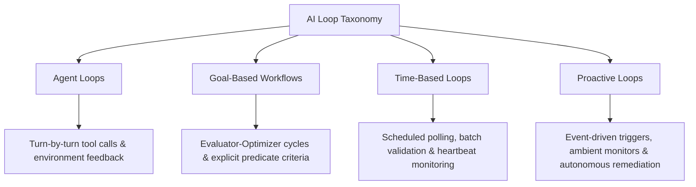
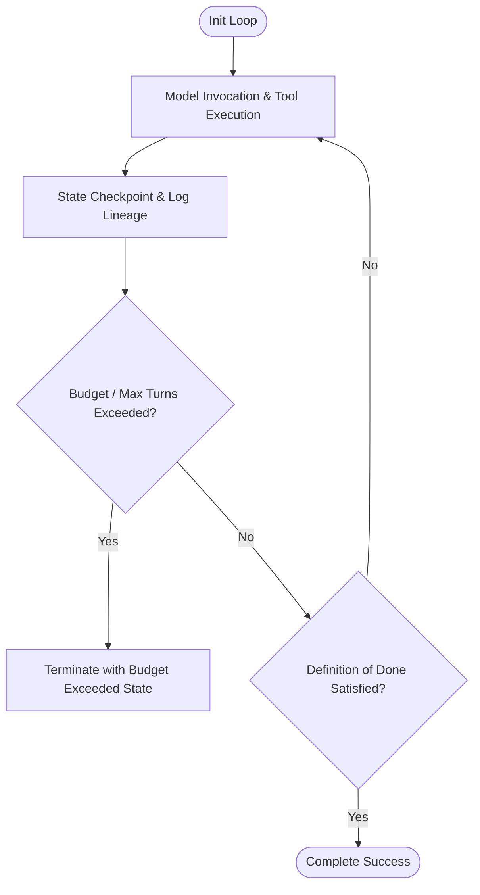
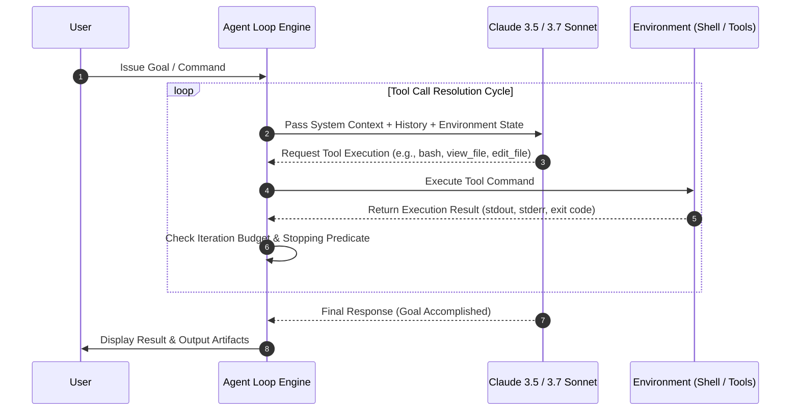
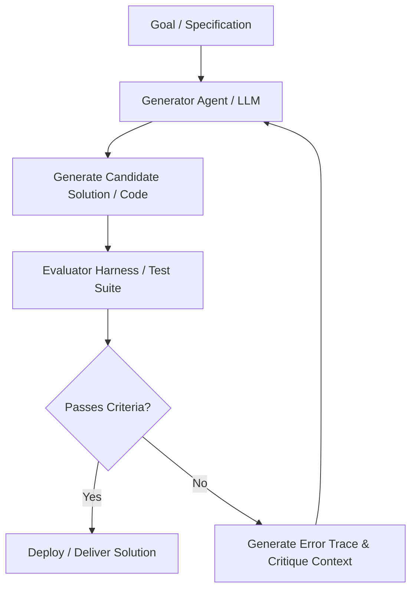
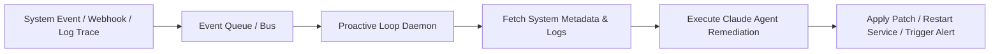
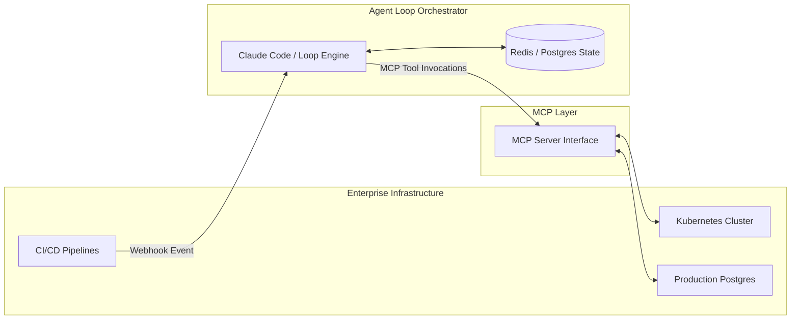

{% include video-summary.html
   id="7RSiMIlOcaA"
   content="
The post covers the mechanics of loop engineering in Claude Code and agentic architectures. It details the four primary loop patterns—<strong>Agent Loops</strong>, <strong>Goal-Based Workflows</strong>, <strong>Time-Based Loops</strong>, and <strong>Proactive Loops</strong>—alongside essential engineering controls such as termination criteria (&quot;definition of done&quot;), token/iteration budgeting, state checkpoints, and safety guardrails. Additionally, the presentation compares continuous AI loops with traditional cron jobs, providing actionable guidance for integrating autonomous execution into production software pipelines.
" %}

<!--more-->

* TOC
{:toc}

## Getting Started with Loops

This technical post starting deep dive into the Anthropic webinar *“Startup Builds: Getting Started with Loops,”*[^1] featuring **Mark Nowicki** from Anthropic’s Applied AI team. As generative AI transitions from static single-turn prompt-response interactions to fully autonomous, multi-turn agentic systems, **Loops** have emerged as the foundational abstraction for sustained execution, goal-driven reasoning, and background processing in developer workflows.

### Industry Alignment & Audience Technical Profile

The technical readiness and current implementation strategies of attending AI Developers, foraward deployment engineers, and AI Architects results indicate that while many developers rely on simple prompt chains or standard API scripts, there is a rapidly growing shift toward stateful, multi-turn autonomous loops. Primary engineering pain points include *controlling non-deterministic execution paths, managing runaway API token costs, ensuring state persistence during failure, and establishing robust guardrails against infinite operational loops*{:rtxt}.

### Taxonomy of AI Loop Patterns

Mark introduces a formal taxonomy classifying AI loop architectures based on triggering mechanisms, evaluation conditions, and state transition behaviors:

1. **Agent Loops**: Step-by-step tool execution loops driven by environment feedback until a stopping tool or completion signal is triggered.
2. **Goal-Based Workflows**: Objective-driven evaluator-optimizer loops that run until an explicit predicate or benchmark metric is satisfied.
3. **Time-Based Loops**: Cron-like scheduled polling cycles that regularly assess systems, generate reports, or execute routine maintenance.
4. **Proactive Loops**: Event-driven ambient observers that continuously monitor real-time system state (e.g., telemetry, file system events, queue depth) and initiate mitigation tasks autonomously.

### Loop Engineering Fundamentals & Core Controls

#### Core Architecture Principles

Operating an LLM within a continuous loop shifts the failure mode from single-call API errors to compounding logical drift. To build resilient loops, software architects must implement three core operational primitives:

To mitigate this drift and build resilient, production-ready AI loops, software architects must implement three core operational primitives:

1. **Explicit Definition of Done:** Hard predicates (such as unit test suites passing, strict JSON schema validation, or clean compiler execution) evaluated by an independent verifier or deterministic rule engine, rather than relying solely on the LLM's internal assertion.
2. **Deterministic Token & Iteration Budgeting:** Mandatory enforcement of strict upper bounds for maximum iteration turns ($N_{\text{max}}$), total token consumption ($T_{\text{max}}$), and financial cost ($C_{\text{max}}$) per loop context execution.
3. **State Persistence & Checkpoints:** Systematically writing intermediate step outputs, environment snapshots, and modified artifact diffs to non-volatile storage to enable full replayability, step-back debugging, and state recovery upon failure.

> **Circuit Breakers & Termination Handlers**: Catching repeating identical tool invocations (stuck loops) and raising human-in-the-loop (HITL) flags when model context reaches convergence without satisfying completion conditions.

### Agent Loops in Action

#### Execution Dynamics

Agent loops represent the core engine of systems like **Claude Code**. The loop reads the user's high-level goal, executes tools, inspects the stdout/stderr return values from the local environment, and determines the next step dynamically.

#### Detailed Management Practices

Managing agent loops effectively requires controlling context window degradation. As the turn count increases, context compaction (summarization of historical messages) must preserve critical state variables while discarding redundant tool output logs. System prompts must explicitly dictate return schemas to ensure the agent outputs structured action objects rather than unconstrained conversational text.

### Goal-Based Workflows & Evaluator-Optimizer Cycles

#### Workflow Mechanics

Unlike unconstrained agent loops, Goal-Based Workflows couple a generative generator module with an objective evaluation harness (Evaluator-Optimizer pattern). The loop iterates until the candidate solution satisfies external assertion tests. In the Claude Code, you have to use `/goal ...`.

#### Live Code Refactoring & Unit Test Loop Recipe

> Mark demonstrates a live recipe where Claude Code refactors legacy code against a test harness. 

The loop operates under the following structure:

1. **Goal**: Refactor `service_module.py` to support asynchronous execution while ensuring all unit tests in `tests/test_service.py` pass.
2. **Evaluation Metric**: `pytest tests/test_service.py` returns exit code `0`.
3. **Execution Strategy**: The loop runs `pytest`. If tests fail, the stdout error trace is fed directly into Claude Code's context, which modifies `service_module.py` and immediately re-triggers `pytest`.
4. **Budget**: Maximum of 10 evaluation cycles.

---

### Time-Based Loops & Scheduled System Maintenance

#### Operational Patterns

Time-Based Loops shift AI from user-initiated interactions to automated background monitoring. Operating on defined temporal intervals ($\Delta t$), these loops ingest system health signals, analyze code drift, summarize daily telemetry, or perform dependency maintenance.

#### Use Cases & Implementation Architecture

* **Continuous Linting & Technical Debt Remediation**: Nightly scans of the codebase to update deprecated package methods, fix typing warnings, or refactor low-complexity modules.
* **Automated Triage & Dependency Upgrades**: Scheduled evaluation of open CVEs and incoming PRs, generating automated patch proposals with attached test verification.
* **Telemetry & System Health Verification**: Ingesting log traces over a rolling time window, analyzing anomalous log signatures with Claude, and posting structured digest reports to Slack or PagerDuty.

---

### Proactive Loops & Real-Time Event-Driven Remediation

#### Event-Driven Trigger Mechanisms

Proactive Loops operate as ambient infrastructure daemons. Rather than waking on a fixed temporal schedule, they listen on pub/sub channels, webhook events, or file system watchers (`inotify` / `fsevents`). When an event payload arrives, the loop spawns an agentic process to remediate issues autonomously.

#### Real-Time Codebase Auditing & Monitoring

During live demonstrations, a Proactive Loop monitors a git repository for commits. Upon detecting a push to `main`, the loop runs security vulnerability scanners. If a credential leak or injection vector is identified, the loop immediately generates a targeted hotfix commit, opens a draft pull request, and notifies the security team via an enterprise alerting channel.

---

### Architectural Deep-Dive: Proactive Loop Guardrails

#### Operational Safety Framework

Because proactive loops act autonomously in response to real-time events, robust guardrail engineering is necessary to prevent runaway system modifications or cascading system failures:

| Guardrail Layer | Mechanism | Implementation Technique |
| --- | --- | --- |
| **Execution Sandbox** | Containerized Isolation | Run loop execution engines inside short-lived, rootless Docker containers or Firecracker microVMs with restricted network egress. |
| **Deterministic Rules Engine** | Hard Scope Boundaries | Intercept proposed agent commands before execution. Block high-risk commands (e.g., `rm -rf *`, `DROP DATABASE`, modifying core CI/CD pipelines). |
| **Token & Financial Rate Limiting** | Sliding Window Throttling | Enforce continuous rate limits ($token / min,$ total API spend / hour) at the API proxy level. |
| **Human-in-the-Loop (HITL)** | Action Approval Gateways | Require explicit human approval via interactive messaging (Slack/Teams) before applying mutations to production environments. |

---

### Seamless Integration into Modern Enterprise Stacks

#### Framework Patterns & System Architecture

Integrating AI loops into existing developer pipelines requires separating orchestrator logic from model execution interfaces. Enterprise architects should adopt standard API abstractions (e.g., Model Context Protocol - MCP) to expose existing infrastructure tools (PostgreSQL databases, GitHub API, Kubernetes clusters) directly to Claude-driven loop engines.

---

### Architectural Trade-Offs: AI Loops vs. Traditional Cron Jobs

#### Comparative Evaluation

A common question for system architects is when to use standard deterministic cron jobs versus probabilistic AI loops.

| Architectural Dimension | Traditional Cron Jobs | Autonomous AI Loops |
| --- | --- | --- |
| **Execution Logic** | Hardcoded, static scripts (`sh`, `python`). | Dynamic context-aware decision paths using LLM reasoning. |
| **Input Handling** | Expects strictly structured inputs. Fails on unhandled schemas. | Gracefully parses unstructured, ambiguous, or multi-modal inputs. |
| **Self-Correction** | None. Fails on non-zero exit code. | Inspects stack traces, adjusts parameters, and re-executes automatically. |
| **Determinism & Cost** | Standard $O(1)$ computation cost; highly deterministic. | Variable cost per run based on LLM token count; probabilistic logic flow. |
| **Ideal Operational Domain** | Fixed ETL jobs, database backups, simple health pings. | Automated bug fixing, vulnerability mitigation, dynamic system triage. |

---

### Section 12: Q&A, Edge Cases, & Concluding Guidance

#### Key Q&A Takeaways

* **Handling Context Exhaustion**: When an agent loop approaches maximum context limits during long-running tasks, use a rolling sliding window combined with structured sub-task summaries. Delegate large sub-problems to child loops with clean context windows, returning only final execution receipts to the parent loop.
* **Flaky Verification Tests**: Never rely on a single verification run if tests are non-deterministic. Require $N$ consecutive successful verification passes before declaring a loop successfully completed.
* **Cost Optimizations**: Use lighter models (e.g., Claude 3.5 Haiku) for continuous evaluation or guardrail checking in the loop, reserving high-capability models (e.g., Claude 3.5/3.7 Sonnet) for core reasoning and code generation steps.

---

## 3. Core Architectural Takeaways & Actionable Summary

1. **Shift from Scripts to Loops**: Move from static single-turn prompts to stateful iterative loops with explicit evaluators.
2. **Standardize on the Four Loop Patterns**: Select the appropriate pattern (Agent, Goal-Based, Time-Based, Proactive) based on triggering conditions and domain complexity.
3. **Budget and Sandboxing are Non-Negotiable**: Enforce explicit maximum turn counts, token budgets, and containerized execution to avoid runaway execution costs and unintended system mutations.
4. **Decouple Tooling via MCP**: Use standardized interfaces to allow loops to safely interact with enterprise tools and production infrastructure.

[^1]: [Startup Builds: Getting Started with Loops](https://www.anthropic.com/webinars/startup-builds-getting-started-with-loops){:target="_blank" rel="noopener noreferrer}

{:gtxt: .message color="green"}
{:ytxt: .message color="yellow"}
{:rtxt: .message color="red"}