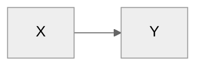
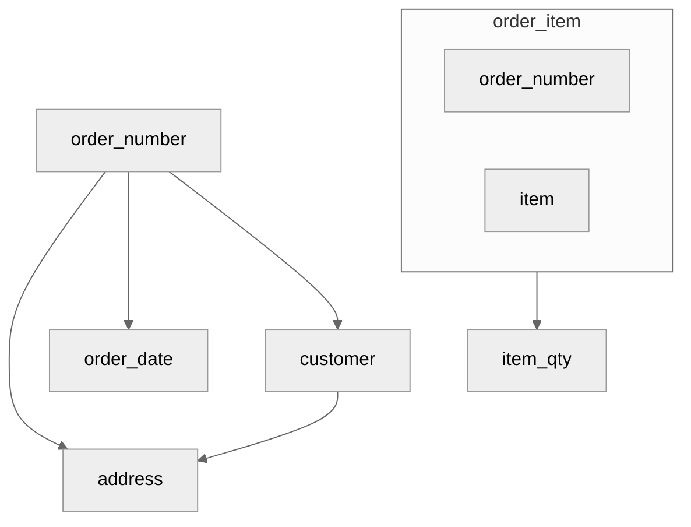
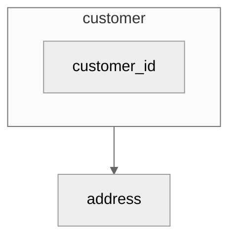
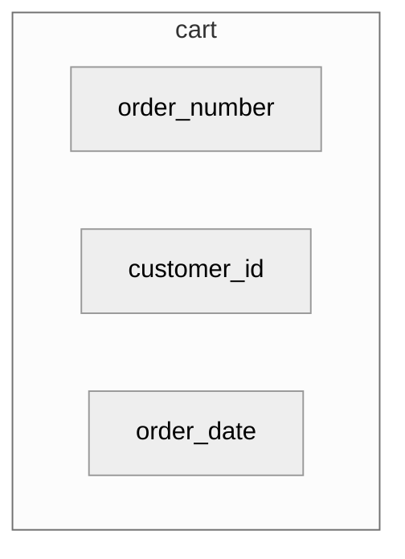
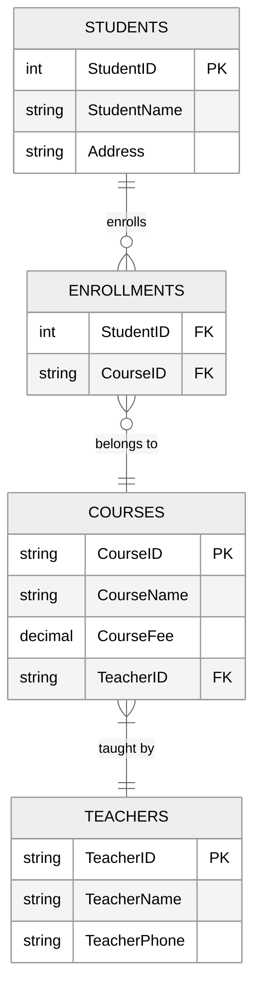

E. F. Codd proposed three normal forms: 1NF, 2NF and 3NF (1970). A revised definition (1974) was given by F. Boyce and Codd, which is known as the Boyce-Codd Normal Form (BCNF, which is 3.5NF) to distinguish it from the old definition of the third normal form. R. Faign introduced 4NF(1977) and 5NF(1979) and DKNF(1981). All the normal forms depend on functional dependency, but 4NF and 5NF have been proposed based on the concepts of multivalued dependency and joining dependency.

* TOC
{:toc}

<!--more-->

## Why Normalization?

The normalisation theory provides guidelines for assessing the quality of a database during the design process. 

> The normalisation [^2] applies a set of simple rules called Normal Forms (NF) to the relation schema.

A good schema has the following:

- Minimum redundancy
    - Insertion anomaly:
    - Deletion anomaly
    - Modification anomaly
- Fewer `null` values in Tuples

## Decomposition

The decomposition of relation schema $$R$$ defined as its replacement by a set of relation schemas such that each relation schema contains a subset of attributes of $$R$$. Ensure that each attribute in $$R$$ must appear in at least one relation schema $$R_{i}$$.


$$
\begin{aligned}\sum R_{i}=R\\
\end{aligned}
$$

This is called **attribute prevention**.

Let `X` and `Y` are subset of se of attributes of a relation $$R$$ , then an instance $$r$$ of $$R$$ satisfies functional dependency (FD) $$\left( FD\right) X\rightarrow Y$$, if and only if for any two tuples $$t_{1}$$ and $$t_{2}$$ in $$r$$ that have $$t_{1}[X] = t_{2}[X]$$ and $$t_{1}[Y] = t_{2}[Y]$$

> $$X\rightarrow Y$$ mean, `Y` is functionally dependent on `X` or `X` determine `Y`. Here `X` is determinant and `Y` is the dependent.

The FD diagram is




> The large set of FDs can reduce the efficiency of database system. Generally an $$\left( FD\right) A\rightarrow B$$ is trivial, if and only if $$B\subseteq A$$. Only **non-trivial dependencies** are considered. 				
> 									

For example, CART{order_number, order_date, item, item_qty, customer, address}.


## First Normal Form

A relation $$R$$ is said to be in 1NF if an only if the domains of all attributes of $$R$$ contain atomic values only.

Creating one tuple for each value in multivalued attributes in the CART is the example to show.


## Second Normal Form

This level depends on full FD. An attribute `Y` of relation schema $$R$$ is said to be **fully functional dependent** on attribute `X` $$(X \rightarrow Y)$$, if there is no `A`, where `A` is proper subset of `X` such that $$A\rightarrow Y$$, otherwise this is called **partial functional dependency**.



A relation schema $$R$$ is said to be in 2NF if every non-key attribute `A` in $$R$$ is fully FD on the primary key.

Now two relatonal schemas

CART{order_number, order_date, customer, address}

ORDER_ITEM{order_number, item, item qty}

Above FD diagram depicts the two relations.

## Third Normal Form

The third normal form is based on the concept of transitive dependency. An attribute `Y` of a relation schema $$R$$ is said to be **transitively dependent** on attribute `X` $$X \rightarrow Y$$, if there is set of attributes `A` that is neither a candidate key nor a subset of any key of $$R$$ and both $$X \rightarrow A $$ and $$A \rightarrow Y$$ hold.

For example, $$order\_number \rightarrow address$$ is transitive through `customer` as shown in the above diagram: $$order\_number\rightarrow customer$$ and $$customer\rightarrow address$$. To simplify the situation, I have introduce **surrogate key** `customer_id`.



Now the remaining classes are 



The attribute `item` kept simple to show the normalization process clear. See more complex normalization example here[^1].

## Student Example

Here database normalization from 1NF to 3NF using a practical example of a Student Course Registration system.

Let's start with an unnormalized table:

```
STUDENT_COURSES
StudentID | StudentName | Address      | Course1 | Course1Fee | Course2 | Course2Fee | TeacherName1 | TeacherPhone1 | TeacherName2 | TeacherPhone2
100       | John Smith  | 123 Main St. | Math    | 500        | Physics | 600        | Dr. Brown    | 555-1234      | Dr. White    | 555-5678
```

### First Normal Form (1NF):

- Eliminate repeating groups
- Each cell should contain atomic/single values
- Each column should have a unique name

```sql
STUDENT_COURSE_1NF
StudentID | StudentName | Address      | Course  | CourseFee | TeacherName | TeacherPhone
100       | John Smith  | 123 Main St. | Math    | 500       | Dr. Brown   | 555-1234
100       | John Smith  | 123 Main St. | Physics | 600       | Dr. White   | 555-5678
```

### Second Normal Form (2NF):

- Must be in 1NF
- Remove partial dependencies (attributes that depend on only part of the primary key)
- In this case, StudentName and Address only depend on StudentID, not on the Course

```sql
STUDENTS_2NF
StudentID | StudentName | Address
100       | John Smith  | 123 Main St.

ENROLLMENTS_2NF
StudentID | Course  | CourseFee | TeacherName | TeacherPhone
100       | Math    | 500       | Dr. Brown   | 555-1234
100       | Physics | 600       | Dr. White   | 555-5678
```

### Third Normal Form (3NF):

- Must be in 2NF
- Remove transitive dependencies (where non-key attributes depend on other non-key attributes)
- TeacherName and TeacherPhone depend on the Course, not on StudentID

```sql
STUDENTS_3NF
StudentID | StudentName | Address
100       | John Smith  | 123 Main St.

COURSES_3NF
CourseID | CourseName | CourseFee | TeacherID
MATH101  | Math       | 500       | T1
PHY101   | Physics    | 600       | T2

TEACHERS_3NF
TeacherID | TeacherName | TeacherPhone
T1        | Dr. Brown   | 555-1234
T2        | Dr. White   | 555-5678

ENROLLMENTS_3NF
StudentID | CourseID
100       | MATH101
100       | PHY101
```

Key benefits of this normalization:
1. Eliminates data redundancy (student info stored once)
2. Prevents update anomalies (changing a teacher's phone number in one place)
3. Ensures data consistency (course fees are stored once per course)
4. Makes the database more flexible for future changes

The relationships can be visualized as:



Cardinality is shown using notation:

- `||` represents "exactly one"
- `o{` represents "zero or many"
- `}|` represents "many to one"


This ERD (Entity Relationship Diagram):

1. The four main entities after 3NF normalization:
   - STUDENTS
   - ENROLLMENTS (junction table)
   - COURSES
   - TEACHERS

2. Relationships between entities:
   - One student can enroll in many courses (1:M)
   - One course can have many students (M:1)
   - One teacher can teach many courses (1:M)

3. Key attributes for each entity:
   - Primary Keys (PK)
   - Foreign Keys (FK)
   - Regular attributes


REF

[^1]: [What is Normalization? 1NF, 2NF, 3NF, BCNF Database Example](https://www.guru99.com/database-normalization.html)

[^2]: [Introduction to Database Systems](https://learning.oreilly.com/library/view/introduction-to-database/9788131731925/) by ITL Education Solutions Limited*Published by [Pearson India](https://learning.oreilly.com/library/publisher/pearson-india/), 2008*