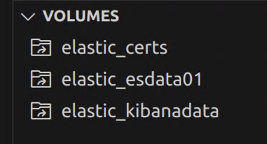
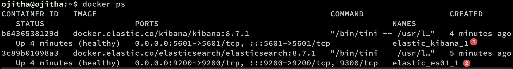

This post is on ElasticSearch 8 and the Elastic Stack[^1]. 

<!--more-->

------

* TOC
{:toc}
------

## Install
In this post, I have used Docker to install ElasticSearch. This has minimised the effort of getting started. Here the docker-compose.yml file taken from a official article[^2]:

```yaml
version: "3.8"


volumes:
 certs:
   driver: local
 esdata01:
   driver: local
 kibanadata:
   driver: local

networks:
 default:
   name: elastic
   external: false


services:
 setup:
   image: docker.elastic.co/elasticsearch/elasticsearch:${STACK_VERSION}
   volumes:
     - certs:/usr/share/elasticsearch/config/certs
   user: "0"
   command: >
     bash -c '
       if [ x${ELASTIC_PASSWORD} == x ]; then
         echo "Set the ELASTIC_PASSWORD environment variable in the .env file";
         exit 1;
       elif [ x${KIBANA_PASSWORD} == x ]; then
         echo "Set the KIBANA_PASSWORD environment variable in the .env file";
         exit 1;
       fi;
       if [ ! -f config/certs/ca.zip ]; then
         echo "Creating CA";
         bin/elasticsearch-certutil ca --silent --pem -out config/certs/ca.zip;
         unzip config/certs/ca.zip -d config/certs;
       fi;
       if [ ! -f config/certs/certs.zip ]; then
         echo "Creating certs";
         echo -ne \
         "instances:\n"\
         "  - name: es01\n"\
         "    dns:\n"\
         "      - es01\n"\
         "      - localhost\n"\
         "    ip:\n"\
         "      - 127.0.0.1\n"\
         "  - name: kibana\n"\
         "    dns:\n"\
         "      - kibana\n"\
         "      - localhost\n"\
         "    ip:\n"\
         "      - 127.0.0.1\n"\
         > config/certs/instances.yml;
         bin/elasticsearch-certutil cert --silent --pem -out config/certs/certs.zip --in config/certs/instances.yml --ca-cert config/certs/ca/ca.crt --ca-key config/certs/ca/ca.key;
         unzip config/certs/certs.zip -d config/certs;
       fi;
       echo "Setting file permissions"
       chown -R root:root config/certs;
       find . -type d -exec chmod 750 \{\} \;;
       find . -type f -exec chmod 640 \{\} \;;
       echo "Waiting for Elasticsearch availability";
       until curl -s --cacert config/certs/ca/ca.crt https://es01:9200 | grep -q "missing authentication credentials"; do sleep 30; done;
       echo "Setting kibana_system password";
       until curl -s -X POST --cacert config/certs/ca/ca.crt -u "elastic:${ELASTIC_PASSWORD}" -H "Content-Type: application/json" https://es01:9200/_security/user/kibana_system/_password -d "{\"password\":\"${KIBANA_PASSWORD}\"}" | grep -q "^{}"; do sleep 10; done;
       echo "All done!";
     '
   healthcheck:
     test: ["CMD-SHELL", "[ -f config/certs/es01/es01.crt ]"]
     interval: 1s
     timeout: 5s
     retries: 120

 es01:
   depends_on:
     setup:
       condition: service_healthy
   image: docker.elastic.co/elasticsearch/elasticsearch:${STACK_VERSION}
   labels:
     co.elastic.logs/module: elasticsearch
   volumes:
     - certs:/usr/share/elasticsearch/config/certs
     - esdata01:/usr/share/elasticsearch/data
   ports:
     - ${ES_PORT}:9200
   environment:
     - node.name=es01
     - cluster.name=${CLUSTER_NAME}
     - discovery.type=single-node
     - ELASTIC_PASSWORD=${ELASTIC_PASSWORD}
     - bootstrap.memory_lock=true
     - xpack.security.enabled=true
     - xpack.security.http.ssl.enabled=true
     - xpack.security.http.ssl.key=certs/es01/es01.key
     - xpack.security.http.ssl.certificate=certs/es01/es01.crt
     - xpack.security.http.ssl.certificate_authorities=certs/ca/ca.crt
     - xpack.security.transport.ssl.enabled=true
     - xpack.security.transport.ssl.key=certs/es01/es01.key
     - xpack.security.transport.ssl.certificate=certs/es01/es01.crt
     - xpack.security.transport.ssl.certificate_authorities=certs/ca/ca.crt
     - xpack.security.transport.ssl.verification_mode=certificate
     - xpack.license.self_generated.type=${LICENSE}
   mem_limit: ${ES_MEM_LIMIT}
   ulimits:
     memlock:
       soft: -1
       hard: -1
   healthcheck:
     test:
       [
         "CMD-SHELL",
         "curl -s --cacert config/certs/ca/ca.crt https://localhost:9200 | grep -q 'missing authentication credentials'",
       ]
     interval: 10s
     timeout: 10s
     retries: 120
 kibana:
   depends_on:
     es01:
       condition: service_healthy
   image: docker.elastic.co/kibana/kibana:${STACK_VERSION}
   labels:
     co.elastic.logs/module: kibana
   volumes:
     - certs:/usr/share/kibana/config/certs
     - kibanadata:/usr/share/kibana/data
   ports:
     - ${KIBANA_PORT}:5601
   environment:
     - SERVERNAME=kibana
     - ELASTICSEARCH_HOSTS=https://es01:9200
     - ELASTICSEARCH_USERNAME=kibana_system
     - ELASTICSEARCH_PASSWORD=${KIBANA_PASSWORD}
     - ELASTICSEARCH_SSL_CERTIFICATEAUTHORITIES=config/certs/ca/ca.crt
     - XPACK_SECURITY_ENCRYPTIONKEY=${ENCRYPTION_KEY}
     - XPACK_ENCRYPTEDSAVEDOBJECTS_ENCRYPTIONKEY=${ENCRYPTION_KEY}
     - XPACK_REPORTING_ENCRYPTIONKEY=${ENCRYPTION_KEY}
   mem_limit: ${KB_MEM_LIMIT}
   healthcheck:
     test:
       [
         "CMD-SHELL",
         "curl -s -I http://localhost:5601 | grep -q 'HTTP/1.1 302 Found'",
       ]
     interval: 10s
     timeout: 10s
     retries: 120     

```

Here the .env file in the same directory:

```
# Project namespace (defaults to the current folder name if not set)
#COMPOSE_PROJECT_NAME=myproject


# Password for the 'elastic' user (at least 6 characters)
ELASTIC_PASSWORD=changeme


# Password for the 'kibana_system' user (at least 6 characters)
KIBANA_PASSWORD=changeme


# Version of Elastic products
STACK_VERSION=8.7.1


# Set the cluster name
CLUSTER_NAME=docker-cluster


# Set to 'basic' or 'trial' to automatically start the 30-day trial
LICENSE=basic
#LICENSE=trial


# Port to expose Elasticsearch HTTP API to the host
ES_PORT=9200


# Port to expose Kibana to the host
KIBANA_PORT=5601


# Increase or decrease based on the available host memory (in bytes)
ES_MEM_LIMIT=1073741824
KB_MEM_LIMIT=1073741824
LS_MEM_LIMIT=1073741824


# SAMPLE Predefined Key only to be used in POC environments
ENCRYPTION_KEY=c34d38b3a14956121ff2170e5030b471551370178f43e5626eec58b04a30fae2
```

As shown in the above, password is `changeme` for Kibana.

To setup run the docker compose command:

```bash
docker compose up
```

This will create three volumes as follows:



If you want to access Elasticsearch API, you need to first copy certifcate to temp directory. To get the file first find the name of the Elasticsearch container.



In the above diagram <span style="color:white;background-color:red">❷</span> shows the container name. Copy the cert file to the temp directory:

```bash
docker cp elastic_es01_1:/usr/share/elasticsearch/config/certs/ca/ca.crt /tmp/.
```

To test run the following command in the same host where docker instances are running:

```bash
curl --cacert /tmp/ca.crt -u elastic:changeme https://localhost:9200
```

It should give you the result:

```json
{
  "name" : "es01",
  "cluster_name" : "docker-cluster",
  "cluster_uuid" : "p2gzCZh9TYeW8WBGJOaNXw",
  "version" : {
    "number" : "8.7.1",
    "build_flavor" : "default",
    "build_type" : "docker",
    "build_hash" : "f229ed3f893a515d590d0f39b05f68913e2d9b53",
    "build_date" : "2023-04-27T04:33:42.127815583Z",
    "build_snapshot" : false,
    "lucene_version" : "9.5.0",
    "minimum_wire_compatibility_version" : "7.17.0",
    "minimum_index_compatibility_version" : "7.0.0"
  },
  "tagline" : "You Know, for Search"
}
```

To access the Kibana, use the follow url `http://192.168.1.139:5601` from anywhere.

Download schema

```bash
wget http://media.sundog-soft.com/es8/shakes-mapping.json
```

Create Mappings

```bash
curl --cacert /tmp/ca.crt -u elastic:changeme -H "Content-Type: application/json" -XPUT https://localhost:9200/shakespeare -k --data-binary @shakes-mapping.json
```

Download data

```bash
wget http://media.sundog-soft.com/es8/shakespeare_8.0.json
```

Insert bulk of data

```bash
curl --cacert /tmp/ca.crt -u elastic:changeme -H "Content-Type: application/json" -XPUT 'https://localhost:9200/shakespeare/_bulk' -k --data-binary @shakespeare_8.0.json
```

Using Kibana Visualizer, you can directly import the News Headlines[^3] dataset as explained in the post[^4].

To find the cluster health

```
GET _nodes/stats
```


My Queries

```
GET news_headlines/_search
{
  "query": {
    "match": {
      "headline": {
        "query": "Khloe Kardashian Kendall Jenner",
        "minimum_should_match": 3
      }
    }
  }
}

GET news_headlines/_search
{
  "aggs": {
    "by_category": {
      "terms": {
        "field": "category",
        "size": 10
      }
    }
  }
}

GET news_headlines/_search
{
  "query": {
    "match_phrase": {
      "headline": "Shape of you"
    }
  }
}

GET news_headlines/_search
{
  "query": {
    "multi_match": {
      "query": "Michelle Obama",
      "fields": [
        "headline",
        "short_description",
        "authors"]
    }
  }
}

GET news_headlines/_search
{
  "query": {
    "multi_match": {
      "query": "party planning",
      "fields": [
        "headline^2",
        "short_description",
        "authors"],
        "type": "phrase"
    }
  }
}

GET news_headlines/_search
{
  "query": {
    "match_phrase": {
      "headline": "Michelle Obama"
    }
  },
  "aggs": {
    "category_mentions": {
      "terms": {
        "field": "category",
        "size": 100
      }
    }
  }
}

GET news_headlines/_search
{
  "query": {
    "bool": {
      "must": [
        {
          "match_phrase": {
            "headline": "Michelle Obama"
          }
        },
        {
          "match": {
            "category": "POLITICS"
          }
        }
      ]
    }
  }
}

GET news_headlines/_search
{
  "query": {
    "bool": {
      "must": [
        {
          "match_phrase": {
            "headline": "Michelle Obama"
          }
        }],
        "must_not": [
          
        {
          "match": {
            "category": "POLITICS"
          }
        }
      ]
    }
  }
}

GET news_headlines/_search
{
  "query": {
    "bool": {
      "must": [
        {
          "match_phrase": {
            "headline": "Michelle Obama"
          }
        }],
        "should": [
          
        {
          "match": {
            "category": "POLITICS"
          }
        }
      ]
    }
  }
}

GET news_headlines/_search
{
  "query": {
    "bool": {
      "must": [
        {
          "match_phrase": {
            "headline": "Michelle Obama"
          }
        }
      ],
      "filter": {
        "range": {
          "date": {
            "gte": "2014-03-25",
            "lte": "2015-03-25"
          }
        }
      }
    }
  }
}
```

Part-4

```
GET ecommerce_data/_search
{
  "size": 0, 
  "query": {
    "match": {
      "Country": "Germany"
    }
  }, 
  "aggs": {
    "cardinality of UnitPrice": {
      "avg": {
        "field": "UnitPrice"
      }
    }
  }
}

GET ecommerce_data/_search
{
  "size": 0, 
  "aggs": {
    "cardinality of customers": {
      "cardinality": {
        "field": "CustomerID"
      }
    }
  }
}

GET ecommerce_data/_search
{
  "size": 0, 
  "aggs": {
    "stats unit price": {
      "stats": {
        "field": "UnitPrice"
      }
    }
  }
}

GET ecommerce_data/_search
{
  "size": 0, 
  "aggs": {
    "transactions by 8 hours": {
      "date_histogram": {
        "field": "InvoiceDate",
        "fixed_interval": "8h"
      }
    }
  }
}

GET ecommerce_data/_search
{
  "size": 0, 
  "aggs": {
    "transactions by month": {
      "date_histogram": {
        "field": "InvoiceDate",
        "calendar_interval": "1M"
      }
    }
  }
}

GET ecommerce_data/_search
{
  "size": 0, 
  "aggs": {
    "transactions by month": {
      "date_histogram": {
        "field": "InvoiceDate",
        "calendar_interval": "1M",
        "order": {
          "_key": "desc"
        }
      }
    }
  }
}

GET ecommerce_data/_search
{
  "size": 0,
  "aggs": {
    "txn for price intervals": {
      "histogram": {
        "field": "UnitPrice",
        "interval": 10
      }
    }
  }
}

GET ecommerce_data/_search
{
  "size": 0,
  "aggs": {
    "txn for price intervals": {
      "histogram": {
        "field": "UnitPrice",
        "interval": 10,
        "order": {
          "_key": "desc"
        }
      }
    }
  }
}

GET ecommerce_data/_search
{
  "size": 0,
  "aggs": {
    "txn for custom price ranges": {
      "range": {
        "field": "UnitPrice",
        "ranges": [
          {
            "to": 50
          },
          {
            "from": 50,
            "to": 200
          },
          {
            "from": 200
          }
        ]
      }
    }
  }
}

GET ecommerce_data/_search
{
  "size": 0,
  "aggs": {
    "top 5 customers": {
      "terms": {
        "field": "CustomerID",
        "size": 5
      }
    }
  }
}

GET ecommerce_data/_search
{
  "size": 0,
  "aggs": {
    "top 5 customers with lowest # txns": {
      "terms": {
        "field": "CustomerID",
        "size": 5,
        "order": {
          "_count": "asc"
        }
      }
    }
  }
}

GET ecommerce_data/_search
{
  "size": 0, 
  "aggs": {
    "transactions by month": {
      "date_histogram": {
        "field": "InvoiceDate",
        "calendar_interval": "day"
      },
      "aggs": {
        "daily_revenue": {
          "sum": {
            "script": {
              "source": "doc['UnitPrice'].value * doc['Quantity'].value"
            }
          }
        }
      }
    }
  }
}

GET ecommerce_data/_search
{
  "size": 0, 
  "aggs": {
    "transactions by month": {
      "date_histogram": {
        "field": "InvoiceDate",
        "calendar_interval": "day",
        "order": {
          "daily_revenue": "desc"
        }
      },
      "aggs": {
        "daily_revenue": {
          "sum": {
            "script": {
              "source": "doc['UnitPrice'].value * doc['Quantity'].value"
            }
          }
        },
        "number of unique customers per day": {
          "cardinality": {
            "field": "CustomerID"
          }
        }
      }
    }
  }
}

```

create index with document


Get without source

```
GET students/_doc/1?_source=false
```

To get multiple documents as the same time

```
GET students/_mget
{
  "ids":[1,2,3]
}
```

if you want to avoid missing one

```
GET students/_search
{
  "query": {
    "ids": {
      "values": [1,2,3]
    }
  }
}
```


for the doc

```
PUT students/_doc/2
{
  "name":"Josh",
  "subjects": ["Maths","English"]
}
```

Query

```
GET students/_source/2
```

output

```
{
  "name": "Josh",
  "subjects": [
    "Maths",
    "English"
  ]
}
```

Only for the name

```
GET students/_source/2/?_source_includes=name
```

output

```
{
  "name": "Josh"
}
```

For the document

```
PUT students/_doc/2
{
  "name":{
    "first":"Josh",
    "last": "JoshLastName"
  },
  "subjects": ["Maths","English"]
}
```

Get only the nested last name of the source

```
GET students/_source/2/?_source_includes=name.last
```

To only update the nested last name:

```
POST students/_update/2
{
  "doc":{
    "name":{
      "last": "Brown"
    }
  }
}
```

Bulk command to insert data from ndjson file

```
curl --cacert ca.crt -u elastic:changeme https://localhost:9200/hockey/_bulk?pretty -H 'Content-Type: application/json' -k --data-binary @hockey.json
```

The sample ndjson is

```
{"index":{"_id":1}}
{"first":"johnny","last":"gaudreau","goals":[9,27,1],"assists":[17,46,0],"gp":[26,82,1],"born":"1993/08/13"}
{"index":{"_id":2}}
{"first":"sean","last":"monohan","goals":[7,54,26],"assists":[11,26,13],"gp":[26,82,82],"born":"1994/10/12"}
{"index":{"_id":3}}
{"first":"jiri","last":"hudler","goals":[5,34,36],"assists":[11,62,42],"gp":[24,80,79],"born":"1984/01/04"}
{"index":{"_id":4}}
{"first":"micheal","last":"frolik","goals":[4,6,15],"assists":[8,23,15],"gp":[26,82,82],"born":"1988/02/17"}
{"index":{"_id":5}}
{"first":"sam","last":"bennett","goals":[5,0,0],"assists":[8,1,0],"gp":[26,1,0],"born":"1996/06/20"}
{"index":{"_id":6}}
{"first":"dennis","last":"wideman","goals":[0,26,15],"assists":[11,30,24],"gp":[26,81,82],"born":"1983/03/20"}
{"index":{"_id":7}}
{"first":"david","last":"jones","goals":[7,19,5],"assists":[3,17,4],"gp":[26,45,34],"born":"1984/08/10"}
{"index":{"_id":8}}
{"first":"tj","last":"brodie","goals":[2,14,7],"assists":[8,42,30],"gp":[26,82,82],"born":"1990/06/07"}
{"index":{"_id":39}}
{"first":"mark","last":"giordano","goals":[6,30,15],"assists":[3,30,24],"gp":[26,60,63],"born":"1983/10/03"}
{"index":{"_id":10}}
{"first":"mikael","last":"backlund","goals":[3,15,13],"assists":[6,24,18],"gp":[26,82,82],"born":"1989/03/17"}
{"index":{"_id":11}}
{"first":"joe","last":"colborne","goals":[3,18,13],"assists":[6,20,24],"gp":[26,67,82],"born":"1990/01/30"}

```

NOTE: All the lines should be terminated by new line character `\n`.

REFERENSES:

[^1]: [Elasticsearch 8 and the Elastic Stack: In-Depth and Hands-On](https://learning.oreilly.com/videos/elasticsearch-8-and/9781788995122/)[Frank Kane](https://learning.oreilly.com/search/?query=author%3A"Frank Kane"&sort=relevance&highlight=true){:target="_blank"}

[^2]: [Getting started with the Elastic Stack and Docker-Compose](https://www.elastic.co/blog/getting-started-with-the-elastic-stack-and-docker-compose)
[^3]:[News Headlines ver 2](News Headlines ver 2)
[^4]:[Beginner's Crash Course to Elastic Stack Series](https://github.com/LisaHJung/Part-2-Understanding-the-relevance-of-your-search-with-Elasticsearch-and-Kibana-#beginners-crash-course-to-elastic-stack-series)
