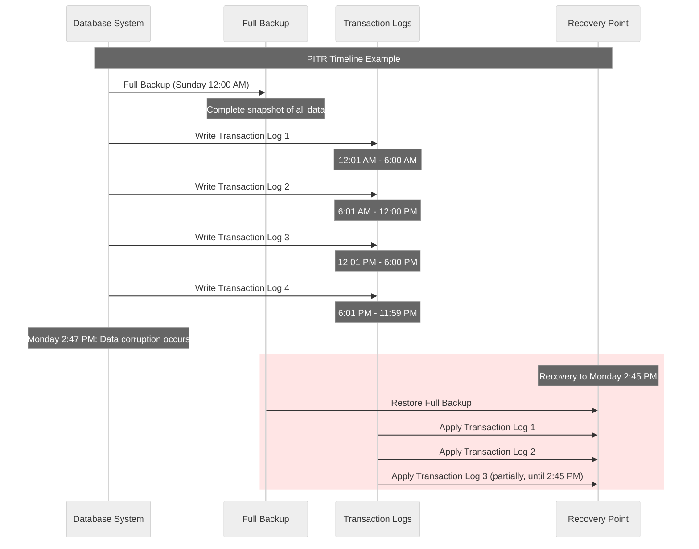
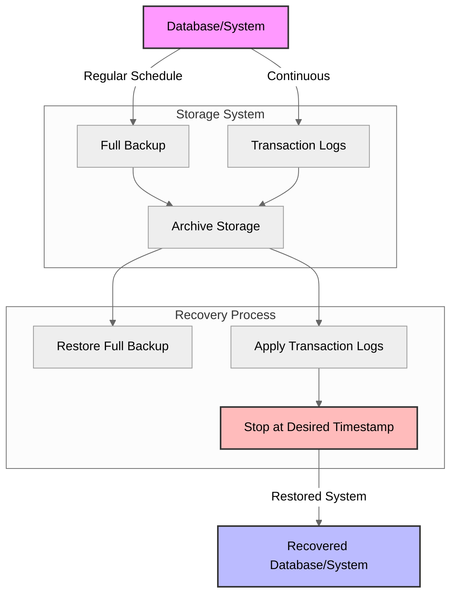

***PITR*** stands for *Point-in-Time Recovery*, which is a feature offered by  several AWS services to provide continuous data protection and the  ability to restore data to a specific point in time.

<!--more-->

------

* TOC
{:toc}
------

## PITR?

PITR stands for Point-In-Time Recovery, a critical capability in backup and disaster recovery solutions. It allows you to restore a database, system, or data to a specific moment in time rather than just to the most recent backup.

Key aspects of PITR include:

1. Continuous data protection - PITR systems typically use a combination of full backups and transaction logs (or similar incremental changes)

2. Granular recovery - You can recover to any specific timestamp between backups, not just to the backup points themselves

3. Common implementations - In database systems like PostgreSQL, MySQL, SQL Server, and cloud services like AWS RDS, PITR is implemented by keeping transaction logs alongside regular backups

✔️ PITR is particularly valuable for quickly recovering from logical errors (like accidental data deletion) or corruption that occurred at a specific time, allowing you to restore to the moment just before the problem happened.
{:.tip}

I'll explain PITR (Point-In-Time Recovery) with diagrams to help visualize the concept.

## How PITR Works

PITR (Point-In-Time Recovery) allows you to restore data to any specific moment, rather than just to when your last backup occurred. This is especially useful when:

1. **An error occurs** (accidental deletion, corruption, etc.)
2. **You need to see data as it existed** at a precise moment
3. **You want to minimize data loss** between scheduled backups

Example:

In the sequence diagram, you can see:
- A full backup taken on Sunday
- Transaction logs recording all changes continuously
- A data corruption occurring on Monday at 2:47 PM
- Recovery to 2:45 PM (just before corruption) by:
  - Restoring the Sunday backup
  - Applying transaction logs up to but not including the corruption

This capability is critical for businesses where data loss must be minimized and precise recovery points are necessary.

## Components of PITR

As shown in the diagrams:

1. **Full Backups**: Complete snapshots of data taken at scheduled intervals
2. **Transaction Logs**: Continuous records of all changes made to the data
3. **Recovery Process**: Combines the full backup with transaction logs up to a specified point
4. **Backup Vault**: A backup vault in AWS Backup is a fundamental component for organizing and storing your backups (Storage System).

Here are the key aspects of PITR in AWS:

1. Continuous Backups: PITR creates ongoing backups of your data, allowing you to restore to any point within a specified retention period{:gtxt}.
2. Granular Recovery: Depending on the service, you can restore data to a specific second{:gtxt} within the retention period.
3. Data Protection: PITR helps protect against accidental writes, deletes, or other unintended modifications to your data.
4. **Retention Period**: The standard retention period for PITR is up to 35 days (for example), but this may vary depending on the specific AWS service.
5. Minimal Impact: PITR typically has little to no impact on the performance of your primary resources.
6. Supported Services: PITR is available for several AWS services, including Amazon DynamoDB[^6], Amazon RDS, Amazon Aurora, and Amazon Keyspaces[^1].
7. Restoration Process: When you perform a restore, it typically creates a new resource (e.g., a new table or database) rather than overwriting existing data.
8. Cost Considerations: There are usually additional charges for enabling and using PITR. Refer to the AWS documentation for specific pricing details.
9. Security: PITR backups are automatically encrypted, enhancing data protection. ***AWS Backup Vault Lock*** *prevents unauthorized deletion or alteration of backups*, providing an additional layer of protection against accidental or malicious actions.
10. Compliance: PITR can help meet certain compliance requirements for data retention and recovery capabilities.

When implementing PITR, it's important to consider your specific recovery time objectives (RTO) and recovery point objectives (RPO). Also, remember to regularly test your recovery processes to ensure they meet your business needs and comply with your security policies.

## RTO & RPO

Recovery Time Objective (RTO) and Recovery Point Objective (RPO) are two critical concepts in disaster recovery planning for AWS workloads:

1. Recovery Time Objective (RTO):
   - ***RTO*** 
    : *is the maximum acceptable time it should take to restore a system after a disruption*.
   - It represents how long your business can tolerate being offline or without a particular service.
   - For example, an RTO of 2 hours means your system should be back up and running within 2 hours of an outage.

2. Recovery Point Objective (RPO):
   - ***RPO*** 
    : *defines the maximum amount of data loss that is acceptable in the event of a disaster*.
   - It's measured in time, representing how far back in time you need to be able to recover data.
   - For instance, an RPO of 1 hour means you should be able to recover data from no more than 1 hour before the disruption occurred.

## Key Points

Key points to remember:

- <u>RTO and RPO are determined by business needs, not technical limitations</u>.
- They help in selecting appropriate disaster recovery strategies and technologies.
- Different workloads within an organization may have different RTO and RPO requirements.
- These objectives should be realistic and achievable with your chosen disaster recovery solution.
- Regular testing is crucial to ensure your actual recovery capabilities meet these objectives.

When implementing disaster recovery strategies in AWS:

- Use services like AWS Backup[^3] for centralized backup management.
- Consider multi-region deployments for critical workloads requiring very low RTO and RPO.
- Leverage services like Amazon S3 cross-region replication or Amazon RDS read replicas for data redundancy.
- Implement automated failover mechanisms using services like Route 53 health checks and DNS failover.

> 📚 Remember to regularly review and update your RTO and RPO as business needs evolve. Also, consult the AWS Well-Architected Framework[^2] for best practices in designing resilient architectures that can meet your recovery objectives.

{:gtxt: .message color="green"}

**Reference**:

***

[^2]: [REL13-BP01 Define recovery objectives for downtime and data loss - AWS Well-Architected Framework](https://docs.aws.amazon.com/wellarchitected/2024-06-27/framework/rel_planning_for_recovery_objective_defined_recovery.html)
[^1]: [Backup and restore data with point-in-time recovery for Amazon Keyspaces - Amazon Keyspaces (for Apache Cassandra)](https://docs.aws.amazon.com/keyspaces/latest/devguide/PointInTimeRecovery.html)
[^3]: [Continuous backups and point-in-time recovery (PITR) - AWS Backup](https://docs.aws.amazon.com/aws-backup/latest/devguide/point-in-time-recovery.html)
[^6]: [Backup and restore for DynamoDB - Amazon DynamoDB](https://docs.aws.amazon.com/amazondynamodb/latest/developerguide/Backup-and-Restore.html)

