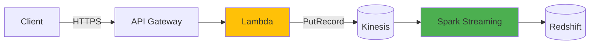
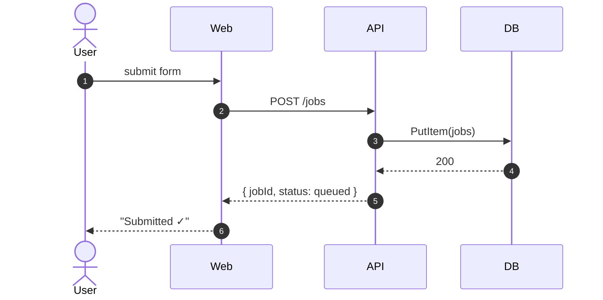
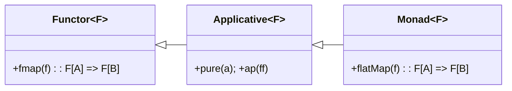
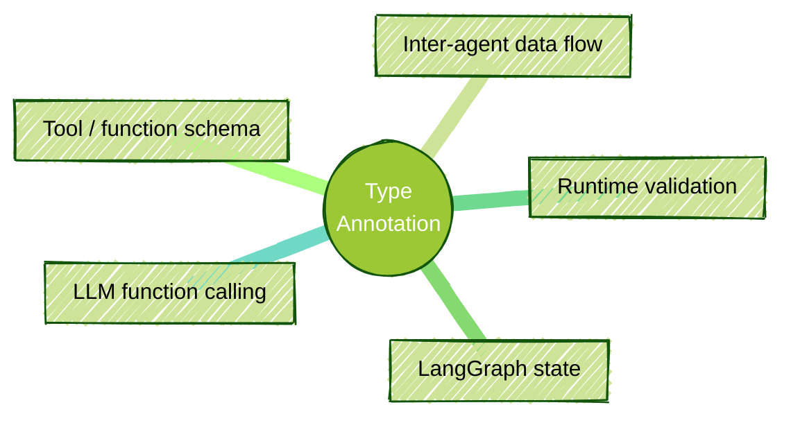

Lua filter used in Pandoc 3.6.3. This blog has solutions for:

- Creating a glossary for ePub ver 3 book
- GitHub style alerts

<!--more-->

------

* TOC
{:toc}
------

# Pandoc and Lua
## Glossary Filter

This filter creates a glossary for ePub 3 using index term such as `[Important Concept]{.index}`. The links of the glossary item are pointing to this index item in the ePub book.


{:width="50%", hight="50%"}

When the links are sorted by number, starting from the book, you can navigate to the link. This is similar to the traditional index on a page, where you search by page number.


**Section Number Tracking**:

- Added section tracking functionality that extracts section numbers from headers when Pandoc uses `--number-sections`
- The filter now maintains information about the current section structure as it processes the document

**Header Processing**:

- Added a `Header()` function to capture section numbers and titles
- Parses headers to extract section numbering in the format "1.2.3 Section Title"

**Section Information Storage**:

- Stores section numbers and titles in a lookup table using header identifiers
- Records the current section hierarchy to associate indexed terms with their containing sections

**Updated Index Entries**:

- Each index entry now stores both the section number and section title
- Links in the index display the section number (e.g., "1.2.3") instead of the term text or a counter
- Added tooltips with section titles when hovering over the links

To create the ePub

```bash
pandoc --number-sections --lua-filter=epub-index-section-numbers.lua *.md -o book.epub
```

The `--number-sections` flag is essential as it generates the section numbers that this filter will use for the index references.

```lua
-- epub-index-section-numbers.lua: A Pandoc Lua filter to create an index for ePub with links referencing section numbers
-- Save this file as epub-index-section-numbers.lua and use with: pandoc --number-sections --lua-filter=epub-index-section-numbers.lua *.md -o book.epub

-- Table to store all index entries
local index_entries = {}
local current_filename = ""
local section_numbers = {}  -- Section number at each level

-- Function to sanitize index keys
local function sanitize_key(text)
  text = text:gsub("[%p%c%s]", ""):lower()
  return text
end

-- Track current file being processed
function Meta(meta)
  -- Try to get the current filename from metadata
  if meta.filename then
    current_filename = pandoc.utils.stringify(meta.filename)
  end
  return meta
end

-- Keep track of section information
local current_section_number = nil
local section_header_map = {}  -- Maps header identifiers to their full section numbers
local in_header = false

-- Function to get current complete section number
local function get_current_section_number()
  local parts = {}
  for i = 1, #section_numbers do
    if section_numbers[i] then
      table.insert(parts, tostring(section_numbers[i]))
    end
  end
  
  if #parts > 0 then
    return table.concat(parts, ".")
  else
    return nil
  end
end

-- Process headers to track section numbers
function Header(el)
  -- Track if we're inside a header (to prevent processing index terms inside headers)
  in_header = true
  
  -- Adjust section_numbers table based on header level
  while #section_numbers > el.level do
    table.remove(section_numbers)
  end
  
  while #section_numbers < el.level do
    table.insert(section_numbers, 0)
  end
  
  -- Extract section number from header content if it exists
  local header_text = pandoc.utils.stringify(el.content)
  local extracted_section_number = header_text:match("^([%d%.]+)%s+")
  
  if extracted_section_number then
    -- If Pandoc has already numbered this section, use that number
    local section_parts = {}
    for num in extracted_section_number:gmatch("%d+") do
      table.insert(section_parts, tonumber(num))
    end
    
    -- Update section_numbers with the extracted values
    for i = 1, math.min(#section_parts, el.level) do
      section_numbers[i] = section_parts[i]
    end
    
    -- Store the clean section title (without the number)
    local section_title = header_text:gsub("^[%d%.]+%s+", "")
    
    -- Store mapping from header ID to section number and title
    section_header_map[el.identifier] = {
      number = extracted_section_number,
      title = section_title
    }
    
    current_section_number = extracted_section_number
  else
    -- If Pandoc hasn't numbered this section (shouldn't happen with --number-sections)
    -- Just increment the current level
    section_numbers[el.level] = (section_numbers[el.level] or 0) + 1
    
    -- Reconstruct the section number
    current_section_number = get_current_section_number()
    
    -- Store mapping
    section_header_map[el.identifier] = {
      number = current_section_number,
      title = header_text
    }
  end
  
  in_header = false
  return el
end

-- Function to add an entry to the index
local function add_index_entry(entry, anchor_id, display_text)
  if not entry or entry == "" then
    return
  end
  
  -- Get current section number for this entry
  local section_number = current_section_number or ""
  local section_title = ""
  
  -- Process entry for subentries (separated by colon)
  local main_entry, sub_entry = entry:match("^([^:]+):?(.*)$")
  main_entry = main_entry:gsub("^%s*(.-)%s*$", "%1") -- Trim
  
  if not index_entries[main_entry] then
    index_entries[main_entry] = {
      locations = {},
      subentries = {}
    }
  end
  
  if sub_entry and sub_entry ~= "" then
    sub_entry = sub_entry:gsub("^%s*(.-)%s*$", "%1") -- Trim
    if not index_entries[main_entry].subentries[sub_entry] then
      index_entries[main_entry].subentries[sub_entry] = {
        locations = {}
      }
    end
    table.insert(index_entries[main_entry].subentries[sub_entry].locations, {
      id = anchor_id,
      file = current_filename,
      text = display_text,
      section_number = section_number,
      section_title = section_title
    })
  else
    table.insert(index_entries[main_entry].locations, {
      id = anchor_id,
      file = current_filename,
      text = display_text,
      section_number = section_number,
      section_title = section_title
    })
  end
end

-- Process Span elements with "index" class
function Span(el)
  if in_header then
    return el  -- Skip processing inside headers to avoid affecting section number extraction
  end
  
  if el.classes:includes("index") then
    local index_text = pandoc.utils.stringify(el.content)
    
    if index_text ~= "" then
      -- Create a unique identifier
      local id = "idx-" .. sanitize_key(index_text) .. "-" .. os.time() .. "-" .. math.random(1000)
      
      -- Get the display text (the actual content)
      local display_text = pandoc.utils.stringify(el.content)
      
      -- Add to index
      add_index_entry(index_text, id, display_text)
      
      -- Return span with ID
      return pandoc.Span(el.content, {id = id, class = "indexed-term"})
    end
  end
  return el
end

-- Process RawInlines for special index notation if needed
function RawInline(el)
  if in_header then
    return el  -- Skip processing inside headers
  end
  
  if el.format == "html" or el.format == "epub" then
    -- Match any custom index format like `<<term>>` or similar
    local index_term = el.text:match("<<(.-)>>")
    if index_term then
      local id = "idx-" .. sanitize_key(index_term) .. "-" .. os.time() .. "-" .. math.random(1000)
      add_index_entry(index_term, id, index_term)
      -- Return a span that will be rendered with the term and an ID
      return pandoc.Span(pandoc.Str(index_term), {id = id, class = "indexed-term"})
    end
  end
  return el
end

-- Process Div elements with "index" class (for block-level indexing)
function Div(el)
  if el.classes:includes("index") then
    local index_text = pandoc.utils.stringify(el.content)
    
    if index_text ~= "" then
      -- Create a unique identifier
      local id = "idx-" .. sanitize_key(index_text) .. "-" .. os.time() .. "-" .. math.random(1000)
      
      -- Add to index
      add_index_entry(index_text, id, index_text)
      
      -- Add the ID to the div
      el.attributes.id = id
      el.classes:insert("indexed-term")
      
      return el
    end
  end
  return el
end

-- Debug function to log section numbers if needed
local function debug_log(message)
  -- Enable for debugging
  -- io.stderr:write(message .. "\n")
end

-- Generate the index as a separate chapter at the end of the document
function Pandoc(doc)
  -- Only generate index once all files are processed
  -- Skip if no index entries
  if next(index_entries) == nil then
    return doc
  end
  
  -- Sort the entries alphabetically
  local sorted_entries = {}
  for entry, data in pairs(index_entries) do
    table.insert(sorted_entries, {
      text = entry,
      data = data
    })
  end
  
  table.sort(sorted_entries, function(a, b) 
    return a.text:lower() < b.text:lower() 
  end)
  
  -- Create the index content
  local index_blocks = {
    pandoc.Header(1, "Index")
  }
  
  local current_letter = nil
  
  for _, entry in ipairs(sorted_entries) do
    local first_letter = entry.text:sub(1, 1):upper()
    
    -- Add letter divider if this is a new letter
    if first_letter ~= current_letter then
      current_letter = first_letter
      table.insert(index_blocks, pandoc.Para(pandoc.Strong(current_letter)))
    end
    
    -- Create entry line
    local entry_content = {}
    table.insert(entry_content, pandoc.Str(entry.text))
    
    -- Add links to occurrences
    if #entry.data.locations > 0 then
      table.insert(entry_content, pandoc.Space())
      for i, location in ipairs(entry.data.locations) do
        if i > 1 then
          table.insert(entry_content, pandoc.Str(","))
          table.insert(entry_content, pandoc.Space())
        end
        
        -- Use section number as the link text if available, otherwise fallback to location index
        local link_text = location.section_number
        if not link_text or link_text == "" then
          link_text = tostring(i)
        end
        
        -- Add tooltip with section title if available
        local attrs = {}
        if location.section_title and location.section_title ~= "" then
          attrs.title = location.section_title
        end
        
        -- Create the link to the indexed term
        table.insert(entry_content, pandoc.Link(link_text, "#" .. location.id, "", attrs))
      end
    end
    
    table.insert(index_blocks, pandoc.Para(entry_content))
    
    -- Add subentries if any
    local sorted_subentries = {}
    for subentry, subdata in pairs(entry.data.subentries) do
      table.insert(sorted_subentries, {
        text = subentry,
        data = subdata
      })
    end
    
    table.sort(sorted_subentries, function(a, b) 
      return a.text:lower() < b.text:lower() 
    end)
    
    for _, subentry in ipairs(sorted_subentries) do
      local subentry_content = {
        pandoc.Str("    • "), -- Indent subentries
        pandoc.Str(subentry.text)
      }
      
      -- Add links to occurrences
      if #subentry.data.locations > 0 then
        table.insert(subentry_content, pandoc.Space())
        for i, location in ipairs(subentry.data.locations) do
          if i > 1 then
            table.insert(subentry_content, pandoc.Str(","))
            table.insert(subentry_content, pandoc.Space())
          end
          
          -- Use section number as the link text if available
          local link_text = location.section_number
          if not link_text or link_text == "" then
            link_text = tostring(i)
          end
          
          -- Add tooltip with section title if available
          local attrs = {}
          if location.section_title and location.section_title ~= "" then
            attrs.title = location.section_title
          end
          
          -- Create the link to the indexed term
          table.insert(subentry_content, pandoc.Link(link_text, "#" .. location.id, "", attrs))
        end
      end
      
      table.insert(index_blocks, pandoc.Para(subentry_content))
    end
  end
  
  -- Create a div for the index with special styling
  local index_div = pandoc.Div(index_blocks, {id = "book-index", class = "index-section"})
  
  -- Add CSS styling for indexed terms and index entries
  local css = [[
<style>
.indexed-term {
  /* Optional: add subtle highlighting to indexed terms */
  /* background-color: rgba(255, 255, 0, 0.1); */
}

.index-section a {
  /* Style for section number links */
  text-decoration: none;
  color: #0066cc;
}

.index-section a:hover {
  text-decoration: underline;
}
</style>
  ]]
  
  -- Add the CSS if we're generating HTML or EPUB
  if FORMAT:match "html" or FORMAT:match "epub" then
    table.insert(doc.blocks, 1, pandoc.RawBlock("html", css))
  end
  
  -- Add the index to the end of the document
  doc.blocks:insert(index_div)
  
  return doc
end

-- Return the filter
return {
  Header = Header,
  Span = Span,
  Div = Div,
  RawInline = RawInline,
  Meta = Meta,
  Pandoc = Pandoc
}
```

## Alerts

You can create GitHub-style alerts in Pandoc Markdown by leveraging **fenced `div` blocks** and **CSS styling**. Pandoc allows you to attach classes to these `div` blocks, which you can then target with CSS to create the visual alert boxes.

Here's how you can do it:

### Markdown with Fenced Divs and Classes

In your Markdown document (`my_document.md`), use fenced `div` blocks with classes to represent different alert types. Common GitHub alert types are:

- **Note:** General information, hints.
- **Tip/Important:** Important information, best practices.
- **Warning:** Potential issues, things to be careful about.
- **Danger/Error:** Critical issues, things to avoid.

You can represent these like this in Markdown:

```markdown
::: note
**Note:** This is a note alert box.
It can contain multiple paragraphs and even lists.

- Item 1
- Item 2
:::

::: tip
**Tip:** Here's a helpful tip!
:::

::: warning
**Warning:**  Be careful with this action!
:::

::: danger
**Danger:** This is a dangerous operation. Proceed with caution!
:::

```

**Explanation of the Markdown Syntax:**

- `::: note`, `::: tip`, `::: warning`, `::: danger`: These are fenced `div` blocks. The word after `:::` is treated as the **class name** for the `div` element in the output HTML (or other formats).
- The content inside the `::: ... :::` block is the content of the `div`.
- You can use standard Markdown formatting inside the alert boxes (bold, italics, lists, etc.).

### CSS Styling (`styles.css`)

Create a CSS file (e.g., `styles.css`) to style the `div` elements with the classes you used in your Markdown. This CSS will define the visual appearance of your alerts, mimicking GitHub's style (you can customise this to your liking).

Here's an example `styles.css` that creates alert boxes with different background colors and border styles:

```css
.note, .tip, .warning, .danger {
  padding: 1em;
  margin-bottom: 1em;
  border-radius: 5px;
  border-left: 5px solid;
}

.note {
  background-color: #e8f0fe; /* Light blue */
  border-color: #4285f4;    /* Blue */
}

.tip {
  background-color: #f0f9ed;   /* Light green */
  border-color: #34a853;      /* Green */
}

.warning {
  background-color: #fff8e1;  /* Light yellow */
  border-color: #ffb300;     /* Yellow/Amber */
}

.danger {
  background-color: #fde2e2;  /* Light red */
  border-color: #e53935;     /* Red */
  color: #842029;           /* Darker text for readability on red */
}

/* Optional: Style the bold title within alerts */
.note strong, .tip strong, .warning strong, .danger strong {
    display: block; /* Make the strong element a block for better spacing */
    margin-bottom: 0.5em; /* Add some space below the title */
}
```

**Explanation of the CSS:**

- `.note, .tip, .warning, .danger`: This selector targets all the `div` elements with these classes.
    - `padding`, `margin-bottom`, `border-radius`, `border-left`: Basic styling to create the box appearance.
- `.note`, .tip, .warning, .danger` (individual styles): Specific styles for each alert type:
    - `background-color`: Sets the background color.
    - `border-color`: Sets the color of the left border (for visual emphasis, like GitHub).
    - `color` (for `.danger`): Adjusts text color if needed for better contrast against the background.

- `.note strong, .tip strong, .warning strong, .danger strong`: Optional styling to make the bold text (used for titles like "Note:", "Tip:", etc.) stand out a bit more within the alerts.

Much more simplier icon[^1] with markdown may be the best:

```
:boom: DANGER, Will Robinson, DANGER
> :memo: **This is a Note**: a pen in front of a paper

> :warning: **This is a Note**: an exclamation mark in front of a triangle

> :bulb: **This is a Note**: a light bulb

> :heavy_check_mark: **This is a Note**: a check mark

:sleeping: This text is all part of a single *admonition* block.
```


## pandoc-crossref
Here is simple configuration as in the crossref[^2]

```
---
codeBlockCaptions: True
figureTitle: |
  Fig.
figPrefix:
    - "Fig."
    - "Figs"
tblPrefix:
    - "Table"
    - "Tables"
lofTitle: |
  ## List of Figures
lotTitle: |
  ## List of Tables
lolTitle: |
  ## List of Listings
tableTemplate: |
  *$$tableTitle$$ $$i$$*$$titleDelim$$ $$t$$
autoSectionLabels: True
---
```


# Jekyll

This section dedicated to Jekyll web site development.

Drop this into `_posts/YYYY-MM-DD-slug.md` and start writing:

```markdown
---
layout: post
title:  My Post Title
date:   2026-05-02
categories: [AI, AWS]
toc: true                 # floating right-side TOC
mermaid: true             # only if you use diagrams
maths: true               # only if you use $...$ or $$...$$
typora-root-url: ~/GitHub/ojitha.github.io
typora-copy-images-to: ~/GitHub/blog/assets/images/${filename}
excerpt: '<div class="image-text-container"><div class="image-column"><image></div><div class="text-column">TLDR</div></div>'
---

One-paragraph hook that becomes the home-page excerpt.

<!--more-->

* TOC
{:toc}

## First section
Your content here.

[^1]: Footnote text.

{:gtxt: .message color="green"}
{:ytxt: .message color="yellow"}
{:rtxt: .message color="red"}
```

## Front matter flags

| Key                   | Value example                        | Effect                                    |
| --------------------- | ------------------------------------ | ----------------------------------------- |
| `layout`              | `post`                               | Use the post layout (also: `notes`)       |
| `title`               | `"My Title"`                         | Page title and `<h1>`                     |
| `date`                | `2026-05-02`                         | Sort order; appears in URL                |
| `categories`          | `[Python, AI]`                       | URL path + archive pages + Algolia facets |
| `toc`                 | `true` / `false`                     | Floating sidebar TOC (default `true`)     |
| `mermaid`             | `true`                               | Load Mermaid 11 from CDN                  |
| `maths`               | `true`                               | Load MathJax 3 with AMS numbering         |
| `excerpt`             | `'<div>...</div>'`                   | Override auto-excerpt (HTML allowed)      |
| `linkedinbagage`      | `true`                               | Show LinkedIn badge                       |

## Text formatting

| Source                                       | Renders                            |
| -------------------------------------------- | ---------------------------------- |
| `**bold**`                                   | bold text                          |
| `*italic*`                                   | italic text on **yellow** marker   |
| `***bold italic***`                          | violet background, wheat text      |
| `<u>underlined</u>`                          | underlined text on **green** wash  |
| `~~strikethrough~~`                          | strikethrough                      |
| `` `inline code` ``                          | monospace                          |
| `<span class="hl">marked</span>`             | yellow marker (when `*…*` is wrong context) |
| `[text](url){:target="_blank"}`              | link that opens in a new tab       |
| `[text][ref]` … `[ref]: url`                 | reference-style link               |
| `> blockquote`                               | default blue/grey blockquote       |

## Semantic tones (preferred)

Five intent classes, consistent look across `em`, `<u>`, `span`, `code`, `blockquote`, `div`, `p`, `li`, `td`, `pre`, `table`:

| Class    | Intent          | Inline pill | Blockquote icon |
| -------- | --------------- | ----------- | --------------- |
| `.info`  | informational   | blue        | ℹ               |
| `.ok`    | success / good  | green       | ✓               |
| `.warn`  | warning         | amber       | ⚠               |
| `.bad`   | danger / error  | red         | ✕               |
| `.note`  | neutral aside   | grey        | ✎               |

**Inline:**

```markdown
The `split()` method takes a *regex pattern*{:.bad}; use *split("\\|")*{:.ok} instead.
This step is <span>idempotent and safe to retry</span>{:.info}.
```

**Block (admonition):**

```markdown
> Increase the timeout *only after* you've ruled out cold-start latency.
{:.warn}

> Removing either guarantee produces duplicate-write bugs.
{:.bad}

> The encoder infers the schema from the case-class structure.
{:.ok}

> Side note: only matters for Spark 3.4+.
{:.note}
```

## Coloured inline spans (legacy)

Drop these aliases at the **bottom** of any post that uses them, then reference them inline:

```markdown
{:gtxt: .message color="green"}
{:ytxt: .message color="yellow"}
{:rtxt: .message color="red"}
```

```markdown
The constraint *must hold for all rows*{:rtxt}; the optimiser <span>can drop redundant filters</span>{:gtxt}.
```

For new posts, prefer the tone classes above (`{:.bad}`, `{:.ok}`, `{:.warn}`) — they're consistent across element types.

## Legacy blockquote callouts

Still supported for backward compatibility; new posts should use `.ok` / `.warn` instead:

```markdown
> Approved approach.
{:.green}

> Watch out for the regex gotcha.
{:.yellow}
```

## Code blocks

### Plain fenced block

````markdown
```python
def greet(name: str) -> str:
    return f"Hello, {name}!"
```
````

Common languages: `python`, `scala`, `java`, `kotlin`, `sql`, `bash`, `console`, `dockerfile`, `yaml`, `toml`, `json`, `hcl`, `go`, `rust`, `typescript`, `tsx`, `r`, `haskell`, `clojure`, `graphql`, `protobuf`, `make`. Use `console` for shell sessions with `$` prompts; `bash` for raw scripts.

### With line numbers


```liquid

def quicksort(xs):
    if len(xs) <= 1:
        return xs
    pivot = xs[0]
    return (quicksort([x for x in xs[1:] if x <  pivot])
            + [pivot]
            + quicksort([x for x in xs[1:] if x >= pivot]))

```


### With highlighted lines


```liquid

val ds   = spark.read.parquet("s3a://bucket/movies").as[Movie]
val byYr = ds.groupByKey(_.year)
              .mapValues(_.rating)        // emphasised
              .reduceGroups(_ + _)        // emphasised
byYr.show()

```


### Captioned code (anchor + caption)



````markdown
```python
print("hello")
```
{:#listing-1 .listing}
*Listing 1: minimal Python.*

[See Listing 1](#listing-1).
```
````


## Math

`maths: true` in front matter is required.

| Form                       | Source                                | Renders                              |
| -------------------------- | ------------------------------------- | ------------------------------------ |
| Inline                     | `$O(n \log n)$`                       | $O(n \log n)$                        |
| Display                    | `$$ a^2 + b^2 = c^2 $$`               | centred display                      |
| Numbered (auto, AMS)       | `\begin{equation} ... \end{equation}` | numbered on the right                |
| Aligned, multi-line        | `\begin{align} ... \end{align}`       | aligned at `&`, each line numbered   |
| Manual tag                 | `... \tag{1}`                         | overrides auto-number                |
| Cross-reference            | `\eqref{eq:label}`                    | numbered link                        |
| Common operators           | `\bullet \circ \mapsto \Rightarrow`   | $\bullet \circ \mapsto \Rightarrow$  |

Worked example:

```markdown
$$
\mathcal{L}_{\text{CE}}(\mathbf{y}, \hat{\mathbf{y}}) =
\begin{cases}
  -\sum_i y_i \log \hat{y}_i  & \text{soft labels} \\
  -\log \hat{y}_c             & \text{hard label } c
\end{cases}
\tag{1}
$$
```

**Watch out:** kramdown treats `_` as italic. Inside math, write `x_{i}` (curly-brace the subscript) or escape `\_` to be safe.

## Mermaid diagrams

`mermaid: true` in front matter is required.

### Flowchart

````markdown

````

### Sequence

````markdown

````

### Class

````markdown

````

### Mind map (handDrawn look)

````markdown

````

Other diagram kinds available: `gantt`, `pie`, `journey`, `er`, `gitgraph`, `quadrantChart`, `timeline`, `sankey-beta`, `xychart-beta`, `block-beta`, `architecture-beta`, `stateDiagram-v2`, `c4Context`, `requirementDiagram`.

## Tables

```markdown
| Aspect        | join                | joinWith                  |
| ------------- | ------------------- | ------------------------- |
| Return type   | DataFrame (untyped) | `Dataset[(T, U)]` (typed) |
| Type safety   | ❌ lost              | ✅ preserved              |
| Column access | by name (string)    | by object fields          |
```

| Aspect        | join                | joinWith                  |
| ------------- | ------------------- | ------------------------- |
| Return type   | DataFrame (untyped) | `Dataset[(T, U)]` (typed) |
| Type safety   | ❌ lost              | ✅ preserved              |
| Column access | by name (string)    | by object fields          |

Right-align a column with `---:`, centre with `:---:`. Add a class to the whole table with `{:.note}` immediately after the table block.

## Footnotes, abbreviations, definition lists

```markdown
The HPACK protocol is described in [RFC 7541][rfc][^hpack].

[^hpack]: RFC 7541, *HPACK: Header Compression for HTTP/2*, May 2015.
[rfc]: https://datatracker.ietf.org/doc/html/rfc7541

*[HPACK]: HTTP/2 Header Compression

Term
: First definition
: Second definition
```

### Footnotes for the blogs

```markdown

...
According to the Hugging Face[^hf-blog] blog ...
...

[^hf-blog]: Hugging Face. *Welcome Gemma 4: Frontier multimodal intelligence on device.* 2 Apr 2026. [https://huggingface.co/blog/gemma4](https://huggingface.co/blog/gemma4){:target="_blank" rel="noopener noreferrer}
```

### Footnotes for the web links

```markdown

...
According to the Claude Build Skill Guide[^Claude-skill-guide], you have...
...


[^Claude-skill-guide]: [The-Complete-Guide-to-Building-Skill-for-Claude.pdf](https://resources.anthropic.com/hubfs/The-Complete-Guide-to-Building-Skill-for-Claude.pdf){:target="_blank" rel="noopener noreferrer}
```


### Footnotes for book chapters

```markdown

...
The Scala collections are organized into three main packages[^scal-book-ch-1]:
...

[^scal-book-ch-1]: *Scala Cookbook, Second Edition*, Ch. 11: "Collections: Introduction"

```

## Headings, anchors, TOC

- All headings auto-generate ids (kramdown `auto_ids: true`).
- Override the id: `## Encoders explained {#encoders}` → `[link](#encoders)`.
- The `* TOC\n{:toc}` block produces an in-content TOC; the floating sidebar TOC is automatic when `toc: true`.

## Images

```markdown


<!-- with explicit width -->

```

Save under `assets/images/<post-slug>/`. Typora's `${filename}` token in front matter does this automatically.

### Two-column image + text

```html
<div class="image-text-container">
  <div class="image-column">
    
  </div>
  <div class="text-column">
    <p>Description on the right, image on the left, stacks on mobile.</p>
  </div>
</div>
```

## Includes available on this site


```liquid

```


| Include             | Trigger             | What it does                       |
| ------------------- | ------------------- | ---------------------------------- |
| `toc.html`          | `toc: true`         | Floating, scroll-spy, resizable TOC|
| `mermaid.html`      | `mermaid: true`     | Mermaid 11 + Iconify logos pack    |
| `maths.html`        | `maths: true`       | MathJax 3 with AMS numbering       |
| `video-summary.html`| manual include      | YouTube embed + sidebar diagram    |
| `linkedinbagage.html`| `linkedinbagage: true` | LinkedIn profile badge          |

## Liquid mini-recipes


```liquid
Built on {{ site.time | date: "%Y-%m-%d" }} at {{ site.url }}.


> Filed under Scala.
{:.ok}


#{{ cat | downcase }} 
```



[^1]: [A markdown version emoji cheat sheet](https://github.com/ikatyang/emoji-cheat-sheet/tree/master)
[^2]: [pandoc-crossref](https://lierdakil.github.io/pandoc-crossref/#customization)