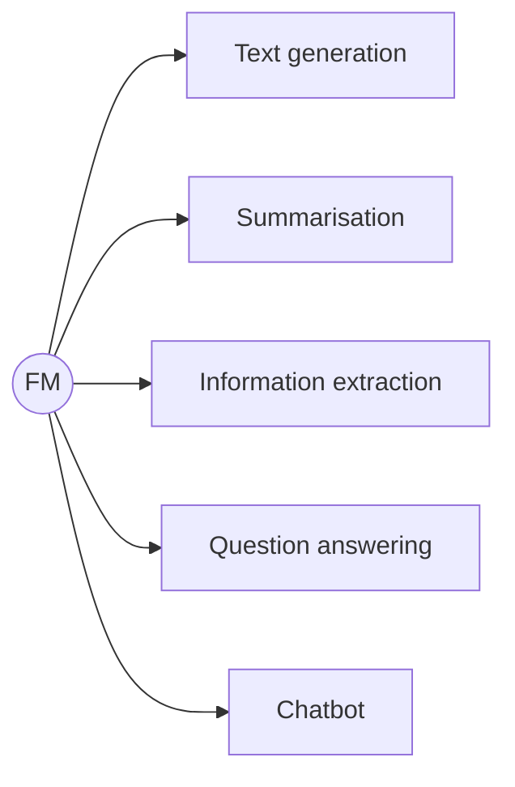
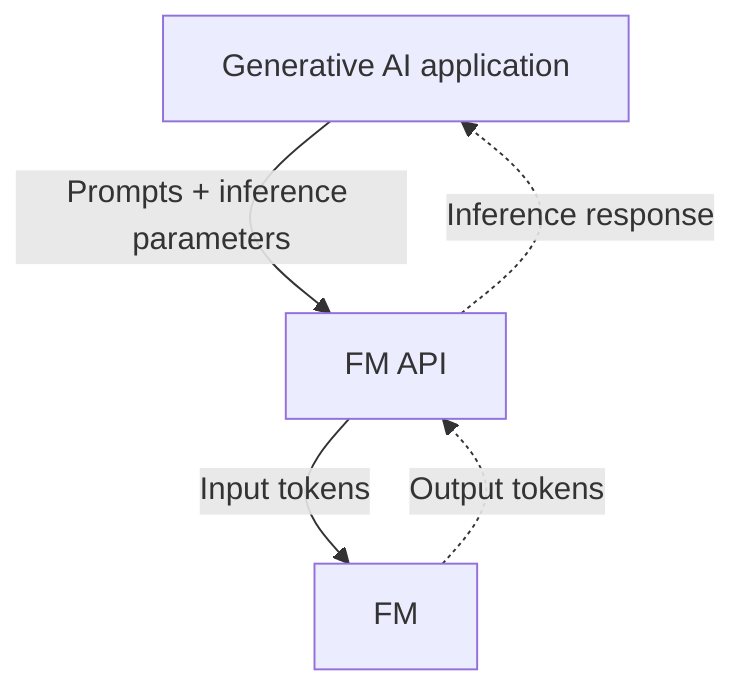
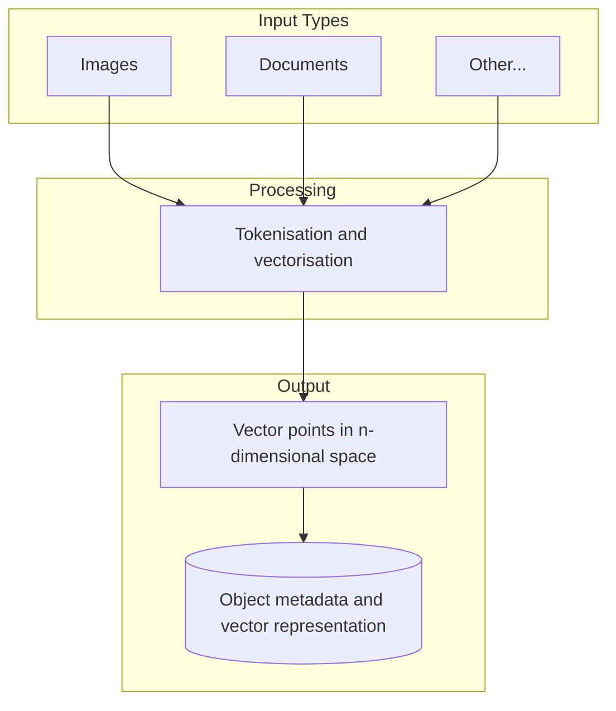
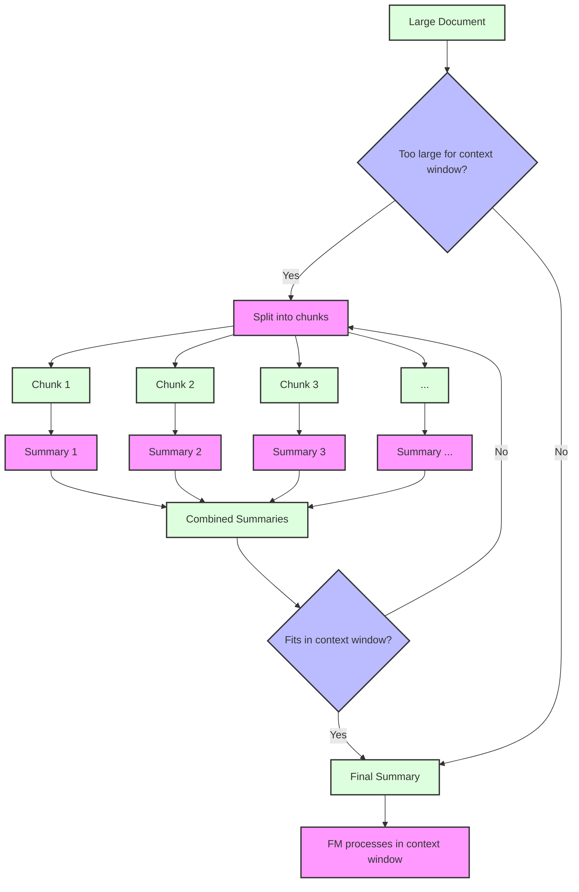

<style>
/* Styles for the two-column layout */
.image-text-container {
    display: flex; /* Enables flexbox */
    flex-wrap: wrap; /* Allows columns to stack on small screens */
    gap: 20px; /* Space between the image and text */
    align-items: center; /* Vertically centers content in columns */
    margin-bottom: 20px; /* Space below this section */
}

.image-column {
    flex: 1; /* Allows this column to grow */
    min-width: 250px; /* Minimum width for the image column before stacking */
    max-width: 40%; /* Maximum width for the image column to not take up too much space initially */
    box-sizing: border-box; /* Include padding/border in element's total width/height */
}

.text-column {
    flex: 2; /* Allows this column to grow more (e.g., twice as much as image-column) */
    min-width: 300px; /* Minimum width for the text column before stacking */
    box-sizing: border-box;
}


</style>

<div class="image-text-container">
    <div class="image-column">
        
    </div>
    <div class="text-column">
<p>Dive into the essentials of Large Language Models (LLMs) and Foundation Models (FMs) on Amazon Web Services (AWS). This guide explores leveraging AWS Bedrock and related services for building and interacting with powerful generative AI models. </P>
<p>Learn about key concepts including prompt engineering, fine-tuning techniques like prompt-based learning and domain adaptation, and managing inference parameters such as Temperature, Top K, and Top P. Discover how to utilise AWS FM APIs. This post provides the foundational knowledge required to get started with LLMS on AWS.</p>
    </div>
</div>

📚  The [second part]() describes how to use LangChain with AWS Bedrock.

<!--more-->

------

* TOC
{:toc}
------

## Foundation Model

FMs are models trained on large-scale data gathered from covering 

- Diverse topic areas

- of subject matter, 

- and modalities.

Therefore, they can perform various general tasks such as text generation, summarisation and so on as shown in the following diagram.



You can pass prompts to the FM and receive inference responses. You can pass the parameters along with the prompts to the FM interface APIs. Each FM has specific inference parameters, such as `Top P`, `Top K`, and `temperature`.

### Claude

For example, Claude[^3] is a generative AI model by Anthropic. This is my favourite. So far, the best I've used for coding: It is purpose-built. 

- You can create a virtual assistant or a coaching application using Anthropic [*Claude Messages API*](https://docs.aws.amazon.com/bedrock/latest/userguide/model-parameters-anthropic-claude-messages.html){:target="_blank"} inference requests.
- Text summorisation using the [*text completion API*](https://docs.aws.amazon.com/bedrock/latest/userguide/model-parameters-anthropic-claude-text-completion.html){:target="_blank"} for single-turn text generation

> Claude uses common parameters, such as temperature, Top P, Top K, and stop sequences.
{:.green}

In addition to that, Claude models use the following unique parameter to further tune the response output:

**Maximum length** (`max_tokens_to_sample`)

: Specify the maximum number of tokens to use in the generated response.

## Inference parameters

When interacting with an FM, you can configure the inference parameters[^1] to customise the response. Foundation models typically support the parameters to control *randomness and diversity* in the reaction. 

- **Temperature** controls the randomness of the output. Higher values encourage more creative responses, while lower values encourage more deterministic responses. Values can range from 0.0 to 1.0, and the default is 0.

- **Top K** limits word choices to the K most probable options and changes how the model selects tokens for output. Lower values reduce unusual responses: 1 means the selected token is the most probable among all the tokens in the model's vocabulary (while a `topK` of 3 means that the next token is selected from among the 3 most probable using the *temperature* in Google Gemini 2.5 Pro).

    > Tokens will be further filtered based on *Top P*, with the final token selected using *temperature* sampling.

- **Top P** changes how the model selects tokens for output by removing low-probability word choices based on cumulative probability: Tokens are chosen from the most to least probable until the sum of their probabilities equals the Top P value. This tightens the overall response distribution. The minimum is zero, the max is 1, and the default is 1.

### Length

Foundation models typically support the following parameters to control the length of the generated response. 

- **Response length** (`maxTokenCount`) sets minimum and maximum token counts (min = 0, max = 8000; the default is 512).
- **Length penalty** encourages more concise responses by penalising longer ones.
- **Stop sequences** include specific character combinations that signal the model to stop generating tokens when they occur.

Amazon Titan[^2] Image Generator v1 capable create images that match their text-based descriptions by inputting natural language prompts. The model also supports *outpainting*, which extends the boundaries of an image. *Inpainting* is used to fill in missing image areas.


## AWS FM APIs

LLMs operate on tokens, such as words, letters, or partial word units. 

> 👉 1000 tokens are equivalent to approximately 750 words.




The `ListFoundationModels` method provides a list of available Amazon Bedrock foundation models. 


```python
import boto3
import json
bedrock = boto3.client(service_name='bedrock')
model_list=bedrock.list_foundation_models()
for x in range(len(model_list.get('modelSummaries'))):
     modelName:str = model_list.get('modelSummaries')[x]['modelName']
     if 'titan' in modelName.lower():
         modelId = model_list.get('modelSummaries')[x]['modelId']
         inferenceTypesSupported = model_list.get('modelSummaries')[x]['inferenceTypesSupported']
         print(f" ModelId: {modelId}, ModelName: {modelName}, InferenceTypesSupported: {inferenceTypesSupported}")
```

Output is

```
 ModelId: amazon.titan-text-lite-v1:0:4k, ModelName: Titan Text G1 - Lite, InferenceTypesSupported: ['PROVISIONED']
 ModelId: amazon.titan-text-lite-v1, ModelName: Titan Text G1 - Lite, InferenceTypesSupported: ['ON_DEMAND']
 ModelId: amazon.titan-text-express-v1:0:8k, ModelName: Titan Text G1 - Express, InferenceTypesSupported: ['PROVISIONED']
 ModelId: amazon.titan-text-express-v1, ModelName: Titan Text G1 - Express, InferenceTypesSupported: ['ON_DEMAND']
 ModelId: amazon.titan-embed-image-v1:0, ModelName: Titan Multimodal Embeddings G1, InferenceTypesSupported: ['PROVISIONED']
 ModelId: amazon.titan-embed-image-v1, ModelName: Titan Multimodal Embeddings G1, InferenceTypesSupported: ['ON_DEMAND']
 ModelId: amazon.titan-embed-text-v2:0, ModelName: Titan Text Embeddings V2, InferenceTypesSupported: ['ON_DEMAND']
```

or 

```bash
aws bedrock list-foundation-models --region ap-southeast-2 --output json | jq -r '.modelSummaries[] | .modelId'
```

In this blog, I am using model id: `amazon.titan-text-express-v1`.

```bash
aws bedrock get-foundation-model --model-identifier amazon.titan-text-express-v1
```

In details:
```json
{
    "modelDetails": {
        "modelArn": "arn:aws:bedrock:ap-southeast-2::foundation-model/amazon.titan-text-express-v1",
        "modelId": "amazon.titan-text-express-v1",
        "modelName": "Titan Text G1 - Express",
        "providerName": "Amazon",
        "inputModalities": [
            "TEXT"
        ],
        "outputModalities": [
            "TEXT"
        ],
        "responseStreamingSupported": true,
        "customizationsSupported": [],
        "inferenceTypesSupported": [
            "ON_DEMAND"
        ],
        "modelLifecycle": {
            "status": "ACTIVE"
        }
    }
}
```

> 🎯 To use with Python, you have to select the `inferenceTypesSupported` as `ON_DEMAND` models. Otherwise, you will get error such as: 
>
> "An <span>error occurred (ValidationException)</span>{:rtxt} when calling the Converse operation: Invocation of model ID amazon.nova-micro-v1:0 with <span>on-demand throughput isn’t supported</span>{:rtxt}. Retry your request with the ID or ARN of an inference profile that contains this model."

### InvokeModel

You can use the following AWS CLI to invoke:

```bash
aws bedrock-runtime invoke-model \
--model-id amazon.titan-text-express-v1 \
--body '{"inputText": "What is the capital of Australia?.",
 "textGenerationConfig" : {"maxTokenCount": 512, "temperature": 0.5, "topP": 0.9}}' \
--cli-binary-format raw-in-base64-out \
output-text.txt
```

The output is a output-text.txt file:

```json
{
    "inputTextTokenCount": 7,
    "results": [
        {
            "tokenCount": 10,
            "outputText": "\nThe capital of Australia is Canberra.\n\n",
            "completionReason": "FINISH"
        }
    ]
}
```


The API[^5] method ***InvokeModel*** runs inference for text models, image models, and embedding models.

```python
import boto3
import json
import logging

boto3.set_stream_logger('', logging.ERROR)
bedrock_rt = boto3.client(service_name='bedrock-runtime', region_name='ap-southeast-2')
prompt = "What is an Apple?"
configs= {
     "inputText": prompt,
     "textGenerationConfig": {
     "maxTokenCount": 4096,
     "stopSequences": [],
     "temperature":0,
     "topP":1
     }
}
body=json.dumps(configs)
modelId = 'amazon.titan-text-express-v1'
accept = 'application/json'
contentType = 'application/json'
response = bedrock_rt.invoke_model(
     body=body,
     modelId=modelId,
     accept=accept,
     contentType=contentType
)
response_body = json.loads(response.get('body').read())
print(response_body.get('results')[0].get('outputText'))
```

sample output

```bash
An apple is a fruit produced by an apple tree. The tree originated in Central Asia and ...
```

However, if you change your question, such as `prompt = "What is Apple?"`, answer is completely different:

```
Apple Inc. is a multinational technology company headquartered in Cupertino, California. It is known for ...
```

<u>This means prompt engineering is significant.</u> **Prompt-based learning** is one way of fine-tuning the underlying FM for a specific task. This involves

- pointing the model toward a 👉*labelled dataset* of examples that you want the model to learn from. 
- Labelled examples are formatted as prompt and response pairs and phrased as instructions. 

> The prompt-based fine-tuning process modifies the weights of the model. It is usually lightweight and involves a few epochs to tune. 
{:.green}

Another way is **domain adaptation** fine-tuning. You can use pre-trained FMs and adapt them to multiple tasks using limited domain-specific data. In this case, you can fine-tune the FM with as little or as much of your domain-specific, 👉*unlabeled data* as you like.

### InvokeModelWithResponseStream

This API invokes the model to run inference using the input provided, but returns the response in a stream.

The property **x-amzn-bedrock-accept-type** in the header contains the response's required content type. *The default value is **application/json**.*

```python
import boto3
import json
import logging

# Set up logging
boto3.set_stream_logger('', logging.ERROR)

# prompt
prompt = "Provide 10 best instructions to climb Mount Everest."

configs= {
     "inputText": prompt,
     "textGenerationConfig": {
          "temperature":0.5 # set the temperature
     }
}

body=json.dumps(configs)

modelId = 'amazon.titan-text-express-v1'
accept = 'application/json'
contentType = 'application/json'


response = bedrock_rt.invoke_model_with_response_stream(
     modelId=modelId,
     body=body,
     accept=accept,
     contentType=contentType
)

stream = response.get('body')
if stream:
     for event in stream:
          chunk = event.get('chunk')
          if chunk:
               print((json.loads(chunk.get('bytes').decode())))
```

sample output:

```
{'outputText': '\nHere are the 10 best instructions to climb Mount Everest:\n\n1. Be in good physical condition.\n2. Be ment', 'index': 0, 'totalOutputTextTokenCount': None, 'completionReason': None, 'inputTextTokenCount': 12}
{'outputText': 'ally prepared.\n3. Hire a guide.\n4. Acclimatize to the altitude.\n5. Pack essential gear.\n6. Follow the route.\n7. Stay hydrated.\n8. Be aware of the dangers.\n9. Be prepared for emergencies.\n10. Enjoy the experience.', 'index': 0, 'totalOutputTextTokenCount': 96, 'completionReason': 'FINISH', 'inputTextTokenCount': None, 'amazon-bedrock-invocationMetrics': {'inputTokenCount': 12, 'outputTokenCount': 96, 'invocationLatency': 3574, 'firstByteLatency': 2671}}
```

### Converse

See the example AWS CLI converse:

```bash
aws bedrock-runtime converse \
--model-id amazon.titan-text-express-v1 \
--messages '[{"role": "user", "content": [{"text": "What is the capital of Australia?"}]}]' \
--inference-config '{"maxTokens": 512, "temperature": 0.5, "topP": 0.9}'
```

Output is:

```json
{
    "output": {
        "message": {
            "role": "assistant",
            "content": [
                {
                    "text": "The capital of Australia is Canberra. The city is located in the Australian Capital Territory, and it is the smallest city in Australia."
                }
            ]
        }
    },
    "stopReason": "end_turn",
    "usage": {
        "inputTokens": 10,
        "outputTokens": 30,
        "totalTokens": 40
    },
    "metrics": {
        "latencyMs": 1324
    }
}
```


Converse[^4] API across all models that support messages. 

- unified message-structured invocations
- Same parameters and bodies, independently of the model chosen.
- Handles basic prompt format translation for system/user/assistant prompts.
- Consistent output format for all models.
- Support for native function-calling from most model providers via unified Tool configuration.
- Easy app implementation

The same template can be reused with different models, while inference parameters may change due to the model's acceptance.


```python
import boto3
client = boto3.client("bedrock-runtime")
model_id = "amazon.titan-text-express-v1"

# Inference parameters to use.
temperature = 0.5
top_p = 0.9

inference_config={"temperature": temperature,"topP": top_p}

# Setup the system prompts and messages to send to the model.
system_prompts = [{"text": "Help as a travel guide."}]
conversation = [
    {
        "role": "user",
        "content": [{"text": "what are the options to travel from Perth to Sydeny in Australia?"}]
    }
]
# Use converse API
response = client.converse(
    modelId=model_id,
    messages=conversation,
    inferenceConfig=inference_config
)
print(response['output']['message']["content"][0]["text"])
```

The sample output is

```
There are many ways to travel from Perth to Sydney in Australia, including:

1. Australia Rail: Trains run between Perth and Sydney, with stops in major cities like Adelaide and Melbourne. It's a scenic route that takes about 48 hours, but it can be expensive.

2. Bus: There are several bus companies that offer routes between Perth and Sydney. The journey takes about 40 hours and can be cheaper than trains.

3. Flight: There are several airlines that offer flights between Perth and Sydney. The journey takes about 4 hours and is the quickest way to get there.

```

## Context

​	You can supply your data to the FM as context along with the prompt. Then the model returns more accurate outputs tailored to your requirements.

> However, if you provide too much context, your LLM can get confused, resulting in LLM hallucinations, longer prompts and higher costs.


### Vector Embedding

Here the vector embedding process:



Vector databases, such as Elasticsearch[^9], where you can do k-NN[^6] or cosine similarity search. AWS offer Opensearch[^7] and pgvector[^8] extension for Postgres products. You can use Pinecone[^10] vector datasase as well.

FMS have a limited context window, which cannot handle multi-turn long conversations. Therefore, the FM API layer should be capable of maintaining the prompt history store.

### Map-Reduced Pattern

The FM can accept small documents in its small context window. However, large documents must be chunked and passed as multiple small ones. Each chunk creates its summary. These summaries are summed to create a smaller document, which is again chunked to pass. This iteration goes until the final summary, which can fit into the context window.



Context permits only a limited number of tokens. This is especially problematic when personalised responses are required. Here are some patterns you can follow to get the required AI assistance:

- **Zero-shot** basic AI assistance is straightforward, and the response is very general.
- A **prompt template** provides some context to the AI, which is a more formal way of handling the AI assistant, but different from each FM. 
- Provide the **persona** to narrow down to the required subject or domain.
- The **Contextual-aware AI assistance** is how RAG provides context through external sources via vector embeddings. 

Further learning: check the Bedrock workshop[^11].


{:rtxt: .message color="red"} 


{:gtxt: .message color="green"} 


[^1]: [Inference request parameters and response fields for foundation models - Amazon Bedrock](https://docs.aws.amazon.com/bedrock/latest/userguide/model-parameters.html)

[^2]: [Overview of Amazon Titan models - Amazon Bedrock](https://docs.aws.amazon.com/bedrock/latest/userguide/titan-models.html)

[^3]: [*NEW* Anthropic Claude 3.7 Sonnet - Amazon Bedrock](https://docs.aws.amazon.com/bedrock/latest/userguide/model-parameters-anthropic-claude-37.html)

[^4]: [Using the Converse API](https://docs.aws.amazon.com/bedrock/latest/userguide/conversation-inference.html#conversation-inference-call)

[^5]: [ Amazon Bedrock API Reference](https://docs.aws.amazon.com/bedrock/latest/APIReference/welcome.html)

[^6]: [K-Nearest Neighbor (k-NN) Search in Amazon OpenSearch Service(opens in a new tab)](https://docs.aws.amazon.com/opensearch-service/latest/developerguide/knn.html)

[^7]: [Vector Engine for Amazon OpenSearch Serverless (Preview)(opens in a new tab)](https://aws.amazon.com/opensearch-service/serverless-vector-engine/)

[^8]: [Amazon Aurora PostgreSQL Now Supports pgvector for Vector Storage and Similarity Search](https://aws.amazon.com/about-aws/whats-new/2023/07/amazon-aurora-postgresql-pgvector-vector-storage-similarity-search/)

[^9]: [How to improve LLM RAG responses using search data](https://aws.amazon.com/marketplace/build-learn/data-analytics/smarter-llm?trk=57c1c9ea-340f-4b49-aefb-72ade899047f&sc_channel=el)

[^10]: [Getting your generative AI pilot ready for production](https://aws.amazon.com/marketplace/build-learn/data-analytics/production-ready-generative-ai?trk=a416fcd4-9e30-4f1a-872b-d58578817812&sc_channel=em&mkt_tok=MTEyLVRaTS03NjYAAAGaG5ZAGfQ-9v9erUCIve5U8flL2c6swfV1VVFUn_SiPbS_yw5CtKk4h_zQMYOlA8nL530VFja7wS7FQxGex_kKEB1Pc663IwVR1WuAAuIehlYrzL_bw9J4tw)

[^11]: [Amazon Bedrock Workshop](https://catalog.us-east-1.prod.workshops.aws/workshops/a4bdb007-5600-4368-81c5-ff5b4154f518/en-US)


