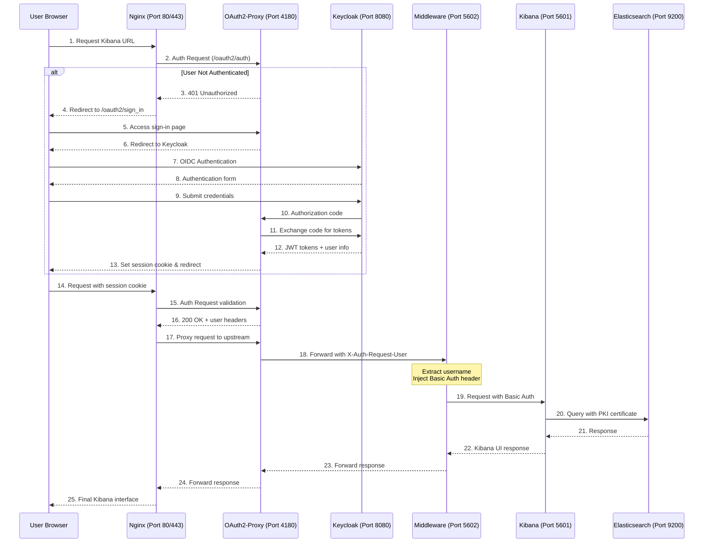

Struggling to secure your open-source Kibana? This post offers a robust solution. Implement Single Sign-On (SSO) to Kibana using Nginx as a reverse proxy.

Integrate seamlessly with Keycloak (LDAP or Active Directory) for centralised authentication. Fortify your Elastic Stack with Public Key Infrastructure (PKI) certificates. Ensure secure Kibana-to-Elasticsearch communication. All components are containerised and orchestrated with Docker Compose for easy deployment. Enhance security, streamline user access, and leverage existing AD infrastructure. A must-read for engineers seeking enterprise-grade Kibana security. Transform your data visualisation with uncompromised access control.

<!--more-->

------

* TOC
{:toc}
------

## Introduction
This post outlines the design for establishing a robust and secure access mechanism for Kibana. The core objective is to implement Single Sign-On (SSO) to Kibana, with user authentication handled by a sophisticated integration involving an Nginx reverse proxy and Windows Active Directory Federation Services (ADFS). Concurrently, the critical communication between Kibana and its underlying data store, Elasticsearch, is secured using Public Key Infrastructure (PKI) certificates. The entire solution is containerised using Docker Compose, ensuring ease of deployment, scalability, and reproducibility.

The deployment of open-source Elasticsearch and Kibana often presents a fundamental security challenge: a lack of robust, built-in authentication mechanisms. While these tools are powerful for data visualisation and analysis, their default configurations can expose sensitive data to unauthorised access if not properly secured. <span>Furthermore, advanced SSO capabilities, such as **OpenID Connect** (OIDC) integration, are typically not available in the community editions of Kibana</span>{:rtxt}. This necessitates the implementation of external security layers to achieve enterprise-grade authentication and access control.  

Nginx acts as the primary ingress point, providing an additional layer of security and traffic management before requests reach the Kibana server. An OAuth2 Proxy handles the complex OIDC authentication flow with ADFS, offloading this responsibility from Nginx and Kibana. ADFS, as the Identity Provider, centralises user authentication against Active Directory. Finally, PKI certificates secure the internal communication channel between Kibana and Elasticsearch, ensuring data integrity and confidentiality at the backend. This multi-faceted approach provides a comprehensive solution for secure and manageable access to the Elastic Stack.

## Architectural Design

### Conceptual Flow and Component Roles

A client's request for Kibana initiates a series of interactions across the integrated components:

1.  **Client (Browser):** The user's web browser initiates a request to the Kibana domain.
2.  **Nginx Reverse Proxy:** This serves as the initial entry point, performing SSL/TLS termination and acting as a traffic shaper[^1]. Nginx is configured to intercept requests to Kibana and delegate authentication checks to the OAuth2 Proxy using its `auth_request` module[^2]. Upon successful authentication, Nginx receives user identity information from the OAuth2 Proxy and injects it into HTTP headers before forwarding the request to Kibana.

> The [Nginx `auth_request` directive](http://nginx.org/en/docs/http/ngx_http_auth_request_module.html) allows Nginx to authenticate requests via the oauth2-proxy's `/auth` endpoint, which *only returns a 202 Accepted response or a 401 Unauthorized response* without proxying the request through.

3.  **OAuth2 Proxy:** <span>This component functions as an OpenID Connect (OIDC) client</span>{:gtxt}. When Nginx delegates an authentication request, OAuth2 Proxy initiates the OIDC flow with ADFS. It handles the redirect to ADFS for user login, processes the authorization code, exchanges it for tokens, and manages user sessions (often via cookies). Critically, it extracts user identity attributes (e.g., email, username) from the ADFS tokens and sets them as HTTP headers (e.g., `X-Auth-Request-User`, `X-Auth-Request-Email`) for the upstream Nginx server.  
4.  **ADFS (Active Directory Federation Services):** As the Identity Provider (IdP), ADFS[^3] is responsible for authenticating users against the Windows Active Directory[^4]. It participates in the OIDC flow, authenticating the user and issuing ID tokens and access tokens upon successful verification.  
5.  **Kibana:** This data visualization dashboard receives requests from Nginx. It is configured to recognize and trust the user identity information passed via specific HTTP headers from the Nginx reverse proxy. Kibana then uses this identity to interact with Elasticsearch. Furthermore, *Kibana connects to Elasticsearch using PKI[^5] certificates*, ensuring a secure backend communication channel.  
6.  **Elasticsearch:** The core distributed search and analytics engine. It is configured with a PKI realm, which authenticates incoming connections from Kibana (and potentially delegated end-user PKI authentication) based on X.509 client certificates. Role mappings within Elasticsearch then assign appropriate permissions to the authenticated Kibana instance or users based on the Distinguished Names (DNs) from these certificates.



Instead of Azure/Windows AD, I've used Keycloak as an Active Directory(AD).

### OAuth2 Proxy for OIDC Integration

Nginx-based SSO with ADFS could theoretically be met by directly integrating OpenID Connect functionality into Nginx using its `njs` (NGINX JavaScript) module[^6]. The `njs` is also available for Nginx Open Source(open-source project specifically designed to act as an OAuth2/OIDC proxy), implementing a full OIDC client, including state management, token handling, and session management, would necessitate extensive custom JavaScript scripting within Nginx.

By leveraging OAuth2 Proxy, the complex intricacies of the OIDC authentication handshake, token validation, and session management are offloaded from Nginx. This allows Nginx to focus on its primary functions as a reverse proxy and an authentication gatekeeper via its `auth_request` directive, significantly simplifying the overall Nginx configuration and reducing the need for advanced scripting[^7].

### ADFS Pre-configuration

The ADFS server[^8] must be pre-configured to support the OpenID Connect flow with OAuth2 Proxy. This involves creating an Application Group and noting specific credentials and endpoints:

-   **ADFS Server URL:** The base URL of your ADFS instance (e.g., `https://adfs.yourdomain.com`). This will be used by OAuth2 Proxy to initiate authentication requests.
-   **Application Group Creation:** Within the ADFS Management console, an Application Group must be created. This group should be configured as a "Server application" under the "Standalone applications" template. This template is appropriate for applications that can securely maintain a client secret.  
-   **Client ID and Client Secret:** During the Application Group creation process, ADFS will generate a unique Client ID and a Client Secret. It is imperative to record these values accurately, as they will be used by OAuth2 Proxy to identify itself to ADFS and secure the token exchang
-   **Redirect URI:** *A critical configuration point is the Redirect URI*. This is the URL where ADFS will send the authorization code after a user successfully authenticates. For OAuth2 Proxy, this URI must end with `/oauth2/callback` (e.g., `https://kibana.yourdomain.com/oauth2/callback`). This URI must be precisely configured in ADFS and must match the public URL where OAuth2 Proxy is exposed. Any mismatch will lead to authentication failures and redirect loops, as ADFS will refuse to send sensitive information to an unregistered or incorrect endpoint.  
-   **`openid` Scope:** Ensure that the `openid` scope is configured and requested within the ADFS application registration. This scope signals to ADFS that the application intends to use the OpenID Connect authentication protocol and requests an ID Token.

### DNS Configuration for Kibana Access

A fully qualified domain name (FQDN) is essential for accessing Kibana through Nginx and for the proper functioning of SSL certificates and ADFS redirects. A DNS record (e.g., `kibana.yourdomain.com`) must be created and configured to point to the IP address of the server hosting the Nginx reverse proxy[^9]. This FQDN will be used in Nginx's SSL certificate and as the base for the OAuth2 Proxy's redirect URI.

### External Dependency and Configuration Sensitivity

The requirement for Windows AD Single Sign-On inherently introduces ADFS as an external, critical dependency. The parameters such as Client ID, Client Secret, and especially the Redirect URI, are highly sensitive in OAuth 2.0 and OpenID Connect flows. <span>A minor discrepancy in the Redirect URI between what is registered in ADFS and what OAuth2 Proxy uses will inevitably result in authentication failures</span>{:rtxt}. This highlights that while the Docker Compose setup provides a self-contained environment for the application components, the external ADFS configuration acts as a foundational layer that must be perfectly aligned for the entire SSO solution to function.

## Project Structure and Environment Variables

### Recommended Folder Layout

The following directory structure is recommended to keep configuration files, certificates, and Docker-related assets logically separated:

```
.
├── AUTHENTICATION-APPROACH.md
├── QUICKSTART.md
├── README.md
├── certs
│   ├── bundle.zip
│   ├── ca
│   │   ├── ca.crt
│   │   └── ca.key
│   ├── ca.zip
│   ├── elasticsearch
│   │   ├── elasticsearch.crt
│   │   └── elasticsearch.key
│   └── kibana
│       ├── kibana.crt
│       └── kibana.key
├── cleanup.sh
├── docker-compose-simple.yml
├── docker-compose.yml
├── elasticsearch
│   └── config
│       ├── certificates
│       │   └── instances.yml
│       ├── elasticsearch.yml
│       └── role_mapping.yml
├── fs.txt
├── generate-nginx-ssl.sh
├── kibana
│   └── config
│       └── kibana.yml
├── make-executable.sh
├── middleware
│   ├── Dockerfile
│   └── middleware.js
├── nginx
│   ├── Dockerfile
│   ├── nginx-simple.conf.template
│   ├── nginx.conf.template
│   └── ssl
│       ├── nginx.crt
│       └── nginx.key
├── oauth2-proxy
│   └── Dockerfile
├── setup-elasticsearch-users.sh
├── setup.sh
└── troubleshoot.sh

14 directories, 32 files
```

### Detailed .env File Structure and Purpose

The .env file centralizes all configurable parameters, making it easy to adapt the POC to different environments without modifying core configuration files.

Environment Variables (`.env` file)

| **Variable Name**            | **Description**                                              | **Example Value**                                    | **Source References** |
| ---------------------------- | ------------------------------------------------------------ | ---------------------------------------------------- | --------------------- |
| `ADFS_CLIENT_ID`             | Client ID for OAuth2 Proxy, obtained from ADFS Application Group. | `your-adfs-client-id`                                |                       |
| `ADFS_CLIENT_SECRET`         | Client Secret for OAuth2 Proxy, obtained from ADFS Application Group. | `your-adfs-client-secret`                            |                       |
| `ADFS_AUTH_URL`              | ADFS Authorization Endpoint URL.                             | `https://adfs.yourdomain.com/adfs/oauth2/authorize/` |                       |
| `ADFS_TOKEN_URL`             | ADFS Token Endpoint URL.                                     | `https://adfs.yourdomain.com/adfs/oauth2/token/`     |                       |
| `ADFS_JWKS_URL`              | ADFS JWKS (JSON Web Key Set) URL for token validation.       | `https://adfs.yourdomain.com/adfs/certs`             |                       |
| `KIBANA_DOMAIN`              | The Fully Qualified Domain Name (FQDN) used to access Kibana. | `kibana.yourdomain.com`                              |                       |
| `KIBANA_BASE_PATH`           | The URL sub-path at which Kibana will be accessed.           | `/kibana`                                            |                       |
| `OAUTH2_PROXY_COOKIE_SECRET` | A randomly generated 32-byte base64 encoded string for OAuth2 Proxy session cookies. | `$(openssl rand -base64 32)`                         |                       |
| `ELASTIC_PASSWORD`           | Password for the `elastic` superuser in Elasticsearch.       | `yourstrongelasticpassword`                          |                       |
| `KIBANA_ENCRYPTION_KEY`      | A randomly generated 32-character alphanumeric value for Kibana, used for encrypting API keys. | `yourrandom32charalphanumeric`                       |                       |
| `ES_PKI_TRUSTSTORE_PASSWORD` | Password for the Elasticsearch PKI truststore (if the JKS file is password protected). | `yourpkitruststorepassword`                          |                       |

## Elasticsearch PKI Certificate Management

Securing the communication between Kibana and Elasticsearch using PKI certificates is a cornerstone of this POC. This section outlines the process of generating the necessary certificates, configuring Elasticsearch to use them, and establishing role mappings for PKI-authenticated entities.

### Generating CA and Client Certificates

Elasticsearch provides an official command-line utility, `elasticsearch-certutil`[^10], specifically designed for generating Certificate Authorities (CAs), Certificate Signing Requests (CSRs), and signed certificates for the Elastic Stack. For this POC, a self-signed root CA will be generated, which will then be used to sign instance certificates for both Elasticsearch and Kibana. This process is best managed within a Docker environment using a dedicated service in `docker-compose.yml`.  

The `create-certs.yml` (conceptualized from ) will orchestrate the execution of `elasticsearch-certutil`. This ensures that the certificate generation occurs in a controlled, isolated environment, and the resulting certificates are output to a shared `certs/` volume, making them accessible to other services.  

The following certificates will be generated:

-   **Root CA:** A `ca.crt` (certificate) and `ca.key` (private key) will be created. This root CA will serve as the trusted authority for all certificates within the Elastic Stack components.
-   **Elasticsearch Node Certificates:** `elasticsearch.crt` and `elasticsearch.key` will be generated for the Elasticsearch nodes. These are used to secure both the HTTP layer (for client communication) and the transport layer (for inter-node communication within the cluster).
-   **Kibana Client Certificate:** `kibana.crt` and `kibana.key` will be generated for Kibana. This certificate will be presented by Kibana to Elasticsearch for mutual TLS authentication.

The `elasticsearch-certutil` command typically produces a zip file containing PEM-formatted certificates and keys[^11]. 1 This zip file will then be extracted into the `certs/` directory, conforming to the recommended project structure.  

### Integrating Generated Certificates into the Elasticsearch Container

Once generated, the certificates must be made available to the Elasticsearch container. This is achieved by mounting the `certs/` directory as a Docker volume into the Elasticsearch container (e.g., to `/usr/share/elasticsearch/config/certs/`). This ensures that Elasticsearch can access its own certificates and the trusted CA certificate.

The `elasticsearch.yml` configuration file must then be updated to instruct Elasticsearch to use these certificates for TLS on its HTTP and transport layers. This involves specifying the paths to the certificate, private key, and the certificate authorities that Elasticsearch should trust:

```yaml
xpack.security.http.ssl.enabled: true
xpack.security.http.ssl.certificate: /usr/share/elasticsearch/config/certs/elasticsearch/elasticsearch.crt
xpack.security.http.ssl.key: /usr/share/elasticsearch/config/certs/elasticsearch/elasticsearch.key
xpack.security.http.ssl.certificate_authorities: /usr/share/elasticsearch/config/certs/ca/ca.crt

xpack.security.transport.ssl.enabled: true
xpack.security.transport.ssl.certificate: /usr/share/elasticsearch/config/certs/elasticsearch/elasticsearch.crt
xpack.security.transport.ssl.key: /usr/share/elasticsearch/config/certs/elasticsearch/elasticsearch.key
xpack.security.transport.ssl.certificate_authorities: /usr/share/elasticsearch/config/certs/ca/ca.crt
```

Additionally, client authentication must be enabled on the desired network layers by setting `xpack.security.http.ssl.client_authentication` and `xpack.security.transport.ssl.client_authentication` to `required` or `optional`. Setting it to `required` ensures that only clients presenting a valid certificate are allowed to connect, while `optional` allows other authentication methods to be used if a certificate is not presented.

### Configuring Elasticsearch's `pki` Realm for Delegation and Truststore

To enable Elasticsearch to authenticate Kibana (and potentially delegated end-user certificates) using PKI, a `pki` realm must be configured in `elasticsearch.yml` under the `xpack.security.authc.realms.pki` namespace. The `order` attribute is crucial as it determines the precedence of this realm in the authentication chain.

Enabling `delegation.enabled: true` is important. While the immediate goal is Kibana's authentication to Elasticsearch, this setting allows Elasticsearch to validate client certificates that are presented to Kibana and then forwarded. This is a common pattern for more advanced scenarios where end-user PKI authentication might be delegated through Kibana.

A `truststore` or `certificate_authorities` must also be configured within the PKI realm. This explicitly tells Elasticsearch which Certificate Authorities it should trust when validating incoming client certificates for PKI authentication. In this setup, it will point to the `ca.crt` generated earlier, ensuring that Kibana's certificate (signed by this CA) is trusted.

> If the truststore is password-protected, the password must be added to the Elasticsearch keystore.

Furthermore, `xpack.security.authc.token.enabled` must be set to `true` for token-based authentication and PKI delegation to function correctly. 

An optional `username_pattern` can be defined to extract the username from a specific attribute within the certificate's Subject Distinguished Name (DN), such as the email address or Common Name (CN). 

> By default, the CN is used as the username.

```yaml
xpack:
  security:
    authc:
      token.enabled: true # Required for PKI delegation
      realms:
        pki:
          pki1:
            order: 1
            delegation.enabled: true
            truststore:
              path: "certs/ca/ca.crt" # Path to the CA certificate trusted by this PKI realm
              # If using JKS truststore: path: "pki1_truststore.jks"
              # If truststore is password protected, add to keystore:
              # bin/elasticsearch-keystore add xpack.security.authc.realms.pki.pki1.truststore.secure_password
            username_pattern: "CN=(.*?)(?:,|$)" # Example: extract CN as username
```

### Mapping Distinguished Names (DNs) from Certificates to Elasticsearch Roles

In Elasticsearch's security model, PKI users are identified by the Distinguished Name (DN) found in their X.509 certificate. To grant appropriate permissions, these DNs must be mapped to specific Elasticsearch roles. This can be achieved either through the `_security/role_mapping` API or by defining mappings in a `role_mapping.yml` file.

For Kibana's connection, its client certificate's DN (e.g., `CN=kibana.yourdomain.com,OU=IT,O=YourOrg,L=City,ST=State,C=Country`) will be mapped to a role that grants it the necessary permissions to manage Kibana and interact with Elasticsearch, such as `kibana_system` or a custom `kibana_user` role.

Example using a `role_mapping.yml` file:

```yaml
kibana_system:
  - "CN=kibana.yourdomain.com,OU=IT,O=YourOrg,L=City,ST=State,C=Country"
```

This file would be mounted into the Elasticsearch container (e.g., to `/usr/share/elasticsearch/config/role_mapping.yml`). Alternatively, the mapping can be applied via the Elasticsearch API after the cluster is up:

```json
PUT /_security/role_mapping/kibana_pki_role {
  "roles" : [ "kibana_system" ],
  "rules" : { "field" : {
    "dn" : "CN=kibana.yourdomain.com,OU=IT,O=YourOrg,L=City,ST=State,C=Country"
  } },
  "enabled": true
}
```

You have to set up `Kibana_system` user as well:

```bash
# Set up kibana_system user
echo "Setting up kibana_system user..."
curl -k -X POST "https://localhost:9200/_security/user/kibana_system/_password" \
  -H "Content-Type: application/json" \
  -u elastic:${ELASTIC_PASSWORD} \
  -d "{\"password\":\"${ELASTIC_PASSWORD}\"}"
```


### Elasticsearch PKI Realm Configuration Parameters (in `elasticsearch.yml`)

| **Parameter**                                             | **Description**                                              | **Example Value**        | **Source References** |
| --------------------------------------------------------- | ------------------------------------------------------------ | ------------------------ | --------------------- |
| `xpack.security.authc.realms.pki.pki1.order`              | Specifies the order in which this PKI realm is consulted during the authentication process. | `1`                      |                       |
| `xpack.security.authc.realms.pki.pki1.delegation.enabled` | Enables the realm to validate PKI authentication requests delegated from Kibana. | `true`                   |                       |
| `xpack.security.authc.realms.pki.pki1.truststore.path`    | Path to the JKS truststore or PEM file containing trusted CA certificates for validating client certificates. | `"certs/ca/ca.crt"`      |                       |
| `xpack.security.authc.realms.pki.pki1.username_pattern`   | A regular expression to extract the desired username from the Subject DN of the client certificate. | `"EMAILADDRESS=(.*?)(?:, | $)"`                  |
| `xpack.security.authc.token.enabled`                      | Globally enables token-based authentication, which is a prerequisite for PKI delegation. | `true`                   |                       |
| `xpack.security.http.ssl.client_authentication`           | Defines whether client certificates are `required`, `optional`, or `none` for HTTP connections. | `required`               |                       |
| `xpack.security.transport.ssl.client_authentication`      | Defines whether client certificates are `required`, `optional`, or `none` for transport layer connections. | `required`               |                       |

### PKI for Service-to-Service Authentication & Potential User Delegation

The PKI setup in this case is for a dual purpose. Primarily, it establishes a secure, mutually authenticated channel for communication between Kibana and Elasticsearch. When Kibana connects to Elasticsearch, it presents its client certificate, which Elasticsearch validates against its configured PKI realm and trusted CA. This ensures that only authorized Kibana instances can interact with the Elasticsearch cluster.

Beyond this crucial service-to-service authentication, the `delegation.enabled` setting within the Elasticsearch PKI realm signifies a more advanced capability. It prepares Elasticsearch to validate _end-user_ certificates that might be presented to Kibana and then forwarded to Elasticsearch. This means that while the immediate focus is on Kibana's authentication to Elasticsearch, the architecture lays the groundwork for a potential future scenario where end-users could also authenticate directly via PKI through Kibana, with their certificates being validated by Elasticsearch. The `truststore` configuration within the PKI realm is fundamental to this entire process, as it dictates which Certificate Authorities Elasticsearch will accept as valid issuers for any incoming client certificates, thereby enforcing a strict trust boundary.

## Kibana Configuration for Proxy Authentication

Kibana must be specifically configured to integrate with the Nginx and OAuth2 Proxy layers, expecting authentication details to be passed via HTTP headers and establishing its own secure connection to Elasticsearch using PKI.  

### Basic Kibana Settings

Several foundational settings in `kibana.yml` are necessary for Kibana to function correctly behind a reverse proxy and within the Docker network:

-   **Base Path Configuration:** To ensure Kibana assets and URLs are correctly resolved when accessed via a sub-path (e.g., `https://kibana.yourdomain.com/kibana`), `server.basePath` must be set to the desired sub-path (e.g., `/kibana`) and `server.rewriteBasePath` to `true`. This tells Kibana to respect the URL path from incoming requests.  
-   **Network Binding:** Kibana should be configured to listen on all network interfaces within its Docker container (`server.host: "0.0.0.0"`) and its default port (`server.port: 5601`)[^13]. This allows Nginx to reach it within the Docker network.  
-   **Elasticsearch Connection:** `elasticsearch.hosts` must point to the Elasticsearch service's internal name and port within the Docker network (e.g., `https://elasticsearch:9200`).
-   **Internal User (Fallback/Setup):** While PKI is the primary authentication for Kibana to Elasticsearch, it's common to configure `elasticsearch.username` and `elasticsearch.password` for Kibana's internal user (e.g., `kibana_system`)[^12]. This provides a fallback or initial connection mechanism, especially during setup or if PKI experiences issues.

### Enabling Proxy Authentication in `kibana.yml`

Kibana's security features allow it to delegate user authentication to an upstream proxy. This is enabled by setting X-Pack setting for Elastic Stack's built-in security[^14]. This configuration instructs Kibana to expect authentication details from an external proxy rather than presenting its own login form. Crucially, Kibana must be explicitly told which HTTP headers to trust for user identity information. This is achieved by whitelisting these headers in `elasticsearch.requestHeadersWhitelist`. This whitelist should include headers like `Authorization` (if used for internal communication), `x-forwarded-for` (essential for proxy functionality), and the custom headers that OAuth2 Proxy and Nginx will use to pass user details (e.g., `x-proxy-user`, `x-proxy-roles`).

### The Trust Boundary of Proxy Authentication

Kibana's reliance on proxy authentication fundamentally shifts the trust boundary. It trusts that the upstream proxy (Nginx, in this case, which in turn trusts OAuth2 Proxy) has correctly authenticated the user and accurately provided their identity via specific HTTP headers. the `elasticsearch.requestHeadersWhitelist` setting in Kibana is a necessary control, preventing arbitrary headers from being processed. However, the ultimate gatekeeper for this trust lies within Elasticsearch's security configuration, specifically the `internalProxies` setting. This setting ensures that Elasticsearch's security plugin only accepts sensitive proxy headers (like `x-proxy-user` and `x-proxy-roles`) from a predefined list of trusted IP addresses, which in this containerized setup would be the internal IP address of the Kibana container. By diligently configuring `internalProxies` in Elasticsearch and carefully whitelisting headers in Kibana, the chain of trust for user identity is maintained securely from the initial authentication via ADFS, through the Nginx and OAuth2 Proxy layers, to Kibana, and finally to Elasticsearch. This layered validation is essential for a secure deployment.

## ADFS Application Group Setup

The successful integration of Windows Active Directory Federation Services (ADFS) as the Identity Provider (IdP) is paramount for the Single Sign-On (SSO) functionality. 

### Step-by-Step Guide for Creating a "Server Application" Group in ADFS

The following steps outline the process within the ADFS Management console on your Windows Server:

1.  **Open ADFS Management:** Launch the AD FS Management console.
2.  **Add Application Group:** In the left navigation column, right-click on the `Application Groups` folder and select `Add Application Group` from the context menu. This action opens the `Add Application Group Wizard`.
3.  **Select Template:** In the `Welcome` step of the wizard, provide a descriptive `Name` for the application group (e.g., "KibanaSSO"). Under the `Standalone applications` template section, select `Server application`. This template is suitable for applications that can securely manage a client secret. Click `Next`.  
4.  **Configure Application Credentials:** Proceed to the `Configure Application Credentials` step.
    -   **Generate Shared Secret:** Check the `Generate a shared secret` box. ADFS will automatically generate a `Client ID` and a `Client Secret`. It is absolutely critical to **make a note of both these values** (e.g., by copying them to a secure file). These credentials are essential for OAuth2 Proxy to authenticate with ADFS during the OIDC flow and will be populated in the `.env` file.
    -   **Redirect URI:** In the `Redirect URI` field, enter the full public URL where your OAuth2 Proxy instance will be accessible, followed by the OIDC callback path. This URI must be precise and match the configuration in OAuth2 Proxy. For example, if Kibana is accessed via `https://kibana.yourdomain.com/kibana`, and OAuth2 Proxy listens on the root path, the Redirect URI would be `https://kibana.yourdomain.com/oauth2/callback`. 1 Click `Add` to include this URI. This URI is highly sensitive and must exactly match what OAuth2 Proxy is configured to use to prevent security vulnerabilities and ensure successful redirects.
5.  **Summary and Completion:** Review the summary of your configurations in the `Summary` step. Make any necessary corrections, then click `Next`. Finally, click `Close` to complete the wizard.

### Scope Configuration

During the ADFS application registration, ensure that the `openid` scope is configured and requested. The `openid` scope is fundamental for OpenID Connect, signaling the application's intent to use the protocol and request an ID Token from ADFS. Other scopes like `profile` or `email` can also be added if additional user attributes are required by OAuth2 Proxy or Kibana.  

The exact matching of the Redirect URI is a common point of failure in OAuth 2.0 and OpenID Connect integrations. ADFS will strictly enforce that the `redirect_uri` parameter sent in the authentication request from OAuth2 Proxy matches one of the pre-registered URIs. Any deviation, even a trailing slash or a difference in case, will cause ADFS to reject the request, preventing the authorization code from being returned and thus breaking the SSO flow. This emphasizes the need for meticulous attention to detail during the ADFS configuration phase.

## Docker Compose Orchestration

The entire solution is orchestrated using `docker-compose.yml`, which defines the services, networks, and volumes required for Elasticsearch, Kibana, Nginx, and OAuth2 Proxy to interact seamlessly.

```yaml
version: '3.8'

services:
  # Keycloak as OIDC provider (replacing ADFS for POC)
  # keycloak:
  #   image: quay.io/keycloak/keycloak:24.0.1
  #   container_name: keycloak
  #   environment:
  #     - KEYCLOAK_ADMIN=admin
  #     - KEYCLOAK_ADMIN_PASSWORD=admin
  #     - KC_HTTP_ENABLED=true
  #     - KC_HOSTNAME_STRICT=false
  #     - KC_HOSTNAME_STRICT_HTTPS=false
  #   command: start-dev
  #   ports:
  #     - "8080:8080"
  #   networks:
  #     - elk-network
  #   healthcheck:
  #     test: ["CMD", "curl", "-f", "http://localhost:8080/health"]
  #     interval: 30s
  #     timeout: 10s
  #     retries: 5

  # Service to generate PKI certificates for Elasticsearch and Kibana
  create_certs:
    image: docker.elastic.co/elasticsearch/elasticsearch:${ELASTIC_VERSION}
    container_name: create_certs
    command: >
      bash -c "
        if [ ! -f /certs/ca/ca.crt ]; then
          echo 'Generating CA and instance certificates...'
          /usr/share/elasticsearch/bin/elasticsearch-certutil ca --silent --pem --out /certs/ca.zip;
          unzip /certs/ca.zip -d /certs;
          /usr/share/elasticsearch/bin/elasticsearch-certutil cert --silent --pem --ca-cert=/certs/ca/ca.crt --ca-key=/certs/ca/ca.key --in /usr/share/elasticsearch/config/certificates/instances.yml --out /certs/bundle.zip;
          unzip /certs/bundle.zip -d /certs;
          chmod -R 777 /certs;
          echo 'Certificates generated successfully.'
        else
          echo 'Certificates already exist. Skipping generation.'
        fi
      "
    volumes:
      - ./certs:/certs
      - ./elasticsearch/config/certificates:/usr/share/elasticsearch/config/certificates
    user: "0"
    networks:
      - elk-network

  elasticsearch:
    image: docker.elastic.co/elasticsearch/elasticsearch:${ELASTIC_VERSION}
    container_name: elasticsearch
    environment:
      - cluster.name=docker-cluster
      - bootstrap.memory_lock=true
      - "ES_JAVA_OPTS=-Xms1g -Xmx1g"
      - ELASTIC_PASSWORD=${ELASTIC_PASSWORD}
      - xpack.security.enabled=true
      - xpack.security.authc.token.enabled=true
      - xpack.security.http.ssl.enabled=true
      - xpack.security.http.ssl.certificate=/usr/share/elasticsearch/config/certs/elasticsearch/elasticsearch.crt
      - xpack.security.http.ssl.key=/usr/share/elasticsearch/config/certs/elasticsearch/elasticsearch.key
      - xpack.security.http.ssl.certificate_authorities=/usr/share/elasticsearch/config/certs/ca/ca.crt
      - xpack.security.http.ssl.client_authentication=optional
      - xpack.security.transport.ssl.enabled=true
      - xpack.security.transport.ssl.certificate=/usr/share/elasticsearch/config/certs/elasticsearch/elasticsearch.crt
      - xpack.security.transport.ssl.key=/usr/share/elasticsearch/config/certs/elasticsearch/elasticsearch.key
      - xpack.security.transport.ssl.certificate_authorities=/usr/share/elasticsearch/config/certs/ca/ca.crt
      - xpack.security.transport.ssl.client_authentication=required
      - discovery.type=single-node
      - xpack.license.self_generated.type=basic
    ulimits:
      memlock:
        soft: -1
        hard: -1
    volumes:
      - elasticsearch_data:/usr/share/elasticsearch/data
      - ./elasticsearch/config/elasticsearch.yml:/usr/share/elasticsearch/config/elasticsearch.yml
      - ./certs:/usr/share/elasticsearch/config/certs
      - ./elasticsearch/config/role_mapping.yml:/usr/share/elasticsearch/config/role_mapping.yml
    ports:
      - "9200:9200"
    networks:
      - elk-network
    healthcheck:
      test: ["CMD", "curl", "-f", "-k", "-u", "elastic:${ELASTIC_PASSWORD}", "https://localhost:9200"]
      interval: 10s
      timeout: 10s
      retries: 120

  kibana:
    image: docker.elastic.co/kibana/kibana:${ELASTIC_VERSION}
    container_name: kibana
    environment:
      - SERVER_NAME=${KIBANA_DOMAIN}
      - SERVER_HOST=0.0.0.0
      - ELASTICSEARCH_HOSTS=https://elasticsearch:9200
      - ELASTICSEARCH_USERNAME=kibana_system
      - ELASTICSEARCH_PASSWORD=${ELASTIC_PASSWORD}
      - ELASTICSEARCH_SSL_VERIFICATIONMODE=full
      - ELASTICSEARCH_SSL_CERTIFICATEAUTHORITIES=/usr/share/kibana/config/certs/ca/ca.crt
      - ELASTICSEARCH_SSL_CERTIFICATE=/usr/share/kibana/config/certs/kibana/kibana.crt
      - ELASTICSEARCH_SSL_KEY=/usr/share/kibana/config/certs/kibana/kibana.key
      - XPACK_ENCRYPTEDSAVEDOBJECTS_ENCRYPTIONKEY=${KIBANA_ENCRYPTION_KEY}
      # Anonymous access for OAuth2-Proxy
      # - XPACK_SECURITY_AUTHC_PROVIDERS_ANONYMOUS_ANONYMOUS1_ORDER=0
      # - XPACK_SECURITY_AUTHC_PROVIDERS_ANONYMOUS_ANONYMOUS1_CREDENTIALS_USERNAME=anonymous
      # - XPACK_SECURITY_AUTHC_PROVIDERS_ANONYMOUS_ANONYMOUS1_CREDENTIALS_PASSWORD=anonymous
    volumes:
      - ./kibana/config/kibana.yml:/usr/share/kibana/config/kibana.yml
      - ./certs:/usr/share/kibana/config/certs
    ports:
      - "5601:5601"
    networks:
      - elk-network
    depends_on:
      elasticsearch:
        condition: service_healthy
    healthcheck:
      test: ["CMD", "curl", "-f", "http://localhost:5601/api/status"]
      interval: 10s
      timeout: 10s
      retries: 120

  oauth2-proxy:
    build:
      context: ./oauth2-proxy
      dockerfile: Dockerfile
    container_name: oauth2-proxy
    environment:
      - OAUTH2_PROXY_PROVIDER=oidc
      - OAUTH2_PROXY_CLIENT_ID=${ADFS_CLIENT_ID}
      - OAUTH2_PROXY_CLIENT_SECRET=${ADFS_CLIENT_SECRET}
      - OAUTH2_PROXY_OIDC_ISSUER_URL=http://192.168.1.139:8080/realms/master
      - OAUTH2_PROXY_REDIRECT_URL=http://${KIBANA_DOMAIN}/oauth2/callback
      - OAUTH2_PROXY_UPSTREAMS=http://middleware:5602
      # Skip auth for Kibana API endpoints
      - OAUTH2_PROXY_SKIP_AUTH_REGEX=^/api/.*|^/bundles/.*|^/built_assets/.*|^/ui/.*
      - OAUTH2_PROXY_HTTP_ADDRESS=0.0.0.0:4180
      - OAUTH2_PROXY_COOKIE_SECRET=${OAUTH2_PROXY_COOKIE_SECRET}
      - OAUTH2_PROXY_COOKIE_DOMAIN=${KIBANA_DOMAIN}
      - OAUTH2_PROXY_COOKIE_SECURE=false
      - OAUTH2_PROXY_SET_XAUTHREQUEST=true
      - OAUTH2_PROXY_PASS_USER_HEADERS=true
      - OAUTH2_PROXY_OIDC_USERNAME_CLAIM=preferred_username

      # - OAUTH2_PROXY_PASS_BASIC_AUTH=true
      # - OAUTH2_PROXY_BASIC_AUTH_PASSWORD="password"
      # - OAUTH2_PROXY_SET_AUTHORIZATION_HEADER=true
      # - OAUTH2_PROXY_HEADER_NAME=Authorization
      # - OAUTH2_PROXY_HEADER_VALUE="Basic ZWxhc3RpYzplbGFzdGljcGFzc3dvcmQxMjM="

      - OAUTH2_PROXY_EMAIL_DOMAINS=*
      - OAUTH2_PROXY_SCOPE=openid profile email
      - OAUTH2_PROXY_SKIP_PROVIDER_BUTTON=true
      - OAUTH2_PROXY_INSECURE_OIDC_ALLOW_UNVERIFIED_EMAIL=true
      - OAUTH2_PROXY_INSECURE_OIDC_SKIP_ISSUER_VERIFICATION=true
      - OAUTH2_PROXY_SSL_INSECURE_SKIP_VERIFY=true
    ports:
      - "4180:4180"
    networks:
      - elk-network
    depends_on:
      # keycloak:
      #   condition: service_healthy
      kibana:
        condition: service_healthy

  nginx:
    build:
      context: ./nginx
      dockerfile: Dockerfile
    container_name: nginx
    environment:
      - KIBANA_DOMAIN=${KIBANA_DOMAIN}
      - KIBANA_BASE_PATH=${KIBANA_BASE_PATH}
    volumes:
      - ./nginx/nginx.conf.template:/etc/nginx/nginx.conf.template:ro
      - ./nginx/ssl:/etc/nginx/ssl:ro
    ports:
      - "80:80"
      - "443:443"
    networks:
      - elk-network
    depends_on:
      oauth2-proxy:
        condition: service_started
    command: /bin/bash -c "envsubst '$${KIBANA_DOMAIN} $${KIBANA_BASE_PATH}' < /etc/nginx/nginx.conf.template > /etc/nginx/nginx.conf && nginx -g 'daemon off;'"
  middleware:
    build:
      context: ./middleware
      dockerfile: Dockerfile
    container_name: middleware
    ports:
      - "5602:5602"    
    networks:
      - elk-network
    depends_on:
      kibana:
        condition: service_healthy

volumes:
  elasticsearch_data:

networks:
  elk-network:
    driver: bridge

```

### Service Breakdown:

- **`create_certs`:** This ephemeral service is responsible for generating the PKI certificates required for Elasticsearch and Kibana. It uses the official Elasticsearch Docker image to run `elasticsearch-certutil`, which simplifies the certificate generation process. The certificates are output to the shared `certs/` volume, making them accessible to other services. This service is designed to be run once manually () before the main stack is brought up.

    ```bash
    docker-compose -f docker-compose.yml run --rm create_certs
    ```

    

- **`elasticsearch`:** This service runs the Elasticsearch container. It mounts a persistent volume for data (`elasticsearch_data`) and the `certs/` volume for its PKI certificates. Environment variables configure its cluster name, memory limits, and crucially, enable X-Pack security, including the PKI realm for authentication. It also mounts its `elasticsearch.yml` and `role_mapping.yml` for custom configurations.  

- **`kibana`:** This service runs the Kibana container. It depends on Elasticsearch being healthy. It mounts its `kibana.yml` and the `certs/` volume for its PKI client certificate to connect to Elasticsearch. Environment variables configure its base path, Elasticsearch connection details, and settings for proxy-based authentication, including whitelisting headers and specifying user/role headers.  

- **`oauth2-proxy`:** This service builds and runs the OAuth2 Proxy container. It is configured with environment variables to connect to ADFS, including Client ID, Client Secret, ADFS endpoints, and the Redirect URL. It specifies Kibana as its upstream service. It also configures which headers to set for the upstream Nginx, such as `X-Auth-Request-User` and `X-Auth-Request-Email`.  

-   **`nginx`:** This service builds and runs the Nginx reverse proxy. It mounts its `nginx.conf.template` and the SSL certificates for the Kibana domain. The `command` uses `envsubst` to dynamically inject environment variables (like `KIBANA_DOMAIN` and `KIBANA_BASE_PATH`) into the Nginx configuration file at runtime. Nginx is configured to listen on ports 80 and 443, redirect HTTP to HTTPS, and use the `auth_request` directive to delegate authentication to the `oauth2-proxy` service. It then proxies authenticated requests to Kibana, forwarding the user identity headers received from OAuth2 Proxy.  

#### Network Configuration

A custom bridge network, `elk-network`, is defined to allow all services to communicate with each other securely and privately without exposing internal ports to the host machine, except for Nginx's public ports (80 and 443).

### Other files

#### Nginx Dockerfile (`nginx/Dockerfile`)

This Dockerfile is responsible for building the Nginx image with the necessary tools and configuration for dynamic environment variable substitution.

```dockerfile
FROM nginx:latest

# Install envsubst for dynamic configuration
RUN apt-get update && \
    apt-get install -y gettext-base && \
    rm -rf /var/lib/apt/lists/*

# Copy the Nginx configuration template
COPY nginx.conf.template /etc/nginx/nginx.conf.template

# Create SSL directory
RUN mkdir -p /etc/nginx/ssl

# Entrypoint command is handled by docker-compose to use envsubst
# and then start nginx in the foreground
```

Here the nginx.conf.template

```json
worker_processes auto;

events {
    worker_connections 1024;
}

http {
    include       mime.types;
    default_type  application/octet-stream;

    sendfile        on;
    keepalive_timeout  65;

    # OAuth2 Proxy upstream
    upstream oauth2_proxy {
        server oauth2-proxy:4180;
    }

    # Kibana upstream
    upstream kibana_backend {
        server kibana:5601;
    }

    # HTTP server block
    server {
        listen 80;
        server_name ${KIBANA_DOMAIN};

        # OAuth2 Proxy endpoints
        location /oauth2/ {
            proxy_pass http://oauth2_proxy;
            proxy_set_header Host $host;
            proxy_set_header X-Real-IP $remote_addr;
            proxy_set_header X-Forwarded-For $proxy_add_x_forwarded_for;
            proxy_set_header X-Scheme $scheme;
            proxy_set_header X-Auth-Request-Redirect $request_uri;
        }

        # Authentication endpoint for Nginx auth_request
        location = /oauth2/auth {
            proxy_pass http://oauth2_proxy;
            proxy_set_header Host $host;
            proxy_set_header X-Real-IP $remote_addr;
            proxy_set_header X-Forwarded-For $proxy_add_x_forwarded_for;
            proxy_set_header X-Forwarded-Uri $request_uri;
            proxy_set_header Content-Length "";
            proxy_pass_request_body off;
        }

        # Kibana application location
        location / {
            auth_request /oauth2/auth;
            error_page 401 = /oauth2/sign_in;

            # Pass user identity headers from OAuth2 Proxy to Kibana
            auth_request_set $user $upstream_http_x_auth_request_user;
            auth_request_set $email $upstream_http_x_auth_request_email;
            proxy_set_header X-Proxy-User $user;
            proxy_set_header X-Proxy-Email $email;
            proxy_set_header X-Auth-Request-User $user;
            proxy_set_header X-Auth-Request-Email $email;

            # If OAuth2 Proxy sets a Set-Cookie header for session refresh
            auth_request_set $auth_cookie $upstream_http_set_cookie;
            add_header Set-Cookie $auth_cookie;

            proxy_pass http://oauth2_proxy/;
            proxy_set_header Host $host;
            proxy_set_header X-Real-IP $remote_addr;
            proxy_set_header X-Forwarded-For $proxy_add_x_forwarded_for;
            proxy_set_header X-Forwarded-Proto $scheme;
            proxy_set_header X-Forwarded-Host $host;
            proxy_redirect off;

            # Adjust buffer sizes if cookie size is an issue
            proxy_buffer_size 128k;
            proxy_buffers 4 256k;
            proxy_busy_buffers_size 256k;
        }

        # Health check endpoint
        location /health {
            access_log off;
            return 200 "OK\n";
            add_header Content-Type text/plain;
        }
    }

    # HTTPS server block (optional for POC, using self-signed cert)
    server {
        listen 443 ssl;
        server_name ${KIBANA_DOMAIN};

        ssl_certificate /etc/nginx/ssl/nginx.crt;
        ssl_certificate_key /etc/nginx/ssl/nginx.key;

        ssl_session_cache shared:SSL:10m;
        ssl_session_timeout 10m;
        ssl_protocols TLSv1.2 TLSv1.3;
        ssl_ciphers 'ECDHE-ECDSA-AES128-GCM-SHA256:ECDHE-RSA-AES128-GCM-SHA256:ECDHE-ECDSA-AES256-GCM-SHA384:ECDHE-RSA-AES256-GCM-SHA384';
        ssl_prefer_server_ciphers on;

        # Same location blocks as HTTP server
        location /oauth2/ {
            proxy_pass http://oauth2_proxy;
            proxy_set_header Host $host;
            proxy_set_header X-Real-IP $remote_addr;
            proxy_set_header X-Forwarded-For $proxy_add_x_forwarded_for;
            proxy_set_header X-Scheme $scheme;
            proxy_set_header X-Auth-Request-Redirect $request_uri;
        }

        location = /oauth2/auth {
            proxy_pass http://oauth2_proxy;
            proxy_set_header Host $host;
            proxy_set_header X-Real-IP $remote_addr;
            proxy_set_header X-Forwarded-For $proxy_add_x_forwarded_for;
            proxy_set_header X-Forwarded-Uri $request_uri;
            proxy_set_header Content-Length "";
            proxy_pass_request_body off;
        }

        location / {
            auth_request /oauth2/auth;
            error_page 401 = /oauth2/sign_in;

            auth_request_set $user $upstream_http_x_auth_request_user;
            auth_request_set $email $upstream_http_x_auth_request_email;
            proxy_set_header X-Proxy-User $user;
            proxy_set_header X-Proxy-Email $email;
            proxy_set_header X-Auth-Request-User $user;
            proxy_set_header X-Auth-Request-Email $email;

            auth_request_set $auth_cookie $upstream_http_set_cookie;
            add_header Set-Cookie $auth_cookie;

            proxy_pass http://oauth2_proxy/;
            proxy_set_header Host $host;
            proxy_set_header X-Real-IP $remote_addr;
            proxy_set_header X-Forwarded-For $proxy_add_x_forwarded_for;
            proxy_set_header X-Forwarded-Proto $scheme;
            proxy_set_header X-Forwarded-Host $host;
            proxy_redirect off;

            proxy_buffer_size 128k;
            proxy_buffers 4 256k;
            proxy_busy_buffers_size 256k;
        }
    }
}
```

Create self-signed certificates for Nginx:

```bash
# Create SSL directory if it doesn't exist
mkdir -p nginx/ssl

# Generate private key
openssl genpkey -algorithm RSA -out nginx/ssl/nginx.key -pkeyopt rsa_keygen_bits:2048

# Generate certificate signing request
openssl req -new -key nginx/ssl/nginx.key -out nginx/ssl/nginx.csr \
  -subj "/C=US/ST=CA/L=Mountain View/O=POC/CN=localhost"

# Generate self-signed certificate
openssl x509 -req -days 365 -in nginx/ssl/nginx.csr -signkey nginx/ssl/nginx.key -out nginx/ssl/nginx.crt

# Remove CSR as it's no longer needed
rm nginx/ssl/nginx.csr
```


#### OAuth2 Proxy Dockerfile (`oauth2-proxy/Dockerfile`)

This Dockerfile builds the image for OAuth2 Proxy, ensuring it has the necessary binary to run.

```dockerfile
FROM quay.io/oauth2-proxy/oauth2-proxy:latest
```

### Configuration Files Content

The following sections provide the detailed content for the critical configuration files within the project structure.

`elasticsearch/config/elasticsearch.yml`

```yaml
cluster.name: docker-cluster
network.host: 0.0.0.0
http.port: 9200

# Memory settings
bootstrap.memory_lock: true

# X-Pack Security Configuration
xpack.security.enabled: true

# PKI Realm for Kibana communication
# xpack.security.authc.realms.pki.pki1:
#   order: 1
#   delegation.enabled: true
#   certificate_authorities: [ "/usr/share/elasticsearch/config/certs/ca/ca.crt" ]
#   username_pattern: "CN=(.*?)(?:,|$)"

# Enable Token-based authentication
xpack.security.authc.token.enabled: true

# HTTP SSL/TLS configuration
xpack.security.http.ssl.enabled: true
xpack.security.http.ssl.certificate: /usr/share/elasticsearch/config/certs/elasticsearch/elasticsearch.crt
xpack.security.http.ssl.key: /usr/share/elasticsearch/config/certs/elasticsearch/elasticsearch.key
xpack.security.http.ssl.certificate_authorities: [ "/usr/share/elasticsearch/config/certs/ca/ca.crt" ]
xpack.security.http.ssl.client_authentication: optional

# Transport SSL/TLS configuration
xpack.security.transport.ssl.enabled: true
xpack.security.transport.ssl.certificate: /usr/share/elasticsearch/config/certs/elasticsearch/elasticsearch.crt
xpack.security.transport.ssl.key: /usr/share/elasticsearch/config/certs/elasticsearch/elasticsearch.key
xpack.security.transport.ssl.certificate_authorities: [ "/usr/share/elasticsearch/config/certs/ca/ca.crt" ]
xpack.security.transport.ssl.client_authentication: required

# File realm for initial setup/admin
xpack.security.authc.realms.file.file1:
  order: 0

# Native realm
xpack.security.authc.realms.native.native1:
  order: 2

# Enable API keys
xpack.security.authc.api_key.enabled: true

# Discovery settings for single-node
discovery.type: single-node

# License settings
xpack.license.self_generated.type: basic

```

`kibana/config/kibana.yml`

```yaml
server.name: kibana
server.host: "0.0.0.0"
server.port: 5601

# Elasticsearch connection settings
elasticsearch.hosts: ["https://elasticsearch:9200"]
elasticsearch.username: "kibana_system"
elasticsearch.password: "elasticpassword123"

# Kibana's PKI client certificate for connecting to Elasticsearch
elasticsearch.ssl.verificationMode: full
elasticsearch.ssl.certificateAuthorities: ["/usr/share/kibana/config/certs/ca/ca.crt"]
elasticsearch.ssl.certificate: /usr/share/kibana/config/certs/kibana/kibana.crt
elasticsearch.ssl.key: /usr/share/kibana/config/certs/kibana/kibana.key

# Encryption key for Kibana
xpack.encryptedSavedObjects.encryptionKey: "a1b2c3d4e5f6g7h8i9j0k1l2m3n4o5p6"

# Disable Kibana's own authentication since OAuth2-Proxy handles it
# xpack.security.authc.providers.anonymous.anonymous1:
#   order: 0
#   credentials:
#     username: "anonymous"
#     password: "anonymous"
# Enable basic authentication
xpack.security.authc.providers.basic.basic1:
  order: 0
  enabled: true

   
# Allow embedding in iframes from the same origin (for OAuth2-Proxy)
server.securityResponseHeaders.disableEmbedding: false

# Whitelist headers that Kibana will accept
elasticsearch.requestHeadersWhitelist: ["authorization", "x-forwarded-for", "x-proxy-user", "x-proxy-roles", "x-auth-request-user", "x-auth-request-email"]

```


elasticsearch/config/certificates/instances.yml (for `create_certs` service)

```yaml
instances:
  - name: elasticsearch
    dns:
      - elasticsearch
      - localhost
    ip:
      - 127.0.0.1
  - name: kibana
    dns:
      - kibana
      - localhost
    ip:
      - 127.0.0.1
```

elasticsearch/config/role_mapping.yml:

```yaml
kibana_system:
  - "CN=kibana,OU=Elastic,O=Elastic,L=Mountain View,ST=CA,C=US"
```

middleware/Dockerfile:

```dockerfile
# middleware/Dockerfile
FROM node:16-alpine
WORKDIR /app
RUN npm install express http-proxy-middleware@2.0.6
COPY middleware.js .
CMD ["node", "middleware.js"]
```

middleware/middleware.js:

```javascript
const express = require('express');
const { createProxyMiddleware } = require('http-proxy-middleware');
const app = express();

const SHARED_PASSWORD = 'password';

app.use((req, res, next) => {
  // Get username from OAuth2-Proxy headers
  const username = req.headers['x-auth-request-user'] || req.headers['x-forwarded-user'];
  console.log(`Received request for user: ${username}`);
  if (username) {
    // Create Basic Auth header
    const credentials = Buffer.from(`${username}:${SHARED_PASSWORD}`).toString('base64');
    req.headers['authorization'] = `Basic ${credentials}`;
    console.log(`Injecting auth for user: ${username}`);
  }
  
  next();
});

// Proxy to Kibana
app.use('/', createProxyMiddleware({
  target: 'http://kibana:5601',
  changeOrigin: true
}));

app.listen(5602, () => {
  console.log('Middleware proxy listening on port 5602');
});
```


## Deployment and Testing

This section outlines the steps to deploy the POC and verify its functionality, including a method to simulate a hard-coded ADFS request login.

### Step-by-Step Deployment Instructions

1.  **Prepare the Environment:**

    -   Ensure Docker Desktop (or Docker Engine with Docker Compose) is installed and running.
    -   Verify that the ADFS server is configured as per Section 7, with the correct Client ID, Client Secret, Redirect URI, and `openid` scope.
    -   Ensure DNS records for `kibana.yourdomain.com` point to your Nginx host.
    -   Place your Nginx SSL certificate (`your_domain.crt`) and private key (`your_domain.key`) in the `nginx/ssl/` directory.

2. **Populate `.env` File:**

    - Create a `.env` file in the root directory of your project.

    - Fill in all the environment variables as specified in Table 1 (Section 4), replacing placeholder values with your actual ADFS credentials, domain, and generated secrets. For `OAUTH2_PROXY_COOKIE_SECRET`, use a command like `openssl rand -base64 32` to generate a secure value. For `KIBANA_ENCRYPTION_KEY`, generate a random 32-character alphanumeric string.

        ```ini
        # ADFS Configuration (Using mock values for POC without ADFS)
        ADFS_CLIENT_ID="mock-client-id-12345"
        ADFS_CLIENT_SECRET="CH6Ko884AhtQ5AjN449n0LDnnuqR1Bim"
        
        # For POC without ADFS, we'll use Keycloak or mock endpoints
        ADFS_AUTH_URL="http://192.168.1.139:8080/realms/master/protocol/openid-connect/auth"
        ADFS_TOKEN_URL="http://192.168.1.139:8080/realms/master/protocol/openid-connect/token"
        ADFS_JWKS_URL="http://192.168.1.139:8080/realms/master/protocol/openid-connect/certs"
        
        # Kibana and Nginx Domain Configuration
        KIBANA_DOMAIN="localhost"
        KIBANA_BASE_PATH="/kibana" # set by Ojitha
        
        # OAuth2 Proxy Configuration
        OAUTH2_PROXY_COOKIE_SECRET="WoJtEJJBe5jlBvvnHSKjJ8s2wjAqFLaH3VOFbLJztug="
        
        # Elasticsearch and Kibana Passwords/Keys
        ELASTIC_PASSWORD="elasticpassword123"
        KIBANA_ENCRYPTION_KEY="a1b2c3d4e5f6g7h8i9j0k1l2m3n4o5p6"
        ES_PKI_TRUSTSTORE_PASSWORD="truststorepassword123"
        
        # Elastic Stack Version
        ELASTIC_VERSION="8.13.0"
        ```

        

3.  **Generate PKI Certificates:**

    - Execute the `create_certs` service as a one-off command to generate the necessary PKI certificates for Elasticsearch and Kibana:

     ```bash
        docker-compose -f docker-compose.yml run --rm create_certs
     ```

    -   This command will create the `certs/` directory and populate it with `ca.crt`, `elasticsearch/elasticsearch.crt`, `elasticsearch/elasticsearch.key`, `kibana/kibana.crt`, and `kibana/kibana.key`.
    -   **Important:** After successful certificate generation, it is recommended to comment out or remove the `create_certs` service from your `docker-compose.yml` to prevent it from running on subsequent `docker-compose up` commands, as certificates only need to be generated once.

4.  **Start Services:**

    - Bring up the entire Docker Compose stack:

        ```bash
        docker-compose up -d
        ```

        

    -   Monitor the logs of each service (`docker-compose logs -f <service_name>`) to ensure they start without errors. Pay close attention to Elasticsearch and Kibana logs for certificate and security-related messages.

5.  **Configure Elasticsearch Role Mappings (if using API):**

    - Once Elasticsearch is healthy, apply the role mapping for Kibana's PKI certificate. You'll need the exact Distinguished Name (DN) from Kibana's certificate. You can inspect the `kibana.crt` or use an OpenSSL command (e.g., `openssl x509 -in certs/kibana/kibana.crt -noout -subject`) to get the subject DN.

    - Then, execute the `curl` command to apply the role mapping:

        ```bash
        curl -X PUT "https://localhost:9200/_security/role_mapping/kibana_pki_role?pretty" \
             -H 'Content-Type: application/json' \
             --cacert certs/ca/ca.crt \
             -u elastic:${ELASTIC_PASSWORD} \
             -d '{
               "roles" : [ "kibana_system" ],
               "rules" : { "field" : {
                 "dn" : "CN=kibana,OU=IT,O=YourOrg,L=City,ST=State,C=Country" # Replace with actual Kibana cert DN
               } },
               "enabled": true
             }'
        ```

        

    -   Adjust the DN in the `curl` command to match the `CN` and other attributes of your `kibana.crt`.

### `curl` Command to Pass Hard-coded ADFS Request Login to Kibana

Directly simulating a full ADFS/OpenID Connect authentication flow via `curl` for a "hard-coded login" is highly complex and generally impractical for a POC. OAuth2/OIDC flows involve multiple redirects, browser interaction, and the management of session cookies, which `curl` does not handle natively in a simple, hard-coded manner[^15]. The `curl` command would need to manage session cookies, follow redirects, and potentially handle CSRF tokens, which is beyond a simple hard-coded request.

Instead, the recommended approach for testing the SSO flow for a POC is:

1.  **Initial Browser-Based Authentication:**
    
    -   Open a web browser and navigate to `https://kibana.yourdomain.com${KIBANA_BASE_PATH}`.
    -   Nginx will redirect to OAuth2 Proxy, which will then redirect to your ADFS login page.
    -   Log in with your ADFS credentials.
    -   Upon successful authentication, ADFS will redirect back to OAuth2 Proxy, which will set a session cookie (typically named `_oauth2_proxy`) in your browser and then redirect you to Kibana. You should see the Kibana dashboard.
    
2.  **Capture and Use the Session Cookie with `curl`:**
    
    -   After a successful browser login, inspect your browser's cookies for the `_oauth2_proxy` cookie. This cookie contains the authenticated session information.
    
    -   Copy the value of this cookie.
    
    -   Now, you can use `curl` to simulate an authenticated request to Kibana by passing this session cookie:
    
        ```bash
        curl -v -L \
             --cookie "_oauth2_proxy=<YOUR_CAPTURED_OAUTH2_PROXY_COOKIE_VALUE>" \
             "https://kibana.yourdomain.com${KIBANA_BASE_PATH}/app/home"
        ```
    
        
    
    -   Replace `<YOUR_CAPTURED_OAUTH2_PROXY_COOKIE_VALUE>` with the actual cookie value obtained from your browser.
    
    -   The `-L` flag tells `curl` to follow redirects, which might occur if Kibana has internal redirects.
    
    -   A successful response (HTTP 200 OK) containing Kibana's HTML content indicates that the request was authenticated via the OAuth2 Proxy session cookie. This demonstrates that the SSO integration is working and that Kibana is receiving authenticated requests from the proxy.
    
    This method effectively demonstrates a "hard-coded" authenticated request to Kibana after the initial browser-based SSO handshake has established a session, fulfilling the spirit of the user's requirement.

```mermaid
graph TB
    subgraph "Docker Host System"
        subgraph "elk-network (Bridge Network)"
            subgraph "Entry Point Layer"
                NGINX["nginx
                Container: nginx
                Image: Custom Build
                Ports: 80:80, 443:443
                ---
                Volumes:
                ✓ nginx.conf.template (ro)
                ✓ ssl directory (ro)
                ---
                Environment:
                ✓ KIBANA_DOMAIN
                ✓ KIBANA_BASE_PATH
                ---
                Command: envsubst + nginx
                Depends: oauth2-proxy"]
            end
            
            subgraph "Authentication Layer"
                OAUTH2["oauth2-proxy
                Container: oauth2-proxy
                Image: Custom Build
                Port: 4180:4180
                ---
                Environment:
                ✓ OAUTH2_PROXY_PROVIDER=oidc
                ✓ OAUTH2_PROXY_CLIENT_ID
                ✓ OAUTH2_PROXY_CLIENT_SECRET
                ✓ OAUTH2_PROXY_OIDC_ISSUER_URL
                ✓ OAUTH2_PROXY_REDIRECT_URL
                ✓ OAUTH2_PROXY_UPSTREAMS=middleware:5602
                ✓ OAUTH2_PROXY_SKIP_AUTH_REGEX
                ---
                Depends: kibana (healthy)"]
                
                KEYCLOAK["keycloak (Commented Out)
                Container: keycloak
                Image: quay.io/keycloak/keycloak:24.0.1
                Port: 8080:8080
                ---
                Environment:
                ✓ KEYCLOAK_ADMIN=admin
                ✓ KEYCLOAK_ADMIN_PASSWORD=admin
                ✓ KC_HTTP_ENABLED=true
                ---
                Command: start-dev
                Health Check: curl health endpoint"]
            end
            
            subgraph "Middleware Layer"
                MIDDLEWARE["middleware
                Container: middleware
                Image: Custom Build
                Port: 5602:5602
                ---
                Function:
                ✓ Express.js proxy
                ✓ Credential injection
                ✓ Basic Auth header creation
                ---
                Depends: kibana (healthy)"]
            end
            
            subgraph "Application Layer"
                KIBANA["kibana
                Container: kibana
                Image: docker.elastic.co/kibana/kibana:8.13.0
                Port: 5601:5601
                ---
                Environment:
                ✓ SERVER_NAME (KIBANA_DOMAIN)
                ✓ ELASTICSEARCH_HOSTS=https://elasticsearch:9200
                ✓ ELASTICSEARCH_USERNAME=kibana_system
                ✓ ELASTICSEARCH_PASSWORD
                ✓ SSL Configuration with PKI certs
                ---
                Volumes:
                ✓ kibana.yml config
                ✓ certs directory
                ---
                Depends: elasticsearch (healthy)
                Health Check: curl /api/status"]
            end
            
            subgraph "Data Layer"
                ELASTICSEARCH["elasticsearch
                Container: elasticsearch
                Image: docker.elastic.co/elasticsearch/elasticsearch:8.13.0
                Port: 9200:9200
                ---
                Environment:
                ✓ cluster.name=docker-cluster
                ✓ ELASTIC_PASSWORD
                ✓ xpack.security.enabled=true
                ✓ SSL/PKI Configuration
                ✓ discovery.type=single-node
                ---
                Volumes:
                ✓ elasticsearch_data (named volume)
                ✓ elasticsearch.yml config
                ✓ certs directory
                ✓ role_mapping.yml
                ---
                Health Check: curl with basic auth"]
            end
            
            subgraph "Setup Services"
                CERTS["create_certs
                Container: create_certs
                Image: docker.elastic.co/elasticsearch/elasticsearch:8.13.0
                ---
                Purpose: One-time PKI certificate generation
                ---
                Volumes:
                ✓ ./certs:/certs
                ✓ elasticsearch/config/certificates
                ---
                Command: bash script for cert generation
                User: root (0)
                Mode: run --rm (temporary)"]
            end
        end
        
        subgraph "Docker Volumes"
            ESVOL["elasticsearch_data
                Named Volume
                Persistent Elasticsearch data"]
        end
        
        subgraph "Host Bind Mounts"
            HOSTFILES["Configuration Files:
            ✓ ./nginx/ → Nginx config & SSL
            ✓ ./kibana/config/ → Kibana config
            ✓ ./elasticsearch/config/ → ES config
            ✓ ./certs/ → PKI certificates
            ✓ ./oauth2-proxy/ → OAuth2 config
            ✓ ./middleware/ → Middleware code
            ✓ .env → Environment variables"]
        end
    end
    
    subgraph "External Access"
        USER["User Browser
        ---
        Access Points:
        ✓ localhost:80
        ✓ localhost:443
        ✓ localhost:8080 (Keycloak)
        ✓ Direct ports for troubleshooting"]
    end
    
    %% Network connections
    USER -.->|HTTP/HTTPS| NGINX
    USER -.->|Direct Access| KEYCLOAK
    
    %% Container dependencies
    NGINX -->|depends_on| OAUTH2
    OAUTH2 -->|depends_on| KIBANA
    MIDDLEWARE -->|depends_on| KIBANA
    KIBANA -->|depends_on| ELASTICSEARCH
    
    %% Service communication
    NGINX -.->|auth_request| OAUTH2
    NGINX -.->|proxy_pass| OAUTH2
    OAUTH2 -.->|upstream| MIDDLEWARE
    MIDDLEWARE -.->|proxy| KIBANA
    KIBANA -.->|HTTPS + PKI| ELASTICSEARCH
    
    %% Volume mounts
    ELASTICSEARCH -.->|mounts| ESVOL
    CERTS -.->|generates| HOSTFILES
    ELASTICSEARCH -.->|mounts| HOSTFILES
    KIBANA -.->|mounts| HOSTFILES
    NGINX -.->|mounts| HOSTFILES
    
    %% Styling with left text alignment
    classDef containerStyle fill:#e1f5fe,stroke:#01579b,stroke-width:2px,text-align:left
    classDef volumeStyle fill:#f3e5f5,stroke:#4a148c,stroke-width:2px,text-align:left
    classDef serviceStyle fill:#e8f5e8,stroke:#1b5e20,stroke-width:2px,text-align:left
    classDef userStyle fill:#fff3e0,stroke:#e65100,stroke-width:2px,text-align:left
    classDef disabledStyle fill:#f5f5f5,stroke:#9e9e9e,stroke-width:1px,stroke-dasharray: 5 5,text-align:left
    
    class NGINX,OAUTH2,MIDDLEWARE,KIBANA,ELASTICSEARCH,CERTS containerStyle
    class ESVOL,HOSTFILES volumeStyle
    class USER userStyle
    class KEYCLOAK disabledStyle
```




In the above diagram, Keycloak has been commented out because it runs on a different machine (as a Docker container) with an IP address of 192.168.1.139.

The API Key approach is complex because OAuth2-Proxy doesn't natively support dynamic header injection based on the authenticated user. It is recommended to use other than basic authentication in the Kibana. For that you need to have license which either pro level or more:

To check the license

```bash
curl -k -u elastic:elasticpassword123 https://localhost:9200/_license
```

To start with trial license

```bash
curl -k -X POST -u elastic:elasticpassword123 https://localhost:9200/_license/start_trial?acknowledge=true
```


{:rtxt: .message color="red"} 

{:gtxt: .message color="green"} 

[^1]: [How to Configure Nginx as a Reverse Proxy for Kibana 7 - Bomberbot](https://www.bomberbot.com/proxy/how-to-configure-nginx-as-a-reverse-proxy-for-kibana-7/)
[^2]: [Integration \| OAuth2 Proxy - GitHub Pages](https://oauth2-proxy.github.io/oauth2-proxy/configuration/integration/)

[^3]: [Single Sign-On with Microsoft AD FS and njs \| NGINX Documentation](https://docs.nginx.com/nginx/deployment-guides/single-sign-on/oidc-njs/active-directory-federation-services/)
[^4]: [AD FS OpenID Connect/OAuth concepts \| Microsoft Learn](https://learn.microsoft.com/en-us/windows-server/identity/ad-fs/development/ad-fs-openid-connect-oauth-concepts)
[^5]: [Elastic PKI](https://www.elastic.co/docs/deploy-manage/users-roles/cluster-or-deployment-auth/pki)
[^6]: [nginx/njs: A subset of JavaScript language to use in nginx - GitHub](https://github.com/nginx/njs)
[^7]: [OAuth Provider Configuration \| OAuth2 Proxy](https://oauth2-proxy.github.io/oauth2-proxy/configuration/providers/)
[^8]: [ADFS \| OAuth2 Proxy](https://oauth2-proxy.github.io/oauth2-proxy/configuration/providers/adfs/)
[^9]: [(Recommended) Set up an NGINX proxy - Mattermost documentation](https://docs.mattermost.com/deploy/server/setup-nginx-proxy.html)
[^10]: [elasticsearch-certutil \| Elastic Documentation](https://www.elastic.co/docs/reference/elasticsearch/command-line-tools/certutil)
[^11]: [elasticsearch-certgen \| Elastic Documentation](https://www.elastic.co/docs/reference/elasticsearch/command-line-tools/certgen)
[^12]: [docker-compose.yml - bertrandmartel/kibana-oauth2-proxy - GitHub](https://github.com/bertrandmartel/kibana-oauth2-proxy/blob/master/xpack/docker-compose.yml)
[^13]: [Securing the ELK Stack with Nginx \| Logz.io](https://logz.io/blog/securing-elk-nginx/)
[^14]: [Kibana Proxy authentication - Search Guard](https://docs.search-guard.com/7.x-53/kibana-authentication-proxy)

[^15]: [How to authenticate to oauth2-proxy via cURL or POSTMAN - Stack Overflow](https://stackoverflow.com/questions/73533907/how-to-authenticate-to-oauth2-proxy-via-curl-or-postman)
