<style>
/* Styles for the two-column layout */
.image-text-container {
    display: flex; /* Enables flexbox */
    flex-wrap: wrap; /* Allows columns to stack on small screens */
    gap: 20px; /* Space between the image and text */
    align-items: center; /* Vertically centers content in columns */
    margin-bottom: 20px; /* Space below this section */
}

.image-column {
    flex: 1; /* Allows this column to grow */
    min-width: 250px; /* Minimum width for the image column before stacking */
    max-width: 40%; /* Maximum width for the image column to not take up too much space initially */
    box-sizing: border-box; /* Include padding/border in element's total width/height */
}

.text-column {
    flex: 2; /* Allows this column to grow more (e.g., twice as much as image-column) */
    min-width: 300px; /* Minimum width for the text column before stacking */
    box-sizing: border-box;
}

</style>

<div class="image-text-container">
    <div class="image-column">
        
    </div>
    <div class="text-column">
<p>Explores the powerful Scala Collections library, detailing immutable and mutable collection types like Lists, Sets, and Maps, along with their common operations for efficient data manipulation. Understand the benefits of immutability and the flexibility of mutable collections in Scala for building robust applications. This guide highlights essential tools for any Scala developer working with structured data.</p>
    </div>
</div>


<!--more-->

------

* TOC
{:toc}
------

## Scala 2 Collections Overview

Scala 2 collections are powerful, flexible, and unified. They are organized into three main categories:

- **Seq**: Ordered, indexed, or linear sequences (e.g., `List`, `Vector`, `Array`, `Queue`)
- **Set**: Unordered collections of unique elements (e.g., `Set`, `SortedSet`)
- **Map**: Collections of key-value pairs (e.g., `Map`, `SortedMap`)

Each category has both immutable and mutable versions. By default, Scala uses immutable collections for safety and functional programming.

```mermaid
---
config:
  securityLevel: loose
  theme: default
---
mindmap
   ((Iterable))
      [Traversable]
      )Seq(
        🔒List
        🔒Vector
        Array
        Queue
        🔒Range
        🔒Stream/LazyList
      )Set(
        🔒immutable.Set
        🔒SortedSet
        BitSet
        mutable.HashSet
        🔒immutable.TreeSet
      )Map(
        🔒immutable.Map
        🔒SortedMap
        mutable.HashMap
        🔒immutable.TreeMap
        🔒ListMap
```



- **Immutable collections** (default): safer, thread-safe, functional.
- **Mutable collections**: allow in-place updates, useful for performance-critical code.

> Use 🔒 immutable collections unless you have a specific need for mutability.
{:.green}

### Algorithmic Complexity: Big O Notation

Big O notation describes the upper bound of an algorithm's running time or space requirements in terms of the input size $n$. It helps compare the efficiency of different algorithms.

{: width="50%" height="50%"}

-   **Constant Time:** $$O(1)$$ — Operation takes the same time regardless of input size. Eg: Array access, hash table lookup.

{: width="30%" height="30%"}

-   **Logarithmic Time:** $$O(\log n)$$ — Time grows logarithmically with input size. Eg: Binary search, balanced tree operations.

{: width="30%" height="30%"}

-   **Linear Time:** $$O(n)$$ — Time grows proportionally with input size. Eg: Linear search, array traversal.

{: width="30%" height="30%"}

-   **Linearithmic Time:** $$O(n \log n)$$ — Common in efficient sorting algorithms. Eg: Merge sort, heap sort, quick sort (average).

{: width="30%" height="30%"}

-   **Quadratic Time:** $$O(n^2)$$ — Time grows with the square of input size. Eg: Bubble sort, selection sort, nested loops.

{: width="30%" height="30%"}

-   **Exponential Time:** $$O(2^n)$$ — Time doubles with each additional input element. Eg: Recursive fibonacci, traveling salesman (brute force).

<!-- {: width="30%" height="30%"} -->

For example, searching for an element in a `List` is $$O(n)$$, while accessing an element by index in a `Vector` is $$O(1)$$.

> Big O notation provides a high-level understanding of algorithm performance, abstracting away hardware and implementation details.


## Parameterized Types

Scala 2 collections are built using **parameterized types** (also known as *generics*). Parameterized types allow you to write classes, traits, and methods that operate on values of any type, providing type safety and code reuse.

For example, `List[Int]` is a list of integers, while `List[String]` is a list of strings. The type parameter (inside the square brackets) specifies the type of elements the collection holds.

Why Parameterized Types?

- **Type Safety:** The compiler checks that only elements of the correct type are added to a collection.
- **Reusability:** The same collection class can be used for any type.
- **Expressiveness:** You can express complex relationships between types.


```scala
val numbers: List[Int] = List(1, 2, 3)
val names: Vector[String] = Vector("Alice", "Bob")
val mapping: Map[String, Int] = Map("a" -> 1, "b" -> 2)
```


    numbers: List[Int] = List(1, 2, 3)
    names: Vector[String] = Vector("Alice", "Bob")
    mapping: Map[String, Int] = Map("a" -> 1, "b" -> 2)


Here, `List`, `Vector`, and `Map` are generic classes, and you specify the type(s) they contain.

## Defining Your Own Parameterized Types

You can define your own generic classes or methods:


```scala
class Box[A](val value: A)
val intBox = new Box[Int](42)
val strBox = new Box[String]("hello")
```


    defined class Box
    intBox: Box[Int] = ammonite.$sess.cmd36$Helper$Box@2e484f05
    strBox: Box[String] = ammonite.$sess.cmd36$Helper$Box@5a5d8f9f


### Variance in Scala Collections

Scala collections use *variance annotations* to control subtyping:

- `List[+A]` is **covariant**: `List[String]` is a subtype of `List[AnyRef]`.
- `Array[A]` is **invariant**: `Array[String]` is not a subtype of `Array[AnyRef]`.

> Parameterized types are essential for working with Scala collections, ensuring type safety and flexibility across your codebase.
{:.green}

#### Variance in Scala: Covariant, Invariant, and Contravariant

Variance describes how subtyping between more complex types relates to subtyping between their component types. In Scala, variance is controlled using annotations on type parameters:

- `+A` for **covariance**
- `-A` for **contravariance**
- No annotation for **invariance**


##### Covariant (`+A`)

A type constructor is **covariant** if, for types `A` and `B`, whenever `A` is a subtype of `B`, then `F[A]` is a subtype of `F[B]`.


```scala
class Type_B
class Type_A extends Type_B

class F[+A](val value: A)
val aF: F[Type_A] = new F(new Type_A)
val bF: F[Type_B] = aF // Allowed: F[Type_A] <: F[Type_B]
```


    defined class Type_B
    defined class Type_A
    defined class F
    aF: F[Type_A] = ammonite.$sess.cmd39$Helper$F@4eedd8ec
    bF: F[Type_B] = ammonite.$sess.cmd39$Helper$F@4eedd8ec


- **Use case:** Collections that only produce values (e.g., `List[+A]`).
- **Mnemonic:** "Output" position.

##### Invariant (`A`)

A type constructor is **invariant** if there is no subtyping relationship between `F[A]` and `F[B]`, even if `A` and `B` are related.


```scala
class F[A](val value: A)
val aF: F[Type_A] = new F(new Type_A)
val bF: F[Type_B] = aF // Error: F[A] is not a subtype of F[B]
```

    cmd40.sc:3: type mismatch;
     found   : Helper.this.F[cmd40.this.cmd39.Type_A]
     required: Helper.this.F[cmd40.this.cmd39.Type_B]
    Note: cmd40.this.cmd39.Type_A <: cmd40.this.cmd39.Type_B, but class F is invariant in type A.
    You may wish to define A as +A instead. (SLS 4.5)
    val bF: F[Type_B] = aF // Error: F[A] is not a subtype of F[B]
                        ^
    Compilation Failed

- **Use case:** Mutable collections or types that both consume and produce values (e.g., `Array[A]`).
- **Mnemonic:** "Both input and output" positions.

##### Contravariant (`-A`)

A type constructor is **contravariant** if, for types `A` and `B`, whenever `A` is a subtype of `B`, then `F[B]` is a subtype of `F[A]`.


```scala
class F[-A] {
    def print(a: A): Unit = println(a)
}

val bF: F[Type_B] = new F[Type_B]
val aF: F[Type_A] = bF // Allowed: F[Type_B] <: F[Type_A]
```


    defined class F
    bF: F[Type_B] = ammonite.$sess.cmd41$Helper$F@6b753e36
    aF: F[Type_A] = ammonite.$sess.cmd41$Helper$F@6b753e36


- **Use case:** Types that only consume values (e.g., function argument types).
- **Mnemonic:** "Input" position.

Summary Table


| Annotation | Name         | Example         | Subtyping Direction                | Use Case                |
|------------|--------------|----------------|------------------------------------|-------------------------|
| `+A`       | Covariant    | `List[+A]`     | `List[Dog]` <: `List[Animal]`      | Output-only (produce)   |
| `A`        | Invariant    | `Array[A]`     | No relationship                    | Input & output (mutable)|
| `-A`       | Contravariant| `Printer[-A]`  | `Printer[Animal]` <: `Printer[Dog]`| Input-only (consume)    |

> Covariance and contravariance help ensure type safety and flexibility when designing generic classes and traits in Scala.


## List
A `List` in Scala 2 is an immutable, ordered sequence of elements. It is one of the most commonly used collection types in functional programming.

- **Immutable:** Once created, a `List` cannot be changed. All operations return a new list.
- **Linked Structure:** Internally, a `List` is a ***singly-linked*** list, optimized for prepending elements.
- **Type-Safe:** Lists are generic, e.g., `List[Int]`, `List[String]`.
- **Construction:** Use `List(1, 2, 3)` or the right-associative `::` operator with `Nil` (the empty list): `1 :: 2 :: 3 :: Nil`.
- **Head/Tail:** Access the first element with `head`, and the rest with `tail`.
- **Pattern Matching:** Lists support powerful pattern matching for recursive algorithms.
- **Common Operations:** `map`, `filter`, `foldLeft`, `reverse`, `:+` (append), `::` (prepend).
- **Performance:** Fast prepend (`::`), slow append (`:+`), linear access time.

> Prefer `List` for small, immutable, functional sequences. For large or random-access collections, consider `Vector` or `Array`.


```scala
List(1,2,3,4)
```


    res1: List[Int] = List(1, 2, 3, 4)


Scala has shortcut to create list more expressive way. The most important thing to understand is `Nil`. Nil itself can create an empty List as shown bellow:


```scala
Nil
```


    res3: Nil.type = List()


Using right asscoative colons to create list with`Nil`: 


```scala
1 :: 2 :: 3 :: 4 :: Nil
```


    res13: List[Int] = List(1, 2, 3, 4)


```scala
List(1, 2, 3).head
List(1, 2, 3).tail
```


    res14_0: Int = 1
    res14_1: List[Int] = List(2, 3)


## Sets
A `Set` in Scala is a collection of unique elements, meaning no duplicates are allowed. Sets are unordered, so the order of elements is not guaranteed.

- **Immutable by default:** `Set` refers to `scala.collection.immutable.Set`. Use `import scala.collection.mutable.Set` for a mutable version.
- **Creation:** You can create a set using `Set(1, 2, 3)` or an empty set with `Set.empty[Int]`.
- **Uniqueness:** Adding a duplicate element has no effect: `Set(1, 2, 2)` is `Set(1, 2)`.
- **Common operations:** `+` (add), `-` (remove), `contains`, `size`, `isEmpty`, set algebra (`union`, `intersect`, `diff`).

> Use immutable sets for safety and functional programming. Mutable sets are useful for performance-critical code that requires in-place updates.


```scala
// Set: Immutable collection of unique elements
val s = Set(1, 2, 3)
val s2 = s + 4      // Set(1, 2, 3, 4)
val s3 = s - 2      // Set(1, 3)
s.contains(2)
```


    s: Set[Int] = Set(1, 2, 3)
    s2: Set[Int] = Set(1, 2, 3, 4)
    s3: Set[Int] = Set(1, 3)
    res8_3: Boolean = true


> Default set is `HashSet`, but if you need to order, you have to use `TreeSet`.


## Map

A `Map` in Scala 2 is a collection of key-value pairs, where each key is unique.

- **Immutable by default:** `Map` refers to `scala.collection.immutable.Map`. Use `import scala.collection.mutable.Map` for a mutable version.
- **Creation:** Use `Map("a" -> 1, "b" -> 2)` or `Map.empty[String, Int]`. Maps are usually created with muptiple associations of tuples
- **Key uniqueness:** Duplicate keys overwrite previous values.
- **Access:** Retrieve values by key: `map("a")` or safely with `map.get("a")`.
- **Common operations:** `+` (add/update), `-` (remove), `contains`, `keys`, `values`, `getOrElse`.
- **Iteration:** Iterate over key-value pairs with `foreach` or pattern matching.
- **Performance:** Default is `HashMap` (fast lookup), but `TreeMap` provides ordered keys.

> Use immutable maps for safety and functional programming. Mutable maps are useful for in-place updates in performance-critical code.


```scala
val myMap = Map(("a", 1), ("b", 2), ("c", 3))
myMap("a") // 1
myMap.getOrElse("d", 0) // "not found"
```


    myMap: Map[String, Int] = Map("a" -> 1, "b" -> 2, "c" -> 3)
    res21_1: Int = 1
    res21_2: Int = 0


First see what is the very basic use of `->` in Scala.


```scala
"a" -> 1 // Creates a tuple ("a", 1)
```


    res34: (String, Int) = ("a", 1)


As shown above, its create the tuple.

Therefore, you can use to create Map using `->`:


```scala
Map("a" -> 1, "b" -> 2, "c" -> 3)
myMap.get("a") // Some(1)
```


    res18_0: Map[String, Int] = Map("a" -> 1, "b" -> 2, "c" -> 3)
    res18_1: Option[Int] = Some(value = 1)


If you notice, above code you can use the optional value to aovide the error side effect:


```scala
myMap.getOrElse("a", 0) // 1
myMap.getOrElse("d", 0) // "not found"
```


    res27_0: Int = 1
    res27_1: Int = 0


```scala
// val someValue: Option[Int] = Some(42) 
val SomeValue = Option(42) // same as above
val none: Option[Int] = None // Represents absence of value
```


    SomeValue: Option[Int] = Some(value = 42)
    none: Option[Int] = None


```scala
val o = Option.empty[Int] // Represents absence of value
```


    o: Option[Int] = None


## Common functions
The most important functions for working with Scala 2 collections are **map**, **filter**, **groupBy**, and others like **flatMap**, **fold**, and **reduce**. These functions enable expressive, concise, and functional manipulation of data:

Foreach is the most common:


```scala
println("--- with List ----")
List(1, 2, 3).foreach(println) // Prints each element
println("--- with Set ----")
Set(1, 2, 3).foreach(println) // Prints each element
println("--- with Map ----")
Map("a" -> 1, "b" -> 2).foreach { case (k, v) => println(s"$k -> $v") } // Prints each key-value pair
println("--- with Option ----")
Some(42).foreach(println) // Prints 42 if Some, does nothing if None
print("--- with None ----")
None.foreach(println) // Does nothing
```

    --- with List ----
    1
    2
    3
    --- with Set ----
    1
    2
    3
    --- with Map ----
    a -> 1
    b -> 2
    --- with Option ----
    42
    --- with None ----

- **map**: Transforms each element using a function, producing a new collection.  


```scala
// List(1,2,3).map(_ * 2)
List(1,2,3).map(x => x * 2)
// with sets
Set(1,2,3).map(_ * 2)
// with maps
Map("a" -> 1, "b" -> 2).map { case (k, v) => (k, v * 2) }
// option
Some(42).map(_ * 2) // Some(84)

```


    res48_0: List[Int] = List(2, 4, 6)
    res48_1: Set[Int] = Set(2, 4, 6)
    res48_2: Map[String, Int] = Map("a" -> 2, "b" -> 4)
    res48_3: Option[Int] = Some(value = 84)


- **filter**: Selects elements that satisfy a predicate.  


```scala
List(1,2,3).filter(_ % 2 == 1)
// with sets
Set(1,2,3).filter(_ % 2 == 1)
// with maps
Map("a" -> 1, "b" -> 2, "c" -> 3)
    .filter { case (k, v) => v % 2 == 1 }
// option
Some(42).filter(_ % 2 == 1) // None
```


    res54_0: List[Int] = List(1, 3)
    res54_1: Set[Int] = Set(1, 3)
    res54_2: Map[String, Int] = Map("a" -> 1, "c" -> 3)
    res54_3: Option[Int] = None


- **groupBy**: Partitions elements into groups based on a function.


```scala
List(1,2,3,4).groupBy(_ % 2)
// with extended keys
List(1,2,3,4).groupBy(i => if (i % 2 == 0) "even" else "odd")
```


    res66_0: Map[Int, List[Int]] = HashMap(0 -> List(2, 4), 1 -> List(1, 3))
    res66_1: Map[String, List[Int]] = HashMap(
      "odd" -> List(1, 3),
      "even" -> List(2, 4)
    )


```scala
List("a","bb","ccc","x","yy","zzz").groupBy(_.length)
Set("a","bb","ccc","x","yy","zzz").groupBy(_.length)
```


    res55_0: Map[Int, List[String]] = HashMap(
      1 -> List("a", "x"),
      2 -> List("bb", "yy"),
      3 -> List("ccc", "zzz")
    )
    res55_1: Map[Int, Set[String]] = HashMap(
      1 -> HashSet("x", "a"),
      2 -> HashSet("yy", "bb"),
      3 -> HashSet("ccc", "zzz")
    )


- **flatMap**: Maps and flattens nested collections.  


```scala
List(1,2,3).flatMap(x => List(x, x*10))
```


    res39: List[Int] = List(1, 10, 2, 20, 3, 30)


- **fold**/**reduce**: Aggregate elements using a binary operation.  


```scala
List(1,2,3).foldLeft(0)(_ + _)
```


    res40: Int = 6


These functions are fundamental for functional programming, allowing you to process, transform, and analyze collections in a safe and declarative way.

The code below groups the numbers in the list into "even" and "odd" categories, then calculates the sum of each group. The result is a map where the keys are "even" and "odd", and the values are the sums of the corresponding numbers.

- `groupBy(i => if (i % 2 == 0) "even" else "odd")` splits the list into two groups based on whether each number is even or odd.
- `.mapValues(_.sum)` computes the sum of numbers in each group.
- `.toMap` converts the result to a standard Map.

For example, given `List(1, 2, 3, 4, 5)`, the output will be:  
`Map("even" -> 6, "odd" -> 9)`


```scala
val result = List(1, 2, 3, 4, 5)
    .groupBy(i => if (i % 2 == 0) "even" else "odd") // Group by even/odd: Map(0 -> List(2, 4), 1 -> List(1, 3, 5))
    .view
    .mapValues(_.sum) // Sum each group: Map(0 -> 6, 1 -> 9)
    .toMap // Convert to Map
println(result)
```

    Map(odd -> 9, even -> 6)


    result: Map[String, Int] = Map("odd" -> 9, "even" -> 6)


## flatMap is special
The <span>`flatMap` combines mapping and flattening</span>{:gtxt}: it applies a function that returns a collection for each element, then concatenates the results into a single collection. This is useful for transforming nested collections, handling optional values, or chaining computations. In Scala 2, `flatMap` is fundamental for working with monads like `Option`, `List`, and for-comprehensions.

The method signature for `flatMap` on Scala 2 collections is typically:

`def flatMap[B](f: A => IterableOnce[B]): CC[B]`

- `A` is the element type of the original collection.
- `B` is the element type of the resulting collection.
- `f` is a function that takes an element and returns a collection of type `IterableOnce[B]`.
- The result is a new collection of type `CC[B]`, where `CC` is the collection type constructor (e.g., `List`, `Set`).

> Containers should be the same. For example, If your input continer is Option then the output container shoud be Option.

For example, 


```scala
List(1, 2, 3, 4).map(x => List(-x, x, x + 3)).flatten
```


    res71: List[Int] = List(-1, 1, 4, -2, 2, 5, -3, 3, 6, -4, 4, 7)


Above using the `flatMap`:


```scala
List(1, 2, 3, 4).flatMap(x => List(-x, x, x + 3))
```


    res72: List[Int] = List(-1, 1, 4, -2, 2, 5, -3, 3, 6, -4, 4, 7)


The code below safely divides 100 by each element in the list, avoiding exceptions by using a `try-catch` block inside the `flatMap`. If division by zero occurs, it catches the `ArithmeticException` and returns an empty list for that element, so no error is thrown and only successful results are included in the output.

The result is a list of successful divisions only, with errors silently handled.


```scala
List(1, 2, 3, 0, 10).flatMap {x => 
    try {
        List(100 / x)
    } catch {
        case e: ArithmeticException => List.empty[Int] 
    }
}
```


    res73: List[Int] = List(100, 50, 33, 10)


This code processes a text (poet) by:

1. Splitting it into lines using system line separator
2. Converting each line to lowercase and removing whitespace
3. Splitting each line into individual words and flatten to one Array.
4. Grouping words together
5. Counting frequency of each word
6. Converting the result to a Map where keys are words and values are their counts


```scala
val poet = """
    |The rain in Spain falls mainly in the plain
    |The rain in Spain stays mainly in the plain
    |The rain in Spain remains mainly in the plain
    |Plain and rain and Spain again and again
""".stripMargin


poet.split(System.lineSeparator()) // (1)
    .map(word => word.toLowerCase.trim) // (2)
    .flatMap(phrase => phrase.split("""\s+""")) // (3)
    .groupBy(x => x) // (4)
    .mapValues(_.size) // (5)
    .toMap // (6)
```

    1 deprecation (since 2.13.0); re-run enabling -deprecation for details, or try -help


    poet: String = """
    The rain in Spain falls mainly in the plain
    The rain in Spain stays mainly in the plain
    The rain in Spain remains mainly in the plain
    Plain and rain and Spain again and again
    """
    res102_1: Map[String, Int] = HashMap(
      "" -> 1,
      "remains" -> 1,
      "rain" -> 4,
      "falls" -> 1,
      "plain" -> 4,
      "mainly" -> 3,
      "and" -> 3,
      "the" -> 6,
      "in" -> 6,
      "stays" -> 1,
      "spain" -> 4,
      "again" -> 2
    )


## Folding
Folding in Scala 2 is a fundamental functional programming operation that processes a collection by applying a binary function to combine elements, accumulating a result from left to right or right to left.


Scala provides two main fold methods:
- `foldLeft` - processes elements from left to right
> **foldLeft** is generally preferred because it's *tail-recursive* and more memory-efficient for large collections. 
{:.green}


```scala
List(1, 2, 3, 4, 5).foldLeft(0)(_ + _)  // Result: 15
// Equivalent to: ((((0 + 1) + 2) + 3) + 4) + 5
```


    res105: Int = 15


- `foldRight` - processes elements from right to left
> **foldRight** can cause stack overflow with large datasets since it's not tail-recursive by default.
{:.yellow}


```scala
List(1, 2, 3, 4, 5).foldRight(0)(_ + _)  // Result: 15
// Equivalent to: 1 + (2 + (3 + (4 + (5 + 0))))
```


    res1: Int = 15


The fold methods take two parameters:

- Initial value (accumulator): The starting value for the computation
- Binary function: A function that *takes the accumulator and current element, returning a new accumulator*.

> While both produce the same result for associative operations like addition, they differ for non-associative operations
{:.yellow}

For non-associative example:


```scala
val numbers = List(1, 2, 3)

// Division - order matters
numbers.foldLeft(12.0)(_ / _)   // ((12 / 1) / 2) / 3 = 2
numbers.foldRight(12.0)(_ / _)  // 1 / (2 / (3 / 12)) = 1 / (2 / 0.25) = 1/8
```


    numbers: List[Int] = List(1, 2, 3)
    res23_1: Double = 2.0
    res23_2: Double = 0.125


### Folding Examples

How to find maximum:


```scala
List(3, 7, 2, 9, 1)
    .foldLeft(0)((acc, x) => if (x > acc) x else acc)
```


    res112: Int = 9


Another example of use of `case class`:


```scala
case class Stats(sum: Int, count: Int, max: Int)

List(1, 5, 3, 8, 2).foldLeft(Stats(0, 0, Int.MinValue)) { (acc, x) =>
  Stats(acc.sum + x, acc.count + 1, math.max(acc.max, x))
}
```


    defined class Stats
    res115_1: Stats = Stats(sum = 19, count = 5, max = 8)


## Reduce

Reduce in Scala 2 is a collection operation that combines elements using a binary function, similar to fold but without requiring an initial value. *It uses the first element of the collection as the starting accumulator*{:gtxt}.

Scala provides several reduce methods:
- **reduce** - combines elements in an unspecified order (implementation-dependent)


```scala
List(1, 2, 3, 4, 5).reduce(_ + _)  // Result: 15
```


    res24: Int = 15


- *reduceLeft* - processes elements from left to right:


```scala
List(1, 2, 3, 4, 5).reduceLeft(_ - _)  // ((((1 - 2) - 3) - 4) - 5) = -13
```


    res26: Int = -13


- *reduceRight* - processes elements from right to left:


```scala
List(1, 2, 3, 4, 5).reduceRight(_ - _)  // (1 - (2 - (3 - (4 - 5)))) = 3
```


    res27: Int = 3


### Key Differences from Fold

Unlike fold, reduce:

- No initial value: Uses the first element as the starting accumulator
- Requires non-empty collections: - Throws exception on empty collections
- Same result type: The result type must match the collection's element type


```scala
// Fold can change types
List(1, 2, 3).foldLeft("")(_ + _)  // Int → String

// Reduce maintains the same type
List(1, 2, 3).reduce(_ + _)  // Int → Int
```


    res30_0: String = "123"
    res30_1: Int = 6


For example, find maximum value


```scala
// using foldLeft
List(85, 92, 78, 96, 88).foldLeft(Int.MinValue)((acc, x) => if (x > acc) x else acc)
// using reduce
List(85, 92, 78, 96, 88).reduce((a, b) => if (a > b) a else b)
```


    res33_0: Int = 96
    res33_1: Int = 96


{:gtxt: .message color="green"}
{:ytxt: .message color="yellow"}
{:rtxt: .message color="red"}
