<style>
/* Styles for the two-column layout */
.image-text-container {
    display: flex; /* Enables flexbox */
    flex-wrap: wrap; /* Allows columns to stack on small screens */
    gap: 20px; /* Space between the image and text */
    align-items: center; /* Vertically centers content in columns */
    margin-bottom: 20px; /* Space below this section */
}

.image-column {
    flex: 1; /* Allows this column to grow */
    min-width: 250px; /* Minimum width for the image column before stacking */
    max-width: 40%; /* Maximum width for the image column to not take up too much space initially */
    box-sizing: border-box; /* Include padding/border in element's total width/height */
}

.text-column {
    flex: 2; /* Allows this column to grow more (e.g., twice as much as image-column) */
    min-width: 300px; /* Minimum width for the text column before stacking */
    box-sizing: border-box;
}

</style>

<div class="image-text-container">
    <div class="image-column">
        
    </div>
    <div class="text-column">
<p>Explore fundamental Scala programming concepts including its functional and object-oriented nature, immutable variables , mutable variables, type inference, and basic syntax for defining functions and classes. This guide introduces key Scala features for developers familiar with other programming languages looking to understand its core principles and get started with Scala development. Discover the power and expressiveness of Scala through this concise overview of its building blocks.</p>
    </div>
</div>

<!--more-->

------

* TOC
{:toc}
------

## Introduction


In Scala, you can everything will be an object:


```scala
1 + 2 
1.+(2)

-4.abs
```


    res5_0: Int = 3
    res5_1: Int = 3
    res5_2: Int = 4


Scala Primitives: Byte, Short, Int, Long, Float, Double, Char, Boolean have correlation to Java's primitives and *wrapped to give extra functionality* as above last statement.  


Otherwise you can use Java library to get the same functionality.


```scala
import java.lang.Math // import Java
Math.abs(-4)
```


    import java.lang.Math // import Java
    
    res4_1: Int = 4


Scala can manipuation String using
- formating
- interpolation

Here the examples of String mnipulation:


```scala
import java.time._
val dt = LocalDate.now

"%1$tB".format(dt)
"%1$te".format(dt)
"%1$tY".format(dt)
```


    import java.time._
    dt: LocalDate = 2025-08-01
    res6_2: String = "August"
    res6_3: String = "1"
    res6_4: String = "2025"


Interpolation:


```scala
val a = 99
s"${a+1}"
```

Another example where you need 2 of `%` to show a percentage:


```scala
val perInc = 10
val price = 10.24
f"The show ticket price is $price%2.2f increased by $perInc%%" 
```


    perInc: Int = 10
    price: Double = 10.24
    res10_2: String = "The show ticket price is 10.24 increased by 10%"


In Scala, `val` is used to declare a constant value. Once assigned, the value cannot be changed or reassigned. This ensures immutability, making code safer and easier to reason about. Using `val` is recommended when you do not need to modify the variable after its initial assignment.

> It is generally recommended to use `val` for immutability unless you specifically need to update the variable's value.
{:.green}

One of the unusual way but possible to specify the type:


```scala
val a = 100:Byte
```


    a: Byte = 100


In Scala, `var` is used to declare a mutable variable. This means the value assigned to a `var` can be changed or reassigned throughout the program. 

> ⚠️ While `var` offers flexibility, it can lead to code that is harder to maintain and reason about, especially in concurrent or complex applications. 
{:.yellow}


```scala
var b = 200
b = 300
```


<div class="jp-RenderedText">
<pre><code><span style="color: rgb(0, 187, 187)"><span class="ansi-cyan-fg">b</span></span>: <span style="color: rgb(0, 187, 0)"><span class="ansi-green-fg">Int</span></span> = <span style="color: rgb(0, 187, 0)"><span class="ansi-green-fg">300</span></span></code></pre>
</div>


### Operators

Typical `while` loop is:


```scala
var a = 100
var tot = 0
while (a > 0){
    tot += a
    a -= 1
}
```


    a: Int = 0
    tot: Int = 5050


Same thing you can write as


```scala
(1 to 100).sum
```


    res8: Int = 5050


In Scala, `for-comprehensions` more flavorable than `for` loop. The `yield` is a keyword used in `for-comprehensions` to transform and collect results from iterations. When you use `yield` in a for-comprehension, it creates a new collection containing the transformed elements.

> You can use guards (if conditions), multiple generators, and variable definitions within the for-comprehension


```scala
for (i <- (1 to 5)) yield i
```


    res25: IndexedSeq[Int] = Vector(1, 2, 3, 4, 5)


## Scala Type Inference

Scala features a powerful type inference system that allows the compiler to automatically deduce the type of a variable or expression based on its value. This means you often do not need to explicitly specify types, making code more concise and readable.

Type inference works for variables, function return types, and more. However, for complex cases or public APIs, explicitly specifying types can improve code clarity and maintainability.

> Type inference reduces boilerplate but does not compromise type safety. The compiler ensures that types are correct at compile time.
{:.green}

For example:


```scala
val x = 42        // Compiler infers x: Int
val name = "Scala" // Compiler infers name: String
```


    x: Int = 42
    name: String = "Scala"


In the following example, *type inferance will be failed*:


```scala
def add(x:Int, y:Int) = x + y
def substract(x:Double, y:Double) = x - y
```


    defined function add
    defined function substract


```scala
add(substract(2.4,1.4), substract(4.0,3.1))
```

    cmd4.sc:1: type mismatch;
     found   : Double
     required: Int
    val res4 = add(substract(2.4,1.4), substract(4.0,3.1))
                            ^cmd4.sc:1: type mismatch;
     found   : Double
     required: Int
    val res4 = add(substract(2.4,1.4), substract(4.0,3.1))
                                                ^Compilation Failed


    Compilation Failed


Possible solution is casting Double to Int which will truncate as well.


```scala
add(substract(2.4,1.4).toInt, substract(4.0,3.1).toInt) // ✅
```


    res4: Int = 1


You must be carefull with turncation because you may get unexpected overflows as follows 


```scala
val myDoubleVal = 2039495678458693969.2356
```


    myDoubleVal: Double = 2.03949567845869389E18


turncate the above


```scala
val myLongVal= myDoubleVal.round
```


    myLongVal: Long = 2039495678458693888L


If you cast this to Int, you get an <span>overflow problem as follows, which is entirely unexpected</span>{:rtxt}.


```scala
myLongVal.toInt // ❌
```


    res7: Int = -1954969344


Let's find the method signature of the follwowing `add` function:


```scala
def add(x:Int, y:Int) = {
    if (x > 10) f"$x + $y"
    else x+y
}
println(typeOf(add _))
```

    (Int, Int) => Any


    defined function add


> As shown above, the return type is `Any`. Funny example of the following function missing the `=` sign, which always returns `Unit`. This function call is considered to be a procedural call in Scala. 
{:.yellow}


```scala
def add(x:Int, y:Int) {
    if (x > 10) print(x + y) // side effect 👎
    else x+y
}
println(typeOf(add _))
```

    (Int, Int) => Unit


    defined function add


The above code has *side effects*{:rtxt}, which is not a good approach in functional programming. For example


```scala
add(11,2)
```

    13

## What is `lazy val` in Scala?
The  **forward referencing** refers to the ability to reference definitions (variables, methods, classes, etc.) that are declared later in the source code, before they are actually defined. You can reference methods and fields that are defined later in the same class or trait. 

Use `lazy` val when forward referencing with values to avoid initialization order issues. 

In Scala, a `lazy val` is a value that is not initialized until it is accessed for the first time. This is known as **lazy initialization**. When you declare a variable as `lazy`, its expression is not evaluated until it is needed, which can improve performance and resource usage, especially for expensive computations or I/O operations.

**Key points:**
- The value is computed only once, upon first access.
- Subsequent accesses return the cached result.
- Useful for deferring costly operations until absolutely necessary.

> `lazy val` helps optimize resource usage and can prevent unnecessary computations, but should be used with care in concurrent contexts.
{:.green}

Example:


```scala
lazy val expensiveComputation = {
    println("Computing...")
    42
}

println("Before accessing lazy val")
println(expensiveComputation) // Triggers computation
println("After accessing lazy val")
println(expensiveComputation) // Uses cached value
```

    Before accessing lazy val
    Computing...
    42
    After accessing lazy val
    42


<div class="jp-RenderedText">
<pre><code><span style="color: rgb(0, 187, 187)"><span class="ansi-cyan-fg">expensiveComputation</span></span>: <span style="color: rgb(0, 187, 0)"><span class="ansi-green-fg">Int</span></span> = <span style="color: white"><span class="ansi-white-fg">[lazy]</span></span></code></pre>
</div>


## Scala methods and functions
A method belongs to a context, but a function is not.
Here is the basic method


```scala
def add (x:Int, y:Int) =  x + y
```


    defined function add


You can use this function to add two values as follows:


```scala
add(1,2)
```


    res6: Int = 3


### Operator overload
Operators are used as methods in operator overloading. For example, for the `3 + 4`:


```scala
3.+(4)
3.0f.+(4f)
```


    res7_0: Int = 7
    res7_1: Float = 7.3F


### Method overload
Method name is reused in different types of parameters. For example `num(n:Int)` method is different from the `num(n:Double)`.


```scala
def num(n:Int):String = f"Int numb is $n"
def num(n:Double):String = f"Double numb is $n"
num(2)
num(2.2)
```


    defined function num
    defined function num
    res16_2: String = "Int numb is 2"
    res16_3: String = "Double numb is 2.2"


Method overload is part of the method signature and does not include the return type.


```scala
def num(n:Int):String = f"Int numb is $n"
def num(n:Int):Int = n + 1
```

    cmd17.sc:2: method num is defined twice;
      the conflicting method num was defined at line 181:5 of 'cmd17.sc'
    def num(n:Int):Int = n + 1
        ^Compilation Failed


    Compilation Failed


However, in the following method, you can pass Int instead of BigInt because


```scala
def num(n:CharSequence) = f"value is $n"
val a:CharSequence = "2"
num(a)
val b:String = "3"
num(b)
```


    defined function num
    a: CharSequence = "2"
    res32_2: String = "value is 2"
    b: String = "3"
    res32_4: String = "value is 3"


You can substitute `String` with `CharSequence` as shown in the above diagram `String` is a subclass of `CharSequence`.


```scala
"3".isInstanceOf[String]
"3".isInstanceOf[CharSequence]
```


    res29_0: Boolean = true
    res29_1: Boolean = true


But you cannot do other way around:


```scala
def num(n:String) = f"value is $n"
val a:CharSequence = "2"
num(a)
val b:String = "3"
num(b)
```

    cmd33.sc:3: type mismatch;
     found   : CharSequence
     required: String
    val res33_2 = num(a)
                      ^Compilation Failed


    Compilation Failed


Otherwise, you have to do explicit casting to the `CharSequence` to the `String` using `asInstanceOf`:


```scala
num(a.asInstanceOf[String])
```


    res33: String = "value is 2"


You can use parameterised types on methods to maintain type consistency and avoid explicit casting:


```scala
def num[T](n:T) = f"value is $n"
num(2)
num(2:BigInt)
num("2")
```


    defined function num
    res38_1: String = "value is 2"
    res38_2: String = "value is 2"
    res38_3: String = "value is 2"


## Classes and Case Classes

Classes in Scala are blueprints for creating objects, requiring manual definition of fields and methods like `toString`, `equals`, and `hashCode`. 

Case classes automate these tasks, providing built-in implementations and immutability by default. Unlike regular classes, case classes cannot be extended.


```scala
class Person(val name: String, var age: Int)
val person = new Person("Alice", 30)

person.name // Accessing field
person.age = 31 // Modifying mutable field
person.age  // Accessing mutable field
```


    defined class Person
    person: Person = ammonite.$sess.cmd7$Helper$Person@7e1e69f2
    res7_2: String = "Alice"
    res7_4: Int = 31


In the above class, you can directly access the properties of the class using the same syntax, which is called UAP[^1].

> The Uniform Access Principle (UAP) is a programming language design principle that states: clients of a module should not be affected by whether a feature is implemented as a field or a method.
{:.info-box}

In the above class, the primary constructor is directly defined in the class signature. **Auxiliary** constructors are additional constructors defined with `def this(...)`:


```scala
class Person(val name: String, var age: Int) {
  
  // Auxiliary constructor with just name (age defaults to 0)
  def this(name: String) = {
    this(name, 0)  // MUST call primary constructor first
  }
  
  // Another auxiliary constructor with no parameters
  def this() = {
    this("Unknown", 0)  // MUST call another constructor
  }
}

val p1 = new Person("Alice", 30)     // Primary constructor
val p2 = new Person("Bob")           // Auxiliary constructor
val p3 = new Person()                // Another auxiliary constructor
```


    defined class Person
    p1: Person = ammonite.$sess.cmd15$Helper$Person@4883fea4
    p2: Person = ammonite.$sess.cmd15$Helper$Person@413af778
    p3: Person = ammonite.$sess.cmd15$Helper$Person@4c07283f


Every auxiliary constructor must call another constructor (primary or auxiliary) as its first action.

| Feature | Primary Constructor | Auxiliary Constructor |
|---------|-------------------|---------------------|
| **Definition** | In class signature | With `def this(...)` |
| **Number** | Exactly one | Zero or more |
| **First line** | Can do anything | **Must** call another constructor |
| **Class body** | Executes entire body | Only executes its own code |

### Standard `toString`

If you want to avoid the random unkown value at line #2 in the above output. You have to implement the `toString` method.


```scala
class Person(val name: String, var age: Int=0){
    require(name.nonEmpty, "Name cannot be empty")
    require(age > 0 && age < 160, "Age cannot be zero or more than 160")
    
    override def toString: String = s"Person(name=$name, age=$age)"
}
try {
    val person = new Person("Alice", 30)
} catch {
    case e: IllegalArgumentException => e.getMessage
} finally {
    println("Cont. ...")
}
```

    Cont. ...


    defined class Person
    res27_1: Any = ()


> All Scala exceptions are runtime exceptions and no checked Exceptions as in Java.
{:.green}

### equals

How to compare instances of the Person class? Object equality not the reference equality.

For that, you have to override the `equals` method.

> Unfortunately, you can't override the standard `equals` method using an implicit conversion. The compiler won't apply an implicit to provide a method that a class already has, and every class in Scala inherits an `equals` method from `AnyRef`.
{:.yellow}

The simple version of equal is


```scala
class Person(val name: String, var age: Int){
    
    override def toString: String = s"Person(name=$name,age=$age)"
    
    override def equals(x: Any): Boolean = {
        if (!x.isInstanceOf[Person]) false
        else {
            val other = x.asInstanceOf[Person]
            other.name.equals(this.name) && other.age.equals(this.age)
        }
    }
    
}
```


    defined class Person


Let's test the above:


```scala
val p1 = new Person("Alice", 30)
val p2 = new Person("Alice", 30)
val p3 = new Person("Bob", 25)

p1.equals(p2)
p1.equals(p3)
```


    p1: Person = Person(name=Alice,age=30)
    p2: Person = Person(name=Alice,age=30)
    p3: Person = Person(name=Bob,age=25)
    res2_3: Boolean = true
    res2_4: Boolean = false


Or


```scala
println(s"p1 == p2 ~~> ${p1 == p2}") // Prints: p1 == p2: true
println(s"p1 == p3 ~~> ${p1 == p3}") // Prints: p1 == p3: false
```

    p1 == p2 ~~> true
    p1 == p3 ~~> false


```scala
class Person(val name: String, var age: Int){
    
    override def toString: String = s"Person(name=$name, age=$age)"
    
    def canEqual(other: Any): Boolean = other.isInstanceOf[Person]
    
    override def equals(other: Any): Boolean = other match {
        case that: Person =>
            (that canEqual this) && //check symmetry
            name == that.name &&
            age == that.age
        case _ => false
    }
}
```


    defined class Person


> Symmetry mean `x.equals(y)` must return the same result as `y.equals(x)`.

To test the above `Person` class implementation, you can create instances and compare them:


```scala
val p1 = new Person("Alice", 30)
val p2 = new Person("Alice", 30)
val p3 = new Person("Bob", 25)

println(s"p1 == p2 ~~> ${p1 == p2}") // Prints: p1 == p2: true
println(s"p1 == p3 ~~> ${p1 == p3}") // Prints: p1 == p3: false
```

    p1 == p2 ~~> true
    p1 == p3 ~~> false


    p1: Person = Person(name=Alice, age=30)
    p2: Person = Person(name=Alice, age=30)
    p3: Person = Person(name=Bob, age=25)


### Standard `hashCode`

Another standard method to introduce is `hashCode`, which can be used to compare the equality of objects from the perspective of a business entity.


```scala
class Person(val name: String, var age: Int){
    
    override def toString: String = s"Person(name=$name, age=$age)"
    
    def canEqual(other: Any): Boolean = other.isInstanceOf[Person]
    
    override def equals(other: Any): Boolean = other match {
        case that: Person =>
            (that canEqual this) && //check symmetry using infix operator
            name == that.name &&
            age == that.age
        case _ => false
    }

    override def hashCode(): Int = {
        (name, age).hashCode()
    }
}
```


    defined class Person


> In Scala, any method with a single parameter can be called using infix notation (without dots and parentheses).

In the above code, the infix operator is

```scala
// Standard method call
object.method(parameter)

// Infix notation (equivalent)
object method parameter
```

> Right-associative if operator ends with `:` otherwise left associativity. The `b.op:(a)` can be written as `a op: b `.
{:.info-box}

Let's do the same testing for the above `Person` class:


```scala
val p1 = new Person("Alice", 30)
val p2 = new Person("Alice", 30)
val p3 = new Person("Bob", 25)

println(s"p1 == p2 ~~> ${p1 == p2}") // Prints: p1 == p2: true
println(s"p1 == p3 ~~> ${p1 == p3}") // Prints: p1 == p3: false
println(s"p1 eq p2 ~~> ${p1 eq p2}") // references are not the same

```

    p1 == p2 ~~> true
    p1 == p3 ~~> false
    p1 eq p2 ~~> false


    p1: Person = Person(name=Alice, age=30)
    p2: Person = Person(name=Alice, age=30)
    p3: Person = Person(name=Bob, age=25)


## Subclasses
Using the keyword `extends`, subclasses can be created from the superclass. As shown in the following example, inheritance has a "is-a" relationship:


> All the subclasses are polymorphic in Scala.
{:.green}


```scala
class Employee(name:String, age:Int, val contract:Char) 
    extends Person(name, age){
    require(contract == 'F' || contract == 'P'
            , "Contract can be either F: full-time or P: part-time")
}
```


    defined class Employee


```scala
val e1 = new Employee("Alice", 30,'F')
e1
```


    e1: Employee = Person(name=Alice, age=30)
    res39_1: Employee = Person(name=Alice, age=30)


As shown in the above `toString` method, it is inherited from the Person parent class which can be overridden in the `Employee` class.


```scala
class Employee(name:String, age:Int, val contract:Char) 
    extends Person(name, age){
    require(contract == 'F' || contract == 'P'
            , "Contract can be either F: full-time or P: part-time")
    override def toString: String = s"Person(Name=$name, Age=$age, Contract=$contract)"    
}

val e1 = new Employee("Alice", 30,'F')
e1
```


    defined class Employee
    e1: Employee = Person(Name=Alice, Age=30, Contract=F)
    res10_2: Employee = Person(Name=Alice, Age=30, Contract=F)


> The `override` keyword is compulsory in Scala (not like in Java) for overriding parent methods with the same method signature.

The same reference equality operator is `eq` in Scala:


```scala
val e1 = new Employee("Alice", 30, 'F')
val e2 = e1
```


    e1: Employee = Person(Name=Alice, Age=30, Contract=F)
    e2: Employee = Person(Name=Alice, Age=30, Contract=F)
    res12_2: Boolean = true


```scala
e1 eq e2
```


    res13: Boolean = true


### Case Class
Case classes are designed for algebraic data types (**ADT**s) representing product types (data with multiple fields). 

> Inheritance represents sum types (choice between alternatives), which should be modelled at the trait/sealed trait level, not at the case class level.
{:.yellow}

Suppose you convert the above class `Person` to a case class. In this case, there is no need for `val` in front of the parameter because that is the default.


```scala
case class CPerson(name: String, age: Int) // Compiler infers Person is a case class with two parameters

val person = CPerson("Alice", 30) // Compiler infers person: Person

val p1 = CPerson("Alice", 30)
val p2 = CPerson("Alice", 30)
val p3 = CPerson("Bob", 25)

println(s"p1 == p2 ~~> ${p1 == p2}") // Prints: p1 == p2: true
println(s"p1 == p3 ~~> ${p1 == p3}") // Prints: p1 == p3: false
println(s"p1 eq p2 ~~> ${p1 eq p2}") // references are not the same

```

    p1 == p2 ~~> true
    p1 == p3 ~~> false
    p1 eq p2 ~~> false


    defined class CPerson
    person: CPerson = CPerson(name = "Alice", age = 30)
    p1: CPerson = CPerson(name = "Alice", age = 30)
    p2: CPerson = CPerson(name = "Alice", age = 30)
    p3: CPerson = CPerson(name = "Bob", age = 25)


> To instantiate regular classes, we need to use the `new` keyword, but not for the case class. The **universal apply method** is a feature in Scala 3 that automatically allows you to create an instance of any class using `ClassName(arguments)` syntax, without needing the `new` keyword.

However, you can override the methods, for example `toString`:


```scala
case class CPerson(name: String, age: Int){
    override def toString = s"Name: $name and Age: $age"
}
```


    defined class CPerson


```scala
val p1 = CPerson("Alice", 30)
print(p1)
```

    Name: Alice and Age: 30


    p1: CPerson = CPerson(name = "Alice", age = 30)


#### **Extractors and the Unapply Pattern**

Case classes in Scala automatically generate an `unapply` method that acts as an **extractor**. This is the theoretical inverse of the `apply` method (constructor):

-   `apply`: constructs an object from components → `CPerson.apply("Alice", 30)`
-   `unapply`: deconstructs an object into components → `CPerson.unapply(p1) == Some(("Alice", 30))`

Case Classes are well known for pattern matching. For example, you can extract `name` from the case class instance using **Refutable Pattern**:


```scala
val (name, age) = p1 match {
    case CPerson(n, a) => (n, a)
    case _ => "Unknown"
}
```


    name: Any = "Alice"
    age: Any = 30


using **Irrefutable Pattern**:


```scala
val CPerson(n1,a1) = p1
n1
```


    n1: String = "Alice"
    a1: Int = 30
    res27_1: String = "Alice"


1.  **Pattern matching** (`p1 match { ... }`) is **case analysis** - you're saying "let me check what shape this value has"
2.  **Pattern binding** (`val CPerson(n1, a1) = p1`) is a **destructuring assignment** - you're asserting "I know this value has this shape"

The first form is essentially syntactic sugar that says: "I'm confident enough in the type that I don't need the safety of exhaustive matching." If `p1` weren't actually a `CPerson`, you'd get a runtime `MatchError`.

When to Use Each:

-   Use **pattern binding** when the type is guaranteed (like your case)
-   Use **pattern matching** when you need to handle multiple cases or the match might fail

This reflects the broader PL theory concept of **pattern matching as both construction and deconstruction**, where the same syntactic form works bidirectionally.

#### Subclassing case classes

This is technically possible, but <span>subclassing is highly discouraged and problematic</span>{:rtxt}.

> Don't subclass case classes. Use sealed traits with case class implementations instead.
{:.info-box}

For example:


```scala
case class Person(name: String, age: Int)
case class Employee(name: String, age: Int, salary: Double) extends Person(name, age)
```

    cmd0.sc:2: case class Employee has case ancestor ammonite.$sess.cmd0.Helper.Person, but case-to-case inheritance is prohibited. To overcome this limitation, use extractors to pattern match on non-leaf nodes.
    case class Employee(name: String, age: Int, salary: Double) extends Person(name, age)
               ^Compilation Failed


    Compilation Failed


The recommended alternative is the use of Sealed Trait Hierarchy:


```scala
sealed trait Person {
    def name: String
    def age: Int
}

case class RegularPerson(name: String, age: Int) extends Person
case class Employee(name: String, age: Int, salary: Double) extends Person
case class Student(name: String, age: Int, school: String) extends Person
```


    defined trait Person
    defined class RegularPerson
    defined class Employee
    defined class Student


#### Abstract class
You can use abstract classes with case classes as regular classes:


```scala
abstract class Person(val name: String, val age: Int)

case class Employee(override val name: String, override val age: Int, salary: Double) 
  extends Person(name, age)

case class Student(override val name: String, override val age: Int, school: String) 
  extends Person(name, age)
```


    defined class Person
    defined class Employee
    defined class Student


But the problem is 


```scala
val e = Employee("Alice", 30, 50000)
val s = Student("Bob", 20, "MIT")
```


    e: Employee = Employee(name = "Alice", age = 30, salary = 50000.0)
    s: Student = Student(name = "Bob", age = 20, school = "MIT")


To pattern match, will define a function:


```scala
def describe(p: Person): String = p match {
    case Employee(n, a, sal) => s"Employee: $n, salary: $sal"
    case Student(n, a, sch) => s"Student: $n at $sch"
}
```


    defined function describe


```scala
For the `Employee`:
```


```scala
describe(e)
```


    res4: String = "Employee: Alice, salary: 50000.0"


For the `Student`:


```scala
describe(s)
```


    res5: String = "Student: Bob at MIT"


Although you declare an abstract class, you cannot instantiate instances directly; therefore, you have to use a companion object and create instance from the anonymous subclass:


```scala
object Person {
    def apply(name: String, age: Int): Person =
        new Person(name, age) {} // anonymous subclass
}

val p1 = Person("Foo",20)
```


    defined object Person
    p1: Person = ammonite.$sess.cmd16$Helper$Person$$anon$1@257876ed


> This Companion Object approach for the Case class is less intuitive than regular abstract classes. Rarely used in practice.
{:.yellow}
 
If you use the above `describe` function for pattern matching:


```scala
describe(p1)
```


    scala.MatchError: ammonite.$sess.cmd6$Helper$Person$$anon$1@39768c9a (of class ammonite.$sess.cmd6$Helper$Person$$anon$1)
      ammonite.$sess.cmd3$Helper.describe(cmd3.sc:1)
      ammonite.$sess.cmd8$Helper.<init>(cmd8.sc:1)
      ammonite.$sess.cmd8$.<clinit>(cmd8.sc:7)


This is not possible because this is an anonymous subclass.

You can follow the shared implementation/behaviour approach by declaring regular abstract class as well:


```scala
abstract class Vehicle(val wheels: Int) {
    def describe: String = s"Vehicle with $wheels wheels"
}

case class Car(make: String, model: String) extends Vehicle(4)
case class Bike(brand: String) extends Vehicle(2)
```


    defined class Vehicle
    defined class Car
    defined class Bike


For example:


```scala
abstract class Vehicle(val wheels: Int) {
    def describe: String = s"Vehicle with $wheels wheels"
}

case class Car(make: String, model: String) extends Vehicle(4)
case class Bike(brand: String) extends Vehicle(2)

// Compiler enforces exhaustive matching:
def park(v: Vehicle): String = v match {
    case Car(make, model) => s"Parking car: $make $model"
    case Bike(brand) => s"Parking bike: $brand"
    // Compiler warns if you forget a case!
}

val c1 = Car("Toyota","RAVE4")
park(c1)

```


    defined class Vehicle
    defined class Car
    defined class Bike
    defined function park
    c1: Car = Car(make = "Toyota", model = "RAVE4")
    res11_5: String = "Parking car: Toyota RAVE4"


| Pattern | Exhaustiveness Checking | Shared Implementation | Open/Closed |
|---------|------------------------|---------------------|-------------|
| **Sealed Trait + Case Classes** | ✅ Yes | Limited (abstract methods only) | Closed |
| **Abstract Class + Case Classes** | ❌ No | ✅ Yes (concrete methods/fields) | Open |
| **Case Class extends Case Class** | ❌ No | ⚠️ Broken | ❌ Don't use |

#### Case class parameterisation


```scala
case class Box[T](t:T)
```


    defined class Box


```scala
val iBox = Box(1)
```


    iBox: Box[Int] = Box(t = 1)


```scala
val sBox = Box("Hello")
```


    sBox: Box[String] = Box(t = "Hello")


```scala
val c1Box = Box(c1)
```


    c1Box: Box[Car] = Box(t = Car(make = "Toyota", model = "RAVE4"))


For the anonymous subclass of Person abstract class:


```scala
val p1Box = Box(p1)
p1Box.t.name
```


    p1Box: Box[Person] = Box(
      t = ammonite.$sess.cmd16$Helper$Person$$anon$1@257876ed
    )
    res20_1: String = "Foo"


can be complicated as follows:


```scala
case class BoxOfTwo[A, B](a:A, b:B)
```


    defined class BoxOfTwo


```scala
val boftwo_SI = BoxOfTwo("Hellow", 2)
```


    boftwo_SI: BoxOfTwo[String, Int] = BoxOfTwo(a = "Hellow", b = 2)


```scala
val boftwo_SBoxOfTwo = BoxOfTwo("Hi", boftwo_SI)
```


    boftwo_SBoxOfTwo: BoxOfTwo[String, BoxOfTwo[String, Int]] = BoxOfTwo(
      a = "Hi",
      b = BoxOfTwo(a = "Hellow", b = 2)
    )


```scala
BoxOfTwo(boftwo_SBoxOfTwo, boftwo_SI)
```


    res28: BoxOfTwo[BoxOfTwo[String, BoxOfTwo[String, Int]], BoxOfTwo[String, Int]] = BoxOfTwo(
      a = BoxOfTwo(a = "Hi", b = BoxOfTwo(a = "Hellow", b = 2)),
      b = BoxOfTwo(a = "Hellow", b = 2)
    )


Parameterised methods can be used in conjunction with Parameterised Classes:


```scala
case class BoxWithMethods[T](t:T) {
    def boxMethod[U](u:U) = {
        BoxOfTwo(t, u)
    }
}
```


    defined class BoxWithMethods


```scala
val boxWithMethod = BoxWithMethods(1)
boxWithMethod.boxMethod("a")
```


    boxWithMethod: BoxWithMethods[Int] = BoxWithMethods(t = 1)
    res38_1: BoxOfTwo[Int, String] = BoxOfTwo(a = 1, b = "a")


## Objects

Objects in Scala are **singletons**: they combine the definition of a class and its sole instance. Unlike classes, you cannot create multiple instances of an object.

Objects are commonly used to hold static members, utility methods, or factory methods, similar to the `static` keyword in Java and class methods in Python.

Objects can be paired with a class of the same name to form a **companion object**. **Companion objects and classes can access each other's private members**{:gtxt}, enabling powerful design patterns: <span>A companion class works with the object and vice versa</span>{:gtxt}.

> Both the class and the companion object should be within the same file with the same name.

Typical uses for objects include:
- Defining utility or helper methods
- Implementing pattern-matching logic
- Providing `apply` methods for easier instance creation
- Storing constants or configuration

**Companion objects** are especially useful for organising code and encapsulating related functionality. In the following example, there is no way to create a direct instance from the Person class due to the `private` primary constructor which is only accessible via comapnion object:


```scala
class Person private (val fname: String, val lname: String, var age: Int){
    
    import Person._
    val id: Int = nextId()  // Assign unique ID to each instance
    
    override def toString: String = s"Person(id=$id, name=$fname, $lname, age=$age)"
}

// companion object
object Person { // Companion object for Person class
    def apply(name: String, age: Int = 0): Person 
        = new Person(name.split("\\s+")(0),name.split("\\s+")(1), age)

    private var instanceCount: Int = 0
    
    private def nextId(): Int = {
        instanceCount += 1
        instanceCount
    }
}

val p1 =  Person("Alice Mall")
val p2 =  Person("Alice Mall")
val p3 =  Person("Bob Taylor",20)
```


    defined class Person
    defined object Person
    p1: Person = Person(id=1, name=Alice, Mall, age=0)
    p2: Person = Person(id=2, name=Alice, Mall, age=0)
    p3: Person = Person(id=3, name=Bob, Taylor, age=20)


Above code is an example to use of `apply` method to void the `new` keyword while intantiate regular class.

However, you can create Signleton (i.e. not a companion object)


```scala
object Singleton {
    def greet(): String = "Hello from Singleton!"
}

val s1 = Singleton
val s2 = Singleton
println(s"Singleton s1 == s2 ~~> ${s1 == s2}") // Prints: Singleton s1 == s2: true
println(s"Singleton s1 eq s2 ~~> ${s1 eq s2}") // references are the same
```

    Singleton s1 == s2 ~~> true
    Singleton s1 eq s2 ~~> true


    defined object Singleton
    s1: Singleton.type = ammonite.$sess.cmd59$Helper$Singleton$@2c3899b8
    s2: Singleton.type = ammonite.$sess.cmd59$Helper$Singleton$@2c3899b8


> Notice that, in the above code `s1 eq s2` is true because `s1` and `s2` both are pointing to the same object.

You can access private properties of the Companion Object from its class also:


```scala
case class Dummy(name: String, age: Int){
    Dummy._count += 1 // Accessing private property
    override def toString: String = s"Dummy(name=$name, age=$age)"
}

object Dummy {
    private var _count:Int = 0
    def getCount: Int = _count // Accessing private property
}

val d1 = Dummy("a", 1)
val d2 = Dummy("b", 3)

println(s"number of Dummies are: ${Dummy.getCount}")
```

    number of Dummies are: 2


    defined class Dummy
    defined object Dummy
    d1: Dummy = Dummy(name = "a", age = 1)
    d2: Dummy = Dummy(name = "b", age = 3)


## Method `apply`

In Scala 2, the `apply` method is a special convention that allows <span>objects or companion objects to be invoked as if they were functions</span>{:gtxt}. When defined, it enables concise and intuitive syntax for object creation or custom behavior, such as constructing instances without explicitly using the `new` keyword (as explained above). 

> The `apply` method is commonly used in companion objects of classes, collections, and factory patterns to simplify code and improve readability.

In the following senario, 
1. pass the intial value via constructor
2. use `add(v:Int)` method to add intial value to `v` parameter.


```scala
class Foo (private val x: Int) { // Private constructor
    def add(v:Int): Int = x+v // Public method to access private field
    override def toString: String = s"Foo(x=$x)"
}

val foo = new Foo(10) // Create an instance of Foo
println(s"foo.add(5) = ${foo.add(5)}") // Access public method to add 5 to x
// foo.x ❌
```

    foo.add(5) = 15


    defined class Foo
    foo: Foo = Foo(x=10)


Using `apply` method you can avoid use of `add` method as follows:

```scala
def apply(parameters): ReturnType
```

When you define an `apply` method, you can invoke instances of the class or object as if they were functions, omitting the `.apply` part. For example, if you have `def apply(x: Int): Int`, then calling `instance(5)` is equivalent to `instance.apply(5)`. This enables concise and intuitive syntax for object creation or custom behavior.


```scala
class Foo (private val x: Int) { // Private constructor
    def apply(v:Int): Int = x+v // Public method to access private field
    override def toString: String = s"Foo(x=$x)"
}

val foo = new Foo(10) // Create an instance of Foo
println(s"foo(5) = ${foo(5)}") // Access public method to add 5 to x
```

    foo(5) = 15


    defined class Foo
    foo: Foo = Foo(x=10)


Please take a look at the last line in the above code. You can avoid method name because it is `apply(...)`.

You can define an `apply` method that takes two parameters in a class or object. This allows you to use the instance as if it were a function with two arguments.


```scala
class Adder(val base: Int) {
    def apply(x: Int, y: Int): Int = base + x + y
}

val adder = new Adder(10)
adder(3, 4) // Output: 17 (10 + 3 + 4)

```


    defined class Adder
    adder: Adder = ammonite.$sess.cmd65$Helper$Adder@62c9a96b
    res65_2: Int = 17


Here, calling `adder(3, 4)` is equivalent to `adder.apply(3, 4)`, thanks to the `apply` method with two parameters.

## Option
Scala provides a robust type system for handling optional values and edge cases in a type-safe manner. Three important types in this system are `Option`, `Some`, and `Nothing`. These types work together to eliminate common programming errors related to null values while maintaining type safety.

### What is Option?

`Option` is a standard Scala type that represents **optional values**[^2]. An optional value can take two forms:

- **`Some(x)`** - where `x` is the actual value
- **`None`** - an object representing a missing value

### Why Option Instead of Null?

Scala encourages the use of `Option` to indicate optional values, which has several advantages over Java's approach of using `null`[^2]:

1. **Explicit Type Declaration**: A variable of type `Option[String]` makes it far more obvious to readers that it represents an optional `String`, compared to a variable of type `String` which may sometimes be `null`
2. **Type Safety**: The most important advantage is that programming errors involving null references become **type errors**{:rtxt} in Scala. If a variable is of type `Option[String]` and you try to use it as a `String`, your program will not compile[^3]
3. **No NullPointerException**: Since you must explicitly handle the `Some` and `None` cases, you cannot accidentally use a missing value, eliminating the risk of `NullPointerException` at runtime

Type Hierarchy Diagram


```mermaid
---
config:
  look: neo
  theme: default
---
classDiagram
    class Any {
        &lt;&lt;root&gt;&gt;
        +equals(that: Any): Boolean
        +hashCode: Int
        +toString: String
    }
    
    class AnyRef {
        &lt;&lt;reference types&gt;&gt;
    }
    
    class AnyVal {
        &lt;&lt;value types&gt;&gt;
    }
    
    class Option~T~ {
        &lt;&lt;abstract&gt;&gt;
        +get: T
        +isEmpty: Boolean
        +isDefined: Boolean
    }
    
    class Some~T~ {
        +x: T
    }
    
    class None {
        &lt;&lt;object&gt;&gt;
    }
    
    class Nothing {
        &lt;&lt;bottom type&gt;&gt;
        No instances exist
    }
    
    class Null {
        &lt;&lt;null reference&gt;&gt;
    }
    
    Any &lt;|-- AnyRef
    Any &lt;|-- AnyVal
    AnyRef &lt;|-- Option
    Option &lt;|-- Some
    Option &lt;|-- None
    AnyRef &lt;|-- Null
    Nothing &lt;|-- Null
    Nothing --|&gt; AnyRef
    Nothing --|&gt; AnyVal
    
    note for Nothing "Subtype of every type
    Signals abnormal termination"
    note for Option "Container for optional values
    Always Some(x) or None"
```


| Aspect             | Option                      | Some                | None                   | Nothing                           |
| ------------------ | --------------------------- | ------------------- | ---------------------- | --------------------------------- |
| **Category**       | Abstract type               | Case class          | Object                 | Bottom type                       |
| **Instances**      | Cannot instantiate directly | Has instances       | Single object instance | No instances                      |
| **Purpose**        | Represent optional values   | Wrap present values | Represent absence      | Signal abnormal termination       |
| **Type Hierarchy** | Subtype of AnyRef           | Subtype of Option   | Subtype of Option      | Subtype of all types              |
| **Usage**          | Type declaration            | Value container     | Missing value marker   | Method return type for exceptions |


> The `Null` exists for Java interoperability requirements.

## Some and None

`Some(x)` wraps an actual value `x` of type `T`. When a value is present, it is wrapped in a `Some` instance.


```scala
val capitals = Map("Sri Lanka" -> "Colombo", "Australia" -> "Canberra")
capitals get "Australia"
capitals get "France"
```


    capitals: Map[String, String] = Map(
      "Sri Lanka" -> "Colombo",
      "Australia" -> "Canberra"
    )
    res69_1: Option[String] = Some(value = "Canberra")
    res69_2: Option[String] = None


As shown in the last line above, `None` is an object that represents a missing value. It is used when no value is available.

#### Pattern Matching with Option

The most common way to handle optional values is through pattern matching:


```scala
def show(x: Option[String]) = x match {
  case Some(s) => s
  case None => "?"
}
// found
show(capitals get "Australia")
// not found
show(capitals get "France")

```


    defined function show
    res70_1: String = "Canberra"
    res70_2: String = "?"


What is Nothing?

`Nothing` is at the very bottom of Scala's class hierarchy [^4]. 

It has two critical properties:
1. Universal Subtype: It is a subtype of every other type in Scala
2. No Instances: There exist no values of this type whatsoever


> Why `Nothing` Exists? While it may seem strange to have a type with no values, `Nothing` serves an important purpose: it signals abnormal termination [^4]
{:.green}

The error method in Scala's standard library demonstrates Nothing's utility

```scala
def error(message: String): Nothing =
  throw new RuntimeException(message)
```

The return type `Nothing` indicates that the method will not return normally; it throws an exception instead. Because Nothing is a subtype of every other type, methods that return `Nothing` can be used in flexible ways. For example, in the `sys.error(message: String): Nothing`:


```scala
def divide(x: Int, y: Int): Int =
  if (y != 0) x / y
  else sys.error("can't divide by zero") // throws the runtime exception

```


    defined function divide


Note that `sys.error(...)` has type `Nothing`. Since `Nothing` is a subtype of `Int`, the entire conditional has type `Int`. Therefore, the code above can be type-safe and compile, although its generate a runtime error:


```scala
divide(1,0)
```


    java.lang.RuntimeException: can't divide by zero
      scala.sys.package$.error(package.scala:27)
      ammonite.$sess.cmd73$Helper.divide(cmd73.sc:3)
      ammonite.$sess.cmd74$Helper.<init>(cmd74.sc:1)
      ammonite.$sess.cmd74$.<clinit>(cmd74.sc:7)


Scala Lists are covariant, and `Nothing` is a subtype of every type. `List[Nothing]` is a subtype of `List[T]` for any type `T`. 

Above `division` is to explain the situation but for safe division in the real application, use the following version:


```scala
def divide(x: Int, y: Int): Option[Int] =
  if (y != 0) Some(x / y)
  else None
divide(1,0)
```


    defined function divide
    res78_1: Option[Int] = None


```scala
print(typeOf(List()))
```

    List[Nothing]

This allows empty lists to be used wherever any list type is expected:


```scala
val xs: List[String] = List() 
```


    xs: List[String] = List()


### Best Practices

1. **Always use `Option` for optional values** instead of `null` to maintain type safety
2. **Pattern match to extract values** rather than calling `.get` directly, which can throw exceptions
3. **Understand that `Nothing` signals abnormality** - methods returning `Nothing` will throw exceptions or never return
4. **Leverage the type system** - let the compiler catch potential null-related errors at compile time
5. **Use `Option` combinators** like `map`, `flatMap`, `getOrElse` for functional-style value handling


```mermaid
---
config:
  look: classic
  theme: default
---
classDiagram
    class Option~A~ {
        &lt;&lt;abstract&gt;&gt;
        +isEmpty: Boolean
        +isDefined: Boolean
        +get: A
        +getOrElse(default: =&gt; A): A
        +orElse(alternative: =&gt; Option[A]): Option[A]
        +map[B](f: A =&gt; B): Option[B]
        +flatMap[B](f: A =&gt; Option[B]): Option[B]
        +filter(p: A =&gt; Boolean): Option[A]
        +foreach(f: A =&gt; Unit): Unit
        +fold[B](ifEmpty: =&gt; B)(f: A =&gt; B): B
        +contains(elem: A): Boolean
        +exists(p: A =&gt; Boolean): Boolean
        +forall(p: A =&gt; Boolean): Boolean
    }
    
    class Some~A~ {
        +value: A
        +isEmpty: Boolean = false
        +isDefined: Boolean = true
        +get: A
    }
    
    class None {
        +isEmpty: Boolean = true
        +isDefined: Boolean = false
        +get: Nothing
    }
    
    Option &lt;|-- Some : extends
    Option &lt;|-- None : extends
    
    note for Option "Represents optional values
    Instances are either Some(value) or None"
    
    note for Some "Wraps a definite value"
    note for None "Singleton object - no value"
```


for example


```scala
case class Person(fName:Option[String], lName:Option[String])
val lastName = None
```


    defined class Person
    lastName: None.type = None


> Important to notice that the type of `lastName` is `None.type`


```scala
val p1 = Person(Some("Ojitha"), lastName)
p1.fName.getOrElse("First Name Not found")
p1.lName.getOrElse("Last Name Not found")
```


    p1: Person = Person(fName = Some(value = "Ojitha"), lName = None)
    res87_1: String = "Ojitha"
    res87_2: String = "Last Name Not found"


Because I know that `lName` is `None`, I can directly extract `fName`:


```scala
// Extract and use the values in one go
p1 match {
  case Person(fName @ Some(f), lName @ None) =>
    println(s"First: $f, Full fName: $fName, lName: $lName")
  case _ =>
    println("Different pattern")
}
```

    First: Ojitha, Full fName: Some(Ojitha), lName: None


The @ symbol in pattern matching allows you to bind a variable to a pattern while also destructuring it.
This creates **three** variables:

| Variable | Holds | Type | Value (for p1) |
|----------|-------|------|----------------|
| `f` | The extracted string | `String` | `"Ojitha"` |
| `fName` | The complete Option | `Option[String]` | `Some("Ojitha")` |
| `lName` | The None object | `None.type` | `None` |

For example:


```scala
p1 match {
  case Person(fName @ Some(f), lName @ None) =>
    println(s"Extracted string: $f")           // Ojitha
    println(s"Complete Option: $fName")        // Some(Ojitha)
    println(s"None value: $lName")             // None
    println(s"fName type: ${fName.getClass}")  // Some
    println(s"f type: ${f.getClass}")          // String
}
```

    Extracted string: Ojitha
    Complete Option: Some(Ojitha)
    None value: None
    fName type: class scala.Some
    f type: class java.lang.String


```
fName @ Some(f)
  ↓       ↓
  |       └─── Extract 'f' from inside Some
  └─────────── Also bind entire Some(f) to 'fName'
```  

## Functions
Scala 2 functions are first-class citizens, meaning 

- they can be assigned to variables, 
- passed as arguments, and 
- returned from other functions. 

Functions can be defined using the `def` keyword or as anonymous functions (lambdas). 

They support multiple parameter lists, default and named parameters, and can be curried for partial application. **Functions in Scala are objects**{:gtxt}, enabling powerful functional programming patterns such as *higher-order* functions, *closures*, and *composition*. This flexibility allows concise, expressive, and reusable code.

Here how the factorial function


```scala
// import scala.annotation.tailrec

// @tailrec
def factorial(n:Int):Int = {
    if (n == 0 || n == 1) 1 else n * factorial(n-1)
}

factorial(5)
```


    defined function factorial
    res9_1: Int = 120


But you could not <span> optimise `@tailrec`</span> annotated method factorial: it contains a recursive call not in tail position, that is, where n multiply the return of the recursive call. As a solution, use an **accumulator**:


```scala
import scala.annotation.tailrec

@tailrec
def factorial(n:Int, acc:Int = 1):Int = {
    if (n == 0 || n == 1) acc else factorial(n-1, n * acc)
}

factorial(5)
```


    import scala.annotation.tailrec
    defined function factorial
    res13_2: Int = 120


More functional version is


```scala
import scala.annotation.tailrec

def factorial(n:Int): Int = {
    @tailrec
    def fact(n:Int, acc:Int):Int = {
        if (n == 0 | n ==1 ) acc
        else fact(n-1, n * acc)
    }
    // call the method inside 👏 
    fact(n, 1)
}
```


    import scala.annotation.tailrec
    
    
    defined function factorial


Let's test the above factorial:


```scala
factorial(5)
```


    res1: Int = 120


Difference between Functions and Methods in Scala 2:

- **Methods** are defined with the `def` keyword inside *classes*, *traits*, or *objects* and are part of the structure of those types. They are invoked using dot notation and can have multiple parameter lists.
- Methods must be converted to function values (using `_` or by eta-expansion) to be treated as objects, whereas functions are already objects.

> Syntax vise, methods are like functions. Semantically method is not independent like a function to roaming.

Here the simple function:


```scala
val addOne = (x: Int) => x + 1 // Function literal to add 1 to a number

addOne.apply(5) // <~~~ (1)

addOne(5) // <~~~ (2) 
```


    addOne: Int => Int = ammonite.$sess.cmd27$Helper$$Lambda$3008/0x0000000128a39bc8@2b75fc7d
    res27_1: Int = 6
    res27_2: Int = 6


Notice in the above code:
1. Using apply method to call the function
2. Using the function directly

The `=>` symbol in Scala 2 is used to define ***anonymous functions*** (also known as *function literals* or ***lambdas***). It separates the parameter list from the function body.

- `(x: Int)` is the parameter list.
- `x + 1` is the function body.
- `=>` separates them, indicating that `addOne` is a function that takes an `Int` and returns `x + 1`.

This syntax allows you to create functions without naming them, making your code concise and expressive.

### Curring
Currying in Scala 2 is the process of transforming a function that takes multiple arguments into a series of functions, each taking a single argument. This allows you to partially apply functions, fixing some arguments and producing new functions that accept the remaining arguments. 

> The concept is named after the mathematician Haskell Curry, who contributed significantly to the theory of functions in mathematics and computer science. Currying enables more flexible and reusable code, making it easier to compose and pass functions as values.

For example Function literal to add two numbers see (1):


```scala
val addTwoNumbers 
    = (x: Int, y: Int) => x + y // <~~~(1)
addTwoNumbers(3, 4) 
```


    addTwoNumbers: (Int, Int) => Int = ammonite.$sess.cmd66$Helper$$Lambda$3171/0x000000012f959000@67a3e9da
    res66_1: Int = 7


If you apply *Currying* concept to above function:


```scala
val addTwoNumbersOnCurried 
    = (x: Int) => (y: Int) => x + y // <~~~(1)
addTwoNumbersOnCurried(3)(4) // <~~~(2)
```


    addTwoNumbersOnCurried: Int => Int => Int = ammonite.$sess.cmd20$Helper$$Lambda$2495/2007787243@57512536
    res20_1: Int = 7


Notice how to curried two variables as shwon in the (1) of the above code and the function call in at (2).

Here, `addTwoNumbersOnCurried(3)` returns a new function that takes an `Int` and adds it to `3`. Then, applying `(4)` calls this returned function with `4`, resulting in `3 + 4 = 7`. This demonstrates how currying allows you to **partially apply**{:gtxt} arguments and chain function calls.

### Closures in Scala

A **closure** is a function that captures the **bindings of free variables**{:gtxt} in its environment. In Scala 2, this means a function can access and modify variables defined outside its own scope.

Closures are useful for creating functions with context or state. 

For example where `multiplier` is a closure:


```scala
var factor = 2 // free variable
val multiplier = (x: Int) => x * factor  
multiplier(5)

factor = 3 // when you change factor, it will affect the multiplier function
multiplier(5) 
```


<div class="jp-RenderedText">
<pre><code><span style="color: rgb(0, 187, 187)"><span class="ansi-cyan-fg">factor</span></span>: <span style="color: rgb(0, 187, 0)"><span class="ansi-green-fg">Int</span></span> = <span style="color: rgb(0, 187, 0)"><span class="ansi-green-fg">3</span></span>
<span style="color: rgb(0, 187, 187)"><span class="ansi-cyan-fg">multiplier</span></span>: <span style="color: rgb(0, 187, 0)"><span class="ansi-green-fg">Int</span></span> =&gt; <span style="color: rgb(0, 187, 0)"><span class="ansi-green-fg">Int</span></span> = ammonite.$sess.cmd21$Helper$$Lambda$2499/33639110@595423b5
<span style="color: rgb(0, 187, 187)"><span class="ansi-cyan-fg">res21_2</span></span>: <span style="color: rgb(0, 187, 0)"><span class="ansi-green-fg">Int</span></span> = <span style="color: rgb(0, 187, 0)"><span class="ansi-green-fg">10</span></span>
<span style="color: rgb(0, 187, 187)"><span class="ansi-cyan-fg">res21_4</span></span>: <span style="color: rgb(0, 187, 0)"><span class="ansi-green-fg">Int</span></span> = <span style="color: rgb(0, 187, 0)"><span class="ansi-green-fg">15</span></span></code></pre>
</div>


Here, `multiplier` captures the `factor` variable from its environment. Changing `factor` after the closure is created affects the result, demonstrating how closures maintain a reference to their enclosing scope.

Suppose we want to count the number of occurrences of a character in a given string. In this case the `c` is the free varaible and closure function is bound to that. The result of the function will be change according to the `c`. 

We can define a curried function for this purpose:


```scala
val countCharInString = 
    // (c: Char) => (s: String) => s.count(cx => cx == c)
    (c: Char) => (s: String) => s.count(_ == c)

```


    countCharInString: Char => String => Int = ammonite.$sess.cmd22$Helper$$Lambda$2507/29628173@43ac5995


Now, you can partially apply the function to fix the character and reuse it:


```scala
val countA = countCharInString('a')
countA("banana") 

val countB = countCharInString('b')
countB("banana")
```


    countA: String => Int = ammonite.$sess.cmd22$Helper$$Lambda$2510/1105659595@12debd97
    res23_1: Int = 3
    countB: String => Int = ammonite.$sess.cmd22$Helper$$Lambda$2510/1105659595@6ebbf543
    res23_3: Int = 1


A closure in Scala 2 can modify a free variable if that variable is mutable (e.g., a `var`). Here’s an example:


```scala
var counter = 0 // free variable

val increment = () => { counter += 1 } // closure modifies counter

increment()
increment()
println(counter) 
```

    2


<div class="jp-RenderedText">
<pre><code><span style="color: rgb(0, 187, 187)"><span class="ansi-cyan-fg">counter</span></span>: <span style="color: rgb(0, 187, 0)"><span class="ansi-green-fg">Int</span></span> = <span style="color: rgb(0, 187, 0)"><span class="ansi-green-fg">2</span></span>
<span style="color: rgb(0, 187, 187)"><span class="ansi-cyan-fg">increment</span></span>: () =&gt; <span style="color: rgb(0, 187, 0)"><span class="ansi-green-fg">Unit</span></span> = ammonite.$sess.cmd24$Helper$$Lambda$2516/909580591@536e9888</code></pre>
</div>


In this example, the closure `increment` captures and modifies the free variable `counter` from its enclosing scope. Each call to `increment()` increases `counter` by 1.


### Returning Multiple Values from a Function

Tuples are often used to return multiple values from a function:


```scala
def minMax(values: Array[Int]): (Int, Int) =   
    (values.min, values.max)

val (min, max) = minMax(Array(3, 7, 2, 9))
// min: 2, max: 9
```


    defined function minMax
    min: Int = 2
    max: Int = 9


<span>Tuples are immutable and can hold elements of different types</span>{:gtxt}, making them handy for quick grouping of values without defining a new class.

> 💥 Scala 2 tuples can have up to 22 elements. This means you can create tuples like `(a1, a2, ..., a22)`, but not more. This limitation exists because each tuple arity is represented by a separate class in the standard library, and Scala 2 only provides classes up to `Tuple22`.
{:.yellow}

Here, `List`, `Vector`, and `Map` are generic classes, and you specify the type(s) they contain.

## Defining Your Own Parameterized Types

You can define your own generic classes or methods:


```scala
class Box[A](val value: A)
val intBox = new Box[Int](42)
val strBox = new Box[String]("hello")
```


    defined class Box
    intBox: Box[Int] = ammonite.$sess.cmd36$Helper$Box@2e484f05
    strBox: Box[String] = ammonite.$sess.cmd36$Helper$Box@5a5d8f9f


## Variance in Scala 2
Variance in Scala defines the subtyping relationships between parameterised types. When you have a generic type like `Queue[T]`, variance determines whether `Queue[String]` can be considered a subtype of `Queue[AnyRef]` based on the relationship between `String` and `AnyRef`[^5].

The term <span>**variance** refers to whether a type parameter is covariant, contravariant, or nonvariant (invariant)</span>{:gtxt}. Variance *annotations (`+` and `-`) are the symbols you place next to type parameters to declare their variance*[^6].

> Parameterised types are essential for working with Scala collections, ensuring type safety and flexibility across your codebase.
{:.green}




```mermaid
---
config:
  look: neo
  theme: default
---
graph TD
    A[Type Parameter T] --> B{Variance Annotation}
    B -->|+T Covariant| C[Can only appear in<br/>covariant positions]
    B -->|-T Contravariant| D[Can only appear in<br/>contravariant positions]
    B -->|T Invariant| E[Can appear in<br/>any position]
    
    C --> F[✓ Return types<br/>✓ val fields<br/>✗ Parameters]
    D --> G[✓ Parameters<br/>✗ Return types<br/>✗ val fields]
    E --> H[✓ All positions]
    
    style C fill:#90EE90
    style D fill:#FFB6C1
    style E fill:#87CEEB
```    

### Covariant, Invariant, and Contravariant

Variance describes how subtyping between more complex types relates to subtyping between their component types. In Scala, variance is controlled using annotations on type parameters:

- `+A` for **covariance**
- `-A` for **contravariance**
- No annotation for **invariance**

Before the deep dive, it's better to understand that `<:` means "is a subtype of"[^upper_bound] or "must be a subtype of" in Scala.

It's called an upper bound constraint on type parameters:

```scala
def sort[T <: Ordered[T]](list: List[T]) = ...
//         ^^^^^^^^^^^^^^
//         T must be a subtype of Ordered[T]
```

For example:

```scala
// T must be a subtype of Animal
class Cage[T <: Animal](animal: T)

// Valid: Dog is a subtype of Animal
val dogCage = new Cage[Dog](new Dog)
```

The above code is valid because

```
   Animal          <-- Upper bound
      ↑
      | <:  (subtype of)
      |
     Dog           <-- Can use Dog because Dog <: Animal
```

The `>:` means "is a supertype of"[^lower_bound] or "must be a supertype of" in Scala.

```scala
def enqueue[U >: T](x: U): Queue[U] = ...
//           ^^^^^^
//           U must be a supertype of T
```
For example:

```scala
// B must be a supertype of Apple
def ::[B >: Apple](x: B): List[B] = new ::(x, this)

// Example hierarchy
abstract class Fruit
class Apple extends Fruit
class Orange extends Fruit

// Valid: Can add Orange to List[Apple] because they share Fruit supertype
val apples: List[Apple] = List(new Apple)
val fruits: List[Fruit] = new Orange :: apples  // Result is List[Fruit]
```

The above code is valid because
```
     Fruit          <-- U must be this or higher (supertype)
       ↑
       | >:  (supertype of)
       |
     Apple          <-- T (lower bound)
```

#### 1. Covariance (+)

A type constructor is **covariant** if, for types `A` and `B`, whenever `B` is a subtype of `A`, then `F[B]` is a subtype of `F[A]`[^7].


```scala
class A {override def toString = "class A"}
class B extends A {override def toString = "class B"}
```


    defined class A
    defined class B


```scala
class F[+T](val value: T) {override def toString = s"class F of type ${value.getClass().getName}"}

val bF: F[B] = new F(new B)
val aF: F[A] = bF // Allowed: F[B] <: F[A]
```

    cmd15.sc:4: type mismatch;
     found   : Helper.this.F[cmd15.this.cmd2.A]
     required: Helper.this.F[cmd15.this.cmd2.B]
    val aF: F[B] = bF // Allowed: F[B] <: F[A]
                   ^Compilation Failed


    Compilation Failed


With this definition, `Queue[String]` is considered a subtype of `Queue[AnyRef]` because `String` is a subtype of `AnyRef`[^8].

> In a purely functional world, many types are naturally covariant.
{:.green}

Immutable collections like `List` are covariant in Scala[^9]:


```scala
val strings: List[String] = List("a", "b", "c")
val objects: List[AnyRef] = strings  
```


    strings: List[String] = List("a", "b", "c")
    objects: List[AnyRef] = List("a", "b", "c")


#### Invariant (`A`)
By default, without any variance annotation, generic types have nonvariant or rigid subtyping. Queues with different element types would never be in a subtype relationship: 

A type constructor is **invariant** if there is no subtyping relationship between `F[A]` and `F[B]`, even if `A` and `B` are related.


```scala
class Cell[T](init: T) {
  private[this] var current = init
  def get = current
  def set(x: T) = { current = x }
}
```


    defined class Cell


#### 3. Contravariance (-)

Contravariance is a type variance annotation in Scala that allows you to define how type parameters behave in inheritance relationships. When a type parameter is marked with a minus sign (-), it becomes contravariant, meaning the inheritance relationship is reversed for that type parameter.

Contravariance follows the Liskov Substitution Principle: Type `B` is a subtype of type `A`, you can substitute a value of type `B` wherever a value of type `A` is required.

For contravariant types, this works in reverse for the type parameter: If B is a subtype of A, then Container[-A] is a subtype of Container[-B]. This seems counterintuitive, but makes sense for input types (parameters)!

A type constructor is **contravariant** if, for types `A` and `B`, whenever `B` is a subtype of `A`, then `F[A]` is a subtype of `F[B]`[^10].


```scala
// Define a contravariant OutputChannel
trait OutputChannel[-T] {
  def write(x: T): Unit
}

// Concrete implementations
class ConsoleChannel extends OutputChannel[Any] {
  def write(x: Any): Unit = println(s"Writing: $x")
}

class StringChannel extends OutputChannel[String] {
  def write(x: String): Unit = println(s"String: $x")
}

```


    defined trait OutputChannel
    defined class ConsoleChannel
    defined class StringChannel


Why the following code is safe:

1. **OutputChannel[String]** requires you to write a `String`
2. **OutputChannel[AnyRef]** can accept `AnyRef` (which includes `String`)
3. Since `String` is a subtype of `AnyRef`, any `String` you write will be valid
4. Therefore, `OutputChannel[AnyRef]` can substitute for `OutputChannel[String]`

```mermaid
---
config:
  look: neo
  theme: default
---
flowchart LR
    subgraph "Type Requirements"
        A[String <: AnyRef]
    end
    
    subgraph "Channel Hierarchy"
        B["OutputChannel[AnyRef]"]
        C["OutputChannel[String]"]
        B -->|"can substitute for<br/>(contravariance)"| C
    end
    
    subgraph "Safety Check"
        D["write(String)"]
        E["Can accept AnyRef<br/>(includes String) ✓"]
    end
    
    A -.->|"enables"| B
    C -.->|"requires"| D
    B -.->|"provides"| E
    
    style A fill:#d4edda
    style B fill:#d4edda
    style E fill:#d4edda
```




```scala
// AnyRef channel can write anything
val anyChannel: OutputChannel[AnyRef] = new ConsoleChannel
  
// This is safe: OutputChannel[AnyRef] can be used as OutputChannel[String]
// because OutputChannel is contravariant
val stringChannel: OutputChannel[String] = anyChannel
  
// Now we can write strings to it
stringChannel.write("Hello, Scala!")
```

    Writing: Hello, Scala!


    anyChannel: OutputChannel[AnyRef] = ammonite.$sess.cmd9$Helper$ConsoleChannel@1ec92683
    stringChannel: OutputChannel[String] = ammonite.$sess.cmd9$Helper$ConsoleChannel@1ec92683


> The most common use of contravariance in Scala is in function types. The `Function1` trait is defined as:
> ```scala
> trait Function1[-S, +T] {
>  def apply(x: S): T
> }
> ```
>
> This means:
> - **Contravariant** in the parameter type `S` (input - consumed)
> - **Covariant** in the return type `T` (output - produced)

Another example here, Domain model is Publication hierarchy


```scala
class Publication(val title: String) {
  def getInfo: String = s"Publication: $title"
}

class Book(title: String, val isbn: String) extends Publication(title) {
  override def getInfo: String = s"Book: $title (ISBN: $isbn)"
}

class Magazine(title: String, val issue: Int) extends Publication(title) {
  override def getInfo: String = s"Magazine: $title (Issue: $issue)"
}
```


    defined class Publication
    defined class Book
    defined class Magazine


Library services


```scala
object Library {
  val books: Set[Book] = Set(
    new Book("Programming in Scala", "978-0-9815316-9-1"),
    new Book("Effective Scala", "978-1-4493-6999-8")
  )
  
  // This method expects a function: Book => AnyRef
  def printBookList(info: Book => AnyRef): Unit = {
    for (book <- books) {
      println(info(book))
    }
  }
}
```


    defined object Library


Client code


```scala
// Define a function that takes Publication (supertype of Book)
// and returns String (subtype of AnyRef)
def getTitle(p: Publication): String = p.title

// This works! Here's why:
// getTitle has type: Publication => String
// printBookList expects: Book => AnyRef
//
// Publication => String  <:  Book => AnyRef
//     because:
//     - Book <: Publication (contravariant parameter)
//     - String <: AnyRef (covariant return)

Library.printBookList(getTitle)

// We can also use a more general function
def getInfo(p: Publication): String = p.getInfo
Library.printBookList(getInfo)

// Or even more general
def describe(obj: Any): String = obj.toString
Library.printBookList(describe)
```

    Programming in Scala
    Effective Scala
    Book: Programming in Scala (ISBN: 978-0-9815316-9-1)
    Book: Effective Scala (ISBN: 978-1-4493-6999-8)
    ammonite.$sess.cmd12$Helper$Book@68f7df75
    ammonite.$sess.cmd12$Helper$Book@7fa9bec


    defined function getTitle
    defined function getInfo
    defined function describe


## Traits
Traits are a fundamental feature that combines aspects of interfaces and mixins, providing a powerful way to compose behaviour and share code between classes.

> A trait is similar to an interface in Java, but more powerful. It can contain both abstract and concrete methods, as well as fields.


```scala
trait Drawable {
  def draw(): Unit  // abstract method
  def isVisible: Boolean = true  // concrete method with default implementation
  val color: String = "black"  // concrete field
}
```


    defined trait Drawable


Classes can extend multiple traits, enabling a form of multiple inheritance that avoids the diamond problem.

## Linearisation and Method Resolution

When multiple traits define the same method, Scala uses linearisation to determine which implementation to select. 

The linearisation order follows a depth-first, right-to-left traversal.{:gtxt}


```mermaid
---
config:
  look: neo
  theme: default
---
classDiagram
    
    class A["A"] {
        &lt;&lt;trait&gt;&gt;
        +foo() String
    }
    
    class B["B"] {
        &lt;&lt;trait&gt;&gt;  
        +foo() String
    }
    
    class C["C"] {
        &lt;&lt;trait&gt;&gt;  
        +foo() String
    }
    
    class D {
        +foo() String
    }
    
    A &lt;|-- B : extends
    A &lt;|-- C : extends
    B &lt;|.. D : with
    C &lt;|.. D : with
    
    note for D "Linearization: D → C → B → A
    foo() returns CBA"
```



```scala
trait A { def foo = "A" }
trait B extends A { override def foo = "B" + super.foo }
trait C extends A { override def foo = "C" + super.foo }

class D extends B with C // Linearization: D -> C -> B -> A
new D().foo // returns "CBA"
```


    defined trait A
    defined trait B
    defined trait C
    defined class D
    res13_4: String = "CBA"


#### Self-Types traits
Traits can declare dependencies on other traits or classes using self-types:


```mermaid
---
config:
  look: neo
  theme: default
---
classDiagram
    class Logger["Logger"] {
        &lt;&lt;trait&gt;&gt;
        +log(message: String) Unit
        +warn(message: String) Unit
    }
    
    class DatabaseAccess["DatabaseAccess"]  {
        &lt;&lt;trait&gt;&gt;
        +query(sql: String) Unit
    }
    
    class UserService {
        +log(message: String) Unit
        +warn(message: String) Unit
        +query(sql: String) Unit
    }
    
    Logger &lt;|.. UserService : with
    DatabaseAccess &lt;|.. UserService : with
    Logger &lt;.. DatabaseAccess : self-type dependency
    
    note for DatabaseAccess "self: Logger =&gt;
    Requires Logger to be mixed in"
    note for UserService "Valid: extends Logger 
    with DatabaseAccess"
```



```scala
// no abstracts
trait Logger {
  def log(message: String): Unit = println(s"[LOG] $message")
  def warn(message: String): Unit = println(s"[WARN] $message")
}

trait DatabaseAccess {
  self: Logger =>  // requires Logger to be mixed in
  
  def query(sql: String): Unit = {
    log(s"Executing: $sql")
    // database logic
  }
}

class UserService extends Logger with DatabaseAccess  // valid
// class UserService extends DatabaseAccess  // compilation error
```


    defined trait Logger
    defined trait DatabaseAccess
    defined class UserService


```scala
import java.util.Date


trait TimestampLogger extends Logger {
  override def log(message: String): Unit = {
    super.log(s"${new Date()}: $message")
  }
}

trait EncryptedLogger extends Logger {
  override def log(message: String): Unit = {
    super.log(encrypt(message))
  }
  private def encrypt(s: String) = s.reverse  // simple example
}

class SecureService extends Logger with TimestampLogger with EncryptedLogger
```


    import java.util.Date
    defined trait Logger
    defined trait TimestampLogger
    defined trait EncryptedLogger
    defined class SecureService


### Common Patterns
Stackable Modifications: Traits can modify behavior by calling `super`:


```scala
trait TimestampLogger extends Logger {
  override def log(message: String): Unit = {
    super.log(s"${new Date()}: $message")
  }
}

trait EncryptedLogger extends Logger {
  override def log(message: String): Unit = {
    super.log(encrypt(message))
  }
  private def encrypt(s: String) = s.reverse  // simple example
}

class SecureService extends Logger with TimestampLogger with EncryptedLogger
```


    defined trait TimestampLogger
    defined trait EncryptedLogger
    defined class SecureService


Template Method Pattern: Define algorithm structure in traits with customizable steps:


```scala
trait DataProcessor {
  def process(data: String): String = {
    val validated = validate(data)
    val transformed = transform(validated)
    save(transformed)
  }
  
  protected def validate(data: String): String
  protected def transform(data: String): String  
  protected def save(data: String): String
}
```


    defined trait DataProcessor


## ScalaTest Example

Below is an example of how to use `org.scalatest.funspec.AnyFunSpec` together with `org.scalatest.matchers.should.Matchers` in Scala 2 for expressive and readable unit tests.


```scala
import org.scalatest.funspec.AnyFunSpec
import org.scalatest.matchers.should.Matchers

class CalculatorSpec extends AnyFunSpec with Matchers {

    describe("A Calculator") {

        it("should add two numbers correctly") {
            val sum = 2 + 3
            sum shouldEqual 5
        }

        it("should multiply two numbers correctly") {
            val product = 4 * 5
            product shouldBe 20
        }

        it("should throw an exception when dividing by zero") {
            an [ArithmeticException] should be thrownBy {
                10 / 0
            }
        }

    }
}
```


    import org.scalatest.funspec.AnyFunSpec
    import org.scalatest.matchers.should.Matchers
    defined class CalculatorSpec


- `describe` and `it` provide a readable, BDD-style structure.
- `shouldEqual` and `shouldBe` come from `Matchers` for expressive assertions.
- The `an [Exception] should be thrownBy { ... }` syntax checks for exceptions.

{:gtxt: .message color="green"}
{:ytxt: .message color="yellow"}
{:rtxt: .message color="red"}

[^1]: [Uniform Access Principle](https://martinfowler.com/bliki/UniformAccessPrinciple.html){:target="_blank"}

[^2]: Programming in Scala, Fourth Edition, Section 15.6 - "The Option type" 

[^3]: Programming in Scala, Fourth Edition, Section 15.6 - "Optional values and type safety" 

[^4]: Programming in Scala, Fourth Edition, Section 11.3 - "Bottom types"

[^5]: Programming in Scala, Fourth Edition - Chapter 19, Section on Type Parameter Variance

[^6]: Programming in Scala, Fourth Edition - Variance Annotations Definition

[^7]: Programming in Scala, Fourth Edition - Covariance Introduction

[^8]: Programming in Scala, Fourth Edition - Queue Covariance Example

[^9]: Programming in Scala, Fourth Edition - Functional Types and Covariance

[^10]: Programming in Scala, Fourth Edition - Contravariance Definition

[^11]: Programming in Scala, Fourth Edition - OutputChannel Example, Section 19.6

[^12]: Programming in Scala, Fourth Edition - Nonvariant Types

[^13]: Programming in Scala, Fourth Edition - Cell Class Example, Listing 19.5

[^14]: Programming in Scala, Fourth Edition - Type Soundness and Variance Violations

[^15]: Programming in Scala, Fourth Edition - Section 19.4 "Checking variance annotations"

[^16]: Programming in Scala, Fourth Edition - Position Classification Rules

[^17]: Programming in Scala, Fourth Edition - Cat Class Example with Position Annotations

[^18]: Programming in Scala, Fourth Edition - Section 19.5 "Lower bounds"

[^19]: Programming in Scala, Fourth Edition - Lower Bound Syntax, Listing 19.6

[^20]: Programming in Scala, Fourth Edition - Type-Driven Design and Lower Bounds

[^21]: Programming in Scala, Fourth Edition - Liskov Substitution Principle Definition

[^22]: Programming in Scala, Fourth Edition - LSP Requirements: "require less and provide more"

[^23]: Programming in Scala, Fourth Edition - Function1 Trait Definition

[^24]: Programming in Scala, Fourth Edition - Function1 Variance, Listing 19.8

[^25]: Programming in Scala, Fourth Edition - Function Variance Rationale

[^26]: Programming in Scala, Fourth Edition - Publication/Book/Library Example, Listing 19.9

[^27]: Programming in Scala, Fourth Edition - Section 19.7 "Object private data"

[^28]: Programming in Scala, Fourth Edition - Object Private Variables and Variance

[^29]: Programming in Scala, Fourth Edition - Arrays in Java: Covariance and ArrayStoreException

[^30]: Programming in Scala, Fourth Edition - Arrays in Scala: Invariance and Casting

[^upper_bound]: Programming in Scala, Fourth Edition, Chapter 19.8 

[^lower_bound]: Programming in Scala, Fourth Edition, Chapter 19.5 
