<!--more-->

------

* TOC
{:toc}
------

## Introduction


In Scala, you can everything will be an object:


```scala
1 + 2 
1.+(2)

-4.abs
```


    res5_0: Int = 3
    res5_1: Int = 3
    res5_2: Int = 4


Scala Primitives: Byte, Short, Int, Long, Float, Double, Char, Boolean have correlation to Java's primitives and *wrapped to give extra functionality* as above last statement.  


Otherwise you can use Java library to get the same functionality.


```scala
import java.lang.Math // import Java
Math.abs(-4)
```


    import java.lang.Math // import Java
    
    res4_1: Int = 4


Scala can manipuation String using
- formating
- interpolation

Here the examples of String mnipulation:


```scala
import java.time._
val dt = LocalDate.now

"%1$tB".format(dt)
"%1$te".format(dt)
"%1$tY".format(dt)
```


    import java.time._
    dt: LocalDate = 2025-08-01
    res6_2: String = "August"
    res6_3: String = "1"
    res6_4: String = "2025"


Interpolation:


```scala
val a = 99
s"${a+1}"
```


    a: Int = 99
    res6_1: String = "100"


In Scala, `val` is used to declare a constant value. Once assigned, the value cannot be changed or reassigned. This ensures immutability, making code safer and easier to reason about. Using `val` is recommended when you do not need to modify the variable after its initial assignment.

> It is generally recommended to use `val` for immutability unless you specifically need to update the variable's value.
{:.green}

One of the unusual way but possible to specify the type:


```scala
val a = 100:Byte
```


    a: Byte = 100


In Scala, `var` is used to declare a mutable variable. This means the value assigned to a `var` can be changed or reassigned throughout the program. 

> ⚠️ While `var` offers flexibility, it can lead to code that is harder to maintain and reason about, especially in concurrent or complex applications. 
{:.yellow}


```scala
var b = 200
b = 300
```


<div class="jp-RenderedText">
<pre><code><span style="color: rgb(0, 187, 187)"><span class="ansi-cyan-fg">b</span></span>: <span style="color: rgb(0, 187, 0)"><span class="ansi-green-fg">Int</span></span> = <span style="color: rgb(0, 187, 0)"><span class="ansi-green-fg">300</span></span></code></pre>
</div>


### Operators

Typical `while` loop is:


```scala
var a = 100
var tot = 0
while (a > 0){
    tot += a
    a -= 1
}
```


    a: Int = 0
    tot: Int = 5050


Same thing you can write as


```scala
(1 to 100).sum
```


    res8: Int = 5050


In Scala, `for-comprehensions` more flavorable than `for` loop. The `yield` is a keyword used in `for-comprehensions` to transform and collect results from iterations. When you use `yield` in a for-comprehension, it creates a new collection containing the transformed elements.

> You can use guards (if conditions), multiple generators, and variable definitions within the for-comprehension


```scala
for (i <- (1 to 5)) yield i
```


    res9: IndexedSeq[Int] = Vector(1, 2, 3, 4, 5)


## Scala Type Inference

Scala features a powerful type inference system that allows the compiler to automatically deduce the type of a variable or expression based on its value. This means you often do not need to explicitly specify types, making code more concise and readable.

Type inference works for variables, function return types, and more. However, for complex cases or public APIs, explicitly specifying types can improve code clarity and maintainability.

> Type inference reduces boilerplate but does not compromise type safety. The compiler ensures that types are correct at compile time.
{:.green}

For example:


```scala
val x = 42        // Compiler infers x: Int
val name = "Scala" // Compiler infers name: String
```


    x: Int = 42
    name: String = "Scala"


## What is `lazy val` in Scala?
The  **forward referencing** refers to the ability to reference definitions (variables, methods, classes, etc.) that are declared later in the source code, before they are actually defined. You can reference methods and fields that are defined later in the same class or trait. 

Use `lazy` val when forward referencing with values to avoid initialization order issues. 

In Scala, a `lazy val` is a value that is not initialized until it is accessed for the first time. This is known as **lazy initialization**. When you declare a variable as `lazy`, its expression is not evaluated until it is needed, which can improve performance and resource usage, especially for expensive computations or I/O operations.

**Key points:**
- The value is computed only once, upon first access.
- Subsequent accesses return the cached result.
- Useful for deferring costly operations until absolutely necessary.

> `lazy val` helps optimize resource usage and can prevent unnecessary computations, but should be used with care in concurrent contexts.
{:.green}

Example:


```scala
lazy val expensiveComputation = {
    println("Computing...")
    42
}

println("Before accessing lazy val")
println(expensiveComputation) // Triggers computation
println("After accessing lazy val")
println(expensiveComputation) // Uses cached value
```

    Before accessing lazy val
    Computing...
    42
    After accessing lazy val
    42


<div class="jp-RenderedText">
<pre><code><span style="color: rgb(0, 187, 187)"><span class="ansi-cyan-fg">expensiveComputation</span></span>: <span style="color: rgb(0, 187, 0)"><span class="ansi-green-fg">Int</span></span> = <span style="color: white"><span class="ansi-white-fg">[lazy]</span></span></code></pre>
</div>


## Classes and Case Classes

Classes in Scala are blueprints for creating objects, requiring manual definition of fields and methods like `toString`, `equals`, and `hashCode`. 

Case classes automate these tasks, providing built-in implementations and immutability by default. Unlike regular classes, case classes cannot be extended.


```scala
class Person(val name: String, var age: Int)
val person = new Person("Alice", 30)

person.name // Accessing field
person.age = 31 // Modifying mutable field
person.age  // Accessing mutable field
```


    defined class Person
    person: Person = ammonite.$sess.cmd5$Helper$Person@5592bc35
    res5_2: String = "Alice"
    res5_4: Int = 31


### Standard `toString`

If you want to avoid the random unkown value at line #2 in the above output. You have to implement the `toString` method.


```scala
class Person(val name: String, var age: Int){
    override def toString: String = s"Person(name=$name, age=$age)"
}

val person = new Person("Alice", 30)
```


    defined class Person
    person: Person = Person(name=Alice, age=30)


How to compare instances of Person class?

For that you have to override the `equals` method.

> Unfortunetly, You can't override the standard `equals` method using an implicit conversion. The compiler won't apply an implicit to provide a method that a class already has, and every class in Scala inherits an `equals` method from `AnyRef`.
{:.yellow} 


```scala
class Person(val name: String, var age: Int){
    
    override def toString: String = s"Person(name=$name, age=$age)"
    
    def canEqual(other: Any): Boolean = other.isInstanceOf[Person]
    
    override def equals(other: Any): Boolean = other match {
        case that: Person =>
            (that canEqual this) && //check symmetry
            name == that.name &&
            age == that.age
        case _ => false
    }
}
```


    defined class Person


> Symmetry mean `x.equals(y)` must return the same result as `y.equals(x)`.

To test the above `Person` class implementation, you can create instances and compare them:


```scala
val p1 = new Person("Alice", 30)
val p2 = new Person("Alice", 30)
val p3 = new Person("Bob", 25)

println(s"p1 == p2 ~~> ${p1 == p2}") // Prints: p1 == p2: true
println(s"p1 == p3 ~~> ${p1 == p3}") // Prints: p1 == p3: false
```

    p1 == p2 ~~> true
    p1 == p3 ~~> false


    p1: Person = Person(name=Alice, age=30)
    p2: Person = Person(name=Alice, age=30)
    p3: Person = Person(name=Bob, age=25)


### Standard `hashCode`

Another standard method to introduce is `hashCode`:


```scala
class Person(val name: String, var age: Int){
    
    override def toString: String = s"Person(name=$name, age=$age)"
    
    def canEqual(other: Any): Boolean = other.isInstanceOf[Person]
    
    override def equals(other: Any): Boolean = other match {
        case that: Person =>
            (that canEqual this) && //check symmetry
            name == that.name &&
            age == that.age
        case _ => false
    }

    override def hashCode(): Int = {
        (name, age).hashCode()
    }
}
```


    defined class Person


Above code is the complete code for the `Person` class.

Let's do the same testing


```scala
val p1 = new Person("Alice", 30)
val p2 = new Person("Alice", 30)
val p3 = new Person("Bob", 25)

println(s"p1 == p2 ~~> ${p1 == p2}") // Prints: p1 == p2: true
println(s"p1 == p3 ~~> ${p1 == p3}") // Prints: p1 == p3: false
println(s"p1 eq p2 ~~> ${p1 eq p2}") // references are not the same

```

    p1 == p2 ~~> true
    p1 == p3 ~~> false
    p1 eq p2 ~~> false


    p1: Person = Person(name=Alice, age=30)
    p2: Person = Person(name=Alice, age=30)
    p3: Person = Person(name=Bob, age=25)


### Case Class

If you convert the above class `Person` to case class:


```scala
case class CPerson(name: String, age: Int) // Compiler infers Person is a case class with two parameters

val person = CPerson("Alice", 30) // Compiler infers person: Person

val p1 = CPerson("Alice", 30)
val p2 = CPerson("Alice", 30)
val p3 = CPerson("Bob", 25)

println(s"p1 == p2 ~~> ${p1 == p2}") // Prints: p1 == p2: true
println(s"p1 == p3 ~~> ${p1 == p3}") // Prints: p1 == p3: false
println(s"p1 eq p2 ~~> ${p1 eq p2}") // references are not the same

```

    p1 == p2 ~~> true
    p1 == p3 ~~> false
    p1 eq p2 ~~> false


    defined class CPerson
    person: CPerson = CPerson(name = "Alice", age = 30)
    p1: CPerson = CPerson(name = "Alice", age = 30)
    p2: CPerson = CPerson(name = "Alice", age = 30)
    p3: CPerson = CPerson(name = "Bob", age = 25)


> To instanticate regular classes, need to use `new` keyword, but not for the case class. The **universal apply method** is a feature in Scala 3 that automatically allows you to create an instance of any class using `ClassName(arguments)` syntax, without needing the `new` keyword.


## Objects

Objects in Scala are **singletons**: they combine the definition of a class and its sole instance. Unlike classes, you cannot create multiple instances of an object.

Objects are commonly used to hold static members, utility methods, or factory methods, similar to the `static` keyword in Java and class methods in Python.

Objects can be paired with a class of the same name to form a **companion object**. Companion objects and classes can access each other's private members, enabling powerful design patterns: <span>A companion class work with the object and vice versa</span>{:gtxt}.

Typical uses for objects include:
- Defining utility or helper methods
- Implementing pattern matching logic
- Providing `apply` methods for easier instance creation
- Storing constants or configuration

**Companion objects** are especially useful for organizing code and encapsulating related functionality.


```scala
object Person { // Companion object for Person class
    def apply(name: String, age: Int): Person = new Person(name, age)
}

val p1 =  Person("Alice", 30)
val p2 =  Person("Alice", 30)
val p3 =  Person("Bob", 25)

println(s"p1 == p2 ~~> ${p1 == p2}") // Prints: p1 == p2: true
println(s"p1 == p3 ~~> ${p1 == p3}") // Prints: p1 == p3: false
println(s"p1 eq p2 ~~> ${p1 eq p2}") // references are not the same
```

    p1 == p2 ~~> true
    p1 == p3 ~~> false
    p1 eq p2 ~~> false


    defined object Person
    p1: Person = Person(name=Alice, age=30)
    p2: Person = Person(name=Alice, age=30)
    p3: Person = Person(name=Bob, age=25)


Above code is an example to use of `apply` method to void the `new` keyword while intantiate regular class.

However, you can create Signleton (i.e. not a companion object)


```scala
object Singleton {
    def greet(): String = "Hello from Singleton!"
}

val s1 = Singleton
val s2 = Singleton
println(s"Singleton s1 == s2 ~~> ${s1 == s2}") // Prints: Singleton s1 == s2: true
println(s"Singleton s1 eq s2 ~~> ${s1 eq s2}") // references are the same
```

    Singleton s1 == s2 ~~> true
    Singleton s1 eq s2 ~~> true


    defined object Singleton
    s1: Singleton.type = ammonite.$sess.cmd13$Helper$Singleton$@42e3b3fe
    s2: Singleton.type = ammonite.$sess.cmd13$Helper$Singleton$@42e3b3fe


> Notice that, in the above code `s1 eq s2` is true because `s1` and `s2` both are pointing to the same object.

You can access private properites of the Companion Object for its class:


```scala
case class Dummy(name: String, age: Int){
    Dummy._count += 1 // Accessing private property
    override def toString: String = s"Dummy(name=$name, age=$age)"
}

object Dummy {
    private var _count:Int = 0
    def getCount: Int = _count // Accessing private property
}

val d1 = Dummy("a", 1)
val d2 = Dummy("b", 3)

println(s"number of Dummies are: ${Dummy.getCount}")
```

    number of Dummies are: 2


    defined class Dummy
    defined object Dummy
    d1: Dummy = Dummy(name = "a", age = 1)
    d2: Dummy = Dummy(name = "b", age = 3)


## Method `apply`

In Scala 2, the `apply` method is a special convention that allows <span>objects or companion objects to be invoked as if they were functions</span>{:gtxt}. When defined, it enables concise and intuitive syntax for object creation or custom behavior, such as constructing instances without explicitly using the `new` keyword (as explained above). 

> The `apply` method is commonly used in companion objects of classes, collections, and factory patterns to simplify code and improve readability.

In the following senario, 
1. pass the intial value via constructor
2. use `add(v:Int)` method to add intial value to `v` parameter.


```scala
class Foo (val x: Int) { // Private constructor
    def add(v:Int): Int = x+v // Public method to access private field
    override def toString: String = s"Foo(x=$x)"
}

val foo = new Foo(10) // Create an instance of Foo
println(s"foo.add(5) = ${foo.add(5)}") // Access public method to add 5 to x
```

    foo.add(5) = 15


    defined class Foo
    foo: Foo = Foo(x=10)


Using `apply` method you can avoid use of `add` method as follows:

```scala
def apply(parameters): ReturnType
```

When you define an `apply` method, you can invoke instances of the class or object as if they were functions, omitting the `.apply` part. For example, if you have `def apply(x: Int): Int`, then calling `instance(5)` is equivalent to `instance.apply(5)`. This enables concise and intuitive syntax for object creation or custom behavior.


```scala
class Foo (val x: Int) { // Private constructor
    def apply(v:Int): Int = x+v // Public method to access private field
    override def toString: String = s"Foo(x=$x)"
}

val foo = new Foo(10) // Create an instance of Foo
println(s"foo(5) = ${foo(5)}") // Access public method to add 5 to x
```

    foo(5) = 15


    defined class Foo
    foo: Foo = Foo(x=10)


You can define an `apply` method that takes two parameters in a class or object. This allows you to use the instance as if it were a function with two arguments.


```scala
class Adder(val base: Int) {
    def apply(x: Int, y: Int): Int = base + x + y
}

val adder = new Adder(10)
adder(3, 4) // Output: 17 (10 + 3 + 4)

```


    defined class Adder
    adder: Adder = ammonite.$sess.cmd17$Helper$Adder@1b33a4c3
    res17_2: Int = 17


Here, calling `adder(3, 4)` is equivalent to `adder.apply(3, 4)`, thanks to the `apply` method with two parameters.

## Functions
Scala 2 functions are first-class citizens, meaning 

- they can be assigned to variables, 
- passed as arguments, and 
- returned from other functions. 

Functions can be defined using the `def` keyword or as anonymous functions (lambdas). 

They support multiple parameter lists, default and named parameters, and can be curried for partial application. **Functions in Scala are objects**{:gtxt}, enabling powerful functional programming patterns such as *higher-order* functions, *closures*, and *composition*. This flexibility allows concise, expressive, and reusable code.

Here how the factorial function


```scala
// import scala.annotation.tailrec

// @tailrec
def factorial(n:Int):Int = {
    if (n == 0 || n == 1) 1 else n * factorial(n-1)
}

factorial(5)
```


    defined function factorial
    res9_1: Int = 120


But you could not <span>optimize `@tailrec`</span> annotated method factorial: it contains a recursive call not in tail position that is where n multuply the return of the recursive call. As a solution, use accumulator:


```scala
import scala.annotation.tailrec

@tailrec
def factorial(n:Int, acc:Int = 1):Int = {
    if (n == 0 || n == 1) acc else factorial(n-1, n * acc)
}

factorial(5)
```


    import scala.annotation.tailrec
    defined function factorial
    res13_2: Int = 120


Difference between Functions and Methods in Scala 2:

- **Methods** are defined with the `def` keyword inside *classes*, *traits*, or *objects* and are part of the structure of those types. They are invoked using dot notation and can have multiple parameter lists.
- Methods must be converted to function values (using `_` or by eta-expansion) to be treated as objects, whereas functions are already objects.

> Syntax vise, methods are like functions. Semantically method is not independent like a function to roaming.

Here the simple function:


```scala
val addOne = (x: Int) => x + 1 // Function literal to add 1 to a number

addOne.apply(5) // <~~~ (1)

addOne(5) // <~~~ (2) 
```


    addOne: Int => Int = ammonite.$sess.cmd18$Helper$$Lambda$2478/1454780532@2a890e22
    res18_1: Int = 6
    res18_2: Int = 6


Notice in the above code:
1. Using apply method to call the function
2. Using the function directly

The `=>` symbol in Scala 2 is used to define ***anonymous functions*** (also known as *function literals* or ***lambdas***). It separates the parameter list from the function body.

- `(x: Int)` is the parameter list.
- `x + 1` is the function body.
- `=>` separates them, indicating that `addOne` is a function that takes an `Int` and returns `x + 1`.

This syntax allows you to create functions without naming them, making your code concise and expressive.

### Curring
Currying in Scala 2 is the process of transforming a function that takes multiple arguments into a series of functions, each taking a single argument. This allows you to partially apply functions, fixing some arguments and producing new functions that accept the remaining arguments. 

> The concept is named after the mathematician Haskell Curry, who contributed significantly to the theory of functions in mathematics and computer science. Currying enables more flexible and reusable code, making it easier to compose and pass functions as values.

For example Function literal to add two numbers see (1):


```scala
val addTwoNumbers 
    = (x: Int, y: Int) => x + y // <~~~(1)
addTwoNumbers(3, 4) 
```


    addTwoNumbers: (Int, Int) => Int = ammonite.$sess.cmd19$Helper$$Lambda$2485/522409221@44ef2c17
    res19_1: Int = 7


If you apply *Currying* concept to above function:


```scala
val addTwoNumbersOnCurried 
    = (x: Int) => (y: Int) => x + y // <~~~(1)
addTwoNumbersOnCurried(3)(4) // <~~~(2)
```


    addTwoNumbersOnCurried: Int => Int => Int = ammonite.$sess.cmd20$Helper$$Lambda$2495/2007787243@57512536
    res20_1: Int = 7


Notice how to curried two variables as shwon in the (1) of the above code and the function call in at (2).

Here, `addTwoNumbersOnCurried(3)` returns a new function that takes an `Int` and adds it to `3`. Then, applying `(4)` calls this returned function with `4`, resulting in `3 + 4 = 7`. This demonstrates how currying allows you to **partially apply**{:gtxt} arguments and chain function calls.

### Closures in Scala

A **closure** is a function that captures the **bindings of free variables**{:gtxt} in its environment. In Scala 2, this means a function can access and modify variables defined outside its own scope.

Closures are useful for creating functions with context or state. 

For example where `multiplier` is a closure:


```scala
var factor = 2 // free variable
val multiplier = (x: Int) => x * factor  
multiplier(5)

factor = 3 // when you change factor, it will affect the multiplier function
multiplier(5) 
```


<div class="jp-RenderedText">
<pre><code><span style="color: rgb(0, 187, 187)"><span class="ansi-cyan-fg">factor</span></span>: <span style="color: rgb(0, 187, 0)"><span class="ansi-green-fg">Int</span></span> = <span style="color: rgb(0, 187, 0)"><span class="ansi-green-fg">3</span></span>
<span style="color: rgb(0, 187, 187)"><span class="ansi-cyan-fg">multiplier</span></span>: <span style="color: rgb(0, 187, 0)"><span class="ansi-green-fg">Int</span></span> =&gt; <span style="color: rgb(0, 187, 0)"><span class="ansi-green-fg">Int</span></span> = ammonite.$sess.cmd21$Helper$$Lambda$2499/33639110@595423b5
<span style="color: rgb(0, 187, 187)"><span class="ansi-cyan-fg">res21_2</span></span>: <span style="color: rgb(0, 187, 0)"><span class="ansi-green-fg">Int</span></span> = <span style="color: rgb(0, 187, 0)"><span class="ansi-green-fg">10</span></span>
<span style="color: rgb(0, 187, 187)"><span class="ansi-cyan-fg">res21_4</span></span>: <span style="color: rgb(0, 187, 0)"><span class="ansi-green-fg">Int</span></span> = <span style="color: rgb(0, 187, 0)"><span class="ansi-green-fg">15</span></span></code></pre>
</div>


Here, `multiplier` captures the `factor` variable from its environment. Changing `factor` after the closure is created affects the result, demonstrating how closures maintain a reference to their enclosing scope.

Suppose we want to count the number of occurrences of a character in a given string. In this case the `c` is the free varaible and closure function is bound to that. The result of the function will be change according to the `c`. 

We can define a curried function for this purpose:


```scala
val countCharInString = 
    // (c: Char) => (s: String) => s.count(cx => cx == c)
    (c: Char) => (s: String) => s.count(_ == c)

```


    countCharInString: Char => String => Int = ammonite.$sess.cmd22$Helper$$Lambda$2507/29628173@43ac5995


Now, you can partially apply the function to fix the character and reuse it:


```scala
val countA = countCharInString('a')
countA("banana") 

val countB = countCharInString('b')
countB("banana")
```


    countA: String => Int = ammonite.$sess.cmd22$Helper$$Lambda$2510/1105659595@12debd97
    res23_1: Int = 3
    countB: String => Int = ammonite.$sess.cmd22$Helper$$Lambda$2510/1105659595@6ebbf543
    res23_3: Int = 1


A closure in Scala 2 can modify a free variable if that variable is mutable (e.g., a `var`). Here’s an example:


```scala
var counter = 0 // free variable

val increment = () => { counter += 1 } // closure modifies counter

increment()
increment()
println(counter) 
```

    2


<div class="jp-RenderedText">
<pre><code><span style="color: rgb(0, 187, 187)"><span class="ansi-cyan-fg">counter</span></span>: <span style="color: rgb(0, 187, 0)"><span class="ansi-green-fg">Int</span></span> = <span style="color: rgb(0, 187, 0)"><span class="ansi-green-fg">2</span></span>
<span style="color: rgb(0, 187, 187)"><span class="ansi-cyan-fg">increment</span></span>: () =&gt; <span style="color: rgb(0, 187, 0)"><span class="ansi-green-fg">Unit</span></span> = ammonite.$sess.cmd24$Helper$$Lambda$2516/909580591@536e9888</code></pre>
</div>


In this example, the closure `increment` captures and modifies the free variable `counter` from its enclosing scope. Each call to `increment()` increases `counter` by 1.


## Tuples in Scala 2

A **tuple** in Scala 2 is a simple data structure 

- that can hold a fixed number of items, each potentially of a different type. 
- Tuples are immutable and are useful for grouping related values without creating a custom class.


### Creating Tuples

You can create a tuple by enclosing values in parentheses, separated by commas:


```scala
val tuple2 = (1, "Scala") 
val tuple3 = (1, "Scala", true) 
```


    tuple2: (Int, String) = (1, "Scala")
    tuple3: (Int, String, Boolean) = (1, "Scala", true)


Scala supports tuples of up to 22 elements.

### Accessing Tuple Elements

Tuple elements are accessed using the `_1`, `_2`, ..., `_n` methods:


```scala
val t = (42, "hello", 3.14)
val first = t._1    
val second = t._2   
val third = t._3    
```


    t: (Int, String, Double) = (42, "hello", 3.14)
    first: Int = 42
    second: String = "hello"
    third: Double = 3.14


### Pattern Matching with Tuples

You can use pattern matching to extract values from a tuple:


```scala
val person = ("Alice", 30)
val (name, age) = person
```


    person: (String, Int) = ("Alice", 30)
    name: String = "Alice"
    age: Int = 30


### Returning Multiple Values from a Function

Tuples are often used to return multiple values from a function:


```scala
def minMax(values: Array[Int]): (Int, Int) =   
    (values.min, values.max)

val (min, max) = minMax(Array(3, 7, 2, 9))
// min: 2, max: 9
```


    defined function minMax
    min: Int = 2
    max: Int = 9


<span>Tuples are immutable and can hold elements of different types</span>{:gtxt}, making them handy for quick grouping of values without defining a new class.

> 💥 Scala 2 tuples can have up to 22 elements. This means you can create tuples like `(a1, a2, ..., a22)`, but not more. This limitation exists because each tuple arity is represented by a separate class in the standard library, and Scala 2 only provides classes up to `Tuple22`.
{:.yellow}

Here, `List`, `Vector`, and `Map` are generic classes, and you specify the type(s) they contain.

## Defining Your Own Parameterized Types

You can define your own generic classes or methods:


```scala
class Box[A](val value: A)
val intBox = new Box[Int](42)
val strBox = new Box[String]("hello")
```


    defined class Box
    intBox: Box[Int] = ammonite.$sess.cmd36$Helper$Box@2e484f05
    strBox: Box[String] = ammonite.$sess.cmd36$Helper$Box@5a5d8f9f


### Variance in Scala Collections

Scala collections use *variance annotations* to control subtyping:

- `List[+A]` is **covariant**: `List[String]` is a subtype of `List[AnyRef]`.
- `Array[A]` is **invariant**: `Array[String]` is not a subtype of `Array[AnyRef]`.

> Parameterized types are essential for working with Scala collections, ensuring type safety and flexibility across your codebase.
{:.green}

### Variance in Scala: Covariant, Invariant, and Contravariant

Variance describes how subtyping between more complex types relates to subtyping between their component types. In Scala, variance is controlled using annotations on type parameters:

- `+A` for **covariance**
- `-A` for **contravariance**
- No annotation for **invariance**


#### Covariant (`+A`)

A type constructor is **covariant** if, for types `A` and `B`, whenever `A` is a subtype of `B`, then `F[A]` is a subtype of `F[B]`.


```scala
class Type_B
class Type_A extends Type_B

class F[+A](val value: A)
val aF: F[Type_A] = new F(new Type_A)
val bF: F[Type_B] = aF // Allowed: F[Type_A] <: F[Type_B]
```


    defined class Type_B
    defined class Type_A
    defined class F
    aF: F[Type_A] = ammonite.$sess.cmd1$Helper$F@4d5830df
    bF: F[Type_B] = ammonite.$sess.cmd1$Helper$F@4d5830df


- **Use case:** Collections that only produce values (e.g., `List[+A]`).
- **Mnemonic:** "Output" position.

#### Invariant (`A`)

A type constructor is **invariant** if there is no subtyping relationship between `F[A]` and `F[B]`, even if `A` and `B` are related.


```scala
class F[A](val value: A)
val aF: F[Type_A] = new F(new Type_A)
val bF: F[Type_B] = aF // Error: F[A] is not a subtype of F[B]
```

    cmd2.sc:3: type mismatch;
     found   : Helper.this.F[cmd2.this.cmd1.Type_A]
     required: Helper.this.F[cmd2.this.cmd1.Type_B]
    Note: cmd2.this.cmd1.Type_A <: cmd2.this.cmd1.Type_B, but class F is invariant in type A.
    You may wish to define A as +A instead. (SLS 4.5)
    val bF: F[Type_B] = aF // Error: F[A] is not a subtype of F[B]
                        ^
    Compilation Failed

- **Use case:** Mutable collections or types that both consume and produce values (e.g., `Array[A]`).
- **Mnemonic:** "Both input and output" positions.

#### Contravariant (`-A`)

A type constructor is **contravariant** if, for types `A` and `B`, whenever `A` is a subtype of `B`, then `F[B]` is a subtype of `F[A]`.


```scala
class F[-A] {
    def print(a: A): Unit = println(a)
}

val bF: F[Type_B] = new F[Type_B]
val aF: F[Type_A] = bF // Allowed: F[Type_B] <: F[Type_A]
```


    defined class F
    bF: F[Type_B] = ammonite.$sess.cmd11$Helper$F@32a534e8
    aF: F[Type_A] = ammonite.$sess.cmd11$Helper$F@32a534e8


- **Use case:** Types that only consume values (e.g., function argument types).
- **Mnemonic:** "Input" position.

Summary Table


| Annotation | Name         | Example         | Subtyping Direction                | Use Case                |
|------------|--------------|----------------|------------------------------------|-------------------------|
| `+A`       | Covariant    | `List[+A]`     | `List[Dog]` <: `List[Animal]`      | Output-only (produce)   |
| `A`        | Invariant    | `Array[A]`     | No relationship                    | Input & output (mutable)|
| `-A`       | Contravariant| `Printer[-A]`  | `Printer[Animal]` <: `Printer[Dog]`| Input-only (consume)    |

> Covariance and contravariance help ensure type safety and flexibility when designing generic classes and traits in Scala.

## Traits
Traits are a fundamental feature that combines aspects of interfaces and mixins, providing a powerful way to compose behaviour and share code between classes.

> A trait is similar to an interface in Java, but more powerful. It can contain both abstract and concrete methods, as well as fields.


```scala
trait Drawable {
  def draw(): Unit  // abstract method
  def isVisible: Boolean = true  // concrete method with default implementation
  val color: String = "black"  // concrete field
}
```


    defined trait Drawable


Classes can extend multiple traits, enabling a form of multiple inheritance that avoids the diamond problem.

## Linearisation and Method Resolution

When multiple traits define the same method, Scala uses linearisation to determine which implementation to select. 

The linearisation order follows a depth-first, right-to-left traversal.{:gtxt}

```mermaid
classDiagram
    class A["A (trait)"] {

        +foo() String
    }
    
    class B["B (trait)"] {
        +foo() String
    }
    
    class C["C (trait)"] {
        +foo() String
    }
    
    class D {
        +foo() String
    }
    
    A <|-- B : extends
    A <|-- C : extends
    B <|.. D : with
    C <|.. D : with
    
    note for D "Linearization: D → C → B → A
    foo() returns CBA"
```




```scala
trait A { def foo = "A" }
trait B extends A { override def foo = "B" + super.foo }
trait C extends A { override def foo = "C" + super.foo }

class D extends B with C // Linearization: D -> C -> B -> A
new D().foo // returns "CBA"
```


    defined trait A
    defined trait B
    defined trait C
    defined class D
    res13_4: String = "CBA"


#### Self-Types traits
Traits can declare dependencies on other traits or classes using self-types:


```scala
// no abstracts
trait Logger {
  def log(message: String): Unit = println(s"[LOG] $message")
  def warn(message: String): Unit = println(s"[WARN] $message")
}

trait DatabaseAccess {
  self: Logger =>  // requires Logger to be mixed in
  
  def query(sql: String): Unit = {
    log(s"Executing: $sql")
    // database logic
  }
}

class UserService extends Logger with DatabaseAccess  // valid
// class UserService extends DatabaseAccess  // compilation error
```


    defined trait Logger
    defined trait DatabaseAccess
    defined class UserService


```scala
import java.util.Date


trait TimestampLogger extends Logger {
  override def log(message: String): Unit = {
    super.log(s"${new Date()}: $message")
  }
}

trait EncryptedLogger extends Logger {
  override def log(message: String): Unit = {
    super.log(encrypt(message))
  }
  private def encrypt(s: String) = s.reverse  // simple example
}

class SecureService extends Logger with TimestampLogger with EncryptedLogger
```


    import java.util.Date
    defined trait Logger
    defined trait TimestampLogger
    defined trait EncryptedLogger
    defined class SecureService


### Common Patterns
Stackable Modifications: Traits can modify behavior by calling `super`:


```scala
trait TimestampLogger extends Logger {
  override def log(message: String): Unit = {
    super.log(s"${new Date()}: $message")
  }
}

trait EncryptedLogger extends Logger {
  override def log(message: String): Unit = {
    super.log(encrypt(message))
  }
  private def encrypt(s: String) = s.reverse  // simple example
}

class SecureService extends Logger with TimestampLogger with EncryptedLogger
```


    defined trait TimestampLogger
    defined trait EncryptedLogger
    defined class SecureService


Template Method Pattern: Define algorithm structure in traits with customizable steps:


```scala
trait DataProcessor {
  def process(data: String): String = {
    val validated = validate(data)
    val transformed = transform(validated)
    save(transformed)
  }
  
  protected def validate(data: String): String
  protected def transform(data: String): String  
  protected def save(data: String): String
}
```


    defined trait DataProcessor


## ScalaTest Example

Below is an example of how to use `org.scalatest.funspec.AnyFunSpec` together with `org.scalatest.matchers.should.Matchers` in Scala 2 for expressive and readable unit tests.


```scala
import org.scalatest.funspec.AnyFunSpec
import org.scalatest.matchers.should.Matchers

class CalculatorSpec extends AnyFunSpec with Matchers {

    describe("A Calculator") {

        it("should add two numbers correctly") {
            val sum = 2 + 3
            sum shouldEqual 5
        }

        it("should multiply two numbers correctly") {
            val product = 4 * 5
            product shouldBe 20
        }

        it("should throw an exception when dividing by zero") {
            an [ArithmeticException] should be thrownBy {
                10 / 0
            }
        }

    }
}
```


    import org.scalatest.funspec.AnyFunSpec
    import org.scalatest.matchers.should.Matchers
    defined class CalculatorSpec


- `describe` and `it` provide a readable, BDD-style structure.
- `shouldEqual` and `shouldBe` come from `Matchers` for expressive assertions.
- The `an [Exception] should be thrownBy { ... }` syntax checks for exceptions.

{:gtxt: .message color="green"}
{:ytxt: .message color="yellow"}
{:rtxt: .message color="red"}
