<style>
/* Styles for the two-column layout */
.image-text-container {
    display: flex; /* Enables flexbox */
    flex-wrap: wrap; /* Allows columns to stack on small screens */
    gap: 10px; /* Space between the image and text */
    align-items: left; /* Vertically centers content in columns */
    margin-bottom: 20px; /* Space below this section */
}

.image-column {
    flex: 1; /* Allows this column to grow */
    min-width: 150px; /* Minimum width for the image column before stacking */
    max-width: 20%; /* Maximum width for the image column to not take up too much space initially */
    box-sizing: border-box; /* Include padding/border in element's total width/height */
}

.text-column {
    flex: 2; /* Allows this column to grow more (e.g., twice as much as image-column) */
    min-width: 300px; /* Minimum width for the text column before stacking */
    box-sizing: border-box;
}

</style>

<div class="image-text-container">
    <div class="image-column">
        
    </div>
    <div class="text-column">
<p>This implementation demonstrates building Multi-Agent RAG systems using AWS Bedrock's Amazon Large Language Models (LLMs) integrated with LangGraph for intelligent document processing (IDP). The system implements document relevance grading using Titan Express LLM and integrates Chroma vector database with Amazon Titan embeddings for semantic search, processing articles into optimized chunks for RAG performance. LangGraph's workflow orchestration creates adaptive AI agents that automatically retry and transform queries up to 3 times with sophisticated conditional routing logic based on document relevance scores. The multi-agent architecture utilizes specialized Bedrock models for answer generation, document grading, and query rewriting, creating a production-ready system with LangChain Expression Language (LCEL) integration for seamless component chaining.</p>
    </div>
</div>

<!--more-->

------

* TOC
{:toc}
------

## Introduction

A framework LangChain[^1] is for building applications powered by Large Language Models (LLM). According to the LangChain, LangGraph to create Multi AI Agent systems who uses an LLM to decide the control flow of an application: but there is no exact difition. Instead LangChain introduce the different levels of autonomy:

{:width="50%" height="50%"}


> LangGraph, the agent orchestrator to help with building, running, and interacting with agents, and LangSmith, the testing and observability platform for LLM apps.
{:.green}

In the above spectrum, typically LangGraph can be used to develop Agents for the levels 4,5 and 6 where:

- Router: LLM routes inputs into specific downstream workflows.
- State Machine: LLMs determine whether to continue base on the state.
- Autonomous: System build tools, remembers them and uses them in future steps.

> Router level is high application reliability but at autonomus level the lowest application reliability.
{:.yellow}

I demonstrates how to build sophisticated Multi-Agent RAG (Retrieval Augmented Generation) systems using AWS Bedrock's Amazon Titan and Nova Pro models integrated with LangGraph for IDP (intelligent document processing). The system implements advanced document relevance grading using Amazon Titan Express LLM with structured outputs and Pydantic models, enabling intelligent filtering of retrieved documents based on semantic similarity and contextual relevance to user queries. 

AWS CLI command to list Bedrock models:


```bash
%%bash
aws bedrock list-foundation-models \
    --by-provider "Amazon" \
    --output json | \
    jq -r '.modelSummaries[] | select(.modelLifecycle.status == "ACTIVE" ) |.modelId'

```

    amazon.titan-text-lite-v1:0:4k
    amazon.titan-text-lite-v1
    amazon.titan-text-express-v1:0:8k
    amazon.titan-text-express-v1
    amazon.titan-embed-image-v1:0
    amazon.titan-embed-image-v1
    amazon.titan-embed-text-v2:0
    amazon.nova-pro-v1:0
    amazon.nova-lite-v1:0
    amazon.nova-micro-v1:0


A multi-model AWS Bedrock setup utilizes Amazon Titan Lite for answer generation, Titan Express for document grading, and Nova Pro for advanced query rewriting and optimization tasks, showcasing the power of specialized model selection.

LangGraph's state-based workflow orchestration creates adaptive AI agents that automatically retry and transform queries up to 3 times when initial document retrievals fail to meet relevance thresholds, ensuring robust error handling and query optimization. This Multi-Agent architecture[^2] integrates Chroma vector database with Amazon Titan embeddings for document search, processing agent-related articles into 250-token chunks for optimal retrieval performance in RAG applications. 

```mermaid
graph TD
    subgraph "🎯 Input Layer"
        INPUT["👤 User Question<br/>e.g. What is Deep learning?"]
    end
    
    subgraph "⚙️ LangGraph Workflow"
        INIT["🚀 set_state<br/>Initialize State<br/>times_transformed = 0"]
        
        RETRIEVE["🔍 retrieve<br/>Vector Search<br/>📊 Chroma DB + Titan Embeddings"]
        
        GRADE["✅ grade_documents<br/>Document Relevance Grading<br/>🤖 Titan Express LLM"]
        
        DECISION{"🤔 decide_to_generate<br/>Conditional Logic<br/>Check relevance & retry count"}
        
        TRANSFORM["🔄 transform_query<br/>Query Rewriting<br/>🧠 Nova Pro LLM"]
        
        GENERATE["📝 generate<br/>Answer Generation<br/>⚡ Titan Lite LLM + RAG Chain"]
    end
    
    subgraph "💾 Data Sources"
        VECTOR[("🗄️ Vector Store<br/>📊 Chroma DB<br/>Agent-related Articles")]
        EMBEDDINGS["🔗 Amazon Titan<br/>📐 Embedding Model<br/>Text to Vectors"]
    end
    
    subgraph "🤖 AWS AI Models"
        TITAN_EXPRESS["⚡ Amazon Titan Express<br/>📋 Document Grading"]
        NOVA_PRO["🧠 Amazon Nova Pro<br/>✏️ Query Rewriting"]
        TITAN_LITE["💬 Amazon Titan Lite<br/>📖 Answer Generation"]
    end
    
    subgraph "📤 Output Layer"
        ANSWER["✨ Generated Answer<br/>📄 Contextual Response"]
        FAILURE["❌ Fallback Answer<br/>🤷 I don't know response"]
    end
    
    INPUT --> INIT
    INIT --> RETRIEVE
    RETRIEVE --> GRADE
    GRADE --> DECISION
    
    DECISION -->|"❌ No relevant docs<br/>times_transformed < 3"| TRANSFORM
    DECISION -->|"✅ Has relevant docs<br/>OR retry limit reached"| GENERATE
    
    TRANSFORM --> RETRIEVE
    GENERATE --> ANSWER
    GENERATE --> FAILURE
    
    RETRIEVE -.-> VECTOR
    VECTOR -.-> EMBEDDINGS
    GRADE -.-> TITAN_EXPRESS
    TRANSFORM -.-> NOVA_PRO
    GENERATE -.-> TITAN_LITE

    %% Styling
    classDef inputStyle fill:#FF9900,stroke:#FF6600,stroke-width:3px,color:#fff
    classDef workflowStyle fill:#232F3E,stroke:#FF9900,stroke-width:2px,color:#fff
    classDef storageStyle fill:#3498db,stroke:#2980b9,stroke-width:2px,color:#fff
    classDef modelStyle fill:#e74c3c,stroke:#c0392b,stroke-width:2px,color:#fff
    classDef outputStyle fill:#27ae60,stroke:#229954,stroke-width:2px,color:#fff
    classDef decisionStyle fill:#f39c12,stroke:#e67e22,stroke-width:2px,color:#fff

    class INPUT inputStyle
    class INIT,RETRIEVE,GRADE,TRANSFORM,GENERATE workflowStyle
    class VECTOR,EMBEDDINGS storageStyle
    class TITAN_EXPRESS,NOVA_PRO,TITAN_LITE modelStyle
    class ANSWER,FAILURE outputStyle
    class DECISION decisionStyle
```




The system implements sophisticated conditional routing logic with LangGraph's decision nodes, enabling dynamic workflow paths based on document relevance scores and transformation attempt counters. Comprehensive LangChain Expression Language (LCEL) integration builds declarative AI pipelines with streaming support, async operations, and seamless component chaining across multiple AWS Bedrock models. 

The complete RAG data preparation pipeline uses WebBaseLoader for document ingestion, `RecursiveCharacterTextSplitter` for intelligent text chunking, and tiktoken-based token counting for LLM context optimization, creating a production-ready multi-agent system for IDP tasks.

### Community package
Langchain Community[^7] that contains third-party integrations and community-contributed components for the LangChain ecosystem. It serves as the integration layer between LangChain's core functionality and external services, tools, and platforms.

> Before use install the package `pip install langchain-community`.


```python
import boto3
import json
import logging

# Intelligently splits documents while preserving context
from langchain.text_splitter import RecursiveCharacterTextSplitter

# Loads documents from web URLs
from langchain_community.document_loaders import WebBaseLoader

# Vector database for similarity search
from langchain_community.vectorstores import Chroma

# AWS Bedrock embedding model integration
from langchain_aws import BedrockEmbeddings 


boto3.set_stream_logger('', logging.ERROR)

# Initialize AWS Bedrock client
bedrock_client = boto3.client(
    service_name='bedrock-runtime'
    ,region_name='ap-southeast-2'
)
```

    USER_AGENT environment variable not set, consider setting it to identify your requests.


Create Bedrock embeddings instance


```python

embeddings = BedrockEmbeddings(
    client=bedrock_client,
    model_id="amazon.titan-embed-text-v1"  # or use v2 for better performance
)
```

## Embeddings pipeline
*Embeddings* are numerical representations of text, where similar pieces of text are converted into similar vectors (arrays of numbers). Think of them as coordinates in a multi-dimensional space where semantically related content clusters together.

How Embeddings Capture Meaning

- *Semantic similarity*: Words/phrases with similar meanings have similar vectors
- *Context awareness*: "bank" (river) vs "bank" (financial) get different embeddings
- *Dimensional encoding*: Each dimension captures different aspects of meaning

What is need to do:

1. Load documents from URLs
2. Split into chunks (250 tokens each)
3. Each chunk becomes a separate document
4. Amazon Titan reads each text chunk
5. Converts text into a 1536-dimensional vector
6. Each dimension represents learned semantic features

### Chroma for RAG
Chroma is an open-source AI-native vector database designed specifically for building AI applications with embeddings. It's particularly popular in the RAG (Retrieval Augmented Generation) ecosystem and integrates seamlessly with LangChain, as demonstrated in your notebook. Chroma is a vector database that:

- Stores embeddings (numerical representations of text/data)
- Performs semantic similarity search using vector mathematics
- Provides metadata filtering and hybrid search capabilities
- Offers both in-memory and persistent storage options
- Integrates natively with AI/ML frameworks

Here the complete RAG data preparation pipeline


```python
# Initialize Bedrock embeddings with Amazon Titan model
embeddings = BedrockEmbeddings(
    client=bedrock_client,
    model_id="amazon.titan-embed-image-v1"  # Using Amazon Titan embedding model
)

urls = [
    "https://lilianweng.github.io/posts/2023-06-23-agent/",
    "https://lilianweng.github.io/posts/2023-03-15-prompt-engineering/",
    "https://lilianweng.github.io/posts/2023-10-25-adv-attack-llm/",
]


# Load documents from URLs
docs = [WebBaseLoader(url).load() for url in urls]
docs_list = [item for sublist in docs for item in sublist]

# Option 1: Use tiktoken-based splitter (if tiktoken is installed)
try:
    text_splitter = RecursiveCharacterTextSplitter.from_tiktoken_encoder(
        chunk_size=250, chunk_overlap=0
    )
    print("Using tiktoken-based text splitter")
except ImportError:
    # Option 2: Fallback to character-based splitter
    text_splitter = RecursiveCharacterTextSplitter(
        chunk_size=250,
        chunk_overlap=0,
        separators=["\n\n", "\n", " ", ""]
    )
    print("Using character-based text splitter (tiktoken not available)")

# Split documents into chunks
doc_splits = text_splitter.split_documents(docs_list)

print(f"Created {len(doc_splits)} document chunks")

# Add to vectorDB with Bedrock embeddings
vectorstore = Chroma.from_documents( # Creates vector store from document chunks
    documents=doc_splits,
    collection_name="rag-chroma-bedrock",  # With collection name (from your notebook)
    embedding=embeddings,  # Using Bedrock embeddings
)

# Create retriever
retriever = vectorstore.as_retriever()
```

    Using tiktoken-based text splitter
    Created 187 document chunks


In the above code `RecursiveCharacterTextSplitter.from_tiktoken_encoder()` is the *Token-aware* text splitting for LLM context limits. 
It used the following Parameters:

- chunk_size=250: Maximum tokens per chunk
- chunk_overlap=0: No overlap between chunks

Creates vector store from document chunks: That will automatically embeds all documents and stores in vector DB. The last statement of the above code creates retriever interface for similarity search which returns `top-k` similar documents for queries.


Test document retrieval functionality. Test the vector database contents. It should return `List[Document]` with similarity-ranked results.


```python
question = "What is Short-Term Memory?"
docs = retriever.get_relevant_documents (question)
for doc in docs:
    print (doc.page_content[:50], ... , doc.metadata['source'] )
```

    Short-Term Memory (STM) or Working Memory: It stor Ellipsis https://lilianweng.github.io/posts/2023-06-23-agent/
    Short-term memory: I would consider all the in-con Ellipsis https://lilianweng.github.io/posts/2023-06-23-agent/
    Sensory memory as learning embedding representatio Ellipsis https://lilianweng.github.io/posts/2023-06-23-agent/
    Constraints:
    1. ~4000 word limit for short term me Ellipsis https://lilianweng.github.io/posts/2023-06-23-agent/


    /var/folders/8w/ytv2_9yd0nld4gbqjwbs4yw40000gn/T/ipykernel_46686/3939294398.py:2: LangChainDeprecationWarning: The method `BaseRetriever.get_relevant_documents` was deprecated in langchain-core 0.1.46 and will be removed in 1.0. Use :meth:`~invoke` instead.
      docs = retriever.get_relevant_documents (question)


## Retrieval Grader Implementation

Grader is a document relevance assessment using structured outputs. For that this code using `ChatPromptTemplate` and `ChatBedrock`. In this case `BaseModel` is from *Pydantic*[^5].


```python
### Simple Direct Conversion: Retrieval Grader with AWS Bedrock Titan

import boto3
import json
import re
from langchain_core.prompts import ChatPromptTemplate
from langchain_core.pydantic_v1 import BaseModel, Field
from langchain_aws import ChatBedrock


class GradeDocuments(BaseModel):
    """Binary score for relevance check on retrieved documents."""

    binary_score: str = Field(
        description="Documents are relevant to the question, 'yes' or 'no'"
    )

llm = ChatBedrock(
    client=bedrock_client,
    model_id="amazon.titan-text-express-v1",  
    model_kwargs={
        "temperature": 0,  # Same temperature as original
        "maxTokenCount": 1000
    }
)


```

    /Users/ojitha/workspace/learn-bedrock/.venv/lib/python3.13/site-packages/IPython/core/interactiveshell.py:3699: LangChainDeprecationWarning: As of langchain-core 0.3.0, LangChain uses pydantic v2 internally. The langchain_core.pydantic_v1 module was a compatibility shim for pydantic v1, and should no longer be used. Please update the code to import from Pydantic directly.
    
    For example, replace imports like: `from langchain_core.pydantic_v1 import BaseModel`
    with: `from pydantic import BaseModel`
    or the v1 compatibility namespace if you are working in a code base that has not been fully upgraded to pydantic 2 yet. 	from pydantic.v1 import BaseModel
    
      exec(code_obj, self.user_global_ns, self.user_ns)


### Structured output

The function `structured_llm_grader` is the Custom Structured Output Handler. Structured outputs of an LLM invocation facilitate seamless interaction between different components and agents. Agents communicate in multi-step workflows, requiring consistent and interpretable outputs.

Formats for Structured Output:

- JSON: Widely used for its readability and compatibility.
- Pydantic Models: Provides data validation and type enforcement in Python.

The `structured_llm_grader(messages)` function in the notebook represents a custom *workaround implementation* for achieving structured outputs with AWS Bedrock Titan models (Standard approach with supported models e.g., OpenAI), which don't natively support LangChain's standard `with_structured_output()` method.

Strategy 1: JSON Pattern Extraction

- Purpose: Attempts to parse structured JSON from free-form text responses
- Regex Pattern: `r'\{[^}]*"binary_score"[^}]*\}'` searches for JSON objects containing "binary_score"
- Parsing Logic: Extracts and parses the JSON, then constructs a `GradeDocuments` Pydantic object
- Reliability: Moderate - depends on the LLM consistently outputting valid JSON

Strategy 2: Keyword-Based Fallback

- Purpose: Provides robust fallback when JSON parsing fails
- Logic: Simple boolean logic checking for presence of "yes" without "no"
- Default Behavior: Assumes "no" (conservative approach for document relevance)
- Reliability: High - always produces a result


```python
# Custom structured output handler (since Titan doesn't support with_structured_output directly)
def structured_llm_grader(messages):
    """Custom function to handle structured output from Titan model"""
    response = llm.invoke(messages)
    response_text = response.content
    
    # Try to parse JSON response
    try:
        # Strategy 1: JSON Pattern Matching
        json_match = re.search(r'\{[^}]*"binary_score"[^}]*\}', response_text, re.IGNORECASE)
        if json_match:
            json_data = json.loads(json_match.group())
            return GradeDocuments(binary_score=json_data.get('binary_score', 'no'))
    except:
        pass
    
    # Strategy 2: Keyword Fallback
    if 'yes' in response_text.lower() and 'no' not in response_text.lower():
        return GradeDocuments(binary_score='yes')
    else:
        return GradeDocuments(binary_score='no')

# Enhanced prompt with JSON format requirement
system = """Give a binary score 'yes' or 'no' score to indicate whether the document is relevant to the question."""

```

### Prompt templates
Here the list of common LangChain template patterns:

| Pattern              | Use Case                       | Template Type                                 |
| -------------------- | ------------------------------ | --------------------------------------------- |
| **Classification**   | Binary/multi-class decisions   | `ChatPromptTemplate` with system instructions |
| **Generation**       | Content creation               | `PromptTemplate` with context variables       |
| **Transformation**   | Query rewriting, translation   | `ChatPromptTemplate` with examples            |
| **Extraction**       | Information parsing            | `PromptTemplate` with output parser           |
| **RAG**              | Retrieval-augmented generation | Hub templates or custom with context          |
| **Chain-of-Thought** | Step-by-step reasoning         | `FewShotPromptTemplate` with examples         |
| **Function Calling** | Structured outputs             | `ChatPromptTemplate` with JSON schema         |

The `ChatPromptTemplate` is the most often used for AI Agents for the  conversational models requiring structured message formats.


```python
grade_prompt = ChatPromptTemplate.from_messages([
    ("system", system),
    ("human", "Retrieved document: \n\n {document} \n\n User question: {question}"),
])

# Create the retrieval grader function
def retrieval_grader(inputs):
    """Grade document relevance using Bedrock Titan model"""
    messages = grade_prompt.format_prompt(**inputs).to_messages()
    return structured_llm_grader(messages)
```

It is important to notice that retrieval_grader(inputs) is the grader function. If you have a retriever from the embeddings code.

Testing retriver:

1. Retrieve documents for question
2. Grade each document for relevance
3. Return structured GradeDocuments object
4. Print binary scores ("yes"/"no")

In the following code, behind the scenes:
1. Question → Amazon Titan → embedding vector (for the question)
2. Chroma searches for similar document vectors (for the qestion created above) 
3. Returns top-k most similar document chunks
4. Each document has metadata (source URL, chunk info)


```python
# Test example (same as original structure)
question = "Short-Term Memory"

docs = retriever.get_relevant_documents(question)
for doc in docs:
    doc_txt = doc.page_content
    result = retrieval_grader({"question": question, "document": doc_txt})
    print(result)
```

    binary_score='yes'
    binary_score='yes'
    binary_score='no'
    binary_score='yes'


Build generation pipeline using LangChain Hub which will download the prebuild prompts. For example, **rlm/rag-prompt** is Standard RAG question-answering template. 

The hub prompt contains:

1. Role definition: "assistant for question-answering tasks"
2. Context injection: Uses retrieved documents
3. Constraints: "three sentences maximum", "say you don't know if uncertain"
4. Template variables: `{question}` and `{context}`


```python
from langchain import hub
from langchain_core.output_parsers import StrOutputParser

# Prompt
prompt = hub.pull("rlm/rag-prompt")
for message in prompt.messages:
    print(type(message))
    print(message.prompt.template)
    print('-----')

```

    /Users/ojitha/workspace/learn-bedrock/.venv/lib/python3.13/site-packages/langsmith/client.py:272: LangSmithMissingAPIKeyWarning: API key must be provided when using hosted LangSmith API
      warnings.warn(


    <class 'langchain_core.prompts.chat.HumanMessagePromptTemplate'>
    You are an assistant for question-answering tasks. Use the following pieces of retrieved context to answer the question. If you don't know the answer, just say that you don't know. Use three sentences maximum and keep the answer concise.
    Question: {question} 
    Context: {context} 
    Answer:
    -----


### LCEL
In the following code LangCain Expression Langauge (LCEL)[^6] to build the declarative way to chain LangChain components. In this case we use sequential composition of components (prompts, models, parsers). But LCEL is capable of:
- Streaming support
- Async operations
- Parallel execution
- Retries and fallbacks
- Access to intermediate results


> The `StrOutputParser` is optiona, but better extracts string content from LLM responses.


```python
# This time LLM is Amazon Titan Lite
llm_another = ChatBedrock(
    client=bedrock_client,
    model_id="amazon.titan-text-lite-v1",  
    model_kwargs={
        "temperature": 0,  # Same temperature as original
        "maxTokenCount": 1000
    }
)

# Post-processing
def format_docs(docs):
    return "\n\n".join(doc.page_content for doc in docs)

# LCEL Chain
rag_chain = prompt | llm_another | StrOutputParser()

# Run
generation = rag_chain.invoke({"context": format_docs(docs), "question": question})
print(generation)
```

     Short-term memory is believed to have the capacity of about 7 items and lasts for 20-30 seconds.


### Query optimization using advanced LLM

Section for query rewriting with more capable model such as Amazon Nova Pro.


```python
# A different LLM, just to show we can use multiple LLMs in our calls
bigger_llm = ChatBedrock(
    client=bedrock_client,
    model_id="amazon.nova-pro-v1:0",  
    model_kwargs={
        "temperature": 0,  # Same temperature as original
        "maxTokenCount": 1000
    }
)
# Prompt
system = """You are a question re-writer that converts an input question to a better version that is optimized \n
     for web search. Look at the input and try to reason about the underlying semantic intent / meaning."""
re_write_prompt = ChatPromptTemplate.from_messages(
    [
        ("system", system),
        (
            "human",
            "Here is the initial question: \n\n {question} \n Formulate an improved question.",
        ),
    ]
)

```

### RAG Chain

Using the LCLE language RAG chain can be created where 

- Sequential processing pipeline (Prompt Template formats input with context and question)
- Each component feeds into the next (Titan Lite LLM generates answer from formatted prompt)
- Enables functional composition of LLM operations (Output Parser extracts clean text response)


```python
# LCLE RAG chain
question_rewriter = re_write_prompt | bigger_llm | StrOutputParser()
```

## Single Agent vs Multi-agents

### ReAct pattern
Although Chain-of-Thourght is most common, recently ReAct pattern is started adopt where reasoning (out performed the zero-shot) and acting can be more efficent and avoid hallucinations. A framework where an agent alternates between thinking (reasoning) and doing (acting) to solve tasks. ReAct is the pattern implemented for single agent. 

- The agent writes a thought about the task.
- Based on that thought, it performs an action.
- Observes the output and repeats the cycle until the task is complete.


> In the ReAct, Agent start with the Thought and loop in number of cycles. There is a limit of maximum cycles to be reached. In the ReAct loop exit is a challange. If there is no limits for the cycles, then complex task takes more time.
{:.yellow}

Single Agent systems are suffering with the following problems:

- Not easy to handle complexity: Struggles with multi-step reasoning and long sequences of actions.
- Limited Tools handling: Struggles with handling a large number of tools'
- No efficent parallelism: Cannot handle parallel tasks efficiently.

### Multi-Agent
Solution to the above problem is multi-agent systems but designing and coordinating multiple agents requires more complex infrastructure, and orchestration such as LangGraph[^3]. However, multi-agents are capable of handling complex agent orchestrations such as interactive knowledge curation:

{:width="50%" height="50%"}

source: Project STORM[^4] - "Synthesis of Topic Outlines through Retrieval and Multi-perspective". 

## Build the Graph

Define shared state structure for LangGraph which is build on LangChain. LangGraph is capable of models agentic workflows as graphs and provid mechanisms for controllability, cycles, and persistence. Graph-Based Modelling includes:

- **State** is the current snapshot of the workflow. Ensures consistency in data flow and throughout the
graph.
- **Nodes** represent actions or steps in the workflow.
- **Edges** define the flow between nodes.

LangGraph represents agent workflows as graphs. Nodes and Edges depict the flow of control and data.
For example, we are going to buid the following LangGraph:


In shown in the above Grap:

- Cycles and Branching
    - Implement loops and conditionals within the graph.
    - Enables agents to handle repetitive tasks and make decisions based on conditions.
- Persistence
    - Mediate and save state after each step in the graph.
    - Allows to either pause or resume execution at any point.
- Supports other features such as:
    - Error Recovery (not in the above graph)
    - Human-in-the-Loop Workflows (not in the above graph)
    - Time Travel (not in the above graph)  

In addition to that LangChanin support Streaming:

- Stream outputs as they are produced by each node.
- Supports token streaming for real-time data handling.    

### State
State management Pattern is as follows:

- Shared state persists across all graph nodes.
- Each node can read and update state.
- Type hints ensure consistency.
- Enables implementation of effective Human-Al collaboration.
- Allows for monitoring agent progress.
- Helps with debugging and testing workflows effectively.

State Schema defines the structure of the state using:
1. TypedDict: Sketches a type-checked dictionary structure.
2. Pydantic BaseModel: Enriches the schema by adding validation and default values.

> In the following example, we are using the option 1.

Reducers determine how updates are applied to the state. Each key in the state has its own independent reducer function. There are currently two reduces
1. **Default reducer** which is better for simple workflows such as the following example
2. **Annotated reducer** which is better for custom function for reducer

In the LangGrapy we use Python `TypeDict` to define the state and state structure with more control. 


```python
from typing import List

from typing_extensions import TypedDict

class GraphState(TypedDict):
    """
    Represents the state of our graph.

    Attributes:
        question: question
        generation: LLM generation
        documents: list of documents
        times_transformed: number of times the question has been re-written
        web_search: if we should be doing a web search (not implemented in this notebook)
    """

    question: str
    generation: str
    documents: List[str]
    times_transformed: int
    web_search: str
```

### Nodes
Define LangGraph workflow nodes

- `set_state(state)`
    - **Purpose:** Initialize graph state
    - **Returns:** `{"times_transformed": 0}`
    - **Pattern:** Setup/initialization node

- `retrieve(state)`  
    - **Purpose:** Document retrieval from vector store
    - **LangChain API:** `retriever.get_relevant_documents(question)`
    - **Returns:** `{"documents": documents}`
    - **State Dependency:** Reads `question` from state

- `generate(state)`
    - **Purpose:** Final answer generation
    - **LangChain API:** `rag_chain.invoke()`  
    - **Dependencies:** Uses `question` and `documents` from state
    - **Returns:** `{"generation": generation}`

- `transform_query(state)`
    - **Purpose:** Query optimization/rewriting
    - **LangChain API:** `question_rewriter.invoke()`
    - **State Updates:** Increments `times_transformed`, updates `question`
    - **Retry Logic:** Tracks transformation attempts

- `grade_documents(state)`
    - **Purpose:** Document relevance filtering
    - **LangChain API:** `retrieval_grader()` for each document
    - **Logic:** 
        - Filters relevant documents
        - Sets `web_search="Yes"` if no relevant docs
        - **Returns:** `{"documents": filtered_docs, "web_search": web_search}`


```python
from langchain.schema import Document


def set_state(state):
    """
    Sets initial state

    Args:
        state (dict): The current graph state

    Returns:
        state (dict): New key added to state, documents, that contains retrieved documents
    """
    print("---SET STATE---")

    return {"times_transformed": 0}


def retrieve(state):
    print(state)
    """
    Retrieve documents

    Args:
        state (dict): The current graph state

    Returns:
        state (dict): New key added to state, documents, that contains retrieved documents
    """
    print("---RETRIEVE---")
    question = state["question"]

    # Retrieval
    documents = retriever.get_relevant_documents(question)
    return {"documents": documents}


def generate(state):
    """
    Generate answer

    Args:
        state (dict): The current graph state

    Returns:
        state (dict): New key added to state, generation, that contains LLM generation
    """
    print("---GENERATE---")
    question = state["question"]
    documents = state["documents"]

    # RAG generation
    generation = rag_chain.invoke({"context": format_docs(documents), "question": question})
    return {"generation": generation}


def transform_query(state):
    """
    Transform the query to produce a better question.

    Args:
        state (dict): The current graph state

    Returns:
        state (dict): Updates question key with a re-phrased question
    """

    print("---TRANSFORM QUERY---")
    question = state["question"]
    times_transformed = state["times_transformed"]
    times_transformed += 1

    # Re-write question
    better_question = question_rewriter.invoke({"question": question})
    print('---NEW QUESTION---')
    print(better_question)
    return {"question": better_question, "times_transformed": times_transformed}


def grade_documents(state):
    """
    Determines whether the retrieved documents are relevant to the question.

    Args:
        state (dict): The current graph state

    Returns:
        state (dict): Updates documents key with only filtered relevant documents
    """

    print("---CHECK DOCUMENT RELEVANCE TO QUESTION---")
    question = state["question"]
    documents = state["documents"]

    # Score each doc
    filtered_docs = []
    web_search = "No"
    for d in documents:
        score = retrieval_grader(
            {"question": question, "document": d.page_content}
        )
        grade = score.binary_score
        print(d.metadata['source'], f'Grade: {grade}')
        if grade == "yes":
            print("---GRADE: DOCUMENT RELEVANT---")
            filtered_docs.append(d)
    if len(filtered_docs) == 0:
        print("---GRADE: DOCUMENTS NOT RELEVANT---")
        web_search = "Yes"
    return {"documents": filtered_docs, "web_search": web_search}
```

### LangGraph Edge Pattern

**Decision Logic:**
1. **If `web_search == "Yes"`:**
   - Check retry limit (`times_transformed >= 3`)
   - Route to "should_generate" (give up) or "should_transform_query" (retry)
2. **If `web_search == "No"`:**
   - Route to "should_generate" (proceed with relevant docs)

**Retry Pattern:**
- Prevents infinite loops with transformation limit
- Graceful degradation after 3 attempts


```python
def decide_to_generate(state):
    """
    Determines whether to generate an answer, or re-generate a question.

    Args:
        state (dict): The current graph state

    Returns:
        str: Binary decision for next node to call
    """

    print("---ASSESS GRADED DOCUMENTS---")
    web_search = state["web_search"]
    # state["documents"]

    if web_search == "Yes":
        # check times_transformed
        if state["times_transformed"] >= 3:
            print(
                "---DECISION: ALL DOCUMENTS ARE NOT RELEVANT TO QUESTION AND WE HAVE TRANSFORMED 3 TIMES, GENERATE---"
            )
            return "should_generate"

        # All documents have been filtered check_relevance
        # We will re-generate a new query
        print(
            "---DECISION: ALL DOCUMENTS ARE NOT RELEVANT TO QUESTION, TRANSFORM QUERY---"
        )
        return "should_transform_query"
    else:
        # We have relevant documents, so generate answer
        print("---DECISION: GENERATE---")
        return "should_generate"
```

Creates executable graph application which is a runnable graph with `.stream()` and `.invoke()` methods.

Nodes are added to the graph using the `add_node` method where pass the state as second argument to a node after the node id. 

There are 2 special nodes:
1. START Node: Entry point of the graph where user input is received.
2. END Node: Terminal point of the graph indicating completion. 

There are 3 types of edges:
1. Strating Edge: This is the edge that connects the start of the graph to a particular node. 
2. Normal Edges: Direct transitions from one node to the next.
3. Conditional Edges: Route to different nodes based on evaluation of the state.
4. Conditional Entry Points: This calls a function to determine which node(s) to call first when user input arrives.
5. Ending Edge: These connect nodes to the special END node to terminate graph execution.


```python
from langgraph.graph import END, StateGraph, START

workflow = StateGraph(GraphState)

# Define the nodes
workflow.add_node("set_state", set_state)  # set_state
workflow.add_node("retrieve", retrieve)  # retrieve
workflow.add_node("grade_documents", grade_documents)  # grade documents
workflow.add_node("generate", generate)  # generatae
workflow.add_node("transform_query", transform_query)  # transform_query

# Build graph
workflow.add_edge(START, "set_state") # [1] Strating Edge 
workflow.add_edge("set_state", "retrieve") 
workflow.add_edge("retrieve", "grade_documents") # [2] Normal Edge
workflow.add_conditional_edges( # [3] Conditional Edges
    "grade_documents",
    decide_to_generate,
    {
        "should_transform_query": "transform_query",
        "should_generate": "generate",
    },
)
workflow.add_edge("transform_query", "retrieve")
workflow.add_edge("generate", END) # [5] Ending Edge

# Compile
app = workflow.compile()


```

Here the above compiled graph:


### Run the graph
Runs the complete LangGraph workflow, stream execution with intermediate results.

#### Senario: No documents returned


```python
# Run
inputs = {"question": "What is Deep learning?"}
for output in app.stream(inputs):
    for key, value in output.items():
        # Node
        print(f"Node '{key}':")
# Final generation
print(value["generation"])
```

    ---SET STATE---
    Node 'set_state':
    {'question': 'What is Deep learning?', 'times_transformed': 0}
    ---RETRIEVE---
    Node 'retrieve':
    ---CHECK DOCUMENT RELEVANCE TO QUESTION---
    https://lilianweng.github.io/posts/2023-06-23-agent/ Grade: no
    https://lilianweng.github.io/posts/2023-10-25-adv-attack-llm/ Grade: no
    https://lilianweng.github.io/posts/2023-10-25-adv-attack-llm/ Grade: no
    https://lilianweng.github.io/posts/2023-06-23-agent/ Grade: no
    ---GRADE: DOCUMENTS NOT RELEVANT---
    ---ASSESS GRADED DOCUMENTS---
    ---DECISION: ALL DOCUMENTS ARE NOT RELEVANT TO QUESTION, TRANSFORM QUERY---
    Node 'grade_documents':
    ---TRANSFORM QUERY---
    ---NEW QUESTION---
    Certainly! To optimize the question "What is Deep Learning?" for web search, it's important to consider the specific aspects or contexts that the searcher might be interested in. Here are a few improved versions of the question that could yield more targeted and useful results:
    
    1. **General Definition:**
       - "What is the definition of deep learning in artificial intelligence?"
    
    2. **Comparison with Other Techniques:**
       - "How does deep learning differ from traditional machine learning algorithms?"
    
    3. **Applications:**
       - "What are the common applications of deep learning in various industries?"
    
    4. **Technical Aspects:**
       - "What are the key components and architectures used in deep learning models?"
    
    5. **Historical Context:**
       - "What is the history and evolution of deep learning technology?"
    
    6. **Learning Resources:**
       - "Where can I find comprehensive resources to learn about deep learning?"
    
    7. **Current Trends:**
       - "What are the latest trends and advancements in deep learning as of 2023?"
    
    8. **Practical Implementation:**
       - "How can deep learning be implemented in a practical project?"
    
    By specifying the context or the particular aspect of deep learning you're interested in, you're more likely to get relevant and high-quality search results.
    Node 'transform_query':
    {'question': 'Certainly! To optimize the question "What is Deep Learning?" for web search, it\'s important to consider the specific aspects or contexts that the searcher might be interested in. Here are a few improved versions of the question that could yield more targeted and useful results:\n\n1. **General Definition:**\n   - "What is the definition of deep learning in artificial intelligence?"\n\n2. **Comparison with Other Techniques:**\n   - "How does deep learning differ from traditional machine learning algorithms?"\n\n3. **Applications:**\n   - "What are the common applications of deep learning in various industries?"\n\n4. **Technical Aspects:**\n   - "What are the key components and architectures used in deep learning models?"\n\n5. **Historical Context:**\n   - "What is the history and evolution of deep learning technology?"\n\n6. **Learning Resources:**\n   - "Where can I find comprehensive resources to learn about deep learning?"\n\n7. **Current Trends:**\n   - "What are the latest trends and advancements in deep learning as of 2023?"\n\n8. **Practical Implementation:**\n   - "How can deep learning be implemented in a practical project?"\n\nBy specifying the context or the particular aspect of deep learning you\'re interested in, you\'re more likely to get relevant and high-quality search results.', 'documents': [], 'times_transformed': 1, 'web_search': 'Yes'}
    ---RETRIEVE---
    Node 'retrieve':
    ---CHECK DOCUMENT RELEVANCE TO QUESTION---
    https://lilianweng.github.io/posts/2023-03-15-prompt-engineering/ Grade: no
    https://lilianweng.github.io/posts/2023-03-15-prompt-engineering/ Grade: no
    https://lilianweng.github.io/posts/2023-03-15-prompt-engineering/ Grade: no
    https://lilianweng.github.io/posts/2023-06-23-agent/ Grade: no
    ---GRADE: DOCUMENTS NOT RELEVANT---
    ---ASSESS GRADED DOCUMENTS---
    ---DECISION: ALL DOCUMENTS ARE NOT RELEVANT TO QUESTION, TRANSFORM QUERY---
    Node 'grade_documents':
    ---TRANSFORM QUERY---
    ---NEW QUESTION---
    Certainly! To optimize the question "What is Deep Learning?" for web search, let's consider the various aspects and contexts a searcher might be interested in. Here are several refined versions of the question that can yield more targeted and useful results:
    
    1. **General Definition:**
       - "What is the definition of deep learning in the field of artificial intelligence?"
    
    2. **Comparison with Other Techniques:**
       - "How does deep learning differ from traditional machine learning and shallow learning algorithms?"
    
    3. **Applications:**
       - "What are the common applications of deep learning across different industries?"
    
    4. **Technical Aspects:**
       - "What are the key components, architectures, and algorithms used in deep learning models?"
    
    5. **Historical Context:**
       - "What is the history and evolution of deep learning technology from its inception to the present?"
    
    6. **Learning Resources:**
       - "Where can I find comprehensive resources, tutorials, and courses to learn about deep learning?"
    
    7. **Current Trends:**
       - "What are the latest trends, advancements, and research in deep learning as of 2023?"
    
    8. **Practical Implementation:**
       - "How can deep learning be implemented in a practical project, including tools and frameworks?"
    
    By specifying the context or particular aspect of deep learning you're interested in, you are more likely to obtain relevant and high-quality search results.
    Node 'transform_query':
    {'question': 'Certainly! To optimize the question "What is Deep Learning?" for web search, let\'s consider the various aspects and contexts a searcher might be interested in. Here are several refined versions of the question that can yield more targeted and useful results:\n\n1. **General Definition:**\n   - "What is the definition of deep learning in the field of artificial intelligence?"\n\n2. **Comparison with Other Techniques:**\n   - "How does deep learning differ from traditional machine learning and shallow learning algorithms?"\n\n3. **Applications:**\n   - "What are the common applications of deep learning across different industries?"\n\n4. **Technical Aspects:**\n   - "What are the key components, architectures, and algorithms used in deep learning models?"\n\n5. **Historical Context:**\n   - "What is the history and evolution of deep learning technology from its inception to the present?"\n\n6. **Learning Resources:**\n   - "Where can I find comprehensive resources, tutorials, and courses to learn about deep learning?"\n\n7. **Current Trends:**\n   - "What are the latest trends, advancements, and research in deep learning as of 2023?"\n\n8. **Practical Implementation:**\n   - "How can deep learning be implemented in a practical project, including tools and frameworks?"\n\nBy specifying the context or particular aspect of deep learning you\'re interested in, you are more likely to obtain relevant and high-quality search results.', 'documents': [], 'times_transformed': 2, 'web_search': 'Yes'}
    ---RETRIEVE---
    Node 'retrieve':
    ---CHECK DOCUMENT RELEVANCE TO QUESTION---
    https://lilianweng.github.io/posts/2023-03-15-prompt-engineering/ Grade: no
    https://lilianweng.github.io/posts/2023-03-15-prompt-engineering/ Grade: no
    https://lilianweng.github.io/posts/2023-06-23-agent/ Grade: no
    https://lilianweng.github.io/posts/2023-06-23-agent/ Grade: no
    ---GRADE: DOCUMENTS NOT RELEVANT---
    ---ASSESS GRADED DOCUMENTS---
    ---DECISION: ALL DOCUMENTS ARE NOT RELEVANT TO QUESTION, TRANSFORM QUERY---
    Node 'grade_documents':
    ---TRANSFORM QUERY---
    ---NEW QUESTION---
    Certainly! Here's a refined and optimized version of the question "What is Deep Learning?" for web search, considering various contexts and aspects a searcher might be interested in:
    
    ---
    
    **Comprehensive Overview of Deep Learning:**
    
    "What is deep learning, and how does it differ from traditional machine learning and shallow learning algorithms? Include information on its definition, key components, architectures, algorithms, historical evolution, common applications across industries, current trends as of 2023, practical implementation tips, and recommended resources for learning."
    
    ---
    
    This consolidated question aims to capture a broad yet detailed understanding of deep learning, making it more likely to yield comprehensive and relevant search results.
    Node 'transform_query':
    {'question': 'Certainly! Here\'s a refined and optimized version of the question "What is Deep Learning?" for web search, considering various contexts and aspects a searcher might be interested in:\n\n---\n\n**Comprehensive Overview of Deep Learning:**\n\n"What is deep learning, and how does it differ from traditional machine learning and shallow learning algorithms? Include information on its definition, key components, architectures, algorithms, historical evolution, common applications across industries, current trends as of 2023, practical implementation tips, and recommended resources for learning."\n\n---\n\nThis consolidated question aims to capture a broad yet detailed understanding of deep learning, making it more likely to yield comprehensive and relevant search results.', 'documents': [], 'times_transformed': 3, 'web_search': 'Yes'}
    ---RETRIEVE---
    Node 'retrieve':
    ---CHECK DOCUMENT RELEVANCE TO QUESTION---
    https://lilianweng.github.io/posts/2023-03-15-prompt-engineering/ Grade: no
    https://lilianweng.github.io/posts/2023-03-15-prompt-engineering/ Grade: no
    https://lilianweng.github.io/posts/2023-06-23-agent/ Grade: no
    https://lilianweng.github.io/posts/2023-06-23-agent/ Grade: no
    ---GRADE: DOCUMENTS NOT RELEVANT---
    ---ASSESS GRADED DOCUMENTS---
    ---DECISION: ALL DOCUMENTS ARE NOT RELEVANT TO QUESTION AND WE HAVE TRANSFORMED 3 TIMES, GENERATE---
    Node 'grade_documents':
    ---GENERATE---
    Node 'generate':
     Deep learning is a subset of machine learning that uses artificial neural networks with multiple layers to learn and analyze data. It differs from traditional machine learning and shallow learning algorithms in its ability to learn complex patterns, make predictions, and extract meaningful features from data. Deep learning architectures typically consist of multiple layers, including an input layer, hidden layers, and an output layer. The layers are connected through weights and biases, allowing the network to learn and make predictions based on the input data.
    
    Deep learning has found widespread applications in various industries, including image and speech recognition, natural language processing, autonomous vehicles, and medical diagnosis. It has achieved state-of-the-art performance in tasks such as image classification, object detection, and speech recognition, surpassing human-level accuracy in some cases.
    
    Current trends in deep learning include the development of larger and deeper neural networks, the use of specialized hardware such as GPUs for faster training, and the integration of attention mechanisms and self-supervised learning to improve performance.
    
    Practical implementation tips for deep learning include selecting an appropriate algorithm, optimizing hyperparameters, and using appropriate data preprocessing techniques. Recommended resources for learning deep learning include online courses, tutorials, and conferences.
    
    I hope this comprehensive overview provides a solid foundation for your research on deep learning.


Graph Initialization and Initial Retrieval: 
The LangGraph execution begins at the START node with the input question "What is Deep learning?" and immediately flows through an unconditional edge to the **set_state** node, which initializes the graph state by setting `times_transformed = `0. The execution then follows a direct edge to the **retrieve** node, which queries the Chroma vector database using Amazon Titan embeddings and successfully retrieves 4 documents from the knowledge base containing agent-related articles.

Document Grading and Conditional Routing: 
The flow continues via an unconditional edge to the **grade_documents** node, where each retrieved document undergoes relevance assessment using the Amazon Titan Express LLM. *All 4 documents receive a binary score of "no" (irrelevant)*, causing the node to set `web_search = "Yes` and return an empty filtered document list. This triggers the **decide_to_generate** conditional edge, which evaluates two conditions: the web_search flag status and the transformation counter. Since `web_search == "Yes"` and `times_transformed < 3`, the conditional logic routes execution to the "should_transform_query" path.

Query Transformation Loop: 
The **transform_query** node executes, using the Amazon Nova Pro LLM to rewrite the original question into a more detailed, search-optimized version while `incrementing times_transformed = 1`. An unconditional edge returns execution to the **retrieve** node, creating a feedback loop. This cycle repeats three times: retrieve → grade_documents → decide_to_generate → transform_query → retrieve. During the first two iterations, all retrieved documents continue to receive "no" grades, but the conditional edge logic allows continued transformation since the retry limit hasn't been reached.

Successful Resolution and Answer Generation:
On the fourth retrieval attempt (after the third query transformation), the **grade_documents** node finally identifies one document as relevant (grade = "yes"), setting `web_search = "No"` and passing the filtered document forward. The **decide_to_generate** conditional edge now evaluates `web_search == "No"` and routes execution to the "**should_generate**" path, leading to the generate node. This final node uses the Titan Lite LLM with the RAG chain to create a comprehensive answer using the single relevant document as context, before flowing through an unconditional edge to the END node, successfully completing the workflow.

```mermaid
---
config:
  theme: neo-dark
  look: handDrawn
---
graph LR
    subgraph "Execution Sequence - Complex Path with Query Transformations"
        INPUT[🔍 Input Question<br/>What is Deep learning?]
        
        subgraph "Cycle 1 - Initial Attempt"
            INIT1[🚀 set_state<br/>times_transformed = 0]
            RETRIEVE1[📚 retrieve<br/>Get 4 documents]
            GRADE1[🎯 grade_documents<br/>All 4 docs: Grade = NO ❌<br/>web_search = Yes]
            DECISION1{🤔 decide_to_generate<br/>web_search = Yes<br/>times_transformed = 0 < 3}
            TRANSFORM1[🔄 transform_query<br/>Rewrite attempt #1<br/>times_transformed = 1]
        end
        
        subgraph "Cycle 2 - First Retry"
            RETRIEVE2[📚 retrieve<br/>Get 4 new documents]
            GRADE2[🎯 grade_documents<br/>All 4 docs: Grade = NO ❌<br/>web_search = Yes]
            DECISION2{🤔 decide_to_generate<br/>web_search = Yes<br/>times_transformed = 1 < 3}
            TRANSFORM2[🔄 transform_query<br/>Rewrite attempt #2<br/>times_transformed = 2]
        end
        
        subgraph "Cycle 3 - Second Retry"
            RETRIEVE3[📚 retrieve<br/>Get 4 new documents]
            GRADE3[🎯 grade_documents<br/>All 4 docs: Grade = NO ❌<br/>web_search = Yes]
            DECISION3{🤔 decide_to_generate<br/>web_search = Yes<br/>times_transformed = 2 < 3}
            TRANSFORM3[🔄 transform_query<br/>Rewrite attempt #3<br/>times_transformed = 3]
        end
        
        subgraph "Cycle 4 - Final Attempt"
            RETRIEVE4[📚 retrieve<br/>Get 4 documents]
            GRADE4[🎯 grade_documents<br/>1 doc: Grade = YES ✅<br/>3 docs: Grade = NO ❌<br/>web_search = No]
            DECISION4{🤔 decide_to_generate<br/>web_search = No<br/>Has relevant document}
            GENERATE[💡 generate<br/>Create comprehensive answer<br/>Using 1 relevant document]
        end
        
        ANSWER[📝 Final Answer<br/>Deep learning vs traditional ML<br/>explanation with industry examples]
    end
    
    %% Flow connections
    INPUT --> INIT1
    INIT1 --> RETRIEVE1
    RETRIEVE1 --> GRADE1
    GRADE1 --> DECISION1
    
    %% Cycle 1
    DECISION1 -->|should_transform_query| TRANSFORM1
    TRANSFORM1 --> RETRIEVE2
    
    %% Cycle 2  
    RETRIEVE2 --> GRADE2
    GRADE2 --> DECISION2
    DECISION2 -->|should_transform_query| TRANSFORM2
    TRANSFORM2 --> RETRIEVE3
    
    %% Cycle 3
    RETRIEVE3 --> GRADE3
    GRADE3 --> DECISION3
    DECISION3 -->|should_transform_query| TRANSFORM3
    TRANSFORM3 --> RETRIEVE4
    
    %% Cycle 4 - Success
    RETRIEVE4 --> GRADE4
    GRADE4 --> DECISION4
    DECISION4 -->|should_generate| GENERATE
    GENERATE --> ANSWER
    
    %% Styling
    classDef executed fill:#c8e6c9,stroke:#4caf50,stroke-width:2px
    classDef decision fill:#fff3e0,stroke:#ff9800,stroke-width:2px
    classDef transform fill:#e1f5fe,stroke:#2196f3,stroke-width:2px
    classDef inputOutput fill:#f3e5f5,stroke:#9c27b0,stroke-width:3px
    classDef cycle1 fill:#fff3e0,stroke:#ffc107,stroke-width:1px
    classDef cycle2 fill:#f0f4ff,stroke:#3f51b5,stroke-width:1px
    classDef cycle3 fill:#f1f8e9,stroke:#8bc34a,stroke-width:1px
    classDef cycle4 fill:#e8f5e8,stroke:#4caf50,stroke-width:1px
    
    class INPUT,ANSWER inputOutput
    class DECISION1,DECISION2,DECISION3,DECISION4 decision
    class TRANSFORM1,TRANSFORM2,TRANSFORM3 transform
    class INIT1,RETRIEVE1,GRADE1,RETRIEVE2,GRADE2,RETRIEVE3,GRADE3,RETRIEVE4,GRADE4,GENERATE executed
```




In the above question, no document returned. But in the following question documents are retured.

#### Senario: 3 documents returned


```python
# return 3 documents
inputs = {"question": "What is Short term memory?"}
for output in app.stream(inputs):
    for key, value in output.items():
        # Node
        print(f"Node '{key}':")
# Final generation
print(value["generation"])
```

    ---SET STATE---
    Node 'set_state':
    {'question': 'What is Short term memory?', 'times_transformed': 0}
    ---RETRIEVE---
    Node 'retrieve':
    ---CHECK DOCUMENT RELEVANCE TO QUESTION---
    https://lilianweng.github.io/posts/2023-06-23-agent/ Grade: yes
    ---GRADE: DOCUMENT RELEVANT---
    https://lilianweng.github.io/posts/2023-06-23-agent/ Grade: yes
    ---GRADE: DOCUMENT RELEVANT---
    https://lilianweng.github.io/posts/2023-06-23-agent/ Grade: yes
    ---GRADE: DOCUMENT RELEVANT---
    https://lilianweng.github.io/posts/2023-06-23-agent/ Grade: no
    ---ASSESS GRADED DOCUMENTS---
    ---DECISION: GENERATE---
    Node 'grade_documents':
    ---GENERATE---
    Node 'generate':
     Short-term memory is believed to have the capacity of about 7 items and lasts for 20-30 seconds.


Step 1: Graph Initialization and Entry Point:

Node: `START` → **set_state**

Edge: Unconditional edge from `START` to **set_state**
Execution: The LangGraph workflow begins execution with the input `{"question": "What is Short term memory?"}`. The framework automatically routes to the **set_state** node via the predefined `workflow.add_edge(START, "set_state")` configuration. This node initializes the critical state variable `times_transformed = 0`, which serves as a retry counter for query transformation attempts. The state is now `{'question': 'What is Short term memory?', 'times_transformed': 0}`, establishing the foundation for all subsequent node operations.


Step 2: Document Retrieval from Vector Database

Node: **set_state** → **retrieve**

Edge: Unconditional edge defined by `workflow.add_edge("set_state", "retrieve")`

Execution: The workflow transitions to the `retrieve` node, which extracts the question from the shared state and invokes `retriever.get_relevant_documents(question)`. This operation queries the Chroma vector database using Amazon Titan embeddings to perform semantic similarity search against the pre-indexed agent-related articles. The retrieval successfully returns 4 document chunks, all sourced from "https://lilianweng.github.io/posts/2023-06-23-agent/", which are added to the state as `{"documents": [Document1, Document2, Document3, Document4]}`.

Step 3: Document Relevance Assessment

Node: **retrieve** → **grade_documents**

Edge: Unconditional edge defined by `workflow.add_edge("retrieve", "grade_documents")`

Execution: The `grade_documents` node processes each retrieved document through the `retrieval_grader()` function, which uses the Amazon Titan Express LLM to evaluate relevance. For each document, it creates a prompt containing both the question and document content, then receives a binary classification ("yes" or "no"). *The grading results show: Document 1-3 receive "Grade: yes" (relevant), while Document 4 receives "Grade: no" (irrelevant)*. Since 3 documents are deemed relevant, the node sets `web_search = "No"` and updates the state with `{"documents": [Document1, Document2, Document3], "web_search": "No"}`.

Step 4: Conditional Decision Logic

Node: **grade_documents** → **decide_to_generate** (conditional edge)

Edge: Conditional edge defined by `workflow.add_conditional_edges()` with routing logic

Conditions Evaluated: The `decide_to_generate()` function examines the `web_search` flag in the current state. Since `web_search == "No"` (indicating relevant documents were found), the condition `if web_search == "Yes"` evaluates to False. The function bypasses the retry logic checks (`times_transformed >= 3`) and proceeds directly to the else clause, printing "---DECISION: GENERATE---" and returning the string "**should_generate**". This return value determines the next node via the conditional routing dictionary `{"should_transform_query": "transform_query", "should_generate": "generate"}`.

Step 5: Answer Generation with RAG Chain

Node: **grade_documents** → **generate**

Edge: Conditional edge routing to `"should_generate": "generate"`

Execution: The **generate** node receives the filtered relevant documents and the original question from the shared state. It invokes the `rag_chain.invoke()` method, which consists of a sequential pipeline: prompt formatting → Amazon Titan Lite LLM processing → string output parsing. The RAG chain combines the 3 relevant documents using `format_docs()` function and the hub-pulled "rlm/rag-prompt" template to create a contextual prompt. The Titan Lite model generates the response: "Short-term memory is believed to have the capacity of about 7 items and lasts for 20-30 seconds." This generation is added to the state as `{"generation": "..."}`.

Step 6: Workflow Termination

Node: **generate** → END

Edge: Unconditional edge defined by `workflow.add_edge("generate", END)`

Execution: The **generate** node completes successfully and the workflow follows the unconditional edge to the END node, terminating the graph execution. The final state contains all accumulated data: the original question, the 3 relevant documents, the generated answer, and metadata including `times_transformed = 0` and `web_search = "No"`. The `app.stream()` method yields the final output, allowing the calling code to extract and display the generated answer.

Path Analysis: Direct Success Route

Path Taken: START → set_state → retrieve → grade_documents → decide_to_generate → generate → END

Path Not Taken: The **transform_query** node remains unexecuted because the conditional logic in `decide_to_generate()` determined that sufficient relevant documents were available. The feedback loop edge **workflow.add_edge("transform_query", "retrieve")** was never traversed, demonstrating the efficiency of the LangGraph's adaptive routing when the initial query successfully matches the knowledge base content. This execution represents the optimal scenario where no query refinement or multiple retrieval attempts are necessary.

```mermaid
graph TD
    INPUT[🔍 Input Question<br/>What is Short term memory?]
    
    INIT[🚀 set_state<br/>times_transformed = 0]
    
    RETRIEVE[📚 retrieve<br/>Get 4 documents from vector DB]
    
    GRADE[🎯 grade_documents<br/>3 docs: relevant ✅<br/>1 doc: not relevant ❌]
    
    DECISION{🤔 decide_to_generate<br/>Check: Has relevant docs?}
    
    TRANSFORM[🔄 transform_query<br/>❌ NOT EXECUTED<br/>Query rewriting]
    
    GENERATE[💡 generate<br/>Create answer using<br/>3 relevant documents]
    
    ANSWER[📝 Final Answer<br/>Short-term memory capacity:<br/>~7 items, lasts 20-30 seconds]
    
    %% Main execution flow (Cell 29 actual path)
    INPUT --> INIT
    INIT --> RETRIEVE
    RETRIEVE --> GRADE
    GRADE --> DECISION
    
    %% Decision branches
    DECISION -->|✅ YES: Has relevant docs<br/>Route to generate| GENERATE
    DECISION -.->|❌ NO: Transform query<br/>NOT TAKEN in Cell 29| TRANSFORM
    
    %% Transform loop (not executed in this case)
    TRANSFORM -.-> RETRIEVE
    
    %% Final result
    GENERATE --> ANSWER
    
    %% Styling
    classDef executed fill:#c8e6c9,stroke:#4caf50,stroke-width:3px
    classDef notExecuted fill:#ffcdd2,stroke:#f44336,stroke-width:2px,stroke-dasharray: 5 5
    classDef decision fill:#fff3e0,stroke:#ff9800,stroke-width:3px
    classDef inputOutput fill:#e3f2fd,stroke:#2196f3,stroke-width:3px
    
    class INPUT,ANSWER inputOutput
    class INIT,RETRIEVE,GRADE,GENERATE executed
    class TRANSFORM notExecuted
    class DECISION decision
```




[^1]: [What is an AI agent?](https://blog.langchain.com/what-is-an-agent/){:target="_blank"}

[^2]: [Oreilly AI Agents](https://github.com/sinanuozdemir/oreilly-ai-agents/blob/main/notebooks/LangGraph_Hello_World.ipynb){:target="_blank"}

[^3]: [LangGraph](https://www.langchain.com/langgraph){:target="_blank"}

[^4]: [Stanford STORM Research Project](https://storm-project.stanford.edu/research/storm/){:target="_blank"}

[^5]: [How to return structured data from a model \| 🦜️🔗 LangChain](https://python.langchain.com/docs/how_to/structured_output/)

[^6]: [LangChain Expression Language (LCEL) \| 🦜️🔗 LangChain](https://python.langchain.com/docs/concepts/lcel/)

[^7]: [langchain-community](https://python.langchain.com/api_reference/community/index.html)
