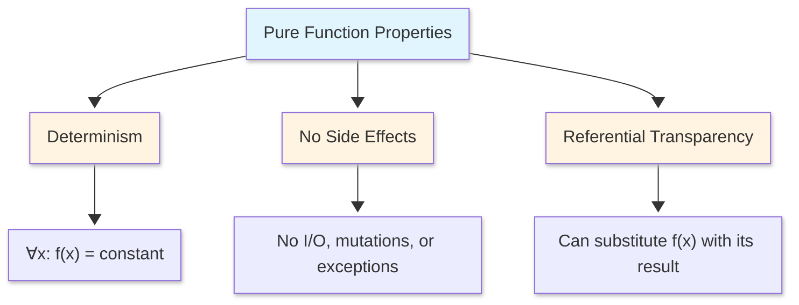
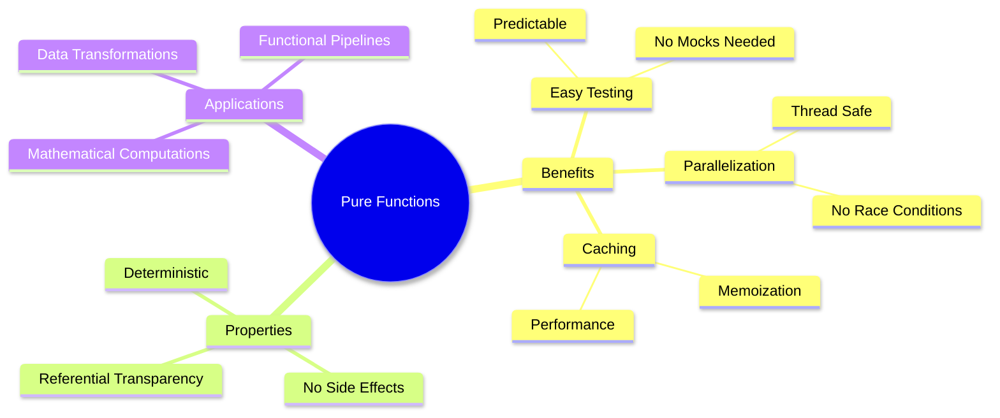

<style>
/* Styles for the two-column layout */
.image-text-container {
    display: flex; /* Enables flexbox */
    flex-wrap: wrap; /* Allows columns to stack on small screens */
    gap: 20px; /* Space between the image and text */
    align-items: center; /* Vertically centers content in columns */
    margin-bottom: 20px; /* Space below this section */
}

.image-column {
    flex: 1; /* Allows this column to grow */
    min-width: 250px; /* Minimum width for the image column before stacking */
    max-width: 40%; /* Maximum width for the image column to not take up too much space initially */
    box-sizing: border-box; /* Include padding/border in element's total width/height */
}

.text-column {
    flex: 2; /* Allows this column to grow more (e.g., twice as much as image-column) */
    min-width: 300px; /* Minimum width for the text column before stacking */
    box-sizing: border-box;
}

</style>

<div class="image-text-container">
    <div class="image-column">
        
    </div>
    <div class="text-column">
<p>Explore comprehensive Scala 2 functional programming fundamentals grounded in mathematical theory. This guide covers pure functions that ensure determinism and referential transparency, enabling equational reasoning and safe parallelization. Discover higher-order functions like map, filter, and fold that accept or return functions as first-class values. Master function composition techniques using compose and andThen operators to build complex pipelines. Learn currying—the mathematical transformation of multi-argument functions into sequences of single-argument functions. Understand immutability principles, side-effect elimination, and how these concepts form the backbone of scalable, testable Scala applications through category theory and lambda calculus foundations.</p>
    </div>
</div>

<!--more-->

------

* TOC
{:toc}
------

Functional Programming (FP) is a programming paradigm based on mathematical functions where computation is treated as the evaluation of mathematical functions avoiding changing state and mutable data. This guide explores five fundamental FP concepts in Scala 2 with their mathematical foundations.

Core Principles of Functional Programming

1. **Functions are first-class values**: Functions can be passed as arguments, returned from other functions, and assigned to variables
2. **Immutability**: Data structures don't change after creation
3. **No side effects**: Pure functions don't modify external state
4. **Referential Transparency**: Expressions can be replaced by their values without changing program behavior

## Pure Functions

### Mathematical Definition

A **pure function** is a mathematical function where:

$$f: A \rightarrow B$$

Such that:

1. **Determinism**: $\forall x \in A, f(x)$ always produces the same output $y \in B$
2. **No Side Effects**: $f$ doesn't modify any state outside its scope
3. **Referential Transparency**: For any program $p$, all occurrences of $f(x)$ can be replaced by its result without changing $p$'s meaning

### Formal Definition

**Referential Transparency (RT)**: An expression $e$ is referentially transparent if, for all programs $p$, all occurrences of $e$ in $p$ can be replaced by the result of evaluating $e$ without affecting the meaning of $p$.[^1]

**Purity**: A function $f$ is pure if the expression $f(x)$ is referentially transparent for all referentially transparent $x$.[^1]

### Mathematical Properties



### Substitution Model

Pure functions enable **equational reasoning** through the substitution model:

$$
\begin{align}
\text{Given: } & f(x) = x^2 \\
\text{Then: } & f(3) + f(3) \\
& = 9 + f(3) \quad \text{(substitute first)} \\
& = 9 + 9 \quad \text{(substitute second)} \\
& = 18
\end{align}
$$

for example,


```scala
// Pure Function - Always returns the same output for the same input
def square(x: Int): Int = x * x

// Test purity
val result1 = square(5)  // 25
val result2 = square(5)  // 25
// result1 == result2 always true
```


    defined function square
    result1: Int = 25
    result2: Int = 25


Mathematical proof:
    
    square(5) = 5 * 5 = 25

NOTE: Can always replace square(5) with 25

> Pure function using internal mutable state (hidden from outside).
{:.green}

### Pure Functions in Mathematics

| Mathematical Concept | Scala Example                      | Property           |
| -------------------- | ---------------------------------- | ------------------ |
| $f(x) = x + 1$       | `def inc(x: Int) = x + 1`          | Successor function |
| $f(x, y) = x + y$    | `def add(x: Int, y: Int) = x + y`  | Addition           |
| $f(x) = x^2$         | `def square(x: Int) = x * x`       | Quadratic          |
| $f(s) = \|s\|$       | `def length(s: String) = s.length` | String length      |
| $f(x) = e^x$         | `def exp(x: Double) = math.exp(x)` | Exponential        |

### Key Benefits of Pure Functions

1. **Testability**: Easy to test - same input always produces the same output
2. **Parallelisation**: Can safely run in parallel (no shared mutable state)
3. **Memoization**: Results can be cached
4. **Reasoning**: Enable algebraic reasoning and equational substitution
5. **Composition**: Can combine pure functions to create complex behaviour



---

## Higher-Order Functions

**Morphisms** are simply **arrows** or **mappings** between objects in a category. Think of them as generalized functions.
When we say "objects are types and morphisms are functions":

-   **Objects** = Types (`Int`, `String`, `List[A]`, etc.)
-   **Morphisms** = Functions between those types

```scala
def length: String => Int
```

This is a **morphism** from the object `String` to the object `Int`.

String ----length----> Int
(object)  (morphism)  (object)

A higher-order function like `map` is a morphism in a "higher" category:

```scala
def map[A, B](f: A => B): List[A] => List[B]
// or curried version
def map[A, B](f: A => B)(xs: List[A]): List[B]
```

Here:
- **Objects** are themselves function types: `(A => B)`, `(List[A] => List[B])`
- **Morphism** is `map`, which maps between these function objects
 
`(A => B) ----map----> (List[A] => List[B])`

### HOF Mathematical Definition


A **higher-order function (HOF)** is a function that:

1. Takes one or more functions as arguments, or
2. Returns a function as its result

$$
\text{HOF}: (A \rightarrow B) \rightarrow C \text{ or } A \rightarrow (B \rightarrow C)
$$

> In category theory, *HOFs are morphisms* in the category of functions where *objects are types and morphisms are functions*.[^4]

### Type Theory Foundation of HOF

In the simply typed lambda calculus, if $\tau_1, \tau_2, \tau_3$ are types:

$$
f: (\tau_1 \rightarrow \tau_2) \rightarrow \tau_3 \text{ is a HOF}
$$

This means $f$ accepts a function of type $\tau_1 \rightarrow \tau_2$ and produces a value of type $\tau_3$.

Examples

1. Map operation (Functor)
2. Filter operation
3. Fold operation:

#### Example 1: Map - The Functor HOF[^2]

**Map operation (Functor)**:

$$
\text{map}: (A \rightarrow B) \rightarrow [A] \rightarrow [B]
$$


>This reads as: "`map` takes a function from A to B, then takes a list of A's, and returns a list of B's".
{:.info-box}

The arrows represent **currying** - `map` doesn't take all arguments at once, but returns functions:
-   Takes `(A → B)` - a function from type A to type B
-   Returns a function that takes `[A]` - a list of A's
-   Which returns `[B]` - a list of B's

**Behaviour:**

$$
\text{map}\ f\ [x_1, x_2, ..., x_n] = [f(x_1), f(x_2), ..., f(x_n)]
$$
    
Apply function f to each element in the list.

The map applies a function to each element


```scala
def map[A, B](f: A => B)(xs: List[A]): List[B] = xs match {
  case Nil => Nil
  case head :: tail => f(head) :: map(f)(tail)
}
```

**Type Parameters:** `[A, B]` - generic types matching the math notation

**Curried Syntax:** Two parameter lists `(f: A => B)(xs: List[A])` implements the curried arrows:

-   First takes function `f: A => B` (matching `A → B`)
-   Then takes list `xs: List[A]` (matching `[A]`)
-   Returns `List[B]` (matching `[B]`)

The recursive case implements the mathematical definition:

-   `f(head)` - apply f to first element (like `f(x₁)`)
-   `map(f)(tail)` - recursively map over remaining elements (like `[f(x₂), ..., f(xₙ)]`)
-   `::` - cons operator joins them together

Example execution is
```scala
map(x => x * 2)(List(1, 2, 3))
```

Traces to:
```scala
f(1) :: map(f)(List(2, 3))
2 :: f(2) :: map(f)(List(3))
2 :: 4 :: f(3) :: map(f)(Nil)
2 :: 4 :: 6 :: Nil
List(2, 4, 6)
```

This matches the math: `map (*2) [1,2,3] = [2, 4, 6]` ✓


```scala
// Using map
val numbers = List(1, 2, 3)
val squared = map((x: Int) => x * 2)(numbers)
// Result: List(1, 4, 9, 16, 25)

// Mathematical property (Functor law):
// map(id) == id
// map(f ∘ g) == map(f) ∘ map(g)
```


    numbers: List[Int] = List(1, 2, 3)
    squared: List[Int] = List(2, 4, 6)


Scala standard library usage


```scala
val nums = List(1, 2, 3)

// map with named function
def double(x: Int): Int = x * 2
nums.map(double)  // List(2, 4, 6, 8, 10)
```


    nums: List[Int] = List(1, 2, 3)
    defined function double
    res14_2: List[Int] = List(2, 4, 6)


#### Example 2: Filter - Predicate-Based Selection[^2]

filter keeps elements satisfying a predicate

$$
\text{filter}: (A \rightarrow \text{Bool}) \rightarrow [A] \rightarrow [A]
$$
    
> This reads as: "`filter` takes a predicate function from A to Boolean, then takes a list of A's, and returns a list of A's"
{:.info-box}

Key difference from `map`: the input and output list types are **the same** (`[A] → [A]`) because we're selecting elements, not transforming them.

The currying structure:

-   Takes `(A → Bool)` - a predicate function that tests elements
-   Returns a function that takes `[A]` - a list of A's
-   Which returns `[A]` - a filtered list of A's

**Behaviour (List Comprehension)**:

This is **list comprehension** notation meaning: "build a list containing all elements `x` drawn from `xs` where the predicate `p(x)` is true"

$$
\text{filter}\ p\ xs = [x\ |\ x \leftarrow xs, p(x)]
$$
    


```scala
def filter[A](p: A => Boolean)(xs: List[A]): List[A] = xs match {
  case Nil => Nil
  case head :: tail => 
    if (p(head)) head :: filter(p)(tail)
    else filter(p)(tail)
}
```


    defined function filter


**Type Parameter:** `[A]` - single generic type (input and output are same type)

**Curried Syntax:** `(p: A => Boolean)(xs: List[A])` implements:

-   First takes predicate `p: A => Boolean` (matching `A → Bool`)
-   Then takes list `xs: List[A]` (matching `[A]`)
-   Returns `List[A]` (matching `[A]`)

**Pattern Matching Implementation:**

The recursive logic implements the list comprehension:

-   **Test:** `if (p(head))` - checks if predicate holds for current element
-   **Include:** `head :: filter(p)(tail)` - keep element and continue
-   **Exclude:** `filter(p)(tail)` - skip element and continue
-   Eventually builds a list of only elements where `p(x)` was true


```scala
// Using filter
val numbers = List(1, 2, 3, 4, 5, 6, 7, 8, 9, 10)

// Keep even numbers
val evens = filter((x: Int) => x % 2 == 0)(numbers)
// Result: List(2, 4, 6, 8, 10)

// Mathematical definition as list comprehension:
// filter p xs = [x | x ← xs, p x]
```


    numbers: List[Int] = List(1, 2, 3, 4, 5, 6, 7, 8, 9, 10)
    evens: List[Int] = List(2, 4, 6, 8, 10)


Example Execution
```scala
filter(x => x > 2)(List(1, 2, 3, 4))
```

Traces to:
```scala
p(1) = false → filter(p)(List(2, 3, 4))
p(2) = false → filter(p)(List(3, 4))
p(3) = true  → 3 :: filter(p)(List(4))
p(4) = true  → 3 :: 4 :: filter(p)(Nil)
3 :: 4 :: Nil
List(3, 4)
```

Scala Standard library usage:


```scala
// Practical examples
val numbers = List(-3, -2, -1, 0, 1, 2, 3, 4, 5)

// Filter positive numbers
numbers.filter(_ > 0)  // List(1, 2, 3)

// Filter even numbers
numbers.filter(x => x % 2 == 0)  // List(-2, 0, 2, 4)

// Chain filter operations
numbers
  .filter(_ > 0)        // List(1, 2, 3, 4, 5)
  .filter(_ % 2 == 0)   // List(2, 4)
```


    numbers: List[Int] = List(-3, -2, -1, 0, 1, 2, 3, 4, 5)
    res18_1: List[Int] = List(1, 2, 3, 4, 5)
    res18_2: List[Int] = List(-2, 0, 2, 4)
    res18_3: List[Int] = List(2, 4)


This matches the math: 
$$
\text{filter}\ (>2)\ [1,2,3,4] = [x\ |\ x \leftarrow [1,2,3,4], x > 2] = [3, 4]
$$ 

#### Example 3: Fold - Reduction Operations[^2]

##### foldr - right-associative fold

$$
\text{foldr}: (A \rightarrow B \rightarrow B) \rightarrow B \rightarrow [A] \rightarrow B
$$

> This reads as: "`foldr` takes a combining function, then an initial value, then a list, and returns a single accumulated value"
{:.info-box}


The currying structure (three levels):

-   Takes `(A → B → B)` - a **combining function** that takes an element of type A and an accumulator of type B, returning a new B
-   Then takes `B` - an **initial/accumulator value**
-   Then takes `[A]` - a list of A's
-   Returns `B` - a single folded result

**Behaviour (Right-Associative):**

$$
\text{foldr}\ (\oplus)\ a\ [x_1, x_2, ..., x_n] = x_1 \oplus (x_2 \oplus ... (x_n \oplus a))
$$

Works right-to-left, with parentheses showing association from the right. The rightmost element xₙ is combined with the initial value first, then that result is combined with xₙ₋₁, and so on.


```scala
def foldr[A, B](f: (A, B) => B)(z: B)(xs: List[A]): B = xs match {
  case Nil => z
  case head :: tail => f(head, foldr(f)(z)(tail))
}

// Mathematical notation:
// foldr (⊕) a [x₁, x₂, ..., xₙ] = x₁ ⊕ (x₂ ⊕ ... (xₙ ⊕ a))
```


    defined function foldr


**Type Parameters:** `[A, B]` - two types (list elements and accumulator can differ)

**Three Parameter Lists (Curried):**

-   `(f: (A, B) => B)` - combining function (matching `A → B → B`)
-   `(z: B)` - initial/"zero" value (matching the `B`)
-   `(xs: List[A])` - input list (matching `[A]`)
-   Returns `B` - folded result


The recursive case implements right-associativity:

-   `foldr(f)(z)(tail)` - **first** recursively fold the tail (processes right side)
-   `f(head, ...)` - **then** combine head with that result (processes left side)
-   This creates the structure: `head ⊕ (recursive_result)`

Example Execution


```scala
// Practical fold examples
val numbers = List(1, 2, 3, 4, 5)
// Product using foldRight
val product = numbers.foldRight(1)(_ * _)  // 120
// Evaluation: 1 * (2 * (3 * (4 * (5 * 1))))
```


    numbers: List[Int] = List(1, 2, 3, 4, 5)
    product: Int = 120


see the trace below for the following


```scala
foldr((x: Int, acc: Int) => x + acc)(0)(List(1, 2, 3))
```


    res34: Int = 6


Traces to:

```
f(1, foldr(f)(0)(List(2, 3)))
f(1, f(2, foldr(f)(0)(List(3))))
f(1, f(2, f(3, foldr(f)(0)(Nil))))
f(1, f(2, f(3, 0)))
f(1, f(2, 3))
f(1, 5)
6
```

This matches the math: 
$$\text{foldr}\ (+)\ 0\ [1,2,3] = 1 + (2 + (3 + 0)) = 1 + (2 + 3) = 1 + 5 = 6$$ ✓

Visualising Right Association

For `foldr (⊕) a [x₁, x₂, x₃]`:
```
    x₁ ⊕ (x₂ ⊕ (x₃ ⊕ a))
    │      │      │
    │      │      └─ combines first
    │      └──────── combines second  
    └─────────────── combines last
```

##### foldl - left-associative fold

$$
\text{foldl}: (B \rightarrow A \rightarrow B) \rightarrow B \rightarrow [A] \rightarrow B
$$

> This reads as: "`foldl` takes a combining function, then an initial value, then a list, and returns a single accumulated value"
{:.info-box}


The currying structure (three levels):
- Takes `(B → A → B)` - a **combining function** that takes an accumulator of type B and an element of type A, returning a new B
  - **Note:** Arguments are **reversed** compared to `foldr`!
- Then takes `B` - an **initial/accumulator value**
- Then takes `[A]` - a list of A's
- Returns `B` - a single folded result

**Behaviour (Left-Associative):**

$$
\text{foldl}\ (\oplus)\ a\ [x_1, x_2, ..., x_n] = ((...((a \oplus x_1) \oplus x_2) ...) \oplus x_n)
$$

Works **left-to-right**, with parentheses showing association from the left. The leftmost element `x₁` is combined with the initial value `a` first, then that result is combined with `x₂`, and so on.


```scala
// foldl - left-associative fold
def foldl[A, B](f: (B, A) => B)(z: B)(xs: List[A]): B = xs match {
  case Nil => z
  case head :: tail => foldl(f)(f(z, head))(tail)
}

// Mathematical notation:
// foldl (⊕) a [x₁, x₂, ..., xₙ] = (((a ⊕ x₁) ⊕ x₂) ... ⊕ xₙ)
```


    defined function foldl


**Type Parameters:** `[A, B]` - two types (list elements and accumulator can differ)

**Three Parameter Lists (Curried):**
- `(f: (B, A) => B)` - combining function with **accumulator first** (matching `B → A → B`)
- `(z: B)` - initial/"zero" value (matching the `B`)
- `(xs: List[A])` - input list (matching `[A]`)
- Returns `B` - folded result


Example Execution

The recursive case implements left-associativity:
- `f(z, head)` - **first** combine accumulator with head (processes left side)
- `foldl(f)(...)(tail)` - **then** recursively fold tail with new accumulator
- This creates the structure: `(previous_result) ⊕ head`


```scala
foldl((acc: Int, x: Int) => acc + x)(0)(List(1, 2, 3)) // traced
```


    res36: Int = 6


Traces to:

```
foldl(f)(f(0, 1))(List(2, 3))
foldl(f)(1)(List(2, 3))
foldl(f)(f(1, 2))(List(3))
foldl(f)(3)(List(3))
foldl(f)(f(3, 3))(Nil)
foldl(f)(6)(Nil)
6
```

This matches the math:
$$\text{foldl}\ (+)\ 0\ [1,2,3] = ((0 + 1) + 2) + 3 = (1 + 2) + 3 = 3 + 3 = 6$$ ✓

Visualising Left Association

For `foldl (⊕) a [x₁, x₂, x₃]`:

```
    ((a ⊕ x₁) ⊕ x₂) ⊕ x₃
     │         │       │
     │         │       └─ combines last
     │         └──────── combines second  
     └─────────────────── combines first
```

For example, Building a reversed list with foldLeft


```scala
val reversed = numbers.foldLeft(List.empty[Int])((acc, x) => x :: acc)
// Result: List(5, 4, 3, 2, 1)
```


    reversed: List[Int] = List(5, 4, 3, 2, 1)


Scala Standard library usage:


```scala
// Practical fold examples
val numbers = List(1, 2, 3, 4, 5)

// Sum using foldLeft
val sum = numbers.foldLeft(0)(_ + _)  // 15
// Evaluation: ((((0 + 1) + 2) + 3) + 4) + 5

// Product using foldRight
val product = numbers.foldRight(1)(_ * _)  // 120
// Evaluation: 1 * (2 * (3 * (4 * (5 * 1))))

// Building a reversed list with foldLeft
val reversed = numbers.foldLeft(List.empty[Int])((acc, x) => x :: acc)
// Result: List(5, 4, 3, 2, 1)
```


    numbers: List[Int] = List(1, 2, 3, 4, 5)
    sum: Int = 15
    product: Int = 120
    reversed: List[Int] = List(5, 4, 3, 2, 1)


Defining common operations with fold


```scala
def sum(xs: List[Int]): Int = xs.foldRight(0)(_ + _)

def product(xs: List[Int]): Int = xs.foldRight(1)(_ * _)

def length[A](xs: List[A]): Int = xs.foldRight(0)((_, acc) => acc + 1)

def concatenate[A](xss: List[List[A]]): List[A] = xss.foldRight(List.empty[A])(_ ++ _)

// Example usage
sum(List(1, 2, 3, 4, 5))           // 15
product(List(1, 2, 3, 4, 5))       // 120
length(List('a', 'b', 'c'))        // 3
concatenate(List(List(1,2), List(3,4)))  // List(1, 2, 3, 4)
```


    defined function sum
    defined function product
    defined function length
    defined function concatenate
    res37_4: Int = 15
    res37_5: Int = 120
    res37_6: Int = 3
    res37_7: List[Int] = List(1, 2, 3, 4)


##### Comparing foldr vs foldl

**foldr:** `x₁ ⊕ (x₂ ⊕ (x₃ ⊕ a))`  
- Right-associative
- Processes right side first (via recursion)
- Function signature: `(A, B) => B`

**foldl:** `((a ⊕ x₁) ⊕ x₂) ⊕ x₃`  
- Left-associative  
- Processes left side first (via accumulator)
- Function signature: `(B, A) => B`

Example Where Order Matters


```scala
// Division is NOT associative
foldr((x: Int, acc: Int) => x / acc)(1)(List(8, 4, 2))
// 8 / (4 / (2 / 1)) = 8 / (4 / 2) = 8 / 2 = 4

foldl((acc: Int, x: Int) => acc / x)(64)(List(4, 2, 2))
// ((64 / 4) / 2) / 2 = (16 / 2) / 2 = 8 / 2 = 4
```


    res28_0: Int = 4
    res28_1: Int = 4


> Different structure, potentially different results!

Example: Building a Reversed List


```scala
foldl((acc: List[Int], x: Int) => x :: acc)(Nil)(List(1, 2, 3))
```


    res29: List[Int] = List(3, 2, 1)


```
((Nil :: 1) :: 2) :: 3
(List(1) :: 2) :: 3
List(2, 1) :: 3
List(3, 2, 1)
```

This **reverses** the list! In fact, `foldl (flip (::)) Nil xs = reverse xs`

##### Insights:

- **`foldl` is tail-recursive** in this implementation - the recursive call is the last operation, making it more memory efficient
- **Left-associative:** processes list from left to right via accumulator
- **Accumulator-first:** the function takes `(B, A)` not `(A, B)` - accumulator is first argument
- **For associative operations** (like `+`, `*`), `foldr` and `foldl` produce the same result
- **For non-associative operations** (like `-`, `/`, `::`) they produce different results
- **In practice:** `foldl` is often preferred for efficiency (tail-recursive), but `foldr` works on infinite lists

#### Example 4: Custom HOFs
A HOF that applies a function n times.

The `applyNTimes` function implements **repeated function composition** or **function exponentiation**:

$$f^n(x) = \underbrace{f \circ f \circ \cdots \circ f}_{n \text{ times}}(x)$$

More explicitly:
- $f^0(x) = x$ (identity - apply 0 times)
- $f^1(x) = f(x)$ (apply once)
- $f^2(x) = f(f(x))$ (apply twice)
- $f^3(x) = f(f(f(x)))$ (apply three times)
- $f^n(x) = f(f^{n-1}(x))$ (recursive definition)

in Mathematics

$$\text{applyNTimes}: (A \rightarrow A) \rightarrow \mathbb{N} \rightarrow (A \rightarrow A)$$

> Reads as: "Takes an endomorphism (function from A to itself) and a natural number, returns another endomorphism"
{:.info-box}

Type Analysis

- **Input 1:** `f: A => A` - an *endomorphism* (function that maps type A to itself)
- **Input 2:** `n: Int` - number of times to compose f
- **Output:** `A => A` - a new function that applies f exactly n times

The `loop` helper function:

$$\text{loop}(x, k) = \begin{cases} 
x & \text{if } k \leq 0 \\
\text{loop}(f(x), k-1) & \text{if } k > 0
\end{cases}$$

This implements: $\text{loop}(x, n) = f^n(x)$


```scala
def applyNTimes[A](f: A => A, n: Int): A => A = {
  def loop(x: A, remaining: Int): A = {
    if (remaining <= 0) x
    else loop(f(x), remaining - 1)
  }
  (x: A) => loop(x, n)
}
```


    defined function applyNTimes


**Execution trace for `loop(x, 3)`:**

```
loop(x, 3)
→ loop(f(x), 2)
→ loop(f(f(x)), 1)
→ loop(f(f(f(x))), 0)
→ f(f(f(x)))
```


```scala
val increment: Int => Int = x => x + 1

val addFive = applyNTimes(increment, 5)
// addFive is equivalent to: x => x + 1 + 1 + 1 + 1 + 1

addFive(10)  // Output: 15
```


    increment: Int => Int = ammonite.$sess.cmd40$Helper$$Lambda$2754/0x000000012c898bc8@7d57e5ae
    addFive: Int => Int = ammonite.$sess.cmd38$Helper$$Lambda$2750/0x000000012c897908@612c3a59
    res40_2: Int = 15


$$\begin{aligned}
\text{addFive}(10) &= \text{increment}^5(10) \\
&=\text{increment}(\text{increment}(\text{increment}(\text{increment}(\text{increment}(10))))) \\
&=\text{increment}(\text{increment}(\text{increment}(\text{increment}(11)))) \\
&=\text{increment}(\text{increment}(\text{increment}(12))) \\
&=\text{increment}(\text{increment}(13)) \\
&=\text{increment}(14) \\
&= 15
\end{aligned}$$

Function design properties:

1: Identity Law

$$\text{applyNTimes}(f, 0) = \text{id}$$ 
Where $\text{id}(x) = x$ for all $x$


```scala
val identityFunc = applyNTimes(increment, 0)
identityFunc(10)
```


    identityFunc: Int => Int = ammonite.$sess.cmd38$Helper$$Lambda$2750/0x000000012c897908@6a7a462
    res43_1: Int = 10


2: Composition Law
   
$$\text{applyNTimes}(f, m + n) = \text{applyNTimes}(f, m) \circ \text{applyNTimes}(f, n)$$


```scala
val add3 = applyNTimes(increment, 3)
val add5 = applyNTimes(increment, 5)
val add8 = applyNTimes(increment, 8)

// These are equivalent:
add8(10)           // 18
add5(add3(10))     // 18
```


    add3: Int => Int = ammonite.$sess.cmd38$Helper$$Lambda$2750/0x000000012c897908@447f7c8f
    add5: Int => Int = ammonite.$sess.cmd38$Helper$$Lambda$2750/0x000000012c897908@150f8d6c
    add8: Int => Int = ammonite.$sess.cmd38$Helper$$Lambda$2750/0x000000012c897908@7ddc39a
    res44_3: Int = 18
    res44_4: Int = 18


3: Recursive Structure
$$f^n = f \circ f^{n-1}$$

This is exactly what the `loop` function implements through tail recursion.

In category theory, `applyNTimes` works with **endomorphisms** in a category:
- **Objects:** Types (like `Int`, `String`, etc.)
- **Morphisms:** Functions between types
- **Endomorphism:** A morphism from an object to itself (`A => A`)

The function creates a **monoid** structure:
- **Binary operation:** Function composition $\circ$
- **Identity element:** $f^0 = \text{id}$
- **Closure:** $f^m \circ f^n = f^{m+n}$

**Tail Recursion** Optimisation

The `loop` function is **tail-recursive** because:
- The recursive call is the **last operation**
- No additional computation after the recursive call returns
- Scala compiler can optimise it to a loop (with `@tailrec` annotation)


```scala
import scala.annotation.tailrec

def applyNTimes[A](f: A => A, n: Int): A => A = {
  @tailrec
  def loop(x: A, remaining: Int): A = {
    if (remaining <= 0) x
    else loop(f(x), remaining - 1)
  }
  (x: A) => loop(x, n)
}
```


    import scala.annotation.tailrec
    
    
    defined function applyNTimes


#### Composition in Scala
Understanding Function Composition in Scala

Function composition forms a **category**:

**Category of Types and Functions:**
- **Objects:** Types (`Int`, `String`, `Boolean`, etc.)
- **Morphisms:** Functions between types
- **Composition:** Function composition operator
- **Identity:** Identity function for each type

**Category Laws:**
1. **Associativity:** $(f \circ g) \circ h = f \circ (g \circ h)$
2. **Identity:** $f \circ \text{id}_A = f = \text{id}_B \circ f$ for $f: A \to B$

This makes function composition a **fundamental operation** in functional programming.

In mathematics, function composition is denoted by the symbol $\circ$ (circle):

$$(f \circ g)(x) = f(g(x))$$

**Read as:** "f composed with g, applied to x, equals f of g of x"

**Key points:**
- Apply $g$ **first** to $x$
- Then apply $f$ to the result
- The right function ($g$) is applied first
- Composition flows **right-to-left**

```
x  →  [g]  →  g(x)  →  [f]  →  f(g(x))
      apply g first    then apply f
```

For composition $f \circ g$ to be valid:
$$f: B \rightarrow C$$
$$g: A \rightarrow B$$
$$f \circ g: A \rightarrow C$$

The **output type of $g$ must match the input type of $f$**.


```scala
def compose[A, B, C](f: B => C, g: A => B): A => C = {
  (x: A) => f(g(x))
}

```


    defined function compose


Type Analysis

**Type signature:**
$$\text{compose}: (B \rightarrow C) \rightarrow (A \rightarrow B) \rightarrow (A \rightarrow C)$$

- **Parameter 1:** `f: B => C` - function that transforms B to C
- **Parameter 2:** `g: A => B` - function that transforms A to B
- **Returns:** `A => C` - a new function that transforms A to C

How It Works

The function returns a **closure** (lambda):

```scala
(x: A) => f(g(x))
```

This lambda:
1. Takes an argument `x` of type `A`
2. Applies `g` to get a value of type `B`
3. Applies `f` to get a final value of type `C`

Examples:


```scala
val addOne = (x: Int) => x + 1
val double = (x: Int) => x * 2
val addOneThenDouble = compose(double, addOne)
addOneThenDouble(5)
```


    addOne: Int => Int = ammonite.$sess.cmd49$Helper$$Lambda$2790/0x000000012c8a4000@54d5fa77
    double: Int => Int = ammonite.$sess.cmd49$Helper$$Lambda$2791/0x000000012c8a43e8@27a2a472
    addOneThenDouble: Int => Int = ammonite.$sess.cmd47$Helper$$Lambda$2786/0x000000012c89ed08@7da32905
    res49_3: Int = 12


**Type flow:**
- `addOne: Int => Int` (matches `A => B` where A=Int, B=Int)
- `double: Int => Int` (matches `B => C` where B=Int, C=Int)
- `addOneThenDouble: Int => Int` (resulting `A => C`)

**Execution trace:**

$$\begin{flalign*}
\text{addOneThenDouble}(5) 
&= \text{double}(\text{addOne}(5)) \\
&= \text{double}(5 + 1) \\
&= \text{double}(6) \\
&= 6 \times 2 \\
&= 12
\end{flalign*}$$

Scala provides two composition methods in the standard library:

| Concept | Mathematical | Scala `compose` | Scala `andThen` |
|---------|-------------|-----------------|-----------------|
| **Notation** | $f \circ g$ | `f compose g` | `g andThen f` |
| **Meaning** | $f(g(x))$ | `f(g(x))` | `f(x) then g` |
| **Flow** | Right-to-left | Right-to-left | Left-to-right |
| **Natural?** | Math traditional | Math traditional | More intuitive |


1: `compose` - Right-to-Left (Mathematical Order)


```scala
val f = addOne compose double
// Equivalent to: (x: Int) => addOne(double(x))
```


    f: Int => Int = scala.Function1$$Lambda$2796/0x000000012c8a1118@28b3e02d


mathamatically

$$f = \text{addOne} \circ \text{double}$$
$$f(x) = \text{addOne}(\text{double}(x))$$

**Execution:**

```scala
f(5)  // addOne(double(5))
      // = addOne(5 * 2)
      // = addOne(10)
      // = 10 + 1
      // = 11
```

**Flow diagram:**

```
5  →  [double]  →  10  →  [addOne]  →  11
      apply first       apply second
```

2: `andThen` - Left-to-Right (Pipeline Order)
   


```scala
val g = addOne andThen double
// Equivalent to: (x: Int) => double(addOne(x))
```


    g: Int => Int = scala.Function1$$Lambda$766/0x000000012c5360b0@7d14a8aa


mathamatically

$$g = \text{double} \circ \text{addOne}$$
$$g(x) = \text{double}(\text{addOne}(x))$$

**Execution:**

```scala
g(5)  // double(addOne(5))
      // = double(5 + 1)
      // = double(6)
      // = 6 * 2
      // = 12
```

**Flow diagram:**

```
5  →  [addOne]  →  6  →  [double]  →  12
      apply first      apply second
```

### HOF Mathematical Properties

| Property | Mathematical Form | Code Example |
|----------|------------------|--------------|
| Map Composition | $\text{map}(f \circ g) = \text{map}(f) \circ \text{map}(g)$ | `xs.map(g).map(f) == xs.map(f compose g)` |
| Map Identity | $\text{map}(\text{id}) = \text{id}$ | `xs.map(x => x) == xs` |
| Filter Composition | $\text{filter}(p) \circ \text{filter}(q) = \text{filter}(q) \circ \text{filter}(p)$ | `xs.filter(p).filter(q) == xs.filter(q).filter(p)` |
| Fold Fusion | $\text{map}(f) \circ \text{fold}(g)(z) = \text{fold}(g \circ f)(z)$ | Optimization technique |

### For-Comprehensions and HOFs[^3]
The *for* comprehension is syntactic sugar for HOF chains


```scala
for {
    x <- List(1,2,3)
    y <- List(10, 20)
    if x * y > 10 // Guard
} yield x * y
```


    res53: List[Int] = List(20, 20, 40, 30, 60)


Desugars to:


```scala
List(1,2,3).flatMap(x => List(10,20).filter( y => x * y > 10).map( y => x * y))
```


    res60: List[Int] = List(20, 20, 40, 30, 60)


### Type Signatures of Common HOFs

| Function | Type Signature | Description |
|----------|---------------|-------------|
| `map` | `[A, B](f: A => B): List[A] => List[B]` | Apply function to each element |
| `filter` | `[A](p: A => Boolean): List[A] => List[A]` | Keep elements satisfying predicate |
| `foldLeft` | `[A, B](z: B)(f: (B, A) => B): List[A] => B` | Left-associative reduction |
| `foldRight` | `[A, B](z: B)(f: (A, B) => B): List[A] => B` | Right-associative reduction |
| `flatMap` | `[A, B](f: A => List[B]): List[A] => List[B]` | Map then flatten |
| `find` | `[A](p: A => Boolean): List[A] => Option[A]` | Find first matching element |
| `exists` | `[A](p: A => Boolean): List[A] => Boolean` | Check if any element matches |
| `forall` | `[A](p: A => Boolean): List[A] => Boolean` | Check if all elements match |


## Currying

Mathematically:

> **Currying** is the transformation of a function with multiple arguments into a sequence of functions, each taking a single argument.[^5]
{:.info-box}

Named after mathematician Haskell Curry, currying transforms:

$$f: A \times B \times C \rightarrow D$$

Into:

$$\text{curry}(f): A \rightarrow (B \rightarrow (C \rightarrow D))$$

This isomorphism is expressed as:

$$\text{Hom}(A \times B, C) \cong \text{Hom}(A, C^B)$$

Where $C^B$ denotes the exponential object (function type $B \rightarrow C$).

### Lambda Calculus Foundation

In lambda calculus, currying is a natural consequence of functions only taking one argument:

$$
\begin{align}
\lambda xy.\ x + y &\equiv \lambda x.(\lambda y.\ x + y) \\
\text{apply to 3: } &(\lambda x.(\lambda y.\ x + y))\ 3 \\
&= \lambda y.\ 3 + y
\end{align}
$$

### Uncurrying

The inverse transformation:

$$\text{uncurry}: (A \rightarrow (B \rightarrow C)) \rightarrow ((A \times B) \rightarrow C)$$

### Code Examples

#### Example 1: Manual Currying[^5]


```scala
// Regular multi-parameter function
def add(x: Int, y: Int, z: Int): Int = x + y + z

// Manually curried version
def addCurried(x: Int): Int => Int => Int = {
  (y: Int) => {
    (z: Int) => {
      x + y + z
    }
  }
}

// Using the curried version
val addFive = addCurried(5)        // Returns function: Int => Int => Int
val addFiveSeven = addFive(7)      // Returns function: Int => Int
val result = addFiveSeven(3)       // Returns: 15

// Or in one line:
addCurried(5)(7)(3)  // 15

// Mathematical evaluation:
// addCurried(5)(7)(3)
// = ((x => y => z => x+y+z)(5))(7)(3)
// = (y => z => 5+y+z)(7)(3)
// = (z => 5+7+z)(3)
// = 5+7+3 = 15
```


    defined function add
    defined function addCurried
    addFive: Int => Int => Int = ammonite.$sess.cmd62$Helper$$Lambda$3713/0x000000012cb02650@6f83cc5f
    addFiveSeven: Int => Int = ammonite.$sess.cmd62$Helper$$Lambda$3714/0x000000012cb02a18@21cb32c7
    result: Int = 15
    res62_5: Int = 15


#### Example 2: Scala's Built-in Currying[^5]


```scala
// Scala syntax for curried functions (multiple parameter lists)
def multiply(x: Int)(y: Int)(z: Int): Int = x * y * z

// Partial application at each level
val timesTen = multiply(10) _      // Int => Int => Int
val timesTenFive = timesTen(5)     // Int => Int
val result = timesTenFive(2)       // 100

// Can also apply all at once
multiply(10)(5)(2)  // 100

// Type signatures:
// multiply: (x: Int)(y: Int)(z: Int): Int
// multiply(10): Int => Int => Int
// multiply(10)(5): Int => Int
// multiply(10)(5)(2): Int
```


    defined function multiply
    timesTen: Int => Int => Int = ammonite.$sess.cmd63$Helper$$Lambda$3719/0x000000012cb03f68@48891e11
    timesTenFive: Int => Int = ammonite.$sess.cmd63$Helper$$Lambda$3720/0x000000012cb04338@23033b53
    result: Int = 100
    res63_4: Int = 100


#### Example 3: Converting Between Curried and Uncurried[^1]


```scala
// Generic curry and uncurry functions

// Curry: Convert (A, B) => C to A => B => C
def curry[A, B, C](f: (A, B) => C): A => B => C = {
  (a: A) => (b: B) => f(a, b)
}

// Uncurry: Convert A => B => C to (A, B) => C
def uncurry[A, B, C](f: A => B => C): (A, B) => C = {
  (a: A, b: B) => f(a)(b)
}

// Example usage
val add: (Int, Int) => Int = (x, y) => x + y
val addCurried: Int => Int => Int = curry(add)
val addUncurried: (Int, Int) => Int = uncurry(addCurried)

// Test
add(3, 4)              // 7
addCurried(3)(4)       // 7
addUncurried(3, 4)     // 7

// Function1 has built-in curried method
val multiply = (x: Int, y: Int, z: Int) => x * y * z
val multiplyCurried = multiply.curried
// Type: Int => Int => Int => Int÷
```

## Scala Type Classes

Type classes in Scala are a powerful design pattern that allows you to add new functionality to existing types without modifying their source code. They enable **ad-hoc polymorphism** - the ability to define behaviour for types after they've been created.

Let's use a classic example: creating a "printable" or `Show` behaviour. We want to be able to call `.show()` on any type (`Int`, `String`, our own `User` class) to get a nice, formatted string representation.

1. The Type Class Trait

This is the "contract." It's a generic trait that defines the behaviour you want to add. It takes a type parameter `[A]` representing the type we're adding functionality to.


```scala
trait Show[A] {
  def show(value: A): String
}
```


    defined trait Show


2. Type Class Instances
These are the concrete implementations of the trait for specific types. We mark them as `implicit` so the compiler can find them automatically.
These instances are often placed in the **companion object** of the type class trait. This makes them easy for the compiler to find (this is a common part of *implicit resolution*).


```scala
// Put instances in the companion object
object Show {
  // Instance for Int
  implicit val intShow: Show[Int] = new Show[Int] {
    def show(value: Int): String = s"Int is: $value"
  }

  // Instance for String
  implicit val stringShow: Show[String] = new Show[String] {
    def show(value: String): String = s"String is: $value"
  }

  // Instance for a custom class we don't want to modify
  case class Person(name: String, age: Int)

  implicit val personShow: Show[Person] = new Show[Person] {
    def show(p: Person): String = s"${p.name} is ${p.age} years old."
  }
}
```


    defined object Show


Above are known as implicit values.

Type classes in Scala are implemented using implicit values and parameters, and, optionally, implicit classes. Scala language constructs correspond to the components of type classes as follows:

- traits: type classes;
- implicit values: type class instances;
- implicit parameters: type class use; and
- implicit classes: optional utilities that make type classes easier to use.

In the cats:
- interface objects
- interface syntax

3. The Interface (Using the Type Class)

This is how you *use* the type class. There are two main ways:

<u>Method 1</u>: The "Interface" Function (Implicit Parameter)

This is a function that *requires* a type class instance, specified via an implicit parameter list.


```scala
// This function "asks" for an implicit Show[A] to be available
def printThing[A](value: A)(implicit shower: Show[A]): Unit = {
  println(shower.show(value))
}
```


    defined function printThing


When you call `printThing(123)`, the compiler sees it needs a `Show[Int]`. It looks in the implicit scope, finds `Show.intShow`, and "injects" it as the `shower` parameter.

<u>Method 2</u>: Extension Methods (The "Pretty" Way)

This is the most common and ergonomic way. We use an `implicit class` (part of the "pimp my library" pattern) to make it look like the method is *on* the original type (e.g., `123.show()`).


```scala
object ShowSyntax {
  implicit class ShowOps[A](value: A) {
    // This method requires an implicit Show[A] to be in scope
    def show(implicit s: Show[A]): String = {
      s.show(value) // delegates to the instance
    }
  }
}
```


    defined object ShowSyntax


This `implicit class` wraps *any* type `A` and gives it a `.show` method. That method will only compile if the compiler can find an `implicit` instance of `Show[A]` to pass to it.


```scala
// --- How to use it ---

// Import the instances and the syntax to bring them into scope
import Show._
import ShowSyntax._

val john = Person("John", 30)

// The compiler finds the correct implicit instance for each type!
println(123.show)       // Uses intShow
println("Hello".show)   // Uses stringShow
println(john.show)      // Uses personShowA
```

    Int is: 123
    String is: Hello
    John is 30 years old.


    import Show._
    import ShowSyntax._
    john: Person = Person(name = "John", age = 30)


### Implicit Resolution

When you write `123.show`:

1.  `123` (an `Int`) doesn't have a `.show` method.
2.  The compiler looks for an `implicit` conversion that *does* have a `.show` method.
3.  It finds `ShowSyntax.ShowOps[A]` (which we imported). It wraps `123` to become `ShowOps[Int](123)`.
4.  Now it can call `ShowOps[Int](123).show`.
5.  This `show` method itself has an `(implicit s: Show[Int])` parameter.
6.  The compiler searches for an `implicit` value of type `Show[Int]`.
7.  It finds `Show.intShow` (which we also imported) and secretly passes it to the method.
8.  The final call is effectively `intShow.show(123)`.

If you tried to call `.show` on a type with no instance (e.g., `List(1,2).show`), you would get a **compile-time error**, which is the power of the type class pattern.

### Example from the Cats book:

The `JsonWriter` is the type class for serialising to JSON (explained in the Cats[^17]):


```scala
object JsonModel {
  sealed trait MyJson
  final case class JsObject(get: Map[String, MyJson]) extends MyJson
  final case class JsString(get: String) extends MyJson
  final case class JsNumber(get: Double) extends MyJson
  final case object JsNull extends MyJson

  // Example model to demonstrate
  final case class Employee(name: String, email: String)
    
  //  type class
  trait JsonWriter[A] {
    def write(value: A): MyJson
  }
}


import JsonModel._


// implicit values: type class instances
object JsonWriterInstances {
    implicit val stringWriter: JsonWriter[String] = new JsonWriter[String] {
        def write(value: String): MyJson = JsString(value)
    }

    implicit val employeeWriter: JsonWriter[Employee] = new JsonWriter[Employee] {
        def write(value: Employee): MyJson = JsObject(
            Map("name" -> JsString(value.name)
                ,"email" -> JsString(value.email)))
    }


    // ... implement others to return such as JsNumber 
}

// companion object
object MyJson {
    // interface object
    def toJson[A](value: A)(implicit w: JsonWriter[A]): MyJson = w.write(value) 
}

import JsonWriterInstances._

MyJson.toJson(Employee("Ojitha", "ojitha@test.com")) //implicit scope applied
```


    defined object JsonModel
    import JsonModel._
    defined object JsonWriterInstances
    defined object MyJson
    import JsonWriterInstances._
    res1_5: MyJson = JsObject(
      get = Map(
        "name" -> JsString(get = "Ojitha"),
        "email" -> JsString(get = "ojitha@test.com")
      )
    )


```scala
// interface syntax
object JsonSyntax {
    implicit class JsonWriterOps[A](value: A) {
        def convert2Json(implicit w: JsonWriter[A]): MyJson = w.write(value)
    }
}
import JsonWriterInstances._
import JsonSyntax._

Employee("Ojitha", "ojitha@test.com").convert2Json 
```


    defined object JsonSyntax
    import JsonWriterInstances._
    import JsonSyntax._
    res3_3: MyJson = JsObject(
      get = Map(
        "name" -> JsString(get = "Ojitha"),
        "email" -> JsString(get = "ojitha@test.com")
      )
    )


> Working with type classes in Scala means working with implicit values and implicit parameters. Placing instances in a companion object to the type class has special significance in Scala because it plays into something called **implicit scope**.

### Implicit Scope
The implicit scope which roughly consists of:

- local or inherited definitions
- imported definitions
- definitions in the companion object of the type class or the parameter type (in this case `JsonWriter` or `String`).

Definitions are only included in implicit scope if they are tagged with the `implicit` keyword.

Type class instances can be placed roughly in four ways:

1. In an object (eg:`JasonWriterInstances`): need to import
2. In a trait: using inheritance
3. In the companion object of the Type Class
4. In the companion object of the parameter type

Type class instances can be defined in two ways:
1. concrete instances as `implicit val`
2. by defining `implicit` methods to construct instances from other type class instances


```scala
implicit def optionWriter[A](implicit writer: JsonWriter[A]): JsonWriter[Option[A]] =
    new JsonWriter[Option[A]] {
        def write(option: Option[A]): MyJson = option match {
            case Some(value) => writer.write(value)
            case None => JsNull
        }
    }
```


    defined function optionWriter


```scala
MyJson.toJson(Option("A string"))
```


    res5: MyJson = JsString(get = "A string")


```scala
MyJson.toJson(Option("A string"))(optonWriter[String]) // apply first
                                         ⬇️
MyJson.toJson(Option("A string"))(optonWriter(stringWriter)) // apply then
```

> `implicit` methods with non‐implicit parameters form a different Scala pattern called an **implicit conversion**, which is an old programming concept.

### Key Benefits

  * **Decoupling:** Your data definitions (like `case class Person`) are separate from their behaviors (like `Show`).
  * **Extensibility:** You can add `Show` support for `java.util.Date` or any other library class *without* changing its code.
  * **No Inheritance Tax:** You don't need to make all your classes extend a common `Showable` trait, which avoids brittle inheritance hierarchies.
  * **Type-Safe:** The compiler guarantees at compile time that the behavior exists for the type you're using.

(Note: Scala 3 heavily refines this pattern, making it a first-class language feature with `given` and `using` clauses, which replace `implicits`.)

[^1]: Functional Programming in Scala, Ch. 1: "What is functional programming?" → "The benefits of FP: a simple example", p. 3-12

[^2]: Bird & Wadler: Introduction to Functional Programming, Ch. 3: "Lists" → "Map and filter", p. 61-65

[^3]: Programming in Scala Fourth Edition, Ch. 23: "For Expressions Revisited" → p. 528-545

[^4]: Category Theory, Ch. 9: "Functors and Natural Transformations" → p. 156-161

[^5]: Scala in Depth, Ch. 11: "Patterns in functional programming" → "Currying and applicative style", p. 266-268

[^6]: Programming in Scala Fourth Edition, Ch. 8: "Functions and Closures" → "Closures", p. 176-179

[^17]: Scala with Cats, Ch. 1: "Introduction", p. 10 -11

{:gtxt: .message color="green"}
{:ytxt: .message color="yellow"}
{:rtxt: .message color="red"}
