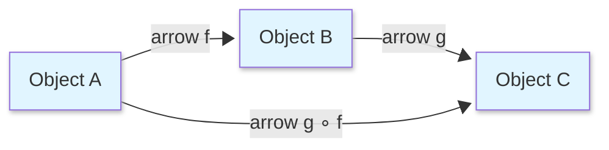
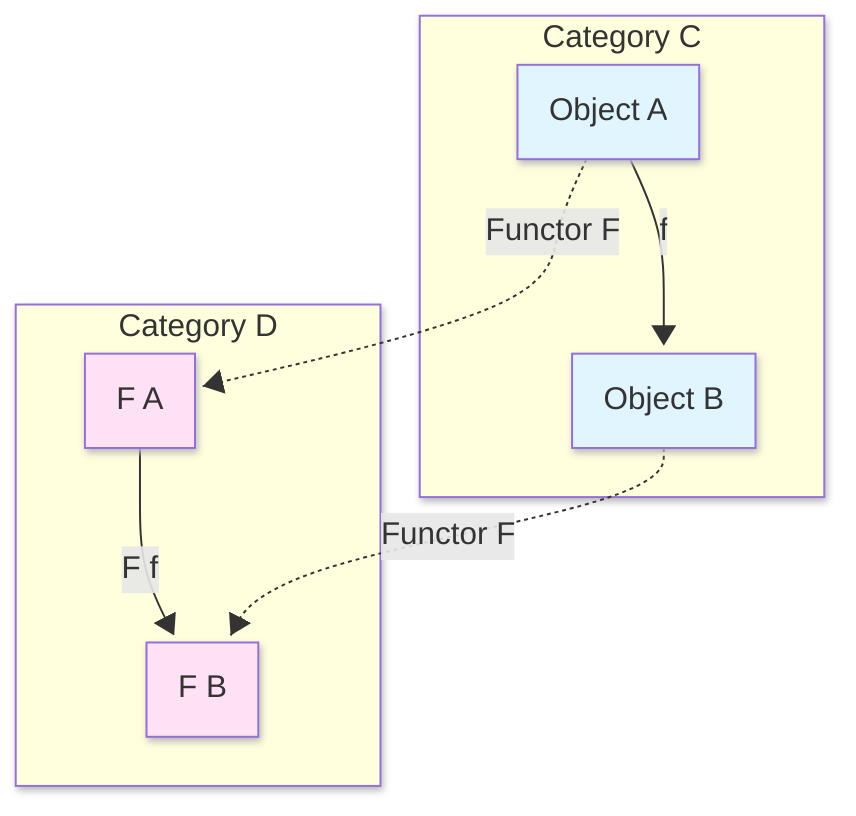
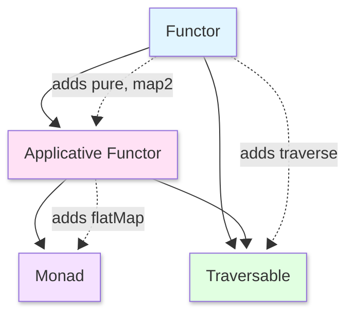

<style>
/* Styles for the two-column layout */
.image-text-container {
    display: flex; /* Enables flexbox */
    flex-wrap: wrap; /* Allows columns to stack on small screens */
    gap: 20px; /* Space between the image and text */
    align-items: center; /* Vertically centers content in columns */
    margin-bottom: 20px; /* Space below this section */
}

.image-column {
    flex: 1; /* Allows this column to grow */
    min-width: 250px; /* Minimum width for the image column before stacking */
    max-width: 40%; /* Maximum width for the image column to not take up too much space initially */
    box-sizing: border-box; /* Include padding/border in element's total width/height */
}

.text-column {
    flex: 2; /* Allows this column to grow more (e.g., twice as much as image-column) */
    min-width: 300px; /* Minimum width for the text column before stacking */
    box-sizing: border-box;
}

</style>

<div class="image-text-container">
    <div class="image-column">
        
    </div>
    <div class="text-column">
<p>This comprehensive guide explores Scala 2 Functors, one of functional programming's fundamental abstractions rooted in category theory. Learn how Functors enable transforming values within computational contexts like List, Option, Either, and Future without leaving that context. The article covers mathematical foundations, including categories, objects, and morphisms, then demonstrates practical Scala implementations with concrete examples. Discover the Functor trait's map operation, understand identity and composition laws, and explore advanced concepts like contravariant functors and functor composition. Perfect for Scala developers seeking to master functional programming patterns, this guide bridges theoretical category theory with real-world Scala code examples and best practices.</p>
    </div>
</div>

<!--more-->

------

* TOC
{:toc}
------

## Introduction

A **Functor** is one of the most fundamental abstractions in functional programming. Before diving into Scala code, let's understand the concept intuitively:

> **Intuitive Definition**: A Functor is a computational context (like `List`, `Option`, `Future`) that allows you to apply a function to values inside that context **without leaving the context**.

Think of it like this: If you have a gift box (context) with a toy inside, a Functor lets you replace that toy with a different one **without opening the box**. You just describe the transformation, and the Functor handles applying it within the box.

---

## Mathematical Foundations

### Category Theory Basics

Before understanding Functors, we need to understand **categories**. Don't worry—I'll explain all the mathematical notation!

#### What is a Category?



**Mathematical Definition**: A category $\mathcal{C}$ consists of:[^1]

- **Objects**: $A, B, C, \ldots$ (think of these as types)
- **Arrows** (morphisms): $f : A \to B$ (think of these as functions)
- **Identity arrows**: For every object $A$, there exists $1_A : A \to A$
- **Composition**: For arrows $f : A \to B$ and $g : B \to C$, there exists $g \circ f : A \to C$

**Laws**:
1. **Associativity**: $h \circ (g \circ f) = (h \circ g) \circ f$
2. **Identity**: $f \circ 1_A = f$ and $1_B \circ f = f$

**Notation Guide**:
- $\circ$ means "composed with" (like the dot in math)
- $A \to B$ means "an arrow from A to B"
- $1_A$ means "identity arrow for object A"

#### Examples of Categories

1. **Set** (Category of Sets):
   - Objects: All sets
   - Arrows: Functions between sets
   
2. **Scala** (Category of Scala Types):
   - Objects: Scala types (`Int`, `String`, `List[A]`, etc.)
   - Arrows: Scala functions (`A => B`)

---

## Functor in Category Theory

Now we can define a Functor mathematically!

### Formal Definition



**Mathematical Definition**: A functor $F : \mathcal{C} \to \mathcal{D}$ between categories $\mathcal{C}$ and $\mathcal{D}$ consists of:[^1]

1. **Object mapping**: For each object $A$ in $\mathcal{C}$, an object $F(A)$ in $\mathcal{D}$
2. **Arrow mapping**: For each arrow $f : A \to B$ in $\mathcal{C}$, an arrow $F(f) : F(A) \to F(B)$ in $\mathcal{D}$

**Such that**:
- **Preserves identity**:  $$F(1_A) = 1_{F(A)}$$ 
- **Preserves composition**: $F(g \circ f) = F(g) \circ F(f)$

> A Functor is a "structure-preserving map" between categories. It maps objects to objects and arrows to arrows while preserving the categorical structure.
{:.green}

### Endofunctor

In programming, we typically work with **endofunctors**—functors from a category to itself.

$$F : \mathcal{Scala} \to \mathcal{Scala}$$

For example:
- `List` is a functor: it maps type `A` to type `List[A]`
- `Option` is a functor: it maps type `A` to type `Option[A]`

---

## Functors in Scala 2

### The Functor Trait

Here's the Scala 2 definition of a Functor:[^2]


```scala
trait Functor[F[_]] {
  def map[A, B](fa: F[A])(f: A => B): F[B]
}
```


    defined trait Functor


- `F[_]` is a **type constructor** (takes a type and produces a type)
- `map` is the only required operation
- `map` applies function `f: A => B` to values inside context `F[A]` to produce `F[B]`

Type Constructor Explanation
```
// F[_] means "F takes one type parameter"
List      // F in List[A]
Option    // F in Option[A]  
Either[E, _]  // Can be partially applied to get F[_]
```
### Functor Instances

#### List Functor

This example creates a `listFunctor` instance by implementing the `Functor[List]` trait. The `map` method delegates to List's built-in `map` function, demonstrating that Scala's List already has functor-like behavior. The example shows transforming `[1, 2, 3]` to `[2, 4, 6]` by applying `_ * 2`, maintaining the List context throughout the transformation.


```scala
// Creating a Functor instance for List
val listFunctor = new Functor[List] {
  def map[A, B](as: List[A])(f: A => B): List[B] = 
    as.map(f)  // Uses built-in List.map
}

// Example usage
val numbers = List(1, 2, 3)
val doubled = listFunctor.map(numbers)(_ * 2)
// doubled = List(2, 4, 6)
```


    listFunctor: AnyRef with Functor[List] = ammonite.$sess.cmd1$Helper$$anon$1@17ebf35a
    numbers: List[Int] = List(1, 2, 3)
    doubled: List[Int] = List(2, 4, 6)


Source: [^2] : Shows how to create a concrete Functor instance that works with Scala's `List` type, bridging the gap between abstract category theory and practical Scala programming.

 This code exemplifies the category theory concept where:
- **Object mapping**: `Int` → `List[Int]`
- **Arrow mapping**: function `f: A => B` → `map(f): List[A] => List[B]`
- **Preserves structure**: The List context is maintained throughout the transformation

This is the first concrete example showing that familiar Scala collections like List are actually functors that satisfy the mathematical laws (identity and composition) discussed earlier in the notebook. It makes the abstract theory tangible by using everyday Scala code.

#### Option Functor


```mermaid
---
config:
  look: classic
  theme: default
---
classDiagram
    class Option~A~ {
        &lt;&lt;abstract&gt;&gt;
        +isEmpty: Boolean
        +isDefined: Boolean
        +get: A
        +getOrElse(default: =&gt; A): A
        +orElse(alternative: =&gt; Option[A]): Option[A]
        +map[B](f: A =&gt; B): Option[B]
        +flatMap[B](f: A =&gt; Option[B]): Option[B]
        +filter(p: A =&gt; Boolean): Option[A]
        +foreach(f: A =&gt; Unit): Unit
        +fold[B](ifEmpty: =&gt; B)(f: A =&gt; B): B
        +contains(elem: A): Boolean
        +exists(p: A =&gt; Boolean): Boolean
        +forall(p: A =&gt; Boolean): Boolean
    }
    
    class Some~A~ {
        +value: A
        +isEmpty: Boolean = false
        +isDefined: Boolean = true
        +get: A
    }
    
    class None {
        +isEmpty: Boolean = true
        +isDefined: Boolean = false
        +get: Nothing
    }
    
    Option &lt;|-- Some : extends
    Option &lt;|-- None : extends
    
    note for Option "Represents optional values
    Instances are either Some(value) or None"
    
    note for Some "Wraps a definite value"
    note for None "Singleton object - no value"
```



```scala
// Option Functor
val optionFunctor = new Functor[Option] {
  def map[A, B](optA: Option[A])(f: A => B): Option[B] = optA match {
    case Some(value) => Some(f(value))  // Apply f to the value
    case None        => None             // Preserve None
  }
}

```


    optionFunctor: AnyRef with Functor[Option] = ammonite.$sess.cmd6$Helper$$anon$1@20762413


```scala
// Example usage
val maybeAge: Option[Int] = Some(25)
optionFunctor.map(maybeAge)(_ >= 21)
// canDrink = Some(true)
```


    maybeAge: Option[Int] = Some(value = 25)
    res7_1: Option[Boolean] = Some(value = true)


```scala
val noAge: Option[Int] = None
optionFunctor.map(noAge)(_ >= 21)
// result = None
```


    noAge: Option[Int] = None
    res8_1: Option[Boolean] = None


Source: [^2]: The `optionFunctor` implements `Functor[Option]` using pattern matching. When the Option is `Some(value)`, it applies function `f` to the value and wraps it back in `Some`. When it's `None`, it preserves `None` without applying the function. This demonstrates safe computation - transformations only apply when a value exists. The examples show checking drinking age eligibility: `Some(25)` becomes `Some(true)`, while `None` remains `None`, elegantly handling the absence of data without null pointer exceptions.

### Type Constructor Hierarchy


```mermaid
---
config:
  look: neo
  theme: default
---
graph TD
    A["Type Constructor F[_]"] --&gt; B["Functor F[_]"]
    B --&gt; C["Applicative F[_]"]
    C --&gt; D["Monad F[_]"]
    
    B --&gt; E[map operation]
    C --&gt; F[map2, pure operations]
    D --&gt; G[flatMap, unit operations]
    
    style A fill:#e1f5ff
    style B fill:#ffe1e1
    style C fill:#e1ffe1
    style D fill:#ffe1f5
```



## Functor Laws

Functors must satisfy two laws to be "well-behaved":[^2]

### Law 1: Identity

**Mathematical form**: 
$$\text{map}(x)(\text{id}) = x$$

Where $\text{id}$ is the identity function: $\text{id}(a) = a$

```scala
// For any fa: F[A]
fa.map(a => a) == fa

// Or equivalently
fa.map(identity) == fa
```

**Why this matters**: Mapping with the identity function shouldn't change the structure or its contents. This ensures `map` preserves structure.


```scala
val numbers = List(1, 2, 3)

// These are equivalent
numbers.map(x => x)         // List(1, 2, 3)
numbers.map(identity)       // List(1, 2, 3)
numbers                     // List(1, 2, 3)
```


    numbers: List[Int] = List(1, 2, 3)
    res9_1: List[Int] = List(1, 2, 3)
    res9_2: List[Int] = List(1, 2, 3)
    res9_3: List[Int] = List(1, 2, 3)


### Law 2: Composition

**Mathematical form**:
$$\text{map}(x)(g \circ f) = \text{map}(\text{map}(x)(f))(g)$$

Where $(g \circ f)(x) = g(f(x))$

**In Scala**:
```scala
// For any fa: F[A] and functions f: A => B, g: B => C
fa.map(f).map(g) == fa.map(g compose f)
// Or equivalently:
fa.map(f).map(g) == fa.map(x => g(f(x)))
```

**Why this matters**: We can compose functions first, then map, or map twice—the result is the same. This lets us reason about code transformations algebraically.


```scala
val numbers = List(1, 2, 3)
val addOne: Int => Int = _ + 1
val double: Int => Int = _ * 2

// Two ways to do the same thing:
numbers.map(addOne).map(double)          // List(4, 6, 8)
numbers.map(x => double(addOne(x)))      // List(4, 6, 8)
numbers.map(double compose addOne)       // List(4, 6, 8)
```


    numbers: List[Int] = List(1, 2, 3)
    addOne: Int => Int = ammonite.$sess.cmd5$Helper$$Lambda$2236/0x000000012780d6d8@228cdff9
    double: Int => Int = ammonite.$sess.cmd5$Helper$$Lambda$2237/0x000000012780dac0@31a2695f
    res5_3: List[Int] = List(4, 6, 8)
    res5_4: List[Int] = List(4, 6, 8)
    res5_5: List[Int] = List(4, 6, 8)


### Law Verification Example

Let's verify the laws for `Option`:


```scala
// Identity Law
val someValue: Option[Int] = Some(42)
assert(someValue.map(identity) == someValue)

val noneValue: Option[Int] = None
assert(noneValue.map(identity) == noneValue)

// Composition Law
val f: Int => Int = _ + 10
val g: Int => String = _.toString

assert(
  someValue.map(f).map(g) == 
  someValue.map(x => g(f(x)))
)
// Both produce: Some("42")
```


    someValue: Option[Int] = Some(value = 42)
    noneValue: Option[Int] = None
    f: Int => Int = ammonite.$sess.cmd6$Helper$$Lambda$2253/0x00000001278118f8@630d0a41
    g: Int => String = ammonite.$sess.cmd6$Helper$$Lambda$2254/0x0000000127811ce0@543024b9


## Practical Examples

### Example 1: Mapping Over Collections


```scala
// Transform a list of ages to determine eligibility
val ages: List[Int] = List(15, 21, 18, 30, 16)

// Using Functor abstraction
def isAdult(age: Int): Boolean = age >= 18

val eligibility: List[Boolean] = ages.map(isAdult)
// Result: List(false, true, true, true, false)

// Chain multiple transformations
val formattedResults: List[String] =  
    ages.map(isAdult) // List[Boolean]
      .map(eligible => if (eligible) "✓" else "✗")  // List[String]
// Result: List("✗", "✓", "✓", "✓", "✗")
```


    ages: List[Int] = List(15, 21, 18, 30, 16)
    defined function isAdult
    eligibility: List[Boolean] = List(false, true, true, true, false)
    formattedResults: List[String] = List("✗", "✓", "✓", "✓", "✗")


**Functor Perspective**: This example demonstrates the **composition law** in action. The chained transformations show that `List` functor preserves composition: 

$$\text{map}(\text{map}(\text{ages})(\text{isAdult}))(\text{format}) = \text{map}(\text{ages})(\text{format} \circ \text{isAdult})$$

From category theory:
- **Arrow mapping**: `isAdult: Int => Boolean` is lifted to `map(isAdult): List[Int] => List[Boolean]`
- **Composition preserved**: Two sequential `map` operations compose into a single functor mapping
- **Context maintained**: The `List` functor context $F(\text{age})$ is preserved through transformations: `List[Int]` → `List[Boolean]` → `List[String]`

This exemplifies how functors allow us to work with values **inside a computational context** without ever "unwrapping" them, maintaining type safety throughout the transformation pipeline.

### Example 2: Safe Division with Option


```scala
// Division that returns Option to handle division by zero
def safeDivide(numerator: Int, denominator: Int): Option[Double] = {
  if (denominator == 0) None
  else Some(numerator.toDouble / denominator)
}

// Using map to transform the result
val result1: Option[Double] = safeDivide(10, 2).map(_ * 100)
// result1 = Some(500.0)

val result2: Option[Double] = safeDivide(10, 0).map(_ * 100)
// result2 = None (computation "short-circuits")

// Chaining transformations
val formattedResult: Option[String] = 
  safeDivide(15, 3)
    .map(_ * 2)                    // Some(10.0)
    .map(_.toInt)                  // Some(10)
    .map(n => s"Result: $n")       // Some("Result: 10")
```


    defined function safeDivide
    result1: Option[Double] = Some(value = 500.0)
    result2: Option[Double] = None
    formattedResult: Option[String] = Some(value = "Result: 10")


above code Inspired by: [^3]

**Functor Perspective**: The `Option` functor demonstrates **safe computation** with potential failure. From category theory:

**Arrow Lifting**: The function `_ * 100: Double => Double` is lifted to the `Option` context:
$$\text{map}: (\text{Double} \to \text{Double}) \to (\text{Option}[\text{Double}] \to \text{Option}[\text{Double}])$$

**Short-Circuit Behavior**: When `safeDivide` returns `None` (division by zero), subsequent `map` operations preserve `None`:
$$\text{map}(\text{None})(f) = \text{None} \quad \forall f$$

**Composition Chain**: The chained transformations show functor composition law:
$$\begin{align}
&\text{Option}[\text{Double}] \xrightarrow{\text{map}(\_ \times 2)} \text{Option}[\text{Double}] \\
&\xrightarrow{\text{map}(\_.toInt)} \text{Option}[\text{Int}] \\
&\xrightarrow{\text{map}(n \Rightarrow s)} \text{Option}[\text{String}]
\end{align}$$

This exemplifies how the `Option` functor handles **computational effects** (potential absence of value) while maintaining the functor laws. The transformation pipeline remains type-safe and composable whether the value is `Some` or `None`.

### Example 3: Lifting Functions

The `map` operation can be thought of as "lifting" a function into a context:[^2]


```scala
// Functor trait
trait Functor[F[_]] {
  def map[A, B](fa: F[A])(f: A => B): F[B]
}

// Implicit Functor instances
object Functor {
  implicit val optionFunctor: Functor[Option] = new Functor[Option] {
    def map[A, B](fa: Option[A])(f: A => B): Option[B] = fa.map(f)
  }
  
  implicit val listFunctor: Functor[List] = new Functor[List] {
    def map[A, B](fa: List[A])(f: A => B): List[B] = fa.map(f)
  }
}

import Functor._

// Lift converts A => B into F[A] => F[B]
def lift[F[_], A, B](f: A => B)(implicit F: Functor[F]): F[A] => F[B] = 
  fa => F.map(fa)(f)

```


    defined trait Functor
    defined object Functor
    import Functor._
    
    // Lift converts A => B into F[A] => F[B]
    
    defined function lift


Source[^2] of above code:

1. Implicit Instances - The Functor object defines implicit values (`optionFunctor`, `listFunctor`) that provide `Functor` implementations for specific types.
2. Implicit Parameter - The `lift` function has an `implicit F: Functor[F]` parameter. When you call lift, Scala automatically searches for a matching implicit `Functor[F]` in scope.
3. Import - `import Functor._` brings the implicit instances into scope, making them available for the compiler to find.

The `lift` function demonstrates the fundamental **arrow mapping** property of functors. From category theory:

**Lifting Definition**: For any functor $F$ and function $f: A \to B$, lifting transforms it into $F(f): F(A) \to F(B)$:
$$\text{lift}(f) = \lambda fa. \, \text{map}(fa)(f)$$

This is precisely the **arrow mapping** from the functor definition, making it explicit as a first-class function.

**Polymorphic Lifting**: The `lift` function works for **any** functor $F$, demonstrating parametric polymorphism:
$$\text{lift}: \forall F, A, B. \, (A \to B) \to (F[A] \to F[B])$$


```scala
// Example: Lift math.abs into Option context
val absOption: Option[Double] => Option[Double] = lift(math.abs)

val someNegative: Option[Double] = Some(-3.14)
val result = absOption(someNegative)
// result = Some(3.14)

// Lift works with any Functor
val absList: List[Double] => List[Double] = lift(math.abs)
val negatives = List(-1.5, -2.5, -3.5)
val absolutes = absList(negatives)
```


    absOption: Option[Double] => Option[Double] = ammonite.$sess.cmd11$Helper$$Lambda$2318/0x000000012c816d98@82dae8f
    someNegative: Option[Double] = Some(value = -3.14)
    result: Option[Double] = Some(value = 3.14)
    absList: List[Double] => List[Double] = ammonite.$sess.cmd11$Helper$$Lambda$2318/0x000000012c816d98@1e3d09f0
    negatives: List[Double] = List(-1.5, -2.5, -3.5)
    absolutes: List[Double] = List(1.5, 2.5, 3.5)


**Examples**:
- `math.abs: Double => Double` lifted to `Option` context: $\text{abs}: \text{Option}[\text{Double}] \to \text{Option}[\text{Double}]$
- Same function lifted to `List` context: $\text{abs}: \text{List}[\text{Double}] \to \text{List}[\text{Double}]$

**Key Insight**: Lifting transforms **ordinary functions** into **context-aware functions** without changing the function's logic. The functor's `map` operation handles the context (Option, List, etc.), while the lifted function focuses purely on the transformation. This separation of concerns is a core principle of functional programming.


### Example 4: Parser Functor

From the "Functional Programming in Scala" book, we can define a Functor for parsers:[^2]


```scala
// Functor trait
trait Functor[F[_]] {
  def map[A, B](fa: F[A])(f: A => B): F[B]
}

// Parser that wraps a parsing function
case class Parser[+A](run: String => Option[(A, String)])

object ParserFunctor extends Functor[Parser] {
  def map[A, B](parser: Parser[A])(f: A => B): Parser[B] = {
    Parser { input =>
      parser.run(input).map { case (a, remaining) =>
        (f(a), remaining)
      }
    }
  }
}


```


    defined trait Functor
    defined class Parser
    defined object ParserFunctor


Above case class:
- Wraps a parsing function that processes string input
- The `run` function signature:
  - **Input:** `String` - the text to parse
  - **Output:** `Option[(A, String)]`
    - `Some((value, remaining))` - successful parse with extracted value and remaining input
    - `None` - parse failure

The `ParserFunctor` object:
1. Takes a `Parser[A]` and a transformation function `f: A => B`
2. Returns a new `Parser[B]` that:
   - Runs the original parser on the input
   - If successful, applies `f` to transform the parsed value from `A` to `B`
   - Preserves the remaining unparsed string unchanged
   - Propagates failures (returns `None` if original parser fails)


```scala
// Example integer parser
val intParser: Parser[Int] = Parser { input =>
  input.takeWhile(_.isDigit) match {
    case "" => None
    case digits => Some((digits.toInt, input.drop(digits.length)))
  }
}
```


    intParser: Parser[Int] = Parser(
      run = ammonite.$sess.cmd17$Helper$$Lambda$3421/0x0000000127acbec0@6bfbdf88
    )


Above `intParser`:
1. **`Parser { input => ... }`**
   - Creates a new `Parser[Int]` instance
   - The lambda defines the parsing logic for the `run` function

2. **`input.takeWhile(_.isDigit)`**
   - Extracts consecutive digit characters from the start of the input
   - Stops at the first non-digit character
   - Returns a string of digits (or empty string if input starts with non-digit)

3. **Pattern Matching**
    ```scala
       match {
        ...
       }
    ```
    
    Returns:
   - **Empty string:** Parser fails, returns `None`
   - **Non-empty digits:** 
     - Converts digit string to `Int` using `.toInt`
     - Drops parsed characters from input to get remaining string
     - Returns `Some((parsedInt, remaining))`

Here the examples:


```scala
// Transform to string
val stringParser: Parser[String] = 
  ParserFunctor.map(intParser)(_.toString)

// Check if even
val boolParser: Parser[Boolean] = 
  ParserFunctor.map(intParser)(_ % 2 == 0)

// Test examples
intParser.run("123abc")      // Some((123, "abc"))
stringParser.run("456def")   // Some(("456", "def"))
boolParser.run("8xyz")       // Some((true, "xyz"))
```


    stringParser: Parser[String] = Parser(
      run = ammonite.$sess.cmd12$Helper$ParserFunctor$$$Lambda$2486/0x00000001278526f0@2998a456
    )
    boolParser: Parser[Boolean] = Parser(
      run = ammonite.$sess.cmd12$Helper$ParserFunctor$$$Lambda$2486/0x00000001278526f0@5853148d
    )
    res18_2: Option[(Int, String)] = Some(value = (123, "abc"))
    res18_3: Option[(String, String)] = Some(value = ("456", "def"))
    res18_4: Option[(Boolean, String)] = Some(value = (true, "xyz"))


## Advanced Topics

### Relationship to Other Abstractions



#### Functor vs Applicative vs Monad

| Abstraction | Operations | Power | When to Use |
|-------------|-----------|-------|-------------|
| **Functor** | `map` | Transform values in a context | Basic transformations, independent computations |
| **Applicative** | `map2`, `pure` | Combine multiple contexts | Fixed structure, parallel operations |
| **Monad** | `flatMap`, `unit` | Sequence computations, flatten nested contexts | Dependent computations, chaining operations |

*Source: [^4]*

### Functor Composition

This code demonstrates **functor composition** - the ability to combine two functors to create a new functor that works on nested structures like `List[Option[A]]`.

Functors compose! If `F[_]` and `G[_]` are functors, then `F[G[_]]` is also a functor:


```scala
// Functor trait
trait Functor[F[_]] {
  def map[A, B](fa: F[A])(f: A => B): F[B]
}
```


    defined trait Functor


- Provides functor implementations for `List` and `Option`
- Marked `implicit` so the compiler can find them automatically
- Delegates to the built-in `.map` methods


```scala
// Functor instances
implicit val listFunctor: Functor[List] = new Functor[List] {
  def map[A, B](fa: List[A])(f: A => B): List[B] = fa.map(f)
}

implicit val optionFunctor: Functor[Option] = new Functor[Option] {
  def map[A, B](fa: Option[A])(f: A => B): Option[B] = fa.map(f)
}
```


    listFunctor: Functor[List] = ammonite.$sess.cmd16$Helper$$anon$1@7a4a3132
    optionFunctor: Functor[Option] = ammonite.$sess.cmd16$Helper$$anon$2@51afcd91


- Creates a readable name for the nested type `List[Option[X]]`
- Makes code more self-documenting
- Not used directly in this example but shows what we're working with


```scala
// Type alias instead of Lambda
type ListOption[X] = List[Option[X]]
```


    defined type ListOption


**Type Lambda:** `({type L[X] = F[G[X]]})#L`
- **Scala 2 Type Lambda Syntax** - a workaround for creating anonymous type constructors
- Defines a new type constructor `L[X]` that represents `F[G[X]]`
- The `#L` projects out the type member
- Equivalent to: "a functor for the composed type `F[G[_]]`"

**Constructor Parameters:**
- `implicit F: Functor[F]` - requires a functor instance for outer type `F`
- `implicit G: Functor[G]` - requires a functor instance for inner type `G`


```scala
// Define a composed Functor
class ComposedFunctor[F[_], G[_]](
  implicit F: Functor[F], 
  G: Functor[G]
) extends Functor[({type L[X] = F[G[X]]})#L] {
  
  def map[A, B](fga: F[G[A]])(f: A => B): F[G[B]] = {
    F.map(fga)(ga => G.map(ga)(f))
  }
}

```


    defined class ComposedFunctor


**How it works:**
1. Takes a nested structure `F[G[A]]` (e.g., `List[Option[Int]]`)
2. Uses outer functor `F` to map over the outer structure
3. For each inner value `ga: G[A]`, uses inner functor `G` to map over it
4. Applies transformation `f: A => B` to the innermost values
5. Returns `F[G[B]]` with transformed values

**Functor Perspective**: This code demonstrates the crucial property that **functors compose** - a fundamental theorem in category theory.

**Composition Theorem**: If $F$ and $G$ are functors, then their composition $F \circ G$ is also a functor:
$$F \circ G : \mathcal{C} \to \mathcal{C}$$
$$(F \circ G)(A) = F(G(A))$$
$$(F \circ G)(f) = F(G(f))$$

**Implementation Details**:
- **Type-level composition**: `F[G[X]]` represents nested contexts (e.g., `List[Option[Int]]`)
- **Map composition**: To map over `F[G[A]]`, we:
  1. Use $F$'s map to traverse the outer structure
  2. For each inner $G[A]$, use $G$'s map to apply function $f$

**Mathematical Expression**:
$$\text{map}_{F \circ G}(f) = \text{map}_F(\text{map}_G(f))$$

In code: `F.map(fga)(ga => G.map(ga)(f))`

**Functor Laws Preservation**: The composed functor preserves both functor laws:
- **Identity**: $(F \circ G)(id) = F(G(id)) = F(id) = id$
- **Composition**: $(F \circ G)(g \circ f) = F(G(g \circ f)) = F(G(g) \circ G(f)) = F(G(g)) \circ F(G(f))$

This composition property allows building complex data structures (like `List[Option[Int]]`) that remain functorial, enabling safe and composable transformations.


```scala
// Example: List[Option[_]] is a Functor
val listOptionFunctor: Functor[ListOption] = 
  new ComposedFunctor[List, Option]

val data: List[Option[Int]] = List(Some(1), None, Some(3))

val doubled: List[Option[Int]] = 
  listOptionFunctor.map(data)((x: Int) => x * 2)
// Result: List(Some(2), None, Some(6))
```


    listOptionFunctor: Functor[ListOption] = ammonite.$sess.cmd18$Helper$ComposedFunctor@5d0815b9
    data: List[Option[Int]] = List(Some(value = 1), None, Some(value = 3))
    doubled: List[Option[Int]] = List(Some(value = 2), None, Some(value = 6))


### Contravariant Functor

This code demonstrates **contravariance** - a pattern that's the "opposite" of regular functors. While functors *produce* values (covariant), contravariant functors *consume* values.

Some type constructors support a `contramap` operation instead of `map`:


```scala
trait Contravariant[F[_]] {
  def contramap[A, B](fa: F[A])(f: B => A): F[B]
}
```


    defined trait Contravariant


Key Difference from Functor

| Type | Signature | Direction |
|------|-----------|-----------|
| **Functor** | `map[A, B](fa: F[A])(f: A => B): F[B]` | Forward: `A => B` |
| **Contravariant** | `contramap[A, B](fa: F[A])(f: B => A): F[B]` | **Backward: `B => A`** |

**Intuition:**
- Functor: "I have `F[A]`, give me a way to get `B` from `A`, I'll give you `F[B]`"
- Contravariant: "I have `F[A]`, give me a way to get `A` from `B`, I'll give you `F[B]`"


```scala
// Example: Show type class
trait Show[A] {
  def show(a: A): String
}

implicit val showInt: Show[Int] = new Show[Int] {
  def show(a: Int): String = a.toString
}
```


    defined trait Show
    showInt: Show[Int] = ammonite.$sess.cmd22$Helper$$anon$1@7578d5b5


The Show Type Class:

- Type class for converting values to strings
- `Show[A]` is a **consumer** of `A` (it takes `A` and produces `String`)
- This makes it contravariant in `A`


```scala
// We can create Show[Person] from Show[Int]
case class Person(age: Int)

implicit val showPerson: Show[Person] = 
  new Show[Person] {
    def show(person: Person): String = 
      showInt.show(person.age)
  }

```


    defined class Person
    showPerson: Show[Person] = ammonite.$sess.cmd23$Helper$$anon$1@56f63d52


Manual Implementation (Without Contramap):
1. We have `Show[Int]` - can show integers
2. We can extract an `Int` from `Person` via `.age`
3. Therefore, we can create `Show[Person]` by: extract age → show the age


```scala
// Using contramap:
object ShowContravariant extends Contravariant[Show] {
  def contramap[A, B](showA: Show[A])(f: B => A): Show[B] = {
    new Show[B] {
      def show(b: B): String = showA.show(f(b))
    }
  }
}

```


    defined object ShowContravariant


ShowContravariant Implementation:

**Type Parameters:**
- `A` = the type we already know how to show (e.g., `Int`)
- `B` = the new type we want to show (e.g., `Person`)

**Parameters:**
- `showA: Show[A]` - existing Show instance for type `A`
- `f: B => A` - function to convert `B` to `A`

**Return:**
- `Show[B]` - new Show instance for type `B`

**The Logic:**
```scala
def show(b: B): String = showA.show(f(b))
//       ↑              ↑          ↑
//     input B       show A    convert B→A
```

1. Take a value of type `B`
2. Convert it to `A` using `f`
3. Show the `A` using existing `showA`


```scala

val showPerson2: Show[Person] = 
  ShowContravariant.contramap(showInt)(_.age)
//                              ↑         ↑
//                          Show[Int]  Person => Int
```


    showPerson2: Show[Person] = ammonite.$sess.cmd24$Helper$ShowContravariant$$anon$1@709d0a62


As shown above elegent way is us Using Contramap:
- **Map**: "I'll transform what comes OUT"
- **Contramap**: "I'll transform what goes IN"

Visualization
```
Show[Int] ←──(contramap)── Show[Person] ←──(contramap)── Show[Employee]
    ↑                           ↑                             ↑
a.toString              person.age                    employee.person
```

Data flows **right to left** (contravariant direction):
```
Employee → Person → Int → String
```

**Contravariant Functor Perspective**: While (covariant) functors use `map`, contravariant functors reverse the arrow direction using `contramap`.

**Mathematical Definition**: A contravariant functor $F : \mathcal{C}^{op} \to \mathcal{D}$ maps:
- Objects: $A \mapsto F(A)$
- Arrows **reversed**: $f: B \to A$ becomes $F(f): F(A) \to F(B)$

Notice the arrow reversal: $f: B \to A$ but $\text{contramap}(f): F[A] \to F[B]$

**The Show Example**:
$$\text{Show}[\text{Int}] \xrightarrow{\text{contramap}(\text{Person} \to \text{Int})} \text{Show}[\text{Person}]$$

The function `_.age: Person => Int` goes from `Person` to `Int`, but `contramap` produces `Show[Person]` from `Show[Int]` - the type parameters are reversed!

**Contravariant Functor Laws**:
1. **Identity**: $\text{contramap}(fa)(id) = fa$
2. **Composition**: $\text{contramap}(fa)(f \circ g) = \text{contramap}(\text{contramap}(fa)(g))(f)$

**Intuition**: Contravariant functors represent **consumers** of data (like `Show[A]` consumes an `A` to produce a String). If you can convert `B => A`, you can adapt a consumer of `A` into a consumer of `B` by pre-composing the conversion:

$$\text{show}_B(b) = \text{show}_A(f(b)) \quad \text{where } f: B \to A$$

This is the dual of covariant functors, which represent **producers** of data.

## Summary

### Key Takeaways

1. **Functor Definition**: A Functor is a type constructor `F[_]` with a `map` operation that transforms values inside a context without leaving the context.

2. **Mathematical Foundation**: Functors come from category theory—they are structure-preserving mappings between categories.

3. **Functor Laws**: 
   - **Identity**: `fa.map(identity) == fa`
   - **Composition**: `fa.map(f).map(g) == fa.map(g compose f)`

4. **Common Examples**: `List`, `Option`, `Either`, `Future`, `Parser`, `Gen`

5. **Power**: Functors provide:
   - Generic operations that work across different data types
   - Function lifting
   - Composition of computations
   - Algebraic reasoning about programs

### When to Use Functors

✅ **Use Functors when**:
- You need to transform values inside a context
- Transformations are independent (don't depend on previous results)
- You want to lift ordinary functions into a context
- You need structure-preserving transformations

❌ **Consider Applicative or Monad when**:
- You need to combine multiple independent computations (`Applicative`)
- Computations depend on previous results (`Monad`)
- You need to flatten nested structures (`Monad`)

### Quick Reference Card

```scala
// Functor trait
trait Functor[F[_]] {
  def map[A, B](fa: F[A])(f: A => B): F[B]
}

// Laws
fa.map(identity) == fa                    // Identity
fa.map(f).map(g) == fa.map(g compose f)   // Composition

// Common instances
List[A]     // listFunctor
Option[A]   // optionFunctor
Either[E, A] // eitherFunctor (right-biased)
Future[A]   // futureFunctor
Parser[A]   // parserFunctor
```

[^1]: Awodey, S. *Category Theory*. Oxford University Press, 2010. → Ch. 1: "Categories", pp. 1-9, and Ch. 7: "Naturality", pp. 147-150

[^2]: Chiusano, P. and Bjarnason, R. *Functional Programming in Scala*. Manning Publications, 2014. → Ch. 11: "Monads" → "Functors: generalizing the map function", pp. 187-190

[^3]: Chiusano, P. and Bjarnason, R. *Functional Programming in Scala*. Manning Publications, 2014. → Ch. 4: "Handling errors without exceptions" → "The Option data type", pp. 53-60

[^4]: Chiusano, P. and Bjarnason, R. *Functional Programming in Scala*. Manning Publications, 2014. → Ch. 12: "Applicative and traversable functors" → "The difference between monads and applicative functors", pp. 208-210

[^5]: Odersky, M., Spoon, L., and Venners, B. *Programming in Scala, Fourth Edition*. Artima Press, 2019. → Ch. 16: "Working with Lists", pp. 346-349

[^6]: Awodey, S. *Category Theory*. Oxford University Press, 2010. → Ch. 4: "Groups and Categories" → "Finitely presented categories", pp. 84-88

[^7]: [Scala Standard Library API - Functor-like operations](https://www.scala-lang.org/api/2.13.x/)

[^8]: [Scala Language Specification 2.13](https://scala-lang.org/files/archive/spec/2.13/)

{:gtxt: .message color="green"}
{:ytxt: .message color="yellow"}
{:rtxt: .message color="red"}


