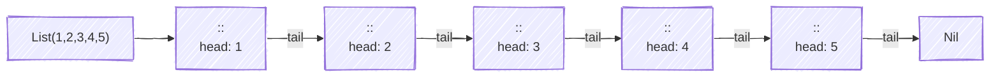
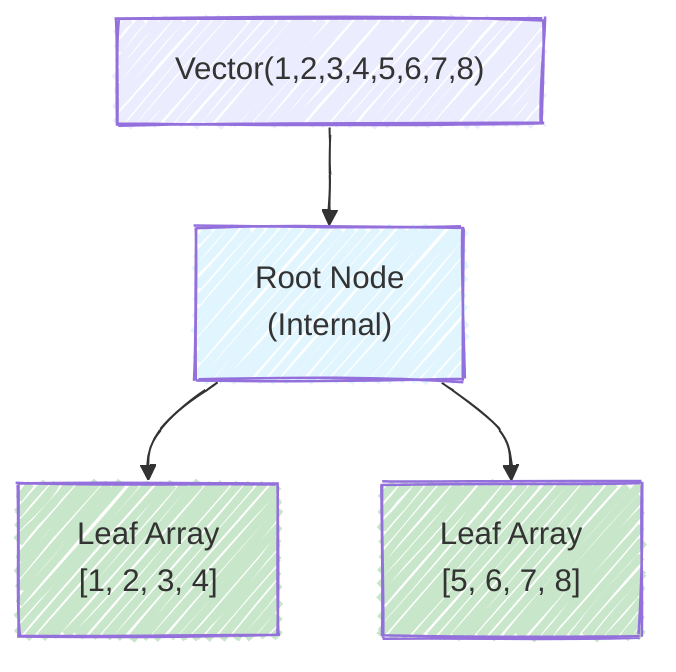
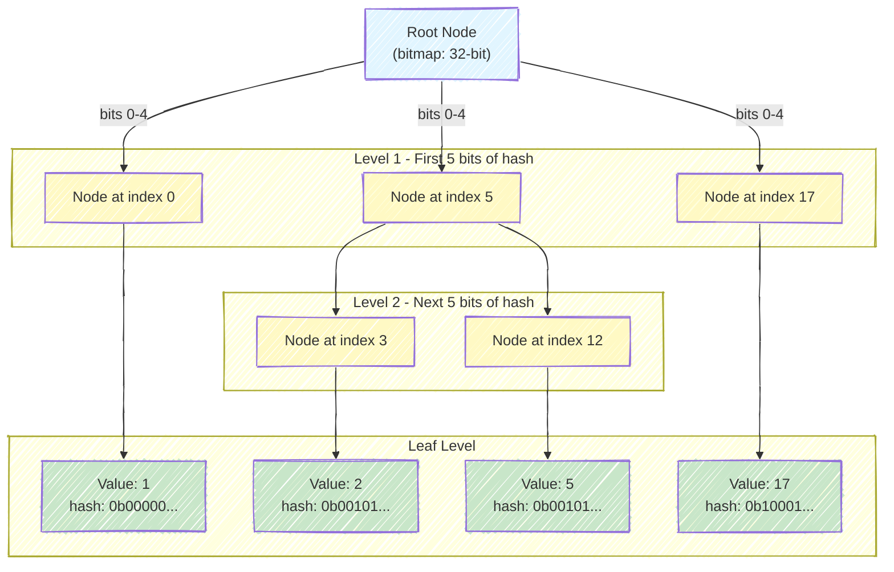

<style>
/* Styles for the two-column layout */
.image-text-container {
    display: flex; /* Enables flexbox */
    flex-wrap: wrap; /* Allows columns to stack on small screens */
    gap: 20px; /* Space between the image and text */
    align-items: center; /* Vertically centers content in columns */
    margin-bottom: 20px; /* Space below this section */
}

.image-column {
    flex: 1; /* Allows this column to grow */
    min-width: 250px; /* Minimum width for the image column before stacking */
    max-width: 40%; /* Maximum width for the image column to not take up too much space initially */
    box-sizing: border-box; /* Include padding/border in element's total width/height */
}

.text-column {
    flex: 2; /* Allows this column to grow more (e.g., twice as much as image-column) */
    min-width: 300px; /* Minimum width for the text column before stacking */
    box-sizing: border-box;
}

</style>

<div class="image-text-container">
    <div class="image-column">
        
    </div>
    <div class="text-column">
<p>Scala collections are a powerful feature providing rich data structures for working with sequences, sets, and maps. The collection hierarchy comprises three main types: Sequence for ordered indexed access, Set for unique elements, and Map for key-value pairs. Scala emphasises immutable collections by default, ensuring thread-safety and referential transparency, while mutable collections enable efficient in-place modifications. Key collection types include List for linked list operations, Vector for random access, and Range for memory-efficient numeric sequences. Understanding the distinction between immutable and mutable collections is essential for writing safe, concurrent Scala code. Iterators enable lazy evaluation, allowing efficient processing of large datasets without consuming memory.</p>
    </div>
</div>

<!--more-->

------

* TOC
{:toc}
------

## Introduction
Scala's collection library is one of its most powerful features, providing a rich set of data structures and operations for working with sequences, sets, and maps. The collections are designed to be **easy to use**, **concise**, **safe**, **fast**, and **universal**[^3].

## Collection Hierarchy

The Scala collections are organized into three main packages[^1]:

| Package | Description | Mutability |
|---------|-------------|------------|
| `scala.collection` | Base traits and abstract collections | May be immutable or mutable |
| `scala.collection.immutable` | Immutable collections (default) | Never change after creation |
| `scala.collection.mutable` | Mutable collections | Can be modified in place |


### The Iterable Trait

All Scala collections inherit from `Iterable[A]`, which defines an **iterator** that lets you loop through collection elements one at a time[^1]. The iterator can traverse the collection only once, as each element is consumed during iteration.

> **Important**: The `Iterable` trait provides the foundation for all collection operations through its iterator.

## Immutable vs. Mutable Collections

### Immutable Collections (Default)

Immutable collections **never change after creation**[^3]. When you "modify" an immutable collection, you create a new collection with the changes.

Immutable collections are the default:


```scala
val set = Set(1,2,3)
val list = List(1,2,3)
val map = Map(1 -> 'a', 2->'b')
```


    set: Set[Int] = Set(1, 2, 3)
    list: List[Int] = List(1, 2, 3)
    map: Map[Int, Char] = Map(1 -> 'a')


Adding to immutable collections creates new collections:


```scala
val set2 = set + 4
val list2 = list :+ 4
```


    set2: Set[Int] = Set(1, 2, 3, 4)
    list2: List[Int] = List(1, 2, 3, 4)


Source📝[^1]: Demonstrates how immutable collections are the default in Scala and how they handle additions.

**Logic**: 
- First three lines create immutable collections without any import statements
- The `+` operator on Set and <b>`:+`</b>{:gtxt} operator on List create new collections rather than modifying the originals
- `set` and `list` remain unchanged after operations; only new bindings `set2` and `list2` contain the updated values

>Immutability ensures **referential transparency** - the same expression always evaluates to the same value, making code easier to reason about and thread-safe by default.
{:.green}

### Mutable Collections

Mutable collections can be modified in place using operations that have **side effects**[^1].

Must import or use full path for mutable collections:


```scala
import scala.collection.mutable
```


    import scala.collection.mutable


```scala
val mutableSet = mutable.Set(1,2,3)
```


    mutableSet: mutable.Set[Int] = HashSet(1, 2, 3)


```scala
val mutableList = mutable.ArrayBuffer(1,2,3)
```


    mutableList: mutable.ArrayBuffer[Int] = ArrayBuffer(1, 2, 3)


```scala
val mutableMap = mutable.Map(1 -> 'a', 2 -> 'b')
```


    mutableMap: mutable.Map[Int, Char] = HashMap(1 -> 'a', 2 -> 'b')


Modifying mutable collections in place:


```scala
mutableSet += 4
mutableList += 4
```


    res14_0: mutable.Set[Int] = HashSet(1, 2, 3, 4)
    res14_1: mutable.ArrayBuffer[Int] = ArrayBuffer(1, 2, 3, 4)


Source📝[^1]: Shows how mutable collections differ from immutable ones in both declaration and usage.

> Mutable collections use **side effects**{:rtxt} - they change state rather than creating new values. This can be more efficient for frequent updates but sacrifices thread-safety and referential transparency.
{:.yellow}

### Why Immutability Matters

**Benefits of Immutability**:
- **Thread-safe**: Multiple threads can safely access immutable collections
- **Easier to reason about**: No hidden state changes
- **Referential transparency**: Same inputs always produce same outputs
- **Structural sharing**: Efficient memory use through shared structure

## Main Collection Types

### 1. Sequences (Seq)

Sequences are ordered collections that support indexed access. They branch into two main categories:

#### Linear Sequences (LinearSeq)

Optimised for **head/tail** operations. Elements are accessed sequentially[^1].



The `List` is implemented as a *singly linked list* where each node contains a value and a pointer to the next node. This structure makes prepending (`::`), head, and tail operations extremely fast, but random access requires traversing from the beginning.

**List characteristics**:
- **cons (::)** operation prepends elements in O(1) time
- Random access is O(n) - must traverse from head
- Ideal for recursive algorithms and pattern matching


```scala
val list = List(1, 2, 3, 4, 5)
```


    list: List[Int] = List(1, 2, 3, 4, 5)


Head and tail operations are O(1)


```scala
list.head
list.tail
```


    res16_0: Int = 1
    res16_1: List[Int] = List(2, 3, 4, 5)


```scala
list.isEmpty
```


    res17: Boolean = false


Pattern matching with Lists:


```scala
list match {
    case h :: t => println(s"Head: $h")
    case Nil => println("Empty list")
}
```

    Head: 1


Example📝[^2]: Demonstrates the fundamental operations on List - a singly linked list optimised for sequential access.

- `head` extracts the first element in constant O(1) time
- `tail` returns all elements except the first, also in O(1) time
- `::` (cons) operator in pattern matching destructures the list into head and tail
- `Nil` represents the empty list

#### Indexed Sequences (IndexedSeq)

Optimised for **random access**. Elements can be accessed efficiently by index[^1].
Vector - the default indexed sequence


```scala
val vector = Vector(1,2,3,4,5)
```


    vector: Vector[Int] = Vector(1, 2, 3, 4, 5)


Optimized for **random access**. Elements can be accessed efficiently by index[^1].


```scala
val indexed = IndexedSeq(1,2,3)
```


    indexed: IndexedSeq[Int] = Vector(1, 2, 3)


```scala
val updated = vector.updated(2, 22)
```


    updated: Vector[Int] = Vector(1, 2, 22, 4, 5)


Example📝[^1]: Shows Vector's strength in random access and updates compared to List.

**Data Structure**: Vector uses a **tree structure**. This gives effectively O(1) access time for practical purposes. Updates use **structural sharing** - only the path from root to the changed element is copied.

-   **Branching factor of 32** - Each internal node can have up to 32 children
-   **Shallow and wide** - Typical depth is 0-6 levels even for millions of elements
-   **Array-based nodes** - Each node is backed by an array of size 32
-   **Efficient access** - $O(\log_{32} n)$ ≈ effectively constant time for practical sizes
-   **Persistent/Immutable** - Structural sharing enables efficient copying



### 2. Sets

Sets are collections of **unique elements** with no defined order (except for sorted sets)[^1].

#### Immutable Sets
Creating immutable sets


```scala
val set1 = Set(1,2,3)
val set2 = Set(3,4,5)
```


    set1: Set[Int] = Set(1, 2, 3)
    set2: Set[Int] = Set(3, 4, 5)


Adding elements (returns a new set):


```scala
val set3 = set1 + 4
val set4 = set1 ++ List(5,6)
```


    set3: Set[Int] = Set(1, 2, 3, 4)
    set4: Set[Int] = HashSet(5, 1, 6, 2, 3)


```scala
println(s"set4 is a: ${set4.getClass.getSimpleName}")
```

    set4 is a: HashSet


Scala's immutable HashSet uses a Hash Array Mapped Trie (HAMT) - a tree structure optimised for hash-based lookups.



Key Characteristics:

1. **Hash-based Indexing**
    - Each element's hash code determines its position
    - Hash code is split into 5-bit chunks (32 = 2⁵ branches per level)
    - Each chunk selects which child node to follow
2. **Bitmap Compression**
    - Each node has a 32-bit bitmap indicating which children exist
    - Only allocated children are stored (sparse representation)
    - Saves memory for sparse hash distributions
3. **Tree Properties**
    - Branching factor: 32 (2⁵)
    - Max depth: ~6-7 levels for millions of elements
    - Time complexity: $$O(\log_{32} n)$$ ≈ O(1) effectively
    - Space: Efficient with structural sharing

Performance Characteristics:

| Operation | Time Complexity | Explanation |
|-----------|----------------|-------------|
| `contains` | $O(\log_{32} n) \approx O(1)$ | Hash lookup with shallow tree |
| `+` (add) | $O(\log_{32} n) \approx O(1)$ | Copy path, share rest |
| `++` (union) | $O(m \log_{32} n)$ | Add $m$ elements |
| `size` | $O(1)$ | Cached |

Set operations:


```scala
set1 union set2
```


    res32: Set[Int] = HashSet(5, 1, 2, 3, 4)


```scala
set1 intersect set2
```


    res33: Set[Int] = Set(3)


```scala
set1 diff set2
```


    res34: Set[Int] = Set(1, 2)


Membership testing $O(1)$ for HashSet


```scala
set1.contains(1)
// alternatively
set1(1)
```


    res35_0: Boolean = true
    res35_1: Boolean = true


Source📝[^4]: Demonstrates basic Set operations and their mathematical set theory foundations.

**Logic**:
- `+` and `++` add elements, creating new sets (immutable)
- `union` combines all elements from both sets (mathematical ∪ operator)
- `intersect` keeps only common elements (mathematical ∩ operator)
- `diff` returns elements in first set but not in second (mathematical \ operator)
- `contains` checks membership, implemented as hash lookup for O(1) performance

Sets implement mathematical set operations:

**Union**: 
$$A ∪ B = \{x | x ∈ A \text{ or } x ∈ B\}$$

**Intersection**: 
$$A ∩ B = \{x | x ∈ A \text{ and } x ∈ B\}$$

**Difference**: 
$$A \setminus B = \{x | x ∈ A \text{ and } x ∉ B\}$$

The uniqueness property ensures no duplicates: adding existing elements has no effect.

#### Sorted Sets
TreeSet maintains elements in sorted order


```scala
val sortedSet = scala.collection.immutable.TreeSet(5, 2, 8, 1, 9)
```


    sortedSet: collection.immutable.TreeSet[Int] = TreeSet(1, 2, 5, 8, 9)


The `TreeSet` operation creates an immutable, sorted set containing the given elements. The result stores unique values in ascending order according to an implicit `Ordering`.


Red-Black Tree Properties

A Red-Black Tree is a self-balancing binary search tree with these invariants:

1. **Every node is colored red or black** - Ensures the tree remains relatively balanced
2. **The root is always black** - Simplifies the tree structure
3. **Red nodes have only black children** - Prevents consecutive red nodes
4. **Every path from root to null has the same number of black nodes** - Guarantees O(log n) height

These properties ensure that the tree height is at most 2 × log(n + 1), guaranteeing logarithmic complexity for all operations.

Algorithmic Complexity Analysis

| Operation | Time Complexity | Space Complexity | Description |
|-----------|-----------------|------------------|-------------|
| **Construction** | O(n log n) | O(n) | Creating TreeSet from n elements requires n insertions, each O(log n) |
| **Insertion** | O(log n) | O(1) amortized | Adding an element requires tree rotations and rebalancing |
| **Deletion** | O(log n) | O(1) amortized | Removing an element requires tree rotations and rebalancing |
| **Search/Contains** | O(log n) | O(1) | Binary search in balanced tree structure |
| **Iteration** | O(n) | O(1) | In-order traversal visits each node once |
| **Minimum/Maximum** | O(log n) | O(1) | Must traverse to leftmost/rightmost leaf |

First and last operations


```scala
sortedSet.head
sortedSet.last
```


    res37_0: Int = 1
    res37_1: Int = 9


Range queries


```scala
sortedSet.range(2, 8)
```


    res38: collection.immutable.TreeSet[Int] = TreeSet(2, 5)


Example📝[^4]

Why Red-Black Tree for TreeSet?

When to Use TreeSet

| Use TreeSet When | Don't Use TreeSet When |
|-----------------|----------------------|
| You need sorted iteration | Elements don't need ordering |
| You need range queries (headSet, tailSet) | You frequently add/remove elements |
| Thread safety is important | Mutability would improve performance |
| You want guaranteed O(log n) operations | You need O(1) average case (use HashSet) |
| Working with small datasets | Performance overhead is critical |


### 3. Maps

Maps store **key-value pairs** where all keys must be unique[^1].


#### Creating and Using Maps


```scala
val map1 = Map(1 -> "a", 2 -> "b", 3 -> "c")
println(s"map1 is a: ${map1.getClass.getSimpleName}")
```

    map1 is a: Map3


    map1: Map[Int, String] = Map(1 -> "a", 2 -> "b", 3 -> "c")


Alternative syntax


```scala
val map2 = Map((1,"a"), (2, "b"), (3, "c"))
println(s"map2 is a: ${map2.getClass.getSimpleName}")
```

    map2 is a: Map3


    map2: Map[Int, String] = Map(1 -> "a", 2 -> "b", 3 -> "c")


Accessing values


```scala
map1(1)
```


    res46: String = "a"


if key not found


```scala
map1(4)
```


    java.util.NoSuchElementException: key not found: 4
      scala.collection.immutable.Map$Map3.apply(Map.scala:397)
      ammonite.$sess.cmd47$Helper.<init>(cmd47.sc:1)
      ammonite.$sess.cmd47$.<clinit>(cmd47.sc:7)


**Option Pattern**: The `get` method returns `Option[V]` instead of throwing exceptions, following functional programming's principle of making errors explicit in types:
- `Some(value)` when key exists
- `None` when key doesn't exist


```scala
map1.get(1)
map1.get(4)
map1.getOrElse(4, '?')
```


    res49_0: Option[String] = Some(value = "a")
    res49_1: Option[String] = None
    res49_2: Any = '?'


Adding/updating entries (immutable)


```scala
map1 + (4 -> "d")
```


    res51: Map[Int, String] = Map(1 -> "a", 2 -> "b", 3 -> "c", 4 -> "d")


Removing entries by the key:


```scala
map1 - 2 // 2 is a key
```


    res52: Map[Int, String] = Map(1 -> "a", 3 -> "c")


Source📝[^5] Shows different ways to create, access, and modify immutable Maps.
- `->` operator creates tuple pairs (syntactic sugar for `(1, "a")`)
- `apply(key)` throws exception if key doesn't exist (unsafe but concise)
- `get(key)` returns `Option[Value]` - safe handling of missing keys
- `getOrElse(key, default)` provides fallback value for missing keys
- `+` and `++` create new maps with additional entries
- `-` creates new map with key removed

This forces callers to handle the missing key case, preventing runtime errors.

#### Traversing Maps
**For comprehension** with tuple destructuring: `(k, v) <- ratings` automatically unpacks each key-value pair


```scala
val map1 = Map(1 -> "a", 2 -> "b", 3 -> "c")

for ((k, v) <- map1) { println(s"key: $k and value is: $v") }
```

    key: 1 and value is: a
    key: 2 and value is: b
    key: 3 and value is: c


    map1: Map[Int, String] = Map(1 -> "a", 2 -> "b", 3 -> "c")


**Pattern matching** in foreach: `case (movie, rating) =>` explicitly shows tuple destructuring


```scala
map1.foreach{
    case (k, v) => println(s"key: $k and value is: $v")
}
```

    key: 1 and value is: a
    key: 2 and value is: b
    key: 3 and value is: c


**Tuple accessors**: `x._1` (key) and `x._2` (value) directly access tuple components


```scala
map1.foreach(x => println(s"key: ${x._1} and value is ${x._2}"))
```

    key: 1 and value is a
    key: 2 and value is b
    key: 3 and value is c


**Separate iteration**: `keys` and `values` methods provide iterators over each component independently


```scala
map1.keys.foreach(k => print(k))
map1.values.foreach(v => print(v))
```

    123abc

Source📝[^5]: Demonstrates multiple idiomatic ways to traverse Map entries.

> Maps are Iterables of key-value pairs (also named mappings or associations)
{:.info-box}

**Map as Collection of Tuples**: Maps are conceptually `Iterable[(K, V)]` - a collection of 2-tuples. Each iteration yields a pair `(key, value)` which can be destructured using pattern matching or accessed via tuple syntax.

**Performance Note**: Using `keys` or `values` creates lightweight iterators without copying data.

**Transformer methods** take at least one collection and produce a new collection[^1]. In Scala 2, these include:

| Method | Description | Example |
|--------|-------------|---------|
| `map` | Apply function to each element | `List(1,2,3).map(_ * 2)` → `List(2,4,6)` |
| `filter` | Keep elements matching predicate | `List(1,2,3,4).filter(_ > 2)` → `List(3,4)` |
| `flatMap` | Map and flatten nested results | `List(1,2).flatMap(n => List(n, n*10))` → `List(1,10,2,20)` |
| `collect` | Partial function mapping + filtering | `List(1,2,3).collect { case x if x > 1 => x * 2 }` → `List(4,6)` |

#### The map Method
The `map(_ * 2)` uses underscore syntax for anonymous function: `x => x * 2`


```scala
val numbers = List(1,2,3,4,5)
numbers.map(_ * 2)
```


    numbers: List[Int] = List(1, 2, 3, 4, 5)
    res66_1: List[Int] = List(2, 4, 6, 8, 10)


map with function


```scala
List("a", "bb", "ccc").map(_.length)
```


    res67: List[Int] = List(1, 2, 3)


map preserves collection type


```scala
val vector = Vector(1, 2, 3)
val vectorResult = vector.map(_ + 1)
```


    vector: Vector[Int] = Vector(1, 2, 3)
    vectorResult: Vector[Int] = Vector(2, 3, 4)


Example📝[^2]

**Functor Laws**: The `map` operation makes collections into **functors**[^12]. To be a valid functor, `map` must satisfy two laws:

1. **Identity**: `collection.map(x => x) == collection`
   - Mapping the identity function returns the same collection

2. **Composition**: `collection.map(f).map(g) == collection.map(x => g(f(x)))`
   - Mapping twice equals mapping the composition once
   - This means: `map(f).map(g)` = `map(g ∘ f)` where `∘` is function composition

**Mathematics**: If we have functions $f: A → B$ and $g: B → C$, then:
$$\text{map}(g) ∘ \text{map}(f) = \text{map}(g ∘ f)$$

This property allows the compiler to optimize chained `map` operations.

#### The filter Method
The `filter(_ % 2 == 0)` keeps only elements where the predicate returns `true`: $$\{x \in \text{numbers} | x \bmod 2 = 0\}$$


```scala
val numbers = (1 to 10).toList
// Filter even numbers
numbers.filter( _ % 2 == 0 )
```


    numbers: List[Int] = List(1, 2, 3, 4, 5, 6, 7, 8, 9, 10)
    res72_1: List[Int] = List(2, 4, 6, 8, 10)


Multiple `filter` calls can be chained: `filter(p1).filter(p2)` ≡ `filter(x => p1(x) && p2(x))`


```scala
numbers.filter(_ > 2).filter(_ < 8)
```


    res73: List[Int] = List(3, 4, 5, 6, 7)


Example📝[^2]: Demonstrates filtering collections based on boolean predicates (test conditions).

**Predicate Function**: A **predicate** is a function that returns a Boolean: `A => Boolean`. It answers "yes" or "no" questions about each element.

Filter implements set comprehension notation:
$$\{x \in S | P(x)\}$$

Read as: "the set of all x in S such that P(x) is true"


**Performance**: Filter must traverse all elements once, giving O(n) time complexity. The resulting collection may be smaller but never larger than the input.

#### The flatMap Method {#flatmap}

Imagine you have a **wrapped value** inside a container (like `Option[Int]` or `List[String]`). You want to:

1. **Extract** the value from its container
2. **Transform** it using a function that *also* produces a wrapped result
3. **Avoid nesting** containers (so you don't end up with `Option[Option[Int]]`)

This is exactly what `flatMap` does. The word "flat" is key—it flattens the nesting that would naturally occur.

```
flatMap: M[A] → (A → M[B]) → M[B]
```

| Symbol | Meaning |
|--------|---------|
| M[A] | A value of type A wrapped in monad M (e.g., Option[Int], List[String]) |
| A | The unwrapped value type |
| A → M[B] | A function that takes a plain A and returns a wrapped B |
| M[B] | The final result: a B wrapped in monad M (same monad, different type) |

In Scala syntax:

```scala
def flatMap[A, B](ma: M[A])(f: A => M[B]): M[B]
```

For `flatMap` to preserve monadic semantics, it must satisfy  3 **Monad Laws**:

1. **Left Identity**: Creating a context from a value and then flatMap-ing is the same as just applying the function:
    ```
    unit(a).flatMap(f) = f(a)
    ```
2. **Right Identity**: flatMap-ing with the constructor does nothing:
    ```
    m.flatMap(unit) = m
    ```
3. **Associativity**: Chaining two sequential flatMap calls is the same as nesting one inside the other:

    ```
    m.flatMap(f).flatMap(g) = m.flatMap(x => f(x).flatMap(g))
    ```

For example, Monad Type Class Definition:
- `pure[A](value: A): F[A]` — wraps a plain value in monad F
- `flatMap[A, B](ma: F[A])(f: A => F[B]): F[B]` — sequences operations
- `map` is derived from `flatMap` + `pure` — all monads automatically get `map`


```scala
import scala.language.higherKinds

trait Monad[F[_]] {
  def pure[A](value: A): F[A]
  def flatMap[A, B](ma: F[A])(f: A => F[B]): F[B]
  def map[A, B](ma: F[A])(f: A => B): F[B] =
    flatMap(ma)(a => pure(f(a)))
}

implicit val optionMonad: Monad[Option] = new Monad[Option] {
  def pure[A](value: A): Option[A] = Some(value)
  def flatMap[A, B](ma: Option[A])(f: A => Option[B]): Option[B] = ma.flatMap(f)
}

implicit val listMonad: Monad[List] = new Monad[List] {
  def pure[A](value: A): List[A] = List(value)
  def flatMap[A, B](ma: List[A])(f: A => List[B]): List[B] = ma.flatMap(f)
}

def combine[M[_]: Monad](a: M[Int], b: M[Int])(implicit M: Monad[M]): M[Int] =
  M.flatMap(a) { x =>
    M.flatMap(b) { y =>
      M.pure(x + y)
    }
  }

// Explicitly specify type parameter
combine[Option](Some(3), Some(4))       // Some(7) ✅
combine[List](List(1, 2), List(3, 4))   // List(4, 5, 5, 6) ✅
```


    import scala.language.higherKinds


​    
    defined trait Monad
    optionMonad: Monad[Option] = ammonite.$sess.cmd2$Helper$$anon$1@7c758c02
    listMonad: Monad[List] = ammonite.$sess.cmd2$Helper$$anon$2@650110e5
    defined function combine
    res2_5: Option[Int] = Some(value = 7)
    res2_6: List[Int] = List(4, 5, 5, 6)


Source: *Advanced Scala*, Chapter 4: "Monads" → Section 4.1: "Monad Definition and Laws"

For lists, flatMap implements **list comprehensions**:
$$[f(x, y) | x ← xs, y ← ys] = \text{xs.flatMap}(x ⇒ \text{ys.map}(y ⇒ f(x, y)))$$


```scala
val numbers = (1 to 3).toList
```


    numbers: List[Int] = List(1, 2, 3)


```scala
numbers.map(n => 2 * n)
```


    res76: List[Int] = List(2, 4, 6)


The `map` with a function returning collections creates nested structure: `List[List[Int]]`


```scala
val nested = numbers.map(n => List(n, n * 10))
```


    nested: List[List[Int]] = List(List(1, 10), List(2, 20), List(3, 30))


The `flatMap` applies the function **and** flattens one level: `List[Int]`


```scala
nested.flatten // flatten the above nested 
numbers.flatMap(n => List(n, n * 10)) // ✔️
```


    res83_0: List[Int] = List(1, 10, 2, 20, 3, 30)
    res83_1: List[Int] = List(1, 10, 2, 20, 3, 30)


Example📝[^2]: Shows how `flatMap` combines mapping and flattening into one operation, crucial for working with nested structures and monadic types.


- `map` with a function returning collections creates nested structure: `List[List[Int]]`
- `flatMap` applies the function **and** flattens one level: `List[Int]`


**Relationship**: `flatMap(f)` ≡ `map(f).flatten`

**Monadic Bind**: `flatMap` is the **bind** operation in monadic programming. For a monad `M[A]`:
$$\text{flatMap}: M[A] → (A → M[B]) → M[B]$$

This allows **sequencing computations** where each step may produce multiple results (List) or may fail (Option).

With `Option`, `flatMap` filters out `None` values automatically:
  - `Some(x)` → contributes `x` to result
  - `None` → contributes nothing (filtered out)


```scala
def findInt(s: String): Option[Int] = 
    try Some(s.toInt)
    catch {case _: NumberFormatException => None
}
```


    defined function findInt


test the above method:


```scala
val strings = List("2", "too", "5.22", "two", "10")
strings.flatMap(findInt)
```


    strings: List[String] = List("2", "too", "5.22", "two", "10")
    res7_1: List[Int] = List(2, 10)


A monad is a control mechanism for sequencing computations. Instead of thinking of it as a purely mathematical concept, think of it as a way to specify "what happens next" in a computation, where the next step may depend on the result of the previous step.

```scala
def flatMap[A, B](ma: M[A])(f: A => M[B]): M[B]
```

### Reduction Operations

Operations that **combine** elements to produce a single result:

#### fold, foldLeft, foldRight

Fold operations implement **catamorphisms**, which are generalisations of recursion. They "tear down" a structure to a single value.

For a list `[a₁, a₂, a₃, a₄]` with operation `⊕` and initial value `z`:

**foldLeft** (left-associative):
$$((((z ⊕ a₁) ⊕ a₂) ⊕ a₃) ⊕ a₄)$$

**foldRight** (right-associative):
$$(a₁ ⊕ (a₂ ⊕ (a₃ ⊕ (a₄ ⊕ z))))$$

**Associativity Requirement for fold**: Operation must satisfy:
$$(a ⊕ b) ⊕ c = a ⊕ (b ⊕ c)$$

Examples: `+`, `*`, `max`, `min` are associative; `-`, `/` are not.


```scala
val numbers = (1 to 5).toList
```


    numbers: List[Int] = List(1, 2, 3, 4, 5)


**foldLeft**: Processes left-to-right with accumulator as first parameter: `((((z ⊕ a₁) ⊕ a₂) ⊕ a₃) ⊕ a₄)`

> ```scala
> def foldLeft[B](z: B)(op: (B, A) => B): B   // z is accumulator, A is element
> ```
{:.info-box}


```scala
numbers.foldLeft(0)(_ + _)
// 0 + 1 = 1, 1 + 2 = 3, 3 + 3 = 6, 6 + 4 = 10, 10 + 5 = 15

//with an accumulator
numbers.foldLeft("")((acc, n) => acc + n)
```


    res15_0: Int = 15
    res15_1: String = "12345"


**foldRight**: Processes right-to-left with accumulator as second parameter: `(a₁ ⊕ (a₂ ⊕ (a₃ ⊕ (a₄ ⊕ z))))`

> ```scala
> def foldRight[B](z: B)(op: (A, B) => B): B  // z is accumulator, A is element
> ```
{:.info-box}


```scala
numbers.foldRight(List.empty[Int])((elem, acc) => elem :: acc)
```


    res13: List[Int] = List(1, 2, 3, 4, 5)


**fold**: Can process in any order (requires associativity), enables parallelization
> ```scala
> def fold[A1 >: A](z: A1)(op: (A1, A1) => A1): A1
> ```
{:.info-box}


```scala
numbers.fold(1)(_ * _)
```


    res14: Int = 120


Source📝[^6]: Demonstrates folding operations that reduce a collection to a single value by repeatedly applying a binary operation.

**Subtraction Example Analysis**:
- `reduceLeft(_ - _)` on `[1,2,3,4,5]`: 
  - `((((1 - 2) - 3) - 4) - 5)` = `(((-1 - 3) - 4) - 5)` = `((-4 - 4) - 5)` = `(-8 - 5)` = `-13`
  
- `reduceRight(_ - _)` on `[1,2,3,4,5]`:
  - `(1 - (2 - (3 - (4 - 5))))` = `(1 - (2 - (3 - (-1))))` = `(1 - (2 - 4))` = `(1 - (-2))` = `3`

**Key Differences from fold**:

| Feature | fold | reduce |
|---------|------|--------|
| Initial value | Required parameter | Uses first element |
| Empty collection | Returns initial value | Throws exception (use reduceOption) |
| Result type | Can differ from element type | Must be same as element type |

**When to use reduce**: When the operation is associative and you don't need a different result type. The first element naturally serves as the identity element.

### Collection Queries

#### Checking Conditions

- **Exists (∃)**: `numbers.exists(_ > 4)` ≡ $\exists x \in \text{numbers}, x > 4$
  - "There exists an x in numbers such that x > 4"
  - `exists(p)`: Returns `true` if **at least one** element satisfies predicate p (∃ - existential quantifier)


```scala
val numbers = (1 to 5).toList
numbers.exists(_ > 4)
```


    numbers: List[Int] = List(1, 2, 3, 4, 5)
    res16_1: Boolean = true


- **For all (∀)**: `numbers.forall(_ > 0)` ≡ $\forall x \in \text{numbers}, x > 0$
  - "For all x in numbers, x > 0"
  - `forall(p)`: Returns `true` if **all** elements satisfy predicate p (∀ - universal quantifier)


```scala
numbers.forall(_ > 3)
```


    res17: Boolean = false


`contains(x)`: Returns `true` if element x is in the collection (membership test)


```scala
numbers.contains(3)
```


    res18: Boolean = true


`find(p)`: Returns `Some(first matching element)` or `None` (search with early termination)


```scala
numbers.find(_ > 3)
```


    res19: Option[Int] = Some(value = 4)


Example📝[^2]: Demonstrates predicate-based queries that answer questions about collection contents.

**Performance**:
- `exists` and `find` use **short-circuit evaluation**: stop as soon as match found (best case O(1), worst case O(n))
- `forall` stops at first element that fails the predicate
- `contains` is O(n) for lists, O(1) for HashSet/HashMap

#### Taking and Dropping

- `take(n)`: Returns first n elements (or all if fewer than n)


```scala
val numbers = (1 to 10).toList
numbers.take(3)
```


    numbers: List[Int] = List(1, 2, 3, 4, 5, 6, 7, 8, 9, 10)
    res20_1: List[Int] = List(1, 2, 3)


- `drop(n)`: Returns all except first n elements


```scala
numbers.drop(3)
```


    res21: List[Int] = List(4, 5, 6, 7, 8, 9, 10)


- `takeWhile(p)`: Takes elements **from the start** while predicate is true, stops at first false


```scala
numbers.takeWhile(_ < 5)
```


    res22: List[Int] = List(1, 2, 3, 4)


- `dropWhile(p)`: Drops elements **from the start** while predicate is true, keeps rest


```scala
numbers.dropWhile(_ < 5)
```


    res25: List[Int] = List(5, 6, 7, 8, 9, 10)


- `takeRight(n)` / `dropRight(n)`: Same operations but from the end

**Important**: `takeWhile` and `dropWhile` stop at the **first** element that doesn't match:

```scala
List(1, 2, 3, 1, 2).takeWhile(_ < 3)  // List(1, 2) - stops at 3
// NOT List(1, 2, 1, 2) - doesn't continue checking
```


```scala
numbers.takeRight(3)
numbers.dropRight(3)
```


    res24_0: List[Int] = List(8, 9, 10)
    res24_1: List[Int] = List(1, 2, 3, 4, 5, 6, 7)


**Complementary Operations**: For any collection `c` and number `n`:
```scala
c.take(n) ++ c.drop(n) == c        // Reconstruct original
c.takeWhile(p) ++ c.dropWhile(p) == c  // Also reconstructs original
```


```scala
numbers.take(3) ++ numbers.drop(3)
numbers.takeWhile(_ < 5) ++ numbers.dropWhile(_ < 5)
```


    res27_0: List[Int] = List(1, 2, 3, 4, 5, 6, 7, 8, 9, 10)
    res27_1: List[Int] = List(1, 2, 3, 4, 5, 6, 7, 8, 9, 10)


Example📝[^2]: Shows operations for extracting subsequences from collections.

**Performance**: 
- `take/drop`: O(n) for List (must traverse), O(1) for Vector (index calculation)
- `takeRight/dropRight`: O(n) - must traverse entire collection to find end

#### Grouping and Partitioning

- `partition(p)`: Splits into two groups - `(matching, notMatching)` tuple. All elements tested against predicate


```scala
val numbers = (1 to 10).toList
val (even, odds) = numbers.partition(_ % 2 == 0)
```


    numbers: List[Int] = List(1, 2, 3, 4, 5, 6, 7, 8, 9, 10)
    even: List[Int] = List(2, 4, 6, 8, 10)
    odds: List[Int] = List(1, 3, 5, 7, 9)


- `groupBy(f)`: Creates Map where keys are `f(element)` and values are Lists of elements producing that key


```scala
val grouped = numbers.groupBy(_ % 3)
```


    grouped: Map[Int, List[Int]] = HashMap(
      0 -> List(3, 6, 9),
      1 -> List(1, 4, 7, 10),
      2 -> List(2, 5, 8)
    )


- `span(p)`: Like `(takeWhile(p), dropWhile(p))` but in single traversal


```scala
val (low, hight) = numbers.span(_ < 3)
```


    low: List[Int] = List(1, 2)
    hight: List[Int] = List(3, 4, 5, 6, 7, 8, 9, 10)


- `splitAt(n)`: Like `(take(n), drop(n))` but returns tuple


```scala
val (first, second) = numbers.splitAt(3)
```


    first: List[Int] = List(1, 2, 3)
    second: List[Int] = List(4, 5, 6, 7, 8, 9, 10)


Example📝[^2]: Demonstrates operations that divide a collection into multiple subcollections.

**Key Differences**:
- **partition** vs **filter**: `partition` gives both groups; `filter` gives only matching
- **span** vs **partition**: `span` stops at first non-match; `partition` checks all elements
- **span** vs **takeWhile/dropWhile**: <span>`span` is more efficient (single pass)</span>{:.gtxt}

**groupBy Mathematics**: Creates an **equivalence relation** partitioning the collection:

For key function $f: A → K$, elements $x, y$ are in same group if $f(x) = f(y)$

Results in partition: 
$$
\{G_k | k \in K\}
$$
where $G_k = \{x | f(x) = k\}$

Example: `groupBy(_ % 3)` partitions by remainder mod 3

- 
$$
G_0 = \{x | x \bmod 3 = 0\}
$$ = {3, 6, 9}
- 
$$
G_1 = \{x | x \bmod 3 = 1\}
$$ = {1, 4, 7, 10}
- 
$$
G_2 = \{x | x \bmod 3 = 2\}
$$ = {2, 5, 8}

### Sorting


```scala
val numbers = List(5, 2, 8, 1, 9, 3)
val words = List("banana", "cherry", "mango", "apple")

```


    numbers: List[Int] = List(5, 2, 8, 1, 9, 3)
    words: List[String] = List("banana", "cherry", "mango", "apple")


- `sorted`: Uses **natural ordering** (requires implicit `Ordering[A]`)
  - Numbers: ascending order (1, 2, 3...)
  - Strings: lexicographic order (alphabetical)


```scala
numbers.sorted
words.sorted
```


    res48_0: List[Int] = List(1, 2, 3, 5, 8, 9)
    res48_1: List[String] = List("apple", "banana", "cherry", "mango")


- `sortBy(f)`: Extracts a sortable key using function `f`, then sorts by that key


```scala
val people = List(("Charls", 34), ("Alice", 32), ("Ben", 23)) 
//Sort by second key
people.sortBy(_._2)
```


    people: List[(String, Int)] = List(("Charls", 34), ("Alice", 32), ("Ben", 23))
    res50_1: List[(String, Int)] = List(("Ben", 23), ("Alice", 32), ("Charls", 34))


- `sortWith(compare)`: Uses custom comparison function `(A, A) => Boolean`
  - `sortWith(_ < _)` for ascending
  - `sortWith(_ > _)` for descending


```scala
numbers.sortWith(_ > _)
people.sortWith(_._1 < _._1) // sort by name
```


    res53_0: List[Int] = List(9, 8, 5, 3, 2, 1)
    res53_1: List[(String, Int)] = List(("Alice", 32), ("Ben", 23), ("Charls", 34))


- `reverse`: Reverses element order (doesn't sort, just reverses)


```scala
numbers.sorted.reverse
```


    res54: List[Int] = List(9, 8, 5, 3, 2, 1)


Example📝[^2]: Shows different ways to order collection elements.

**Orderings**: Sorting requires a **total order** relation ≤ that satisfies:
1. **Reflexivity**: $a ≤ a$ (every element relates to itself)
2. **Antisymmetry**: if $a ≤ b$ and $b ≤ a$, then $a = b$
3. **Transitivity**: if $a ≤ b$ and $b ≤ c$, then $a ≤ c$
4. **Totality**: for all $a, b$: either $a ≤ b$ or $b ≤ a$ (can compare any two elements)

**Performance**: Most Scala sorting uses **Timsort** (a hybrid of merge sort and insertion sort):
- Time: O(n log n) worst case, O(n) best case for nearly sorted data
- Space: O(n) for temporary storage
- **Stable**: equal elements maintain relative order

## `for` Comprehensions with Collections

For comprehensions in Scala provide syntactic sugar for **map**, **flatMap**, and **filter** operations[^7].


```scala
val numbers = (1 to 5).toList
```


    numbers: List[Int] = List(1, 2, 3, 4, 5)


- Single generator `for x <- col yield expr` → `col.map(x => expr)`
    - `yield` collects results from each loop iteration and returns them as a **new collection** of the same type as the input.

Think of what `yield` does in simple terms:

1. **Creates an empty bucket** when the for loop begins
2. **On each iteration**, one output element may be created from the current input element
3. **Places the output element** into the bucket
4. **Returns the bucket's contents** when the loop finishes

A **functor** is a mathematical structure that preserves relationships while transforming data. Think of it as a "structure-preserving function."

When you apply `yield`, you're using the fundamental mathematical operation called **map** (or `fmap`), which is the core of functor theory.

- Single generator `for (x <- col yield expr` → `col.map(x => expr)`


```scala
// for/yield translates to map
val double = for (n <- numbers) yield n * 2
```


    double: List[Int] = List(2, 4, 6, 8, 10)


---
Above `yield` is **syntactic sugar** (human-readable syntax) for the `map` operation:


```scala
// Using yield (readable)
for (n <- numbers) yield n * 2

// Desugars to (functional)
numbers.map(n => n * 2)
```


    res66_0: List[Int] = List(2, 4, 6, 8, 10)
    res66_1: List[Int] = List(2, 4, 6, 8, 10)


---

- Generator + guard `for x <- col if pred yield expr` → `col.filter(pred).map(x => expr)` 


```scala
for {
    n <- numbers
    if n % 2 != 0
} yield n * 2

// same as 
numbers.filter(n => n % 2 != 0).map( n => n * 2)
```


    res76_0: List[Int] = List(2, 6, 10)
    res76_1: List[Int] = List(2, 6, 10)


- Multiple generators → nested `flatMap` and `map` calls


```scala
for {
    x <- (1 to 3).toList
    y <- List("a", "b")
} yield (x, y)

// same as
(1 to 3).toList.flatMap(x => // Step 1: Translate outer generator to flatMap
        List("a", "b").map(y => (x, y))) // Step 2: Translate inner generator to map
```


    res75_0: List[(Int, String)] = List(
      (1, "a"),
      (1, "b"),
      (2, "a"),
      (2, "b"),
      (3, "a"),
      (3, "b")
    )
    res75_1: List[(Int, String)] = List(
      (1, "a"),
      (1, "b"),
      (2, "a"),
      (2, "b"),
      (3, "a"),
      (3, "b")
    )


Source📝[^2]: Shows how `for` comprehensions are syntactic sugar for collection operations.

**Translation Process** (step-by-step for nested example):
```scala
for { x <- List(1,2,3); y <- List(10,20) } yield (x, y)

// Step 1: Translate outer generator to flatMap
List(1,2,3).flatMap(x => 
  // Step 2: Translate inner generator to map
  List(10,20).map(y => (x, y))
)
```

**Why This Matters**: Understanding the translation helps you:
1. Know when for comprehensions are appropriate (working with monads)
2. Understand performance implications (each generator may iterate)
3. Debug errors (compiler errors reference `flatMap`/`map`)

**Monadic Comprehensions**: Any type `M` that implements `map`, `flatMap`, and `withFilter` can use for comprehensions:
- Collections: `List`, `Vector`, `Option`, `Either`
- Async computations: `Future`
- Effect types: `IO`, `Task`

> This is why `for` comprehensions are called "monadic comprehensions" - they work with any monad.
{:.green}

## Views and Lazy Evaluation

**Views** provide lazy evaluation of collection operations[^1]. Transformer methods on views don't create intermediate collections.

- **Without view**: Each transformation (`map`, `filter`) creates a new collection immediately (**strict evaluation**)

    ```scala
    val numbers = List.range(1, 1000000)
    val r1 = numbers.map(_ + 1).map(_ * 2).filter(_ > 100)
    ```
    - For 1M elements: map creates 1M element list, next map creates another 1M, etc.
    - Memory usage: Multiple copies of the entire collection

- **With view**: Transformations create lightweight **iterators** that compute elements on demand (**lazy evaluation**)

  > Views are especially useful for large collections


```scala
lazy val hugeList = (1 to 1000000).toList
val goodHugeList = hugeList
    .view // This works efficiently
    .map(_ + 1)
    .map(_ * 2)
    .filter(_ > 1000)
    .take(2).toList
```


<div class="jp-RenderedText">
<pre><code><span style="color: rgb(0, 187, 187)"><span class="ansi-cyan-fg">hugeList</span></span>: <span style="color: rgb(0, 187, 0)"><span class="ansi-green-fg">List</span></span>[<span style="color: rgb(0, 187, 0)"><span class="ansi-green-fg">Int</span></span>] = <span style="color: white"><span class="ansi-white-fg">[lazy]</span></span>
<span style="color: rgb(0, 187, 187)"><span class="ansi-cyan-fg">goodHugeList</span></span>: <span style="color: rgb(0, 187, 0)"><span class="ansi-green-fg">List</span></span>[<span style="color: rgb(0, 187, 0)"><span class="ansi-green-fg">Int</span></span>] = <span style="color: yellow"><span class="ansi-yellow-fg">List</span></span>(<span style="color: rgb(0, 187, 0)"><span class="ansi-green-fg">1002</span></span>, <span style="color: rgb(0, 187, 0)"><span class="ansi-green-fg">1004</span></span>)</code></pre>
</div>


Source📝[^1]: Demonstrates lazy evaluation using views to avoid creating intermediate collections.


**Key Difference:**
- 🟢 **Lazy (with .view)**: Each element flows through ALL operations one at a time
- 🟠 **Strict (without .view)**: Each operation completes on ENTIRE collection before next operation
- 
**When to use views**:
1. Chaining multiple transformations on large collections
2. When you only need part of the result (e.g., with `take`)
3. To avoid memory allocation for intermediate results
4. Working with infinite sequences

> Views compute elements every time they are accessed. If accessing multiple times, use strict collection.
{:.yellow}

Performance Characteristics

Understanding performance is crucial for choosing the right collection[^1].

### Sequence Operations Performance

| Operation | List | Vector | ArrayBuffer | Array |
|-----------|------|--------|-------------|-------|
| head | C | eC | C | C |
| tail | C | eC | L | L |
| apply (indexed access) | L | eC | C | C |
| update | L | eC | C | C |
| prepend (::) | C | eC | L | - |
| append (:+) | L | eC | aC | - |
| insert | - | - | L | - |

**Legend**:
- **C**: Constant time - O(1)
- **eC**: Effectively constant time - O(log₃₂ n), very fast in practice
- **aC**: Amortized constant time - O(1) on average
- **L**: Linear time - O(n)

## Variance and Type Parameters

Collections in Scala use **variance annotations** to control subtyping relationships[^8]. In type theory, variance is defined in terms of subtyping relations. If we have types A and B where `A <: B` (`A` is a subtype of `B`), then for a generic type `F[+T]`, `F[-T]`, or `F[T]`, we examine how the subtyping relationship between `F[A]` and `F[B]` behaves.

### Covariance (+A)

A type `F[+A]` is **covariant** if `F[Dog]` is a subtype of `F[Animal]` when `Dog` is a subtype of `Animal`.


```scala
sealed trait Animal {
    def name: String
    override def toString():String = s"Name: $name"
}

case class Dog(name: String) extends Animal
case class Cat(name: String) extends Animal
```


    defined trait Animal
    defined class Dog
    defined class Cat


- `List` is declared as `List[+A]` where `+` indicates covariance
- Since `Dog <: Animal` (Dog is subtype of Animal)
- Then `List[Dog] <: List[Animal]` (covariance preserved)
- This is safe because List is **immutable** - we only read from it, never write


```scala
val dogs: List[Dog]  = List(Dog("Liela"), Dog("Rex"))
val animals:List[Animal] = dogs  // ✓
```


    dogs: List[Dog] = List(Dog(name = "Liela"), Dog(name = "Rex"))
    animals: List[Animal] = List(Dog(name = "Liela"), Dog(name = "Rex"))


```scala
def printAllAnimals(axs: List[Animal]):String = axs.mkString(", ")
```


    defined function printAllAnimals


*Functors*: Covariant type constructors are functors that preserve subtyping direction:

If $A <: B$, then $F[A] <: F[B]$ (same direction)

*Liskov Substitution*: You can substitute `List[Dog]` where `List[Animal]` is expected because:
- All operations on `List[Animal]` work on `List[Dog]`
- Reading returns Dogs, which are Animals (safe upcast)
- No operations try to insert Cats into List (immutability prevents this)
  

Type Hierarchy:

```
        Animal  |    List[Animal]   
         /  \   |         /  \
       Dog  Cat |   List[Dog] List[Cat]
   
   (covariant relationship preserved)
```

The following code work because `List` is covariant:


```scala
printAllAnimals(dogs)
```


    res27: String = "Name: Liela, Name: Rex"


Source📝[^8]: Demonstrates covariance - how `List[Dog]` can be used as `List[Animal]` safely.

### Contravariance (-A)

A type `F[-A]` is **contravariant** if `F[Animal]` is a subtype of `F[Dog]` when `Dog` is a subtype of `Animal`[^9].

- `Function1` is declared as `Function1[-T, +R]`
  - `-T`: Contravariant in parameter type (input)
  - `+R`: Covariant in return type (output)

If `Dog <: Animal`, then `Function1[Animal, R] <: Function1[Dog, R]`
  ```scala
    trait Function1[-T, +R] {
      def apply(x: T): R
    }
  ```
> Notice the **reversal**: Animal function is subtype of Dog function

Contravariance is ideal for containers or classes that consume only values of a specific type. Think of a printer, a logger, or a data sink:


```scala
// Custom example
trait Printer[-T] {
  def print(value: T): Unit
}

val animalPrinter: Printer[Animal] = (a: Animal) => println(s"The $a is the animal")
```


    defined trait Printer
    animalPrinter: Printer[Animal] = ammonite.$sess.cmd36$Helper$$anonfun$1@21d0cd41


Following code works because `Printer` is contravariant


```scala
val dogPrinter: Printer[Dog] = animalPrinter
dogPrinter.print(Dog("Tossy"))
```

    The Name: Tossy is the animal


    dogPrinter: Printer[Dog] = ammonite.$sess.cmd36$Helper$$anonfun$1@21d0cd41


Since every *Dog IS an Animal*, this always works because according to **Liskov Substitution Principle**, it's safe to substitute `T` for `U` if you can use `T` wherever `U` is required.

Source📝[^9]: Demonstrates contravariance - how function parameter types work in the "opposite" direction of covariance.

**Mnemonic**: 
- **Producers** (outputs) are covariant (+): Can provide more specific type
- **Consumers** (inputs) are contravariant (-): Must accept more general type

### Invariance (A)

A type `F[A]` is **invariant** if there's no subtyping relationship between `F[Dog]` and `F[Animal]`, regardless of the relationship between `Dog` and `Animal`.

> Arrays and mutable collections declared as `Array[A]`, `ArrayBuffer[A]` (no variance annotation)
{:.yellow}

Arrays are invariant in Scala; therefore, the following code won't compile.


```scala
val dogs: Array[Dog] = Array(Dog("Liela"),Dog("Liela"))
val animals: Array[Animal] = dogs
```

    cmd39.sc:2: type mismatch;
     found   : Array[cmd39.this.cmd21.Dog]
     required: Array[cmd39.this.cmd21.Animal]
    Note: cmd39.this.cmd21.Dog <: cmd39.this.cmd21.Animal, but class Array is invariant in type T.
    You may wish to investigate a wildcard type such as `_ <: cmd39.this.cmd21.Animal`. (SLS 3.2.10)
    val animals: Array[Animal] = dogs
                                 ^Compilation Failed


    Compilation Failed


Example📝[^9]: Shows why mutable collections must be invariant for type safety.

Variance Summary Table

| Variance | Notation | Subtyping | Use Case | Examples |
|----------|----------|-----------|----------|----------|
| Covariant | `+A` | `F[Dog] <: F[Animal]` | Producers (output) | `List[+A]`, `Vector[+A]`, `Option[+A]` |
| Contravariant | `-A` | `F[Animal] <: F[Dog]` | Consumers (input) | `Function1[-T, +R]` (parameter type) |
| Invariant | `A` | No relation | Producers + Consumers | `Array[A]`, `ArrayBuffer[A]` |

## Iterators
**Iterators** provide a way to access collection elements sequentially without directly using `hasNext` and `next`[^2].


```scala
val xs = (1 to 5).toList
val it = xs.iterator
```


    xs: List[Int] = List(1, 2, 3, 4, 5)
    it: Iterator[Int] = non-empty iterator


❌ Don't use this because this is not idiomatic:


```scala
while (it.hasNext) {
  val elem = it.next()
  print(elem)
}
```

    12345


```scala
✅ Instead, use Scala-style:
```


```scala
val xs = (1 to 5).toList
val it = xs.iterator

it.foreach( e => print(e))
```

    12345


    xs: List[Int] = List(1, 2, 3, 4, 5)
    it: Iterator[Int] = empty iterator


Iterators are lazy


```scala
val it = List(1, 2, 3).iterator
val mapped = it.map(_ * 2) // still not computed
mapped.foreach(println) // computed
```

    2
    4
    6


    it: Iterator[Int] = empty iterator
    mapped: Iterator[Int] = empty iterator


Above code `mapped` is just a lazy iterator: nothing computed until `foreach`.

Iterators are consumed after use, for example:


```scala
val it1 = (1 to 5).iterator
it1.foreach(print)
```

    12345


    it1: Iterator[Int] = empty iterator
    res3_1: Iterator[Int] = empty iterator


Iterator exhausted! Single-use nature.

> An iterator maintains internal state (current position). Once elements consumed, they're gone.


```scala
it1.foreach(print)
```

Convert iterator to collection


```scala
val it1 = (1 to 5).iterator
it1.toList
val it2 = (1 to 5).iterator
it2.toVector
```


    it1: Iterator[Int] = empty iterator
    res8_1: List[Int] = List(1, 2, 3, 4, 5)
    it2: Iterator[Int] = empty iterator
    res8_3: Vector[Int] = Vector(1, 2, 3, 4, 5)


Source📝[^2]: Shows how to work with iterators in Scala, emphasising they're used differently than in Java

**When to Use Iterators**:
1. **Large files**: Process line-by-line without loading entire file
2. **Streaming data**: Process elements as they arrive
3. **Memory constraints**: Avoid creating intermediate collections
4. **One-pass algorithms**: When you only need to traverse once

**Performance Benefits**:
- **Memory**: O(1) space instead of O(n) for collections
- **Time**: <span>*Lazy evaluation* - compute only what's needed</span>{:gtxt}
- **Composition**: Multiple operations fused into a single pass

**Caveat**: *Iterators can't be reused*{:rtxt}. If needed, multiple passes, use a collection or create a new iterator.

**Methods Available**: Iterators support most collection methods:
- Transformers: `map`, `filter`, `flatMap`, `collect`
- Reducers: `fold`, `reduce`, `sum`, `count`
- Queries: `find`, `exists`, `forall`
- <span>But **not** indexed access like `apply(i)` or `length`</span>{:rtxt}

## Ranges

Range represents an **arithmetic sequence** including evenly spaced integers or characters[^4]:

$$a_n = a_1 + (n-1)d$$
Where $a_1$ is start, $d$ is step, and $n$ is position.

Memory efficiency, Range stores only three values:

```scala
case class Range(start: Int, end: Int, step: Int)
```
For example, So `1 to 1000000` uses ~12 bytes regardless of size! ✅

- `to` creates **inclusive** range: `1 to 5` includes both 1 and 5
- `until` creates **exclusive** range: `1 until 5` includes 1-4 but not 5

Syntax Sugar: `to`, `until`, and `by` are methods:

`(end: Int): scala.collection.immutable.Range.Inclusive`

Parameters
- `end`: The final bound of the range to make.

  


```scala
1 to 5 // 1.to(5)
'a' to 'e'
1 until 5
```


    res10_0: Range.Inclusive = Range(1, 2, 3, 4, 5)
    res10_1: collection.immutable.NumericRange.Inclusive[Char] = NumericRange(
      'a',
      'b',
      'c',
      'd',
      'e'
    )
    res10_2: Range = Range(1, 2, 3, 4)


Replace the `for` loop:


```scala
for (i <- 1 to 5) {
  print(i)
} // can be replaced by

(1 to 5).foreach(print)
```

    1234512345

> These methods come from `RichInt` via implicit conversion.

Ranges with step:
- `by` specifies step size: `1 to 10 by 2` generates 1, 3, 5, 7, 9
- Negative step counts backward: `10 to 1 by -2` generates 10, 8, 6, 4, 2

`scala.collection.immutable.Range`
Create a new range with the `start` and `end` values of this range and
 a new `step`.

Returns: a new range with a different step


```scala
1 to 10 by 2 // 1.to(10).by(2)
10 to 1 by -2
```


    res12_0: Range = Range(1, 3, 5, 7, 9)
    res12_1: Range = Range(10, 8, 6, 4, 2)


```scala
for (i <- 1 to 5) {
  print(i)
}
```

    12345

Source📝[^4]: Shows how Range provides a memory-efficient representation of numeric sequences.

## Option and Collections

**Option** integrates seamlessly with collections, acting as a collection with 0 or 1 element[^10].


```scala
val s: Option[Int] = Some(2)
s.map(_ * 3)

val n: Option[Int] = None
n.map(_ * 3)
```


    s: Option[Int] = Some(value = 2)
    res15_1: Option[Int] = Some(value = 6)
    n: Option[Int] = None
    res15_3: Option[Int] = None


`flatMap[B](f: Int => Option[B]): Option[B]` enables chaining operations that return  `Option`:


```scala
def divide(a: Int, b: Int): Option[Int] = 
    if (b == 0) None else Some (a /b)
```


    defined function divide


for example,


```scala
Some(10).flatMap(a => divide(a, 2))
```


    res26: Option[Int] = Some(value = 5)


```scala
Some(10).flatMap(a => divide(a, 0))
```


    res27: Option[Int] = None


**Monad Operations**:
```scala
// unit (constructor)
def unit[A](x: A): Option[A] = Some(x)

// flatMap (bind)
Some(x).flatMap(f) = f(x)
None.flatMap(f) = None
```

*for comprehension* with `Option` (monadic composition). If any step returns `None`, the entire chain short-circuits to `None`. **Short-Circuiting**: In the for comprehension example:


```scala
val result = for {
  x <- divide(10, 2)   // Some(5)
  y <- divide(x, 5)    // Some(1)
  z <- divide(y, 0)    // None - short circuits here
} yield z
```


    result: Option[Int] = None


- **For comprehensions** provide clean syntax for chaining:
  - If any step returns `None`, the entire chain short-circuits to `None`
  - Otherwise, yields the final value

> Once `None` is encountered, no further operations are executed.

Converting between Option and collections:


```scala
val optSome = Some(2)
optSome.toList
```


    optSome: Some[Int] = Some(value = 2)
    res21_1: List[Int] = List(2)


```scala
val optNone = None
optNone.toList
```


    optNone: None.type = None
    res22_1: List[Nothing] = List()


```scala
def unit[A
```

Example📝[^2]: Demonstrates how Option integrates with collection operations and enables safe chaining of computations that may fail.


**The Maybe Monad**: Option is also called the Maybe monad. It encodes computations that might fail:

**Monad Operations**:

## References

[^1]: *Scala Cookbook, Second Edition*, Ch. 11: "Collections: Introduction"

[^2]: *Scala Cookbook, Second Edition*, Ch. 13: "Collections: Common Sequence Methods"

[^3]: *Programming in Scala, Fourth Edition*, Ch. 24: "Collections in Depth"

[^4]: *Scala Cookbook, Second Edition*, Ch. 15: "Collections: Tuple, Range, Set, Stack, and Queue"

[^5]: *Scala Cookbook, Second Edition*, Ch. 14: "Collections: Using Maps"

[^6]: *Functional Programming in Scala*, Ch. 10: "Monoids"

[^7]: *Programming in Scala, Fourth Edition*, Ch. 23: "For Expressions Revisited"

[^8]: *Scala Cookbook, Second Edition*, Ch. 23: "Types"

[^9]: *Programming in Scala, Fourth Edition*, Ch. 19: "Type Parameterization"

[^10]: *Advanced Scala with Cats*, Ch. 3: "Functors"

[^11]: Philip Wadler, "Comprehending Monads", p. 22, *WadlerMonads.pdf*

[^12]: [Scala 2 Functors Explained](){:target="_blank"}


{:gtxt: .message color="green"}
{:ytxt: .message color="yellow"}
{:rtxt: .message color="red"}
