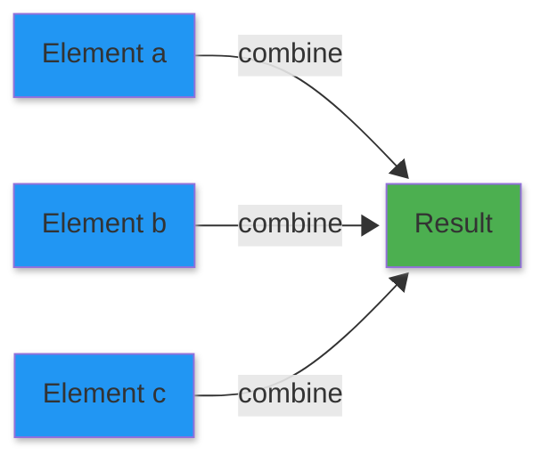
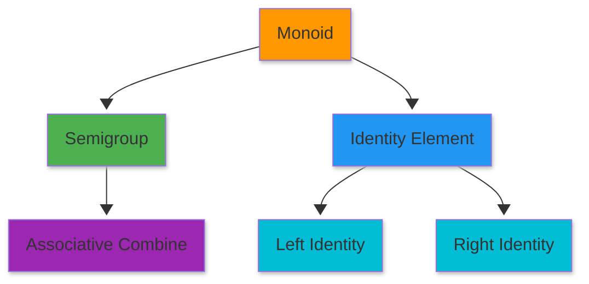
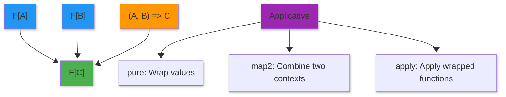
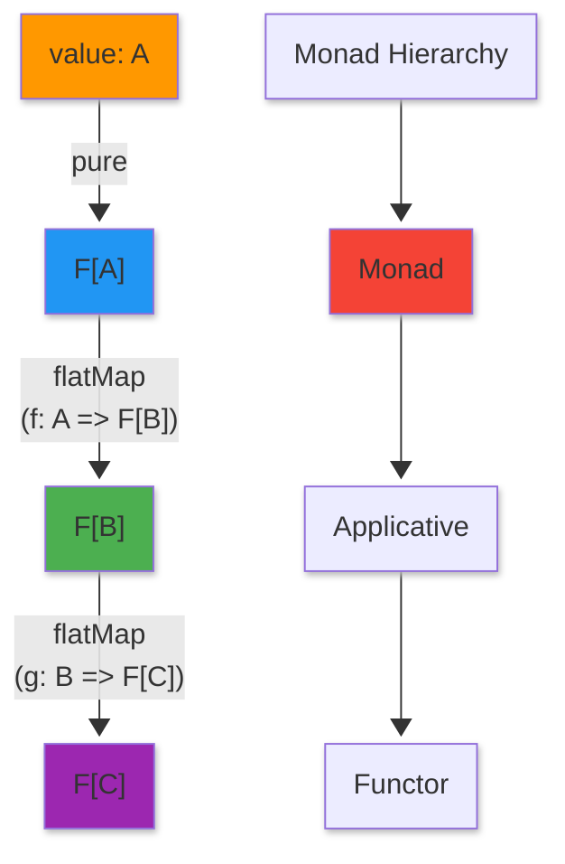

<style>
/* Styles for the two-column layout */
.image-text-container {
    display: flex; /* Enables flexbox */
    flex-wrap: wrap; /* Allows columns to stack on small screens */
    gap: 20px; /* Space between the image and text */
    align-items: center; /* Vertically centers content in columns */
    margin-bottom: 20px; /* Space below this section */
}

.image-column {
    flex: 1; /* Allows this column to grow */
    min-width: 250px; /* Minimum width for the image column before stacking */
    max-width: 40%; /* Maximum width for the image column to not take up too much space initially */
    box-sizing: border-box; /* Include padding/border in element's total width/height */
}

.text-column {
    flex: 2; /* Allows this column to grow more (e.g., twice as much as image-column) */
    min-width: 300px; /* Minimum width for the text column before stacking */
    box-sizing: border-box;
}

</style>

<div class="image-text-container">
    <div class="image-column">
        
    </div>
    <div class="text-column">
<p>Master the foundation of modern Scala development by exploring five essential functional programming abstractions. This guide takes a deep dive into algebraic structures, starting with <b>Semigroup</b> and <b>Monoid</b> for combining values. It progresses to type constructors, explaining how <b>Functors</b> transform wrapped data, <b>Applicatives</b> combine independent contexts, and <b>Monads</b> sequence dependent computations. By understanding these core patterns, developers can write more polymorphic, composable, and algebraically sound Scala code that works across diverse data types.</p>
    </div>
</div>

<!--more-->

------

* TOC
{:toc}
------

## Introduction

These five abstractions form the foundation of functional programming. They represent purely algebraic structures defined only by their operations and the laws governing them. Understanding these concepts allows you to:

- **Recognize patterns** across different problem domains
- **Write polymorphic code** that works with many data types
- **Reason algebraically** about program behavior
- **Compose operations** to build complex functionality from simple pieces

> These abstractions are discovered, not invented. They emerge naturally from observing common patterns in our code.[^1]

---

## Semigroup

A **Semigroup** is the simplest algebraic structure: a type with an associative binary operation. It captures the essence of "combining" things together where the order of grouping doesn't matter.[^2]

### Intuition

Think about combining elements in everyday life:

- **String concatenation**: `"Hello" + " " + "World"`
- **Adding numbers**: `1 + 2 + 3`
- **Merging lists**: `List(1,2) ++ List(3,4) ++ List(5,6)`

In all these cases, you can group operations in any order:
- `(a + b) + c` produces the same result as `a + (b + c)`

This property is called **associativity**, and it's what makes a Semigroup useful for parallel computation.[^3]



**Diagram Explanation**: Elements combine together using the binary operation, and the grouping order doesn't affect the final result.

**Formal Definition**: A semigroup consists of:
- A set $S$ (in Scala, this is a type `A`)
- A binary operation $\bullet: S \times S \to S$ (written as `combine` in Scala)

Type Class Definition[^4]:


```scala
trait Semigroup[A] {
    // Associative binary operation
    def combine(first:A, second:A): A
}
```


    defined trait Semigroup


Example📝[^4] for `Semigroup` for String concatenation:


```scala
// The implicit val declaration makes this Semigroup instance automatically available 
// whenever a Semigroup[String] is needed, without explicitly importing/passing it
// It allows String concatenation to work with Semigroup operations automatically
// The compiler will use this implicit value to resolve Semigroup[String] requirements

implicit val stringSemigroup: Semigroup[String] = new Semigroup[String] {
    def combine(first: String, second:String): String = first + second
}
```


    stringSemigroup: Semigroup[String] = ammonite.$sess.cmd1$Helper$$anon$1@3d09f387


```scala
// Example using stringSemigroup to combine two strings
val result = stringSemigroup.combine("Hello", " world!")
```


    result: String = "Hello world!"


Example📝[^4] for `Semigroup` for integer addition:


```scala
implicit val initSemigroup: Semigroup[Int] = new Semigroup[Int] {
    def combine(first: Int, second: Int): Int = first + second
}
```


    initSemigroup: Semigroup[Int] = ammonite.$sess.cmd3$Helper$$anon$1@4d35f028


```scala
initSemigroup.combine(1,2)
```


    res4: Int = 3


### Associativity Law 

For all elements $a, b, c \in S$:

$$
(a \bullet b) \bullet c = a \bullet (b \bullet c)
$$

**Translation**: $\bullet$ means "combine". The equation says that combining $a$ and $b$ first, then combining the result with $c$, gives the same answer as combining $a$ with the result of combining $b$ and $c$.


```scala
def verifyAssociativity[A] (a: A, b: A, c: A)(implicit sg: Semigroup[A]): Boolean = {
    val leftGrouped = sg.combine(sg.combine(a ,b) ,c)
    val rightGrouped = sg.combine(a, sg.combine(b ,c))
    leftGrouped == rightGrouped                              
}

```


    defined function verifyAssociativity


The implicit parameter `sg: Semigroup[A]` means that this method requires a Semigroup instance for type `A`. The `implicit` keyword allows the compiler to automatically find and pass a `Semigroup[A]` value that is in scope when this method is called `Semigroup` is a type class that provides a combine operation for values of type `A`.


```scala
verifyAssociativity(1,2,3)
```


    res6: Boolean = true


> - Not all operations are associative. Integer subtraction is NOT[^5] a semigroup, for example.
> - Semigroups don't require commutativity. String concatenation is associative but NOT commutative.
{:.yellow}

## Monoid

The name monoid comes from mathematics. In category theory, it means a category with one object.

### Overview

A **Monoid** extends Semigroup by adding an identity element (also called "unit" or "zero"). It's like having a "neutral" value that doesn't change things when combined.[^6]

### Intuition

Think of identity elements in everyday operations:

- **Addition**: 0 is the identity → `5 + 0 = 5`
- **Multiplication**: 1 is the identity → `5 * 1 = 5`
- **String concatenation**: `""` (empty string) is the identity → `"Hello" + "" = "Hello"`
- **List concatenation**: `List()` is the identity → `List(1,2) ++ List() = List(1,2)`

The identity element is like a "do nothing" value that acts as a starting point for combining elements.[^7]



A Monoid consists of a Semigroup (associative combine operation) plus an identity element that satisfies left and right identity laws.

**Formal Definition**: A monoid $(M, \bullet, e)$ consists of:
- A set $M$ (type `A` in Scala)
- A binary operation $\bullet: M \times M \to M$ (the `combine` from Semigroup)
- An identity element $e \in M$ (called `empty` in Scala)

**Monoid Laws**:

**1. Associativity** (inherited from Semigroup):
$$
(a \bullet b) \bullet c = a \bullet (b \bullet c)
$$

**2. Left Identity**:
$$
e \bullet a = a
$$

**Translation**: Combining the identity element $e$ with any element $a$ (from the left) returns $a$ unchanged.

**3. Right Identity**:
$$
a \bullet e = a
$$

> Combining any element $a$ with the identity element $e$ (from the right) returns $a$ unchanged.


Monoid extends Semigroup and adds an identity element


```scala
trait Semigroup[A] {
  def combine(first: A, second: A): A
}

trait Monoid[A] extends Semigroup[A] {
    def empty: A // The identity element that leaves other elements unchanged
}
```


    defined trait Semigroup
    defined trait Monoid


Example 📝[^8] integer addition Monoid:


```scala
implicit val intAddMonoid: Monoid[Int] = new Monoid[Int] {
    def combine(first: Int, second: Int): Int = (first + second)
    def empty: Int = 0
}
```


    intAddMonoid: Monoid[Int] = ammonite.$sess.cmd1$Helper$$anon$1@50c48694


some example Monoid additions:


```scala
intAddMonoid.combine(1,0)
intAddMonoid.combine(0,1)
intAddMonoid.combine(1,2)
```


    res9_0: Int = 1
    res9_1: Int = 1
    res9_2: Int = 3


String Monoid example


```scala
implicit val strContactMonoid: Monoid[String] = new Monoid[String] {
    def combine(first: String, second: String) = first + second 
    def empty: String = ""
}
```


    strContactMonoid: Monoid[String] = ammonite.$sess.cmd2$Helper$$anon$1@12fda1b6


String examples are:


```scala
strContactMonoid.combine("Hello", " World")
strContactMonoid.combine(strContactMonoid.empty, "Hello")
strContactMonoid.combine("Hello", strContactMonoid.empty)
```


    res11_0: String = "Hello World"
    res11_1: String = "Hello"
    res11_2: String = "Hello"


List concatenation monoid:


```scala
implicit def listMonoid[A]: Monoid[List[A]] = new Monoid[List[A]] {
    def combine(first: List[A], second: List[A]) : List[A] = first ++ second
    def empty: List[A] = List.empty[A]
}
```


    defined function listMonoid


example:


```scala
listMonoid.combine(List(1,2), List(3,4))
```


    res13: List[Int] = List(1, 2, 3, 4)


Verify monoid laws:


```scala
listMonoid.combine(List(1,2), List.empty[Int]) == List(1,2) // Test left identity
listMonoid.combine(List.empty[Int] ,List(1,2)) == List(1,2) // Test right identity
```


    res14_0: Boolean = true
    res14_1: Boolean = true


Test associativity:
$$
(a \bullet b) \bullet c = a \bullet (b \bullet c)
$$


```scala
val a:List[Int] = List[Int](1,2)
listMonoid.combine(listMonoid.combine(a, List.empty[Int]), List.empty[Int]) == 
     listMonoid.combine(List.empty[Int] ,listMonoid.combine(a, List.empty[Int]))
```


    a: List[Int] = List(1, 2)
    res15_1: Boolean = true


### Use of Monoid
Monoids are perfect for folding/reducing collections because the identity element provides a natural starting point.

Here the fold left/right:

```scala
def foldRight[B](z: B)(f: (A, B) => B): B
def foldLeft[B](z: B)(f: (B, A) => B): B
```

According to associativity and identity laws, the output of the fold left or right should be the same:


```scala
def foldLeftWithMonoid[A](elements: List[A])(implicit monoid: Monoid[A]): A = {
  elements.foldLeft(monoid.empty) { (accumulator, currentElement) =>
    monoid.combine(accumulator, currentElement)
  }
}

// Sum a list of integers
foldLeftWithMonoid(List(1, 2, 3, 4, 5))  // Returns: 15

// Concatenate strings
foldLeftWithMonoid(List("Hello", " ", "World"))  // Returns: "Hello World"

// Works with empty lists too!
foldLeftWithMonoid(List.empty[Int])  // Returns: 0 (the identity element)
```


    defined function foldLeftWithMonoid
    res3_1: Int = 15
    res3_2: String = "Hello World"
    res3_3: Int = 0


The output of the above is the same as the following:


```scala
def foldRightWithMonoid[A](elements: List[A])(implicit monoid: Monoid[A]): A = {
  elements.foldRight(monoid.empty) { (accumulator, currentElement) =>
    monoid.combine(accumulator, currentElement)
  }
}

// Sum a list of integers
foldRightWithMonoid(List(1, 2, 3, 4, 5))  // Returns: 15

// Concatenate strings
foldRightWithMonoid(List("Hello", " ", "World"))  // Returns: "Hello World"

// Works with empty lists too!
foldRightWithMonoid(List.empty[Int])  // Returns: 0 (the identity element)
```


    defined function foldRightWithMonoid
    res17_1: Int = 15
    res17_2: String = "Hello World"
    res17_3: Int = 0


#### The Implicit Parameter

Here's the key part. In `foldLeftWithMonoid`, the parameter `implicit monoid: Monoid[A]` means:

"This function accepts a `Monoid[A]`, but I don't want the caller to pass it explicitly. Scala, look around in scope and find an `implicit` value of type `Monoid[A]` for me automatically."

So when you call `foldLeftWithMonoid(List(1, 2, 3, 4, 5))`, here's what happens:

1.  Scala infers the type parameter `A` is `Int` (from the list contents)
2.  Scala looks for an `implicit Monoid[Int]` in scope
3.  It finds `intAddMonoid` and uses it automatically
4.  The function folds left: `0 + 1 + 2 + 3 + 4 + 5 = 15`

With `List("Hello", " ", "World")`, Scala finds `strConcatMonoid` (for `Monoid[String]`) and uses that instead.

#### Why This Is Elegant

Without `implicit`, you'd have to call `foldLeftWithMonoid(List(1, 2, 3))(intAddMonoid)` every time for the Integer list. The `implicit` mechanism lets the same function work with any type that has a `Monoid` instance, and the right instance is automatically selected based on the data type. It's dependency injection built into the language, enabling genuinely polymorphic code while keeping call sites clean.


### Parallel Computation with Identity
Split work across multiple threads. Each thread can start with the identity element. For example 📝[^10]:


```scala
def parallelReduce[A](elements: List[A])(implicit monoid: Monoid[A]): A = {
  if (elements.length <= 1) {
    elements.headOption.getOrElse(monoid.empty)
  } else {
    // balanced fold
    val (leftHalf, rightHalf) = elements.splitAt(elements.length / 2)
    
    // Each half starts from identity and combines
    val leftResult = parallelReduce(leftHalf)
    val rightResult = parallelReduce(rightHalf)
    
    monoid.combine(leftResult, rightResult)
  }
}
```


    defined function parallelReduce


#### Common Pitfalls

**❌ No Valid Identity Element**: 

Some semigroups cannot be monoids. Example: positive integers with multiplication have an identity (1), but non-empty lists don't have an identity element.[^12]

**❌ Multiple Possible Identities**: 

For a given type and operation, there should be only ONE identity element

> Integer addition: only 0 is the identity. Integer multiplication: only 1 is the identity. These are DIFFERENT monoids on the same type!

## Functor

### Overview

A **Functor** is a type constructor `F[_]` (like `List`, `Option`, `Future`) that supports a `map` operation. Functors let you apply a function to values inside a "container" or "context" without manually extracting and wrapping values.[^13] Example:

```scala
trait Foldable[F[_]] {
  def foldRight[A,B](as: F[A])(z: B)(f: (A,B) => B): B
  def foldLeft[A,B](as: F[A])(z: B)(f: (B,A) => B): B
  def foldMap[A,B](as: F[A])(f: A => B)(mb: Monoid[B]): B
  def concatenate[A](as: F[A])(m: Monoid[A]): A =
    foldLeft(as)(m.zero)(m.op)
}
```

Here we're abstracting over a type constructor `F`. We write it as `F[_]`, where the underscore indicates that F is not a type but a type constructor that takes one type argument. Just like functions that take other functions as arguments are called higher-order functions, above `Foldable` is a *higher-order type constructor* or a *higher-kinded* type.

Functors are well explained in my post [Scala 2 Functors explained](){:target="_blank"}.

**Example**:
The `distribute` method is automatically provided by composing `map` with the projection functions (`_._1` and `_._2`), demonstrating a useful property derived from the core `map` function.

The `Functor` trait is a type class that defines a basic capability: the ability to apply a function inside a generic container type.

- `F[_]` (Higher-Kinded Type): This means the `Functor` trait works with any type constructor `F` that takes a single type parameter. Examples include `List`, `Option`, or `Future`.

- `map` Method: This is the heart of the Functor. It takes a container of type `F[A]` and a function `f: A => B`. It applies `f` to every element inside the container and returns a new container `F[B]`. This operation lifts the function `f` into the context `F`.

- `distribute` Method: This method is derived automatically (a freebie!) from the `map` method.
    - It takes a container of tuples, `F[(A, B)` (e.g., a `List` of tuples).
    - It uses two `map` calls: one to extract all the first elements (`_._1`) into an `F[A]`, and one to extract all the second elements (`_._2`) into an `F[B]`.
    - It effectively splits a container of pairs into a pair of containers: `(F[A], F[B])`.


```scala
// Define the Functor trait as provided in the prompt.
trait Functor[F[_]] {
  def map[A,B](fa: F[A])(f: A => B): F[B]
  
  // The 'distribute' method is automatically derived from 'map'
  def distribute[A,B](fab: F[(A, B)]): (F[A], F[B]) = (map(fab)(_._1), map(fab)(_._2)) // 🤗
}
```


    defined trait Functor


To make the `Functor` trait useful, we need to create a specific implementation (an "instance") for a concrete container type, in this case, `List`.


```scala
implicit val listFunctor: Functor[List] = new Functor[List] {
// F is List, so fa is List[A] and the result is List[B]
override def map[A, B](fa: List[A])(f: A => B): List[B] = fa.map(f) 
}
```


    listFunctor: Functor[List] = ammonite.$sess.cmd1$Helper$$anon$1@3db44283


- `implicit val listFunctor`: The use of `implicit` makes this instance available to the Scala compiler. When the compiler sees a function that requires a `Functor[List]`, it can automatically fetch this value.
- Implementation Detail: Since `List` already has a built-in `map` method with the exact required signature, the implementation is trivial: we simply delegate to the existing `List.map(f)`. This shows that any type with a compatible `map` method is a Functor.

The following section shows the standard usage of mapping a transformation over the container.


```scala
// We can access the implicit listFunctor instance via its type
val F = listFunctor

// ----------------------------------------------------
// 2. Demonstration of `map`
// ----------------------------------------------------

val sourceList = List(1, 2, 3, 4, 5)
val timesTwo: Int => Int = x => x * 2

// Apply the Functor's map method
val mappedList = F.map(sourceList)(timesTwo)

println(s"Original List: $sourceList")
println(s"Mapping (x => x * 2): $mappedList")
// Expected Output: List(2, 4, 6, 8, 10)
```

    Original List: List(1, 2, 3, 4, 5)
    Mapping (x => x * 2): List(2, 4, 6, 8, 10)


    F: Functor[List] = ammonite.$sess.cmd1$Helper$$anon$1@3db44283
    sourceList: List[Int] = List(1, 2, 3, 4, 5)
    timesTwo: Int => Int = ammonite.$sess.cmd2$Helper$$Lambda$2095/0x000000012f7cc208@283b11cc
    mappedList: List[Int] = List(2, 4, 6, 8, 10)


Here, the `listFunctor` (`F`) takes the `sourceList` and the `timesTwo` function, applies the function element-wise, and correctly produces a new list with the doubled values.

Let us see how to use the `distribute` function: 🤗


```scala
// ----------------------------------------------------
// 3. Demonstration of `distribute`
// ----------------------------------------------------

// Create a list of tuples (F[(A, B)])
val pairedData: List[(String, Int)] = List(
  ("Apple", 10),
  ("Banana", 20),
  ("Cherry", 30)
)

// Apply the Functor's distribute method.
// It takes the List[(A, B)] and returns (List[A], List[B])
val (names, counts) = F.distribute(pairedData)

```


    pairedData: List[(String, Int)] = List(
      ("Apple", 10),
      ("Banana", 20),
      ("Cherry", 30)
    )
    names: List[String] = List("Apple", "Banana", "Cherry")
    counts: List[Int] = List(10, 20, 30)


As shown in the above:

Input: `pairedData` is a `List[(String, Int)]`, which corresponds to `F[(A, B)]` where `F` is `List`, `A` is `String`, and `B` is `Int`.

Mechanism: Internally, distribute uses map twice:

1. `map(pairedData)(_._1)`: Creates the `List[String] (F[A])`.
2. `map(pairedData)(_._2)`: Creates the `List[Int] (F[B])`.

- Output: The result is a tuple of two lists: `(List[String], List[Int])`, which corresponds to `(F[A], F[B])`. This is often useful when you receive combined data and need to separate it into parallel columns or streams.

**Verifying Functor Laws**: For example📝[^15]

**1. Identity Law**: Mapping with the identity function returns the structure unchanged.
$$
\text{map}(x)(\text{id}) = x
$$

where $\text{id}(a) = a$ for all $a$.

**Translation**: `someList.map(x => x) == someList`

**2. Composition Law**: Mapping with two composed functions is the same as mapping twice.

$$
\text{map}(x)(g \circ f) = \text{map}(\text{map}(x)(f))(g)
$$

where $(g \circ f)(x) = g(f(x))$ means "apply $f$ first, then apply $g$".


```scala
def verifyFunctorIdentityLaw[F[_], A](fa: F[A])(implicit functor: Functor[F]): Boolean = {
  // Identity function
  def identity[X](x: X): X = x
  
  // map with identity should equal the original
  functor.map(fa)(identity) == fa
}

def verifyFunctorCompositionLaw[F[_], A, B, C](
  fa: F[A]
)(
  f: A => B, 
  g: B => C
)(implicit functor: Functor[F]): Boolean = {
  
  // Compose functions
  def composed(a: A): C = g(f(a))
  
  // map(map(fa)(f))(g) should equal map(fa)(g ∘ f)
  val leftSide = functor.map(functor.map(fa)(f))(g)
  val rightSide = functor.map(fa)(composed)
  
  leftSide == rightSide
}
```


    defined function verifyFunctorIdentityLaw
    defined function verifyFunctorCompositionLaw


**Example**:Option Functor:


```scala
trait Functor[F[_]] {
  def map[A,B](fa: F[A])(f: A => B): F[B]
}

val optFunctor: Functor[Option] = new Functor[Option] { //anonymous cls
    def map[A, B](a: Option[A])(f: A => B): Option[B] = a match {
        case None => None
        case Some(v) => Some(f(v))
    }
}
```


    defined trait Functor
    optFunctor: Functor[Option] = ammonite.$sess.cmd0$Helper$$anon$1@21586c94


Test the above:


```scala
optFunctor.map(Some(3))(n => n *2)
```


    res1: Option[Int] = Some(value = 6)


**Example**: Function Functor:

Functions can be functors too! This is one of the most mind-bending examples:


```scala
trait Functor[F[_]] {
  def map[A, B](fa: F[A])(f: A => B): F[B]
}

// FunFunctor[I] creates a Functor instance for function types `I => _`
def FunFunctor[I]: Functor[({type L[X] = I => X})#L] = new Functor[({type L[X] = I => X})#L] { // ✔️
    //map takes a function `g: I => A` and composes it with `f: A => B`
    def map[A, B](g: I => A)(f: A => B): I => B = {
      (input: I) => f(g(input))
    }
  }

```


    defined trait Functor
    defined function FunFunctor


✔️ To *function type parameterised by the return type*, in Scala 2, `Functor[({type L[X] = I => X})#L]` can be written as `Functor[I => *]` in Scala 3.

Test it:


```scala
// Test it
val addOne: Int => Int = _ + 1
val intToString: Int => String = _.toString

val functor = FunFunctor[Int]
val composed = functor.map(addOne)(intToString)
composed(5)
```


    addOne: Int => Int = ammonite.$sess.cmd7$Helper$$Lambda$2490/0x000000012883ca08@2acc74a3
    intToString: Int => String = ammonite.$sess.cmd7$Helper$$Lambda$2491/0x000000012883c400@38a26a37
    functor: Functor[[X]Int => X] = ammonite.$sess.cmd4$Helper$$anon$1@2becf695
    composed: Int => String = ammonite.$sess.cmd4$Helper$$anon$1$$Lambda$2479/0x000000012883e220@4d95772
    res7_4: String = "6"


```scala
Same as above
```


```scala
val f1 = FunFunctor[String].map(_.toInt + 2)(_ * 3.1)
f1("5")
```


    f1: String => Double = ammonite.$sess.cmd4$Helper$$anon$1$$Lambda$2479/0x000000012883e220@3cee1dd7
    res25_1: Double = 21.7


### Lifting function examples
Functors let you **lift**[^18] ordinary functions to work with containers:


```scala
trait Functor[F[_]] {
    def map[A, B](fa: F[A])(f: A => B): F[B]
}

// Implicit Functor instance for Option
implicit val optionFunctor: Functor[Option] = new Functor[Option] {
    def map[A, B](fa: Option[A])(f: A => B): Option[B] = fa.map(f)
}

// Lifting function
def lift[F[_], A, B](f: A => B)(implicit functor: Functor[F]): F[A] => F[B] = {
    c => functor.map(c)(f)
}

```


    defined trait Functor
    optionFunctor: Functor[Option] = ammonite.$sess.cmd0$Helper$$anon$1@6632212a
    defined function lift


Examples for the lifting function:


```scala
// Lift a simple function to work with Options
val addFive: Int => Int = _ + 5
val addFiveToOption: Option[Int] => Option[Int] = lift(addFive)

addFiveToOption(Some(10))  // Some(15)
addFiveToOption(None)      // None
```


    addFive: Int => Int = ammonite.$sess.cmd1$Helper$$Lambda$2063/0x00000001297c0418@3e26e549
    addFiveToOption: Option[Int] => Option[Int] = ammonite.$sess.cmd0$Helper$$Lambda$2064/0x00000001297c0800@696bf759
    res1_2: Option[Int] = Some(value = 15)
    res1_3: Option[Int] = None


Alternative: Using a companion object
For better organisation, you could also place implicit instances in the Functor companion object:


```scala
trait Functor[F[_]] {
    def map[A, B](fa: F[A])(f: A => B): F[B]
}

// provide an implementation of Functor for Option.
object Functor {
    // Implicit Functor instance for Option
    implicit val optionFunctor: Functor[Option] = new Functor[Option] {
      def map[A, B](fa: Option[A])(f: A => B): Option[B] = fa.map(f)
    }
}

// Rest of the code remains the same

// Lifting function
def lift[F[_], A, B](f: A => B)(implicit functor: Functor[F]): F[A] => F[B] = {
    c => functor.map(c)(f)
}
val addFive: Int => Int = _ + 5
val addFiveToOption: Option[Int] => Option[Int] = lift(addFive)

// Lift a simple function to work with Options
addFiveToOption(Some(10))  // Some(15)
addFiveToOption(None)      // None

```


    defined trait Functor
    defined object Functor
    defined function lift
    addFive: Int => Int = ammonite.$sess.cmd0$Helper$$Lambda$2022/0x00000001327a8620@62d39784
    addFiveToOption: Option[Int] => Option[Int] = ammonite.$sess.cmd0$Helper$$Lambda$2023/0x00000001327ab220@935ddf5
    res0_5: Option[Int] = Some(value = 15)
    res0_6: Option[Int] = None


> Functor isn’t too compelling, as there aren’t many useful operations that can be defined purely in terms of map. 

## Applicative

### Overview

An **Applicative Functor** (or just "Applicative") extends Functor with the ability to:

1. Wrap a pure value in a context (`pure`)
2. Apply functions that are *themselves* in a context (`ap`)

Applicative functors are less powerful than monads, but more general (and hence more common). Think of it as a Functor with "superpowers" for combining multiple independent effects.[^20]

With Applicative, you can combine multiple **independent** computations. You don't need the result of one to determine the next (unlike Monad).[^21]



Applicative combines multiple independent contexts using a function, producing a result in a combined context. Imagine you're a chef with ingredients in different boxes:

- **Functor**: You can transform one ingredient at a time
    - `map(sugar)(addSpice)` → spiced sugar

- **Applicative**: You can combine multiple ingredients using a recipe (function)
    - You have: `F[Sugar]`, `F[Flour]`, `F[Eggs]`
    - Recipe: `(sugar, flour, eggs) => Cake`
    - Applicative lets you combine them: `F[Cake]`

### Applicative Mathematics

**Formal Definition**: An applicative functor consists of:

1. A type constructor $F: \text{Type} \to \text{Type}$

2. Operations:
   - $\text{pure}: A \to F[A]$ — wraps a pure value in the context
   - $\text{map2}: (F[A], F[B], (A, B) \to C) \to F[C]$ — combines two contexts
   - Alternatively: $\text{ap}: F[A \to B] \to F[A] \to F[B]$ — applies a wrapped function

**Mathematical Notation for ap**:

$$
\text{ap}: F[A \to B] \times F[A] \to F[B]
$$

**Translation**: `ap` takes a function wrapped in context $F$ and a value wrapped in context $F$, and produces a result wrapped in $F$.[^22]

**Applicative Laws**:

**1. Identity Law**: Applying the identity function wrapped in $F$ does nothing.

$$
\text{ap}(\text{pure}(\text{id}))(v) = v
$$

**2. Homomorphism Law**: Wrapping and then applying is the same as applying then wrapping.

$$
\text{ap}(\text{pure}(f))(\text{pure}(x)) = \text{pure}(f(x))
$$

**3. Interchange Law**: Order of applying functions doesn't matter.

$$
\text{ap}(u)(\text{pure}(y)) = \text{ap}(\text{pure}(f \mapsto f(y)))(u)
$$

**4. Composition Law**: Composing applications is the same as applying compositions.

$$
\text{ap}(\text{ap}(\text{ap}(\text{pure}(\text{compose}))(u))(v))(w) = \text{ap}(u)(\text{ap}(v)(w))
$$

where $\text{compose}(f)(g)(x) = f(g(x))$.[^23]

### Scala Implementation

**Type Class Definition**:[^24]

## Monad

### Overview

A **Monad** is the most powerful of these abstractions. It extends Applicative with the ability to sequence computations where each step can depend on the results of previous steps. The key operation is [flatMap](#flatmap){:target="_blank"} (also called **bind** or `>>=`).[^30]

> With Monad, later computations can depend on earlier results. This is more powerful than Applicative but also more restrictive (monads don't compose as nicely).[^31]
{:.yellow}



Monads sequence dependent computations. Each step produces a context `F[_]`, and `flatMap` chains them together. Every Monad is also an Applicative and Functor. Let you sequence operations with custom behaviour:

- **Option Monad**: Stop on first `None` (short-circuit on failure)
- **List Monad**: Generate all combinations (non-deterministic computation)
- **Future Monad**: Wait for async results (sequencing async operations)
- **State Monad**: Thread state through computations

**Formal Definition**: A monad consists of:

1. A type constructor $M: \text{Type} \to \text{Type}$
   Wraps a plain value into the monadic context
2. Two operations:
   - $\text{pure}: A \to M[A]$ — wrap a value (also called `unit` or `return`)  
     Signature: `def unit[A](a: => A): F[A]`
   - $\text{flatMap}: M[A] \times (A \to M[B]) \to M[B]$ — sequence computations  
     Signature: `def flatMap[A,B](fa: F[A])(f: A => F[B]): F[B]`
     

**Alternative Definition using join**:

A monad can also be defined with:
- $\text{pure}: A \to M[A]$
- $\text{join}: M[M[A]] \to M[A]$ — flatten nested contexts
- $\text{map}: M[A] \times (A \to B) \to M[B]$ — from Functor

The two definitions are equivalent:
$$
\text{flatMap}(ma)(f) = \text{join}(\text{map}(ma)(f))
$$
$$
\text{join}(mma) = \text{flatMap}(mma)(\text{id})
$$

**Category Theory Foundation**:

In category theory, a monad $(T, \eta, \mu)$ on a category $\mathcal{C}$ consists of:
- An endofunctor $T: \mathcal{C} \to \mathcal{C}$ (the type constructor)
- A natural transformation $\eta: \text{Id} \to T$ (pure/unit)
- A natural transformation $\mu: T \circ T \to T$ (join)

**Translation**: In Scala, $T$ is our type constructor like `Option[_]` or `List[_]`, $\eta$ is `pure`, and $\mu$ is `join`.[^32]

#### Monadic Combinators

**Definition**: Combinators are functions that work generically across any monad `F[_]`, abstracting common patterns for combining and transforming monadic values.

**Key monadic combinators**:

-   **`sequence`**: Convert `List[F[A]]` to `F[List[A]]` — flip a list of effects into an effect containing a list
-   **`traverse`**: Apply a function `A => F[B]` to each element and collect results — `map` followed by `sequence`
-   **`replicateM`**: Repeat a monadic computation `n` times and collect results
-   **`filterM`**: Filter with a monadic predicate `A => F[Boolean]`
-   **`map2`**: Combine two monadic values with a binary function
-   **`product`**: Combine two monadic values into a tuple

These functions are implemented once in the `Monad` trait and inherited by all monadic types.

#### Monadic Types

**Definition**: Types that provide `flatMap` and `unit` operations, satisfying the monad laws.

**Common monadic types in Scala**:

| Type | Context/Meaning | Example |
|------|----------------|---------|
| `Option[A]` | Computation may fail (no error message) | `Some(5)`, `None` |
| `Either[E, A]` | Computation may fail with error message | `Right(5)`, `Left("error")` |
| `Try[A]` | Exception handling | `Success(5)`, `Failure(exception)` |
| `List[A]` | Non-determinism (multiple results) | `List(1, 2, 3)` |
| `Future[A]` | Asynchronous computation | `Future { computation }` |
| `State[S, A]` | Stateful computation | `State(s => (value, newState))` |
| `Par[A]` | Parallel computation | For parallel execution |
| `Parser[A]` | Parsing input | Sequential parsing operations |


**Monad Laws**:

**1. Left Identity**: Wrapping a value and then flatMapping is the same as just applying the function.

$$
\text{flatMap}(\text{pure}(a))(f) = f(a)
$$

**Translation**: `Option(x).flatMap(f) == f(x)`

**2. Right Identity**: flatMapping with pure does nothing.

$$
\text{flatMap}(m)(\text{pure}) = m
$$

**Translation**: `m.flatMap(x => Option(x)) == m`

**3. Associativity**: The order of nesting flatMaps doesn't matter.

$$
\text{flatMap}(\text{flatMap}(m)(f))(g) = \text{flatMap}(m)(x \Rightarrow \text{flatMap}(f(x))(g))
$$

**Translation**: `m.flatMap(f).flatMap(g) == m.flatMap(x => f(x).flatMap(g))`[^33]

### Scala Implementation


```scala
trait Functor[F[_]] {
  def map[A, B](fa: F[A])(f: A => B): F[B]
}

trait Applicative[F[_]] extends Functor[F] {
  def pure[A](value: A): F[A]
  def map2[A, B, C](fa: F[A], fb: F[B])(f: (A, B) => C): F[C]
}

// Monad extends Applicative
trait Monad[F[_]] extends Applicative[F] {
  // The key operation: sequence dependent computations
  def flatMap[A, B](fa: F[A])(f: A => F[B]): F[B]
  
  // join can be implemented using flatMap
  // def join[A](nestedContext: F[F[A]]): F[A] = {
  //   flatMap(nestedContext)(innerContext => innerContext)
  // }
  
  // map can be implemented using flatMap and pure
  override def map[A, B](fa: F[A])(f: A => B): F[B] = {
    flatMap(fa)(a => pure(f(a)))
  }
  
  // map2 can be implemented using flatMap
  override def map2[A, B, C](fa: F[A], fb: F[B])(f: (A, B) => C): F[C] = {
    flatMap(fa) { a =>
      map(fb) { b =>
        f(a, b)
      }
    }
  }
}
```


    defined trait Functor
    defined trait Applicative
    defined trait Monad


```scala
implicit val listMonad: Monad[List] = new Monad[List] {
  def pure[A](value: A): List[A] = List(value)
  
  def flatMap[A, B](fa: List[A])(f: A => List[B]): List[B] = 
    fa.flatMap(f)
}

// Usage: Generate all combinations
val sizes = List("S", "M", "L")
val colors = List("Red", "Blue", "Green")

val products = listMonad.flatMap(sizes) { size =>
  listMonad.map(colors) { color =>
    s"$color $size T-Shirt"
  }
}
```


    listMonad: Monad[List] = ammonite.$sess.cmd2$Helper$$anon$1@220ae3d8
    sizes: List[String] = List("S", "M", "L")
    colors: List[String] = List("Red", "Blue", "Green")
    products: List[String] = List(
      "Red S T-Shirt",
      "Blue S T-Shirt",
      "Green S T-Shirt",
      "Red M T-Shirt",
      "Blue M T-Shirt",
      "Green M T-Shirt",
      "Red L T-Shirt",
      "Blue L T-Shirt",
      "Green L T-Shirt"
    )


```scala
trait Functor[F[_]] {
    def map[A, B](fa: F[A])(f: A => B): F[B]
}

trait Monad[F[_]] extends Functor[F] {
    def unit[A](a: => A): F[A]
    def flatMap[A, B](ma: F[A])(f: A => F[B]): F[B]

    def map[A, B](ma: F[A])(f: A => B): F[B] = flatMap(ma)(a => unit(f(a)))
    def map[A, B, C](ma: F[A], mb: F[B])(f: (A, B) => C): F[C] = flatMap(ma)(a => map(mb)(b => f(a,b)))
}
```


    defined trait Functor
    defined trait Monad


## References


[^1]: *Functional Programming in Scala*, Ch. 10: "Monoids" - Introduction to purely algebraic structures
[^2]: *Scala with Cats*, Ch. 2: "Monoids and Semigroups" - Definition of Semigroup
[^3]: *Functional Programming in Scala*, Ch. 10.3: "Parallelism and Monoids" - Associativity enables parallel computation
[^4]: *Scala with Cats*, Ch. 2.2: "Definition of a Semigroup" - Scala implementation
[^5]: *Scala with Cats*, Ch. 2.1: "Definition of a Monoid" - Example of non-associative operation
[^6]: *Scala with Cats*, Ch. 2.1: "Definition of a Monoid" - Formal monoid definition
[^7]: *Functional Programming in Scala*, Ch. 10.1: "What is a monoid?" - Intuition and examples
[^8]: *Scala with Cats*, Ch. 2.1: "Definition of a Monoid" - Type class definition
[^9]: *Functional Programming in Scala*, Ch. 10.2: "Folding lists with monoids" - Practical folding applications
[^10]: *Functional Programming in Scala*, Ch. 10.3: "Parallelism and monoids" - Parallel reduction with monoids
[^11]: *Functional Programming in Scala*, Ch. 10.6.2: "Using composed monoids to fuse traversals" - Composing monoids
[^12]: *Scala with Cats*, Ch. 2.2: "Definition of a Semigroup" - NonEmptyList example
[^13]: *Functional Programming in Scala*, Ch. 11.1: "Functors: generalizing the map function" - Functor introduction
[^14]: *Category Theory for Programmers*, Ch. 7: "Functors" - Category theory foundation
[^15]: *Functional Programming in Scala*, Ch. 11.1.1: "Functor laws" - Identity and composition laws
[^16]: *Scala with Cats*, Ch. 3.3: "Definition of a Functor" - Type class definition
[^17]: *Programming Scala, Second Edition*, Ch. 16: "The Functor Category" - Function functor example
[^18]: *Functional Programming in Scala*, Ch. 11.1: "Functors" - Lifting functions
[^19]: *Functional Programming in Scala*, Ch. 11.1: "Functors" - distribute and codistribute examples
[^20]: *Functional Programming in Scala*, Ch. 12.2: "The Applicative trait" - Introduction to Applicative
[^21]: *Functional Programming in Scala*, Ch. 12.3: "The difference between monads and applicative functors" - Independence of effects
[^22]: *Functional Programming in Scala*, Ch. 12.2 (Exercise 12.2): "Alternative Applicative definition" - ap method
[^23]: *Functional Programming in Scala*, Ch. 12.5: "The applicative laws" - Formal law definitions
[^24]: *Functional Programming in Scala*, Ch. 12.2: "The Applicative trait" - Type class definition
[^25]: *Functional Programming in Scala*, Ch. 12.2 (Exercise 12.2): "apply method" - Alternative formulation
[^26]: *Functional Programming in Scala*, Ch. 12.2: "The Applicative trait" - Examples
[^27]: *Functional Programming in Scala*, Ch. 12.2 (Exercise 12.3): "map3 and map4" - Combining multiple values
[^28]: *Scala with Cats*, Ch. 6.4: "Parallel and Applicative" - Validation example
[^29]: *Functional Programming in Scala*, Ch. 12.5: "The applicative laws" - Law verification
[^30]: *Functional Programming in Scala*, Ch. 11.2: "Monads: generalizing the flatMap and unit functions" - Monad introduction
[^31]: *Functional Programming in Scala*, Ch. 12.3: "The difference between monads and applicative functors" - Monad vs Applicative
[^32]: *Category Theory for Programmers*, Ch. 22: "Monads" - Category theory definition
[^33]: *Functional Programming in Scala*, Ch. 11.4: "Monad laws" - Formal law definitions
[^34]: *Functional Programming in Scala*, Ch. 11.2: "The Monad trait" - Type class definition
[^35]: *Functional Programming in Scala*, Ch. 11.2 (Exercise 11.1): "Monad instances" - Option and List examples
[^36]: *Programming Scala, Second Edition*, Ch. 16: "The Monad Category" - For-comprehension desugaring
[^37]: *Functional Programming in Scala*, Ch. 11.2: "Monads" - Chaining dependent computations
[^38]: *Functional Programming in Scala*, Ch. 11.3: "The State monad" - State monad example
[^39]: *Scala with Cats*, Ch. 4: "Monads" - Error handling with Either
[^40]: *Scala with Cats*, Ch. 6.5.1: "The Hierarchy of Sequencing Type Classes" - Type class hierarchy

{:gtxt: .message color="green"}
{:ytxt: .message color="yellow"}
{:rtxt: .message color="red"}

