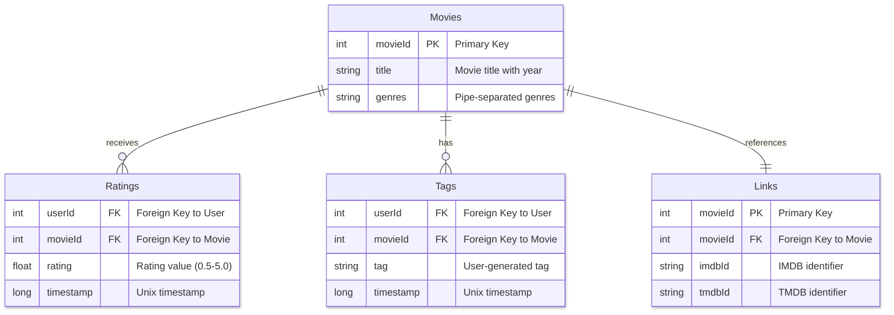
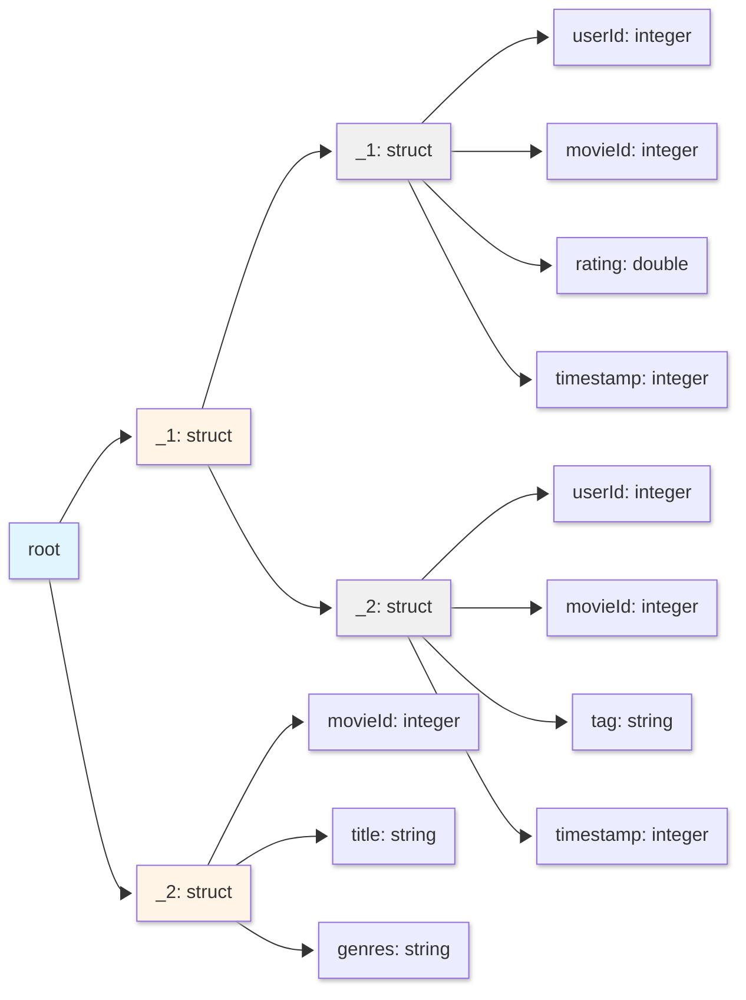

<style>
/* Styles for the two-column layout */
.image-text-container {
    display: flex; /* Enables flexbox */
    flex-wrap: wrap; /* Allows columns to stack on small screens */
    gap: 20px; /* Space between the image and text */
    align-items: center; /* Vertically centers content in columns */
    margin-bottom: 20px; /* Space below this section */
}

.image-column {
    flex: 1; /* Allows this column to grow */
    min-width: 250px; /* Minimum width for the image column before stacking */
    max-width: 40%; /* Maximum width for the image column to not take up too much space initially */
    box-sizing: border-box; /* Include padding/border in element's total width/height */
}

.text-column {
    flex: 2; /* Allows this column to grow more (e.g., twice as much as image-column) */
    min-width: 300px; /* Minimum width for the text column before stacking */
    box-sizing: border-box;
}

</style>

<div class="image-text-container">
    <div class="image-column">
        
    </div>
    <div class="text-column">
<p> Comprehensive technical guide to the Apache Spark Dataset API, defining it as a distributed collection that provides <b>type safety</b> while benefiting from the performance optimisations of the <b>Catalyst Optimiser</b>. It explains key internal mechanisms, such as <b>Encoders</b>, which manage the serialisation between domain-specific JVM objects and Spark’s internal binary format, using the MovieLens dataset to illustrate conceptual data entities. The text analyses fundamental transformations, including the functional <b>narrow transformations</b> like `map` and `flatMap`, and contrasts the standard, untyped `join` with the <b>type-safe</b> `joinWith` operation. Furthermore, the guide highlights significant performance considerations for wide transformations, noting that <b>groupByKey</b> requires a full data <b>shuffle</b> and lacks the map-side combine optimisation available in the standard DataFrame `groupBy`. Finally, the documentation scrutinises a physical query plan to detail how <b>Adaptive Query Execution (AQE)</b> dynamically optimises resource usage by adjusting partition sizes based on runtime statistics.</p>
    </div>
</div>

<!--more-->

------

* TOC
{:toc}
------


## Introduction

### What are Datasets?

Apache Spark Datasets are the foundational type in Spark's Structured APIs, providing a **type-safe**, distributed collection of strongly typed JVM objects. While DataFrames are Datasets of type `Row`, Datasets allow you to define custom domain-specific objects that each row will consist of, combining the benefits of RDDs (type safety, custom objects) with the optimizations of DataFrames (Catalyst optimizer, Tungsten execution).

**Key Characteristics:**

1. **Type Safety**: Compile-time type checking prevents runtime type errors
2. **Encoders**: Special serialization mechanism that maps domain-specific types to Spark's internal binary format
3. **Catalyst Optimization**: Benefits from Spark SQL's query optimizer
4. **JVM Language Feature**: Available only in Scala and Java (not Python or R)
5. **Functional API**: Supports functional transformations like `map`, `filter`, `flatMap`

**Dataset[T]**: A distributed collection of data elements of type `T`, where `T` is a domain-specific class (case class in Scala, JavaBean in Java) that Spark can encode and optimize.

$$
\text{Dataset}[T] = \{t_1, t_2, \ldots, t_n\} \text{ where } t_i \in T
$$

Translation: A Dataset of type T is a collection of n elements, where each element belongs to type T.

**Encoder[T]**: A mechanism that converts between JVM objects of type `T` and Spark SQL's internal binary format (InternalRow).

$$
\text{Encoder}[T]: T \leftrightarrow \text{InternalRow}
$$

Translation: An Encoder for type T provides bidirectional conversion between objects of type T and Spark's internal row representation.

### Mathematical Foundations

Datasets embody key functional programming concepts:

1. **Functor Laws** (for `map`):
    - Identity: `ds.map(x => x) = ds`
    - Composition: `ds.map(f).map(g) = ds.map(x => g(f(x)))`

2. **Monad Laws** (for `flatMap`):
    - Left identity: `Dataset(x).flatMap(f) = f(x)`
    - Right identity: `ds.flatMap(x => Dataset(x)) = ds`
    - Associativity: `ds.flatMap(f).flatMap(g) = ds.flatMap(x => f(x).flatMap(g))`

### Dataset Movie Lens

Let's examine the MovieLens dataset: [recommended for education and development](https://grouplens.org/datasets/movielens/){:target="_blank"} for simplicity.



#### Entities and Attributes

1.  **Movies** (9,742 movies)
    -   `movieId` (Primary Key)
    -   `title` (includes release year)
    -   `genres` (pipe-separated list)
2.  **Ratings** (100,836 ratings)
    -   `userId` (Foreign Key)
    -   `movieId` (Foreign Key)
    -   `rating` (0.5 to 5.0 stars)
    -   `timestamp` (Unix timestamp)
3.  **Tags** (3,683 tags)
    -   `userId` (Foreign Key)
    -   `movieId` (Foreign Key)
    -   `tag` (user-generated metadata)
    -   `timestamp` (Unix timestamp)
4.  **Links** (9,742 links)
    -   `movieId` (Primary Key & Foreign Key)
    -   `imdbId` (IMDB identifier)
    -   `tmdbId` (The Movie Database identifier)

#### Relationships

-   **Movies ↔ Ratings**: One-to-Many (a movie can have multiple ratings)
-   **Movies ↔ Tags**: One-to-Many (a movie can have multiple tags)
-   **Movies ↔ Links**: One-to-One (each movie has one set of external links)


Let's define the Case class


```scala
case class Movie(
  movieId: Int,
  title: String,
  genres: String
)
```


    defined class Movie


Create a DataSet using the above Case class:


```scala
// Read CSV and convert to Dataset
val moviesDS = spark.read
  .option("header", "true")
  .option("inferSchema", "true")
  .csv("ml-latest-small/movies.csv")
  .as[Movie]

// Example queries
moviesDS.show(4)

```


<div>
  <span style="float: left; word-wrap: normal; white-space: nowrap; text-align: center">csv at cmd4.sc:4</span>
  <span style="float: right; word-wrap: normal; white-space: nowrap; text-align: center"><a href="#" onclick="cancelStage(3);">(kill)</a></span>
</div>
<br>


<div class="progress">
  <div class="progress-bar" role="progressbar" style="background-color: blue; width: 100%; word-wrap: normal; white-space: nowrap; text-align: center; color: white" aria-valuenow="100" aria-valuemin="0" aria-valuemax="100">
    1 / 1
  </div>
  <div class="progress-bar" role="progressbar" style="background-color: red; width: 0%" aria-valuenow="0" aria-valuemin="0" aria-valuemax="100"></div>
</div>


<div>
  <span style="float: left; word-wrap: normal; white-space: nowrap; text-align: center">csv at cmd4.sc:4</span>
  <span style="float: right; word-wrap: normal; white-space: nowrap; text-align: center"><a href="#" onclick="cancelStage(4);">(kill)</a></span>
</div>
<br>


<div class="progress">
  <div class="progress-bar" role="progressbar" style="background-color: blue; width: 100%; word-wrap: normal; white-space: nowrap; text-align: center; color: white" aria-valuenow="100" aria-valuemin="0" aria-valuemax="100">
    1 / 1
  </div>
  <div class="progress-bar" role="progressbar" style="background-color: red; width: 0%" aria-valuenow="0" aria-valuemin="0" aria-valuemax="100"></div>
</div>


    moviesDS: Dataset[Movie] = [movieId: int, title: string ... 1 more field]
    res4_1: Dataset[Movie] = [movieId: int, title: string ... 1 more field]


**Key Points:**

- Case classes must be serializable
- All fields should have Spark-compatible types
- The `.as[T]` method performs the conversion from DataFrame to Dataset

##### Understanding Encoders

Encoders are a critical component of the Dataset API. They provide:

1. <span>Efficient Serialisation</span>{:gtxt}: Convert JVM objects to Spark's internal Tungsten binary format
2. <span>Schema Generation</span>{:gtxt}: Automatically infer schema from case class structure
3. <span>Code Generation</span>{:gtxt}: Enable whole-stage code generation for better performance


```scala
import org.apache.spark.sql.Dataset
// for primitive types
val intDS : Dataset[Int] = Seq(1,2,3).toDS()
```


    import org.apache.spark.sql.Dataset
    // for primitive types
    
    intDS: Dataset[Int] = [value: int]


```scala
val tupleDS: Dataset[(String, Int)] = Seq(("a",1), ("b", 2)).toDS
```


    tupleDS: Dataset[(String, Int)] = [_1: string, _2: int]


Using Case classes:


```scala
case class Dog(name: String, age: Int)

val dogsDS: Dataset[Dog] = Seq(Dog("Liela",3), Dog("Tommy", 5)).toDS
```


    defined class Dog
    dogsDS: Dataset[Dog] = [name: string, age: int]


```scala
dogsDS.show()
```

    +-----+---+
    | name|age|
    +-----+---+
    |Liela|  3|
    |Tommy|  5|
    +-----+---+
    


## Dataset Transformations

### map Transformation

The `map` transformation applies a function to each element in the Dataset, producing a new Dataset with transformed elements. It's a **narrow transformation** (no shuffle required) and maintains a **one-to-one relationship** between input and output elements.

Signature:

```scala
def map[U](func: T => U)(implicit encoder: Encoder[U]): Dataset[U]
```
`f`: function

For example, to extract the movie title:


```scala
moviesDS.map(m => m.title).show(3, truncate=false)
```


<div>
  <span style="float: left; word-wrap: normal; white-space: nowrap; text-align: center">show at cmd8.sc:1</span>
  <span style="float: right; word-wrap: normal; white-space: nowrap; text-align: center"><a href="#" onclick="cancelStage(3);">(kill)</a></span>
</div>
<br>


<div class="progress">
  <div class="progress-bar" role="progressbar" style="background-color: blue; width: 100%; word-wrap: normal; white-space: nowrap; text-align: center; color: white" aria-valuenow="100" aria-valuemin="0" aria-valuemax="100">
    1 / 1
  </div>
  <div class="progress-bar" role="progressbar" style="background-color: red; width: 0%" aria-valuenow="0" aria-valuemin="0" aria-valuemax="100"></div>
</div>


    +-----------------------+
    |value                  |
    +-----------------------+
    |Toy Story (1995)       |
    |Jumanji (1995)         |
    |Grumpier Old Men (1995)|
    +-----------------------+
    only showing top 3 rows
    


```scala
def extractMovieInfoFun(movie: Movie): (String, String) = (movie.title, movie.genres)
moviesDS.map(extractMovieInfoFun)
```


    defined function extractMovieInfoFun
    res9_1: Dataset[(String, String)] = [_1: string, _2: string]


As shown above, you can create a function.

Or you can create a anonymous function as follows:


```scala
val extractMovieInfoAnonymousFun: Movie => (String, String) = movie => (movie.title, movie.genres)
moviesDS.map(extractMovieInfoAnonymousFun)
```


    extractMovieInfoAnonymousFun: Movie => (String, String) = ammonite.$sess.cmd10$Helper$$Lambda$5806/185866309@46998c0a
    res10_1: Dataset[(String, String)] = [_1: string, _2: string]


Above can be directly written in the `map` function:


```scala
moviesDS.map(movie => (movie.title, movie.genres))
```


    res11: Dataset[(String, String)] = [_1: string, _2: string]


### flatMap Transformation

The `flatMap` transformation applies a function to each element and **flattens** the results. Each input element can produce **zero, one, or multiple output elements**. This is essential for transformations like tokenization, exploding nested structures, or filtering with expansion.

Signature:

```scala
def flatMap[U](func: T => TraversableOnce[U])(implicit encoder: Encoder[U]): Dataset[U]
```

Translation: Given a function that transforms each element of type `T` into a collection of type `U`, flatten all collections into a single Dataset of type `U`.

- **Monad Operation**: flatMap enables chaining transformations that produce collections
- **One-to-Many Mapping**: Input orders (3) produce output items (6)
- Demonstrates nested iteration flattening

For a Dataset with $n$ elements, where each element produces $m_i$ results:

$$
|\text{flatMap}(ds, f)| = \sum_{i=1}^{n} m_i
$$

Translation: The size of the flatMapped Dataset equals the sum of results from each element's transformation.


```scala
case class MovieGenres (id: Int, genres: String)
val genres = moviesDS.map { movie =>
    MovieGenres(movie.movieId, movie.genres)
}
```


    defined class MovieGenres
    genres: Dataset[MovieGenres] = [id: int, genres: string]


```scala
genres.show(3, truncate=false)
```


<div>
  <span style="float: left; word-wrap: normal; white-space: nowrap; text-align: center">show at cmd13.sc:1</span>
  <span style="float: right; word-wrap: normal; white-space: nowrap; text-align: center"><a href="#" onclick="cancelStage(4);">(kill)</a></span>
</div>
<br>


<div class="progress">
  <div class="progress-bar" role="progressbar" style="background-color: blue; width: 100%; word-wrap: normal; white-space: nowrap; text-align: center; color: white" aria-valuenow="100" aria-valuemin="0" aria-valuemax="100">
    1 / 1
  </div>
  <div class="progress-bar" role="progressbar" style="background-color: red; width: 0%" aria-valuenow="0" aria-valuemin="0" aria-valuemax="100"></div>
</div>


    +---+-------------------------------------------+
    |id |genres                                     |
    +---+-------------------------------------------+
    |1  |Adventure|Animation|Children|Comedy|Fantasy|
    |2  |Adventure|Children|Fantasy                 |
    |3  |Comedy|Romance                             |
    +---+-------------------------------------------+
    only showing top 3 rows
    


```scala
val genresDS = genres.flatMap(m => m.genres.split("\\|"))
genresDS.show(5)
```


<div>
  <span style="float: left; word-wrap: normal; white-space: nowrap; text-align: center">show at cmd14.sc:2</span>
  <span style="float: right; word-wrap: normal; white-space: nowrap; text-align: center"><a href="#" onclick="cancelStage(5);">(kill)</a></span>
</div>
<br>


<div class="progress">
  <div class="progress-bar" role="progressbar" style="background-color: blue; width: 100%; word-wrap: normal; white-space: nowrap; text-align: center; color: white" aria-valuenow="100" aria-valuemin="0" aria-valuemax="100">
    1 / 1
  </div>
  <div class="progress-bar" role="progressbar" style="background-color: red; width: 0%" aria-valuenow="0" aria-valuemin="0" aria-valuemax="100"></div>
</div>


    +---------+
    |    value|
    +---------+
    |Adventure|
    |Animation|
    | Children|
    |   Comedy|
    |  Fantasy|
    +---------+
    only showing top 5 rows
    


    genresDS: Dataset[String] = [value: string]


> The `split()` method takes a *regex pattern, and `|` is a special character in regex meaning "OR"*{:rtxt}. So `split("|")` doesn't work as expected. *Instead, use `split("\\|")` for split*{:gtxt}.
{:.yellow}

Complex Example: Nested Structure Explosion 


```scala
case class GenreOccurences(id: Int, words: Seq[String], occurrences: Seq[Int])
// companion object for the above case class
object GenreOccurences {
  def fromMovie(movie: Movie): GenreOccurences = {
    val id = movie.movieId
    val text = movie.genres
    
    // Extract words
    val words = text.split("\\|").toSeq
    
    // Count occurrences of each word
    val wordCounts = words.groupBy(identity).mapValues(_.size).toMap
    val occurrences = words.map(word => wordCounts(word))
    
    GenreOccurences(id, words, occurrences)
  }
}
```


    defined class GenreOccurences
    defined object GenreOccurences


```scala
val genreOccurencesDS: Dataset[GenreOccurences] = moviesDS.map(GenreOccurences.fromMovie)
```


    genreOccurencesDS: Dataset[GenreOccurences] = [id: int, words: array<string> ... 1 more field]


```scala
genreOccurencesDS.show(3)
```


<div>
  <span style="float: left; word-wrap: normal; white-space: nowrap; text-align: center">show at cmd17.sc:1</span>
  <span style="float: right; word-wrap: normal; white-space: nowrap; text-align: center"><a href="#" onclick="cancelStage(6);">(kill)</a></span>
</div>
<br>


<div class="progress">
  <div class="progress-bar" role="progressbar" style="background-color: blue; width: 100%; word-wrap: normal; white-space: nowrap; text-align: center; color: white" aria-valuenow="100" aria-valuemin="0" aria-valuemax="100">
    1 / 1
  </div>
  <div class="progress-bar" role="progressbar" style="background-color: red; width: 0%" aria-valuenow="0" aria-valuemin="0" aria-valuemax="100"></div>
</div>


    +---+--------------------+---------------+
    | id|               words|    occurrences|
    +---+--------------------+---------------+
    |  1|[Adventure, Anima...|[1, 1, 1, 1, 1]|
    |  2|[Adventure, Child...|      [1, 1, 1]|
    |  3|   [Comedy, Romance]|         [1, 1]|
    +---+--------------------+---------------+
    only showing top 3 rows
    


```scala
genreOccurencesDS.flatMap { genreOccurence =>
    genreOccurence.words.zip(genreOccurence.occurrences).map { case (word, numOccured) =>
        (genreOccurence.id, word, numOccured)
        
    }
}.show(5)
```


<div>
  <span style="float: left; word-wrap: normal; white-space: nowrap; text-align: center">show at cmd18.sc:6</span>
  <span style="float: right; word-wrap: normal; white-space: nowrap; text-align: center"><a href="#" onclick="cancelStage(7);">(kill)</a></span>
</div>
<br>


<div class="progress">
  <div class="progress-bar" role="progressbar" style="background-color: blue; width: 100%; word-wrap: normal; white-space: nowrap; text-align: center; color: white" aria-valuenow="100" aria-valuemin="0" aria-valuemax="100">
    1 / 1
  </div>
  <div class="progress-bar" role="progressbar" style="background-color: red; width: 0%" aria-valuenow="0" aria-valuemin="0" aria-valuemax="100"></div>
</div>


    +---+---------+---+
    | _1|       _2| _3|
    +---+---------+---+
    |  1|Adventure|  1|
    |  1|Animation|  1|
    |  1| Children|  1|
    |  1|   Comedy|  1|
    |  1|  Fantasy|  1|
    +---+---------+---+
    only showing top 5 rows
    


Another simple example:


```scala
case class Sentence(id: Int, text: String)
```


    defined class Sentence


Create a sample Dataset[^2]:


```scala
val sentences = Seq(
    Sentence(1, "Australia is a large continent and a island"),
    Sentence(2, "Sri Lanka is not a continent but a island"),
).toDS
```


    sentences: Dataset[Sentence] = [id: int, text: string]


if you use map:


```scala
val words = sentences.map( s => s.text.split("\\s+"))
words.show(truncate=false)
```


<div>
  <span style="float: left; word-wrap: normal; white-space: nowrap; text-align: center">show at cmd21.sc:2</span>
  <span style="float: right; word-wrap: normal; white-space: nowrap; text-align: center"><a href="#" onclick="cancelStage(8);">(kill)</a></span>
</div>
<br>


<div class="progress">
  <div class="progress-bar" role="progressbar" style="background-color: blue; width: 100%; word-wrap: normal; white-space: nowrap; text-align: center; color: white" aria-valuenow="100" aria-valuemin="0" aria-valuemax="100">
    1 / 1
  </div>
  <div class="progress-bar" role="progressbar" style="background-color: red; width: 0%" aria-valuenow="0" aria-valuemin="0" aria-valuemax="100"></div>
</div>


<div>
  <span style="float: left; word-wrap: normal; white-space: nowrap; text-align: center">show at cmd21.sc:2</span>
  <span style="float: right; word-wrap: normal; white-space: nowrap; text-align: center"><a href="#" onclick="cancelStage(9);">(kill)</a></span>
</div>
<br>


<div class="progress">
  <div class="progress-bar" role="progressbar" style="background-color: blue; width: 100%; word-wrap: normal; white-space: nowrap; text-align: center; color: white" aria-valuenow="100" aria-valuemin="0" aria-valuemax="100">
    1 / 1
  </div>
  <div class="progress-bar" role="progressbar" style="background-color: red; width: 0%" aria-valuenow="0" aria-valuemin="0" aria-valuemax="100"></div>
</div>


    +----------------------------------------------------+
    |value                                               |
    +----------------------------------------------------+
    |[Australia, is, a, large, continent, and, a, island]|
    |[Sri, Lanka, is, not, a, continent, but, a, island] |
    +----------------------------------------------------+
    


    words: Dataset[Array[String]] = [value: array<string>]


As shown above, after splitting, the data is stored as an `Array` of `String`s.

if you use the `flatmap`:


```scala
val wordsFlat = sentences.flatMap( s => s.text.split("\\s+"))
wordsFlat.show(5, truncate=false)
```


<div>
  <span style="float: left; word-wrap: normal; white-space: nowrap; text-align: center">show at cmd22.sc:2</span>
  <span style="float: right; word-wrap: normal; white-space: nowrap; text-align: center"><a href="#" onclick="cancelStage(10);">(kill)</a></span>
</div>
<br>


<div class="progress">
  <div class="progress-bar" role="progressbar" style="background-color: blue; width: 100%; word-wrap: normal; white-space: nowrap; text-align: center; color: white" aria-valuenow="100" aria-valuemin="0" aria-valuemax="100">
    1 / 1
  </div>
  <div class="progress-bar" role="progressbar" style="background-color: red; width: 0%" aria-valuenow="0" aria-valuemin="0" aria-valuemax="100"></div>
</div>


    +---------+
    |value    |
    +---------+
    |Australia|
    |is       |
    |a        |
    |large    |
    |continent|
    +---------+
    only showing top 5 rows
    


    wordsFlat: Dataset[String] = [value: string]


### join Transformation

The `join` transformation combines two Datasets based on a join condition (typically equality on one or more columns). This is a **wide transformation** requiring a shuffle to co-locate matching keys. The result is a **DataFrame** (untyped), losing type information.

Signature:

```scala
def join(right: Dataset[_], joinExprs: Column, joinType: String): DataFrame
```

Translation: Join this Dataset with another Dataset using a join expression and join type, returning a DataFrame.

#### Join Types

| Join Type             | Description                    | Behavior                                                   |
| --------------------- | ------------------------------ | ---------------------------------------------------------- |
| `inner`               | Inner join (default)           | Returns only matching rows from both Datasets              |
| `left`/`left_outer`   | Left outer join                | Returns all rows from left, nulls for non-matches on right |
| `right`/`right_outer` | Right outer join               | Returns all rows from right, nulls for non-matches on left |
| `full`/`full_outer`   | Full outer join                | Returns all rows from both, nulls for non-matches          |
| `left_semi`           | Left semi join                 | Returns rows from left that have matches in right          |
| `left_anti`           | Left anti join                 | Returns rows from left that don't have matches in right    |
| `cross`               | Cross join (Cartesian product) | Returns all combinations of rows                           |

Table📝[^1]: Join Types


```scala
case class Rating(
  userId: Int,
  movieId: Int,
  rating: Double,
  timestamp: Long
)
```


    defined class Rating


```scala
val ratingsDS = spark.read
  .option("header", "true")
  .option("inferSchema", "true")
  .csv("ml-latest-small/ratings.csv")
  .as[Rating]
```


<div>
  <span style="float: left; word-wrap: normal; white-space: nowrap; text-align: center">csv at cmd7.sc:4</span>
  <span style="float: right; word-wrap: normal; white-space: nowrap; text-align: center"><a href="#" onclick="cancelStage(5);">(kill)</a></span>
</div>
<br>


<div class="progress">
  <div class="progress-bar" role="progressbar" style="background-color: blue; width: 100%; word-wrap: normal; white-space: nowrap; text-align: center; color: white" aria-valuenow="100" aria-valuemin="0" aria-valuemax="100">
    1 / 1
  </div>
  <div class="progress-bar" role="progressbar" style="background-color: red; width: 0%" aria-valuenow="0" aria-valuemin="0" aria-valuemax="100"></div>
</div>


<div>
  <span style="float: left; word-wrap: normal; white-space: nowrap; text-align: center">csv at cmd7.sc:4</span>
  <span style="float: right; word-wrap: normal; white-space: nowrap; text-align: center"><a href="#" onclick="cancelStage(6);">(kill)</a></span>
</div>
<br>


<div class="progress">
  <div class="progress-bar" role="progressbar" style="background-color: blue; width: 100%; word-wrap: normal; white-space: nowrap; text-align: center; color: white" aria-valuenow="100" aria-valuemin="0" aria-valuemax="100">
    1 / 1
  </div>
  <div class="progress-bar" role="progressbar" style="background-color: red; width: 0%" aria-valuenow="0" aria-valuemin="0" aria-valuemax="100"></div>
</div>


    ratingsDS: Dataset[Rating] = [userId: int, movieId: int ... 2 more fields]


The join is performed on the common `movieId` column that exists in both datasets.


```scala
val movieRatingsDS = ratingsDS.join(moviesDS, "movieId")
```


    movieRatingsDS: DataFrame = [movieId: int, userId: int ... 4 more fields]


```scala
movieRatingsDS.show(5, truncate=false)
```


<div>
  <span style="float: left; word-wrap: normal; white-space: nowrap; text-align: center">$anonfun$withThreadLocalCaptured$1 at FutureTask.java:266</span>
  <span style="float: right; word-wrap: normal; white-space: nowrap; text-align: center"><a href="#" onclick="cancelStage(13);">(kill)</a></span>
</div>
<br>


<div class="progress">
  <div class="progress-bar" role="progressbar" style="background-color: blue; width: 100%; word-wrap: normal; white-space: nowrap; text-align: center; color: white" aria-valuenow="100" aria-valuemin="0" aria-valuemax="100">
    1 / 1
  </div>
  <div class="progress-bar" role="progressbar" style="background-color: red; width: 0%" aria-valuenow="0" aria-valuemin="0" aria-valuemax="100"></div>
</div>


<div>
  <span style="float: left; word-wrap: normal; white-space: nowrap; text-align: center">show at cmd26.sc:1</span>
  <span style="float: right; word-wrap: normal; white-space: nowrap; text-align: center"><a href="#" onclick="cancelStage(14);">(kill)</a></span>
</div>
<br>


<div class="progress">
  <div class="progress-bar" role="progressbar" style="background-color: blue; width: 100%; word-wrap: normal; white-space: nowrap; text-align: center; color: white" aria-valuenow="100" aria-valuemin="0" aria-valuemax="100">
    1 / 1
  </div>
  <div class="progress-bar" role="progressbar" style="background-color: red; width: 0%" aria-valuenow="0" aria-valuemin="0" aria-valuemax="100"></div>
</div>


    +-------+------+------+---------+---------------------------+-------------------------------------------+
    |movieId|userId|rating|timestamp|title                      |genres                                     |
    +-------+------+------+---------+---------------------------+-------------------------------------------+
    |1      |1     |4.0   |964982703|Toy Story (1995)           |Adventure|Animation|Children|Comedy|Fantasy|
    |3      |1     |4.0   |964981247|Grumpier Old Men (1995)    |Comedy|Romance                             |
    |6      |1     |4.0   |964982224|Heat (1995)                |Action|Crime|Thriller                      |
    |47     |1     |5.0   |964983815|Seven (a.k.a. Se7en) (1995)|Mystery|Thriller                           |
    |50     |1     |5.0   |964982931|Usual Suspects, The (1995) |Crime|Mystery|Thriller                     |
    +-------+------+------+---------+---------------------------+-------------------------------------------+
    only showing top 5 rows
    


```scala
val avgRatingsDS = ratingsDS.groupBy("movieId").avg("rating")
avgRatingsDS.show(5, truncate = false)
```


<div>
  <span style="float: left; word-wrap: normal; white-space: nowrap; text-align: center">show at cmd27.sc:2</span>
  <span style="float: right; word-wrap: normal; white-space: nowrap; text-align: center"><a href="#" onclick="cancelStage(15);">(kill)</a></span>
</div>
<br>


<div class="progress">
  <div class="progress-bar" role="progressbar" style="background-color: blue; width: 100%; word-wrap: normal; white-space: nowrap; text-align: center; color: white" aria-valuenow="100" aria-valuemin="0" aria-valuemax="100">
    1 / 1
  </div>
  <div class="progress-bar" role="progressbar" style="background-color: red; width: 0%" aria-valuenow="0" aria-valuemin="0" aria-valuemax="100"></div>
</div>


<div>
  <span style="float: left; word-wrap: normal; white-space: nowrap; text-align: center">show at cmd27.sc:2</span>
  <span style="float: right; word-wrap: normal; white-space: nowrap; text-align: center"><a href="#" onclick="cancelStage(17);">(kill)</a></span>
</div>
<br>


<div class="progress">
  <div class="progress-bar" role="progressbar" style="background-color: blue; width: 100%; word-wrap: normal; white-space: nowrap; text-align: center; color: white" aria-valuenow="100" aria-valuemin="0" aria-valuemax="100">
    1 / 1
  </div>
  <div class="progress-bar" role="progressbar" style="background-color: red; width: 0%" aria-valuenow="0" aria-valuemin="0" aria-valuemax="100"></div>
</div>


    +-------+------------------+
    |movieId|avg(rating)       |
    +-------+------------------+
    |70     |3.5090909090909093|
    |157    |2.8636363636363638|
    |362    |3.5294117647058822|
    |457    |3.9921052631578946|
    |673    |2.707547169811321 |
    +-------+------------------+
    only showing top 5 rows
    


    avgRatingsDS: DataFrame = [movieId: int, avg(rating): double]


> 💁🏻‍♂️ Important to notice that the join output is a Dataframe(`Dataset[Row]`), not a Dataset.

Above `avgRatingsDS` Dataframe can be joined with `moviesDS` Dataset, but the result is Dataframe `Dataset[Row]`: 


```scala
val avgMovieRatingsDS =avgRatingsDS.join(moviesDS, "movieId")
    .select("movieId", "Title", "avg(rating)")
    .orderBy("avg(rating)")
```


    avgMovieRatingsDS: Dataset[Row] = [movieId: int, Title: string ... 1 more field]


```scala
avgMovieRatingsDS.show(5, truncate=false)
```


<div>
  <span style="float: left; word-wrap: normal; white-space: nowrap; text-align: center">$anonfun$withThreadLocalCaptured$1 at FutureTask.java:266</span>
  <span style="float: right; word-wrap: normal; white-space: nowrap; text-align: center"><a href="#" onclick="cancelStage(18);">(kill)</a></span>
</div>
<br>


<div class="progress">
  <div class="progress-bar" role="progressbar" style="background-color: blue; width: 100%; word-wrap: normal; white-space: nowrap; text-align: center; color: white" aria-valuenow="100" aria-valuemin="0" aria-valuemax="100">
    1 / 1
  </div>
  <div class="progress-bar" role="progressbar" style="background-color: red; width: 0%" aria-valuenow="0" aria-valuemin="0" aria-valuemax="100"></div>
</div>


<div>
  <span style="float: left; word-wrap: normal; white-space: nowrap; text-align: center">show at cmd29.sc:1</span>
  <span style="float: right; word-wrap: normal; white-space: nowrap; text-align: center"><a href="#" onclick="cancelStage(19);">(kill)</a></span>
</div>
<br>


<div class="progress">
  <div class="progress-bar" role="progressbar" style="background-color: blue; width: 100%; word-wrap: normal; white-space: nowrap; text-align: center; color: white" aria-valuenow="100" aria-valuemin="0" aria-valuemax="100">
    1 / 1
  </div>
  <div class="progress-bar" role="progressbar" style="background-color: red; width: 0%" aria-valuenow="0" aria-valuemin="0" aria-valuemax="100"></div>
</div>


<div>
  <span style="float: left; word-wrap: normal; white-space: nowrap; text-align: center">show at cmd29.sc:1</span>
  <span style="float: right; word-wrap: normal; white-space: nowrap; text-align: center"><a href="#" onclick="cancelStage(21);">(kill)</a></span>
</div>
<br>


<div class="progress">
  <div class="progress-bar" role="progressbar" style="background-color: blue; width: 100%; word-wrap: normal; white-space: nowrap; text-align: center; color: white" aria-valuenow="100" aria-valuemin="0" aria-valuemax="100">
    1 / 1
  </div>
  <div class="progress-bar" role="progressbar" style="background-color: red; width: 0%" aria-valuenow="0" aria-valuemin="0" aria-valuemax="100"></div>
</div>


    +-------+------------------------------------+-----------+
    |movieId|Title                               |avg(rating)|
    +-------+------------------------------------+-----------+
    |6514   |Ring of Terror (1962)               |0.5        |
    |122246 |Tooth Fairy 2 (2012)                |0.5        |
    |53453  |Starcrash (a.k.a. Star Crash) (1978)|0.5        |
    |54934  |Brothers Solomon, The (2007)        |0.5        |
    |135216 |The Star Wars Holiday Special (1978)|0.5        |
    +-------+------------------------------------+-----------+
    only showing top 5 rows
    


### joinWith Transformation

The `joinWith` transformation is a **type-safe** alternative to standard join. Unlike `join`, it returns a **Dataset of tuples** `Dataset[(T, U)]`, preserving type information from both Datasets. This is similar to **co-group** operations in RDD terminology.

#### Signature

```scala
def joinWith[U](other: Dataset[U], condition: Column, joinType: String): Dataset[(T, U)]
```

Translation: Join this Dataset[T] with another Dataset[U] using a condition, returning a Dataset of tuples containing elements from both Datasets (basically end up with two nested Datasets inside of one).

#### Key Differences from join

| Aspect        | join                | joinWith                  |
| ------------- | ------------------- | ------------------------- |
| Return Type   | DataFrame (untyped) | Dataset[(T, U)] (typed)   |
| Type Safety   | ❌ Lost              | ✅ Preserved               |
| Column Access | By name (string)    | By object fields          |
| Use Case      | SQL-style queries   | Type-safe transformations |

Table📝[^1]: Key differences

#### JoinWith Examples


```scala
val movieRatingsDS = moviesDS.joinWith(
    avgRatingsDS, moviesDS("movieId") === avgRatingsDS("movieId") )
    .orderBy(avgRatingsDS("avg(rating)").desc)
```


    movieRatingsDS: Dataset[(Movie, Row)] = [_1: struct<movieId: int, title: string ... 1 more field>, _2: struct<movieId: int, avg(rating): double>]


```scala
movieRatingsDS.show(5, truncate=false)
```


<div>
  <span style="float: left; word-wrap: normal; white-space: nowrap; text-align: center">$anonfun$withThreadLocalCaptured$1 at FutureTask.java:266</span>
  <span style="float: right; word-wrap: normal; white-space: nowrap; text-align: center"><a href="#" onclick="cancelStage(22);">(kill)</a></span>
</div>
<br>


<div class="progress">
  <div class="progress-bar" role="progressbar" style="background-color: blue; width: 100%; word-wrap: normal; white-space: nowrap; text-align: center; color: white" aria-valuenow="100" aria-valuemin="0" aria-valuemax="100">
    1 / 1
  </div>
  <div class="progress-bar" role="progressbar" style="background-color: red; width: 0%" aria-valuenow="0" aria-valuemin="0" aria-valuemax="100"></div>
</div>


<div>
  <span style="float: left; word-wrap: normal; white-space: nowrap; text-align: center">show at cmd31.sc:1</span>
  <span style="float: right; word-wrap: normal; white-space: nowrap; text-align: center"><a href="#" onclick="cancelStage(23);">(kill)</a></span>
</div>
<br>


<div class="progress">
  <div class="progress-bar" role="progressbar" style="background-color: blue; width: 100%; word-wrap: normal; white-space: nowrap; text-align: center; color: white" aria-valuenow="100" aria-valuemin="0" aria-valuemax="100">
    1 / 1
  </div>
  <div class="progress-bar" role="progressbar" style="background-color: red; width: 0%" aria-valuenow="0" aria-valuemin="0" aria-valuemax="100"></div>
</div>


<div>
  <span style="float: left; word-wrap: normal; white-space: nowrap; text-align: center">show at cmd31.sc:1</span>
  <span style="float: right; word-wrap: normal; white-space: nowrap; text-align: center"><a href="#" onclick="cancelStage(25);">(kill)</a></span>
</div>
<br>


<div class="progress">
  <div class="progress-bar" role="progressbar" style="background-color: blue; width: 100%; word-wrap: normal; white-space: nowrap; text-align: center; color: white" aria-valuenow="100" aria-valuemin="0" aria-valuemax="100">
    1 / 1
  </div>
  <div class="progress-bar" role="progressbar" style="background-color: red; width: 0%" aria-valuenow="0" aria-valuemin="0" aria-valuemax="100"></div>
</div>


    +------------------------------------------------------------------------------+-------------+
    |_1                                                                            |_2           |
    +------------------------------------------------------------------------------+-------------+
    |{27523, My Sassy Girl (Yeopgijeogin geunyeo) (2001), Comedy|Romance}          |{27523, 5.0} |
    |{149350, Lumberjack Man (2015), Comedy|Horror}                                |{149350, 5.0}|
    |{31522, Marriage of Maria Braun, The (Ehe der Maria Braun, Die) (1979), Drama}|{31522, 5.0} |
    |{96608, Runaway Brain (1995) , Animation|Comedy|Sci-Fi}                       |{96608, 5.0} |
    |{122092, Guy X (2005), Comedy|War}                                            |{122092, 5.0}|
    +------------------------------------------------------------------------------+-------------+
    only showing top 5 rows
    


```scala
movieRatingsDS.printSchema()
```

    root
     |-- _1: struct (nullable = false)
     |    |-- movieId: integer (nullable = true)
     |    |-- title: string (nullable = true)
     |    |-- genres: string (nullable = true)
     |-- _2: struct (nullable = false)
     |    |-- movieId: integer (nullable = true)
     |    |-- avg(rating): double (nullable = true)
    


> 💁🏻‍♂️ Important to notice that the return type of the `joinWith` operation is `Dataset`.

Safe access to the top 10 rated films:


```scala
movieRatingsDS.map{ case (m, r) => 
    s"avg ratings for the ${m.title} is ${r.getAs[Double]("avg(rating)")} " }.show(10, truncate=false)
```


<div>
  <span style="float: left; word-wrap: normal; white-space: nowrap; text-align: center">show at cmd33.sc:2</span>
  <span style="float: right; word-wrap: normal; white-space: nowrap; text-align: center"><a href="#" onclick="cancelStage(26);">(kill)</a></span>
</div>
<br>


<div class="progress">
  <div class="progress-bar" role="progressbar" style="background-color: blue; width: 100%; word-wrap: normal; white-space: nowrap; text-align: center; color: white" aria-valuenow="100" aria-valuemin="0" aria-valuemax="100">
    1 / 1
  </div>
  <div class="progress-bar" role="progressbar" style="background-color: red; width: 0%" aria-valuenow="0" aria-valuemin="0" aria-valuemax="100"></div>
</div>


<div>
  <span style="float: left; word-wrap: normal; white-space: nowrap; text-align: center">$anonfun$withThreadLocalCaptured$1 at FutureTask.java:266</span>
  <span style="float: right; word-wrap: normal; white-space: nowrap; text-align: center"><a href="#" onclick="cancelStage(27);">(kill)</a></span>
</div>
<br>


<div class="progress">
  <div class="progress-bar" role="progressbar" style="background-color: blue; width: 100%; word-wrap: normal; white-space: nowrap; text-align: center; color: white" aria-valuenow="100" aria-valuemin="0" aria-valuemax="100">
    1 / 1
  </div>
  <div class="progress-bar" role="progressbar" style="background-color: red; width: 0%" aria-valuenow="0" aria-valuemin="0" aria-valuemax="100"></div>
</div>


<div>
  <span style="float: left; word-wrap: normal; white-space: nowrap; text-align: center">show at cmd33.sc:2</span>
  <span style="float: right; word-wrap: normal; white-space: nowrap; text-align: center"><a href="#" onclick="cancelStage(29);">(kill)</a></span>
</div>
<br>


<div class="progress">
  <div class="progress-bar" role="progressbar" style="background-color: blue; width: 100%; word-wrap: normal; white-space: nowrap; text-align: center; color: white" aria-valuenow="100" aria-valuemin="0" aria-valuemax="100">
    1 / 1
  </div>
  <div class="progress-bar" role="progressbar" style="background-color: red; width: 0%" aria-valuenow="0" aria-valuemin="0" aria-valuemax="100"></div>
</div>


<div>
  <span style="float: left; word-wrap: normal; white-space: nowrap; text-align: center">show at cmd33.sc:2</span>
  <span style="float: right; word-wrap: normal; white-space: nowrap; text-align: center"><a href="#" onclick="cancelStage(31);">(kill)</a></span>
</div>
<br>


<div class="progress">
  <div class="progress-bar" role="progressbar" style="background-color: blue; width: 100%; word-wrap: normal; white-space: nowrap; text-align: center; color: white" aria-valuenow="100" aria-valuemin="0" aria-valuemax="100">
    1 / 1
  </div>
  <div class="progress-bar" role="progressbar" style="background-color: red; width: 0%" aria-valuenow="0" aria-valuemin="0" aria-valuemax="100"></div>
</div>


<div>
  <span style="float: left; word-wrap: normal; white-space: nowrap; text-align: center">show at cmd33.sc:2</span>
  <span style="float: right; word-wrap: normal; white-space: nowrap; text-align: center"><a href="#" onclick="cancelStage(34);">(kill)</a></span>
</div>
<br>


<div class="progress">
  <div class="progress-bar" role="progressbar" style="background-color: blue; width: 100%; word-wrap: normal; white-space: nowrap; text-align: center; color: white" aria-valuenow="100" aria-valuemin="0" aria-valuemax="100">
    1 / 1
  </div>
  <div class="progress-bar" role="progressbar" style="background-color: red; width: 0%" aria-valuenow="0" aria-valuemin="0" aria-valuemax="100"></div>
</div>


    +------------------------------------------------------------------------------------------+
    |value                                                                                     |
    +------------------------------------------------------------------------------------------+
    |avg ratings for the My Sassy Girl (Yeopgijeogin geunyeo) (2001) is 5.0                    |
    |avg ratings for the Marriage of Maria Braun, The (Ehe der Maria Braun, Die) (1979) is 5.0 |
    |avg ratings for the Runaway Brain (1995)  is 5.0                                          |
    |avg ratings for the Guy X (2005) is 5.0                                                   |
    |avg ratings for the Ooops! Noah is Gone... (2015) is 5.0                                  |
    |avg ratings for the Lumberjack Man (2015) is 5.0                                          |
    |avg ratings for the Sisters (Syostry) (2001) is 5.0                                       |
    |avg ratings for the Front of the Class (2008) is 5.0                                      |
    |avg ratings for the Presto (2008) is 5.0                                                  |
    |avg ratings for the PK (2014) is 5.0                                                      |
    +------------------------------------------------------------------------------------------+
    only showing top 10 rows
    


Let's join the above `movieRatingsDS` with Tags data:


```scala
case class Tag(
  userId: Int,
  movieId: Int,
  tag: String,
  timestamp: Long
)
```


    defined class Tag


```scala
val tagsDS = spark.read
  .option("header", "true")
  .option("inferSchema", "true")
  .csv("ml-latest-small/tags.csv")
  .as[Tag]
```


<div>
  <span style="float: left; word-wrap: normal; white-space: nowrap; text-align: center">csv at cmd5.sc:4</span>
  <span style="float: right; word-wrap: normal; white-space: nowrap; text-align: center"><a href="#" onclick="cancelStage(3);">(kill)</a></span>
</div>
<br>


<div class="progress">
  <div class="progress-bar" role="progressbar" style="background-color: blue; width: 100%; word-wrap: normal; white-space: nowrap; text-align: center; color: white" aria-valuenow="100" aria-valuemin="0" aria-valuemax="100">
    1 / 1
  </div>
  <div class="progress-bar" role="progressbar" style="background-color: red; width: 0%" aria-valuenow="0" aria-valuemin="0" aria-valuemax="100"></div>
</div>


<div>
  <span style="float: left; word-wrap: normal; white-space: nowrap; text-align: center">csv at cmd5.sc:4</span>
  <span style="float: right; word-wrap: normal; white-space: nowrap; text-align: center"><a href="#" onclick="cancelStage(4);">(kill)</a></span>
</div>
<br>


<div class="progress">
  <div class="progress-bar" role="progressbar" style="background-color: blue; width: 100%; word-wrap: normal; white-space: nowrap; text-align: center; color: white" aria-valuenow="100" aria-valuemin="0" aria-valuemax="100">
    1 / 1
  </div>
  <div class="progress-bar" role="progressbar" style="background-color: red; width: 0%" aria-valuenow="0" aria-valuemin="0" aria-valuemax="100"></div>
</div>


    tagsDS: Dataset[Tag] = [userId: int, movieId: int ... 2 more fields]


```scala
tagsDS.show(3, truncate=false)
```


<div>
  <span style="float: left; word-wrap: normal; white-space: nowrap; text-align: center">show at cmd36.sc:1</span>
  <span style="float: right; word-wrap: normal; white-space: nowrap; text-align: center"><a href="#" onclick="cancelStage(37);">(kill)</a></span>
</div>
<br>


<div class="progress">
  <div class="progress-bar" role="progressbar" style="background-color: blue; width: 100%; word-wrap: normal; white-space: nowrap; text-align: center; color: white" aria-valuenow="100" aria-valuemin="0" aria-valuemax="100">
    1 / 1
  </div>
  <div class="progress-bar" role="progressbar" style="background-color: red; width: 0%" aria-valuenow="0" aria-valuemin="0" aria-valuemax="100"></div>
</div>


    +------+-------+---------------+----------+
    |userId|movieId|tag            |timestamp |
    +------+-------+---------------+----------+
    |2     |60756  |funny          |1445714994|
    |2     |60756  |Highly quotable|1445714996|
    |2     |60756  |will ferrell   |1445714992|
    +------+-------+---------------+----------+
    only showing top 3 rows
    


It is better to create an extensible key and join condition first:


```scala
val keyCols = Seq("movieId", "userId")
val keyCondition = keyCols.map(col => tagsDS(col) === ratingsDS(col)).reduce( _ && _ ) 
```


    keyCols: Seq[String] = List("movieId", "userId")
    keyCondition: Column = ((movieId = movieId) AND (userId = userId))


First, join the `ratingsDS` and the `tagsDS`:


```scala
val tags4RatingsDS = ratingsDS.joinWith(tagsDS, keyCondition, "left")
```


    tags4RatingsDS: Dataset[(Rating, Tag)] = [_1: struct<userId: int, movieId: int ... 2 more fields>, _2: struct<userId: int, movieId: int ... 2 more fields>]


```scala
tags4RatingsDS.printSchema()
```

    root
     |-- _1: struct (nullable = false)
     |    |-- userId: integer (nullable = true)
     |    |-- movieId: integer (nullable = true)
     |    |-- rating: double (nullable = true)
     |    |-- timestamp: integer (nullable = true)
     |-- _2: struct (nullable = true)
     |    |-- userId: integer (nullable = true)
     |    |-- movieId: integer (nullable = true)
     |    |-- tag: string (nullable = true)
     |    |-- timestamp: integer (nullable = true)
    


```scala
tags4RatingsDS.show(3)
```


<div>
  <span style="float: left; word-wrap: normal; white-space: nowrap; text-align: center">$anonfun$withThreadLocalCaptured$1 at FutureTask.java:266</span>
  <span style="float: right; word-wrap: normal; white-space: nowrap; text-align: center"><a href="#" onclick="cancelStage(38);">(kill)</a></span>
</div>
<br>


<div class="progress">
  <div class="progress-bar" role="progressbar" style="background-color: blue; width: 100%; word-wrap: normal; white-space: nowrap; text-align: center; color: white" aria-valuenow="100" aria-valuemin="0" aria-valuemax="100">
    1 / 1
  </div>
  <div class="progress-bar" role="progressbar" style="background-color: red; width: 0%" aria-valuenow="0" aria-valuemin="0" aria-valuemax="100"></div>
</div>


<div>
  <span style="float: left; word-wrap: normal; white-space: nowrap; text-align: center">show at cmd40.sc:1</span>
  <span style="float: right; word-wrap: normal; white-space: nowrap; text-align: center"><a href="#" onclick="cancelStage(39);">(kill)</a></span>
</div>
<br>


<div class="progress">
  <div class="progress-bar" role="progressbar" style="background-color: blue; width: 100%; word-wrap: normal; white-space: nowrap; text-align: center; color: white" aria-valuenow="100" aria-valuemin="0" aria-valuemax="100">
    1 / 1
  </div>
  <div class="progress-bar" role="progressbar" style="background-color: red; width: 0%" aria-valuenow="0" aria-valuemin="0" aria-valuemax="100"></div>
</div>


    +--------------------+----+
    |                  _1|  _2|
    +--------------------+----+
    |{1, 1, 4.0, 96498...|null|
    |{1, 3, 4.0, 96498...|null|
    |{1, 6, 4.0, 96498...|null|
    +--------------------+----+
    only showing top 3 rows
    


Secondly join the `moviesDS` where `movieId` is a FK for the `tags4RatingsDS`:


```scala
val tags4RatingsWithMoviesDS = tags4RatingsDS.joinWith(moviesDS, 
                        tags4RatingsDS("_1.movieId") === moviesDS("movieId"))
```


    tags4RatingsWithMoviesDS: Dataset[((Rating, Tag), Movie)] = [_1: struct<_1: struct<userId: int, movieId: int ... 2 more fields>, _2: struct<userId: int, movieId: int ... 2 more fields>>, _2: struct<movieId: int, title: string ... 1 more field>]


```scala
tags4RatingsWithMoviesDS.printSchema()
```

    root
     |-- _1: struct (nullable = false)
     |    |-- _1: struct (nullable = false)
     |    |    |-- userId: integer (nullable = true)
     |    |    |-- movieId: integer (nullable = true)
     |    |    |-- rating: double (nullable = true)
     |    |    |-- timestamp: integer (nullable = true)
     |    |-- _2: struct (nullable = true)
     |    |    |-- userId: integer (nullable = true)
     |    |    |-- movieId: integer (nullable = true)
     |    |    |-- tag: string (nullable = true)
     |    |    |-- timestamp: integer (nullable = true)
     |-- _2: struct (nullable = false)
     |    |-- movieId: integer (nullable = true)
     |    |-- title: string (nullable = true)
     |    |-- genres: string (nullable = true)
    




- **Type Safety Chain**: Each joinWith maintains full type information
- **Nested Structures**: Tuples can be arbitrarily nested for multiple joins
- **Optional Values**: Left/right outer joins naturally map to Option types

Following transformation flattens the nested structure into a single case class


```scala
case class UserRatingTag(userId: Int, 
                         movie: String, 
                         rating: Double, 
                         tag: Option[String] 
                        )
```


    defined class UserRatingTag


> Option types handle potential null values from left outer joins
{:.green}

Pattern matching extracts all nested elements. To access the `tags4RatingsWithMoviesDS`:


```scala
val userRatingTagDS = tags4RatingsWithMoviesDS.map {

    case ((r, t), m) => UserRatingTag(
        r.userId,
        m.title,
        r.rating,
        Option(t).map(_.tag)
    )
}
```


    userRatingTagDS: Dataset[UserRatingTag] = [userId: int, movie: string ... 2 more fields]


```scala
userRatingTagDS.filter(u => u.tag != None).show(truncate=false)
```


<div>
  <span style="float: left; word-wrap: normal; white-space: nowrap; text-align: center">$anonfun$withThreadLocalCaptured$1 at FutureTask.java:266</span>
  <span style="float: right; word-wrap: normal; white-space: nowrap; text-align: center"><a href="#" onclick="cancelStage(40);">(kill)</a></span>
</div>
<br>


<div class="progress">
  <div class="progress-bar" role="progressbar" style="background-color: blue; width: 100%; word-wrap: normal; white-space: nowrap; text-align: center; color: white" aria-valuenow="100" aria-valuemin="0" aria-valuemax="100">
    1 / 1
  </div>
  <div class="progress-bar" role="progressbar" style="background-color: red; width: 0%" aria-valuenow="0" aria-valuemin="0" aria-valuemax="100"></div>
</div>


<div>
  <span style="float: left; word-wrap: normal; white-space: nowrap; text-align: center">$anonfun$withThreadLocalCaptured$1 at FutureTask.java:266</span>
  <span style="float: right; word-wrap: normal; white-space: nowrap; text-align: center"><a href="#" onclick="cancelStage(41);">(kill)</a></span>
</div>
<br>


<div class="progress">
  <div class="progress-bar" role="progressbar" style="background-color: blue; width: 100%; word-wrap: normal; white-space: nowrap; text-align: center; color: white" aria-valuenow="100" aria-valuemin="0" aria-valuemax="100">
    1 / 1
  </div>
  <div class="progress-bar" role="progressbar" style="background-color: red; width: 0%" aria-valuenow="0" aria-valuemin="0" aria-valuemax="100"></div>
</div>


<div>
  <span style="float: left; word-wrap: normal; white-space: nowrap; text-align: center">show at cmd45.sc:1</span>
  <span style="float: right; word-wrap: normal; white-space: nowrap; text-align: center"><a href="#" onclick="cancelStage(42);">(kill)</a></span>
</div>
<br>


<div class="progress">
  <div class="progress-bar" role="progressbar" style="background-color: blue; width: 100%; word-wrap: normal; white-space: nowrap; text-align: center; color: white" aria-valuenow="100" aria-valuemin="0" aria-valuemax="100">
    1 / 1
  </div>
  <div class="progress-bar" role="progressbar" style="background-color: red; width: 0%" aria-valuenow="0" aria-valuemin="0" aria-valuemax="100"></div>
</div>


    +------+-------------------------------+------+-----------------+
    |userId|movie                          |rating|tag              |
    +------+-------------------------------+------+-----------------+
    |2     |Step Brothers (2008)           |5.0   |will ferrell     |
    |2     |Step Brothers (2008)           |5.0   |Highly quotable  |
    |2     |Step Brothers (2008)           |5.0   |funny            |
    |2     |Warrior (2011)                 |5.0   |Tom Hardy        |
    |2     |Warrior (2011)                 |5.0   |MMA              |
    |2     |Warrior (2011)                 |5.0   |Boxing story     |
    |2     |Wolf of Wall Street, The (2013)|5.0   |Martin Scorsese  |
    |2     |Wolf of Wall Street, The (2013)|5.0   |Leonardo DiCaprio|
    |2     |Wolf of Wall Street, The (2013)|5.0   |drugs            |
    |7     |Departed, The (2006)           |1.0   |way too long     |
    |18    |Carlito's Way (1993)           |4.0   |mafia            |
    |18    |Carlito's Way (1993)           |4.0   |gangster         |
    |18    |Carlito's Way (1993)           |4.0   |Al Pacino        |
    |18    |Godfather: Part II, The (1974) |5.0   |Mafia            |
    |18    |Godfather: Part II, The (1974) |5.0   |Al Pacino        |
    |18    |Pianist, The (2002)            |4.5   |true story       |
    |18    |Pianist, The (2002)            |4.5   |holocaust        |
    |18    |Lucky Number Slevin (2006)     |4.5   |twist ending     |
    |18    |Fracture (2007)                |4.5   |twist ending     |
    |18    |Fracture (2007)                |4.5   |courtroom drama  |
    +------+-------------------------------+------+-----------------+
    only showing top 20 rows
    


Here the execution plan for the userRatingTagDS:

## Grouped Operations

### groupByKey Transformation

The `groupByKey` transformation groups Dataset elements by a key derived from a user-defined function. Unlike DataFrame's `groupBy`, which accepts column names, `groupByKey` accepts a **function** that computes the key from each element. The result is a `KeyValueGroupedDataset[K, T]`, which supports various aggregation operations.

#### Signature

```scala
def groupByKey[K](func: T => K)(implicit encoder: Encoder[K]): KeyValueGroupedDataset[K, T]
```

Translation: Given a function that extracts a key of type K from each element of type T, produce a grouped dataset where elements are grouped by their key.

#### Performance Considerations

⚠️ **CRITICAL**: `groupByKey` has significant performance implications compared to DataFrame's `groupBy`:

1. **Type Conversion Overhead**: Converts internal Spark SQL format to JVM objects
2. **No Optimisation**: Catalyst optimiser cannot optimise user-defined key functions
3. **Full Data Shuffle**: All data for each key must be co-located
4. **Potential Memory Issues**: All values for a key are collected together


```scala
tagsDS.groupByKey(x => x.movieId).count().explain("formatted")
```

    == Physical Plan ==
    AdaptiveSparkPlan (7)
    +- HashAggregate (6)
       +- Exchange (5)
          +- HashAggregate (4)
             +- Project (3)
                +- AppendColumns (2)
                   +- Scan csv  (1)
    
    
    (1) Scan csv 
    Output [4]: [userId#426, movieId#427, tag#428, timestamp#429]
    Batched: false
    Location: InMemoryFileIndex [file:/home/jovyan/work/blogs/ml-latest-small/tags.csv]
    ReadSchema: struct<userId:int,movieId:int,tag:string,timestamp:int>
    
    (2) AppendColumns
    Input [4]: [userId#426, movieId#427, tag#428, timestamp#429]
    Arguments: ammonite.$sess.cmd46$Helper$$Lambda$6801/77131709@1774fb83, newInstance(class ammonite.$sess.cmd34$Helper$Tag), [input[0, int, false] AS value#550]
    
    (3) Project
    Output [1]: [value#550]
    Input [5]: [userId#426, movieId#427, tag#428, timestamp#429, value#550]
    
    (4) HashAggregate
    Input [1]: [value#550]
    Keys [1]: [value#550]
    Functions [1]: [partial_count(1)]
    Aggregate Attributes [1]: [count#560L]
    Results [2]: [value#550, count#561L]
    
    (5) Exchange
    Input [2]: [value#550, count#561L]
    Arguments: hashpartitioning(value#550, 8), ENSURE_REQUIREMENTS, [plan_id=1198]
    
    (6) HashAggregate
    Input [2]: [value#550, count#561L]
    Keys [1]: [value#550]
    Functions [1]: [count(1)]
    Aggregate Attributes [1]: [count(1)#551L]
    Results [2]: [value#550 AS key#554, count(1)#551L AS count(1)#559L]
    
    (7) AdaptiveSparkPlan
    Output [2]: [key#554, count(1)#559L]
    Arguments: isFinalPlan=false
    
    


```scala
val grouByMoviesDS = tagsDS.groupByKey(x => x.movieId).count()
```


    grouByMoviesDS: Dataset[(Int, Long)] = [key: int, count(1): bigint]


```scala
grouByMoviesDS.collect()
```


<div>
  <span style="float: left; word-wrap: normal; white-space: nowrap; text-align: center">collect at cmd48.sc:1</span>
  <span style="float: right; word-wrap: normal; white-space: nowrap; text-align: center"><a href="#" onclick="cancelStage(43);">(kill)</a></span>
</div>
<br>


<div class="progress">
  <div class="progress-bar" role="progressbar" style="background-color: blue; width: 100%; word-wrap: normal; white-space: nowrap; text-align: center; color: white" aria-valuenow="100" aria-valuemin="0" aria-valuemax="100">
    1 / 1
  </div>
  <div class="progress-bar" role="progressbar" style="background-color: red; width: 0%" aria-valuenow="0" aria-valuemin="0" aria-valuemax="100"></div>
</div>


<div>
  <span style="float: left; word-wrap: normal; white-space: nowrap; text-align: center">collect at cmd48.sc:1</span>
  <span style="float: right; word-wrap: normal; white-space: nowrap; text-align: center"><a href="#" onclick="cancelStage(45);">(kill)</a></span>
</div>
<br>


<div class="progress">
  <div class="progress-bar" role="progressbar" style="background-color: blue; width: 100%; word-wrap: normal; white-space: nowrap; text-align: center; color: white" aria-valuenow="100" aria-valuemin="0" aria-valuemax="100">
    1 / 1
  </div>
  <div class="progress-bar" role="progressbar" style="background-color: red; width: 0%" aria-valuenow="0" aria-valuemin="0" aria-valuemax="100"></div>
</div>


    res48: Array[(Int, Long)] = Array(
      (60756, 8L),
      (431, 3L),
      (1569, 3L),
      (7153, 10L),
      (27660, 6L),
      (46976, 6L),
      (104863, 2L),
      (135133, 7L),
      (136864, 9L),
      (183611, 3L),
      (184471, 3L),
      (187593, 3L),
      (156371, 1L),
      (6283, 3L),
      (27156, 5L),
      (7020, 1L),
      (1101, 2L),
      (102007, 1L),
      (4034, 2L),
      (4995, 1L),
      (6400, 2L),
      (96084, 3L),
      (1246, 2L),
      (32587, 1L),
      (2146, 1L),
      (44889, 1L),
      (1059, 5L),
      (4262, 1L),
      (4816, 6L),
      (40278, 2L),
      (58559, 4L),
      (14, 2L),
      (38, 1L),
      (46, 1L),
      (107, 1L),
      (161, 1L),
      (232, 1L),
      (257, 1L),
    ...


Here the DAG

<div class="image-text-container">
    <div class="image-column">
        
    </div>
    <div class="text-column">
<pre>
== Physical Plan ==
AdaptiveSparkPlan (13)
+- == Final Plan ==
   * HashAggregate (8)
   +- AQEShuffleRead (7)
      +- ShuffleQueryStage (6), Statistics(sizeInBytes=36.8 KiB, rowCount=1.57E+3)
         +- Exchange (5)
            +- * HashAggregate (4)
               +- * Project (3)
                  +- AppendColumns (2)
                     +- Scan csv  (1)
+- == Initial Plan ==
   HashAggregate (12)
   +- Exchange (11)
      +- HashAggregate (10)
         +- Project (9)
            +- AppendColumns (2)
               +- Scan csv  (1)

</pre>
    </div>
</div>


This physical plan demonstrates **Adaptive Query Execution (AQE)**, a Spark optimisation feature that adjusts query execution plans dynamically at runtime based on actual data statistics collected during execution.

#### Structure Overview 

The plan shows two versions:
- **Initial Plan**: The original execution plan created before query execution
- **Final Plan**: The optimized plan after runtime adaptations

##### Execution Flow (Bottom-Up)

###### Stage 1: Data Reading and Preparation

**Scan csv (1)**
- The query begins by reading data from a CSV file
- This is the data source for the entire query
- Spark reads the file in distributed fashion across executors

**AppendColumns (2)**
- This operation adds new columns to the DataFrame
- Typically results from Dataset API operations that involve lambda functions or user-defined transformations
- The columns being appended are computed based on existing data

**Project (3)**
- Performs column projection, selecting only the columns needed for downstream operations
- This is an optimization to reduce memory footprint and data transfer
- Unnecessary columns are dropped early in the pipeline

###### Stage 2: Partial Aggregation

**HashAggregate (4)** - Marked with asterisk (*)
- This is a **partial (local) aggregation** performed on each partition before shuffling
- The asterisk indicates **WholeStageCodegen** is enabled, meaning multiple operators are fused into a single optimized code block for better CPU efficiency
- Each executor computes partial aggregates for its local data partitions
- This significantly reduces the amount of data that needs to be shuffled across the network
- For example, if counting rows by key, each partition would produce local counts per key

###### Stage 3: Data Redistribution

**Exchange (5)**
- This is a **shuffle operation** that redistributes data across the cluster
- Data is repartitioned based on grouping keys so that all records with the same key end up on the same executor
- This is the most expensive operation in this plan due to network transfer and disk I/O

**ShuffleQueryStage (6)**
- This represents a **query stage boundary** in AQE
- Spark materializes the shuffle output and collects **runtime statistics**: 
  - **sizeInBytes=36.8 KiB**: The shuffle produced only 36.8 kilobytes of data
  - **rowCount=1.57E+3**: Approximately 1,570 rows after partial aggregation
- These statistics are crucial for adaptive optimizations
- The stage completes before the next stage begins, allowing Spark to make informed decisions

###### Stage 4: Adaptive Optimization

**AQEShuffleRead (7)**
- This is an **adaptive shuffle reader** that adjusts how shuffle data is consumed
- Based on the statistics from ShuffleQueryStage, AQE can apply optimizations such as:
  - **Coalescing shuffle partitions**: If shuffle output is small (as in this case with 36.8 KiB), Spark automatically reduces the number of partitions to avoid having many tiny tasks
  - **Partition skew handling**: Redistributing work if some partitions are much larger than others
  - **Dynamic partition pruning**: Eliminating unnecessary partitions based on runtime information

###### Stage 5: Final Aggregation

**HashAggregate (8)** - Marked with asterisk (*)
- This is the **final (global) aggregation** that combines the partial aggregates
- Each executor receives all data for specific keys and computes the final aggregate results
- WholeStageCodegen is applied for optimized execution
- This produces the final query results

##### Key Differences: Initial vs Final Plan

###### Initial Plan Characteristics
- **No asterisks**: WholeStageCodegen wasn't shown in the initial plan
- **Simple Exchange**: Standard shuffle without adaptive features
- **No query stages**: No intermediate materialization points
- **No statistics**: Execution planned without runtime data knowledge

###### Final Plan Enhancements
- **WholeStageCodegen enabled**: HashAggregate operators marked with (*) indicate compiled code generation
- **Query stage boundaries**: Execution divided into stages with ShuffleQueryStage
- **Runtime statistics collection**: Actual data size and row counts captured
- **Adaptive shuffle read**: AQEShuffleRead replaces simple shuffle consumption
- **Dynamic optimizations**: Plan adjusted based on the discovered 36.8 KiB shuffle size

##### Runtime Optimizations Applied

Based on the statistics **sizeInBytes=36.8 KiB, rowCount=1.57E+3**, AQE likely applied:

1. **Partition Coalescing**: The default shuffle partition count (usually 200) was likely reduced because 36.8 KiB is very small. Instead of 200 tiny partitions, Spark may have coalesced them into just a few partitions, reducing task overhead.

2. **WholeStageCodegen**: Multiple physical operators are compiled into a single optimized Java bytecode function, eliminating virtual function calls and improving CPU cache utilization.

3. **Reduced Task Overhead**: Fewer partitions mean fewer tasks to schedule, reducing coordination overhead.

##### Why This Matters

**Without AQE**: Spark would use the default 200 shuffle partitions even for 36.8 KiB of data, creating 200 tiny tasks with overhead far exceeding actual work.

**With AQE**: Spark observes the small shuffle size at runtime and automatically coalesces partitions, potentially creating just 1-5 tasks instead of 200, dramatically improving performance.

##### Performance Implications

This query likely completes much faster with AQE because:
- Fewer tasks to schedule and coordinate
- Better resource utilization with appropriately sized tasks
- Reduced overhead from task serialization and deserialization
- More efficient final aggregation with optimal parallelism

The small shuffle size (36.8 KiB) suggests the partial aggregation was highly effective, reducing data from potentially much larger input to a very compact intermediate result.

#### Use of aggregates

- `agg` applies multiple aggregate functions to grouped data
- `.as[Type]` ensures type safety for aggregate results
- Final `map` transforms tuple into case class


```scala
ratingsDS.printSchema
```

    root
     |-- userId: integer (nullable = true)
     |-- movieId: integer (nullable = true)
     |-- rating: double (nullable = true)
     |-- timestamp: integer (nullable = true)
    


```scala
import org.apache.spark.sql.functions._

ratingsDS.groupByKey(_.movieId).agg( 
    count("*").as("Count").as[Long],
    max("rating").as("maximum rating").as[Long],
    min("rating").as("minimum rating").as[Long],
    avg("rating").as("avarage rating").as[Long]
).show(3)
```


<div>
  <span style="float: left; word-wrap: normal; white-space: nowrap; text-align: center">show at cmd50.sc:8</span>
  <span style="float: right; word-wrap: normal; white-space: nowrap; text-align: center"><a href="#" onclick="cancelStage(46);">(kill)</a></span>
</div>
<br>


<div class="progress">
  <div class="progress-bar" role="progressbar" style="background-color: blue; width: 100%; word-wrap: normal; white-space: nowrap; text-align: center; color: white" aria-valuenow="100" aria-valuemin="0" aria-valuemax="100">
    1 / 1
  </div>
  <div class="progress-bar" role="progressbar" style="background-color: red; width: 0%" aria-valuenow="0" aria-valuemin="0" aria-valuemax="100"></div>
</div>


<div>
  <span style="float: left; word-wrap: normal; white-space: nowrap; text-align: center">show at cmd50.sc:8</span>
  <span style="float: right; word-wrap: normal; white-space: nowrap; text-align: center"><a href="#" onclick="cancelStage(48);">(kill)</a></span>
</div>
<br>


<div class="progress">
  <div class="progress-bar" role="progressbar" style="background-color: blue; width: 100%; word-wrap: normal; white-space: nowrap; text-align: center; color: white" aria-valuenow="100" aria-valuemin="0" aria-valuemax="100">
    1 / 1
  </div>
  <div class="progress-bar" role="progressbar" style="background-color: red; width: 0%" aria-valuenow="0" aria-valuemin="0" aria-valuemax="100"></div>
</div>


    +---+-----+--------------+--------------+------------------+
    |key|Count|maximum rating|minimum rating|    avarage rating|
    +---+-----+--------------+--------------+------------------+
    | 70|   55|           5.0|           1.0|3.5090909090909093|
    |157|   11|           5.0|           1.5|2.8636363636363638|
    |362|   34|           5.0|           1.0|3.5294117647058822|
    +---+-----+--------------+--------------+------------------+
    only showing top 3 rows
    


    import org.apache.spark.sql.functions._
    
    


The shuffle dependency is caused by `groupByKey(_.movieId)`.

  Why `groupByKey` causes a shuffle:

  `groupByKey` is a **wide transformation** that requires shuffling because:

  1. Data Redistribution Required: Records with the same `movieId` need to be co-located on the same partition
   for aggregation, but they're initially scattered across multiple partitions
  2. Network Transfer:
    - Before: Ratings for movieId=1 might exist on partitions 0, 2, 5, 7, etc.
    - After: All ratings for movieId=1 must be on a single partition
    - This requires moving data across the network between executors
  3. Stage Boundary: Spark creates a new stage to perform the aggregation after the shuffle
  completes

  The Flow:

```
  Previous Stage → Shuffle Write (by movieId hash)  
                        ↓  
                    [Network shuffle]  
                        ↓  
  Stage 47 → Shuffle Read (216.8 KiB / 9,724 records) ← RED BOUNDARY  
           → Group records by movieId  
           → Compute aggregations (count, max, min, avg)  
           → show(3)  
```
  Why the shuffle is necessary:

  The aggregations (count, max, min, avg) need to process all ratings for each movie together. Without
  shuffling, each partition would only see a partial view of the ratings, giving incorrect results.

> Alternative: If you used `groupBy` with DataFrame APIs or `reduceByKey`, Spark could optimise with a map-side combine, but `groupByKey` on Datasets always performs a complete shuffle.

##### groupBy
Simply


```scala
// Show groups with count
ratingsDS
  .groupBy("movieId")
  .count()
  .show()
```


<div>
  <span style="float: left; word-wrap: normal; white-space: nowrap; text-align: center">show at cmd11.sc:2</span>
  <span style="float: right; word-wrap: normal; white-space: nowrap; text-align: center"><a href="#" onclick="cancelStage(13);">(kill)</a></span>
</div>
<br>


<div class="progress">
  <div class="progress-bar" role="progressbar" style="background-color: blue; width: 100%; word-wrap: normal; white-space: nowrap; text-align: center; color: white" aria-valuenow="100" aria-valuemin="0" aria-valuemax="100">
    1 / 1
  </div>
  <div class="progress-bar" role="progressbar" style="background-color: red; width: 0%" aria-valuenow="0" aria-valuemin="0" aria-valuemax="100"></div>
</div>


<div>
  <span style="float: left; word-wrap: normal; white-space: nowrap; text-align: center">show at cmd11.sc:2</span>
  <span style="float: right; word-wrap: normal; white-space: nowrap; text-align: center"><a href="#" onclick="cancelStage(15);">(kill)</a></span>
</div>
<br>


<div class="progress">
  <div class="progress-bar" role="progressbar" style="background-color: blue; width: 100%; word-wrap: normal; white-space: nowrap; text-align: center; color: white" aria-valuenow="100" aria-valuemin="0" aria-valuemax="100">
    1 / 1
  </div>
  <div class="progress-bar" role="progressbar" style="background-color: red; width: 0%" aria-valuenow="0" aria-valuemin="0" aria-valuemax="100"></div>
</div>


    +-------+-----+
    |movieId|count|
    +-------+-----+
    |     70|   55|
    |    157|   11|
    |    362|   34|
    |    457|  190|
    |    673|   53|
    |   1029|   35|
    |   1030|   15|
    |   1032|   40|
    |   1092|   47|
    |   1256|   23|
    |   1552|   59|
    |   1580|  165|
    |   1620|   13|
    |   1732|  106|
    |   2115|  108|
    |   2116|   15|
    |   2366|   25|
    |   2414|   11|
    |   2478|   26|
    |   2716|  120|
    +-------+-----+
    only showing top 20 rows
    


- `agg` applies multiple aggregate functions to grouped data
- `.as[Type]` ensures type safety for aggregate results
- Final `map` transforms tuple into case class


```scala
import org.apache.spark.sql.functions._

val ratingStats = ratingsDS
  .groupBy("movieId")
  .agg(
    count("*").as("Count"),
    max("rating").as("maximum rating"),
    min("rating").as("minimum rating"),
    avg("rating").as("average rating")
  )
```


    import org.apache.spark.sql.functions._
    
    
    ratingStats: DataFrame = [movieId: int, Count: bigint ... 3 more fields]


Benefits of `groupBy` Case

  Without map-side combine:
  - Would shuffle ALL rating records (potentially millions)

  With **map-side combine**: Only shuffles aggregated stats per movieId (one row per movieId per partition)

> The wide dependency still exists (shuffle is required), but map-side combine makes it much more efficient!
{:.green} 


```scala
ratingStats.show(3)
```


<div>
  <span style="float: left; word-wrap: normal; white-space: nowrap; text-align: center">show at cmd52.sc:1</span>
  <span style="float: right; word-wrap: normal; white-space: nowrap; text-align: center"><a href="#" onclick="cancelStage(49);">(kill)</a></span>
</div>
<br>


<div class="progress">
  <div class="progress-bar" role="progressbar" style="background-color: blue; width: 100%; word-wrap: normal; white-space: nowrap; text-align: center; color: white" aria-valuenow="100" aria-valuemin="0" aria-valuemax="100">
    1 / 1
  </div>
  <div class="progress-bar" role="progressbar" style="background-color: red; width: 0%" aria-valuenow="0" aria-valuemin="0" aria-valuemax="100"></div>
</div>


<div>
  <span style="float: left; word-wrap: normal; white-space: nowrap; text-align: center">show at cmd52.sc:1</span>
  <span style="float: right; word-wrap: normal; white-space: nowrap; text-align: center"><a href="#" onclick="cancelStage(51);">(kill)</a></span>
</div>
<br>


<div class="progress">
  <div class="progress-bar" role="progressbar" style="background-color: blue; width: 100%; word-wrap: normal; white-space: nowrap; text-align: center; color: white" aria-valuenow="100" aria-valuemin="0" aria-valuemax="100">
    1 / 1
  </div>
  <div class="progress-bar" role="progressbar" style="background-color: red; width: 0%" aria-valuenow="0" aria-valuemin="0" aria-valuemax="100"></div>
</div>


    +-------+-----+--------------+--------------+------------------+
    |movieId|Count|maximum rating|minimum rating|    average rating|
    +-------+-----+--------------+--------------+------------------+
    |     70|   55|           5.0|           1.0|3.5090909090909093|
    |    157|   11|           5.0|           1.5|2.8636363636363638|
    |    362|   34|           5.0|           1.0|3.5294117647058822|
    +-------+-----+--------------+--------------+------------------+
    only showing top 3 rows
    


```scala
ratingStats.printSchema()
```

    root
     |-- movieId: integer (nullable = true)
     |-- Count: long (nullable = false)
     |-- maximum rating: double (nullable = true)
     |-- minimum rating: double (nullable = true)
     |-- average rating: double (nullable = true)
    


##### flatMapGroups with Custom Logic

```scala
def flatMapGroups[U](f: (K, Iterator[V]) => TraversableOnce[U]): Dataset[U]
```

- Group-Wise Operations: Enables arbitrary operations on entire groups
- Stateful Processing: Can maintain state within group processing
- Flexible Output: Each group can produce 0, 1, or many output elements

For each group, applies `filterFunny` function


```scala
tagsDS
  .groupBy("movieId")
  .count()
  .show(3)
```


<div>
  <span style="float: left; word-wrap: normal; white-space: nowrap; text-align: center">show at cmd15.sc:4</span>
  <span style="float: right; word-wrap: normal; white-space: nowrap; text-align: center"><a href="#" onclick="cancelStage(25);">(kill)</a></span>
</div>
<br>


<div class="progress">
  <div class="progress-bar" role="progressbar" style="background-color: blue; width: 100%; word-wrap: normal; white-space: nowrap; text-align: center; color: white" aria-valuenow="100" aria-valuemin="0" aria-valuemax="100">
    1 / 1
  </div>
  <div class="progress-bar" role="progressbar" style="background-color: red; width: 0%" aria-valuenow="0" aria-valuemin="0" aria-valuemax="100"></div>
</div>


<div>
  <span style="float: left; word-wrap: normal; white-space: nowrap; text-align: center">show at cmd15.sc:4</span>
  <span style="float: right; word-wrap: normal; white-space: nowrap; text-align: center"><a href="#" onclick="cancelStage(27);">(kill)</a></span>
</div>
<br>


<div class="progress">
  <div class="progress-bar" role="progressbar" style="background-color: blue; width: 100%; word-wrap: normal; white-space: nowrap; text-align: center; color: white" aria-valuenow="100" aria-valuemin="0" aria-valuemax="100">
    1 / 1
  </div>
  <div class="progress-bar" role="progressbar" style="background-color: red; width: 0%" aria-valuenow="0" aria-valuemin="0" aria-valuemax="100"></div>
</div>


    +-------+-----+
    |movieId|count|
    +-------+-----+
    |  60756|    8|
    |    431|    3|
    |   1569|    3|
    +-------+-----+
    only showing top 3 rows
    


```scala
def filterFunny(label: Int, tags:Iterator[Tag]) = {
    tags.filter(_.tag.contains("funny"))
}
                
tagsDS.groupByKey(_.movieId).flatMapGroups(filterFunny).show()
```


<div>
  <span style="float: left; word-wrap: normal; white-space: nowrap; text-align: center">show at cmd16.sc:5</span>
  <span style="float: right; word-wrap: normal; white-space: nowrap; text-align: center"><a href="#" onclick="cancelStage(28);">(kill)</a></span>
</div>
<br>


<div class="progress">
  <div class="progress-bar" role="progressbar" style="background-color: blue; width: 100%; word-wrap: normal; white-space: nowrap; text-align: center; color: white" aria-valuenow="100" aria-valuemin="0" aria-valuemax="100">
    1 / 1
  </div>
  <div class="progress-bar" role="progressbar" style="background-color: red; width: 0%" aria-valuenow="0" aria-valuemin="0" aria-valuemax="100"></div>
</div>


<div>
  <span style="float: left; word-wrap: normal; white-space: nowrap; text-align: center">show at cmd16.sc:5</span>
  <span style="float: right; word-wrap: normal; white-space: nowrap; text-align: center"><a href="#" onclick="cancelStage(30);">(kill)</a></span>
</div>
<br>


<div class="progress">
  <div class="progress-bar" role="progressbar" style="background-color: blue; width: 100%; word-wrap: normal; white-space: nowrap; text-align: center; color: white" aria-valuenow="100" aria-valuemin="0" aria-valuemax="100">
    1 / 1
  </div>
  <div class="progress-bar" role="progressbar" style="background-color: red; width: 0%" aria-valuenow="0" aria-valuemin="0" aria-valuemax="100"></div>
</div>


    +------+-------+----------------+----------+
    |userId|movieId|             tag| timestamp|
    +------+-------+----------------+----------+
    |   357|     39|           funny|1348627869|
    |   599|    296|           funny|1498456383|
    |   599|    296|      very funny|1498456434|
    |   599|   1732|           funny|1498456291|
    |   477|   2706|       not funny|1244707227|
    |    62|   2953|           funny|1525636885|
    |    62|   3114|           funny|1525636913|
    |     2|  60756|           funny|1445714994|
    |    62|  60756|           funny|1528934381|
    |   424|  60756|           funny|1457846127|
    |    62|  68848|           funny|1527274322|
    |   537|  69122|           funny|1424140317|
    |    62|  71535|           funny|1529777194|
    |    62|  88405|           funny|1525554868|
    |    62|  99114|           funny|1526078778|
    |   119| 101142|           funny|1436563067|
    |   567| 106766|           funny|1525283917|
    |    62| 107348|stupid but funny|1528935013|
    |   567| 112852|           funny|1525285382|
    |   177| 115617|      very funny|1435523876|
    +------+-------+----------------+----------+
    only showing top 20 rows
    


    defined function filterFunny


##### mapGroups

The `mapGroups` transformation applies a user-defined function to each group produced by `groupByKey`. Unlike `flatMapGroups`, which can produce multiple results per group, `mapGroups` produces **exactly one result per group**.

```scala
def mapGroups[U](f: (K, Iterator[V]) => U)(implicit encoder: Encoder[U]): Dataset[U]
```


```scala
def countTags4Movie(m: Int, tags:Iterator[Tag]) = {
   (m, tags.size)
}
tagsDS.groupByKey(_.movieId).mapGroups(countTags4Movie).show(3)
```


<div>
  <span style="float: left; word-wrap: normal; white-space: nowrap; text-align: center">show at cmd27.sc:4</span>
  <span style="float: right; word-wrap: normal; white-space: nowrap; text-align: center"><a href="#" onclick="cancelStage(47);">(kill)</a></span>
</div>
<br>


<div class="progress">
  <div class="progress-bar" role="progressbar" style="background-color: blue; width: 100%; word-wrap: normal; white-space: nowrap; text-align: center; color: white" aria-valuenow="100" aria-valuemin="0" aria-valuemax="100">
    1 / 1
  </div>
  <div class="progress-bar" role="progressbar" style="background-color: red; width: 0%" aria-valuenow="0" aria-valuemin="0" aria-valuemax="100"></div>
</div>


<div>
  <span style="float: left; word-wrap: normal; white-space: nowrap; text-align: center">show at cmd27.sc:4</span>
  <span style="float: right; word-wrap: normal; white-space: nowrap; text-align: center"><a href="#" onclick="cancelStage(49);">(kill)</a></span>
</div>
<br>


<div class="progress">
  <div class="progress-bar" role="progressbar" style="background-color: blue; width: 100%; word-wrap: normal; white-space: nowrap; text-align: center; color: white" aria-valuenow="100" aria-valuemin="0" aria-valuemax="100">
    1 / 1
  </div>
  <div class="progress-bar" role="progressbar" style="background-color: red; width: 0%" aria-valuenow="0" aria-valuemin="0" aria-valuemax="100"></div>
</div>


    +---+---+
    | _1| _2|
    +---+---+
    |  1|  3|
    |  2|  4|
    |  3|  2|
    +---+---+
    only showing top 3 rows
    


    defined function countTags4Movie


```scala
def findNoOfUserRatings(m:Int, users: Iterator[Rating]) = {
    val noOfUsersRatedTheMovie = users.size
    (m, noOfUsersRatedTheMovie)
}
ratingsDS.groupByKey(_.movieId).mapGroups(findNoOfUserRatings).show(2)
```


<div>
  <span style="float: left; word-wrap: normal; white-space: nowrap; text-align: center">show at cmd28.sc:5</span>
  <span style="float: right; word-wrap: normal; white-space: nowrap; text-align: center"><a href="#" onclick="cancelStage(50);">(kill)</a></span>
</div>
<br>


<div class="progress">
  <div class="progress-bar" role="progressbar" style="background-color: blue; width: 100%; word-wrap: normal; white-space: nowrap; text-align: center; color: white" aria-valuenow="100" aria-valuemin="0" aria-valuemax="100">
    1 / 1
  </div>
  <div class="progress-bar" role="progressbar" style="background-color: red; width: 0%" aria-valuenow="0" aria-valuemin="0" aria-valuemax="100"></div>
</div>


<div>
  <span style="float: left; word-wrap: normal; white-space: nowrap; text-align: center">show at cmd28.sc:5</span>
  <span style="float: right; word-wrap: normal; white-space: nowrap; text-align: center"><a href="#" onclick="cancelStage(52);">(kill)</a></span>
</div>
<br>


<div class="progress">
  <div class="progress-bar" role="progressbar" style="background-color: blue; width: 100%; word-wrap: normal; white-space: nowrap; text-align: center; color: white" aria-valuenow="100" aria-valuemin="0" aria-valuemax="100">
    1 / 1
  </div>
  <div class="progress-bar" role="progressbar" style="background-color: red; width: 0%" aria-valuenow="0" aria-valuemin="0" aria-valuemax="100"></div>
</div>


    +---+---+
    | _1| _2|
    +---+---+
    |  1|215|
    |  2|110|
    +---+---+
    only showing top 2 rows
    


    defined function findNoOfUserRatings


##### reduceGroups Operation

The `reduceGroups` operation applies a binary reduction function to all values within each group. This is similar to `mapGroups` but specifically for **associative reduction operations** where you combine values pairwise.

**Signature**:

```scala
def reduceGroups(f: (V, V) => V): Dataset[(K, V)]
```

Translation: Given a function that combines two values into one, apply it to all values in each group, returning one reduced value per group along with the key.

for example[^2]:


```scala
case class Sale(product: String, amount: BigInt)

val sales = Seq(
  Sale("Car", 10),
  Sale("Car", 20),
  Sale("Truck", 5),
  Sale("Bike", 15),
  Sale("Truck", 7)
).toDS()


```


    defined class Sale
    sales: Dataset[Sale] = [product: string, amount: decimal(38,0)]


```scala
// reduceGroups: Sum amounts by product
def sumSales(s1: Sale, s2: Sale): Sale = {
  Sale(s1.product, s1.amount + s2.amount)
}

val totalsByProduct: Dataset[(String, Sale)] = sales
  .groupByKey(_.product)
  .reduceGroups(sumSales)
```


    defined function sumSales
    totalsByProduct: Dataset[(String, Sale)] = [key: string, ReduceAggregator(ammonite.$sess.cmd18$Helper$Sale): struct<product: string, amount: decimal(38,0)>]


```scala
for ((key, sale) <- totalsByProduct.collect()) {
  println(s"Key: $key, Product: ${sale.product}, Amount: ${sale.amount}")
}
```


<div>
  <span style="float: left; word-wrap: normal; white-space: nowrap; text-align: center">collect at cmd23.sc:1</span>
  <span style="float: right; word-wrap: normal; white-space: nowrap; text-align: center"><a href="#" onclick="cancelStage(40);">(kill)</a></span>
</div>
<br>


<div class="progress">
  <div class="progress-bar" role="progressbar" style="background-color: blue; width: 100%; word-wrap: normal; white-space: nowrap; text-align: center; color: white" aria-valuenow="100" aria-valuemin="0" aria-valuemax="100">
    5 / 5
  </div>
  <div class="progress-bar" role="progressbar" style="background-color: red; width: 0%" aria-valuenow="0" aria-valuemin="0" aria-valuemax="100"></div>
</div>


<div>
  <span style="float: left; word-wrap: normal; white-space: nowrap; text-align: center">collect at cmd23.sc:1</span>
  <span style="float: right; word-wrap: normal; white-space: nowrap; text-align: center"><a href="#" onclick="cancelStage(42);">(kill)</a></span>
</div>
<br>


<div class="progress">
  <div class="progress-bar" role="progressbar" style="background-color: blue; width: 100%; word-wrap: normal; white-space: nowrap; text-align: center; color: white" aria-valuenow="100" aria-valuemin="0" aria-valuemax="100">
    1 / 1
  </div>
  <div class="progress-bar" role="progressbar" style="background-color: red; width: 0%" aria-valuenow="0" aria-valuemin="0" aria-valuemax="100"></div>
</div>


    Key: Car, Product: Car, Amount: 30
    Key: Truck, Product: Truck, Amount: 12
    Key: Bike, Product: Bike, Amount: 15


```scala
val totSales = totalsByProduct.first()._2
s"total sales of the ${totSales.product} is ${totSales.amount}"
```


<div>
  <span style="float: left; word-wrap: normal; white-space: nowrap; text-align: center">first at cmd24.sc:1</span>
  <span style="float: right; word-wrap: normal; white-space: nowrap; text-align: center"><a href="#" onclick="cancelStage(43);">(kill)</a></span>
</div>
<br>


<div class="progress">
  <div class="progress-bar" role="progressbar" style="background-color: blue; width: 100%; word-wrap: normal; white-space: nowrap; text-align: center; color: white" aria-valuenow="100" aria-valuemin="0" aria-valuemax="100">
    5 / 5
  </div>
  <div class="progress-bar" role="progressbar" style="background-color: red; width: 0%" aria-valuenow="0" aria-valuemin="0" aria-valuemax="100"></div>
</div>


<div>
  <span style="float: left; word-wrap: normal; white-space: nowrap; text-align: center">first at cmd24.sc:1</span>
  <span style="float: right; word-wrap: normal; white-space: nowrap; text-align: center"><a href="#" onclick="cancelStage(45);">(kill)</a></span>
</div>
<br>


<div class="progress">
  <div class="progress-bar" role="progressbar" style="background-color: blue; width: 100%; word-wrap: normal; white-space: nowrap; text-align: center; color: white" aria-valuenow="100" aria-valuemin="0" aria-valuemax="100">
    1 / 1
  </div>
  <div class="progress-bar" role="progressbar" style="background-color: red; width: 0%" aria-valuenow="0" aria-valuemin="0" aria-valuemax="100"></div>
</div>


    totSales: Sale = Sale(product = "Car", amount = 30)
    res24_1: String = "total sales of the Car is 30"


[^1]: Chambers, B., Zaharia, M., 2018. Spark: The Definitive Guide. Ch. 11: "Datasets"

[^2]: Holden Karau, Rachel Warren., 2017. High Performance Spark: Best Practices for Scaling and Optimizing Apache Spark. Ch. 3: "DataFrames, Datasets, and Spark SQL"

[^3]: Chambers, B., Zaharia, M., 2018. Spark: The Definitive Guide. Ch. 13: "Advanced RDDs"

[^4]: Holden Karau, Rachel Warren., 2017. High Performance Spark: Best Practices for Scaling and Optimizing Apache Spark. Ch. 4: "Joins (SQL and Core)"

[^5]: Holden Karau, Rachel Warren., 2017. High Performance Spark: Best Practices for Scaling and Optimizing Apache Spark. Ch. 6: "Working with Key/Value Data"

[^6]: Ryza, Sandy, Laserson, Uri, Owen, Sean, Wills, Josh., 2017. Advanced Analytics with Spark, 2nd Edition. Ch. 2: "Introduction to Data Analysis with Scala and Spark"

[^7]: [Apache Spark Dataset API Documentation](https://spark.apache.org/docs/2.4.8/api/scala/index.html#org.apache.spark.sql.Dataset) - Scala 2.x API

{:gtxt: .message color="green"}
{:ytxt: .message color="yellow"}
{:rtxt: .message color="red"}


```scala
scala.util.Properties.versionString

```


    res0: String = "version 2.13.10"


```scala
// spark.stop()
```


```scala
!java -version
```

    cmd1.sc:1: object unary_! is not a member of package java
    val res1 = !java -version
               ^cmd1.sc:1: not found: value version
    val res1 = !java -version
                      ^Compilation Failed


    Compilation Failed


```scala

```
