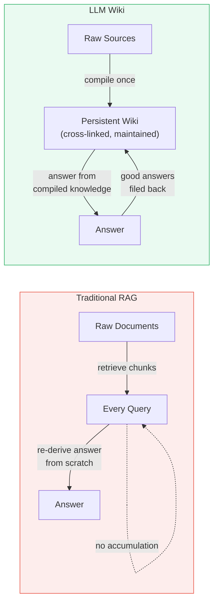
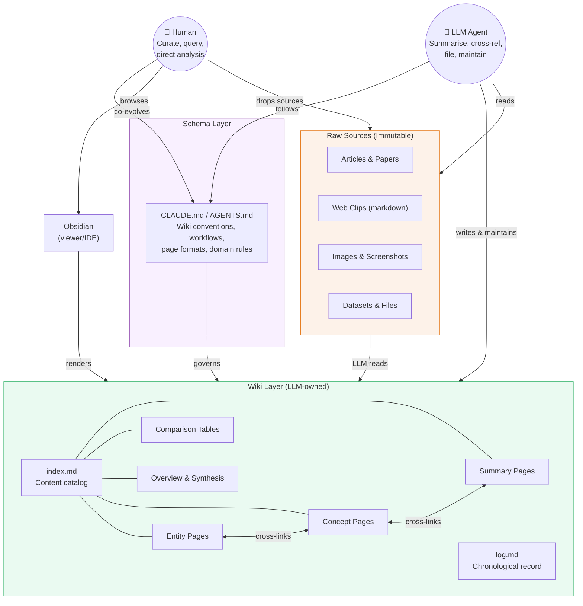
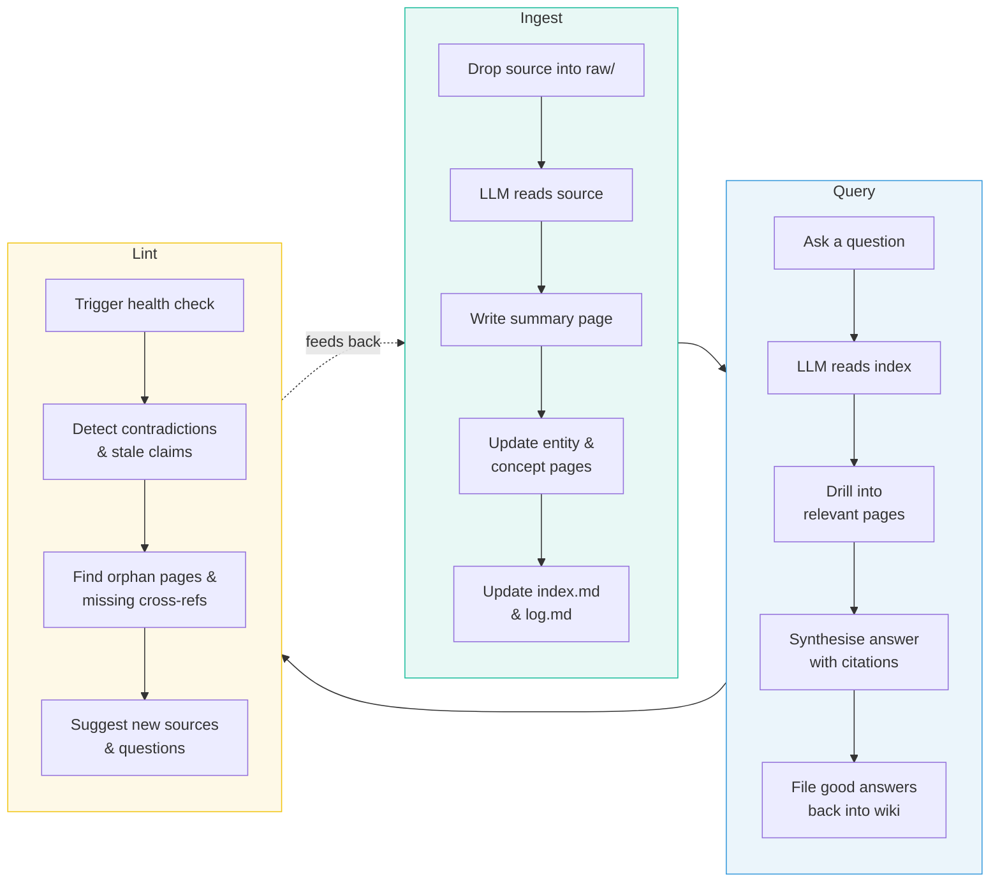
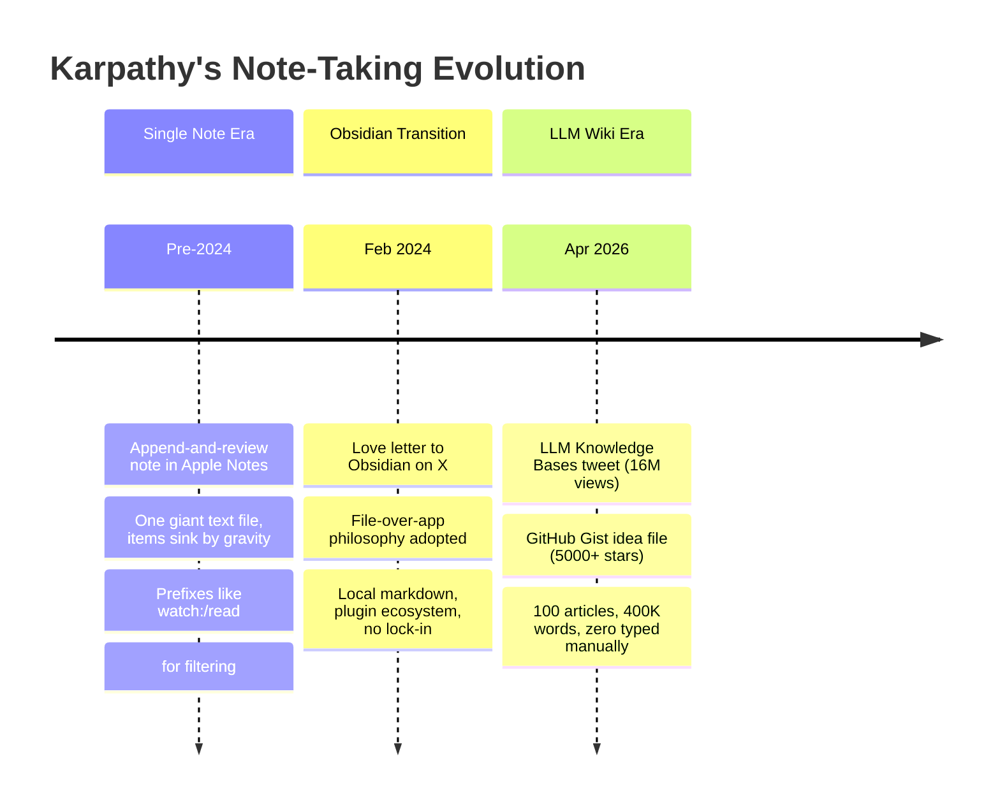
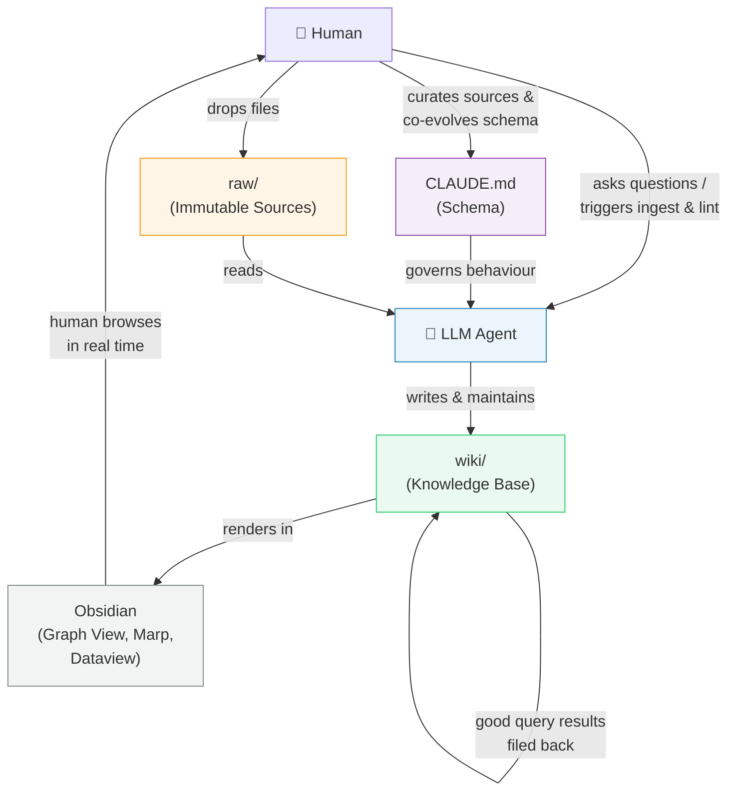

<!--more-->


------

* TOC
{:toc}
------

## Introduction

The main problem with OneNote or Apple Notes is <span>too much cognitive bloat</span>{:rtxt}. To avoid cognitive bloat, Andrej Karpathy[^1] introduced "LLM Wiki" or "LLM Knowledge Bases," which went viral in early April 2026 and represents the culmination of a years-long evolution in his note-taking philosophy — from a single Apple Notes file to a full AI-maintained research wiki containing 400,000+ words he never typed himself. His core metaphor: 

> Obsidian is the IDE; the LLM is the programmer; the wiki is the codebase.
{:.info-box}

Karpathy has shared his thinking across three major public disclosures: 

- a February 2024 tweet endorsing Obsidian, 
- a March 2025 blog post describing his minimalist "append-and-review" method, and an April 2026 tweet thread plus GitHub Gist detailing the full LLM Wiki architecture. 

Together, they reveal a consistent philosophy 

- local-first data, 
- plain-text markdown, 
- minimal cognitive overhead 
- scaled dramatically with the arrival of capable AI agents

## The single-note origin: append, sink, rescue

Before any involvement with wikis or AI, Karpathy used what he called the **append-and-review note**[^2] for many years. The system was radically simple: a single text note in Apple Notes, titled "notes." Every idea, TODO, quote, movie recommendation, draft tweet, shell command, or hyperparameter result got appended to the top as plain text. No dates, no tags, no links, no folders.

The genius was in the review mechanism. Items naturally "sink towards the bottom, almost as if under gravity," Karpathy wrote. During periodic scrolls through the note, items that still mattered got copy-pasted back to the top. Items that didn't earn their descent into obscurity — never deleted, but no longer top-of-mind. He explicitly rejected structural complexity: "Maintaining more than one note and managing and sorting them into folders and recursive substructures costs way too much cognitive bloat." The note grew "quite giant over the last few years," he said, and served as a working-memory offload: "When I note something down, I feel that I can immediately move on, wipe my working memory, and focus fully on something else." The only concessions to structure were occasional prefixes like "watch:", "listen:", or "read:" for quick Ctrl+F filtering. This post later inspired an Obsidian community plugin called Jot[^3], which implemented the append-and-review pattern as a card-style interface.

## The Obsidian love letter: file over app

On February 24, 2024, Karpathy posted what he called a "love letter"[^4] to Obsidian on X, announcing he had "very happily switched to" it for personal notes. Notably, he said his interest wasn't even primarily about note-taking — it was about **Obsidian's philosophy of software**. He praised four qualities that aligned with his values:

1. *Notes are plain-text markdown files stored locally*. Obsidian is described as "just UI/UX sugar of pretty rendering and editing files" — meaning the app is merely a viewer/editor, not a data silo.
2. *High composability through a plugin ecosystem*. Because everything is just plain-text files on your disk, plugins can interact with your notes in flexible, interoperable ways.
3. *Sync respects your ownership*. Obsidian's sync uses end-to-end encryption, or you can simply use GitHub — "it's just files, go nuts."
4. *No lock-in or dark patterns*. Karpathy specifically praised that there are "no attempts to 'lock you in'" and no "user-hostile dark patterns" — a pointed contrast to cloud-based note apps that make your data dependent on their platform.

> The overarching idea is that **the file is the source of truth, not the application**. The app can come and go, change, or be replaced — but your data, stored as universal plain-text markdown, remains permanently yours, portable, and inspectable. As Karpathy put it in the context of his LLM Wiki: "Your data is yours, on your local computer... The memory here is a simple collection of files in universal formats.

He linked to Obsidian CEO Steph Ango's essay "File over app," a principle that would become foundational to everything that followed. The tweet went viral on Hacker News and drew a reply from Lex Fridman, who confirmed, "Obsidian is great!" This moment marked Karpathy's public transition from Apple Notes (quick personal capture) to Obsidian (structured knowledge work), setting the stage for the LLM integration that would come two years later.

## The LLM Wiki: how the full system works

The method most people now call "Karpathy's Obsidian method" emerged on April 2, 2026, when he posted a detailed thread on X titled "LLM Knowledge Bases"[^5] that crossed **16 million views**. He followed up on April 4 with a GitHub Gist — an "idea file"[^6] designed to be copy-pasted directly to an LLM agent — that received over 5,000 stars and 1,483 forks within days.

The core insight is a shift from traditional RAG (retrieve-and-generate, which "rediscovers knowledge from scratch on every question") to a **persistent, compounding wiki** that an LLM incrementally builds and maintains. "A large fraction of my recent token throughput is going less into manipulating code, and more into manipulating knowledge," Karpathy wrote.



The architecture has three layers:

- **Raw sources** (`raw/` directory): An immutable collection of research papers, web articles, datasets, screenshots, and other source material. The LLM reads from but never modifies these files. Karpathy uses **Obsidian Web Clipper** to convert web pages to markdown and downloads images locally so the LLM can reference them via vision capabilities.
- **The wiki** (`wiki/` directory): LLM-generated and LLM-maintained markdown files — summaries, entity pages, concept pages, comparison tables, an overview index, and cross-linked references. "You rarely ever write or edit the wiki manually, it's the domain of the LLM."
- **The schema** (e.g., `CLAUDE.md`): A configuration document telling the LLM how the wiki is structured, what conventions to follow, and what workflows to execute. Karpathy and the LLM "co-evolve this over time."

The following diagram illustrates the three-layer architecture:



The three core **operations** that drive this system are shown below:



The system supports three core operations. **Ingest** means dropping a new source into `raw/`, prompting the LLM to process it — a single source might touch **10–15 wiki pages** as the LLM writes summaries, updates entity pages, and adds cross-references. **Query** means asking questions against the wiki; the LLM searches relevant pages, synthesizes answers with citations, and can output markdown files, Marp slide decks, or matplotlib charts — all viewable directly in Obsidian. Critically, good query answers get filed back into the wiki as new pages, so "your explorations compound." **Lint** runs periodic health checks for contradictions, stale claims, orphan pages, missing cross-references, and data gaps that might be filled with web searches.

## The daily workflow and Obsidian's specific role

In practice, Karpathy works with the LLM agent on one side of his screen and Obsidian on the other, browsing results in real time — "following links, checking the graph view, reading the updated pages." His setup uses **Claude Code** on macOS. He leverages several specific Obsidian features: **Graph view** for seeing the shape of the wiki ("what's connected to what, which pages are hubs, which are orphans"), the **Marp plugin** for rendering LLM-generated slide decks, and the **Dataview plugin** for running queries over page frontmatter with YAML tags, dates, and source counts. Two special files anchor the system: `index.md` serves as a content-oriented catalog of everything, while `log.md` provides a chronological append-only record of all operations.

At the time of his post, his wiki on a single research topic contained approximately **100 articles and 400K words** — "longer than most PhD dissertations" — without Karpathy typing a single word of wiki content directly. He noted that despite the scale, he didn't need vector databases or embeddings: "I thought I had to reach for fancy RAG, but the LLM has been pretty good about auto-maintaining index files and brief summaries." He also mentioned **qmd** (by Shopify co-founder Tobi Lütke), a local search engine for markdown files with hybrid BM25/vector search and LLM re-ranking, as a complementary tool.

The philosophy echoed his long-standing principles: "Your data is yours, on your local computer, it's not in some particular AI provider's system... The memory here is a simple collection of files in universal formats (images, markdown). This means the data is interoperable." He explicitly connected the system to **Vannevar Bush's 1945 Memex** concept as a spiritual ancestor.

The following diagram shows the evolution from Karpathy's earliest note-taking to the full LLM Wiki system:



## Sample CLAUDE.md for general-purpose LLM Wiki

The schema file (named `CLAUDE.md` for Claude Code or `AGENTS.md` for Codex) is what Karpathy describes as the key configuration file. It turns the LLM from a generic chatbot into a disciplined wiki maintainer. You and the LLM co-evolve this document over time. Below is a general-purpose starting template you can copy-paste and adapt:

````markdown
# LLM Wiki Schema — General Purpose

## Project
- **Domain**: [Your topic / research area / personal knowledge]
- **Goal**: Build and maintain a structured, interlinked wiki from raw sources

## Directory Layout

```text
project-root/
├── CLAUDE.md          # This file — wiki schema and conventions
├── raw/               # Immutable source material (you manage)
│   ├── articles/
│   ├── papers/
│   ├── clips/         # Obsidian Web Clipper output
│   └── assets/        # Downloaded images and attachments
├── wiki/              # LLM-generated and LLM-maintained
│   ├── index.md       # Content catalog (auto-maintained)
│   ├── log.md         # Chronological operation record
│   ├── overview.md    # Evolving high-level synthesis
│   ├── entities/      # Pages for people, orgs, tools, products
│   ├── concepts/      # Pages for ideas, methods, theories
│   ├── sources/       # One summary page per ingested source
│   └── queries/       # Saved query results worth keeping
└── outputs/           # Generated deliverables (slides, charts)
```

## Page Conventions

### Frontmatter (YAML)
Every wiki page must include:
```yaml
---
title: Page Title
type: entity | concept | source | comparison | query
created: YYYY-MM-DD
updated: YYYY-MM-DD
tags: [tag1, tag2]
sources: [list of raw/ files that inform this page]
---
```

### Cross-linking
- Use `[[wikilinks]]` for internal links between wiki pages
- Every page should have at least one inbound and one outbound link
- When creating a new page, scan existing pages for mentions
  of the same topic and add backlinks

### Naming
- Use lowercase kebab-case slugs: `machine-learning.md`,
  `andrej-karpathy.md`
- Source summary pages mirror the raw filename:
  `raw/articles/attention-is-all-you-need.pdf`
  → `wiki/sources/attention-is-all-you-need.md`

## Workflows

### Ingest
When I say **"ingest [source]"**:
1. Read the source file from `raw/`
2. Discuss key takeaways with me (3-5 bullet points)
3. Create or update a summary page in `wiki/sources/`
4. Create or update relevant entity pages in `wiki/entities/`
5. Create or update relevant concept pages in `wiki/concepts/`
6. Add cross-references (`[[wikilinks]]`) across all touched pages
7. Update `wiki/index.md` with new/changed entries
8. Append an entry to `wiki/log.md`:
   `## [YYYY-MM-DD] ingest | Source Title`
9. Update `wiki/overview.md` if the new source shifts
   the overall picture

### Query
When I ask a question:
1. Read `wiki/index.md` to identify relevant pages
2. Read those pages and synthesise an answer with citations
3. If the answer is substantial, offer to save it as a new page
   in `wiki/queries/`
4. Log the query in `wiki/log.md`:
   `## [YYYY-MM-DD] query | Brief description`

### Lint
When I say **"lint"**:
1. Check for contradictions between pages
2. Flag stale claims superseded by newer sources
3. List orphan pages (no inbound links)
4. List mentioned-but-missing pages (referenced but not created)
5. Check for missing cross-references
6. Suggest new sources or questions to fill gaps
7. Write a lint report to `wiki/log.md`:
   `## [YYYY-MM-DD] lint | Summary of findings`

## Rules
- **Never modify files in `raw/`** — treat them as immutable
- **Always cite sources** — every factual claim in the wiki should
  trace back to a file in `raw/`
- **Flag contradictions** — don't silently overwrite; note both
  claims and which source supports each
- **Keep index.md current** — it is the LLM's primary navigation
  tool at query time
- **Prefer updating over creating** — before making a new page,
  check if an existing page should be expanded instead
````

The diagram below shows how the schema governs the interaction loop:



## Community response and implementations

The posts triggered significant community engagement. **Steph Ango**, Obsidian's CEO, responded with a recommendation for "Contamination Mitigation" — keeping a clean personal vault separate from an agent-facing "messy vault" to prevent AI-generated content from polluting personal notes. **Lex Fridman** confirmed using a similar setup, adding dynamic HTML/JS visualizations and generating "ephemeral mini-knowledge-bases" for voice-mode interaction during long runs. A developer named Farza built "Farzapedia" — 400 personal Wikipedia articles compiled by an LLM from 2,500 diary entries, Apple Notes, and iMessage conversations — which Karpathy publicly endorsed as exemplifying the method's potential.

The approach also spawned open-source implementations, including **obsidian-wiki** on GitHub, which packages the LLM Wiki pattern for multiple AI agents. Karpathy's framing of the GitHub Gist as an "idea file" rather than a code repository was itself notable: "In this era of LLM agents, there is less of a point/need of sharing the specific code/app, you just share the idea, then the other person's agent customizes & builds it for your specific needs."


[^1]: [Andrej Karpathy](https://karpathy.ai/){:target="_blank"}
[^2]: [The append-and-review note](https://karpathy.bearblog.dev/the-append-and-review-note/){:target="_blank"}
[^3]: [Introducing Jot – A card‑style note‑taking plugin for Obsidian](https://forum.obsidian.md/t/introducing-jot-a-card-style-note-taking-plugin-for-obsidian-inspired-by-andrej-karpathy-s-append-and-review-note/112912){:target="_blank"}
[^4]: [Andrej Karpathy on X: Love letter to @obsdmd](https://x.com/karpathy/status/1761467904737067456){:target="_blank"}
[^5]: [Andrej Karpathy on X: LLM Knowledge Bases](https://x.com/karpathy/status/2039805659525644595){:target="_blank"}
[^6]: [llm-wiki · GitHub](https://gist.github.com/karpathy/442a6bf555914893e9891c11519de94f){:target="_blank"}

{:gtxt: .message color="green"}

{:rtxt: .message color="red"}
