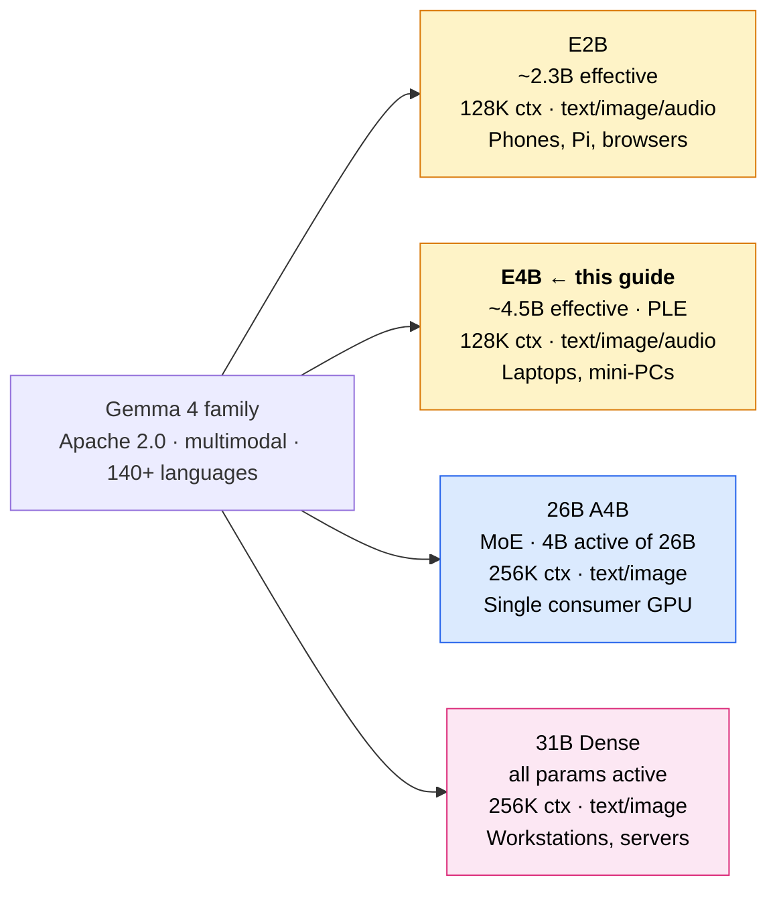
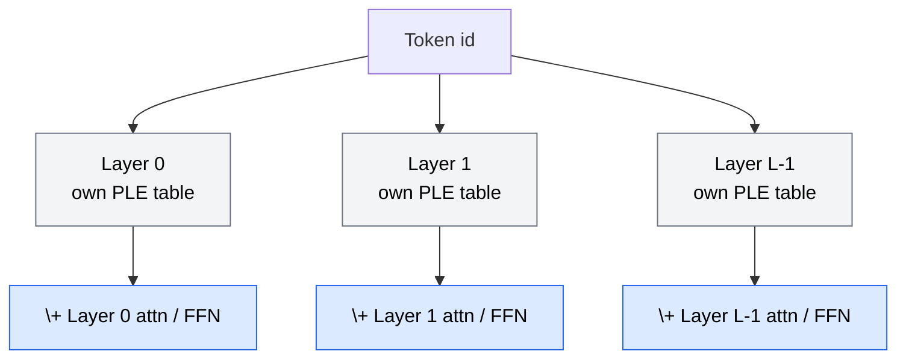
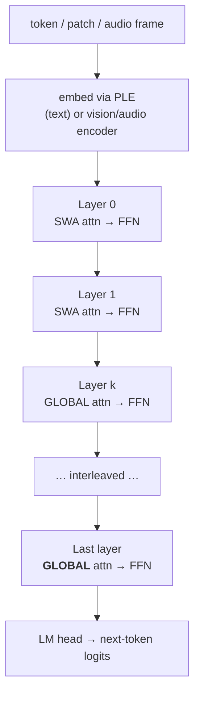
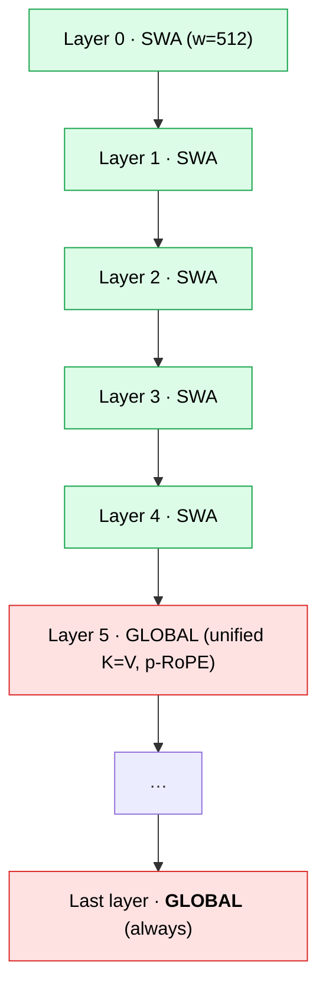
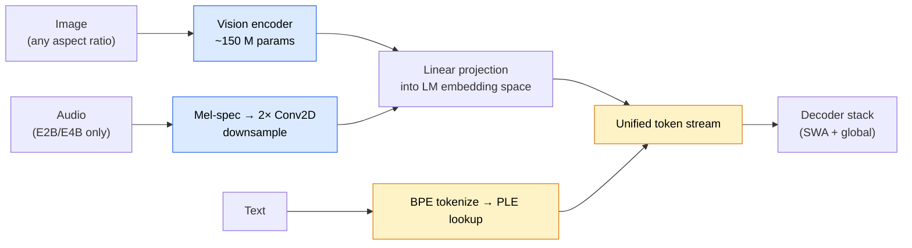
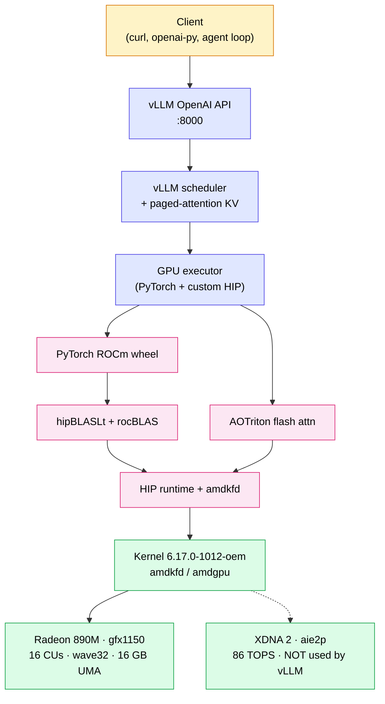
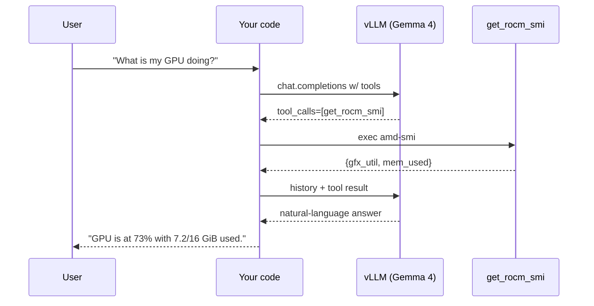
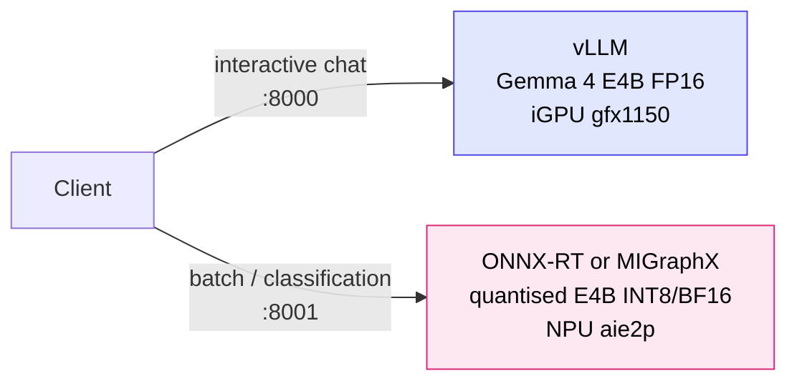

The Gemma 4, the 4-billion-effective-parameter instruction-tuned variant (`google/gemma-4-E4B-it`)[^hf-e4b-it]. This guide grounds Gemma 4 model card in the Ryzen AI 9 HX 470 machine — a Minisforum AI X1 Pro with Ryzen AI 9 HX 470, Radeon 890M (gfx1150 / RDNA 3.5), XDNA 2 NPU, 64 GiB UMA, ROCm 7.2.0, MIGraphX 2.15.0.dev — and walks from "what am I" through to "how do I tune your KV cache for 128 K context"[^ojitha-rocm]. The [Docker command](#docker-gemma4-run) is the verified-working configuration, validated on this exact hardware.

<!--more-->

* TOC
{:toc}

## How to read this guide

The guide is layered. **Part I** is for newcomers, **Part II** introduces the architecture with math, **Part III** is the vLLM operating manual including the verified Docker command, and **Part IV** is for engineers who want to reason about quantisation, NPU offload, and long-context economics. **Part V** covers operations, benchmarking, and where to go next.

# Part I — Foundations

## The Gemma 4 family

Gemma 4 is a family of four open-weights models released by Google DeepMind on 2 April 2026 under Apache 2.0[^google-blog] [^hf-blog]. All four are decoder-only Transformers built from the same research as Gemini 3, all four are multimodal (text + image), and the two smallest also accept audio[^model-card].



E4B sits in the middle of that range: a dense model with Per-Layer Embeddings (PLE), a 128 K context window, native system role, native function calling, and a configurable thinking mode[^model-card] [^lmstudio]. On the Ryzen AI 9 HX 470 machine it is the right size — large enough for serious work, small enough that the iGPU's UMA pool is not the bottleneck.

## What "Effective 4B" means

The "E" in E4B stands for *effective parameters*. The model uses ***Per-Layer Embeddings*** (PLE): each decoder layer carries its own small token-embedding table that is consulted by lookup, not multiplied[^model-overview] [^visual-guide].

That distinction matters because it splits memory and compute apart:

- **Compute** — only the active matmul-bearing parameters count. ~4.5 B.
- **Static memory** — the PLE tables push the on-disk and resident weight size higher than 4.5 B × 2 B (FP16) would suggest. Plan for ~8–10 GB FP16 or ~4–5 GB Q4_K_M / INT4[^model-overview].



<span>PLE buys representational depth without paying for it in matmul FLOPs.</span>{:gtxt} <span>That is the trick that lets a 4.5 B-effective model beat older 7–8 B baselines on most reasoning suites[^aurigait].</span>{:.info}

## Why the Ryzen AI 9 HX 470 machine can Gemma-4

The `rocminfo` output shows three HSA agents — CPU, GPU (`gfx1150`), and NPU (`aie2p`) — sharing one 64 GiB pool[^ojitha-rocm]. The mapping to Gemma 4 serving stack:

| Layer    | Ryzen AI 9 HX 470 machine                                 | Role for Gemma 4                                                       |
| -------- | -------------------------------------------- | ----------------------------------------------------------------- |
| CPU      | Ryzen AI 9 HX 470, 12 Zen 5 cores @ 5.30 GHz | vLLM scheduler, tokenizer, audio preprocessing                    |
| iGPU     | Radeon 890M, gfx1150, 16 CUs, wave32         | Where Gemma 4 matmuls run under HIP + hipBLASLt                        |
| NPU      | XDNA 2 / aie2p / RyzenAI-npu4, 86 TOPS       | **Not used by vLLM**; reserved for ONNX-RT or MIGraphX sidecar    |
| Memory   | 64 GiB UMA (your `amd-smi` shows 2.68/65.5)  | Both static weights and KV cache live here                        |
| Kernel   | 6.17.0-1012-oem                              | Required path for Strix Point IOMMU / amdkfd[^foxegregore]        |
| ROCm     | 7.2.0                                        | First stable release for gfx1150 production serving[^rocm-radeon] |
| MIGraphX | 2.15.0.dev (g1afd1b89c)                      | Optional ONNX router that can target the NPU                      |

*You have what you need.*{:gtxt} <u>The NPU is a separate opportunity, not a prerequisite.</u>{:.info}

---

# Part II — Architecture

## Decoder topology and PLE

Stripped to essentials, Gemma 4 forward pass per token is:



Two facts about Gemma 4 decoder are non-negotiable for a serving operator:

1. Most layers run ***sliding-window attention*** (SWA); periodic and the **last** layer run full global attention[^model-card] [^visual-guide].
2. The vision encoder is small (~150 M for E2B/E4B) and runs on the same iGPU as the LM[^visual-guide].

## Hybrid attention, with math

### The complexity argument

For a transformer layer with hidden dim $d$ and sequence length $n$, full self-attention costs

$$
\mathcal{O}_{\text{full}}(n) \;=\; \Theta\!\left(n^{2} d\right)
$$

per layer, and the KV cache for that layer occupies

$$
\text{KV}_{\text{full}}(n) \;=\; 2 \cdot n \cdot h_{kv} \cdot d_{h} \cdot b \quad \text{bytes}
$$

where $h_{kv}$ is the number of key/value heads, $d_{h}$ is the head dimension, and $b$ is bytes per element (2 for FP16/BF16).

Sliding-window attention with window $w$ replaces the $n^{2}$ term by $n \cdot w$:

$$
\mathcal{O}_{\text{SWA}}(n) \;=\; \Theta\!\left(n \cdot w \cdot d\right), \qquad
\text{KV}_{\text{SWA}}(n) \;=\; 2 \cdot \min(n, w) \cdot h_{kv} \cdot d_{h} \cdot b
$$

For Gemma 4 (E4B), $w = 512$ tokens[^visual-guide]. Once $n > 512$, every SWA layer's KV cost is constant in $n$ — only the global layers grow.

### The hybrid total

If the model has $L_{s}$ SWA layers and $L_{g}$ global layers, total KV bytes are

$$
\text{KV}_{\text{hybrid}}(n) \;=\; 2\,h_{kv}\,d_{h}\,b \,\Big[\,L_{s}\cdot \min(n, w) \;+\; L_{g}\cdot n \,\Big]
$$

For large $n$, this is linear in $n$ with slope $L_{g}$ rather than $L_{s} + L_{g}$. That is the entire reason 128 K context is feasible for Gemma 4 on a 16 GB-class budget — most of Gemma 4 layers stop paying KV per token once you cross the window.



### Global-layer optimisations

The global layers — the ones that *do* grow with $n$ — apply two extra savings:

- **Unified K and V projections** (sometimes written $W_{K} = W_{V}$): the same projection matrix produces both keys and values, halving the KV cache for those layers[^model-card].
- **Proportional RoPE (p-RoPE)**: only a fraction $p \in (0, 1]$ of head dimensions are rotated by RoPE; the rest pass through unrotated. This improves long-context generalisation past the training length[^model-card].

Concretely, ordinary RoPE on a head of dimension $d_{h}$ rotates each pair of dimensions $(2i, 2i+1)$ at frequency $\theta_{i} = \theta_{\text{base}}^{-2i/d_{h}}$:

$$
\text{RoPE}(\mathbf{x}, m) =
\begin{pmatrix}
\cos(m\theta_{i}) & -\sin(m\theta_{i}) \\
\sin(m\theta_{i}) & \cos(m\theta_{i})
\end{pmatrix}
\begin{pmatrix} x_{2i} \\ x_{2i+1} \end{pmatrix}
$$

p-RoPE applies that rotation to only the first $p \cdot d_{h}$ dimensions and leaves the rest unchanged.

## Multimodal pipeline



### Visual token budget

Image inputs are converted into a configurable number of tokens. Pick the budget to match the task[^model-card]:

| Budget | Use for                                                |
| -----: | ------------------------------------------------------ |
|     70 | Classification, captioning, dense video (many frames)  |
|    140 | Light captioning + simple charts                       |
|    280 | General VQA, screen understanding                      |
|    560 | OCR, document parsing, detailed charts                 |
|   1120 | Fine-grained pointing, dense detection, small text     |

> Critical rule: fine-tune at the same budget you intend to serve at. Training at 1120 and serving at 280 (or vice versa) measurably degrades Gemma 4 output quality[^datature].
{:.warn}

### Where to put media in a prompt

Always place media before text in a single user message: `[image | audio][text]`, not the reverse[^model-card]. This is a constraint of how Gemma 4 multimodal training data was structured.

---

# Part III — Serving with vLLM on Strix Point

## ROCm topology on the Ryzen AI 9 HX 470 machine



The NPU sits there available for an ONNX Runtime or MIGraphX sidecar — see Part IV.

## Container launch (verified-working)

This is the **single canonical command** for the  Ryzen AI 9 HX 470 machine. It has been validated end-to-end against vLLM v0.20.1 on ROCm 7.2.0 with kernel `6.17.0-1012-oem`, including model load, KV cache provisioning, multimodal warmup, and tool-call parsing.

> Choice of image: `vllm/vllm-openai-rocm:v0.20.1` is the upstream-built image, post-PR #25908 which added gfx1150/gfx1151 to the build matrix[^vllm-pr-25908]. Do **not** use `rocm/vllm-dev` — that one targets AMD Instinct accelerators[^rocm-vllm-dev], not Strix Point iGPUs.
{:.warn}

{:#docker-gemma4-run .listing}
**Listing 1:** vLLM Docker to run Gemma-4 locally

```bash
#!/usr/bin/env bash
set -euo pipefail

IMAGE=vllm/vllm-openai-rocm:v0.20.1
MODEL=google/gemma-4-E4B-it

mkdir -p "$HOME/.cache/vllm" "$HOME/.cache/huggingface" "$HOME/models"

docker run --rm -it \
  --name vllm-gemma4 \
  --network=host \
  --ipc=host \
  --shm-size=16G \
  \
  --device=/dev/kfd \
  --device=/dev/dri \
  --group-add=video \
  --group-add=render \
  --cap-add=SYS_PTRACE \
  --security-opt seccomp=unconfined \
  \
  -e HSA_OVERRIDE_GFX_VERSION=11.5.0 \
  -e HSA_ENABLE_SDMA=0 \
  -e ROCBLAS_USE_HIPBLASLT=1 \
  -e HIP_FORCE_DEV_KERNARG=1 \
  -e SAFETENSORS_FAST_GPU=1 \
  -e TOKENIZERS_PARALLELISM=false \
  -e TORCH_ROCM_AOTRITON_ENABLE_EXPERIMENTAL=1 \
  -e HF_TOKEN="${HF_TOKEN:-}" \
  \
  -v "$HOME/.cache/huggingface:/root/.cache/huggingface" \
  -v "$HOME/.cache/vllm:/root/.cache/vllm" \
  -v "$HOME/models:/app/models" \
  \
  "$IMAGE" \
    "$MODEL" \
    --dtype float16 \
    --max-model-len 131072 \
    --gpu-memory-utilization 0.85 \
    --enable-prefix-caching \
    --enable-auto-tool-choice \
    --tool-call-parser gemma4 \
    --safetensors-load-strategy=prefetch \
    --host 0.0.0.0 \
    --port 8000
```

### Why each flag is the way it is

| Variable / flag                              | Why on gfx1150                                                                                                | Source           |
| -------------------------------------------- | ------------------------------------------------------------------------------------------------------------- | ---------------- |
| `HSA_OVERRIDE_GFX_VERSION=11.5.0`            | RDNA 3.5 ISA. `11.0.0` (gfx1100) silently mismatches.                                                         | [^foxegregore]   |
| `HSA_ENABLE_SDMA=0`                          | Disables SDMA copy engines that race the CPU on the shared bus and cause hangs.                               | [^foxegregore]   |
| `ROCBLAS_USE_HIPBLASLT=1`                    | Switches GEMM to hipBLASLt; ~10–15% throughput on small batch sizes.                                          | [^foxegregore]   |
| `HIP_FORCE_DEV_KERNARG=1`                    | Keeps kernel arguments in device memory; prevents rare SIGBUS faults on UMA APUs.                             | [^foxegregore]   |
| `SAFETENSORS_FAST_GPU=1`                     | Faster safetensors-to-GPU transfer. Already baked into upstream Dockerfile; setting it explicitly is harmless. | [^vllm-dockerfile] |
| `TOKENIZERS_PARALLELISM=false`               | Avoids HuggingFace tokenizer thread storm under load.                                                         | (HF docs)        |
| `TORCH_ROCM_AOTRITON_ENABLE_EXPERIMENTAL=1`  | Enables memory-efficient SDPA in the vision encoder (still experimental on AMD).                              | (vLLM log)       |
| `--group-add=render`                         | On Ubuntu 24.04 + kernel 6.17, `/dev/dri/renderD128` is owned by `render`, not `video`.                       | (kernel docs)    |
| `--tool-call-parser gemma4`                  | Gemma 4-specific parser. The legacy name `gemma` does not exist in v0.20.1.                                   | (vLLM 0.20.1)    |
| `--max-model-len 131072`                     | Full 128 K context. Possible because hybrid SWA caps the per-layer KV growth (see Part IV).                   | This guide       |
| `--gpu-memory-utilization 0.85`              | Leaves ~10 GiB UMA for the OS / desktop session.                                                              | This guide       |
| Compile-cache volume mount                   | Persists `torch.compile` artifacts across `--rm` restarts. Saves ~40 s on every cold start.                   | (vLLM log)       |

> Flags that look like they should be there, but aren't: `--enable-chunked-prefill` (default in V1 engine), `--attention-backend TRITON_ATTN` (auto-forced by vLLM because Gemma 4 has heterogeneous head dims of 256/512), and `PYTORCH_HIP_ALLOC_CONF=expandable_segments:True` (silently ignored — that flag is CUDA-only).
{:.note}

Run these **once** before launching:


```bash
%%bash
# 1. UMA must be a fixed size in BIOS, not "Auto"
#    Recommended: 32 GiB minimum. Otherwise vLLM may die with
#    "amdgpu version file missing"[^ollama-issue-11451].
cat /sys/module/amdgpu/version 2>/dev/null || echo "UMA likely set to Auto — fix in BIOS"
```

    UMA likely set to Auto — fix in BIOS


```bash
%%bash
# 2. Confirm gfx1150 is what ROCm sees
rocminfo | grep -A1 "Name:.*gfx"
```

      Name:                    gfx1150                            
      Uuid:                    GPU-XX                             
    --
          Name:                    amdgcn-amd-amdhsa--gfx1150         
          Machine Models:          HSA_MACHINE_MODEL_LARGE            
    --
          Name:                    amdgcn-amd-amdhsa--gfx11-generic   
          Machine Models:          HSA_MACHINE_MODEL_LARGE            


```bash
%%bash
# 3. Make sure your user is in the right groups (host side)
id | tr ',' '\n' | grep -E 'video|render'
```

    44(video)
    992(render)


```bash
%%bash

# 4. Verify the image has gfx1150 compiled in
docker exec vllm-gemma4 bash -c  'rocminfo | grep -A1 "Name:.*gfx"'
```

      Name:                    gfx1150                            
      Uuid:                    GPU-XX                             
    --
          Name:                    amdgcn-amd-amdhsa--gfx1150         
          Machine Models:          HSA_MACHINE_MODEL_LARGE            
    --
          Name:                    amdgcn-amd-amdhsa--gfx11-generic   
          Machine Models:          HSA_MACHINE_MODEL_LARGE            


### Smoke test
Health check:


```bash
%%bash
curl -s http://localhost:8000/v1/models | jq
```

    {
      "object": "list",
      "data": [
        {
          "id": "google/gemma-4-E4B-it",
          "object": "model",
          "created": 1777974627,
          "owned_by": "vllm",
          "root": "google/gemma-4-E4B-it",
          "parent": null,
          "max_model_len": 131072,
          "permission": [
            {
              "id": "modelperm-b1991f33b5a7c34c",
              "object": "model_permission",
              "created": 1777974627,
              "allow_create_engine": false,
              "allow_sampling": true,
              "allow_logprobs": true,
              "allow_search_indices": false,
              "allow_view": true,
              "allow_fine_tuning": false,
              "organization": "*",
              "group": null,
              "is_blocking": false
            }
          ]
        }
      ]
    }


Self introduction


```bash
%%bash
curl -s http://localhost:8000/v1/chat/completions \
  -H 'content-type: application/json' \
  -d '{"model":"google/gemma-4-E4B-it",
       "messages":[{"role":"user","content":"Identify yourself in one sentence."}]}' \
  | jq -r '.choices[0].message.content'
```

    I am Gemma 4, a Large Language Model developed by Google DeepMind.


If the second call returns my self-introduction as abive, your stack is healthy.

## Capabilities, with examples

All examples assume `OPENAI_BASE_URL=http://localhost:8000/v1` and the `openai>=1.0` client.

### Native system role


```python
from openai import OpenAI
c = OpenAI(base_url="http://localhost:8000/v1", api_key="EMPTY")

resp = c.chat.completions.create(
    model="google/gemma-4-E4B-it",
    messages=[
        {"role": "system",
         "content": "You are a terse, technically precise assistant. "
                    "Respond in <=2 sentences."},
        {"role": "user",
         "content": "Explain RDNA 3.5 wave32 and why it matters for LLM kernels."},
    ],
    temperature=1.0, top_p=0.95, 
)
print(resp.choices[0].message.content)
```

    RDNA 3.5 wave32 is a hardware feature that allows more granular thread management and execution grouping on AMD GPUs. This finer-grained control improves resource utilization and parallelism, benefiting LLM kernels that require massive concurrent computations.


The `system` role is native in Gemma 4 and persists across the entire multi-turn conversation — no more "user-prefix" workaround from Gemma 3[^model-card].

### Configurable thinking


```python
# Thinking ON — math, multi-step reasoning, code review
sys = {"role": "system", "content": "thinking: on"}

# Thinking OFF — chat, summarisation, low-latency UX
sys = {"role": "system", "content": "thinking: off"}
```

When thinking is on my response stream contains `<|channel|>thought ... </|channel|>` followed by the final answer[^ollama-e4b].

> Strip the thought block before replaying history. Leaving prior thoughts in the conversation degrades my next turn — this is the single most common multi-turn bug reported on E4B[^model-card].
{:.warn}

### Image understanding


```python
import base64
from openai import OpenAI

c = OpenAI(base_url="http://localhost:8000/v1", api_key="EMPTY")
img_b64 = base64.b64encode(open("/home/ojitha/workspace/data/invoice.jpg", "rb").read()).decode()

resp = c.chat.completions.create(
    model="google/gemma-4-E4B-it",
    messages=[{
        "role": "user",
        "content": [
            {"type": "image_url",
             "image_url": {"url": f"data:image/png;base64,{img_b64}"}},
            {"type": "text",
             "text": "Extract every line item as row to display in Markdwon table: "
                     "[{description, qty, unit_price, total}]. "
                     "Also return a bounding box for the totals row "
                     "in [y1,x1,y2,x2] normalized to 1000."},
        ],
    }],
    extra_body={"mm_processor_kwargs": {"image_token_budget": 560}},
)
print(resp.choices[0].message.content)
```

    | Description | Qty | Unit Price | Total |
    |---|---|---|---|
    | CLEARANCE! Fast Dell Desktop Computer PC DUAL CORE WINDOWS 10 4/8/16GB RAM | 3.00 | 209.00 | 627.00 |
    | HP T520 Thin Client Computer AMD GX-212C 1.2GHz 4GB RAM TESTED !!READ BELOW!! | 5.00 | 37.75 | 188.75 |
    | gaming pc desktop computer | 1.00 | 400.00 | 400.00 |
    | 12-Core Gaming Computer Desktop PC Tower Affordable GAMING PC 8GB AMD Vega RGB | 3.00 | 464.89 | 1,394.67 |
    | Custom Build Dell Optiplex 9020 MT i5-4570 3.20GHz Desktop Computer PC | 5.00 | 221.99 | 1,109.95 |
    | Dell Optiplex 990 MT Computer PC Quad Core i7 3.4GHz 16GB 2TB WD Windows 10 Pro | 4.00 | 269.95 | 1,079.80 |
    | Dell Core 2 Duo Desktop Computer | Windows XP Pro | 4GB | 5.00 | 168.00 | 840.00 |
    | **Total** | | | |
    
    Bounding Box for Totals Row: [794, 381, 815, 887]


Gemma emit bounding boxes as `[y1, x1, y2, x2]` integers in $[0, 1000]$ — the canonical Gemma 4 detection format[^datature].

### Audio understanding (E4B native)

Audio is one of E4B's distinguishing capabilities[^google-blog]. The vLLM ROCm wheel may trail the CUDA wheel by a release on multi-modal audio. If `audio_url` rejects, run audio through `transformers`' `any-to-any` pipeline on the same machine[^hf-blog]:


```python
from transformers import pipeline
pipe = pipeline("any-to-any", model="google/gemma-4-E4B-it",
                device_map="auto", torch_dtype="float16")
out = pipe([{"role": "user",
             "content": [{"type": "audio", "audio": "speech.wav"},
                         {"type": "text",  "text": "Transcribe and translate to English."}]}])
```

Gemma 4 do well at ASR across 100+ languages, speech-to-text translation, speaker-turn detection, and audio captioning. I do not synthesise audio.

### Function calling (native, structured)


```python
from openai import OpenAI

c = OpenAI(base_url="http://localhost:8000/v1", api_key="EMPTY")
tools = [{
    "type": "function",
    "function": {
        "name": "get_rocm_smi",
        "description": "Return current GPU utilisation and memory for gfx1150.",
        "parameters": {
            "type": "object",
            "properties": {"verbose": {"type": "boolean"}},
            "required": [],
        },
    },
}]

resp = c.chat.completions.create(
    model="google/gemma-4-E4B-it",
    messages=[{"role": "user",
               "content": "What is my GPU doing right now? Use a tool."}],
    tools=tools, tool_choice="auto",
)

resp

```


    ChatCompletion(id='chatcmpl-ba4debfaf19a1ac0', choices=[Choice(finish_reason='tool_calls', index=0, logprobs=None, message=ChatCompletionMessage(content=None, refusal=None, role='assistant', annotations=None, audio=None, function_call=None, tool_calls=[ChatCompletionMessageFunctionToolCall(id='chatcmpl-tool-bab0a39d1c90fb58', function=Function(arguments='{}', name='get_rocm_smi'), type='function')], reasoning=None), stop_reason=None, token_ids=None)], created=1777986405, model='google/gemma-4-E4B-it', object='chat.completion', service_tier=None, system_fingerprint=None, usage=CompletionUsage(completion_tokens=13, prompt_tokens=75, total_tokens=88, completion_tokens_details=None, prompt_tokens_details=None), prompt_logprobs=None, prompt_token_ids=None, kv_transfer_params=None)


The agentic loop:



vLLM's `--tool-call-parser gemma4` rewrites Gemma 4 native channel format into the OpenAI `tool_calls` shape automatically.

### Long context (128 K)

```python
from openai import OpenAI

c = OpenAI(base_url="http://localhost:8000/v1", api_key="EMPTY")
src = open("/path/to/large_repo_concat.py").read()  # ~250 KB ≈ 70K tokens
resp = c.chat.completions.create(
    model="google/gemma-4-E4B-it",
    messages=[
        {"role": "system", "content": "thinking: on"},
        {"role": "user",
         "content": f"Here is a Python module:\n\n```python\n{src}\n```\n\n"
                    f"Find every `# TODO`, group by function, propose a fix."},
    ],
    max_tokens=4096,
)
```

`--enable-prefix-caching` is already in the launch script — subsequent queries against the same prefix amortise prefill near zero, a meaningful saving when iterating on the same repo.

### Multilingual


```python
from openai import OpenAI

c = OpenAI(base_url="http://localhost:8000/v1", api_key="EMPTY")
resp = c.chat.completions.create(
    model="google/gemma-4-E4B-it",
    messages=[{"role": "user",
               "content": "ඔයාට සිංහල කථා කරන්න පුළුවන් ද? "
                          "Sri Lankan කන්දේගල් තැන් 5ක් යෝජනා කරන්න."}],
)

```


```python
print(resp.choices[0].message.content)
```

    ඔව්, මට සිංහල කතා කරන්න පුළුවන්. 😊
    
    ශ්‍රී ලංකාවේ සංචාරක කටයුතු සඳහා සුන්දර සහ රසවත් කන්ද සහිත ස්ථාන 5ක් මම ඔබට යෝජනා කරන්නම්. ඔබේ කැමැත්ත (ස්වභාවික සුන්දරත්වය, ඓතිහාසික වැදගත්කම, නැගීම තරමක් අපහසු වීම වැනි) අනුව මේවා තෝරා ගත හැකියි.
    
    ---
    
    ### ශ්‍රී ලංකාවේ කඳු සහිත ස්ථාන 5ක්:
    
    **1. නුවරඑළිය (Nuwara Eliya)**
    * **ඇයි මෙතනට යන්න ඕනේ:** මෙය ශ්‍රී ලංකාවේ වඩාත්ම ජනප්‍රිය කඳුකර නගරයයි. තේ වතු, සිසිල් දේශගුණය, ලස්සන දර්ශන සහ විවිධ ගමනාන්තයන් මෙහි තිබේ.
    * **විශේෂත්වය:** තේ කර්මාන්තය, කඳු නැගීමේ සුන්දරත්වය, සහ ප්‍රසන්න ග්‍රාමීය පරිසරය.
    * **කඳුකර අත්දැකීම:** විවිධ උසවල තේ වතුවලින් යුත් භූ දර්ශන දැකගත හැකිය.
    
    **2. සීගිරිය (Sigiriya) - (කන්දක් ලෙස සැලකිය හැක)**
    * **ඇයි මෙතනට යන්න ඕනේ:** මෙය ලෝක උරුමයක් වන අතර, අතිශය නාටකාකාර ලෙස ඉදිකර ඇති පර්වතයක් මත පිහිටා ඇත. එහි ඉතිහාසය හා වාස්තු විද්‍යාව විශ්මයජනකයි.
    * **විශේෂත්වය:** සිංහල ශිෂ්ටාචාරයේ උච්චතම අවස්ථාවක් නියෝජනය කරයි. කඳු මුදුනට නැගීමත් සමඟ ලැබෙන දර්ශන අසමසමයි.
    * **කඳුකර අත්දැකීම:** පැරණි රාජකීය බලකොටුවක් මත ඇති අභියෝගාත්මක ගමන.
    
    **3. එල්ලේ (Ella)**
    * **ඇයි මෙතනට යන්න ඕනේ:** මෑතකදී ප්‍රසිද්ධියට පත් වූ මෙම ප්‍රදේශය, කඳුකරයේ තරුණ හා ස්වභාවික සුන්දරත්වය නියෝජනය කරයි.
    * **විශේෂත්වය:** ඇල්ලේට ආසන්නයේ පිහිටි **තොටගල වසන්ත උද්‍යානය**, **ඩොලිනීස් (Dodiyawala)** සහ කඳුකරයේ ඇති කුඩා ගම්මාන දැකගත හැකිය. මෙහි සිට ජේස්ට් පාලම (Little Adam's Peak) වෙත යන මාර්ගය ඉතා සුන්දරය.
    * **කඳුකර අත්දැකීම:** සන්සුන්, තරුණ සහ ඓතිහාසික නොවන, නමුත් ඉතා සුවිශේෂී කඳුකර අත්දැකීමක්.
    
    **4. නුවරඑළිය සහ මාතලේ ප්‍රදේශයේ කඳු (Matale Hills)**
    * **ඇයි මෙතනට යන්න ඕනේ:** නුවරඑළියට වඩා විවිධත්වය සහිත, අඩු සංචාරක ජනතාවක් සිටින කඳුකර ප්‍රදේශ කිහිපයකි.
    * **විශේෂත්වය:** මෙම ප්‍රදේශවල ඔබට තේ වතුවලට අමතරව කුඩා ගම්මාන, ස්වාභාවික ජල ඇලි සහ ග්‍රාමීය ජීවිතය දැකගත හැකිය.
    * **කඳුකර අත්දැකීම:** නිස්කලංක හා සැබෑ ශ්‍රී ලාංකේය කඳුකර ජීවිතය අත්විඳීම.
    
    **5. බදුල්ල/හඹානගල ප්‍රදේශයේ කඳුකරය (Badulla Area - Horton Plains/Hidden Valley)**
    * **ඇයි මෙතනට යන්න ඕනේ:** ඔබට සැබෑ, උස් සහ වියළි කඳුකර භූ දර්ශනයක් අවශ්‍ය නම් මෙය සුදුසුයි.
    * **විශේෂත්වය:** මෙම ප්‍රදේශවල ශාක විද්‍යාත්මකව ඉතා වැදගත්, උස් බිම් සහිත කලාප ඇත. (උදා: හෝර්ටන් තැන්න නම් වන ස්ථාන). මෙහි දේශගුණය නුවරඑළියට වඩා වෙනස්, වඩා තද සහ විෂමතාවයක් ඇත.
    * **කඳුකර අත්දැකීම:** මීදුම් සහිත, විද්‍යාත්මකව වැදගත් සහ අභියෝගාත්මක කඳුකර ගමනක්.
    
    ---
    
    **📌 කෙටි සාරාංශය (ඔබේ අවශ්‍යතාවය අනුව තෝරාගන්න):**
    
    * **ලස්සන දර්ශන සහ සුවපහසු බව:** නුවරඑළිය
    * **ඉතිහාසය සහ අභියෝගය:** සීගිරිය
    * **තරුණ සහ සැහැල්ලු අත්දැකීම:** එල්ලේ
    * **සැබෑ, අභියෝගාත්මක කඳුකරය:** බදුල්ල/හෝර්ටන් තැන්න
    
    ඔබට මේවායින් කුමන ආකාරයේ අත්දැකීමක්ද අවශ්‍ය වන්නේ? මට තවදුරටත් තොරතුරු ලබා දිය හැක!


Gemma 4 pre-trained on 140+ languages and instruction-tuned on 35+[^model-card]. Code-switching between Sinhala / English / Tamil within one prompt is fine; pin the target register in the `system` role for stability.

### Coding

For diff-style edits, drop temperature:


```python
from openai import OpenAI

c = OpenAI(base_url="http://localhost:8000/v1", api_key="EMPTY")
resp = c.chat.completions.create(
    model="google/gemma-4-E4B-it",
    messages=[
        {"role": "system",
         "content": "Output unified diffs only. No prose."},
        {"role": "user",
         "content": "Refactor this loop to a comprehension:\n"
                    "```python\nout=[]\nfor x in xs:\n  if x>0:\n    out.append(x*x)\n```"}],
    temperature=0.2, top_p=0.9,
)

print(resp.choices[0].message.content)
```

    ```diff
    --- a/script.py
    +++ b/script.py
    @@ -1,5 +1,3 @@
    -out=[]
    -for x in xs:
    -  if x>0:
    -    out.append(x*x)
    +out = [x*x for x in xs if x > 0]
    ```


### Visual token budget tuning (operational)

Switching budgets per-request is allowed and is exactly how production multimodal pipelines on E4B economise compute[^datature].


```python
# Hot path: per-frame "is anyone there"
extra = {"mm_processor_kwargs": {"image_token_budget": 70}}

# Cold path: alarm fired, read the badge
extra = {"mm_processor_kwargs": {"image_token_budget": 1120}}
```

# Part IV — Advanced topics

## KV cache mathematics for hybrid attention

Take the formula from Part II:

$$
\text{KV}_{\text{hybrid}}(n) \;=\; 2\,h_{kv}\,d_{h}\,b \,\Big[\,L_{s}\cdot \min(n, w) \;+\; L_{g}\cdot n \,\Big]
$$

For the global layers I additionally apply unified $K = V$, which divides their contribution by 2:

$$
\text{KV}_{\text{E4B}}(n) \;=\; h_{kv}\,d_{h}\,b \,\Big[\,2L_{s}\cdot \min(n, w) \;+\; L_{g}\cdot n \,\Big]
$$

Two regimes worth remembering:

- **Short context** ($n \le w = 512$): cache scales with $n \cdot (L_{s} + L_{g})$. Same as a fully-global model.
- **Long context** ($n \gg w$): SWA term saturates; cache scales with $2 L_{s} w + L_{g} n$. Effectively *only the global layers* pay.

For 128 K context the SWA contribution is bounded; the global term dominates. This is why the only knob that meaningfully shrinks long-context KV is either reducing $L_{g}$ (architectural, fixed for E4B) or quantising the cache itself — see the quantisation section below.

## p-RoPE and unified K/V — why both exist

Long-context generalisation has two failure modes:

1. **Attention dilution** — attention scores spread thin over many tokens; the model loses focus.
2. **RoPE wraparound** — at positions far past training, RoPE phases become indistinguishable, breaking distance encoding.

p-RoPE addresses (2) by leaving a fraction $1 - p$ of head dimensions unrotated. Those untouched dimensions provide a positional-invariant identity channel that the model can lean on at extreme distances. Unified $K = V$ in global layers addresses cache pressure that arises *because* of (1): when you must attend over many tokens, every byte of KV per token matters.

The two design choices compose: unified KV makes 256 K affordable on the medium models, p-RoPE makes the resulting attention well-behaved out there[^model-card][^visual-guide].

## Quantisation trade-offs

Three options that work for me on gfx1150 today:

| Scheme        | Resident weights      | Prefill speedup vs FP16 | Quality cost                                    | vLLM flag                                  |
| ------------- | --------------------: | ----------------------: | ----------------------------------------------- | ------------------------------------------ |
| FP16          | ~9 GB                 | 1.0×                    | baseline                                        | (default)                                  |
| Q4_K_M        | ~4.5 GB               | ~1.6× (llama.cpp)       | small loss on math, negligible on chat          | not via vLLM — use llama.cpp[^llm-tracker] |
| **AWQ-INT4**  | ~4 GB                 | ~1.8×                   | small loss across the board                     | `--quantization awq`                       |
| GPTQ-INT4     | ~4 GB                 | ~1.7×                   | similar to AWQ; sometimes worse on long context | `--quantization gptq`                      |
| FP8 (KV)      | weights FP16, KV FP8  | minor                   | small KV recall loss                            | `--kv-cache-dtype fp8` (where supported)   |

> On bandwidth-bound iGPUs, AWQ-INT4 is roughly a 2× decode-throughput upgrade. If you measured 6–11 tok/s in FP16 (see Part V benchmarking), expect 12–18 tok/s after switching to AWQ. KV-cache FP8 stacks on top.
{:.ok}

## NPU as a sidecar via MIGraphX

vLLM does not route ops to the XDNA 2 NPU. Your installed MIGraphX 2.15.0.dev (`g1afd1b89c`) is the bridge. The recommended split:



Why split:

- Latency-sensitive interactive paths (chat, agents) want vLLM's continuous batching and KV reuse — that lives on the iGPU.
- High-throughput one-shot inference (image classification, sentiment, short-context Q&A) wants the NPU's INT8/BF16 compute density. Quantise me to ONNX once, route via MIGraphX, expose on a separate port.

The two endpoints share one weight cache on disk but run in two processes — they never compete for the same HIP allocator.

# Part V — Operations

## Troubleshooting

| Symptom                                              | Cause / fix                                                                                                                           |
| ---------------------------------------------------- | ------------------------------------------------------------------------------------------------------------------------------------- |
| `Aborted (core dumped)` on first request             | KV cache too large. Drop `--max-model-len` to 16384, climb back up.                                                                   |
| Throughput < 5 tok/s                                  | hipBLASLt not active. Confirm `ROCBLAS_USE_HIPBLASLT=1`[^foxegregore].                                                                |
| Random kernel panic under sustained load             | SDMA contention. `HSA_ENABLE_SDMA=0` (already in the launch script)[^foxegregore].                                                    |
| `gfx1150 not in supported_archs`                      | Older ROCm. You're on 7.2.0 — fine. If forced to downgrade, accept perf hit and keep `HSA_OVERRIDE_GFX_VERSION=11.5.0`.               |
| `amdgpu version file missing` on vLLM startup        | UMA = `Auto` in BIOS hides `/sys/module/amdgpu/version`. Set UMA fixed (≥32 GiB)[^ollama-issue-11451].                                |
| Image inference much slower than text                 | Vision encoder runs on the iGPU too. Lower `image_token_budget`, or pre-resize host-side.                                             |
| OOM at 128 K context                                 | Either use AWQ-INT4 weights or set `--kv-cache-dtype fp8`.                                                                            |
| Multi-turn quality decays                             | You replayed thinking blocks. Strip them from history[^model-card].                                                                   |
| `KeyError: 'invalid tool call parser: gemma'`        | Use `--tool-call-parser gemma4` (the v4-family parser). The legacy name `gemma` does not exist in vLLM 0.20.1.                        |
| `expandable_segments not supported on this platform` | The CUDA-only env var leaked into the ROCm path. Remove `PYTORCH_HIP_ALLOC_CONF=expandable_segments:True`. Harmless but noisy.        |
| 40-second startup every restart                      | The `torch.compile` cache is in the container, not on disk. Mount `$HOME/.cache/vllm:/root/.cache/vllm` (already in the launch script). |

## Benchmarking

The vLLM `usage` object only contains token counts, not timing — you must measure wall clock independently.

### Quick decode benchmark


```bash
%%bash
START=$(date +%s.%N); \
R=$(curl -s http://localhost:8000/v1/chat/completions \
  -H 'content-type: application/json' \
  -d '{"model":"google/gemma-4-E4B-it",
       "messages":[{"role":"user","content":"Write a 500-word essay about the history of compilers."}],
       "max_tokens":600, "temperature":0.0}'); \
END=$(date +%s.%N); \
TOK=$(echo "$R" | jq -r '.usage.completion_tokens'); \
ELAPSED=$(echo "$END - $START" | bc); \
printf 'tokens=%s elapsed=%.2fs tok/s=%.2f\n' \
  "$TOK" "$ELAPSED" "$(echo "scale=4; $TOK/$ELAPSED" | bc)"
```

    tokens=600 elapsed=87.98s tok/s=6.82


### Prometheus metrics (more accurate)


```bash
%%bash
curl -s http://localhost:8000/metrics | grep -E \
  '^vllm:(time_to_first_token_seconds|time_per_output_token_seconds|generation_tokens|prompt_tokens)' \
  | grep -v '#'
```

    vllm:prompt_tokens_total{engine="0",model_name="google/gemma-4-E4B-it"} 2972.0
    vllm:prompt_tokens_created{engine="0",model_name="google/gemma-4-E4B-it"} 1.7779838226789353e+09
    vllm:prompt_tokens_by_source_total{engine="0",model_name="google/gemma-4-E4B-it",source="local_compute"} 1020.0
    vllm:prompt_tokens_by_source_total{engine="0",model_name="google/gemma-4-E4B-it",source="local_cache_hit"} 1952.0
    vllm:prompt_tokens_by_source_total{engine="0",model_name="google/gemma-4-E4B-it",source="external_kv_transfer"} 0.0
    vllm:prompt_tokens_by_source_created{engine="0",model_name="google/gemma-4-E4B-it",source="local_compute"} 1.7779838226789443e+09
    vllm:prompt_tokens_by_source_created{engine="0",model_name="google/gemma-4-E4B-it",source="local_cache_hit"} 1.7779838226789477e+09
    vllm:prompt_tokens_by_source_created{engine="0",model_name="google/gemma-4-E4B-it",source="external_kv_transfer"} 1.777983822678951e+09
    vllm:prompt_tokens_cached_total{engine="0",model_name="google/gemma-4-E4B-it"} 1952.0
    vllm:prompt_tokens_cached_created{engine="0",model_name="google/gemma-4-E4B-it"} 1.7779838226789572e+09
    vllm:generation_tokens_total{engine="0",model_name="google/gemma-4-E4B-it"} 5779.0
    vllm:generation_tokens_created{engine="0",model_name="google/gemma-4-E4B-it"} 1.777983822678964e+09
    vllm:time_to_first_token_seconds_bucket{engine="0",le="0.001",model_name="google/gemma-4-E4B-it"} 0.0
    vllm:time_to_first_token_seconds_bucket{engine="0",le="0.005",model_name="google/gemma-4-E4B-it"} 0.0
    vllm:time_to_first_token_seconds_bucket{engine="0",le="0.01",model_name="google/gemma-4-E4B-it"} 0.0
    vllm:time_to_first_token_seconds_bucket{engine="0",le="0.02",model_name="google/gemma-4-E4B-it"} 0.0
    vllm:time_to_first_token_seconds_bucket{engine="0",le="0.04",model_name="google/gemma-4-E4B-it"} 0.0
    vllm:time_to_first_token_seconds_bucket{engine="0",le="0.06",model_name="google/gemma-4-E4B-it"} 0.0
    vllm:time_to_first_token_seconds_bucket{engine="0",le="0.08",model_name="google/gemma-4-E4B-it"} 0.0
    vllm:time_to_first_token_seconds_bucket{engine="0",le="0.1",model_name="google/gemma-4-E4B-it"} 0.0
    vllm:time_to_first_token_seconds_bucket{engine="0",le="0.25",model_name="google/gemma-4-E4B-it"} 10.0
    vllm:time_to_first_token_seconds_bucket{engine="0",le="0.5",model_name="google/gemma-4-E4B-it"} 12.0
    vllm:time_to_first_token_seconds_bucket{engine="0",le="0.75",model_name="google/gemma-4-E4B-it"} 12.0
    vllm:time_to_first_token_seconds_bucket{engine="0",le="1.0",model_name="google/gemma-4-E4B-it"} 12.0
    vllm:time_to_first_token_seconds_bucket{engine="0",le="2.5",model_name="google/gemma-4-E4B-it"} 13.0
    vllm:time_to_first_token_seconds_bucket{engine="0",le="5.0",model_name="google/gemma-4-E4B-it"} 13.0
    vllm:time_to_first_token_seconds_bucket{engine="0",le="7.5",model_name="google/gemma-4-E4B-it"} 13.0
    vllm:time_to_first_token_seconds_bucket{engine="0",le="10.0",model_name="google/gemma-4-E4B-it"} 13.0
    vllm:time_to_first_token_seconds_bucket{engine="0",le="20.0",model_name="google/gemma-4-E4B-it"} 14.0
    vllm:time_to_first_token_seconds_bucket{engine="0",le="40.0",model_name="google/gemma-4-E4B-it"} 14.0
    vllm:time_to_first_token_seconds_bucket{engine="0",le="80.0",model_name="google/gemma-4-E4B-it"} 14.0
    vllm:time_to_first_token_seconds_bucket{engine="0",le="160.0",model_name="google/gemma-4-E4B-it"} 14.0
    vllm:time_to_first_token_seconds_bucket{engine="0",le="640.0",model_name="google/gemma-4-E4B-it"} 14.0
    vllm:time_to_first_token_seconds_bucket{engine="0",le="2560.0",model_name="google/gemma-4-E4B-it"} 14.0
    vllm:time_to_first_token_seconds_bucket{engine="0",le="+Inf",model_name="google/gemma-4-E4B-it"} 14.0
    vllm:time_to_first_token_seconds_count{engine="0",model_name="google/gemma-4-E4B-it"} 14.0
    vllm:time_to_first_token_seconds_sum{engine="0",model_name="google/gemma-4-E4B-it"} 18.429856061935425
    vllm:time_to_first_token_seconds_created{engine="0",model_name="google/gemma-4-E4B-it"} 1.7779838226792686e+09


Look at `vllm:time_per_output_token_seconds_sum / vllm:generation_tokens_total` for true average decode time per token.

### Expected throughput on the OJAI machine

Decode is memory-bandwidth-bound on this iGPU. The theoretical ceiling is

$$
\text{tok/s}_{\max} \;=\; \frac{\text{memory bandwidth}}{\text{bytes read per decode step}} \;\approx\; \frac{128\;\text{GB/s}}{\sim\!10\;\text{GB}} \;\approx\; 12\text{–}13\;\text{tok/s}
$$

(The ~10 GB figure includes the PLE tables, which consume bandwidth on every token even though they're lookups, not matmuls.)

| Decode tok/s | Verdict             | What it means                                              |
| -----------: | ------------------- | ---------------------------------------------------------- |
|          < 5 | Broken              | hipBLASLt not engaging, or running on CPU fallback         |
|         5–7  | Sub-optimal          | Some env var missing or kernel mis-selection               |
|         **7–11** | **Healthy FP16**    | **Typical for well-tuned E4B FP16 on gfx1150**             |
|        11–13 | Excellent FP16      | Hitting the bandwidth ceiling                              |
|        12–18 | Healthy AWQ-INT4    | After switching to quantised weights                       |
|        > 20  | Suspicious          | Likely measurement error                                   |

> A measured **6.85 tok/s** decode on E4B FP16 with all the launch-script tuning applied is at the lower end of the healthy band. To break through to 12–18 tok/s, the only meaningful lever on this hardware is **AWQ-INT4 quantisation** — kernel tuning alone cannot exceed the FP16 bandwidth ceiling.
{:.note}

Prefill (prompt-processing) is compute-bound and runs much faster — expect 200–500+ tok/s on a 24-token prompt.

## Where to go next

1. **Quantise to AWQ-INT4.** The single biggest improvement available on this hardware. ~2× decode throughput, ~30% more headroom for KV cache. Pull a vetted community AWQ build of `google/gemma-4-E4B-it`, or produce one yourself with `autoawq` against the FP16 weights you already have cached. Add `--quantization awq` to the launch script.
2. **Activate the NPU.** Quantise to ONNX INT8, route via MIGraphX, expose on port 8001. Keep vLLM as the chat path. Start with classification or sentiment workloads where the NPU's INT8 compute density wins.
3. **Fine-tune E4B with QLoRA** on your own data. The 4 B-effective size and PLE architecture are friendly to a single-GPU LoRA run on this very box. Train at the same image token budget you plan to serve at[^datature].
4. **Pin a context strategy.** For 90% of single-user workloads on this APU, `--max-model-len 32768 --enable-prefix-caching` is the sweet spot. The launch script ships with 131072 because the hybrid SWA architecture makes it cheap, but reach for 128 K only when the workload genuinely needs it.

[^google-blog]: Google. *Gemma 4: Byte for byte, the most capable open models.* The Keyword, 2 Apr 2026. <https://blog.google/technology/developers/gemma-4/>

[^hf-blog]: Hugging Face. *Welcome Gemma 4: Frontier multimodal intelligence on device.* 2 Apr 2026. <https://huggingface.co/blog/gemma4>

[^model-card]: Google AI for Developers. *Gemma 4 model card.* <https://ai.google.dev/gemma/docs/core/model_card_4>

[^model-overview]: Google AI for Developers. *Gemma 4 model overview.* <https://ai.google.dev/gemma/docs/core>

[^hf-e4b-it]: Hugging Face model page. *google/gemma-4-E4B-it.* <https://huggingface.co/google/gemma-4-E4B-it>

[^lmstudio]: LM Studio. *Gemma 4 — supports tool use, vision input, and reasoning.* <https://lmstudio.ai/models/gemma-4>

[^ollama-e4b]: Ollama library. *gemma4:e4b — chat template and disabled-thinking behaviour.* <https://ollama.com/library/gemma4:e4b>

[^visual-guide]: Maarten Grootendorst. *A Visual Guide to Gemma 4.* Apr 2026. <https://newsletter.maartengrootendorst.com/p/a-visual-guide-to-gemma-4>

[^aurigait]: Aurigai. *Gemma 4 by Google: Specs, Benchmarks, and How to Run It Locally (2026 Guide).* <https://aurigait.com/blog/gemma-4-features-benchmarks-guide/>

[^datature]: Datature. *Gemma 4: What Computer Vision Engineers Actually Need to Know.* <https://datature.io/blog/gemma-4-what-computer-vision-engineers-actually-need-to-know>

[^ojitha-rocm]: Ojitha Hewa Kumanayaka. *Running AMD ROCm AI Workloads locally.* 7 Mar 2026. <https://ojitha.github.io/ai/2026/03/07/ContainerRocm.html>

[^rocm-radeon]: AMD. *vLLM Linux Docker Image — Use ROCm on Radeon and Ryzen.* <https://rocm.docs.amd.com/projects/radeon-ryzen/en/latest/docs/advanced/advancedryz/linux/llm/build-docker-image.html>

[^rocm-vllm-dev]: AMD. *rocm/vllm-dev — Docker Hub overview.* <https://hub.docker.com/r/rocm/vllm-dev>

[^vllm-pr-25908]: Hosang Yoon (AMD). *PR #25908 — Add support for AMD Ryzen AI MAX / AI 300 Series (gfx1150 and gfx1151).* <https://github.com/vllm-project/vllm/pull/25908>

[^vllm-dockerfile]: vLLM project. *Dockerfile.rocm — sets `HIP_FORCE_DEV_KERNARG=1` and `SAFETENSORS_FAST_GPU=1` by default.* <https://github.com/vllm-project/vllm/blob/main/docker/Dockerfile.rocm>

[^foxegregore]: FoxEgregore. *rdna35-llm-baremetal — RDNA 3.5 (gfx1150) bare-metal ROCm setup with annotated env vars.* GitHub. <https://github.com/FoxEgregore/rdna35-llm-baremetal>

[^llm-tracker]: llm-tracker. *AMD GPUs — community notes on RDNA3/3.5 inference paths.* <https://llm-tracker.info/howto/AMD-GPUs>

[^ollama-issue-11451]: ollama/ollama GitHub issue #11451. *GPU not detected on Ryzen AI 300 (gfx1150) with Dynamic VRAM, but works with Fixed VRAM.* <https://github.com/ollama/ollama/issues/11451>

{:gtxt: .message color="green"}
{:ytxt: .message color="yellow"}
{:rtxt: .message color="red"}
