{% include video-summary.html
   id="jkE05-hQ4eA"
   content="This technical log documents the installation and optimisation of the&nbsp;<strong>Google Gemma 4 Mixture-of-Experts (MoE)</strong>&nbsp;model on the&nbsp;<strong>MINISFORUM AI X1 Pro</strong>, a mini PC featuring the&nbsp;<strong>AMD Ryzen AI 9 HX 470</strong>&nbsp;processor. The report details the challenges of running a large&nbsp;<strong>26-billion-parameter</strong>&nbsp;model on a consumer-grade&nbsp;<strong>Unified Memory Architecture</strong>, focusing on critical&nbsp;<strong>RAM allocation</strong>&nbsp;and&nbsp;<strong>BIOS UMA</strong>&nbsp;adjustments. It explains how to resolve&nbsp;<strong>memory-mapping failures</strong>&nbsp;and hardware-specific&nbsp;<strong>OOM errors</strong>&nbsp;by bypassing standard Linux kernel overcommit limits and fine-tuning the&nbsp;<strong>vLLM</strong>&nbsp;and&nbsp;<strong>ROCm</strong>&nbsp;software stack. Performance comparisons highlight that while&nbsp;<strong>Ollama</strong>&nbsp;offers higher speeds for individual users, the&nbsp;<strong>vLLM</strong>&nbsp;backend provides superior efficiency for&nbsp;<strong>multi-user API</strong>&nbsp;environments. Ultimately, the guide provides a comprehensive&nbsp;<strong>resolution matrix</strong>&nbsp;and a definitive&nbsp;<strong>Docker configuration</strong>&nbsp;to achieve stable inference on this specific&nbsp;<strong>RDNA 3.5</strong>&nbsp;hardware.</p>" %}

<!--more-->

>Issues, limitations, and resolution guide for `google/gemma-4-26B-A4B-it` on the MINISFORUM AI X1 Pro — an AMD Ryzen AI 9 HX 470 APU with 128 GB unified memory running ROCm 7.2.0 and vLLM 0.20.1.
>
> **Machine:** MINISFORUM AI X1 Pro — AMD Ryzen AI 9 HX 470 (gfx1150 / Radeon 890M)  
> **Stack:** Ubuntu 24.04.4 · Kernel 6.17.0-1012-oem · ROCm 7.2.0 · vLLM 0.20.1  


* TOC
{:toc}

## 1. Hardware Architecture

### 1.1 OJAI Machine Specifications

The MINISFORUM AI X1 Pro-470 (say OJAI) is a compact mini PC built around AMD's Ryzen AI 9 HX 470 processor.[^minisforum-product] It was among the first machines to ship with the HX 470, announced at CES 2026.[^techradar-ces]

| Component | Specification |
|---|---|
| CPU | AMD Ryzen AI 9 HX 470 (Zen 5, 12-core: 4×Zen5 + 8×Zen5C, 24-thread)[^minisforum-eu] |
| GPU | Radeon 890M iGPU — 16 RDNA 3.5 CUs, gfx1150, 3100 MHz[^wccftech-x1pro] |
| NPU | RyzenAI-npu4 (aie2p), 86 TOPS combined CPU+GPU+NPU[^liliputing-update] |
| RAM | 2 × 64 GB Micron CT64G56C46S5 DDR5-5600 = **128 GB** |
| Storage | NVMe SSD (EXT4, ~3–5 GB/s sequential read) |
| OS | Ubuntu 24.04.4, OEM kernel 6.17.0-1012-oem |
| ROCm | 7.2.0, AMD-SMI 26.2.1 |
| VBIOS | 023.010.002.001.000001 |

### 1.2 GPU Agent (from `rocminfo`)

```
Agent 2: gfx1150
  Compute Units:   16
  SIMDs per CU:    2
  Wavefront Size:  32
  Max Clock:       3100 MHz
  L1 Cache:        32 KB
  L2 Cache:        2048 KB
  Chip ID:         0x150e
  Memory:          APU (unified with system RAM)
  ISA:             amdgcn-amd-amdhsa--gfx1150
```

> **Important:** `gfx1150` is an RDNA 3.5 consumer APU GPU, **not** an AMD Instinct data centre GPU.[^amd-instinct-wiki] This distinction is critical — many ROCm kernel optimisations (AITER, pre-tuned MoE configs) target Instinct hardware only and do not apply to this machine.[^rocm-device-support]
{:.warn}

---

## 2. Model Profile — 26B A4B MoE

### 2.1 MoE Architecture

The "26B A4B" designation means: **26 billion total parameters, 4 billion active per token**. This is a Mixture-of-Experts (MoE) model where a learned router dispatches each token to a small subset of specialised expert networks.[^gemma4-hf-model-card]

The "A" in 26B A4B stands for "active parameters" in contrast to the total number of parameters the model contains. By only activating a 4B subset of parameters during inference, the MoE model runs much faster than its 26B total might suggest.[^gemma4-hf-model-card]

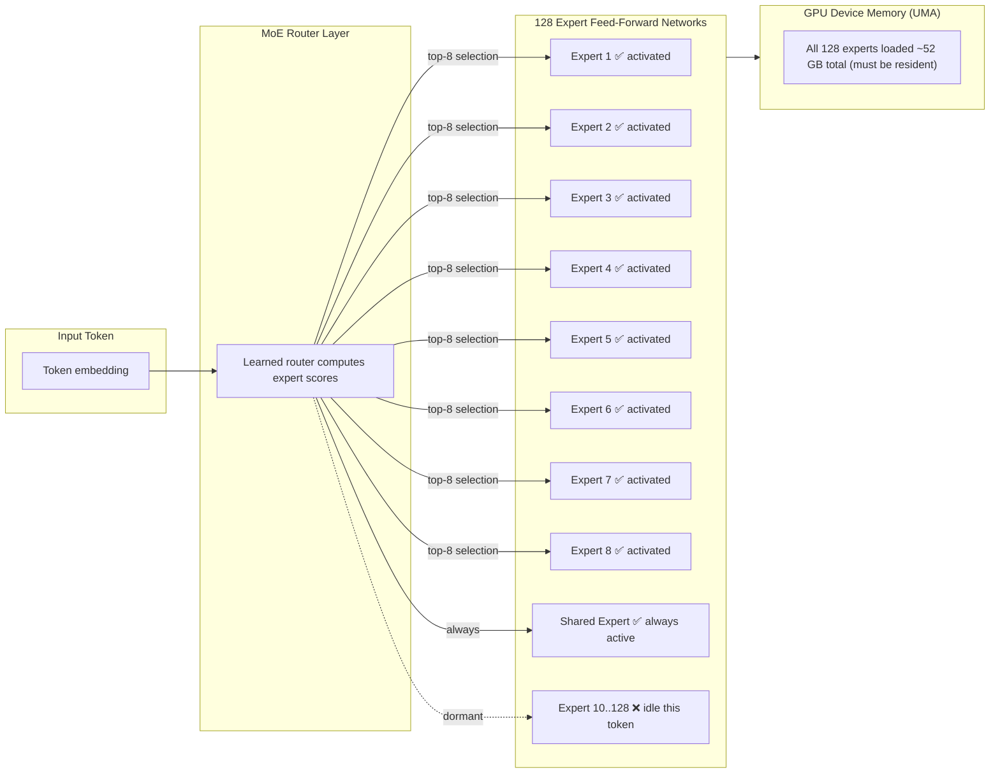

> **Key consequence:** While only 9 experts (~4B parameters) are used per token, **all 26B parameters must be loaded into GPU device memory** because the router can select any expert at any time — this is why its baseline memory requirement is much closer to a dense 26B model than a 4B model.[^gemma4-google-ai-docs]
{:.note}

### 2.2 Model Specifications

| Property | Value |
|---|---|
| Architecture | Mixture-of-Experts (MoE) |
| Total parameters | 26B |
| Active parameters per token | ~4B (8 selected + 1 shared) |
| Expert count | 128 experts + 1 shared[^gemma4-nvfp4] |
| Attention type | Hybrid: local sliding window + global |
| Head dimensions | Local: 256 · Global: 512 (heterogeneous) |
| Context window | 256K tokens[^gemma4-hf-model-card] |
| Sliding window size | 1024 tokens (local layers) |
| Weights on disk (bf16) | ~50 GB (2 shards) |
| Weights in GPU memory (bf16) | ~52 GB |
| Weights in memory (Q4_K_M) | ~13 GB |
| HuggingFace model ID | `google/gemma-4-26B-A4B-it` |
| Ollama tag | `gemma4:26b` |
| Licence | Apache 2.0 |

### 2.3 Shard Structure

The HuggingFace checkpoint ships as two safetensors shards. The safetensors format stores weights as contiguous raw binary blocks and uses OS-level memory mapping for efficient access.[^safetensors-format-explained]

| Shard | Size (bf16) | Contents |
|---|---|---|
| `model-00001-of-00002.safetensors` | ~46.5 GB | Most expert weights, embeddings |
| `model-00002-of-00002.safetensors` | ~3.5 GB | Remaining layers, output head |
| **Total** | **~50 GB** | Full model |

The large shard 1 size (~46.5 GB) is the root cause of the mmap failures documented in this guide.

---

## 3. Memory Architecture — The APU Constraint

### 3.1 Unified Memory — How It Works

Unlike discrete GPUs which have dedicated GDDR/HBM, the Radeon 890M shares the same physical LPDDR5X DIMMs as the CPU.[^wccftech-x1pro] The BIOS partitions this single pool via a **UMA (Unified Memory Architecture) framebuffer** setting.

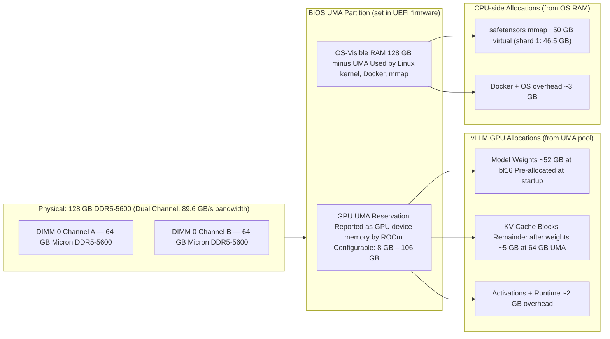

### 3.2 BIOS UMA Impact — Observed Configurations

| BIOS UMA Setting | OS Sees | GPU device mem | 26B A4B Result |
|---|---|---|---|
| ~106 GB (auto, 128 GB RAM) | ~22 GB | 106 GB | ❌ mmap fails — OS RAM too small |
| ~66 GB (auto, 96 GB RAM) | ~62 GB | 66 GB | ❌ mmap fails without overcommit |
| **64 GB (manual — recommended)** | **~64 GB** | **64 GB** | ✅ Loads with overcommit=1 |
| 16 GB (manual) | ~112 GB | 16 GB | ❌ GPU OOM — weights need ~52 GB |
| 8 GB (manual) | ~120 GB | 8 GB | ❌ GPU OOM — weights need ~52 GB |

*Recommended BIOS UMA: **64 GB***{:.ok} for the 26B A4B model.

### 3.3 Memory Budget Mathematics

#### GPU Device Memory Budget

All 26B expert weights must reside in GPU device memory simultaneously.[^gemma4-google-ai-docs]

$$W_{26B} = 26 \times 10^9 \text{ params} \times 2 \text{ bytes (bfloat16)} = 52 \text{ GB}$$

Adding runtime overhead (activations, graph buffers, HIP runtime):

$$M_{GPU}^{total} = W_{26B} + M_{overhead} \approx 52 + 2 = 54 \text{ GB}$$

With 64 GB UMA and `--gpu-memory-utilization 0.92`:

$$M_{budget} = 64 \times 0.92 = 58.88 \text{ GB}$$

$$M_{KV}^{available} = M_{budget} - M_{GPU}^{total} = 58.88 - 54 = \mathbf{4.88 \text{ GB}}$$

#### Context Length from KV Cache

Approximate context tokens supported at the available KV cache size:

$$N_{tokens} \approx \frac{M_{KV}^{available}}{0.5 \text{ MB / 1K tokens}} = \frac{4.88 \times 10^3 \text{ MB}}{0.5 \text{ MB}} \times 1000 \approx \mathbf{9{,}760 \text{ tokens}}$$

#### CPU-side mmap Budget

The safetensors loader maps the raw bf16 file into virtual address space before any GPU transfer.[^safetensors-mmap-issue] The entire shard file is mapped at once via the OS `mmap()` syscall:[^safetensors-format-explained]

$$M_{mmap} = \text{shard}_1 + \text{shard}_2 \approx 46.5 \text{ GB} + 3.5 \text{ GB} = 50 \text{ GB}$$

Linux's CommitLimit under default `overcommit_memory=0` heuristic mode:[^kernel-overcommit-docs]

$$\text{CommitLimit} = \left(\text{MemTotal} \times \frac{\text{overcommit\_ratio}}{100}\right) + \text{Swap}$$

With 64 GB OS RAM, `overcommit_ratio=50` (default), 8 GB swap:[^redhat-overcommit]

$$\text{CommitLimit} = (64 \times 0.50) + 8 = 32 + 8 = \mathbf{40 \text{ GB}}$$

Since $M_{mmap} = 50 \text{ GB} > \text{CommitLimit} = 40 \text{ GB}$, the kernel refuses the mmap with `ENOMEM` (errno 12).[^baeldung-overcommit]

> **Fix:** `vm.overcommit_memory=1` bypasses CommitLimit checking entirely, allowing the virtual address reservation.[^kernel-overcommit-docs] Physical pages are then demand-paged from NVMe as weights are accessed.
{:.ok}

#### Memory Bandwidth — Inference Throughput Ceiling

DDR5-5600 dual-channel theoretical peak bandwidth:[^minisforum-eu]

$$BW_{max} = 2 \times 5600 \text{ MT/s} \times 8 \text{ bytes} = 89.6 \text{ GB/s}$$

For MoE inference, only active expert weights are read per token (~4B params at bf16):[^gemma4-hf-model-card]

$$BW_{token}^{bf16} = 4 \times 10^9 \times 2 \text{ bytes} = 8 \text{ GB/token}$$

Theoretical throughput ceiling:

$$t/s_{ceiling}^{vLLM} = \frac{89.6}{8} = \mathbf{11.2 \text{ t/s}}$$

Measured: **~7 t/s** — the gap below ceiling is due to attention computation, kernel launch overhead, and scheduling latency.

---

## 4. Issue Taxonomy

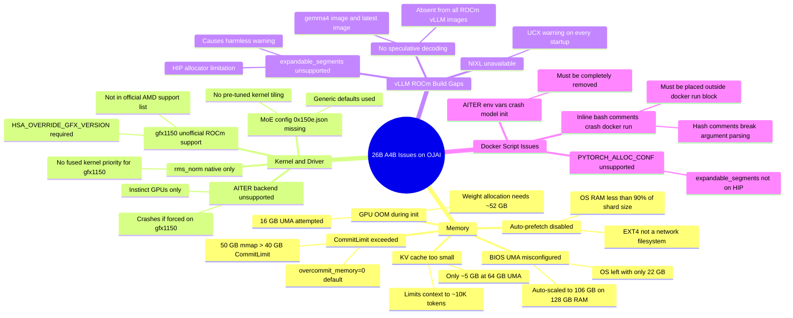

---

## 5. Issue Deep-Dives

### 5.1 The mmap Failure Chain

This was the first and most persistent failure. Every attempted run failed at the same point: the safetensors loader trying to memory-map shard 1. This is a known issue when safetensors files are larger than available system RAM.[^safetensors-mmap-issue]

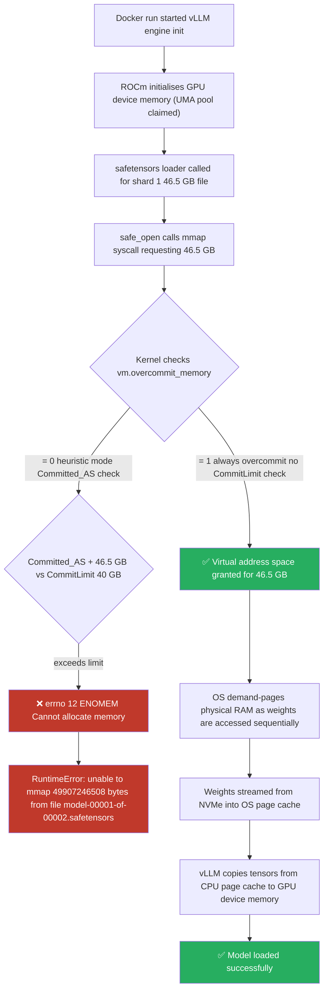

#### The Three mmap Failure Scenarios Encountered

| RAM | BIOS UMA | OS RAM | CommitLimit | mmap 46.5 GB | Result |
|---|---|---|---|---|---|
| 64 GB | ~34 GB | ~30 GB | ~23 GB | ❌ | ENOMEM |
| 96 GB | ~66 GB | ~62 GB | ~39 GB | ❌ | ENOMEM |
| 128 GB | ~106 GB | ~22 GB | ~19 GB | ❌ | ENOMEM |
| 128 GB | 64 GB + overcommit=1 | ~64 GB | bypassed | ✅ | Loads |

### 5.2 BIOS UMA Configuration Journey

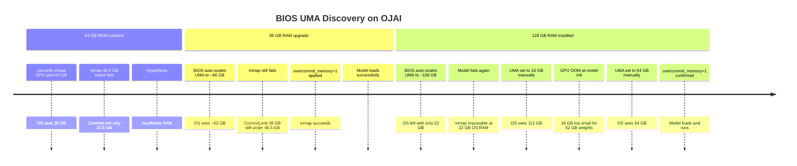

### 5.3 GPU OOM During Model Initialisation

When BIOS UMA was set to 16 GB (to maximise OS RAM), the engine crashed before loading any weights. The failure occurred during model graph construction:

```
Gemma4Model.__init__()
  └── Gemma4DecoderLayer.__init__()
        └── Gemma4MoE.__init__()
              └── FusedMoE.__init__()
                    └── UnquantizedFusedMoEMethod.create_weights()
                          └── torch.empty(expert_weight_tensor)
                                ↳ HIP out of memory
                                  GPU 0: 16.00 GiB total
                                  296.00 MiB free
                                  Tried to allocate: 968.00 MiB
```

vLLM pre-allocates **empty** GPU tensors for all expert weights before loading checkpoint values.[^gemma4-nvfp4] This means the full ~52 GB weight footprint must fit in GPU device memory before a single value is loaded from disk. A 16 GB UMA can never satisfy this requirement.

> *Required minimum UMA for 26B A4B: ~56 GB. Recommended: 64 GB.*
{:.warn}

### 5.4 Auto-Prefetch Disabled

vLLM 0.20.1 introduced intelligent prefetch that pipelines shard loading with GPU transfer. It was disabled on OJAI:

```
Checkpoint size: 58.25 GiB. Available RAM: 22.20 GiB.
Auto-prefetch is disabled because the filesystem (EXT4) is not a recognized
network FS (NFS/Lustre) and the checkpoint size (58.25 GiB) exceeds 90%
of available RAM (22.20 GiB).
```

The prefetch threshold check:

$$\text{Prefetch enabled iff: } \text{AvailableRAM} \geq 0.9 \times \text{CheckpointSize}$$

$$22.20 \text{ GB} \geq 0.9 \times 50 \text{ GB} = 45 \text{ GB} \quad \Rightarrow \text{ FALSE}$$

> This is the **correct decision** — forcing prefetch with only 22 GB RAM for a 50 GB checkpoint would saturate the 8 GB swap. The NVMe loads both shards in under 20 seconds sequentially, which is acceptable.
{:.ok}

### 5.5 Docker Script Bash Parsing Error

An unexpected source of failure: inline `#` comments inside multi-line `docker run` commands break bash argument parsing, causing all subsequent arguments including `$IMAGE` to be silently dropped:

```bash
# This BREAKS bash argument parsing:
docker run --rm -it \
  -e HSA_OVERRIDE_GFX_VERSION=11.5.0 \
  # This comment terminates the command ← ERROR
  -e HSA_ENABLE_SDMA=0 \
  "$IMAGE" "$MODEL"
```

Error produced:
```
docker: 'docker run' requires at least 1 argument
Usage:  docker run [OPTIONS] IMAGE [COMMAND] [ARG...]
```

> All comments must be placed **outside** the `docker run` block.
{:.warn}

---

## 6. Backend Limitations

### 6.1 MoE Backend Selection — What Gets Chosen for gfx1150

vLLM iterates a priority-ordered list of MoE backends and selects the first one that passes the `is_supported_config()` check for the current platform.[^vllm-rocm-optimisation]

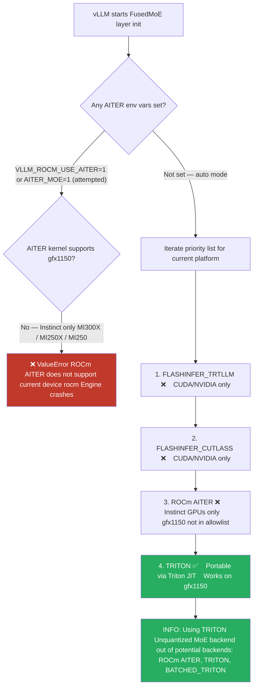

### 6.2 Backend Support Matrix for gfx1150

| Backend | gfx1150 | Why |
|---|---|---|
| `FLASHINFER_TRTLLM` | ❌ | NVIDIA CUDA only, not compiled for ROCm |
| `FLASHINFER_CUTLASS` | ❌ | NVIDIA CUDA only, not compiled for ROCm |
| `ROCm AITER` | ❌ | AMD Instinct only (MI300X, MI250X, MI250)[^aiter-rdna-unsupported] |
| **`TRITON`** | ✅ | Portable Triton JIT — works via HSA override |
| `BATCHED_TRITON` | ✅ | Batched variant for specific activation formats |
| Speculative decoding | ❌ | Not in any ROCm vLLM build (0.18.x, 0.20.1)[^vllm-rocm-install] |

### 6.3 Missing MoE Tuning Configuration

vLLM ships pre-tuned JSON tiling configs for known GPU chip IDs in its `fused_moe/configs/` directory. The Radeon 890M chip ID `0x150e` has no config. Without this file, the Triton MoE kernel uses generic conservative defaults for tile sizes, block dimensions, and split counts — the same problem has been noted across RDNA consumer GPUs.[^rocm-device-wishlist] Startup warning:

```
Using default MoE config. Performance might be sub-optimal!
Config file not found at
.../fused_moe/configs/E=128,N=704,device_name=0x150e.json
```

### 6.4 Attention Backend — Forced to TRITON

Gemma 4 uses heterogeneous head dimensions (local layers: 256, global layers: 512). vLLM detects this and forces the TRITON attention backend regardless of other settings:

```
INFO: Gemma4 model has heterogeneous head dimensions
      (head_dim=256, global_head_dim=512).
      Forcing TRITON_ATTN backend to prevent mixed-backend
      numerical divergence.
```

This is correct behaviour — mixing attention backends across layers would produce numerically incorrect outputs.

### 6.5 Missing gfx1150 Kernel Priorities

The `rms_norm` operation has no tuned kernel priority for gfx1150:

```
Final IR op priority after setting platform defaults:
IrOpPriorityConfig(rms_norm=['native'])
```

> `native` means plain PyTorch rather than a fused Triton kernel. A fused kernel computes normalisation in a single GPU pass without writing intermediate values back to memory — important on a memory-bandwidth-limited APU. Note that AOTriton 0.10b does list `gfx1150` as an experimentally supported target,[^pytorch-rocm-compat] suggesting fused kernel priority configs may arrive in a future ROCm PyTorch release.
{:.note}

### 6.6 ROCm vLLM Feature Gap

| Feature | CUDA vLLM | ROCm vLLM 0.20.1 | Impact on 26B |
|---|---|---|---|
| Speculative decoding | ✅ | ❌[^vllm-rocm-install] | −8–12 t/s potential gain lost |
| AITER MoE kernels | N/A | ❌ gfx1150[^aiter-rdna-unsupported] | −20–40% MoE throughput |
| Pre-tuned MoE configs | ✅ | ❌ 0x150e | Suboptimal kernel tiling |
| Flash Attention v2 | ✅ | TRITON fallback | Minor |
| `expandable_segments` | ✅ | ❌ HIP limit | Minor allocator overhead |
| TunableOp GEMM | ✅ | ✅[^tunableop-blog] | +5–20% after cache built |
| Prefix caching | ✅ | ✅[^vllm-docs] | System prompt reuse |
| Chunked prefill | ✅ | ✅[^vllm-docs] | Long-context efficiency |
| Tool calling | ✅ | ✅ | Full support with gemma4 parser |

---

## 7. Performance Analysis

### 7.1 Observed Throughput

| Runtime | Model format | t/s | Context | Use case |
|---|---|---|---|---|
| Ollama[^unsloth-gguf] | Q4_K_M (~13 GB) | **17** | ~8K default | Single user, personal |
| vLLM bf16 | bfloat16 (~52 GB) | **7** | 32K configured | API server, multi-user |
| vLLM bf16 + TunableOp[^tunableop-blog] | bfloat16 (~52 GB) | ~12 | 32K configured | After first-run tuning |

### 7.2 Why Ollama is Faster for Single-User Decode

The difference is entirely due to bytes-per-parameter read per token. Inference on memory-bandwidth-limited hardware (like APUs) is bottlenecked by how much data must be read from DRAM per generated token.[^vllm-pagedattention-article]

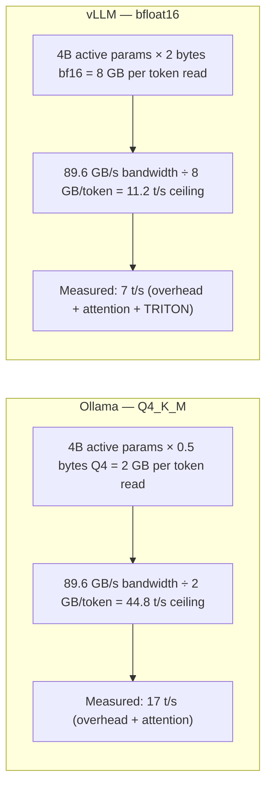

The **4× difference in bytes per parameter** (Q4_K_M vs bfloat16) directly explains the throughput ratio:

$$\frac{t/s_{Ollama}}{t/s_{vLLM}} \approx \frac{BW_{token}^{vLLM}}{BW_{token}^{Ollama}} = \frac{8 \text{ GB}}{2 \text{ GB}} = 4\times \quad \text{(theoretical)}$$

$$\frac{17}{7} \approx 2.4\times \quad \text{(measured — gap narrowed by vLLM scheduling efficiency)}$$

### 7.3 Multi-User Throughput — Where vLLM Wins

vLLM uses PagedAttention and continuous batching — a technique that processes requests at the iteration level, immediately filling slots freed by completed requests rather than waiting for a full batch to finish.[^vllm-wiki] Ollama processes requests sequentially:

$$\text{Total throughput}_{Ollama}^{N \text{ users}} = 17 \text{ t/s (shared, each user waits)}$$

$$\text{Total throughput}_{vLLM}^{N \text{ users}} \approx \min\!\left(N \times 7,\ BW_{ceiling}\right)$$

For 5 concurrent users:

$$\text{vLLM aggregate} \approx 35 \text{ t/s} \quad \text{vs} \quad \text{Ollama} = 17 \text{ t/s (all 5 users sharing)}$$

For single-user personal use, Ollama is faster. For a shared API server serving multiple clients, vLLM provides roughly double the aggregate throughput.

### 7.4 TunableOp Impact

`PYTORCH_TUNABLEOP_TUNING=1` instructs PyTorch to benchmark every available HIP GEMM kernel configuration on first run and cache the fastest per matrix shape.[^tunableop-rocm-docs] Results are saved to a CSV file and reused on subsequent runs — a standard optimisation technique for ROCm AI workloads.[^tunableop-blog]

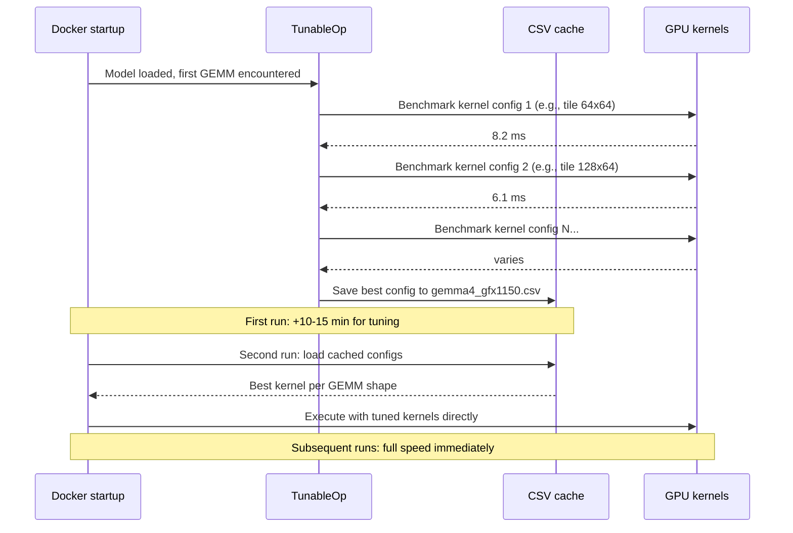

Expected throughput after tuning: *~12 t/s*{:.ok} (from ~7 t/s baseline).

---

## 8. Resolution Matrix

### 8.1 Complete Issue → Fix Map

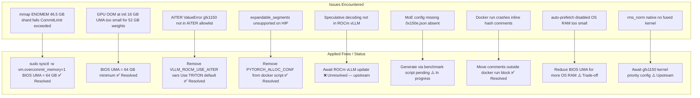

### 8.2 Current Status Summary

| Issue | Status | Fix Applied |
|---|---|---|
| mmap ENOMEM on shard 1 | ✅ Resolved | `vm.overcommit_memory=1` + BIOS UMA 64 GB |
| GPU OOM at model init | ✅ Resolved | BIOS UMA = 64 GB |
| AITER backend crash | ✅ Resolved | Removed `VLLM_ROCM_USE_AITER*` env vars |
| `expandable_segments` warning | ✅ Resolved | Removed `PYTORCH_ALLOC_CONF` |
| Docker script bash error | ✅ Resolved | Moved all `#` comments outside docker run |
| Speculative decoding missing | ❌ Open | ROCm vLLM upstream limitation[^vllm-rocm-install] |
| MoE config 0x150e.json | ⚠️ Partial | Using generic defaults; generation pending |
| Auto-prefetch disabled | ⚠️ Acceptable | EXT4 + RAM constraint; sequential load OK |
| `rms_norm` native fallback | ⚠️ Acceptable | Minor cost; awaiting upstream gfx1150 config[^pytorch-rocm-compat] |

---

## 9. Recommendations

### 9.1 Pre-Flight Checklist

> Verify the following before every `docker run` to avoid preventable failures.
{:.info}

```bash
# 1. OS RAM must be ~64 GB (confirms BIOS UMA = 64 GB)
free -h

# 2. overcommit must be 1
cat /proc/sys/vm/overcommit_memory

# 3. If not 1, set it (and make permanent):
sudo sysctl -w vm.overcommit_memory=1
echo "vm.overcommit_memory=1" | sudo tee /etc/sysctl.d/99-rocm-vllm.conf
sudo sysctl -p /etc/sysctl.d/99-rocm-vllm.conf

# 4. TunableOp cache directory must exist
mkdir -p "$HOME/.cache/tunableop"
```

### 9.2 Definitive Working Docker Script

```bash
#!/usr/bin/env bash
set -euo pipefail

IMAGE=vllm/vllm-openai-rocm:latest
MODEL=google/gemma-4-26B-A4B-it

mkdir -p "$HOME/.cache/tunableop"
sudo sysctl -w vm.overcommit_memory=1

docker run --rm -it \
  --name vllm-gemma4 \
  --network=host \
  --ipc=host \
  --shm-size=4G \
  --ulimit memlock=-1 \
  \
  --device=/dev/kfd \
  --device=/dev/dri \
  --group-add=video \
  --group-add=render \
  --cap-add=SYS_PTRACE \
  --security-opt seccomp=unconfined \
  \
  -e HSA_OVERRIDE_GFX_VERSION=11.5.0 \
  -e HSA_ENABLE_SDMA=0 \
  -e ROCBLAS_USE_HIPBLASLT=1 \
  -e HIP_FORCE_DEV_KERNARG=1 \
  -e SAFETENSORS_FAST_GPU=1 \
  -e TORCH_ROCM_AOTRITON_ENABLE_EXPERIMENTAL=1 \
  -e PYTORCH_TUNABLEOP_ENABLED=1 \
  -e PYTORCH_TUNABLEOP_TUNING=1 \
  -e PYTORCH_TUNABLEOP_VERBOSE=0 \
  -e PYTORCH_TUNABLEOP_FILENAME=/root/.cache/tunableop/gemma4_gfx1150.csv \
  -e NCCL_P2P_DISABLE=1 \
  -e NCCL_SHM_DISABLE=1 \
  -e TOKENIZERS_PARALLELISM=false \
  -e HF_TOKEN="${HF_TOKEN:-}" \
  \
  -v "$HOME/.cache/huggingface:/root/.cache/huggingface" \
  -v "$HOME/.cache/vllm:/root/.cache/vllm" \
  -v "$HOME/.cache/tunableop:/root/.cache/tunableop" \
  -v "$HOME/models:/app/models" \
  -v "$HOME/workspace:/app/workspace" \
  \
  "$IMAGE" \
    "$MODEL" \
    --dtype bfloat16 \
    --max-model-len 32768 \
    --gpu-memory-utilization 0.92 \
    --enable-prefix-caching \
    --enable-auto-tool-choice \
    --tool-call-parser gemma4 \
    --max-num-seqs 4 \
    --block-size 32 \
    --disable-log-requests \
    --host 0.0.0.0 \
    --port 8000
```

### 9.3 vLLM Flag Explanations

| Flag | Value | Reason |
|---|---|---|
| `--dtype bfloat16` | bfloat16 | Native AMD dtype — avoids the cast overhead warned in startup logs |
| `--max-model-len 32768` | 32K tokens | Balances KV cache size vs context length at 64 GB UMA |
| `--gpu-memory-utilization 0.92` | 92% | Leaves 8% headroom for runtime fragmentation |
| `--enable-prefix-caching` | on | Reuses KV cache for repeated system prompts[^vllm-docs] |
| `--enable-auto-tool-choice` | on | Enables function/tool calling |
| `--tool-call-parser gemma4` | gemma4 | Gemma 4 specific tool call format |
| `--max-num-seqs 4` | 4 | Tuned for single APU — reduces scheduler overhead[^vllm-rocm-optimisation] |
| `--block-size 32` | 32 | Larger KV blocks reduce PagedAttention table lookups[^vllm-wiki] |
| `--disable-log-requests` | on | Removes per-request stdout overhead |

### 9.4 Environment Variable Reference

| Variable | Status | Effect |
|---|---|---|
| `HSA_OVERRIDE_GFX_VERSION=11.5.0` | ✅ Required | Enables ROCm on gfx1150[^llm-tracker-amd] |
| `HSA_ENABLE_SDMA=0` | ✅ Recommended | Faster APU unified memory transfer path |
| `ROCBLAS_USE_HIPBLASLT=1` | ✅ Recommended | Faster GEMM via hipBLASLt[^tunableop-rocm-docs] |
| `HIP_FORCE_DEV_KERNARG=1` | ✅ Recommended | Kernel argument optimisation for HIP |
| `SAFETENSORS_FAST_GPU=1` | ✅ Recommended | Faster weight loading from safetensors |
| `TORCH_ROCM_AOTRITON_ENABLE_EXPERIMENTAL=1` | ✅ Recommended | AOTriton experimental attention kernels[^pytorch-rocm-compat] |
| `PYTORCH_TUNABLEOP_ENABLED=1` | ✅ Recommended | Auto-tune GEMM kernels for gfx1150[^tunableop-blog] |
| `PYTORCH_TUNABLEOP_TUNING=1` | ✅ First run only | Benchmark kernels (slow first run, fast thereafter)[^tunableop-rocm-docs] |
| `NCCL_P2P_DISABLE=1` | ✅ Recommended | Remove unused P2P multi-GPU overhead |
| `NCCL_SHM_DISABLE=1` | ✅ Recommended | Remove unused shared-mem multi-GPU overhead |
| `VLLM_ROCM_USE_AITER=1` | ❌ Do not use | Crashes model init on gfx1150[^aiter-rdna-unsupported] |
| `VLLM_ROCM_USE_AITER_MOE=1` | ❌ Do not use | Crashes model init on gfx1150[^aiter-rdna-unsupported] |
| `PYTORCH_ALLOC_CONF=expandable_segments:True` | ❌ Do not use | Unsupported on HIP, causes warning |
| `ROCM_USE_FLASH_ATTN_V2=1` | ⚠️ No effect | Overridden by TRITON_ATTN forced by Gemma 4 |
| `GPU_ARCHS=gfx1150` | ⚠️ No effect | Compile-time flag only, ignored at runtime |

> The three `❌ Do not use` variables — *`VLLM_ROCM_USE_AITER=1`*{:.bad}, *`VLLM_ROCM_USE_AITER_MOE=1`*{:.bad}, and *`PYTORCH_ALLOC_CONF=expandable_segments:True`*{:.bad} — must be completely absent from your environment. Any one of them will crash model initialisation or produce spurious warnings on gfx1150.
{:.bad}

### 9.5 Throughput Improvement Roadmap

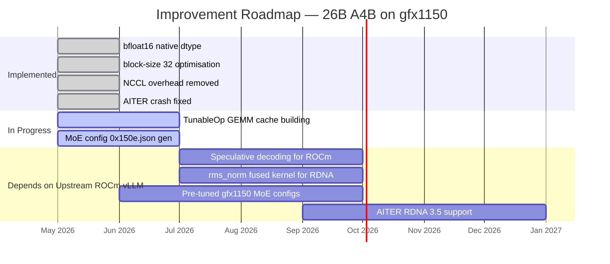

### 9.6 vLLM vs Ollama — When to Use Which

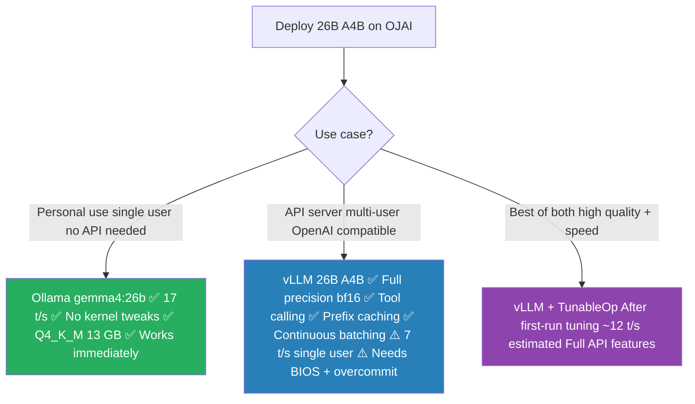

---

## Appendix A — Kernel / ROCm Logs Reference

### A.1 Startup Log Message Interpretation

| Log Message | Meaning | Severity | Action |
|---|---|---|---|
| `Using TRITON_ATTN backend` | Attention via Triton — correct for gfx1150 | Info | None |
| `Using TRITON Unquantized MoE backend` | Only viable MoE option for gfx1150[^aiter-rdna-unsupported] | Info | None |
| `IrOpPriorityConfig(rms_norm=['native'])` | No fused norm kernel for gfx1150 | Minor perf cost | Await upstream fix |
| `MoE config not found at ...0x150e.json` | Generic kernel tiling used | Moderate perf cost | Generate config |
| `expandable_segments not supported` | HIP allocator does not support this | Harmless warning | Remove env var |
| `GELU tanh approximation unstable` | Compile-time fallback to 'none' approximation | Harmless | No action |
| `sparse_attn_indexer not present` | Not applicable to Gemma 4 architecture | Harmless | No action |
| `NIXL is not available` | Multi-node transport absent — single GPU fine | Harmless | No action |
| `Auto-prefetch is disabled` | OS RAM < 90% of checkpoint size | Load time +20s | Reduce BIOS UMA |
| `Casting torch.bfloat16 to torch.float16` | Wrong `--dtype` specified | Performance hit | Use `--dtype bfloat16` |
| `Asynchronous scheduling is enabled` | vLLM async mode active | Info | None |
| `speculative_config=None` | Speculative decoding off (unavailable)[^vllm-rocm-install] | Info | None |

### A.2 Key Diagnostic Commands

```bash
# Verify OS RAM (should be ~62-64 GB with BIOS UMA=64 GB)
free -h

# Verify physical RAM installed (should show 2 × 64 GB)
sudo dmidecode -t memory | grep -E 'Size:|Manufacturer:|Speed:'

# Calculate BIOS UMA reservation
# UMA = (dmidecode total) - (free -h total)
# e.g., 128 GB - 64 GB = 64 GB UMA

# Verify overcommit setting
cat /proc/sys/vm/overcommit_memory   # must output: 1

# Check CommitLimit vs current commitment
cat /proc/meminfo | grep -E 'MemTotal|MemAvailable|CommitLimit|Committed_AS'

# Check GPU device memory visible to ROCm
amd-smi metric --mem

# Verify GPU detection
rocminfo | grep -A5 "Agent 2"   # should show gfx1150

# Check vLLM version in image
docker run --rm \
  --device=/dev/kfd --device=/dev/dri \
  --group-add=video --group-add=render \
  -e HSA_OVERRIDE_GFX_VERSION=11.5.0 \
  --entrypoint bash \
  vllm/vllm-openai-rocm:latest \
  -c "python3 -c 'import vllm; print(vllm.__version__)'"

# Verify TRITON MoE backend selected (not AITER)
# Expected: Using TRITON Unquantized MoE backend
docker run ... "$IMAGE" "$MODEL" ... 2>&1 | grep -i "moe backend"

# Make overcommit permanent
echo "vm.overcommit_memory=1" | sudo tee /etc/sysctl.d/99-rocm-vllm.conf
sudo sysctl -p /etc/sysctl.d/99-rocm-vllm.conf
```

### A.3 Error Code Reference

| Error Message | Root Cause | Fix |
|---|---|---|
| `RuntimeError: unable to mmap 49907246508 bytes ... Cannot allocate memory (12)` | CommitLimit exceeded — 46.5 GB shard vs 40 GB limit[^baeldung-overcommit] | `vm.overcommit_memory=1`[^kernel-overcommit-docs] |
| `torch.OutOfMemoryError: HIP out of memory. GPU 0 has a total capacity of 16.00 GiB` | BIOS UMA too small — 52 GB weights need ≥56 GB | Set BIOS UMA to 64 GB |
| `ValueError: Unquantized MoE backend ROCm AITER does not support ... current device rocm` | AITER forced on non-Instinct GPU[^aiter-rdna-unsupported] | Remove `VLLM_ROCM_USE_AITER*` env vars |
| `vllm: error: unrecognized arguments: --speculative-model` | Speculative decode not in ROCm vLLM[^vllm-rocm-install] | Remove flag entirely |
| `ValueError: No available memory for the cache blocks` | Weights exceed vLLM GPU budget | Increase UMA or lower `--gpu-memory-utilization` |
| `docker run requires at least 1 argument` | Inline `#` comments in docker run | Move all comments outside the docker run block |
| `UserWarning: expandable_segments not supported on this platform` | HIP allocator limitation | Remove `PYTORCH_ALLOC_CONF=expandable_segments:True` |
| `MoE backend ... does not support the deployment configuration` | Wrong backend forced | Let vLLM auto-select (TRITON) |


[^minisforum-product]: MINISFORUM. *AI X1 Pro Mini PC \| AMD Ryzen AI 9 HX 470 \| Copilot-Powered AI Computer.* [https://store.minisforum.com/products/minisforum-ai-x1-pro-470-mini-pc](https://store.minisforum.com/products/minisforum-ai-x1-pro-470-mini-pc){:target="_blank" rel="noopener noreferrer"}

[^techradar-ces]: Loverro, A. *Minisforum beats Dell, HP and Lenovo to unveil first Ryzen AI 9 HX470 PC.* TechRadar Pro, January 2026. [https://www.techradar.com/pro/minisforum-beats-dell-hp-and-lenovo-to-unveil-first-ryzen-ai-9-hx470-pc-ai-x1-pro-470-mini-pc-supports-12tb-ssd-storage-and-up-to-128gb-ddr5](https://www.techradar.com/pro/minisforum-beats-dell-hp-and-lenovo-to-unveil-first-ryzen-ai-9-hx470-pc-ai-x1-pro-470-mini-pc-supports-12tb-ssd-storage-and-up-to-128gb-ddr5){:target="_blank" rel="noopener noreferrer"}

[^minisforum-eu]: MINISFORUM EU. *AI X1 Pro-470 AI Mini PC.* [https://minisforumpc.eu/products/minisforum-ai-x1-pro-470-ai-mini-pc](https://minisforumpc.eu/products/minisforum-ai-x1-pro-470-ai-mini-pc){:target="_blank" rel="noopener noreferrer"}

[^wccftech-x1pro]: Hassan, M. *Minisforum Updates Mini PC Lineup With AI X1 Pro-470 "AMD Ryzen AI 9 HX 470".* Wccftech, January 2026. [https://wccftech.com/minisforum-mini-pc-2026-ai-x1-pro-470-amd-ryzen-ai-9-hx-470-ms-02-ultra-intel-core-ultra-9-295hx/](https://wccftech.com/minisforum-mini-pc-2026-ai-x1-pro-470-amd-ryzen-ai-9-hx-470-ms-02-ultra-intel-core-ultra-9-295hx/){:target="_blank" rel="noopener noreferrer"}

[^liliputing-update]: Linder, B. *MINISFORUM AI X1 Pro mini PC gets a Ryzen AI 9 HX 470 update.* Liliputing, January 2026. [https://liliputing.com/minisforum-ai-x1-pro-mini-pc-get-a-ryzen-ai-9-hx-470-update/](https://liliputing.com/minisforum-ai-x1-pro-mini-pc-get-a-ryzen-ai-9-hx-470-update/){:target="_blank" rel="noopener noreferrer"}

[^amd-instinct-wiki]: Wikipedia. *AMD Instinct.* [https://en.wikipedia.org/wiki/AMD_Instinct](https://en.wikipedia.org/wiki/AMD_Instinct){:target="_blank" rel="noopener noreferrer"}

[^rocm-device-support]: AMD ROCm Documentation. *System requirements (Linux).* [https://rocm.docs.amd.com/projects/install-on-linux/en/latest/reference/system-requirements.html](https://rocm.docs.amd.com/projects/install-on-linux/en/latest/reference/system-requirements.html){:target="_blank" rel="noopener noreferrer"}

[^gemma4-hf-model-card]: Google. *gemma-4-26B-A4B-it.* HuggingFace Model Card, 2026. [https://huggingface.co/google/gemma-4-26B-A4B-it](https://huggingface.co/google/gemma-4-26B-A4B-it){:target="_blank" rel="noopener noreferrer"}

[^gemma4-google-ai-docs]: Google AI for Developers. *Gemma 4 model overview.* [https://ai.google.dev/gemma/docs/core](https://ai.google.dev/gemma/docs/core){:target="_blank" rel="noopener noreferrer"}

[^gemma4-nvfp4]: bg-digitalservices. *Gemma-4-26B-A4B-it-NVFP4.* HuggingFace, 2026. [https://huggingface.co/bg-digitalservices/Gemma-4-26B-A4B-it-NVFP4](https://huggingface.co/bg-digitalservices/Gemma-4-26B-A4B-it-NVFP4){:target="_blank" rel="noopener noreferrer"}

[^unsloth-gguf]: Unsloth AI. *gemma-4-26B-A4B-it-GGUF.* HuggingFace, 2026. [https://huggingface.co/unsloth/gemma-4-26B-A4B-it-GGUF](https://huggingface.co/unsloth/gemma-4-26B-A4B-it-GGUF){:target="_blank" rel="noopener noreferrer"}

[^safetensors-format-explained]: Microscale Academy. *Safetensors Format Explained: LLM Weight Serialization.* [https://www.microscale.academy/act/packing/lesson/safetensors](https://www.microscale.academy/act/packing/lesson/safetensors){:target="_blank" rel="noopener noreferrer"}

[^safetensors-mmap-issue]: HuggingFace. *RuntimeError: unable to mmap ... from safetensors file larger than system RAM.* GitHub Issue #528, safetensors repository, 2024. [https://github.com/huggingface/safetensors/issues/528](https://github.com/huggingface/safetensors/issues/528){:target="_blank" rel="noopener noreferrer"}

[^kernel-overcommit-docs]: The Linux Kernel Documentation. *Overcommit Accounting.* [https://www.kernel.org/doc/html/v5.1/vm/overcommit-accounting.html](https://www.kernel.org/doc/html/v5.1/vm/overcommit-accounting.html){:target="_blank" rel="noopener noreferrer"}

[^redhat-overcommit]: Red Hat. *Configuring System Memory Capacity.* Red Hat Enterprise Linux 7 Performance Tuning Guide. [https://docs.redhat.com/en/documentation/red_hat_enterprise_linux/7/html/performance_tuning_guide/sect-red_hat_enterprise_linux-performance_tuning_guide-configuration_tools-configuring_system_memory_capacity](https://docs.redhat.com/en/documentation/red_hat_enterprise_linux/7/html/performance_tuning_guide/sect-red_hat_enterprise_linux-performance_tuning_guide-configuration_tools-configuring_system_memory_capacity){:target="_blank" rel="noopener noreferrer"}

[^baeldung-overcommit]: Baeldung. *Linux Overcommit Modes.* [https://www.baeldung.com/linux/overcommit-modes](https://www.baeldung.com/linux/overcommit-modes){:target="_blank" rel="noopener noreferrer"}

[^vllm-docs]: vLLM Project. *Welcome to vLLM!* Official documentation. [https://docs.vllm.ai/en/latest/](https://docs.vllm.ai/en/latest/){:target="_blank" rel="noopener noreferrer"}

[^vllm-wiki]: Wikipedia. *vLLM.* [https://en.wikipedia.org/wiki/VLLM](https://en.wikipedia.org/wiki/VLLM){:target="_blank" rel="noopener noreferrer"}

[^vllm-pagedattention-article]: RunPod. *vLLM Explained: PagedAttention, Continuous Batching, and Deploying High-Throughput LLM Inference in Production.* [https://www.runpod.io/articles/guides/vllm-pagedattention-continuous-batching](https://www.runpod.io/articles/guides/vllm-pagedattention-continuous-batching){:target="_blank" rel="noopener noreferrer"}

[^vllm-rocm-install]: vLLM Project. *GPU Installation Guide — AMD ROCm.* [https://docs.vllm.ai/en/stable/getting_started/installation/gpu/](https://docs.vllm.ai/en/stable/getting_started/installation/gpu/){:target="_blank" rel="noopener noreferrer"}

[^vllm-gfx1150-issue]: vLLM Project. *\[Doc\]: Update GPU requirements to include AMD gfx1150/gfx1151.* GitHub Issue #28310, vllm-project/vllm, November 2025. [https://github.com/vllm-project/vllm/issues/28310](https://github.com/vllm-project/vllm/issues/28310){:target="_blank" rel="noopener noreferrer"}

[^vllm-rocm-linux-docker]: AMD ROCm Documentation. *vLLM Linux Docker Image — Use ROCm on Radeon and Ryzen.* [https://rocm.docs.amd.com/projects/radeon-ryzen/en/latest/docs/advanced/advancedryz/linux/llm/build-docker-image.html](https://rocm.docs.amd.com/projects/radeon-ryzen/en/latest/docs/advanced/advancedryz/linux/llm/build-docker-image.html){:target="_blank" rel="noopener noreferrer"}

[^vllm-rocm-optimisation]: AMD ROCm Documentation. *vLLM V1 performance optimization.* [https://rocm.docs.amd.com/en/latest/how-to/rocm-for-ai/inference-optimization/vllm-optimization.html](https://rocm.docs.amd.com/en/latest/how-to/rocm-for-ai/inference-optimization/vllm-optimization.html){:target="_blank" rel="noopener noreferrer"}

[^aiter-rdna-unsupported]: ROCm/ROCm GitHub Discussion. *ROCm Device Support Wishlist — AITER / CK non-support for navi3/navi4.* Discussion #4276. [https://github.com/ROCm/ROCm/discussions/4276](https://github.com/ROCm/ROCm/discussions/4276){:target="_blank" rel="noopener noreferrer"}

[^llm-tracker-amd]: LLM Tracker. *AMD GPUs — Compatible iGPUs including Radeon 890M (gfx1150).* [https://llm-tracker.info/howto/AMD-GPUs](https://llm-tracker.info/howto/AMD-GPUs){:target="_blank" rel="noopener noreferrer"}

[^tunableop-blog]: AMD ROCm Blogs. *Accelerating models on ROCm using PyTorch TunableOp.* July 2024. [https://rocm.blogs.amd.com/artificial-intelligence/pytorch-tunableop/README.html](https://rocm.blogs.amd.com/artificial-intelligence/pytorch-tunableop/README.html){:target="_blank" rel="noopener noreferrer"}

[^tunableop-rocm-docs]: AMD ROCm Documentation. *AMD Instinct MI300X workload optimization — TunableOp.* [https://rocm.docs.amd.com/en/docs-6.3.1/how-to/rocm-for-ai/inference-optimization/workload.html](https://rocm.docs.amd.com/en/docs-6.3.1/how-to/rocm-for-ai/inference-optimization/workload.html){:target="_blank" rel="noopener noreferrer"}

[^tunableop-gemm-blog]: AMD ROCm Blogs. *GEMM Kernel Optimization For AMD GPUs.* February 2025. [https://rocm.blogs.amd.com/artificial-intelligence/gemm_blog/README.html](https://rocm.blogs.amd.com/artificial-intelligence/gemm_blog/README.html){:target="_blank" rel="noopener noreferrer"}

[^pytorch-rocm-compat]: AMD ROCm Documentation. *PyTorch compatibility — AOTriton experimental support for gfx1150.* [https://rocm.docs.amd.com/en/latest/compatibility/ml-compatibility/pytorch-compatibility.html](https://rocm.docs.amd.com/en/latest/compatibility/ml-compatibility/pytorch-compatibility.html){:target="_blank" rel="noopener noreferrer"}

[^rocm-device-wishlist]: ROCm/ROCm GitHub Discussion. *ROCm Device Support Wishlist.* Discussion #4276. [https://github.com/ROCm/ROCm/discussions/4276](https://github.com/ROCm/ROCm/discussions/4276){:target="_blank" rel="noopener noreferrer"}

