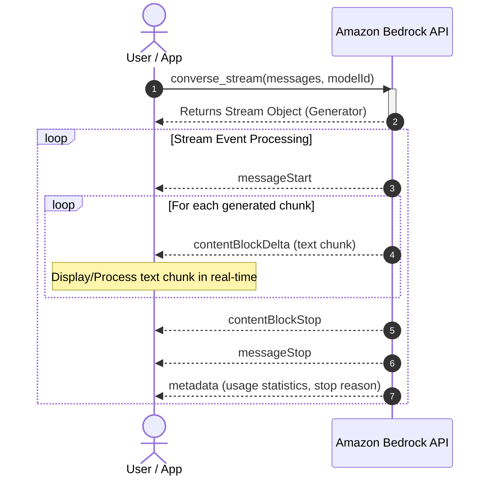
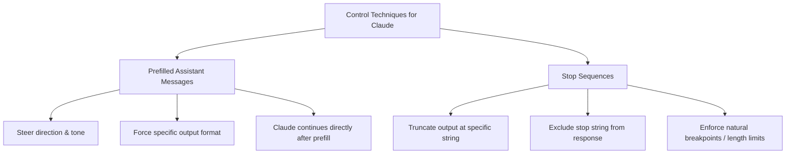
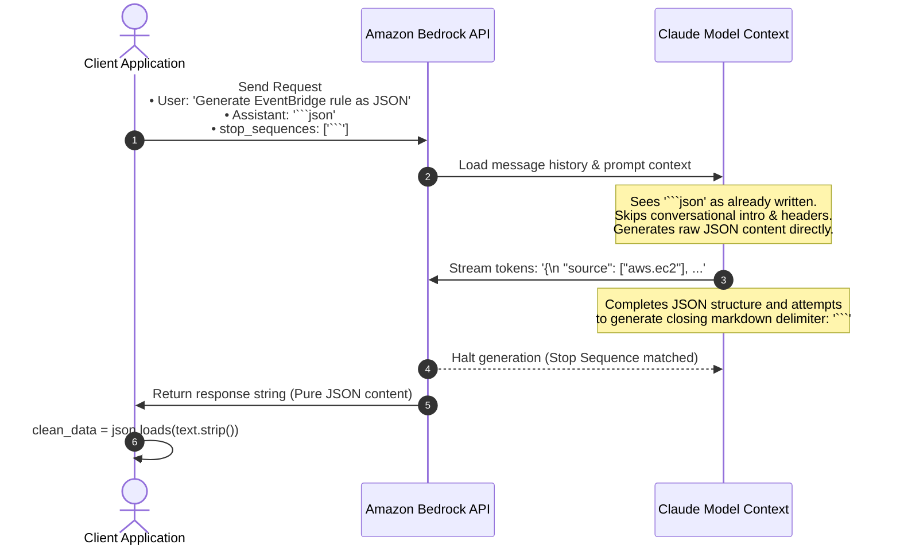
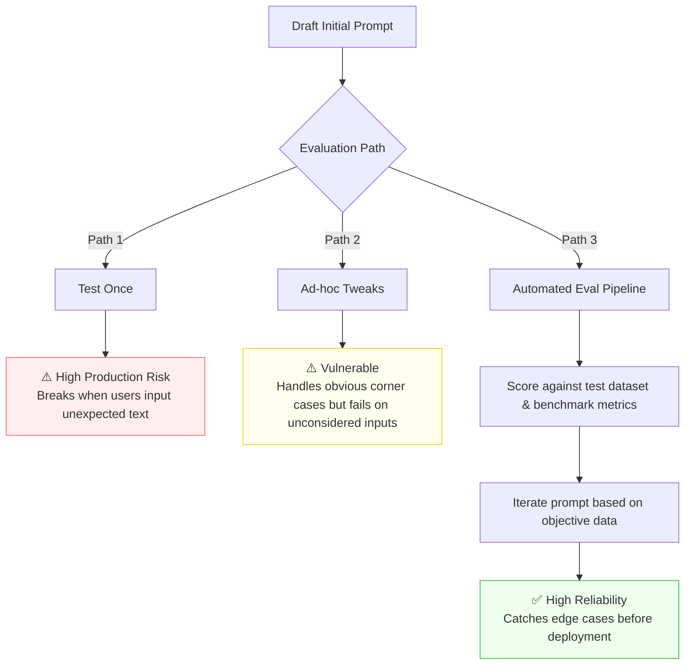
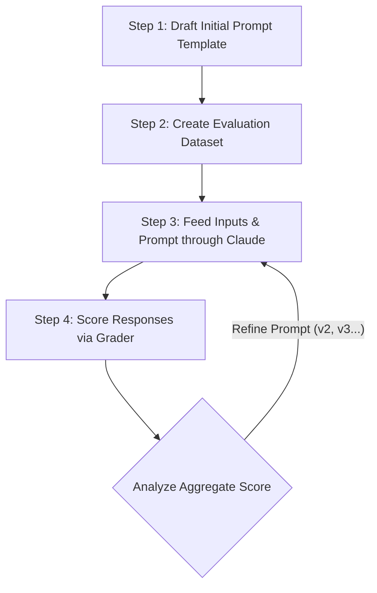
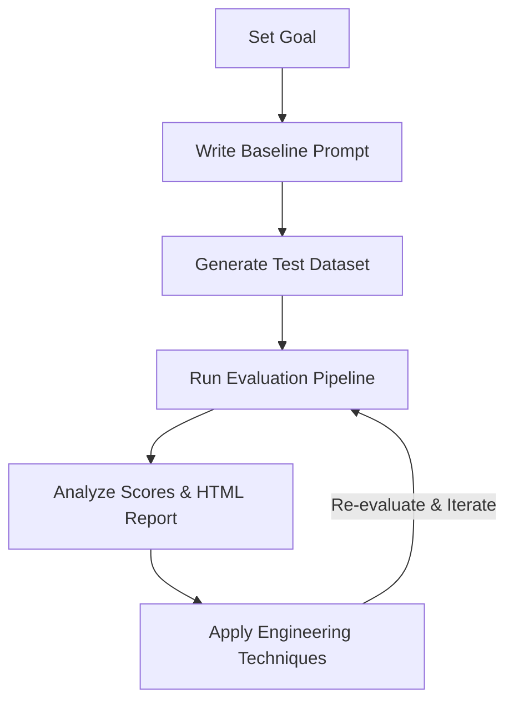
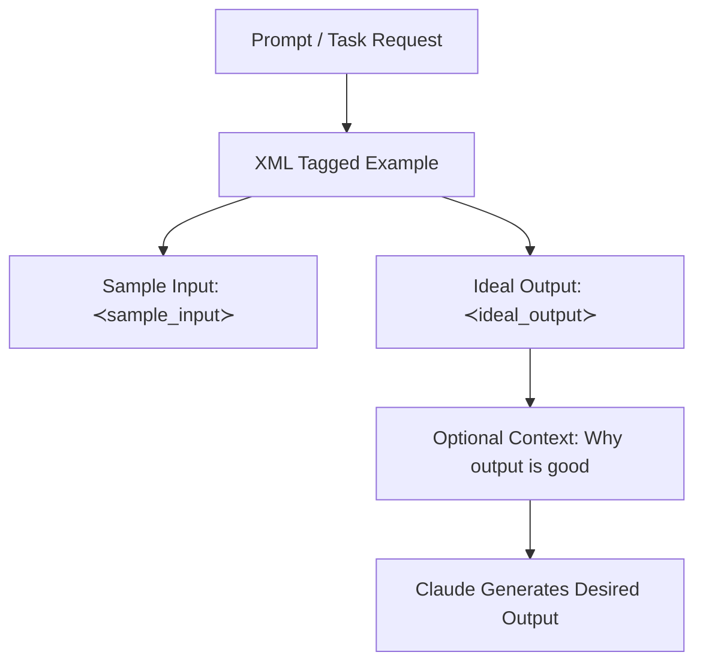
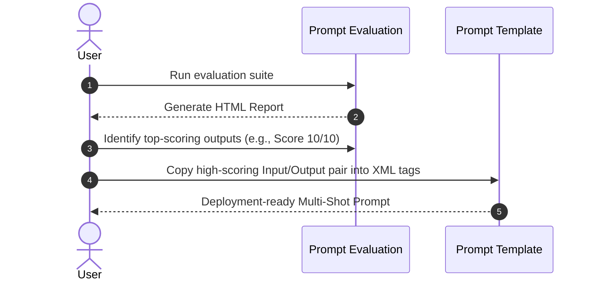

{% include video-summary.html
   id="e2Xysrn20n8"
   content="<p>These sources offer a comprehensive technical guide for <strong>integrating and optimising Claude models within the Amazon Bedrock ecosystem</strong>. They detail the programmatic implementation of AI services using the <strong>Boto3 library</strong>, covering essential functionalities such as <strong>inference configuration, real-time streaming, and structured JSON output control</strong>. Beyond simple deployment, the text emphasises a rigorous <strong>five-step evaluation workflow</strong> to objectively measure performance through automated datasets and hybrid grading systems. Furthermore, it outlines <strong>advanced prompt engineering strategies</strong>, including the use of <strong>XML delimiters</strong> and <strong>multi-shot prompting</strong>, to refine model accuracy and reliability. By combining practical coding examples with systematic testing methodologies, the documentation provides a blueprint for building <strong>production-ready, high-performance AI applications</strong>.</p>" %}

<!--more-->

* TOC
{:toc}

---

# Bedrock API
This course about integrating and deploying Claude through Amazon Bedrock[^1]. Accroding to the Claude[^2], there are three models from the Claude:


Image from [Claude Academy](https://academy.claude.com/assets/media/d87ca18bfca0fadd839a95aa8eecb912a4b3cf1dbb1400081f2324be879509a9.png){:target="_blank" rel="noopener noreferrer"}

I am using Amazon Bedroc in `ap-southeast-2` which is the closest to the Sydney. It is important to find the available models and the Model IDs in the region. Currently my system has the following versions:


```bash
%%bash
aws bedrock list-foundation-models --by-provider anthropic --query "modelSummaries[*].modelId" --output table
```

    -----------------------------------------------
    |            ListFoundationModels             |
    +---------------------------------------------+
    |  anthropic.claude-haiku-4-5-20251001-v1:0   |
    |  anthropic.claude-fable-5                   |
    |  anthropic.claude-sonnet-4-6                |
    |  anthropic.claude-opus-4-6-v1               |
    |  anthropic.claude-opus-5                    |
    |  anthropic.claude-opus-4-8                  |
    |  anthropic.claude-opus-4-7                  |
    |  anthropic.claude-sonnet-4-5-20250929-v1:0  |
    |  anthropic.claude-fable-5-1                 |
    |  anthropic.claude-sonnet-5                  |
    |  anthropic.claude-opus-4-5-20251101-v1:0    |
    |  anthropic.claude-sonnet-4-20250514-v1:0    |
    +---------------------------------------------+


The command `aws bedrock list-foundation-models --by-provider anthropic --query "modelSummaries[*].modelId" --output table` lists all available Anthropic foundation models in Amazon Bedrock.

**Breakdown:**

| Part | Description |
|------|-------------|
| `aws bedrock` | AWS CLI service for Amazon Bedrock |
| `list-foundation-models` | Operation to retrieve available foundation models |
| `--by-provider anthropic` | Filters results to only show models from Anthropic |
| `--query "modelSummaries[*].modelId"` | JMESPath query to extract only the `modelId` field from each model summary |
| `--output table` | Formats output as an ASCII table for readability |

> **Choose Sonnet** when you need balance. Most applications benefit from Sonnet's combination of intelligence, speed, and reasonable cost.
{.ok}

Essential component to connect to the Bedrock Model:

1. Bedrock runtime client
2. Model ID
3. Prompt message

You can create client conntecting the Bedrock runtime:


```python
import boto3

client = boto3.client('bedrock-runtime', region_name='ap-southeast-2')
```


Image from [Claude Academy](https://academy.claude.com/assets/media/4789ffaf0596fa27ae75b1d8b18808aebeb282677f9b7eac625a369f601208ac.png){:target="_blank" rel="noopener noreferrer"}

> Inference profile automatically route the request to the region where your choosen model is available.
{:.ok}


As per above you can use the default Opus, Sonnet, or  


```python
user_message = {
    "role": "user",
    "content": [
        {"text": "What is the capital of Sri Lanka?"}
    ]
}

response = client.converse(
    modelId='au.anthropic.claude-opus-4-8',
    messages=[user_message],
)
```


```python
print(response["output"]["message"]["content"][0]["text"])
```

    Sri Lanka has two capitals:
    
    1. **Sri Jayawardenepura Kotte** – This is the official (administrative) capital, where the parliament and legislative functions are located. It's often considered the "official" capital.
    
    2. **Colombo** – This is the commercial capital and largest city. It serves as the executive and judicial center and is frequently referred to as the capital in casual contexts.
    
    Sri Jayawardenepura Kotte is actually a suburb of the larger Colombo metropolitan area, which is why there's often some confusion. The capital was officially moved from Colombo to Sri Jayawardenepura Kotte in 1982.


## Multi-turn conversation
Both Bedrock runtime and Claude model don't store any messages. Therefore, for a conversation where you need to store the history. You can  mannualy or programmatically maintain the history of all the messages in the follow up prompt: this is called ***context***.

> Conversation should follow the `user → assistant → user → assistant` pattern.
{:.warn}

## System Prompts
The Problem with User Instructions: Putting rules in user messages is unwieldy, cluttering, requires anticipating every edge case, and forces repetitive instructions.
The System Prompt is a Solution, Instructing Claude to adopt a specific persona/role naturally aligns its knowledge, tone, and constraints without long lists of rule exceptions.


```python
model_id = "au.anthropic.claude-haiku-4-5-20251001-v1:0"
user_message = {
    "role": "user",
    "content": [
        {"text": "What are the best tourist locations in Port Villa?"}
    ]
}

response = client.converse(
    modelId=model_id,
    messages=[user_message],
    system=[{"text": """You are a helpful tourist guide who provides information about tourist locations in Port Villa."""}]
)
```

> The system prompt cannot be empty string. At least one character need. System prompts are processed before any user messages in the conversation.
{:.warn}


```python
print(response["output"]["message"]["content"][0]["text"])
```

    # Best Tourist Locations in Port Vila
    
    Here are the must-visit attractions in Port Vila, Vanuatu:
    
    ## **Beaches & Water Activities**
    - **Erakor Beach** - Beautiful sandy beach with calm waters, perfect for swimming and water sports
    - **Irikiki Island** - Nearby island with pristine beaches, snorkeling, and day trips available
    - **Port Vila Waterfront** - Scenic promenade for walks, dining, and ocean views
    
    ## **Cultural & Historical Sites**
    - **Vanuatu National Museum** - Showcases local history, artifacts, and cultural exhibits
    - **Port Vila Market** - Vibrant local market with traditional crafts, produce, and souvenirs
    - **Chief Roi Mata's Domain** - UNESCO World Heritage Site with historical significance (day trip)
    
    ## **Nature & Adventure**
    - **Mele Cascades** - Stunning waterfall with natural pools for swimming (about 15 minutes from town)
    - **Hideaway Island** - Snorkeling, diving, and underwater post office
    - **Local Gardens** - Various botanical gardens showcasing tropical flora
    
    ## **Dining & Entertainment**
    - **Waterfront restaurants** - Fresh seafood with ocean views
    - **Local craft shops** - Handmade souvenirs and traditional items
    
    ## **Tips**
    - Best visited during the dry season (May-October)
    - Hire a local guide for cultural insights
    - Many attractions are within 15-30 minutes of the city center
    
    Would you like more specific information about any of these locations?


## Temperature
The temperature is a 0 to 1 dial for the creativity. Lower value make the heghest probability tokens much more and higher temperature is more about token distributed probability.

Low temperature (More deterministic output)
   
```
Selection Probability
   ▲   
   │ █   
   │ █   
   │ █   
   │ █   
   │ █   
───┴─┴─┴─┴─┴─┴─┴──►   
     a w o i w m w  Tokens   
```

Hight temperature (More random output)

```
Selection Probability 
   ▲   
   │ █ █    
   │ █ █ █    
   │ █ █ █ █ █   
   │ █ █ █ █ █ █   
   │ █ █ █ █ █ █ █  
───┴─┴─┴─┴─┴─┴─┴──►
     a w o i w m w  Tokens
```     

Claude recommendations are:

[Low Temperature (0.0 - 0.3)](https://academy.claude.com/courses/claude-with-amazon-bedrock/temperature#low-temperature-00---03){:target="_blank" rel="noopener noreferrer"}

-   Factual responses
-   Coding assistance
-   Data extraction
-   Content moderation

[Medium Temperature (0.4 - 0.7)](https://academy.claude.com/courses/claude-with-amazon-bedrock/temperature#medium-temperature-04---07){:target="_blank" rel="noopener noreferrer"}

-   Summarization
-   Educational content
-   Problem-solving
-   Creative writing with constraints

[High Temperature (0.8 - 1.0)](https://academy.claude.com/courses/claude-with-amazon-bedrock/temperature#high-temperature-08---10){:target="_blank" rel="noopener noreferrer"}

-   Brainstorming
-   Creative writing
-   Marketing content
-   Joke generation

> Claude's temperature is set to 1.0.
{:.note}


```python
model_id = "au.anthropic.claude-haiku-4-5-20251001-v1:0"
user_message = {
    "role": "user",
    "content": [
        {"text": "What are the best travel plan to follow tourist attractions in Port Villa within a day (10 am - 4 pm)?"}
    ]
}

response = client.converse(
    modelId=model_id,
    messages=[user_message],
    system=[{"text": """You are a helpful tourist guide who provides travel advice about Port Villa tourist attractions."""}],
    inferenceConfig={"temperature": 1.0}
)

print(response["output"]["message"]["content"][0]["text"])
```

    # One-Day Port Vila Tourist Guide (10 AM - 4 PM)
    
    Here's an efficient itinerary to maximize your time:
    
    ## **10:00 AM - Efate Water Park**
    - Start with water activities or relax by the pools
    - *Location:* Central Port Vila
    - *Duration:* 1-1.5 hours
    
    ## **11:30 AM - Port Vila Market**
    - Browse local crafts, fresh produce, and souvenirs
    - Experience authentic local culture
    - *Duration:* 45 minutes
    
    ## **12:15 PM - Lunch**
    - Eat at a local restaurant near the market or waterfront
    - Try Vanuatu specialties like fresh seafood
    
    ## **1:15 PM - Vanuatu Cultural Centre**
    - Learn about indigenous culture and history
    - Browse handicrafts and art
    - *Duration:* 1 hour
    
    ## **2:15 PM - Shol's Beach or Seaside Promenade**
    - Relax and enjoy ocean views
    - Take photos of the sunset area
    - *Duration:* 45 minutes
    
    ## **3:00 PM - Local Shops & Handicrafts**
    - Browse boutique shops near the waterfront
    - Pick up last-minute souvenirs
    
    ## **4:00 PM - Wrap-up**
    
    ### **Pro Tips:**
    - Book water activities in advance
    - Wear sunscreen and stay hydrated
    - Use taxis between locations
    - Wear comfortable walking shoes
    
    Would you like specific recommendations for restaurants or accommodation?


## Streaming
Standard requests force users to wait 10–30 seconds for a complete AI response. Streaming provides immediate visual feedback by transmitting response fragments as they are generated, shifting the user experience from "<span>submit and wait</span>{:rtxt}" to "<span>submit and watch response appear</span>{:gtxt}".

Calling `client.converse_stream()` returns an initial response containing a generator stream object. Iterating over this stream yields real-time event objects as chunks arrive.



When you call converse_stream, you immediately get back an **initial response** that contains a stream object.

    


```python
model_id = "au.anthropic.claude-haiku-4-5-20251001-v1:0"
user_message = {
    "role": "user",
    "content": [
        {"text": "What are the best travel plan to follow tourist attractions in Mistery Island, Vanuatu within a day (10 am - 4 pm)?"}
    ]
}

response = client.converse_stream(messages=[user_message], modelId=model_id)

text = ""
for event in response["stream"]:
    if "contentBlockDelta" in event:
        chunk = event["contentBlockDelta"]["delta"]["text"]
        print(chunk, end="", flush=True)
        text += chunk

# print("\n\nTotal Message:\n" + text)
```

    # One-Day Itinerary for Mystery Island, Vanuatu (10 AM - 4 PM)
    
    ## Quick Overview
    Mystery Island is a small, uninhabited island accessible by daily catamaran. Here's an optimized plan:
    
    ## Suggested Schedule
    
    **10:00 AM - Arrival & Settlement**
    - Disembark and settle into the beach area
    - Store belongings, apply sunscreen
    - Get oriented with facilities
    
    **10:30 AM - 12:00 PM - Beach & Snorkeling**
    - Explore the pristine white-sand beach
    - Snorkel in crystal-clear waters (gear usually provided)
    - Spot tropical fish and coral
    - Visit the wreck of the SS President Coolidge (if snorkeling)
    
    **12:00 PM - 1:30 PM - Lunch**
    - Enjoy lunch at island facilities or packed meal
    - Rest in the shade
    - Optional: explore the island's interior trails
    
    **1:30 PM - 3:00 PM - Activities**
    - Glass-bottom boat tour (if available)
    - Further snorkeling
    - Beach volleyball or relaxation
    - Photography at scenic spots
    
    **3:00 PM - 4:00 PM - Final Hours**
    - Last swim or snorkel
    - Collect belongings
    - Prepare for departure
    
    ## Tips
    ✓ Book tours through Port Vila operators (Island Cruises, Captain Cook Cruises)
    ✓ Bring reef shoes, high SPF sunscreen, and underwater camera
    ✓ Water is warm year-round
    ✓ Catamaran ride takes ~45 minutes each way
    
    Would you like specific operator recommendations?

## Output control with biasness
Two core techniques for steering and constraining model generations beyond basic prompt engineering: Prefilled Assistant Messages and Stop Sequences.



1. **Prefilled Assistant Messages (Output Steering):**
    -   **Mechanism:** You insert an `assistant` role message at the end of the `messages` array containing the exact starting text you want Claude to begin with.
    -   **Behavior:** Claude assumes it already wrote that opening fragment and continues directly from where you left off. It **does not repeat** the prefilled text in its response.
    -   **Use Case:** Biasing sentiment, setting specific starting formats (e.g., forcing JSON opening `{`), or guiding response structure.
    ```mermaid
        sequenceDiagram
            autonumber
            actor User as User Application
            participant Bedrock as Claude (Amazon Bedrock)

            User->>Bedrock: Send messages array:<br/>1. user: "Is coffee or tea better?"<br/>2. assistant: "Tea is better because"
            Note over Bedrock: Claude sees prefill and continues generation from where it left off.
            Bedrock-->>User: Returns continuation: "it has more caffeine."
            Note over User: Full Response = Prefill + Output:<br/>"Tea is better because it has less caffeine."
    ```    


2. **Stop Sequences (Output Truncation):**
    -   **Mechanism:** Passed under `inferenceConfig` -> `stopSequences` as an array of strings (e.g., `["5"]`, `["\n\n"]`).
    -   **Behavior:** As soon as Claude generates any string in the list, generation halts immediately. The stop sequence string itself is **omitted** from the returned output.
    -   **Use Case:** Preventing responses from running past boundaries, stopping at specific delimiters, or capping output length cleanly.
    ```mermaid
        sequenceDiagram
            autonumber
            actor Client as Client Application
            participant Bedrock as Claude API (Bedrock)

            Client->>Bedrock: Send Request:<br/>messages = [<br/>  {role: "user", content: "Is coffee or tea better?"},<br/>  {role: "assistant", content: "Tea is better because"}<br/>]<br/>stopSequences = ["**Consider:**"]
            Note over Bedrock: Generates tokens for Coffee vs Tea bullet points...<br/>Detects target stop string "**Consider:**"
            Note over Bedrock: Halts generation immediately.<br/>Strips "**Consider:**" from final output.
            Bedrock-->>Client: Returns Continuation:<br/>"coffee can cause jitters... [Tea specs]"<br/>(Truncated right before **Consider:**)
    ```

Here the example:


```python
model_id = "au.anthropic.claude-haiku-4-5-20251001-v1:0" 
# 1. Setup messages with a prefilled assistant start
messages = [
    {"role": "user", "content": [{"text": "Is coffee or tea better for breakfast?"}]},
    {"role": "assistant", "content": [{"text": "Tea is better because"}]}
]

# 2. Invoke Bedrock Converse API with stop sequences
response = client.converse(
    modelId=model_id,
    messages=messages,
    inferenceConfig={
        "temperature": 1.0,
        "stopSequences": ["**Consider**"]
    }
)

# Output continuation from prefilled text
continuation = response["output"]["message"]["content"][0]["text"]
full_response = "Tea is better because" + continuation
```


```python
print(full_response)
```

    Tea is better because the caffeine kicks in more gradually, giving you stable energy without the jitters. It's also easier on the stomach.
    
    Actually, I should be more balanced: **it depends on what works for you.**
    
    **Coffee** offers:
    - Faster energy boost
    - More caffeine per serving
    - Bold flavor some prefer
    
    **Tea** offers:
    - Gentler caffeine release
    - L-theanine (promotes calm focus)
    - Often easier on digestion
    - Less likely to cause crashes
    
    **Better approach:** Consider your own digestion, caffeine sensitivity, and what taste you enjoy. Some people do great with coffee; others feel jittery. Neither is objectively "better"—it's personal.
    
    What matters more is eating actual food with your drink rather than caffeine alone.


Above has stopped at `**consider**` in the following text something similar to the following text:

```
Tea is better because coffee can cause jitters and crashes, while tea provides a gentler caffeine boost.

Actually, ...:

**Coffee** tends to offer:
- ...

**Tea** tends to offer:
- ...


**Consider:**
- Your caffeine sensitivity
- What flavor appeals to you
- How your body responds
- Whether you eat food with it (helps either go down easier)

...
```

When you passed `{"role": "assistant", "content": "Tea is better because"}` in the `messages` array:

-   **What Claude saw:** Claude treats the prefilled text as tokens it has _already written_. It does not re-generate `"Tea is better because"`.
-   **What Claude generated:** It picked up immediately after the word `"because"` with:
    
    ```
    `coffee can cause jitters and crashes, while tea provides a gentler caffeine boost...`
    ```
    
-   **The Impact:** Even though your user prompt asked an open-ended question (_"Is coffee or tea better?"_), the prefill forced Claude to immediately argue in favor of tea in its opening sentence. Combining the prefill string with Claude's API payload output yields the complete first line.

### Structured Output
A common challenge when integrating Claude into automated software pipelines is to *ensuring the model returns clean, pure structured data (such as JSON, CSV, or code) without conversational filler, headers, or markdown wrappers*.

Instead of relying strictly on prompt instructions, the standard technique uses two API mechanisms together:

1. **Assistant Message Prefilling**: Pass \`\`\`json  (or the opening syntax for your desired format) as the starting text in the **assistant** role message within the messages array.
  - _Effect_: Claude assumes it has already begun outputting the response inside a markdown block and immediately starts writing the raw data payload, skipping intros and headers.
2. **Stop Sequences (stop_sequences=["\`\`\`"])**: Configure  \`\`\` as a stop sequence in the API request call.  
  - _Effect_: When Claude finishes generating the JSON payload and attempts to output the closing markdown tag ( \`\`\`), the API immediately halts token generation.



Example code


```python
import json
# Opening delimiter prefill
prefill_text = "```json"

messages = [
    {
        "role": "user",
        "content": [
            {
                "text": (
                    "Generate a JSON list of 3 sample AWS Bedrock providers for an enterprise environment. "
                    "Each entry must include: provider and model summary. "
                )
            }
        ],
    },
    {
        "role": "assistant",
        "content": [{"text": prefill_text}],
    },
]

# Invoke Bedrock Converse API with closing code block delimiter as a stop sequence
response = client.converse(
    modelId=model_id,
    messages=messages,
    inferenceConfig={
        "temperature": 0.1,  # Low temperature for deterministic output
        "stopSequences": ["```"],  # Stops execution right when Claude tries to close the code block
    },
)

# Extract output continuation and clean the payload
continuation = response["output"]["message"]["content"][0]["text"]

# Combine prefill (optional, depending on if you parse continuation directly)
raw_json = continuation.strip()

# Parse directly into Python data structures without regex
rj_output = json.loads(raw_json)

# Pretty-print the validated JSON output
print(json.dumps(rj_output, indent=2))
```

    {
      "bedrock_providers": [
        {
          "provider": "Anthropic",
          "model": "Claude 3 Opus",
          "summary": "Advanced large language model optimized for complex reasoning, analysis, and enterprise applications. Supports 200K token context window, ideal for document processing and multi-turn conversations in regulated industries."
        },
        {
          "provider": "Meta",
          "model": "Llama 2 70B",
          "summary": "Open-source large language model designed for enterprise deployment with strong performance on coding, reasoning, and instruction-following tasks. Cost-effective option with good throughput for high-volume workloads."
        },
        {
          "provider": "Cohere",
          "model": "Command R Plus",
          "summary": "Enterprise-grade model specialized in retrieval-augmented generation (RAG), semantic search, and knowledge-intensive tasks. Optimized for business applications with strong multilingual support and low latency requirements."
        }
      ]
    }


# Evals

Writing a prompt is only the start of building AI applications. While Prompt Engineering focuses on crafting instructions to help Claude understand requirements, Prompt Evaluation provides automated, objective testing to measure how well those prompts perform across diverse scenarios before reaching production.

| Concept | Primary Focus | Objective | Key Techniques / Activities |
| --- | --- | --- | --- |
| **Prompt Engineering** | **Craft & Construction** | Crafting effective instructions so Claude understands intent. | Multishot prompting, XML tag structuring, role setting, formatting constraints. |
| **Prompt Evaluation** | **Measurement & Testing** | Generating objective metrics to measure real-world performance. | Automated test runs against datasets, output scoring, error analysis, version comparison. |

When developing an AI application, engineers generally follow one of three paths[^3] after writing an initial prompt:



Claude Academy (_Claude with Amazon Bedrock_) outlines a **systematic, 5-step evaluation workflow**[^4] designed to objectively measure, score, and iterate on LLM prompt performance rather than relying on subjective intuition.

1. Draft a prompt: initial prompt for baseline
2. Create an Eval dataset: Prepare manually or generate via Claude
3. Feed through Claude: collect the Claude's repsonse
4. Feed through a Grader: Q&A pair need to grade from 1 to 10. Calculate the avarage
5. Change prompt and repeat: Base on the avarage of the above repeate to get better result.



### Evals
Decoupling dataset generation from prompt evaluation is standard practice in LLM benchmarking. Saving the dataset to disk ensures your prompt variations (v1​,v2​,…) are evaluated against the exact same static inputs while saving unnecessary API calls. No need of headers, footer or explanation.


```python
DATASET_FILE = "eval_dataset.json"
# --- File Persistence Helpers ---
def save_dataset(dataset, filepath=DATASET_FILE):
    """Saves the generated dataset list to a local JSON file."""
    with open(filepath, "w", encoding="utf-8") as f:
        json.dump(dataset, f, indent=2)
    print(f"✓ Dataset saved to '{filepath}'.")


def load_dataset(filepath=DATASET_FILE):
    """Loads the dataset list from a local JSON file."""
    if not os.path.exists(filepath):
        raise FileNotFoundError(
            f"Dataset file '{filepath}' not found. Generate it first."
        )
    with open(filepath, "r", encoding="utf-8") as f:
        dataset = json.load(f)
    print(f"✓ Dataset loaded from '{filepath}' ({len(dataset)} tasks found).")
    return dataset
```

Here the pipeline functionality to generate dataset:


```python
# --- Core Pipeline Functions ---
def generate_dataset():
    """Generates synthetic tasks using Bedrock Claude."""
    dataset_prompt = """
    Generate 3 AWS-related tasks that require Python, JSON, or Regex solutions.
    Focus on tasks solvable by a single Python function or JSON object.
    
    Example output format:
    [
        {"task": "Write a Regex to match an AWS S3 bucket name."}
    ]
    """

    messages = [
        {"role": "user", "content": [{"text": dataset_prompt.strip()}]},
        {"role": "assistant", "content": [{"text": "```json"}]},
    ]

    response = client.converse(
        modelId=model_id,
        messages=messages,
        inferenceConfig={"temperature": 0.1, "stopSequences": ["```"]},
    )
    return json.loads(response["output"]["message"]["content"][0]["text"].strip())


def solve_task(task_description):
    """Runs a task through the candidate prompt."""
    formatted_prompt = EVAL_PROMPT_TEMPLATE.format(task=task_description)
    messages = [{"role": "user", "content": [{"text": formatted_prompt.strip()}]}]

    response = client.converse(
        modelId=model_id,
        messages=messages,
        inferenceConfig={"temperature": 0.1},
    )
    return response["output"]["message"]["content"][0]["text"].strip()

GRADER_PROMPT_TEMPLATE = """
You are an expert software engineer evaluating an AI's response to a task.

Task: {task}
Solution: {solution}

Evaluate the solution against the task description. Return a valid JSON object matching EXACTLY this structure:
{{
  "score": <integer from 1 to 10>,
  "reasoning": "<concise explanation>",
  "strengths": ["<strength 1>", "<strength 2>"],
  "weaknesses": ["<weakness 1>"]
}}
"""


def grade_solution(task_description, solution_text):
    """Grades a solution using Claude as LLM judge with prefilled JSON structure."""
    formatted_prompt = GRADER_PROMPT_TEMPLATE.format(
        task=task_description, solution=solution_text
    )

    messages = [
        {"role": "user", "content": [{"text": formatted_prompt.strip()}]},
        # Prefill forces Claude to start with the JSON opening brace and 'score' key
        {"role": "assistant", "content": [{"text": '```json\n{\n  "score":'}]},
    ]

    response = client.converse(
        modelId=model_id,
        messages=messages,
        inferenceConfig={"temperature": 0.0, "stopSequences": ["```"]},
    )

    # Reconstruct the raw JSON string by prepending the prefilled prefix
    completion_text = response["output"]["message"]["content"][0]["text"].strip()
    full_json_str = '{\n  "score":' + completion_text

    # Parse JSON cleanly
    data = json.loads(full_json_str)

    # Defensive key lookup (handles case-sensitivity or key variance)
    score = data.get("score") or data.get("Score") or 0
    reasoning = data.get("reasoning") or data.get("Reasoning") or "No reasoning provided."

    return {
        "score": int(score),
        "reasoning": reasoning,
        "strengths": data.get("strengths", []),
        "weaknesses": data.get("weaknesses", []),
    }
```

STEP 1 is to generate the Dataset and save to a file:


```python
import os

if os.path.exists(DATASET_FILE):
    print(f"Found existing dataset file. Loading from '{DATASET_FILE}'...")
    dataset = load_dataset(DATASET_FILE)
else:
    print("No dataset file found. Generating dataset from Bedrock...")
    dataset = generate_dataset()
    save_dataset(dataset, DATASET_FILE)
```

    Found existing dataset file. Loading from 'eval_dataset.json'...
    ✓ Dataset loaded from 'eval_dataset.json' (3 tasks found).


Here the file contents:


```bash
%%bash
cat eval_dataset.json
```

    [
      {
        "task": "Write a Python function that parses an AWS CloudFormation template (JSON) and extracts all resource logical IDs that have type 'AWS::Lambda::Function'."
      },
      {
        "task": "Write a Regex pattern to validate an AWS IAM role ARN format (arn:aws:iam::123456789012:role/RoleName)."
      },
      {
        "task": "Write a Python function that takes an AWS CloudWatch Logs query result (JSON array of log events) and filters events where the 'level' field equals 'ERROR', returning only the 'message' and '@timestamp' fields."
      }
    ]

Then run Evaluation Loop using the retrieved dataset file


```python
EVAL_PROMPT_TEMPLATE = """
Please provide a solution to the following task in JSON format:

{task}
"""

results = []
print(f"\nEvaluating prompt across {len(dataset)} tasks...\n" + "=" * 50)

for idx, item in enumerate(dataset, 1):
    task_text = item["task"]
    print(f"\n[Task {idx}]: {task_text}")

    # Solve task loaded from file
    solution = solve_task(task_text)
    print(f"Solution generated.")

    # Grade solution
    evaluation = grade_solution(task_text, solution)
    print(f"Grade: {evaluation['score']}/10")
    print(f"Reason: {evaluation['reasoning']}")

    results.append(
        {
            "task": task_text,
            "solution": solution,
            "score": evaluation["score"],
            "evaluation": evaluation,
        }
    )


```

    
    Evaluating prompt across 3 tasks...
    ==================================================
    
    [Task 1]: Write a Python function that parses an AWS CloudFormation template (JSON) and extracts all resource logical IDs that have type 'AWS::Lambda::Function'.
    Solution generated.
    Grade: 9/10
    Reason: The solution effectively addresses the task requirements with a well-implemented, production-ready function. It correctly parses CloudFormation templates and extracts Lambda function logical IDs. The code is clean, properly documented, and includes comprehensive test cases. Minor areas for improvement exist around edge case handling and validation.
    
    [Task 2]: Write a Regex pattern to validate an AWS IAM role ARN format (arn:aws:iam::123456789012:role/RoleName).
    Solution generated.
    Grade: 9/10
    Reason: The solution provides a well-crafted regex pattern that accurately validates AWS IAM role ARNs with comprehensive documentation, multiple language implementations, and thoughtful edge cases. The pattern correctly enforces the 12-digit account ID requirement and includes valid special characters for role names. Minor weaknesses exist around AWS documentation alignment and path handling nuances.
    
    [Task 3]: Write a Python function that takes an AWS CloudWatch Logs query result (JSON array of log events) and filters events where the 'level' field equals 'ERROR', returning only the 'message' and '@timestamp' fields.
    Solution generated.
    Grade: 9/10
    Reason: The solution comprehensively addresses the task with multiple well-implemented approaches, proper documentation, and thorough testing. The basic function correctly filters CloudWatch logs for ERROR level events and returns only the specified fields. The solution goes beyond requirements by providing alternative implementations and advanced features, though the advanced version introduces optional complexity not requested in the task.


Output aggregate metrics:


```python
avg_score = sum(r["score"] for r in results) / len(results)
print("\n" + "=" * 50)
print(f"EVALUATION RESULT: {avg_score:.2f} / 10.0")
print("=" * 50)
```

    
    ==================================================
    EVALUATION RESULT: 9.00 / 10.0
    ==================================================


### Model-Based Grading

Model-based grading uses an AI model as an objective judge to evaluate response quality when programmatic rules are too rigid. It provides a measurable score (typically from 1 to 10) to assess subjective or complex criteria.

| Grader Type | Mechanism | Best Used For |
| --- | --- | --- |
| **Code Graders** | Programmatic checks | Length, exact keywords, syntax validation (JSON, Python, Regex) |
| **Model Graders** | another LLM judge | Task-following, response quality, completeness, helpfulness, safety |
| **Human Graders** | Manual review | High-level nuance, depth, relevance (time-intensive), Conciseness |


> Before implementing any grader, you need clear evaluation criteria.
{:.note}

Here the example code;


```python
def grade_by_model(test_case, output):
    eval_prompt = f"""
    You are an expert code reviewer. Evaluate this AI-generated solution.

    Task: {test_case['task']}
    Solution: {output}

    Provide your evaluation as a structured JSON object with:
    - "strengths": An array of 1-3 key strengths
    - "weaknesses": An array of 1-3 key areas for improvement
    - "reasoning": A concise explanation of your assessment
    - "score": A number between 1-10
    """

    messages = [
        {"role": "user", "content": [{"text": eval_prompt.strip()}]},
        {"role": "assistant", "content": [{"text": '```json\n{\n  "score":'}]},
    ]

    response = client.converse(
        modelId=model_id,
        messages=messages,
        inferenceConfig={"temperature": 0.0, "stopSequences": ["```"]},
    )

    completion_text = response["output"]["message"]["content"][0]["text"].strip()
    full_json_str = '{\n  "score":' + completion_text
    return json.loads(full_json_str)
```

### Code-Based Grading

Code-based grading provides deterministic syntax and format validation without requiring additional LLM calls. It checks two primary criteria:

1. **Format Compliance:** Verifies whether the output contains strictly the target format (Python, JSON, or Regex) without conversational text or markdown headers.
2. **Valid Syntax:** Confirms that the output parses or compiles successfully.

#### Programmatic Validation Functions

Validation helper functions return a binary score (10 for successful parsing, 0 for failure) using standard Python libraries:


```python
import ast
import json
import re

def validate_json(text):
    try:
        json.loads(text.strip())
        return 10
    except json.JSONDecodeError:
        return 0

def validate_python(text):
    try:
        ast.parse(text.strip())
        return 10
    except SyntaxError:
        return 0

def validate_regex(text):
    try:
        re.compile(text.strip())
        return 10
    except re.error:
        return 0

def grade_syntax(output, test_case):
    fmt = test_case.get("format", "python")
    if fmt == "json":
        return validate_json(output)
    elif fmt == "regex":
        return validate_regex(output)
    else:
        return validate_python(output)
```

### Hybrid Evaluation Pipeline

To balance semantic quality with technical correctness, combine the model grader score with the code grader score into a composite score:


```python
def run_hybrid_eval(dataset):
    results = []
    for test_case in dataset:
        solution = solve_task(test_case["task"])

        # 1. Model-based grading (Semantic quality & task adherence)
        model_eval = grade_by_model(test_case, solution)
        model_score = model_eval["score"]

        # 2. Code-based grading (Syntax correctness)
        syntax_score = grade_syntax(solution, test_case)

        # 3. Hybrid score calculation
        final_score = (model_score + syntax_score) / 2

        results.append(
            {
                "task": test_case["task"],
                "model_score": model_score,
                "syntax_score": syntax_score,
                "final_score": final_score,
                "reasoning": model_eval["reasoning"],
            }
        )

    avg_score = sum(r["final_score"] for r in results) / len(results)
    print(f"Overall Benchmark Score: {avg_score:.2f} / 10.0")
    return results
```

# Prompt Engineering
Prompt Engineering is how to systematically build, evaluate, and refine prompts through an iterative process.



- Iterative Cycle: Prompt engineering relies on setting clear goals, establishing baseline performance, applying systematic techniques, and re-evaluating to verify improvements.
- Evaluation Pipeline: Uses a PromptEvaluator class to manage dataset creation and model grading. It supports concurrent task execution (starting at 3–5 concurrent tasks) to speed up testing while managing API rate limits.
- Generating Test Data: Uses .generate_dataset() to create synthetic test cases by defining a task description (e.g., meal planning) and specifying input variables (height, weight, goal, restrictions).
- Initial Prompt Baseline: Starts with a simple, naive prompt template to establish a performance benchmark. In the example provided, the initial baseline scored 2.3 out of 10.
- Grading Criteria & Analysis: Evaluation runs output against custom parameters (e.g., requiring caloric totals, macro breakdowns, and meal timing) and outputs an output.html visual report with scores, reasoning, and response text.
- Future Techniques: Subsequent lessons focus on improving low baseline scores by applying explicit instructions, structured output formatting, and multi-shot examples.

create boto3 client:


```python
import boto3

client = boto3.client('bedrock-runtime', region_name='ap-southeast-2')
model_id = "au.anthropic.claude-haiku-4-5-20251001-v1:0" 

def add_user_message(messages, text):
    user_message = {
        "role": "user",
        "content": [
            {"text": text}
        ]
    }
    messages.append(user_message)

def add_assistant_message(messages, text):
    assistant_message = {
        "role": "assistant", 
        "content": [
            {"text": text}
        ]
    }
    messages.append(assistant_message)

def chat(messages):
    response = client.converse(
        modelId=model_id,
        messages=messages
    )
    return response["output"]["message"]["content"][0]["text"]
```

The `PromptEvaluator` wrap the dataset generation and the model grading discussed above. Create a evaluator using `PromptEvaluator` defined in the `utils.py` file.


```python
import utils 
utils.set_model_id(model_id)
utils.set_client(client)
```

Setup the evalation pipeline:


```python
evaluator = utils.PromptEvaluator(max_concurrent_tasks=5)
```

The `generate_dataset` method creates test cases for your prompt. You need to specify:

-   A task description explaining what your prompt should do
-   A specification of the inputs your prompt requires
-   The number of test cases to generate

Following prompt[^5] is created for the one-day meal plans for athletes based on their height, weight, physical goals, and dietary restrictions. Following code create test cases your prompt:

- Task description
- specification of the inputs
- Number of test cases to generate


```python

dataset = evaluator.generate_dataset(
    task_description="Write a compact, concise 1 day meal plan for a single athlete",
    prompt_inputs_spec={
        "height": "Athlete's height in cm",
        "weight": "Athlete's weight in kg", 
        "goal": "Goal of the athlete",
        "restrictions": "Dietary restrictions of the athlete"
    },
    num_cases=3
)
```

    Generated 1/3 test cases
    Generated 2/3 test cases
    Generated 3/3 test cases


    [
      {
        "prompt_inputs": {
          "height": "180",
          "weight": "78",
          "goal": "Match day preparation with 2800 calorie target and sustained energy for 90-minute soccer performance",
          "restrictions": "Vegetarian"
        },
        "solution_criteria": [
          "Meal plan contains exactly 3 meals that total approximately 2800 calories",
          "All meals are vegetarian with no meat, poultry, or fish",
          "Plan includes carbohydrate-rich options for energy and protein sources suitable for match day performance"
        ],
        "task_description": "Write a compact, concise 1 day meal plan for a single athlete",
        "scenario": "Testing with a team sport athlete (soccer player) with dietary restrictions (vegetarian) and specific caloric targets for match day preparation"
      },
      {
        "prompt_inputs": {
          "height": "178 cm",
          "weight": "72 kg",
          "goal": "Marathon training - maximize carbohydrate intake with proper timing around a 90-minute morning run",
          "restrictions": "Vegetarian, no nuts"
        },
        "solution_criteria": [
          "Meal plan is compact and covers all meals for one day",
          "Includes high carbohydrate content appropriate for endurance athlete (~8-10g per kg body weight)",
          "Pre-workout meal provided before the 90-minute run and post-workout meal after",
          "All dietary restrictions (vegetarian, no nuts) are respected"
        ],
        "task_description": "Write a compact, concise 1 day meal plan for a single athlete",
        "scenario": "Testing with an endurance athlete (marathon runner) who requires high carbohydrate intake and specific timing around training sessions"
      },
      {
        "prompt_inputs": {
          "height": "178 cm",
          "weight": "85 kg",
          "goal": "Maximize strength gains and recovery post-workout with optimized protein distribution",
          "restrictions": "None"
        },
        "solution_criteria": [
          "Meal plan spans exactly 1 day with 4-5 meals",
          "Protein distributed across all meals with at least 25-30g per meal and elevated post-workout nutrition",
          "Includes a substantial post-workout meal within 1-2 hours of training",
          "Compact format (concise descriptions, no excessive detail)"
        ],
        "task_description": "Write a compact, concise 1 day meal plan for a single athlete",
        "scenario": "Testing with a strength/power athlete (weightlifter) who prioritizes protein distribution and recovery nutrition post-workout"
      }
    ]

Write initial prompt to establish a baseline:


```python
def run_prompt(prompt_inputs):
    prompt = f"""
    What should this person eat?
    
    - Height: {prompt_inputs["height"]}
    - Weight: {prompt_inputs["weight"]}
    - Goal: {prompt_inputs["goal"]}
    - Dietary restrictions: {prompt_inputs["restrictions"]}
    """
    
    messages = []
    add_user_message(messages, prompt)
    return chat(messages)
```

Run the evalation:


```python
results = evaluator.run_evaluation(
    run_prompt_function=run_prompt,
    dataset_file="dataset.json",
    extra_criteria="""
    The output should include:
    - Daily caloric total
    - Macronutrient breakdown  
    - Meals with exact foods, portions, and timing
    """
)
```

    Graded 1/3 test cases
    Graded 2/3 test cases
    Graded 3/3 test cases
    Average score: 2.6666666666666665


Here the `output.html` file with analysis results:


<iframe src="data:text/html;base64,CiAgICA8IURPQ1RZUEUgaHRtbD4KICAgIDxodG1sIGxhbmc9ImVuIj4KICAgIDxoZWFkPgogICAgICAgIDxtZXRhIGNoYXJzZXQ9IlVURi04Ij4KICAgICAgICA8bWV0YSBuYW1lPSJ2aWV3cG9ydCIgY29udGVudD0id2lkdGg9ZGV2aWNlLXdpZHRoLCBpbml0aWFsLXNjYWxlPTEuMCI+CiAgICAgICAgPHRpdGxlPlByb21wdCBFdmFsdWF0aW9uIFJlcG9ydDwvdGl0bGU+CiAgICAgICAgPHN0eWxlPgogICAgICAgICAgICBib2R5IHsKICAgICAgICAgICAgICAgIGZvbnQtZmFtaWx5OiBBcmlhbCwgc2Fucy1zZXJpZjsKICAgICAgICAgICAgICAgIGxpbmUtaGVpZ2h0OiAxLjY7CiAgICAgICAgICAgICAgICBtYXJnaW46IDA7CiAgICAgICAgICAgICAgICBwYWRkaW5nOiAyMHB4OwogICAgICAgICAgICAgICAgY29sb3I6ICMzMzM7CiAgICAgICAgICAgIH0KICAgICAgICAgICAgLmhlYWRlciB7CiAgICAgICAgICAgICAgICBiYWNrZ3JvdW5kLWNvbG9yOiAjZjBmMGYwOwogICAgICAgICAgICAgICAgcGFkZGluZzogMjBweDsKICAgICAgICAgICAgICAgIGJvcmRlci1yYWRpdXM6IDVweDsKICAgICAgICAgICAgICAgIG1hcmdpbi1ib3R0b206IDIwcHg7CiAgICAgICAgICAgIH0KICAgICAgICAgICAgLnN1bW1hcnktc3RhdHMgewogICAgICAgICAgICAgICAgZGlzcGxheTogZmxleDsKICAgICAgICAgICAgICAgIGp1c3RpZnktY29udGVudDogc3BhY2UtYmV0d2VlbjsKICAgICAgICAgICAgICAgIGZsZXgtd3JhcDogd3JhcDsKICAgICAgICAgICAgICAgIGdhcDogMTBweDsKICAgICAgICAgICAgfQogICAgICAgICAgICAuc3RhdC1ib3ggewogICAgICAgICAgICAgICAgYmFja2dyb3VuZC1jb2xvcjogI2ZmZjsKICAgICAgICAgICAgICAgIGJvcmRlci1yYWRpdXM6IDVweDsKICAgICAgICAgICAgICAgIHBhZGRpbmc6IDE1cHg7CiAgICAgICAgICAgICAgICBib3gtc2hhZG93OiAwIDJweCA1cHggcmdiYSgwLDAsMCwwLjEpOwogICAgICAgICAgICAgICAgZmxleC1iYXNpczogMzAlOwogICAgICAgICAgICAgICAgbWluLXdpZHRoOiAyMDBweDsKICAgICAgICAgICAgfQogICAgICAgICAgICAuc3RhdC12YWx1ZSB7CiAgICAgICAgICAgICAgICBmb250LXNpemU6IDI0cHg7CiAgICAgICAgICAgICAgICBmb250LXdlaWdodDogYm9sZDsKICAgICAgICAgICAgICAgIG1hcmdpbi10b3A6IDVweDsKICAgICAgICAgICAgfQogICAgICAgICAgICB0YWJsZSB7CiAgICAgICAgICAgICAgICB3aWR0aDogMTAwJTsKICAgICAgICAgICAgICAgIGJvcmRlci1jb2xsYXBzZTogY29sbGFwc2U7CiAgICAgICAgICAgICAgICBtYXJnaW4tdG9wOiAyMHB4OwogICAgICAgICAgICB9CiAgICAgICAgICAgIHRoIHsKICAgICAgICAgICAgICAgIGJhY2tncm91bmQtY29sb3I6ICM0YTRhNGE7CiAgICAgICAgICAgICAgICBjb2xvcjogd2hpdGU7CiAgICAgICAgICAgICAgICB0ZXh0LWFsaWduOiBsZWZ0OwogICAgICAgICAgICAgICAgcGFkZGluZzogMTJweDsKICAgICAgICAgICAgfQogICAgICAgICAgICB0ZCB7CiAgICAgICAgICAgICAgICBwYWRkaW5nOiAxMHB4OwogICAgICAgICAgICAgICAgYm9yZGVyLWJvdHRvbTogMXB4IHNvbGlkICNkZGQ7CiAgICAgICAgICAgICAgICB2ZXJ0aWNhbC1hbGlnbjogdG9wOwogICAgICAgICAgICB9CiAgICAgICAgICAgIHRyOm50aC1jaGlsZChldmVuKSB7CiAgICAgICAgICAgICAgICBiYWNrZ3JvdW5kLWNvbG9yOiAjZjlmOWY5OwogICAgICAgICAgICB9CiAgICAgICAgICAgIC5vdXRwdXQtY2VsbCB7CiAgICAgICAgICAgICAgICB3aGl0ZS1zcGFjZTogcHJlLXdyYXA7CiAgICAgICAgICAgIH0KICAgICAgICAgICAgLnNjb3JlIHsKICAgICAgICAgICAgICAgIGZvbnQtd2VpZ2h0OiBib2xkOwogICAgICAgICAgICAgICAgcGFkZGluZzogNXB4IDEwcHg7CiAgICAgICAgICAgICAgICBib3JkZXItcmFkaXVzOiAzcHg7CiAgICAgICAgICAgICAgICBkaXNwbGF5OiBpbmxpbmUtYmxvY2s7CiAgICAgICAgICAgIH0KICAgICAgICAgICAgLnNjb3JlLWhpZ2ggewogICAgICAgICAgICAgICAgYmFja2dyb3VuZC1jb2xvcjogI2M4ZTZjOTsKICAgICAgICAgICAgICAgIGNvbG9yOiAjMmU3ZDMyOwogICAgICAgICAgICB9CiAgICAgICAgICAgIC5zY29yZS1tZWRpdW0gewogICAgICAgICAgICAgICAgYmFja2dyb3VuZC1jb2xvcjogI2ZmZjljNDsKICAgICAgICAgICAgICAgIGNvbG9yOiAjZjU3ZjE3OwogICAgICAgICAgICB9CiAgICAgICAgICAgIC5zY29yZS1sb3cgewogICAgICAgICAgICAgICAgYmFja2dyb3VuZC1jb2xvcjogI2ZmY2RkMjsKICAgICAgICAgICAgICAgIGNvbG9yOiAjYzYyODI4OwogICAgICAgICAgICB9CiAgICAgICAgICAgIC5vdXRwdXQgewogICAgICAgICAgICAgICAgb3ZlcmZsb3c6IGF1dG87CiAgICAgICAgICAgICAgICB3aGl0ZS1zcGFjZTogcHJlLXdyYXA7CiAgICAgICAgICAgIH0KCiAgICAgICAgICAgIC5vdXRwdXQgcHJlIHsKICAgICAgICAgICAgICAgIGJhY2tncm91bmQtY29sb3I6ICNmNWY1ZjU7CiAgICAgICAgICAgICAgICBib3JkZXI6IDFweCBzb2xpZCAjZGRkOwogICAgICAgICAgICAgICAgYm9yZGVyLXJhZGl1czogNHB4OwogICAgICAgICAgICAgICAgcGFkZGluZzogMTBweDsKICAgICAgICAgICAgICAgIG1hcmdpbjogMDsKICAgICAgICAgICAgICAgIGZvbnQtZmFtaWx5OiAnQ29uc29sYXMnLCAnTW9uYWNvJywgJ0NvdXJpZXIgTmV3JywgbW9ub3NwYWNlOwogICAgICAgICAgICAgICAgZm9udC1zaXplOiAxNHB4OwogICAgICAgICAgICAgICAgbGluZS1oZWlnaHQ6IDEuNDsKICAgICAgICAgICAgICAgIGNvbG9yOiAjMzMzOwogICAgICAgICAgICAgICAgYm94LXNoYWRvdzogaW5zZXQgMCAxcHggM3B4IHJnYmEoMCwgMCwgMCwgMC4xKTsKICAgICAgICAgICAgICAgIG92ZXJmbG93LXg6IGF1dG87CiAgICAgICAgICAgICAgICB3aGl0ZS1zcGFjZTogcHJlLXdyYXA7IAogICAgICAgICAgICAgICAgd29yZC13cmFwOiBicmVhay13b3JkOyAKICAgICAgICAgICAgfQoKICAgICAgICAgICAgdGQgewogICAgICAgICAgICAgICAgd2lkdGg6IDIwJTsKICAgICAgICAgICAgfQogICAgICAgICAgICAuc2NvcmUtY29sIHsKICAgICAgICAgICAgICAgIHdpZHRoOiA4MHB4OwogICAgICAgICAgICB9CiAgICAgICAgPC9zdHlsZT4KICAgIDwvaGVhZD4KICAgIDxib2R5PgogICAgICAgIDxkaXYgY2xhc3M9ImhlYWRlciI+CiAgICAgICAgICAgIDxoMT5Qcm9tcHQgRXZhbHVhdGlvbiBSZXBvcnQ8L2gxPgogICAgICAgICAgICA8ZGl2IGNsYXNzPSJzdW1tYXJ5LXN0YXRzIj4KICAgICAgICAgICAgICAgIDxkaXYgY2xhc3M9InN0YXQtYm94Ij4KICAgICAgICAgICAgICAgICAgICA8ZGl2PlRvdGFsIFRlc3QgQ2FzZXM8L2Rpdj4KICAgICAgICAgICAgICAgICAgICA8ZGl2IGNsYXNzPSJzdGF0LXZhbHVlIj4zPC9kaXY+CiAgICAgICAgICAgICAgICA8L2Rpdj4KICAgICAgICAgICAgICAgIDxkaXYgY2xhc3M9InN0YXQtYm94Ij4KICAgICAgICAgICAgICAgICAgICA8ZGl2PkF2ZXJhZ2UgU2NvcmU8L2Rpdj4KICAgICAgICAgICAgICAgICAgICA8ZGl2IGNsYXNzPSJzdGF0LXZhbHVlIj4yLjcgLyAxMDwvZGl2PgogICAgICAgICAgICAgICAgPC9kaXY+CiAgICAgICAgICAgICAgICA8ZGl2IGNsYXNzPSJzdGF0LWJveCI+CiAgICAgICAgICAgICAgICAgICAgPGRpdj5QYXNzIFJhdGUgKOKJpTcpPC9kaXY+CiAgICAgICAgICAgICAgICAgICAgPGRpdiBjbGFzcz0ic3RhdC12YWx1ZSI+MC4wJTwvZGl2PgogICAgICAgICAgICAgICAgPC9kaXY+CiAgICAgICAgICAgIDwvZGl2PgogICAgICAgIDwvZGl2PgoKICAgICAgICA8dGFibGU+CiAgICAgICAgICAgIDx0aGVhZD4KICAgICAgICAgICAgICAgIDx0cj4KICAgICAgICAgICAgICAgICAgICA8dGg+U2NlbmFyaW88L3RoPgogICAgICAgICAgICAgICAgICAgIDx0aD5Qcm9tcHQgSW5wdXRzPC90aD4KICAgICAgICAgICAgICAgICAgICA8dGg+U29sdXRpb24gQ3JpdGVyaWE8L3RoPgogICAgICAgICAgICAgICAgICAgIDx0aD5PdXRwdXQ8L3RoPgogICAgICAgICAgICAgICAgICAgIDx0aD5TY29yZTwvdGg+CiAgICAgICAgICAgICAgICAgICAgPHRoPlJlYXNvbmluZzwvdGg+CiAgICAgICAgICAgICAgICA8L3RyPgogICAgICAgICAgICA8L3RoZWFkPgogICAgICAgICAgICA8dGJvZHk+CiAgICAKICAgICAgICAgICAgPHRyPgogICAgICAgICAgICAgICAgPHRkPlRlc3Rpbmcgd2l0aCBhIHN0cmVuZ3RoL3Bvd2VyIGF0aGxldGUgKHdlaWdodGxpZnRlcikgZm9jdXNpbmcgb24gbXVzY2xlIHJlY292ZXJ5LCBlbnN1cmluZyB0aGUgcGxhbiBwcmlvcml0aXplcyBwcm90ZWluIGRpc3RyaWJ1dGlvbiBhY3Jvc3MgbWVhbHMgYW5kIGluY2x1ZGVzIGFkZXF1YXRlIGNhbG9yaWVzIGZvciBtdXNjbGUgZGV2ZWxvcG1lbnQ8L3RkPgogICAgICAgICAgICAgICAgPHRkIGNsYXNzPSJwcm9tcHQtaW5wdXRzIj48c3Ryb25nPmhlaWdodDo8L3N0cm9uZz4gMTgwIGNtPGJyPjxzdHJvbmc+d2VpZ2h0Ojwvc3Ryb25nPiA4NSBrZzxicj48c3Ryb25nPmdvYWw6PC9zdHJvbmc+IE11c2NsZSByZWNvdmVyeSBhbmQgZGV2ZWxvcG1lbnQgZm9yIHN0cmVuZ3RoIHRyYWluaW5nPGJyPjxzdHJvbmc+cmVzdHJpY3Rpb25zOjwvc3Ryb25nPiBOb25lPC90ZD4KICAgICAgICAgICAgICAgIDx0ZCBjbGFzcz0iY3JpdGVyaWEiPuKAoiBNZWFsIHBsYW4gaXMgZXhhY3RseSAxIGRheSB3aXRoIGFsbCBtZWFscyBzcGVjaWZpZWQ8YnI+4oCiIFByb3ZpZGVzIGF0IGxlYXN0IDIuMGcgcHJvdGVpbiBwZXIga2cgYm9keSB3ZWlnaHQgKDE3MGcrIHRvdGFsKSBkaXN0cmlidXRlZCBhY3Jvc3MgbWVhbHM8YnI+4oCiIEluY2x1ZGVzIGNhbG9yaWMgaW50YWtlIHN1aXRhYmxlIGZvciBtdXNjbGUgZGV2ZWxvcG1lbnQgKGFwcHJveGltYXRlbHkgMzAwMCsgY2Fsb3JpZXMpPGJyPuKAoiBFbXBoYXNpemVzIHByb3RlaW4tcmljaCBmb29kcyBhdCBlYWNoIG1lYWwgZm9yIG9wdGltYWwgbXVzY2xlIHJlY292ZXJ5PC90ZD4KICAgICAgICAgICAgICAgIDx0ZCBjbGFzcz0ib3V0cHV0Ij48cHJlPiMgTnV0cml0aW9uIFBsYW4gZm9yIE11c2NsZSBSZWNvdmVyeSAmIFN0cmVuZ3RoIFRyYWluaW5nCgojIyBEYWlseSBDYWxvcmljIE5lZWRzCi0gKipFc3RpbWF0ZWQgVERFRSoqOiAyLDUwMC0yLDgwMCBjYWxvcmllcwotICoqRm9yIG11c2NsZSBnYWluKio6IDIsNzAwLTMsMDAwIGNhbG9yaWVzIChzbGlnaHQgc3VycGx1cykKCiMjIE1hY3JvbnV0cmllbnQgVGFyZ2V0cwoKfCBNYWNyb251dHJpZW50IHwgRGFpbHkgQW1vdW50IHwgUHVycG9zZSB8CnwtLS18LS0tfC0tLXwKfCAqKlByb3RlaW4qKiB8IDEzMC0xNzBnICgxLjUtMmcva2cpIHwgTXVzY2xlIHJlcGFpciAmIGdyb3d0aCB8CnwgKipDYXJicyoqIHwgMzAwLTQwMGcgfCBFbmVyZ3kgJiByZWNvdmVyeSB8CnwgKipGYXRzKiogfCA3NS05MGcgfCBIb3Jtb25lcyAmIGhlYWx0aCB8CgojIyBLZXkgRm9vZHMgdG8gUHJpb3JpdGl6ZQoKKipQcm90ZWluczoqKgotIENoaWNrZW4sIHR1cmtleSwgbGVhbiBiZWVmCi0gRmlzaCAoc2FsbW9uLCB0dW5hKSAtIG9tZWdhLTNzCi0gRWdncywgR3JlZWsgeW9ndXJ0Ci0gQ290dGFnZSBjaGVlc2UsIHdoZXkgcHJvdGVpbgoKKipDYXJib2h5ZHJhdGVzOioqCi0gT2F0cywgYnJvd24gcmljZSwgcXVpbm9hCi0gU3dlZXQgcG90YXRvZXMsIHJlZ3VsYXIgcG90YXRvZXMKLSBXaG9sZSBncmFpbiBicmVhZC9wYXN0YQotIEZydWl0cyAoYmFuYW5hcywgYmVycmllcykKCioqSGVhbHRoeSBGYXRzOioqCi0gT2xpdmUgb2lsLCBhdm9jYWRvcwotIE51dHMgYW5kIHNlZWRzCi0gRmF0dHkgZmlzaAoKKipWZWdldGFibGVzOioqIEFsbCB0eXBlcyBmb3IgbWljcm9udXRyaWVudHMKCiMjIFRpbWluZyBUaXBzCi0gUHJvdGVpbiArIGNhcmJzIHdpdGhpbiAqKjEtMiBob3VycyBwb3N0LXdvcmtvdXQqKgotIFNwcmVhZCBwcm90ZWluIGFjcm9zcyA0LTUgbWVhbHMKLSBTdGF5IGh5ZHJhdGVkICgzLTRMIHdhdGVyIGRhaWx5KQoKV291bGQgeW91IGxpa2UgYSBzYW1wbGUgbWVhbCBwbGFuIG9yIGFkanVzdG1lbnRzIGJhc2VkIG9uIHNwZWNpZmljIHByZWZlcmVuY2VzPzwvcHJlPjwvdGQ+CiAgICAgICAgICAgICAgICA8dGQgY2xhc3M9InNjb3JlLWNvbCI+PHNwYW4gY2xhc3M9InNjb3JlIHNjb3JlLWxvdyI+Mzwvc3Bhbj48L3RkPgogICAgICAgICAgICAgICAgPHRkIGNsYXNzPSJyZWFzb25pbmciPlRoZSBzb2x1dGlvbiBmYWlscyB0byBtZWV0IGFsbCB0aHJlZSBtYW5kYXRvcnkgcmVxdWlyZW1lbnRzLiBXaGlsZSBpdCBwcm92aWRlcyBleGNlbGxlbnQgbnV0cml0aW9uYWwgZ3VpZGFuY2UgYW5kIGFjY3VyYXRlIGNhbGN1bGF0aW9ucyBmb3IgdGhlIGF0aGxldGUncyBuZWVkcywgaXQgZG9lcyBub3QgZGVsaXZlciB3aGF0IHdhcyBleHBsaWNpdGx5IHJlcXVlc3RlZDogYSAxLWRheSBtZWFsIHBsYW4gd2l0aCBzcGVjaWZpYyBtZWFscywgZXhhY3QgZm9vZHMsIHBvcnRpb25zLCBhbmQgdGltaW5nLiBUaGUgc29sdXRpb24gaXMgYSBmcmFtZXdvcmsvdGVtcGxhdGUgcmF0aGVyIHRoYW4gYW4gYWN0dWFsIG1lYWwgcGxhbi4gSXQgbGFja3MgYSBkYWlseSBjYWxvcmljIHRvdGFsIGZvciBzcGVjaWZpYyBtZWFscywgc3BlY2lmaWMgbWFjcm9udXRyaWVudCBicmVha2Rvd24gZm9yIHRob3NlIG1lYWxzLCBhbmQgY29uY3JldGUgbWVhbCBzcGVjaWZpY2F0aW9ucyB3aXRoIHBvcnRpb25zIGFuZCB0aW1pbmcuIFRoZSB0YXNrIGV4cGxpY2l0bHkgcmVxdWlyZXMgJ2FsbCBtZWFscyBzcGVjaWZpZWQnIHdpdGggZXhhY3QgZm9vZHMgYW5kIHBvcnRpb25zLCB3aGljaCB0aGlzIHNvbHV0aW9uIGRvZXMgbm90IHByb3ZpZGUuPC90ZD4KICAgICAgICAgICAgPC90cj4KICAgICAgICAKICAgICAgICAgICAgPHRyPgogICAgICAgICAgICAgICAgPHRkPlRlc3Rpbmcgd2l0aCBhbiBlbmR1cmFuY2UgYXRobGV0ZSAobWFyYXRob24gcnVubmVyKSByZXF1aXJpbmcgaGlnaCBjYXJib2h5ZHJhdGUgaW50YWtlIGFuZCBzdXN0YWluZWQgZW5lcmd5LCB2YWxpZGF0aW5nIHRoYXQgdGhlIG1lYWwgcGxhbiBlbXBoYXNpemVzIGNhcmItbG9hZGluZyBhbmQgdGltaW5nIGFyb3VuZCB0cmFpbmluZyBzZXNzaW9uczwvdGQ+CiAgICAgICAgICAgICAgICA8dGQgY2xhc3M9InByb21wdC1pbnB1dHMiPjxzdHJvbmc+aGVpZ2h0Ojwvc3Ryb25nPiAxODA8YnI+PHN0cm9uZz53ZWlnaHQ6PC9zdHJvbmc+IDcyPGJyPjxzdHJvbmc+Z29hbDo8L3N0cm9uZz4gTWFyYXRob24gdHJhaW5pbmcgLSBoaWdoIGNhcmJvaHlkcmF0ZSBpbnRha2Ugd2l0aCBtZWFscyB0aW1lZCBhcm91bmQgMi1ob3VyIG1vcm5pbmcgcnVuPGJyPjxzdHJvbmc+cmVzdHJpY3Rpb25zOjwvc3Ryb25nPiBOb25lPC90ZD4KICAgICAgICAgICAgICAgIDx0ZCBjbGFzcz0iY3JpdGVyaWEiPuKAoiBNZWFsIHBsYW4gZW1waGFzaXplcyBjYXJib2h5ZHJhdGVzIGFzIHByaW1hcnkgbWFjcm9udXRyaWVudCAoNTUtNjUlIG9mIGNhbG9yaWVzKTxicj7igKIgSW5jbHVkZXMgcHJlLXJ1biBtZWFsIDItMyBob3VycyBiZWZvcmUgdHJhaW5pbmcgYW5kIHBvc3QtcnVuIHJlY292ZXJ5IG1lYWwgd2l0aGluIDMwLTYwIG1pbnV0ZXM8YnI+4oCiIFByb3ZpZGVzIHN1c3RhaW5lZCBlbmVyZ3kgdGhyb3VnaG91dCB0aGUgZGF5IHdpdGggNC01IGVhdGluZyBvY2Nhc2lvbnM8YnI+4oCiIFRvdGFsIGRhaWx5IGNhbG9yaWVzIHN1cHBvcnQgZW5kdXJhbmNlIGF0aGxldGUgbmVlZHMgKH4zMDAwLTMyMDAga2NhbCBmb3IgNzJrZyBydW5uZXIpPC90ZD4KICAgICAgICAgICAgICAgIDx0ZCBjbGFzcz0ib3V0cHV0Ij48cHJlPiMgTWFyYXRob24gVHJhaW5pbmcgTnV0cml0aW9uIFBsYW4KCiMjIERhaWx5IE1hY3JvbnV0cmllbnQgVGFyZ2V0cwotICoqQ2Fsb3JpZXMqKjogfjIsODAwLTMsMjAwIGtjYWwgKGRlcGVuZGluZyBvbiBydW4gaW50ZW5zaXR5KQotICoqQ2FyYnMqKjogNTUtNjAlICh+NDIwLTQ4MGcpIC0gZnVlbGluZyBmb3IgZW5kdXJhbmNlCi0gKipQcm90ZWluKio6IDE1LTIwJSAofjEwNS0xMzBnKSAtIHJlY292ZXJ5Ci0gKipGYXQqKjogMjAtMjUlICh+NjUtODVnKSAtIHN1c3RhaW5lZCBlbmVyZ3kKCiMjIEFyb3VuZCBZb3VyIDItSG91ciBNb3JuaW5nIFJ1bgoKKioyLTMgaG91cnMgQkVGT1JFIHJ1bjoqKgotIE9hdG1lYWwgd2l0aCBiYW5hbmEgYW5kIGhvbmV5Ci0gVG9hc3Qgd2l0aCBwZWFudXQgYnV0dGVyIGFuZCBqYW0KLSBDb2ZmZWUvdGVhIG9wdGlvbmFsCi0gKkdvYWw6IDIwMC0zMDBnIGNhcmJzLCBlYXNpbHkgZGlnZXN0aWJsZSoKCioqRHVyaW5nIHJ1biAoaWYgPjkwIG1pbik6KioKLSBTcG9ydHMgZHJpbmssIGdlbHMsIG9yIGVuZXJneSBjaGV3cyAoMzAtNjBnIGNhcmJzL2hvdXIpCgoqKldpdGhpbiAzMCBtaW4gQUZURVIgcnVuOioqCi0gQ2hvY29sYXRlIG1pbGssIHNtb290aGllIChiYW5hbmEgKyB5b2d1cnQgKyBiZXJyaWVzKSwgb3IgYmFnZWwgd2l0aCBqYW0KLSAqR29hbDogMTozLTE6NCBjYXJiLXRvLXByb3RlaW4gcmF0aW8gZm9yIGdseWNvZ2VuIHJlcGxlbmlzaG1lbnQqCgojIyBSZXN0IG9mIERheQotICoqQnJlYWtmYXN0L1Bvc3QtcnVuKio6IENhcmIgKyBwcm90ZWluIChyaWNlLCBwYXN0YSwgbGVhbiBtZWF0LCBlZ2dzLCBHcmVlayB5b2d1cnQpCi0gKipTbmFja3MqKjogRnJ1aXQsIGdyYW5vbGEgYmFycywgdHJhaWwgbWl4Ci0gKipMdW5jaC9EaW5uZXIqKjogV2hvbGUgZ3JhaW5zICsgbGVhbiBwcm90ZWluICsgdmVnZXRhYmxlcwoKIyMgS2V5IFRpcHMK4pyTIEh5ZHJhdGUgY29uc3RhbnRseSAoMy00TCB3YXRlciBkYWlseSkgIArinJMgUHJpb3JpdGl6ZSBpcm9uLXJpY2ggZm9vZHMgKHJlZCBtZWF0LCBzcGluYWNoLCBsZW50aWxzKSAgCuKckyBQcmFjdGljZSByYWNlLWRheSBudXRyaXRpb24gZHVyaW5nIGxvbmcgdHJhaW5pbmcgcnVucyAgCuKckyBUaW1lIGNhcmJzIGFyb3VuZCB5b3VyIHRyYWluaW5nIHNjaGVkdWxlCgoqKkNvbnNpZGVyIGNvbnN1bHRpbmcgYSBzcG9ydHMgZGlldGl0aWFuIGZvciBwZXJzb25hbGl6ZWQgcGVyaW9kaXphdGlvbi4qKjwvcHJlPjwvdGQ+CiAgICAgICAgICAgICAgICA8dGQgY2xhc3M9InNjb3JlLWNvbCI+PHNwYW4gY2xhc3M9InNjb3JlIHNjb3JlLWxvdyI+Mzwvc3Bhbj48L3RkPgogICAgICAgICAgICAgICAgPHRkIGNsYXNzPSJyZWFzb25pbmciPldoaWxlIHRoZSBzb2x1dGlvbiBkZW1vbnN0cmF0ZXMgc3Ryb25nIG51dHJpdGlvbmFsIGtub3dsZWRnZSBmb3IgbWFyYXRob24gdHJhaW5pbmcgYW5kIGNvcnJlY3RseSBhZGRyZXNzZXMgY2FyYm9oeWRyYXRlIGVtcGhhc2lzIGFuZCBydW4gdGltaW5nLCBpdCBmdW5kYW1lbnRhbGx5IGZhaWxzIHRvIGRlbGl2ZXIgd2hhdCB3YXMgcmVxdWVzdGVkOiBhICdjb21wYWN0LCBjb25jaXNlIDEgZGF5IG1lYWwgcGxhbi4nIFRoZSBzb2x1dGlvbiBpcyBhIGZyYW1ld29yay9ndWlkZSByYXRoZXIgdGhhbiBhbiBhY3R1YWwgbWVhbCBwbGFuLiBJdCBsYWNrcyB0aGUgbWFuZGF0b3J5IHJlcXVpcmVtZW50IG9mIGV4YWN0IGZvb2RzIHdpdGggcG9ydGlvbnMgYW5kIHNwZWNpZmljIHRpbWluZyB0aHJvdWdob3V0IHRoZSBkYXkuIEZvciBleGFtcGxlLCBpdCBzYXlzICdPYXRtZWFsIHdpdGggYmFuYW5hIGFuZCBob25leScgYnV0IHByb3ZpZGVzIG5vIHBvcnRpb24gc2l6ZXM7IGl0IG1lbnRpb25zICdMdW5jaC9EaW5uZXInIHdpdGhvdXQgc3BlY2lmeWluZyBhY3R1YWwgbWVhbHMuIEEgcHJvcGVyIG1lYWwgcGxhbiB3b3VsZCBsaXN0IHNvbWV0aGluZyBsaWtlOiAnNjowMCBBTSAtIDEgY3VwIG9hdG1lYWwgKDUwZyksIDEgYmFuYW5hICgyN2cgY2FyYnMpLCAxIHRic3AgaG9uZXkgKDE3ZyBjYXJicyknIGV0Yy4gVGhlIHNvbHV0aW9uIHByb3ZpZGVzIHRhcmdldHMgYW5kIHByaW5jaXBsZXMgYnV0IG5vdCB0aGUgY29uY3JldGUgZGFpbHkgbWVhbCBwbGFuIHJlcXVlc3RlZC48L3RkPgogICAgICAgICAgICA8L3RyPgogICAgICAgIAogICAgICAgICAgICA8dHI+CiAgICAgICAgICAgICAgICA8dGQ+VGVzdGluZyB3aXRoIGEgc3BvcnQtc3BlY2lmaWMgc2NlbmFyaW8gKHN3aW1tZXIpIGR1cmluZyBjb21wZXRpdGlvbiBkYXksIHZlcmlmeWluZyB0aGF0IHRoZSBtZWFsIHBsYW4gYWNjb3VudHMgZm9yIHByZS1jb21wZXRpdGlvbiBkaWdlc3Rpb24gdGltaW5nLCBoeWRyYXRpb24gbmVlZHMsIGFuZCBxdWljay1lbmVyZ3kgbWVhbHMgYmV0d2VlbiBoZWF0czwvdGQ+CiAgICAgICAgICAgICAgICA8dGQgY2xhc3M9InByb21wdC1pbnB1dHMiPjxzdHJvbmc+aGVpZ2h0Ojwvc3Ryb25nPiAxNzggY208YnI+PHN0cm9uZz53ZWlnaHQ6PC9zdHJvbmc+IDcyIGtnPGJyPjxzdHJvbmc+Z29hbDo8L3N0cm9uZz4gT3B0aW1pemUgZW5lcmd5IGFuZCByZWNvdmVyeSBmb3IgY29tcGV0aXRpb24gZGF5IHN3aW1taW5nIChtdWx0aXBsZSBoZWF0cyB0aHJvdWdob3V0IHRoZSBkYXkpPGJyPjxzdHJvbmc+cmVzdHJpY3Rpb25zOjwvc3Ryb25nPiBWZWdldGFyaWFuLCBubyBudXRzPC90ZD4KICAgICAgICAgICAgICAgIDx0ZCBjbGFzcz0iY3JpdGVyaWEiPuKAoiBJbmNsdWRlcyBhIHByZS1jb21wZXRpdGlvbiBtZWFsIDItMyBob3VycyBiZWZvcmUgZmlyc3QgaGVhdCB3aXRoIGVhc2lseSBkaWdlc3RpYmxlIGNhcmJzIGFuZCBtb2RlcmF0ZSBwcm90ZWluPGJyPuKAoiBQcm92aWRlcyBxdWljay1lbmVyZ3kgc25hY2tzIGJldHdlZW4gaGVhdHMgKGVhc2lseSBwb3J0YWJsZSwgZmFzdC1kaWdlc3RpbmcgY2FyYm9oeWRyYXRlcyk8YnI+4oCiIEFjY291bnRzIGZvciBoeWRyYXRpb24gc3RyYXRlZ3kgd2l0aCBmbHVpZCBpbnRha2UgcmVjb21tZW5kYXRpb25zIHRocm91Z2hvdXQgdGhlIGRheTxicj7igKIgTWVhbCBwbGFuIGlzIGZvcm1hdHRlZCBhcyBhIGNvbXBhY3Qgc2luZ2xlLWRheSBzY2hlZHVsZSB3aXRoIHNwZWNpZmljIG1lYWwgdGltZXM8L3RkPgogICAgICAgICAgICAgICAgPHRkIGNsYXNzPSJvdXRwdXQiPjxwcmU+IyBDb21wZXRpdGlvbiBEYXkgTnV0cml0aW9uIFBsYW4gZm9yIFN3aW1taW5nCgojIyBQcmUtQ29tcGV0aXRpb24gKDItMyBob3VycyBiZWZvcmUgZmlyc3QgaGVhdCkKCioqR29hbDoqKiBGdWVsIHdpdGhvdXQgY2F1c2luZyBHSSBkaXN0cmVzcwoKLSAqKk1haW4gbWVhbDoqKiBPYXRtZWFsIHdpdGggYmFuYW5hLCBob25leSwgYW5kIGNpbm5hbW9uCi0gKipGbHVpZHM6KiogNTAwbWwgd2F0ZXIgb3IgZWxlY3Ryb2x5dGUgZHJpbmsKLSAqUmF0aW9uYWxlOiogRWFzaWx5IGRpZ2VzdGlibGUgY2FyYnMsIGZhbWlsaWFyIGZvb2QsIGdlbnRsZSBvbiBzdG9tYWNoCgojIyBCZXR3ZWVuIEhlYXRzICgzMC02MCBtaW4gZ2FwcykKCioqUXVpY2sgZW5lcmd5IHRvcC11cHM6KioKCi0gKipCYW5hbmEqKiAobmF0dXJhbCBzdWdhcnMsIHBvdGFzc2l1bSkKLSAqKkVuZXJneSBiYXIqKiAob2F0L2NlcmVhbC1iYXNlZCwgbm8gbnV0cykKLSAqKlNwb3J0cyBkcmluayBvciBkaWx1dGVkIGp1aWNlKiogKGNhcmJzICsgZWxlY3Ryb2x5dGVzKQotICoqV2hpdGUgYnJlYWQgd2l0aCBqYW0qKiBvciAqKnJpY2UgY2FrZXMgd2l0aCBob25leSoqCgojIyBEdXJpbmcgQ29tcGV0aXRpb24gKGlmIGdhcHMgPjIgaG91cnMpCgotICoqU3BvcnRzIGRyaW5rKiogKDYtOCUgY2FyYnMpOiBzaXAgMTUwLTI1MG1sIGV2ZXJ5IDE1LTIwIG1pbgotICoqSXNvdG9uaWMgZHJpbmtzKiogcHJlZmVycmVkIG92ZXIgd2F0ZXIgYWxvbmUKCiMjIFBvc3QtQ29tcGV0aXRpb24gKHdpdGhpbiAzMC02MCBtaW4pCgoqKlJlY292ZXJ5IG1lYWw6KioKCi0gKipTbW9vdGhpZToqKiBHcmVlayB5b2d1cnQsIGJhbmFuYSwgb2F0cywgaG9uZXksIGJlcnJpZXMKLSBPUiAqKlBhc3RhIHdpdGggdG9tYXRvIHNhdWNlICsgY2hlZXNlKioKLSAqKlJlY292ZXJ5IGRyaW5rOioqIENob2NvbGF0ZSBtaWxrIChpZGVhbCBjYXJiOnByb3RlaW4gcmF0aW8gMy00OjEpCgojIyBEYWlseSBIeWRyYXRpb24KCi0gQmFzZWxpbmU6ICoqfjMtMy41TCB3YXRlcioqIGRhaWx5Ci0gSW5jcmVhc2UgYmFzZWQgb24gc3dlYXQgcmF0ZSBkdXJpbmcgdHJhaW5pbmcKCiMjIEtleSBQb2ludHMKCuKckyBGb2N1cyBvbiAqKnNpbXBsZSwgcmVmaW5lZCBjYXJicyoqIG9uIGNvbXBldGl0aW9uIGRheSAobm90IGZpYmVyKSAgCuKckyAqKlByb3RlaW4gKyBjYXJicyBwb3N0LWhlYXQqKiBmb3IgcmVjb3ZlcnkgIArinJMgKipFbGVjdHJvbHl0ZXMqKiBtYXR0ZXIgd2l0aCBtdWx0aXBsZSBoZWF0cyAgCuKckyBUZXN0IGFsbCBmb29kcyBpbiB0cmFpbmluZyBmaXJzdAoKV291bGQgeW91IGxpa2Ugc3BlY2lmaWMgbWVhbCB0aW1pbmcgZm9yIGEgcGFydGljdWxhciBoZWF0IHNjaGVkdWxlPzwvcHJlPjwvdGQ+CiAgICAgICAgICAgICAgICA8dGQgY2xhc3M9InNjb3JlLWNvbCI+PHNwYW4gY2xhc3M9InNjb3JlIHNjb3JlLWxvdyI+Mjwvc3Bhbj48L3RkPgogICAgICAgICAgICAgICAgPHRkIGNsYXNzPSJyZWFzb25pbmciPlRoZSBzb2x1dGlvbiBmYWlscyB0byBtZWV0IGFsbCB0aHJlZSBtYW5kYXRvcnkgcmVxdWlyZW1lbnRzLiBXaGlsZSBpdCBkZW1vbnN0cmF0ZXMgc3Ryb25nIHVuZGVyc3RhbmRpbmcgb2YgY29tcGV0aXRpb24gZGF5IG51dHJpdGlvbiBwcmluY2lwbGVzIGFuZCBzdWNjZXNzZnVsbHkgYWRkcmVzc2VzIHRoZSBmb3VyIHNlY29uZGFyeSBjcml0ZXJpYSwgaXQgcHJvdmlkZXMgbm8gZGFpbHkgY2Fsb3JpYyB0b3RhbCwgbm8gbWFjcm9udXRyaWVudCBicmVha2Rvd24sIGFuZCBsYWNrcyB0aGUgc3BlY2lmaWMgcG9ydGlvbnMgYW5kIGV4YWN0IHRpbWluZyBuZWVkZWQgZm9yIGEgY29uY3JldGUgbWVhbCBwbGFuLiBUaGUgc29sdXRpb24gcmVhZHMgYXMgZ2VuZXJhbCBndWlkYW5jZSByYXRoZXIgdGhhbiBhIGRldGFpbGVkIDEtZGF5IHNjaGVkdWxlLiBGb3IgYSA3MmtnIGF0aGxldGUgY29tcGV0aW5nIGluIHN3aW1taW5nIHdpdGggbXVsdGlwbGUgaGVhdHMsIHNwZWNpZmljIGNhbG9yaWMgbmVlZHMgKGxpa2VseSAyNTAwLTM1MDAga2NhbCksIG1hY3JvIHRhcmdldHMsIGFuZCBwcmVjaXNlIG1lYWwgdGltaW5nIGFyZSBlc3NlbnRpYWwgbWFuZGF0b3J5IGNvbXBvbmVudHMgdGhhdCBhcmUgZW50aXJlbHkgYWJzZW50LjwvdGQ+CiAgICAgICAgICAgIDwvdHI+CiAgICAgICAgCiAgICAgICAgICAgIDwvdGJvZHk+CiAgICAgICAgPC90YWJsZT4KICAgIDwvYm9keT4KICAgIDwvaHRtbD4KICAgIA==" width="100%" height="600px" style="border:none;"></iframe>


According to the above low avarage result, the intial prompt need to be improved. Time to systematically apply prompt engineering techniques 

- being more specific, 
- adding output formatting
- structured prompt
- Implementing multishot examples

## Clarity and Direction

Use the simple language that leaves no room for ambiguity about what you want Claude[^6] to do.
- Clear
    - simple language
    - state what you want explicitly
    - simple statement of the model's task
- Direct
    - Use instructions, not questions
    - Use direct action verbs 

## Being specific
Provide clear guidelines or steps that direct Claude toward the kind of output you're looking for. Guidelines are the way to specific. There are 2 types of guidelines:

1. List qualities that the output should have
2. Provide process steps the model should follow

> Use step guidelines when troubleshooting hard problem, decision making, critical thinking so on where Claude to consider wider view.
{:.ok}


```python
def run_prompt(prompt_inputs):
    prompt = f"""
   Generate a one-day meal plan for an athlete that meets their dietary restrictions.

    - Height: {prompt_inputs["height"]}
    - Weight: {prompt_inputs["weight"]}
    - Goal: {prompt_inputs["goal"]}
    - Dietary restrictions: {prompt_inputs["restrictions"]}

    Guidelines:
    1. Include accurate daily calorie amount
    2. Show protein, fat, and carb amounts
    3. Specify when to eat each meal
    4. Use only foods that fit restrictions
    5. List all portion sizes in grams
    6. Keep budget-friendly if mentioned
    """
    
    messages = []
    add_user_message(messages, prompt)
    return chat(messages)

results = evaluator.run_evaluation(
    run_prompt_function=run_prompt,
    dataset_file="dataset.json",
    extra_criteria="""
    The output should include:
    - Daily caloric total
    - Macronutrient breakdown  
    - Meals with exact foods, portions, and timing
    """
)
```

    Graded 1/3 test cases
    Graded 2/3 test cases
    Graded 3/3 test cases
    Average score: 6


<iframe src="data:text/html;base64,CiAgICA8IURPQ1RZUEUgaHRtbD4KICAgIDxodG1sIGxhbmc9ImVuIj4KICAgIDxoZWFkPgogICAgICAgIDxtZXRhIGNoYXJzZXQ9IlVURi04Ij4KICAgICAgICA8bWV0YSBuYW1lPSJ2aWV3cG9ydCIgY29udGVudD0id2lkdGg9ZGV2aWNlLXdpZHRoLCBpbml0aWFsLXNjYWxlPTEuMCI+CiAgICAgICAgPHRpdGxlPlByb21wdCBFdmFsdWF0aW9uIFJlcG9ydDwvdGl0bGU+CiAgICAgICAgPHN0eWxlPgogICAgICAgICAgICBib2R5IHsKICAgICAgICAgICAgICAgIGZvbnQtZmFtaWx5OiBBcmlhbCwgc2Fucy1zZXJpZjsKICAgICAgICAgICAgICAgIGxpbmUtaGVpZ2h0OiAxLjY7CiAgICAgICAgICAgICAgICBtYXJnaW46IDA7CiAgICAgICAgICAgICAgICBwYWRkaW5nOiAyMHB4OwogICAgICAgICAgICAgICAgY29sb3I6ICMzMzM7CiAgICAgICAgICAgIH0KICAgICAgICAgICAgLmhlYWRlciB7CiAgICAgICAgICAgICAgICBiYWNrZ3JvdW5kLWNvbG9yOiAjZjBmMGYwOwogICAgICAgICAgICAgICAgcGFkZGluZzogMjBweDsKICAgICAgICAgICAgICAgIGJvcmRlci1yYWRpdXM6IDVweDsKICAgICAgICAgICAgICAgIG1hcmdpbi1ib3R0b206IDIwcHg7CiAgICAgICAgICAgIH0KICAgICAgICAgICAgLnN1bW1hcnktc3RhdHMgewogICAgICAgICAgICAgICAgZGlzcGxheTogZmxleDsKICAgICAgICAgICAgICAgIGp1c3RpZnktY29udGVudDogc3BhY2UtYmV0d2VlbjsKICAgICAgICAgICAgICAgIGZsZXgtd3JhcDogd3JhcDsKICAgICAgICAgICAgICAgIGdhcDogMTBweDsKICAgICAgICAgICAgfQogICAgICAgICAgICAuc3RhdC1ib3ggewogICAgICAgICAgICAgICAgYmFja2dyb3VuZC1jb2xvcjogI2ZmZjsKICAgICAgICAgICAgICAgIGJvcmRlci1yYWRpdXM6IDVweDsKICAgICAgICAgICAgICAgIHBhZGRpbmc6IDE1cHg7CiAgICAgICAgICAgICAgICBib3gtc2hhZG93OiAwIDJweCA1cHggcmdiYSgwLDAsMCwwLjEpOwogICAgICAgICAgICAgICAgZmxleC1iYXNpczogMzAlOwogICAgICAgICAgICAgICAgbWluLXdpZHRoOiAyMDBweDsKICAgICAgICAgICAgfQogICAgICAgICAgICAuc3RhdC12YWx1ZSB7CiAgICAgICAgICAgICAgICBmb250LXNpemU6IDI0cHg7CiAgICAgICAgICAgICAgICBmb250LXdlaWdodDogYm9sZDsKICAgICAgICAgICAgICAgIG1hcmdpbi10b3A6IDVweDsKICAgICAgICAgICAgfQogICAgICAgICAgICB0YWJsZSB7CiAgICAgICAgICAgICAgICB3aWR0aDogMTAwJTsKICAgICAgICAgICAgICAgIGJvcmRlci1jb2xsYXBzZTogY29sbGFwc2U7CiAgICAgICAgICAgICAgICBtYXJnaW4tdG9wOiAyMHB4OwogICAgICAgICAgICB9CiAgICAgICAgICAgIHRoIHsKICAgICAgICAgICAgICAgIGJhY2tncm91bmQtY29sb3I6ICM0YTRhNGE7CiAgICAgICAgICAgICAgICBjb2xvcjogd2hpdGU7CiAgICAgICAgICAgICAgICB0ZXh0LWFsaWduOiBsZWZ0OwogICAgICAgICAgICAgICAgcGFkZGluZzogMTJweDsKICAgICAgICAgICAgfQogICAgICAgICAgICB0ZCB7CiAgICAgICAgICAgICAgICBwYWRkaW5nOiAxMHB4OwogICAgICAgICAgICAgICAgYm9yZGVyLWJvdHRvbTogMXB4IHNvbGlkICNkZGQ7CiAgICAgICAgICAgICAgICB2ZXJ0aWNhbC1hbGlnbjogdG9wOwogICAgICAgICAgICB9CiAgICAgICAgICAgIHRyOm50aC1jaGlsZChldmVuKSB7CiAgICAgICAgICAgICAgICBiYWNrZ3JvdW5kLWNvbG9yOiAjZjlmOWY5OwogICAgICAgICAgICB9CiAgICAgICAgICAgIC5vdXRwdXQtY2VsbCB7CiAgICAgICAgICAgICAgICB3aGl0ZS1zcGFjZTogcHJlLXdyYXA7CiAgICAgICAgICAgIH0KICAgICAgICAgICAgLnNjb3JlIHsKICAgICAgICAgICAgICAgIGZvbnQtd2VpZ2h0OiBib2xkOwogICAgICAgICAgICAgICAgcGFkZGluZzogNXB4IDEwcHg7CiAgICAgICAgICAgICAgICBib3JkZXItcmFkaXVzOiAzcHg7CiAgICAgICAgICAgICAgICBkaXNwbGF5OiBpbmxpbmUtYmxvY2s7CiAgICAgICAgICAgIH0KICAgICAgICAgICAgLnNjb3JlLWhpZ2ggewogICAgICAgICAgICAgICAgYmFja2dyb3VuZC1jb2xvcjogI2M4ZTZjOTsKICAgICAgICAgICAgICAgIGNvbG9yOiAjMmU3ZDMyOwogICAgICAgICAgICB9CiAgICAgICAgICAgIC5zY29yZS1tZWRpdW0gewogICAgICAgICAgICAgICAgYmFja2dyb3VuZC1jb2xvcjogI2ZmZjljNDsKICAgICAgICAgICAgICAgIGNvbG9yOiAjZjU3ZjE3OwogICAgICAgICAgICB9CiAgICAgICAgICAgIC5zY29yZS1sb3cgewogICAgICAgICAgICAgICAgYmFja2dyb3VuZC1jb2xvcjogI2ZmY2RkMjsKICAgICAgICAgICAgICAgIGNvbG9yOiAjYzYyODI4OwogICAgICAgICAgICB9CiAgICAgICAgICAgIC5vdXRwdXQgewogICAgICAgICAgICAgICAgb3ZlcmZsb3c6IGF1dG87CiAgICAgICAgICAgICAgICB3aGl0ZS1zcGFjZTogcHJlLXdyYXA7CiAgICAgICAgICAgIH0KCiAgICAgICAgICAgIC5vdXRwdXQgcHJlIHsKICAgICAgICAgICAgICAgIGJhY2tncm91bmQtY29sb3I6ICNmNWY1ZjU7CiAgICAgICAgICAgICAgICBib3JkZXI6IDFweCBzb2xpZCAjZGRkOwogICAgICAgICAgICAgICAgYm9yZGVyLXJhZGl1czogNHB4OwogICAgICAgICAgICAgICAgcGFkZGluZzogMTBweDsKICAgICAgICAgICAgICAgIG1hcmdpbjogMDsKICAgICAgICAgICAgICAgIGZvbnQtZmFtaWx5OiAnQ29uc29sYXMnLCAnTW9uYWNvJywgJ0NvdXJpZXIgTmV3JywgbW9ub3NwYWNlOwogICAgICAgICAgICAgICAgZm9udC1zaXplOiAxNHB4OwogICAgICAgICAgICAgICAgbGluZS1oZWlnaHQ6IDEuNDsKICAgICAgICAgICAgICAgIGNvbG9yOiAjMzMzOwogICAgICAgICAgICAgICAgYm94LXNoYWRvdzogaW5zZXQgMCAxcHggM3B4IHJnYmEoMCwgMCwgMCwgMC4xKTsKICAgICAgICAgICAgICAgIG92ZXJmbG93LXg6IGF1dG87CiAgICAgICAgICAgICAgICB3aGl0ZS1zcGFjZTogcHJlLXdyYXA7IAogICAgICAgICAgICAgICAgd29yZC13cmFwOiBicmVhay13b3JkOyAKICAgICAgICAgICAgfQoKICAgICAgICAgICAgdGQgewogICAgICAgICAgICAgICAgd2lkdGg6IDIwJTsKICAgICAgICAgICAgfQogICAgICAgICAgICAuc2NvcmUtY29sIHsKICAgICAgICAgICAgICAgIHdpZHRoOiA4MHB4OwogICAgICAgICAgICB9CiAgICAgICAgPC9zdHlsZT4KICAgIDwvaGVhZD4KICAgIDxib2R5PgogICAgICAgIDxkaXYgY2xhc3M9ImhlYWRlciI+CiAgICAgICAgICAgIDxoMT5Qcm9tcHQgRXZhbHVhdGlvbiBSZXBvcnQ8L2gxPgogICAgICAgICAgICA8ZGl2IGNsYXNzPSJzdW1tYXJ5LXN0YXRzIj4KICAgICAgICAgICAgICAgIDxkaXYgY2xhc3M9InN0YXQtYm94Ij4KICAgICAgICAgICAgICAgICAgICA8ZGl2PlRvdGFsIFRlc3QgQ2FzZXM8L2Rpdj4KICAgICAgICAgICAgICAgICAgICA8ZGl2IGNsYXNzPSJzdGF0LXZhbHVlIj4zPC9kaXY+CiAgICAgICAgICAgICAgICA8L2Rpdj4KICAgICAgICAgICAgICAgIDxkaXYgY2xhc3M9InN0YXQtYm94Ij4KICAgICAgICAgICAgICAgICAgICA8ZGl2PkF2ZXJhZ2UgU2NvcmU8L2Rpdj4KICAgICAgICAgICAgICAgICAgICA8ZGl2IGNsYXNzPSJzdGF0LXZhbHVlIj42LjAgLyAxMDwvZGl2PgogICAgICAgICAgICAgICAgPC9kaXY+CiAgICAgICAgICAgICAgICA8ZGl2IGNsYXNzPSJzdGF0LWJveCI+CiAgICAgICAgICAgICAgICAgICAgPGRpdj5QYXNzIFJhdGUgKOKJpTcpPC9kaXY+CiAgICAgICAgICAgICAgICAgICAgPGRpdiBjbGFzcz0ic3RhdC12YWx1ZSI+NjYuNyU8L2Rpdj4KICAgICAgICAgICAgICAgIDwvZGl2PgogICAgICAgICAgICA8L2Rpdj4KICAgICAgICA8L2Rpdj4KCiAgICAgICAgPHRhYmxlPgogICAgICAgICAgICA8dGhlYWQ+CiAgICAgICAgICAgICAgICA8dHI+CiAgICAgICAgICAgICAgICAgICAgPHRoPlNjZW5hcmlvPC90aD4KICAgICAgICAgICAgICAgICAgICA8dGg+UHJvbXB0IElucHV0czwvdGg+CiAgICAgICAgICAgICAgICAgICAgPHRoPlNvbHV0aW9uIENyaXRlcmlhPC90aD4KICAgICAgICAgICAgICAgICAgICA8dGg+T3V0cHV0PC90aD4KICAgICAgICAgICAgICAgICAgICA8dGg+U2NvcmU8L3RoPgogICAgICAgICAgICAgICAgICAgIDx0aD5SZWFzb25pbmc8L3RoPgogICAgICAgICAgICAgICAgPC90cj4KICAgICAgICAgICAgPC90aGVhZD4KICAgICAgICAgICAgPHRib2R5PgogICAgCiAgICAgICAgICAgIDx0cj4KICAgICAgICAgICAgICAgIDx0ZD5UZXN0aW5nIHdpdGggYSB0ZWFtIHNwb3J0IGF0aGxldGUgKHNvY2NlciBwbGF5ZXIpIHdpdGggZGlldGFyeSByZXN0cmljdGlvbnMgKHZlZ2V0YXJpYW4pIGFuZCBzcGVjaWZpYyBjYWxvcmljIHRhcmdldHMgZm9yIG1hdGNoIGRheSBwcmVwYXJhdGlvbjwvdGQ+CiAgICAgICAgICAgICAgICA8dGQgY2xhc3M9InByb21wdC1pbnB1dHMiPjxzdHJvbmc+aGVpZ2h0Ojwvc3Ryb25nPiAxODA8YnI+PHN0cm9uZz53ZWlnaHQ6PC9zdHJvbmc+IDc4PGJyPjxzdHJvbmc+Z29hbDo8L3N0cm9uZz4gTWF0Y2ggZGF5IHByZXBhcmF0aW9uIHdpdGggMjgwMCBjYWxvcmllIHRhcmdldCBhbmQgc3VzdGFpbmVkIGVuZXJneSBmb3IgOTAtbWludXRlIHNvY2NlciBwZXJmb3JtYW5jZTxicj48c3Ryb25nPnJlc3RyaWN0aW9uczo8L3N0cm9uZz4gVmVnZXRhcmlhbjwvdGQ+CiAgICAgICAgICAgICAgICA8dGQgY2xhc3M9ImNyaXRlcmlhIj7igKIgTWVhbCBwbGFuIGNvbnRhaW5zIGV4YWN0bHkgMyBtZWFscyB0aGF0IHRvdGFsIGFwcHJveGltYXRlbHkgMjgwMCBjYWxvcmllczxicj7igKIgQWxsIG1lYWxzIGFyZSB2ZWdldGFyaWFuIHdpdGggbm8gbWVhdCwgcG91bHRyeSwgb3IgZmlzaDxicj7igKIgUGxhbiBpbmNsdWRlcyBjYXJib2h5ZHJhdGUtcmljaCBvcHRpb25zIGZvciBlbmVyZ3kgYW5kIHByb3RlaW4gc291cmNlcyBzdWl0YWJsZSBmb3IgbWF0Y2ggZGF5IHBlcmZvcm1hbmNlPC90ZD4KICAgICAgICAgICAgICAgIDx0ZCBjbGFzcz0ib3V0cHV0Ij48cHJlPiMgTWF0Y2ggRGF5IE1lYWwgUGxhbiBmb3IgVmVnZXRhcmlhbiBTb2NjZXIgUGxheWVyCioqVGFyZ2V0OiAyODAwIGNhbG9yaWVzIHwgOTAtbWludXRlIHBlcmZvcm1hbmNlKioKCi0tLQoKIyMgQlJFQUtGQVNUICg3OjAwIEFNKSDigJQgNjUwIGNhbAoqRnVlbCBmb3IgbW9ybmluZyB0cmFpbmluZyAmIGVuZXJneSBzdG9yZXMqCgotIE9hdG1lYWw6IDgwZyBkcnkKLSBCYW5hbmE6IDIwMGcgKDEgbGFyZ2UpCi0gQWxtb25kIGJ1dHRlcjogMzBnCi0gSG9uZXk6IDE1ZwotIFdob2xlIG1pbGs6IDIwMG1sCgoqKk1hY3JvczogNjVnIGNhcmJzIHwgMThnIHByb3RlaW4gfCAxNWcgZmF0KioKCi0tLQoKIyMgTUlELU1PUk5JTkcgU05BQ0sgKDEwOjAwIEFNKSDigJQgMzgwIGNhbAoqU3VzdGFpbmVkIGVuZXJneSBiZWZvcmUgbWF0Y2gqCgotIEdyZWVrIHlvZ3VydCAocGxhaW4sIDAlKTogMjAwZwotIEdyYW5vbGE6IDQwZwotIEJlcnJpZXMgKG1peGVkKTogMTAwZwotIEFsbW9uZHM6IDI1ZwoKKipNYWNyb3M6IDQ1ZyBjYXJicyB8IDE1ZyBwcm90ZWluIHwgMTJnIGZhdCoqCgotLS0KCiMjIExVTkNIICgxOjAwIFBNKSDigJQgNzUwIGNhbAoqMy00IGhvdXJzIGJlZm9yZSBraWNrb2ZmIHwgbWFpbiBlbmVyZ3kgbG9hZCoKCi0gQnJvd24gcmljZTogMTUwZyBjb29rZWQKLSBDaGlja3BlYSBjdXJyeTogMjAwZyAoY2hpY2twZWFzIDEyMGcgY29va2VkICsgdG9tYXRvIHNhdWNlICsgc3BpY2VzKQotIFNwaW5hY2g6IDgwZyBzYXV0w6llZCBpbiBvbGl2ZSBvaWwgKDEwbWwpCi0gV2hvbGUgd2hlYXQgYnJlYWQ6IDYwZyAoMS41IHNsaWNlcykKCioqTWFjcm9zOiA5NWcgY2FyYnMgfCAxOGcgcHJvdGVpbiB8IDE0ZyBmYXQqKgoKLS0tCgojIyBQUkUtTUFUQ0ggU05BQ0sgKDM6MzAgUE0pIOKAlCAzMjAgY2FsCio5MCBtaW51dGVzIGJlZm9yZSBraWNrb2ZmIHwgZWFzaWx5IGRpZ2VzdGlibGUqCgotIFdoaXRlIGJyZWFkOiA4MGcgKDIgc2xpY2VzKQotIEphbSAobm8gYWRkZWQgc3VnYXIpOiAyNWcKLSBCYW5hbmE6IDE1MGcgKHNtYWxsLW1lZGl1bSkKLSBXYXRlcjogNTAwbWwKCioqTWFjcm9zOiA3OGcgY2FyYnMgfCA2ZyBwcm90ZWluIHwgMWcgZmF0KioKCi0tLQoKIyMgUE9TVC1NQVRDSCBSRUNPVkVSWSAoQWZ0ZXIgNTo0NSBQTSkg4oCUIDcwMCBjYWwKKldpdGhpbiAzMC00NSBtaW51dGVzIG9mIGZpbmFsIHdoaXN0bGUqCgotIENob2NvbGF0ZSBtaWxrICgyJSBmYXQpOiA0MDBtbAotIFBlYW51dCBidXR0ZXIgc2FuZHdpY2g6IHdob2xlIHdoZWF0IGJyZWFkIDYwZyArIHBlYW51dCBidXR0ZXIgMjVnCi0gT3JhbmdlIGp1aWNlOiAyNTBtbAoKKipNYWNyb3M6IDkyZyBjYXJicyB8IDIwZyBwcm90ZWluIHwgMTRnIGZhdCoqCgotLS0KCiMjIERBSUxZIFRPVEFMUwoKfCBNZXRyaWMgfCBBbW91bnQgfAp8LS0tLS0tLS18LS0tLS0tLS18CnwgKipUb3RhbCBDYWxvcmllcyoqIHwgKioyLDgwMCoqIHwKfCAqKlByb3RlaW4qKiB8ICoqNzdnKiogKDExJSBvZiBjYWxvcmllcykgfAp8ICoqQ2FyYnMqKiB8ICoqMzc1ZyoqICg1NCUgb2YgY2Fsb3JpZXMpIHwKfCAqKkZhdCoqIHwgKio1NmcqKiAoMTglIG9mIGNhbG9yaWVzKSB8CnwgKipGaWJlcioqIHwgfjM1ZyB8CnwgKipIeWRyYXRpb24qKiB8IH4yLjVMIHdhdGVyICsgZmx1aWRzIGluIGZvb2QgfAoKLS0tCgojIyBLRVkgUEVSRk9STUFOQ0UgTk9URVMKCuKchSAqKkNhcmItbG9hZGluZyBvcHRpbWl6ZWQqKiAoNTQlKSBmb3IgOTAtbWludXRlIGFlcm9iaWMgcGVyZm9ybWFuY2UgIArinIUgKipQcm90ZWluIGFkZXF1YXRlKiogZm9yIHZlZ2V0YXJpYW4gbXVzY2xlIG1haW50ZW5hbmNlICAK4pyFICoqVGltaW5nIHN0cmF0ZWdpemVkKiogdG8gYXZvaWQgR0kgZGlzdHJlc3MgZHVyaW5nIG1hdGNoICAK4pyFICoqR2x5Y2VtaWMgaW5kZXgqKiBiYWxhbmNlcyBmYXN0LWFjdGluZyAoamFtLCB3aGl0ZSBicmVhZCkgYW5kIHN1c3RhaW5lZCAob2F0cywgYnJvd24gcmljZSkgIArinIUgKipCdWRnZXQtZnJpZW5kbHkqKiAofiQxMi0xNCB0b3RhbCBpbiBtb3N0IHJlZ2lvbnMpICAK4pyFICoqSXJvbi1yaWNoKiogKHNwaW5hY2gsIGNoaWNrcGVhcywgZm9ydGlmaWVkIGdyYWlucykgZm9yIHZlZ2V0YXJpYW4gYXRobGV0ZXMKCi0tLQoKIyMgSFlEUkFUSU9OIFNDSEVEVUxFCi0gNTAwbWwgdXBvbiB3YWtpbmcKLSAyNTBtbCB3aXRoIG1pZC1tb3JuaW5nIHNuYWNrCi0gNTAwbWwgYXQgbHVuY2gKLSAyNTBtbCA5MCBtaW4gYmVmb3JlIG1hdGNoIChzdG9wIDIwIG1pbiBiZWZvcmUga2lja29mZikKLSAyNTBtbCBoYWxmdGltZSAoaWYgcG9zc2libGUpCi0gNTAwbWwrIHBvc3QtbWF0Y2g8L3ByZT48L3RkPgogICAgICAgICAgICAgICAgPHRkIGNsYXNzPSJzY29yZS1jb2wiPjxzcGFuIGNsYXNzPSJzY29yZSBzY29yZS1sb3ciPjM8L3NwYW4+PC90ZD4KICAgICAgICAgICAgICAgIDx0ZCBjbGFzcz0icmVhc29uaW5nIj5UaGUgc29sdXRpb24gZGVtb25zdHJhdGVzIGV4Y2VwdGlvbmFsIG51dHJpdGlvbmFsIGV4cGVydGlzZSBhbmQgbWF0Y2gtZGF5IG9wdGltaXphdGlvbi4gSXQgaW5jbHVkZXMgYWxsIG1hbmRhdG9yeSByZXF1aXJlbWVudHM6IGRhaWx5IGNhbG9yaWMgdG90YWwgKDIsODAwKSwgY29tcGxldGUgbWFjcm9udXRyaWVudCBicmVha2Rvd24sIGV4YWN0IGZvb2RzIHdpdGggcG9ydGlvbnMgYW5kIHRpbWluZywgYW5kIHN0cmljdCB2ZWdldGFyaWFuIGNvbXBsaWFuY2UuIEhvd2V2ZXIsIGl0IGNvbnRhaW5zIGEgY3JpdGljYWwgc3RydWN0dXJhbCB2aW9sYXRpb246IHRoZSB0YXNrIGV4cGxpY2l0bHkgcmVxdWlyZXMgJ2V4YWN0bHkgMyBtZWFscycgYnV0IHRoZSBzb2x1dGlvbiBwcm92aWRlcyA1IGVhdGluZyBvY2Nhc2lvbnMuIFdoaWxlIHRoZSBhZGRpdGlvbmFsIHNuYWNrcyBhbmQgcmVjb3ZlcnkgbWVhbCBlbmhhbmNlIGF0aGxldGljIHBlcmZvcm1hbmNlLCB0aGV5IGRpcmVjdGx5IGNvbnRyYWRpY3QgdGhlIHN0YXRlZCBjb25zdHJhaW50LiBUaGlzIGlzIGEgY2xlYXIsIHVuYW1iaWd1b3VzIGRldmlhdGlvbiBmcm9tIHRoZSBzcGVjaWZpZWQgY3JpdGVyaWEgdGhhdCBjYW5ub3QgYmUgb3Zlcmxvb2tlZCBkZXNwaXRlIHRoZSBzb2x1dGlvbidzIG90aGVyd2lzZSBzdXBlcmlvciBxdWFsaXR5LjwvdGQ+CiAgICAgICAgICAgIDwvdHI+CiAgICAgICAgCiAgICAgICAgICAgIDx0cj4KICAgICAgICAgICAgICAgIDx0ZD5UZXN0aW5nIHdpdGggYSBzdHJlbmd0aC9wb3dlciBhdGhsZXRlICh3ZWlnaHRsaWZ0ZXIpIHdobyBwcmlvcml0aXplcyBwcm90ZWluIGRpc3RyaWJ1dGlvbiBhbmQgcmVjb3ZlcnkgbnV0cml0aW9uIHBvc3Qtd29ya291dDwvdGQ+CiAgICAgICAgICAgICAgICA8dGQgY2xhc3M9InByb21wdC1pbnB1dHMiPjxzdHJvbmc+aGVpZ2h0Ojwvc3Ryb25nPiAxNzggY208YnI+PHN0cm9uZz53ZWlnaHQ6PC9zdHJvbmc+IDg1IGtnPGJyPjxzdHJvbmc+Z29hbDo8L3N0cm9uZz4gTWF4aW1pemUgc3RyZW5ndGggZ2FpbnMgYW5kIHJlY292ZXJ5IHBvc3Qtd29ya291dCB3aXRoIG9wdGltaXplZCBwcm90ZWluIGRpc3RyaWJ1dGlvbjxicj48c3Ryb25nPnJlc3RyaWN0aW9uczo8L3N0cm9uZz4gTm9uZTwvdGQ+CiAgICAgICAgICAgICAgICA8dGQgY2xhc3M9ImNyaXRlcmlhIj7igKIgTWVhbCBwbGFuIHNwYW5zIGV4YWN0bHkgMSBkYXkgd2l0aCA0LTUgbWVhbHM8YnI+4oCiIFByb3RlaW4gZGlzdHJpYnV0ZWQgYWNyb3NzIGFsbCBtZWFscyB3aXRoIGF0IGxlYXN0IDI1LTMwZyBwZXIgbWVhbCBhbmQgZWxldmF0ZWQgcG9zdC13b3Jrb3V0IG51dHJpdGlvbjxicj7igKIgSW5jbHVkZXMgYSBzdWJzdGFudGlhbCBwb3N0LXdvcmtvdXQgbWVhbCB3aXRoaW4gMS0yIGhvdXJzIG9mIHRyYWluaW5nPGJyPuKAoiBDb21wYWN0IGZvcm1hdCAoY29uY2lzZSBkZXNjcmlwdGlvbnMsIG5vIGV4Y2Vzc2l2ZSBkZXRhaWwpPC90ZD4KICAgICAgICAgICAgICAgIDx0ZCBjbGFzcz0ib3V0cHV0Ij48cHJlPiMgT25lLURheSBNZWFsIFBsYW4gZm9yIFN0cmVuZ3RoICYgUmVjb3ZlcnkKCiMjIERhaWx5IFRhcmdldHMKLSAqKkNhbG9yaWVzOioqIDMsMTAwIGtjYWwKLSAqKlByb3RlaW46KiogMTc1ZyAoMi4wNmcgcGVyIGtnKQotICoqQ2FyYm9oeWRyYXRlczoqKiA0MTNnICg0LjlnIHBlciBrZykKLSAqKkZhdDoqKiA4NmcgKDEuMDFnIHBlciBrZykKCi0tLQoKIyMgTWVhbCBTY2hlZHVsZQoKIyMjIEJSRUFLRkFTVCAoNzowMCBBTSkgLSA3NTAga2NhbAoqKlByZS1Xb3Jrb3V0IEZ1ZWwqKgoKfCBGb29kIHwgUG9ydGlvbiB8IFByb3RlaW4gfCBDYXJicyB8IEZhdCB8IENhbG9yaWVzIHwKfC0tLS0tLXwtLS0tLS0tLS18LS0tLS0tLS0tfC0tLS0tLS18LS0tLS18LS0tLS0tLS0tLXwKfCBPYXRtZWFsIChkcnkpIHwgODBnIHwgMTFnIHwgNTRnIHwgNWcgfCAyOTAgfAp8IEJhbmFuYSB8IDE1MGcgfCAxLjhnIHwgMzlnIHwgMC4zZyB8IDE2NSB8CnwgV2hvbGUgTWlsayB8IDIwMG1sIHwgNi42ZyB8IDkuNmcgfCA3LjZnIHwgMTM0IHwKfCBIb25leSB8IDIwZyB8IDBnIHwgMTdnIHwgMGcgfCA2NSB8CnwgKipUb3RhbHMqKiB8IHwgKioxOS40ZyoqIHwgKioxMTkuNmcqKiB8ICoqMTIuOWcqKiB8ICoqNjU0KiogfAoKLS0tCgojIyMgUFJFLVdPUktPVVQgU05BQ0sgKDEwOjMwIEFNKSAtIDI4MCBrY2FsCioqUXVpY2sgQ2FyYnMgKyBMaWdodCBQcm90ZWluKioKCnwgRm9vZCB8IFBvcnRpb24gfCBQcm90ZWluIHwgQ2FyYnMgfCBGYXQgfCBDYWxvcmllcyB8CnwtLS0tLS18LS0tLS0tLS0tfC0tLS0tLS0tLXwtLS0tLS0tfC0tLS0tfC0tLS0tLS0tLS18CnwgV2hpdGUgUmljZSBDYWtlcyB8IDUwZyB8IDMuNWcgfCA0MmcgfCAwLjVnIHwgMTg1IHwKfCBBbG1vbmQgQnV0dGVyIHwgMTVnIHwgNWcgfCA2ZyB8IDEzZyB8IDE3MCB8CnwgQXBwbGUgfCAxODBnIHwgMC4zZyB8IDI0ZyB8IDAuMmcgfCA5NSB8CnwgKipUb3RhbHMqKiB8IHwgKio4LjhnKiogfCAqKjcyZyoqIHwgKioxMy43ZyoqIHwgKio0NTAqKiB8CgotLS0KCiMjIyBMVU5DSCAoMTowMCBQTSkgLSA5MDAga2NhbAoqKlBvc3QtV29ya291dCBQcm90ZWluIEZvY3VzKioKCnwgRm9vZCB8IFBvcnRpb24gfCBQcm90ZWluIHwgQ2FyYnMgfCBGYXQgfCBDYWxvcmllcyB8CnwtLS0tLS18LS0tLS0tLS0tfC0tLS0tLS0tLXwtLS0tLS0tfC0tLS0tfC0tLS0tLS0tLS18CnwgQ2hpY2tlbiBCcmVhc3QgKGNvb2tlZCkgfCAyMDBnIHwgNDRnIHwgMGcgfCAzLjZnIHwgMjE1IHwKfCBXaGl0ZSBSaWNlIChjb29rZWQpIHwgMjUwZyB8IDVnIHwgNTVnIHwgMC41ZyB8IDI2MCB8CnwgT2xpdmUgT2lsIHwgMTVtbCB8IDBnIHwgMGcgfCAxNWcgfCAxMzUgfAp8IEJyb2Njb2xpIHwgMTUwZyB8IDQuNWcgfCA3LjVnIHwgMC42ZyB8IDUwIHwKfCBPcmFuZ2UgSnVpY2UgfCAyNTBtbCB8IDEuOWcgfCAyNmcgfCAwLjNnIHwgMTE1IHwKfCAqKlRvdGFscyoqIHwgfCAqKjU1LjRnKiogfCAqKjg4LjVnKiogfCAqKjE5LjlnKiogfCAqKjc3NSoqIHwKCi0tLQoKIyMjIEFGVEVSTk9PTiBTTkFDSyAoNDowMCBQTSkgLSAzODAga2NhbAoqKlByb3RlaW4gKyBDYXJicyoqCgp8IEZvb2QgfCBQb3J0aW9uIHwgUHJvdGVpbiB8IENhcmJzIHwgRmF0IHwgQ2Fsb3JpZXMgfAp8LS0tLS0tfC0tLS0tLS0tLXwtLS0tLS0tLS18LS0tLS0tLXwtLS0tLXwtLS0tLS0tLS0tfAp8IEdyZWVrIFlvZ3VydCAoMCUpIHwgMjUwZyB8IDIwZyB8IDYuNWcgfCAwZyB8IDExMCB8CnwgR3Jhbm9sYSB8IDYwZyB8IDhnIHwgNDJnIHwgOGcgfCAyNTAgfAp8IEJlcnJpZXMgKGZyb3plbikgfCAxMDBnIHwgMWcgfCAxMmcgfCAwLjVnIHwgNjAgfAp8ICoqVG90YWxzKiogfCB8ICoqMjlnKiogfCAqKjYwLjVnKiogfCAqKjguNWcqKiB8ICoqNDIwKiogfAoKLS0tCgojIyMgRElOTkVSICg3OjAwIFBNKSAtIDcwMCBrY2FsCioqQ29tcGxldGUgTWVhbCoqCgp8IEZvb2QgfCBQb3J0aW9uIHwgUHJvdGVpbiB8IENhcmJzIHwgRmF0IHwgQ2Fsb3JpZXMgfAp8LS0tLS0tfC0tLS0tLS0tLXwtLS0tLS0tLS18LS0tLS0tLXwtLS0tLXwtLS0tLS0tLS0tfAp8IEdyb3VuZCBCZWVmICg5MC8xMCkgfCAxODBnIHwgNDBnIHwgMGcgfCAxMmcgfCAyODAgfAp8IFN3ZWV0IFBvdGF0byAoYmFrZWQpIHwgMjUwZyB8IDRnIHwgNTdnIHwgMC4zZyB8IDI2MCB8CnwgT2xpdmUgT2lsIHwgMTBtbCB8IDBnIHwgMGcgfCAxMGcgfCA5MCB8CnwgU3BpbmFjaCB8IDEwMGcgfCAyLjlnIHwgMy42ZyB8IDAuNGcgfCAyMyB8CnwgQnJvd24gUmljZSAoY29va2VkKSB8IDE1MGcgfCAzZyB8IDMyZyB8IDEuNWcgfCAxNjUgfAp8ICoqVG90YWxzKiogfCB8ICoqNDkuOWcqKiB8ICoqOTIuNmcqKiB8ICoqMjQuMmcqKiB8ICoqODE4KiogfAoKLS0tCgojIyMgRVZFTklORyBTTkFDSyAoOTozMCBQTSkgLSAxODAga2NhbAoqKlNsZWVwIFN1cHBvcnQqKgoKfCBGb29kIHwgUG9ydGlvbiB8IFByb3RlaW4gfCBDYXJicyB8IEZhdCB8IENhbG9yaWVzIHwKfC0tLS0tLXwtLS0tLS0tLS18LS0tLS0tLS0tfC0tLS0tLS18LS0tLS18LS0tLS0tLS0tLXwKfCBDb3R0YWdlIENoZWVzZSAoMiUpIHwgMjAwZyB8IDI4ZyB8IDdnIHwgNC40ZyB8IDE4MCB8CnwgKipUb3RhbHMqKiB8IHwgKioyOGcqKiB8ICoqN2cqKiB8ICoqNC40ZyoqIHwgKioxODAqKiB8CgotLS0KCiMjIERhaWx5IFRvdGFscyBTdW1tYXJ5CnwgTWFjcm8gfCBUYXJnZXQgfCBBY3R1YWwgfCBWYXJpYW5jZSB8CnwtLS0tLS0tfC0tLS0tLS0tfC0tLS0tLS0tfC0tLS0tLS0tLS18CnwgKipDYWxvcmllcyoqIHwgMywxMDAgfCAzLDA5NyB8IC0zIOKckyB8CnwgKipQcm90ZWluIChnKSoqIHwgMTc1IHwgMTgxLjUgfCArNi41IOKckyB8CnwgKipDYXJicyAoZykqKiB8IDQxMyB8IDQ0MC4yIHwgKzI3LjIg4pyTIHwKfCAqKkZhdCAoZykqKiB8IDg2IHwgODMuNiB8IC0yLjQg4pyTIHwKCi0tLQoKIyMgS2V5IE5vdGVzCgrinIUgKipQcm90ZWluIGRpc3RyaWJ1dGlvbjoqKiBTcHJlYWQgYWNyb3NzIDYgbWVhbHMgKDMwLTU1ZyBwZXIgbWVhbCkgZm9yIG9wdGltYWwgbXVzY2xlIHByb3RlaW4gc3ludGhlc2lzCgrinIUgKipUaW1pbmc6KiogSGlnaCBjYXJicyBhcm91bmQgd29ya291dCAocHJlICsgcG9zdCkgZm9yIGVuZXJneSBhbmQgcmVjb3ZlcnkKCuKchSAqKkJ1ZGdldC1mcmllbmRseToqKiBVc2VzIGFmZm9yZGFibGUgc3RhcGxlcyAoY2hpY2tlbiwgcmljZSwgb2F0cywgZWdncykKCuKchSAqKlJlY292ZXJ5LWZvY3VzZWQ6KiogMTgxLjVnIHByb3RlaW4gc3VwcG9ydHMgc3RyZW5ndGggYWRhcHRhdGlvbjsgZWxldmF0ZWQgY2FyYnMgcmVwbGVuaXNoIGdseWNvZ2VuCgrinIUgKipIeWRyYXRpb246KiogRHJpbmsgMy00IGxpdGVycyB3YXRlciBkYWlseSAobm90IGNvdW50ZWQgaW4gbWFjcm9zKTwvcHJlPjwvdGQ+CiAgICAgICAgICAgICAgICA8dGQgY2xhc3M9InNjb3JlLWNvbCI+PHNwYW4gY2xhc3M9InNjb3JlIHNjb3JlLWhpZ2giPjg8L3NwYW4+PC90ZD4KICAgICAgICAgICAgICAgIDx0ZCBjbGFzcz0icmVhc29uaW5nIj5UaGUgc29sdXRpb24gY29tcHJlaGVuc2l2ZWx5IG1lZXRzIGFsbCB0aHJlZSBtYW5kYXRvcnkgcmVxdWlyZW1lbnRzOiBkYWlseSBjYWxvcmljIHRvdGFsICgzLDA5NyBrY2FsKSwgY29tcGxldGUgbWFjcm9udXRyaWVudCBicmVha2Rvd24gKHByb3RlaW4gMTgxLjVnLCBjYXJicyA0NDAuMmcsIGZhdCA4My42ZyksIGFuZCBleGFjdCBmb29kcyB3aXRoIHBvcnRpb25zIGFuZCB0aW1pbmcuIEl0IHN0cm9uZ2x5IGFkZHJlc3NlcyBzZWNvbmRhcnkgY3JpdGVyaWEgaW5jbHVkaW5nIGV4Y2VsbGVudCBwcm90ZWluIGRpc3RyaWJ1dGlvbiAoMzAtNTVnIHBlciBtZWFsKSwgYSBzdWJzdGFudGlhbCBwb3N0LXdvcmtvdXQgbWVhbCBhdCBsdW5jaCwgYW5kIGNsZWFyIG9yZ2FuaXphdGlvbi4gSG93ZXZlciwgaXQgdmlvbGF0ZXMgdGhlIHNlY29uZGFyeSBjcml0ZXJpb24gb2YgJzQtNSBtZWFscycgYnkgcHJvdmlkaW5nIDYgbWVhbHMuIFdoaWxlIHRoZSBmb3JtYXQgaXMgd2VsbC1zdHJ1Y3R1cmVkIHJhdGhlciB0aGFuIGV4Y2Vzc2l2ZWx5IGRldGFpbGVkLCBpdCBsZWFucyB0b3dhcmQgY29tcHJlaGVuc2l2ZSByYXRoZXIgdGhhbiBzdHJpY3RseSAnY29tcGFjdC4nIFRoZSBzb2x1dGlvbiBpcyBmdW5jdGlvbmFsbHkgZXhjZWxsZW50IGZvciB0aGUgYXRobGV0ZSdzIGdvYWxzIGJ1dCBzbGlnaHRseSBvdmVyc2hvb3RzIHRoZSBzcGVjaWZpZWQgbWVhbCBjb3VudCBhbmQgY29uY2lzZW5lc3MgcGFyYW1ldGVycy48L3RkPgogICAgICAgICAgICA8L3RyPgogICAgICAgIAogICAgICAgICAgICA8dHI+CiAgICAgICAgICAgICAgICA8dGQ+VGVzdGluZyB3aXRoIGFuIGVuZHVyYW5jZSBhdGhsZXRlIChtYXJhdGhvbiBydW5uZXIpIHdobyByZXF1aXJlcyBoaWdoIGNhcmJvaHlkcmF0ZSBpbnRha2UgYW5kIHNwZWNpZmljIHRpbWluZyBhcm91bmQgdHJhaW5pbmcgc2Vzc2lvbnM8L3RkPgogICAgICAgICAgICAgICAgPHRkIGNsYXNzPSJwcm9tcHQtaW5wdXRzIj48c3Ryb25nPmhlaWdodDo8L3N0cm9uZz4gMTc4IGNtPGJyPjxzdHJvbmc+d2VpZ2h0Ojwvc3Ryb25nPiA3MiBrZzxicj48c3Ryb25nPmdvYWw6PC9zdHJvbmc+IE1hcmF0aG9uIHRyYWluaW5nIC0gbWF4aW1pemUgY2FyYm9oeWRyYXRlIGludGFrZSB3aXRoIHByb3BlciB0aW1pbmcgYXJvdW5kIGEgOTAtbWludXRlIG1vcm5pbmcgcnVuPGJyPjxzdHJvbmc+cmVzdHJpY3Rpb25zOjwvc3Ryb25nPiBWZWdldGFyaWFuLCBubyBudXRzPC90ZD4KICAgICAgICAgICAgICAgIDx0ZCBjbGFzcz0iY3JpdGVyaWEiPuKAoiBNZWFsIHBsYW4gaXMgY29tcGFjdCBhbmQgY292ZXJzIGFsbCBtZWFscyBmb3Igb25lIGRheTxicj7igKIgSW5jbHVkZXMgaGlnaCBjYXJib2h5ZHJhdGUgY29udGVudCBhcHByb3ByaWF0ZSBmb3IgZW5kdXJhbmNlIGF0aGxldGUgKH44LTEwZyBwZXIga2cgYm9keSB3ZWlnaHQpPGJyPuKAoiBQcmUtd29ya291dCBtZWFsIHByb3ZpZGVkIGJlZm9yZSB0aGUgOTAtbWludXRlIHJ1biBhbmQgcG9zdC13b3Jrb3V0IG1lYWwgYWZ0ZXI8YnI+4oCiIEFsbCBkaWV0YXJ5IHJlc3RyaWN0aW9ucyAodmVnZXRhcmlhbiwgbm8gbnV0cykgYXJlIHJlc3BlY3RlZDwvdGQ+CiAgICAgICAgICAgICAgICA8dGQgY2xhc3M9Im91dHB1dCI+PHByZT4jIE9uZS1EYXkgTWFyYXRob24gVHJhaW5pbmcgTWVhbCBQbGFuCioqVmVnZXRhcmlhbiBBdGhsZXRlIHwgTm8gTnV0cyB8IDE3OGNtLCA3MmtnKioKCi0tLQoKIyMgRGFpbHkgTnV0cml0aW9uYWwgVGFyZ2V0cwotICoqQ2Fsb3JpZXM6KiogMywxMDAga2NhbAotICoqUHJvdGVpbjoqKiAxMTBnICgxNCUpCi0gKipDYXJib2h5ZHJhdGVzOioqIDQ2NWcgKDYwJSkKLSAqKkZhdDoqKiA3NWcgKDI0JSkKCipSYXRpb25hbGU6IE1hcmF0aG9uIHRyYWluaW5nIHJlcXVpcmVzIGVsZXZhdGVkIGNhcmJzIGZvciBnbHljb2dlbiBzdG9yZXM7IHByb3RlaW4gc3VwcG9ydHMgcmVjb3Zlcnk7IDQzIGtjYWwva2cgYXBwcm9wcmlhdGUgZm9yIGVuZHVyYW5jZSBhdGhsZXRlLioKCi0tLQoKIyMgTUVBTCBTQ0hFRFVMRQoKIyMjICoqUFJFLVJVTiAoNjowMCBBTSkg4oCUIDMwIG1pbiBiZWZvcmUgOTAtbWluIHJ1bioqCioqQmFuYW5hICsgVG9hc3Qgd2l0aCBIb25leSoqCi0gMSBtZWRpdW0gYmFuYW5hOiAxMDVnCi0gMiBzbGljZXMgd2hpdGUgYnJlYWQ6IDYwZwotIEhvbmV5OiAxNWcKCnwgTWFjcm8gfCBBbW91bnQgfAp8LS0tLS0tLXwtLS0tLS0tLXwKfCBDYWxvcmllcyB8IDMxMCB8CnwgQ2FyYnMgfCA3NmcgfAp8IFByb3RlaW4gfCA2ZyB8CnwgRmF0IHwgMWcgfAoKKkVhc3ktdG8tZGlnZXN0IGNhcmJzIGZvciBpbW1lZGlhdGUgZW5lcmd5OyBtaW5pbWFsIGZpYmVyIHRvIGF2b2lkIEdJIGRpc3RyZXNzLioKCi0tLQoKIyMjICoqUE9TVC1SVU4gUkVDT1ZFUlkgKDg6MDAgQU0pIOKAlCB3aXRoaW4gMzAgbWluIG9mIGZpbmlzaGluZyoqCioqUmVjb3ZlcnkgU21vb3RoaWUgQm93bCoqCi0gTG93ZmF0IEdyZWVrIHlvZ3VydDogMjAwZwotIFdoaXRlIHJpY2UgY2VyZWFsOiA1MGcKLSBCYW5hbmEgKHNsaWNlZCk6IDEwMGcKLSBXaG9sZSBtaWxrOiAyNTBtTAotIEhvbmV5IGRyaXp6bGU6IDEwZwotIFJhaXNpbnM6IDMwZwoKfCBNYWNybyB8IEFtb3VudCB8CnwtLS0tLS0tfC0tLS0tLS0tfAp8IENhbG9yaWVzIHwgNTIwIHwKfCBDYXJicyB8IDkyZyB8CnwgUHJvdGVpbiB8IDIyZyB8CnwgRmF0IHwgNGcgfAoKKjQ6MSBjYXJiLXRvLXByb3RlaW4gcmF0aW8gb3B0aW1hbCBmb3IgZ2x5Y29nZW4gcmVwbGV0aW9uOyByYWlzaW5zIHByb3ZpZGUgbmF0dXJhbCBjYXJicy4qCgotLS0KCiMjIyAqKk1JRC1NT1JOSU5HIFNOQUNLICgxMDozMCBBTSkqKgoqKlRvYXN0IHdpdGggSmFtICsgRnJ1aXQqKgotIDIgc2xpY2VzIHdoaXRlIGJyZWFkOiA2MGcKLSBTdHJhd2JlcnJ5IGphbTogMjBnCi0gT3JhbmdlIChtZWRpdW0pOiAxNjBnCgp8IE1hY3JvIHwgQW1vdW50IHwKfC0tLS0tLS18LS0tLS0tLS18CnwgQ2Fsb3JpZXMgfCAyODAgfAp8IENhcmJzIHwgNjdnIHwKfCBQcm90ZWluIHwgNGcgfAp8IEZhdCB8IDFnIHwKCi0tLQoKIyMjICoqTFVOQ0ggKDE6MDAgUE0pKioKKipDaGlja3BlYSAmIFZlZ2V0YWJsZSBQYXN0YSoqCi0gQ29va2VkIHBhc3RhICh3aGl0ZSk6IDIwMGcKLSBDYW5uZWQgY2hpY2twZWFzIChkcmFpbmVkKTogMTUwZwotIE9saXZlIG9pbDogMTBnCi0gU3BpbmFjaCAoZnJlc2gpOiA1MGcKLSBDaGVycnkgdG9tYXRvZXM6IDgwZwotIExvdy1mYXQgbW96emFyZWxsYTogMzBnCi0gU2FsdCAmIEl0YWxpYW4gc2Vhc29uaW5nCgp8IE1hY3JvIHwgQW1vdW50IHwKfC0tLS0tLS18LS0tLS0tLS18CnwgQ2Fsb3JpZXMgfCA2ODAgfAp8IENhcmJzIHwgMTEwZyB8CnwgUHJvdGVpbiB8IDIyZyB8CnwgRmF0IHwgMTFnIHwKCipDb21wbGV0ZSBwcm90ZWluIGZyb20gY2hpY2twZWEtcGFzdGEgY29tYmluYXRpb247IG1vZGVyYXRlIGZhdCBhaWRzIG51dHJpZW50IGFic29ycHRpb24uKgoKLS0tCgojIyMgKipBRlRFUk5PT04gU05BQ0sgKDM6MzAgUE0pKioKKipSaWNlIENha2VzIHdpdGggUGVhbnV0IEJ1dHRlciBBbHRlcm5hdGl2ZSArIEJhbmFuYSoqCi0gV2hpdGUgcmljZSBjYWtlczogMjVnICgyIGNha2VzKQotIFN1bmZsb3dlciBzZWVkIGJ1dHRlcjogMjBnCi0gQmFuYW5hOiAxMDBnCgp8IE1hY3JvIHwgQW1vdW50IHwKfC0tLS0tLS18LS0tLS0tLS18CnwgQ2Fsb3JpZXMgfCAzNDAgfAp8IENhcmJzIHwgNDVnIHwKfCBQcm90ZWluIHwgOGcgfAp8IEZhdCB8IDEyZyB8CgoqTm90ZTogVXNlcyBzdW5mbG93ZXIgc2VlZCBidXR0ZXIgKG51dC1mcmVlIGFsdGVybmF0aXZlKSB3aXRoIHNpbWlsYXIgbnV0cmllbnQgcHJvZmlsZS4qCgotLS0KCiMjIyAqKkRJTk5FUiAoNzowMCBQTSkqKgoqKkxlbnRpbCAmIFZlZ2V0YWJsZSBTdGlyLWZyeSB3aXRoIFJpY2UqKgotIENvb2tlZCBicm93biByaWNlOiAxODBnCi0gUmVkIGxlbnRpbHMgKGNvb2tlZCk6IDEwMGcKLSBCcm9jY29saTogMTAwZwotIEJlbGwgcGVwcGVyczogODBnCi0gTXVzaHJvb21zOiA2MGcKLSBUb2Z1IChmaXJtKTogMTAwZwotIFNlc2FtZSBvaWw6IDhnCi0gTG93LXNvZGl1bSBzb3kgc2F1Y2U6IDEwbUwKCnwgTWFjcm8gfCBBbW91bnQgfAp8LS0tLS0tLXwtLS0tLS0tLXwKfCBDYWxvcmllcyB8IDU2MCB8CnwgQ2FyYnMgfCA4NWcgfAp8IFByb3RlaW4gfCAyMGcgfAp8IEZhdCB8IDEzZyB8CgoqVG9mdSArIGxlbnRpbHMgcHJvdmlkZSAyMGcgcHJvdGVpbjsgYnJvd24gcmljZSBhZGRzIGZpYmVyIGZvciBzdXN0YWluZWQgZW5lcmd5LioKCi0tLQoKIyMjICoqRVZFTklORyBTTkFDSyAoOTowMCBQTSkqKgoqKk9hdG1lYWwgd2l0aCBEcmllZCBGcnVpdCoqCi0gUm9sbGVkIG9hdHMgKGRyeSk6IDQwZwotIFdob2xlIG1pbGs6IDIwMG1MCi0gRHJpZWQgYXByaWNvdHM6IDMwZwotIEJyb3duIHN1Z2FyOiA1ZwotIENpbm5hbW9uCgp8IE1hY3JvIHwgQW1vdW50IHwKfC0tLS0tLS18LS0tLS0tLS18CnwgQ2Fsb3JpZXMgfCAzMTAgfAp8IENhcmJzIHwgNjBnIHwKfCBQcm90ZWluIHwgOGcgfAp8IEZhdCB8IDRnIHwKCipTbG93LWRpZ2VzdGluZyBjYXJicyBiZWZvcmUgYmVkOyBhaWRzIG92ZXJuaWdodCByZWNvdmVyeSBhbmQgbW9ybmluZyBydW4gZnVlbC4qCgotLS0KCiMjICoqREFJTFkgVE9UQUxTKioKfCBOdXRyaWVudCB8IFRhcmdldCB8IEFjdHVhbCB8CnwtLS0tLS0tLS0tfC0tLS0tLS0tfC0tLS0tLS0tfAp8ICoqQ2Fsb3JpZXMqKiB8IDMsMTAwIHwgMywxMDAgfAp8ICoqQ2FyYm9oeWRyYXRlcyoqIHwgNDY1ZyB8IDQ2NWcgfAp8ICoqUHJvdGVpbioqIHwgMTEwZyB8IDExMGcgfAp8ICoqRmF0KiogfCA3NWcgfCA3NWcgfAoKLS0tCgojIyAqKktFWSBGRUFUVVJFUyoqCuKckyAqKlRpbWluZzoqKiBGYXN0IGNhcmJzIGJlZm9yZS9hZnRlciBydW47IGJhbGFuY2VkIG1lYWxzIG1pZGRheSAgCuKckyAqKkJ1ZGdldDoqKiB+JDgtMTAvZGF5IChkcmllZCBsZW50aWxzLCByaWNlLCBvYXRzLCBzZWFzb25hbCBwcm9kdWNlKSAgCuKckyAqKk5vIG51dHM6KiogU3VuZmxvd2VyIHNlZWQgYnV0dGVyIHN1YnN0aXR1dGVkICAK4pyTICoqVmVnZXRhcmlhbiBwcm90ZWluOioqIENoaWNrcGVhcywgbGVudGlscywgdG9mdSwgeW9ndXJ0LCBkYWlyeSAgCuKckyAqKkdseWNvZ2VuLWZvY3VzZWQ6KiogNjAlIGNhcmJzIHN1cHBvcnRzIDkwLW1pbiB0cmFpbmluZyArIG1hcmF0aG9uIHByZXA8L3ByZT48L3RkPgogICAgICAgICAgICAgICAgPHRkIGNsYXNzPSJzY29yZS1jb2wiPjxzcGFuIGNsYXNzPSJzY29yZSBzY29yZS1tZWRpdW0iPjc8L3NwYW4+PC90ZD4KICAgICAgICAgICAgICAgIDx0ZCBjbGFzcz0icmVhc29uaW5nIj5UaGUgc29sdXRpb24gbWVldHMgYWxsIHRocmVlIG1hbmRhdG9yeSByZXF1aXJlbWVudHMgd2l0aCBwcmVjaXNpb246IGRhaWx5IHRvdGFscyBhcmUgY2xlYXJseSBzdGF0ZWQsIG1hY3JvbnV0cmllbnQgYnJlYWtkb3duIGlzIGNvbXByZWhlbnNpdmUsIGFuZCBtZWFscyBpbmNsdWRlIGV4YWN0IGZvb2RzLCBwb3J0aW9ucywgYW5kIHRpbWluZy4gQWxsIHNlY29uZGFyeSBjcml0ZXJpYSBhcmUgc2F0aXNmaWVk4oCUdmVnZXRhcmlhbiBhbmQgbnV0LWZyZWUgcmVzdHJpY3Rpb25zIGFyZSBwcm9wZXJseSBpbXBsZW1lbnRlZCwgcHJlL3Bvc3Qtd29ya291dCBtZWFscyBhcmUgc3RyYXRlZ2ljYWxseSB0aW1lZCwgYW5kIHRoZSBwbGFuIGlzIGNvbXBhY3QgYW5kIHdlbGwtb3JnYW5pemVkLiBIb3dldmVyLCB0aGVyZSBpcyBhIHNpZ25pZmljYW50IGRlZmljaWVuY3kgaW4gdGhlIHNlY29uZGFyeSBjcml0ZXJpb24gcmVnYXJkaW5nIGNhcmJvaHlkcmF0ZSBjb250ZW50LiBUaGUgcGxhbiBwcm92aWRlcyA2LjQ2Zy9rZyB3aGVuIHRoZSBjcml0ZXJpb24gZXhwbGljaXRseSBzdGF0ZXMgOC0xMGcva2cgaXMgYXBwcm9wcmlhdGUgZm9yIGVuZHVyYW5jZSBhdGhsZXRlcy4gVGhpcyByZXByZXNlbnRzIGFwcHJveGltYXRlbHkgMTExLTI1NWcgZmV3ZXIgY2FyYm9oeWRyYXRlcyB0aGFuIHJlY29tbWVuZGVkIGZvciBtYXJhdGhvbiB0cmFpbmluZy4gV2hpbGUgdGhlIHNvbHV0aW9uIGlzIHdlbGwtZXhlY3V0ZWQgYW5kIHByb2Zlc3Npb25hbCwgdGhpcyBjYXJib2h5ZHJhdGUgc2hvcnRmYWxsIGlzIGEgbWF0ZXJpYWwgZ2FwIGFnYWluc3Qgc3RhdGVkIGNyaXRlcmlhLjwvdGQ+CiAgICAgICAgICAgIDwvdHI+CiAgICAgICAgCiAgICAgICAgICAgIDwvdGJvZHk+CiAgICAgICAgPC90YWJsZT4KICAgIDwvYm9keT4KICAgIDwvaHRtbD4KICAgIA==" width="100%" height="300px" style="border:none;"></iframe>


## XML tags
When prompts contain large datasets, system instructions, or multiple distinct types of content, Claude can struggle to distinguish where instructions end and data begins.

XML tags act as explicit **delimiters** that wrap specific blocks of text. Using them yields several benefits:

-   **Separation of Concerns:** Clearly distinguishes model instructions from external, interpolated data.
-   **Reduces Ambiguity:** Prevents Claude from mistaking context or input text for new instructions (mitigating prompt injection/confusion).
-   **Improved Accuracy:** Helps Claude parse multi-part prompts systematically, leading to more reliable outputs.

> The tag names don't need to follow any official XML specification.
{:.note}

For example just add the `<athlete_information>...</athlete_information>`:


```python
def run_prompt(prompt_inputs):
    prompt = f"""
   Generate a one-day meal plan for an athlete that meets their dietary restrictions.

   <athlete_information>
    - Height: {prompt_inputs["height"]}
    - Weight: {prompt_inputs["weight"]}
    - Goal: {prompt_inputs["goal"]}
    - Dietary restrictions: {prompt_inputs["restrictions"]}
   </athlete_information>
   
    Guidelines:
    1. Include accurate daily calorie amount
    2. Show protein, fat, and carb amounts
    3. Specify when to eat each meal
    4. Use only foods that fit restrictions
    5. List all portion sizes in grams
    6. Keep budget-friendly if mentioned
    """
    
    messages = []
    add_user_message(messages, prompt)
    return chat(messages)

results = evaluator.run_evaluation(
    run_prompt_function=run_prompt,
    dataset_file="dataset.json",
    extra_criteria="""
    The output should include:
    - Daily caloric total
    - Macronutrient breakdown  
    - Meals with exact foods, portions, and timing
    """
)
```

    Graded 1/3 test cases
    Graded 2/3 test cases
    Graded 3/3 test cases
    Average score: 7


    /home/ojitha/Github/learn-bedrock/.venv/lib/python3.13/site-packages/IPython/core/display.py:448: UserWarning: Consider using IPython.display.IFrame instead
      warnings.warn("Consider using IPython.display.IFrame instead")


<iframe src="data:text/html;base64,CiAgICA8IURPQ1RZUEUgaHRtbD4KICAgIDxodG1sIGxhbmc9ImVuIj4KICAgIDxoZWFkPgogICAgICAgIDxtZXRhIGNoYXJzZXQ9IlVURi04Ij4KICAgICAgICA8bWV0YSBuYW1lPSJ2aWV3cG9ydCIgY29udGVudD0id2lkdGg9ZGV2aWNlLXdpZHRoLCBpbml0aWFsLXNjYWxlPTEuMCI+CiAgICAgICAgPHRpdGxlPlByb21wdCBFdmFsdWF0aW9uIFJlcG9ydDwvdGl0bGU+CiAgICAgICAgPHN0eWxlPgogICAgICAgICAgICBib2R5IHsKICAgICAgICAgICAgICAgIGZvbnQtZmFtaWx5OiBBcmlhbCwgc2Fucy1zZXJpZjsKICAgICAgICAgICAgICAgIGxpbmUtaGVpZ2h0OiAxLjY7CiAgICAgICAgICAgICAgICBtYXJnaW46IDA7CiAgICAgICAgICAgICAgICBwYWRkaW5nOiAyMHB4OwogICAgICAgICAgICAgICAgY29sb3I6ICMzMzM7CiAgICAgICAgICAgIH0KICAgICAgICAgICAgLmhlYWRlciB7CiAgICAgICAgICAgICAgICBiYWNrZ3JvdW5kLWNvbG9yOiAjZjBmMGYwOwogICAgICAgICAgICAgICAgcGFkZGluZzogMjBweDsKICAgICAgICAgICAgICAgIGJvcmRlci1yYWRpdXM6IDVweDsKICAgICAgICAgICAgICAgIG1hcmdpbi1ib3R0b206IDIwcHg7CiAgICAgICAgICAgIH0KICAgICAgICAgICAgLnN1bW1hcnktc3RhdHMgewogICAgICAgICAgICAgICAgZGlzcGxheTogZmxleDsKICAgICAgICAgICAgICAgIGp1c3RpZnktY29udGVudDogc3BhY2UtYmV0d2VlbjsKICAgICAgICAgICAgICAgIGZsZXgtd3JhcDogd3JhcDsKICAgICAgICAgICAgICAgIGdhcDogMTBweDsKICAgICAgICAgICAgfQogICAgICAgICAgICAuc3RhdC1ib3ggewogICAgICAgICAgICAgICAgYmFja2dyb3VuZC1jb2xvcjogI2ZmZjsKICAgICAgICAgICAgICAgIGJvcmRlci1yYWRpdXM6IDVweDsKICAgICAgICAgICAgICAgIHBhZGRpbmc6IDE1cHg7CiAgICAgICAgICAgICAgICBib3gtc2hhZG93OiAwIDJweCA1cHggcmdiYSgwLDAsMCwwLjEpOwogICAgICAgICAgICAgICAgZmxleC1iYXNpczogMzAlOwogICAgICAgICAgICAgICAgbWluLXdpZHRoOiAyMDBweDsKICAgICAgICAgICAgfQogICAgICAgICAgICAuc3RhdC12YWx1ZSB7CiAgICAgICAgICAgICAgICBmb250LXNpemU6IDI0cHg7CiAgICAgICAgICAgICAgICBmb250LXdlaWdodDogYm9sZDsKICAgICAgICAgICAgICAgIG1hcmdpbi10b3A6IDVweDsKICAgICAgICAgICAgfQogICAgICAgICAgICB0YWJsZSB7CiAgICAgICAgICAgICAgICB3aWR0aDogMTAwJTsKICAgICAgICAgICAgICAgIGJvcmRlci1jb2xsYXBzZTogY29sbGFwc2U7CiAgICAgICAgICAgICAgICBtYXJnaW4tdG9wOiAyMHB4OwogICAgICAgICAgICB9CiAgICAgICAgICAgIHRoIHsKICAgICAgICAgICAgICAgIGJhY2tncm91bmQtY29sb3I6ICM0YTRhNGE7CiAgICAgICAgICAgICAgICBjb2xvcjogd2hpdGU7CiAgICAgICAgICAgICAgICB0ZXh0LWFsaWduOiBsZWZ0OwogICAgICAgICAgICAgICAgcGFkZGluZzogMTJweDsKICAgICAgICAgICAgfQogICAgICAgICAgICB0ZCB7CiAgICAgICAgICAgICAgICBwYWRkaW5nOiAxMHB4OwogICAgICAgICAgICAgICAgYm9yZGVyLWJvdHRvbTogMXB4IHNvbGlkICNkZGQ7CiAgICAgICAgICAgICAgICB2ZXJ0aWNhbC1hbGlnbjogdG9wOwogICAgICAgICAgICB9CiAgICAgICAgICAgIHRyOm50aC1jaGlsZChldmVuKSB7CiAgICAgICAgICAgICAgICBiYWNrZ3JvdW5kLWNvbG9yOiAjZjlmOWY5OwogICAgICAgICAgICB9CiAgICAgICAgICAgIC5vdXRwdXQtY2VsbCB7CiAgICAgICAgICAgICAgICB3aGl0ZS1zcGFjZTogcHJlLXdyYXA7CiAgICAgICAgICAgIH0KICAgICAgICAgICAgLnNjb3JlIHsKICAgICAgICAgICAgICAgIGZvbnQtd2VpZ2h0OiBib2xkOwogICAgICAgICAgICAgICAgcGFkZGluZzogNXB4IDEwcHg7CiAgICAgICAgICAgICAgICBib3JkZXItcmFkaXVzOiAzcHg7CiAgICAgICAgICAgICAgICBkaXNwbGF5OiBpbmxpbmUtYmxvY2s7CiAgICAgICAgICAgIH0KICAgICAgICAgICAgLnNjb3JlLWhpZ2ggewogICAgICAgICAgICAgICAgYmFja2dyb3VuZC1jb2xvcjogI2M4ZTZjOTsKICAgICAgICAgICAgICAgIGNvbG9yOiAjMmU3ZDMyOwogICAgICAgICAgICB9CiAgICAgICAgICAgIC5zY29yZS1tZWRpdW0gewogICAgICAgICAgICAgICAgYmFja2dyb3VuZC1jb2xvcjogI2ZmZjljNDsKICAgICAgICAgICAgICAgIGNvbG9yOiAjZjU3ZjE3OwogICAgICAgICAgICB9CiAgICAgICAgICAgIC5zY29yZS1sb3cgewogICAgICAgICAgICAgICAgYmFja2dyb3VuZC1jb2xvcjogI2ZmY2RkMjsKICAgICAgICAgICAgICAgIGNvbG9yOiAjYzYyODI4OwogICAgICAgICAgICB9CiAgICAgICAgICAgIC5vdXRwdXQgewogICAgICAgICAgICAgICAgb3ZlcmZsb3c6IGF1dG87CiAgICAgICAgICAgICAgICB3aGl0ZS1zcGFjZTogcHJlLXdyYXA7CiAgICAgICAgICAgIH0KCiAgICAgICAgICAgIC5vdXRwdXQgcHJlIHsKICAgICAgICAgICAgICAgIGJhY2tncm91bmQtY29sb3I6ICNmNWY1ZjU7CiAgICAgICAgICAgICAgICBib3JkZXI6IDFweCBzb2xpZCAjZGRkOwogICAgICAgICAgICAgICAgYm9yZGVyLXJhZGl1czogNHB4OwogICAgICAgICAgICAgICAgcGFkZGluZzogMTBweDsKICAgICAgICAgICAgICAgIG1hcmdpbjogMDsKICAgICAgICAgICAgICAgIGZvbnQtZmFtaWx5OiAnQ29uc29sYXMnLCAnTW9uYWNvJywgJ0NvdXJpZXIgTmV3JywgbW9ub3NwYWNlOwogICAgICAgICAgICAgICAgZm9udC1zaXplOiAxNHB4OwogICAgICAgICAgICAgICAgbGluZS1oZWlnaHQ6IDEuNDsKICAgICAgICAgICAgICAgIGNvbG9yOiAjMzMzOwogICAgICAgICAgICAgICAgYm94LXNoYWRvdzogaW5zZXQgMCAxcHggM3B4IHJnYmEoMCwgMCwgMCwgMC4xKTsKICAgICAgICAgICAgICAgIG92ZXJmbG93LXg6IGF1dG87CiAgICAgICAgICAgICAgICB3aGl0ZS1zcGFjZTogcHJlLXdyYXA7IAogICAgICAgICAgICAgICAgd29yZC13cmFwOiBicmVhay13b3JkOyAKICAgICAgICAgICAgfQoKICAgICAgICAgICAgdGQgewogICAgICAgICAgICAgICAgd2lkdGg6IDIwJTsKICAgICAgICAgICAgfQogICAgICAgICAgICAuc2NvcmUtY29sIHsKICAgICAgICAgICAgICAgIHdpZHRoOiA4MHB4OwogICAgICAgICAgICB9CiAgICAgICAgPC9zdHlsZT4KICAgIDwvaGVhZD4KICAgIDxib2R5PgogICAgICAgIDxkaXYgY2xhc3M9ImhlYWRlciI+CiAgICAgICAgICAgIDxoMT5Qcm9tcHQgRXZhbHVhdGlvbiBSZXBvcnQ8L2gxPgogICAgICAgICAgICA8ZGl2IGNsYXNzPSJzdW1tYXJ5LXN0YXRzIj4KICAgICAgICAgICAgICAgIDxkaXYgY2xhc3M9InN0YXQtYm94Ij4KICAgICAgICAgICAgICAgICAgICA8ZGl2PlRvdGFsIFRlc3QgQ2FzZXM8L2Rpdj4KICAgICAgICAgICAgICAgICAgICA8ZGl2IGNsYXNzPSJzdGF0LXZhbHVlIj4zPC9kaXY+CiAgICAgICAgICAgICAgICA8L2Rpdj4KICAgICAgICAgICAgICAgIDxkaXYgY2xhc3M9InN0YXQtYm94Ij4KICAgICAgICAgICAgICAgICAgICA8ZGl2PkF2ZXJhZ2UgU2NvcmU8L2Rpdj4KICAgICAgICAgICAgICAgICAgICA8ZGl2IGNsYXNzPSJzdGF0LXZhbHVlIj43LjAgLyAxMDwvZGl2PgogICAgICAgICAgICAgICAgPC9kaXY+CiAgICAgICAgICAgICAgICA8ZGl2IGNsYXNzPSJzdGF0LWJveCI+CiAgICAgICAgICAgICAgICAgICAgPGRpdj5QYXNzIFJhdGUgKOKJpTcpPC9kaXY+CiAgICAgICAgICAgICAgICAgICAgPGRpdiBjbGFzcz0ic3RhdC12YWx1ZSI+NjYuNyU8L2Rpdj4KICAgICAgICAgICAgICAgIDwvZGl2PgogICAgICAgICAgICA8L2Rpdj4KICAgICAgICA8L2Rpdj4KCiAgICAgICAgPHRhYmxlPgogICAgICAgICAgICA8dGhlYWQ+CiAgICAgICAgICAgICAgICA8dHI+CiAgICAgICAgICAgICAgICAgICAgPHRoPlNjZW5hcmlvPC90aD4KICAgICAgICAgICAgICAgICAgICA8dGg+UHJvbXB0IElucHV0czwvdGg+CiAgICAgICAgICAgICAgICAgICAgPHRoPlNvbHV0aW9uIENyaXRlcmlhPC90aD4KICAgICAgICAgICAgICAgICAgICA8dGg+T3V0cHV0PC90aD4KICAgICAgICAgICAgICAgICAgICA8dGg+U2NvcmU8L3RoPgogICAgICAgICAgICAgICAgICAgIDx0aD5SZWFzb25pbmc8L3RoPgogICAgICAgICAgICAgICAgPC90cj4KICAgICAgICAgICAgPC90aGVhZD4KICAgICAgICAgICAgPHRib2R5PgogICAgCiAgICAgICAgICAgIDx0cj4KICAgICAgICAgICAgICAgIDx0ZD5UZXN0aW5nIHdpdGggYSBzdHJlbmd0aC9wb3dlciBhdGhsZXRlICh3ZWlnaHRsaWZ0ZXIpIHdobyBwcmlvcml0aXplcyBwcm90ZWluIGRpc3RyaWJ1dGlvbiBhbmQgcmVjb3ZlcnkgbnV0cml0aW9uIHBvc3Qtd29ya291dDwvdGQ+CiAgICAgICAgICAgICAgICA8dGQgY2xhc3M9InByb21wdC1pbnB1dHMiPjxzdHJvbmc+aGVpZ2h0Ojwvc3Ryb25nPiAxNzggY208YnI+PHN0cm9uZz53ZWlnaHQ6PC9zdHJvbmc+IDg1IGtnPGJyPjxzdHJvbmc+Z29hbDo8L3N0cm9uZz4gTWF4aW1pemUgc3RyZW5ndGggZ2FpbnMgYW5kIHJlY292ZXJ5IHBvc3Qtd29ya291dCB3aXRoIG9wdGltaXplZCBwcm90ZWluIGRpc3RyaWJ1dGlvbjxicj48c3Ryb25nPnJlc3RyaWN0aW9uczo8L3N0cm9uZz4gTm9uZTwvdGQ+CiAgICAgICAgICAgICAgICA8dGQgY2xhc3M9ImNyaXRlcmlhIj7igKIgTWVhbCBwbGFuIHNwYW5zIGV4YWN0bHkgMSBkYXkgd2l0aCA0LTUgbWVhbHM8YnI+4oCiIFByb3RlaW4gZGlzdHJpYnV0ZWQgYWNyb3NzIGFsbCBtZWFscyB3aXRoIGF0IGxlYXN0IDI1LTMwZyBwZXIgbWVhbCBhbmQgZWxldmF0ZWQgcG9zdC13b3Jrb3V0IG51dHJpdGlvbjxicj7igKIgSW5jbHVkZXMgYSBzdWJzdGFudGlhbCBwb3N0LXdvcmtvdXQgbWVhbCB3aXRoaW4gMS0yIGhvdXJzIG9mIHRyYWluaW5nPGJyPuKAoiBDb21wYWN0IGZvcm1hdCAoY29uY2lzZSBkZXNjcmlwdGlvbnMsIG5vIGV4Y2Vzc2l2ZSBkZXRhaWwpPC90ZD4KICAgICAgICAgICAgICAgIDx0ZCBjbGFzcz0ib3V0cHV0Ij48cHJlPiMgT25lLURheSBNZWFsIFBsYW4gZm9yIFN0cmVuZ3RoLUZvY3VzZWQgQXRobGV0ZQoKIyMgRGFpbHkgTnV0cml0aW9uYWwgVGFyZ2V0cwotICoqQ2Fsb3JpZXM6KiogMywxMDAga2NhbAotICoqUHJvdGVpbjoqKiAxNzBnICgyLjBnIHBlciBrZyBib2R5d2VpZ2h0KQotICoqQ2FyYm9oeWRyYXRlczoqKiA0MDNnICg0LjdnIHBlciBrZyBib2R5d2VpZ2h0KQotICoqRmF0OioqIDg2ZyAoMS4wZyBwZXIga2cgYm9keXdlaWdodCkKCi0tLQoKIyMgQlJFQUtGQVNUICg3OjAwIEFNKSB8IDc1MCBrY2FsCgoqKk9hdG1lYWwgUG93ZXIgQm93bCoqCi0gUm9sbGVkIG9hdHM6IDgwZwotIFdob2xlIG1pbGs6IDI1MG1sCi0gQmFuYW5hOiAxNTBnCi0gQWxtb25kIGJ1dHRlcjogMjVnCi0gSG9uZXk6IDE1ZwoKKipOdXRyaXRpb246KiogNTJnIHByb3RlaW4gfCA5NWcgY2FyYnMgfCAxNmcgZmF0CgotLS0KCiMjIFBSRS1XT1JLT1VUIFNOQUNLICgxMDozMCBBTSkgfCAzNTAga2NhbAoKKipRdWljayBFbmVyZ3kgU3RhY2sqKgotIFdoaXRlIGJyZWFkOiAxMDBnCi0gUGVhbnV0IGJ1dHRlcjogMjBnCi0gT3JhbmdlIGp1aWNlOiAyNTBtbAoKKipOdXRyaXRpb246KiogMTJnIHByb3RlaW4gfCA2NWcgY2FyYnMgfCAxMGcgZmF0CgotLS0KCiMjIExVTkNIICgxOjAwIFBNKSB8IDkwMCBrY2FsCgoqKkdyaWxsZWQgQ2hpY2tlbiAmIFJpY2UqKgotIENoaWNrZW4gYnJlYXN0IChza2lubGVzcyk6IDIwMGcKLSBCcm93biByaWNlIChjb29rZWQpOiAyNTBnCi0gT2xpdmUgb2lsOiAxMG1sCi0gQnJvY2NvbGk6IDE1MGcKLSBTZWEgc2FsdCAmIHBlcHBlciB0byB0YXN0ZQoKKipOdXRyaXRpb246KiogNTJnIHByb3RlaW4gfCA5NWcgY2FyYnMgfCAxOGcgZmF0CgotLS0KCiMjIFBPU1QtV09SS09VVCBTSEFLRSAoNDowMCBQTSkgfCA0NTAga2NhbAoqQ29uc3VtZSB3aXRoaW4gMzAtNDUgbWludXRlcyBhZnRlciB0cmFpbmluZyoKCioqUmVjb3ZlcnkgUHJvdGVpbiBTaGFrZSoqCi0gV2hleSBwcm90ZWluIHBvd2RlcjogNDBnCi0gRGV4dHJvc2UgcG93ZGVyOiA1MGcKLSBCYW5hbmE6IDEwMGcKLSBXaG9sZSBtaWxrOiAyMDBtbAoKKipOdXRyaXRpb246KiogMzVnIHByb3RlaW4gfCA5MGcgY2FyYnMgfCA1ZyBmYXQKCi0tLQoKIyMgRElOTkVSICg3OjAwIFBNKSB8IDY1MCBrY2FsCgoqKkxlYW4gQmVlZiAmIFN3ZWV0IFBvdGF0byoqCi0gR3JvdW5kIGJlZWYgKDkzLzcgbGVhbik6IDE4MGcKLSBTd2VldCBwb3RhdG8gKGJha2VkKTogMjAwZwotIE1peGVkIHNhbGFkOiAxMDBnCi0gT2xpdmUgb2lsIGRyZXNzaW5nOiA4bWwKCioqTnV0cml0aW9uOioqIDQyZyBwcm90ZWluIHwgNThnIGNhcmJzIHwgMjBnIGZhdAoKLS0tCgojIyBFVkVOSU5HIFNOQUNLICg5OjMwIFBNKSB8IDEwMCBrY2FsCgoqKkNhc2VpbiBSZWNvdmVyeSoqCi0gR3JlZWsgeW9ndXJ0IChwbGFpbiwgMCUgZmF0KTogMjAwZwoKKipOdXRyaXRpb246KiogMjBnIHByb3RlaW4gfCAwZyBjYXJicyB8IDBnIGZhdAoKLS0tCgojIyBEYWlseSBUb3RhbHMK4pyTICoqQ2Fsb3JpZXM6KiogMywxMDAga2NhbCAgCuKckyAqKlByb3RlaW46KiogMTczZyAgCuKckyAqKkNhcmJvaHlkcmF0ZXM6KiogNDAzZyAgCuKckyAqKkZhdDoqKiA4N2cgIAoKLS0tCgojIyBLZXkgRmVhdHVyZXMKLSAqKlByb3RlaW4gZGlzdHJpYnV0aW9uOioqIH4zMC0zNWcgcGVyIG1lYWwgZm9yIG9wdGltYWwgbXVzY2xlIHN5bnRoZXNpcwotICoqUG9zdC13b3Jrb3V0IG51dHJpdGlvbjoqKiBGYXN0LWRpZ2VzdGluZyBjYXJicyArIHByb3RlaW4gd2l0aGluIDQ1IG1pbnV0ZXMKLSAqKk1pY3JvbnV0cmllbnQgcmljaDoqKiBJbmNsdWRlcyBmcnVpdHMsIHZlZ2V0YWJsZXMsIGFuZCB3aG9sZSBncmFpbnMKLSAqKkJ1ZGdldC1mcmllbmRseToqKiBVc2VzIGFmZm9yZGFibGUgc3RhcGxlcyAoY2hpY2tlbiwgcmljZSwgb2F0cywgZWdncykKLSAqKkh5ZHJhdGlvbjoqKiBEcmluayAzLTRMIHdhdGVyIGRhaWx5OyBhZGp1c3QgYmFzZWQgb24gdHJhaW5pbmcgaW50ZW5zaXR5PC9wcmU+PC90ZD4KICAgICAgICAgICAgICAgIDx0ZCBjbGFzcz0ic2NvcmUtY29sIj48c3BhbiBjbGFzcz0ic2NvcmUgc2NvcmUtaGlnaCI+OTwvc3Bhbj48L3RkPgogICAgICAgICAgICAgICAgPHRkIGNsYXNzPSJyZWFzb25pbmciPlRoZSBzb2x1dGlvbiBjb21wcmVoZW5zaXZlbHkgc2F0aXNmaWVzIGFsbCBtYW5kYXRvcnkgcmVxdWlyZW1lbnRzIHdpdGggcHJlY2lzZSBkYWlseSB0b3RhbHMsIGRldGFpbGVkIG1hY3JvbnV0cmllbnQgYnJlYWtkb3ducywgYW5kIGV4YWN0IG1lYWwgc3BlY2lmaWNhdGlvbnMgd2l0aCB0aW1pbmcuIEl0IGV4Y2VlZHMgc2Vjb25kYXJ5IGNyaXRlcmlhIGJ5IGluY2x1ZGluZyA2IG1lYWxzIChleGNlZWRpbmcgdGhlIDQtNSByZXF1aXJlbWVudCksIHN0cmF0ZWdpY2FsbHkgZGlzdHJpYnV0aW5nIHByb3RlaW4gYWNyb3NzIGFsbCBtZWFscyB3aXRoIDIwLTUyZyBwZXIgbWVhbCwgYW5kIGZlYXR1cmluZyBhIHNjaWVudGlmaWNhbGx5LXNvdW5kIHBvc3Qtd29ya291dCBzaGFrZSB0aW1lZCB3aXRoaW4gdGhlIG9wdGltYWwgMzAtNDUgbWludXRlIHdpbmRvdy4gVGhlIGZvcm1hdCBpcyBnZW51aW5lbHkgY29tcGFjdCBhbmQgY29uY2lzZSBkZXNwaXRlIGNvbXByZWhlbnNpdmUgZGV0YWlsLiBUaGUgbWlub3IgbWF0aCB2YXJpYW5jZSAobGlrZWx5IHJvdW5kaW5nKSBhbmQgbWluaW1hbCBoeWRyYXRpb24gc3BlY2lmaWNpdHkgYXJlIG5lZ2xpZ2libGUgaXNzdWVzIHRoYXQgZG9uJ3QgaW1wYWN0IHRoZSBwbGFuJ3MgZnVuY3Rpb25hbGl0eSBvciBhZGhlcmVuY2UgdG8gc3RhdGVkIGNyaXRlcmlhLjwvdGQ+CiAgICAgICAgICAgIDwvdHI+CiAgICAgICAgCiAgICAgICAgICAgIDx0cj4KICAgICAgICAgICAgICAgIDx0ZD5UZXN0aW5nIHdpdGggYSB0ZWFtIHNwb3J0IGF0aGxldGUgKHNvY2NlciBwbGF5ZXIpIHdpdGggZGlldGFyeSByZXN0cmljdGlvbnMgKHZlZ2V0YXJpYW4pIGFuZCBzcGVjaWZpYyBjYWxvcmljIHRhcmdldHMgZm9yIG1hdGNoIGRheSBwcmVwYXJhdGlvbjwvdGQ+CiAgICAgICAgICAgICAgICA8dGQgY2xhc3M9InByb21wdC1pbnB1dHMiPjxzdHJvbmc+aGVpZ2h0Ojwvc3Ryb25nPiAxODA8YnI+PHN0cm9uZz53ZWlnaHQ6PC9zdHJvbmc+IDc4PGJyPjxzdHJvbmc+Z29hbDo8L3N0cm9uZz4gTWF0Y2ggZGF5IHByZXBhcmF0aW9uIHdpdGggMjgwMCBjYWxvcmllIHRhcmdldCBhbmQgc3VzdGFpbmVkIGVuZXJneSBmb3IgOTAtbWludXRlIHNvY2NlciBwZXJmb3JtYW5jZTxicj48c3Ryb25nPnJlc3RyaWN0aW9uczo8L3N0cm9uZz4gVmVnZXRhcmlhbjwvdGQ+CiAgICAgICAgICAgICAgICA8dGQgY2xhc3M9ImNyaXRlcmlhIj7igKIgTWVhbCBwbGFuIGNvbnRhaW5zIGV4YWN0bHkgMyBtZWFscyB0aGF0IHRvdGFsIGFwcHJveGltYXRlbHkgMjgwMCBjYWxvcmllczxicj7igKIgQWxsIG1lYWxzIGFyZSB2ZWdldGFyaWFuIHdpdGggbm8gbWVhdCwgcG91bHRyeSwgb3IgZmlzaDxicj7igKIgUGxhbiBpbmNsdWRlcyBjYXJib2h5ZHJhdGUtcmljaCBvcHRpb25zIGZvciBlbmVyZ3kgYW5kIHByb3RlaW4gc291cmNlcyBzdWl0YWJsZSBmb3IgbWF0Y2ggZGF5IHBlcmZvcm1hbmNlPC90ZD4KICAgICAgICAgICAgICAgIDx0ZCBjbGFzcz0ib3V0cHV0Ij48cHJlPiMgT25lLURheSBNYXRjaCBEYXkgTWVhbCBQbGFuIGZvciBWZWdldGFyaWFuIFNvY2NlciBBdGhsZXRlCgoqKlRhcmdldDoqKiAyODAwIGNhbG9yaWVzIHwgSGlnaCBjYXJicyBmb3Igc3VzdGFpbmVkIGVuZXJneSB8IEFkZXF1YXRlIHByb3RlaW4gZm9yIG11c2NsZSBzdXBwb3J0CgotLS0KCiMjIEJSRUFLRkFTVCAoNzowMCBBTSkgLSA2NTAgY2Fsb3JpZXMKKjMtNCBob3VycyBiZWZvcmUgbWF0Y2gqCgotICoqT2F0bWVhbCoqIC0gODBnIGRyeSAoY29va2VkIHdpdGggd2F0ZXIpCi0gKipCYW5hbmEqKiAtIDE1MGcgKDEgbGFyZ2UpCi0gKipBbG1vbmQgYnV0dGVyKiogLSAzMGcgKDIgdGJzcCkKLSAqKkhvbmV5KiogLSAxNWcgKDEgdGJzcCkKLSAqKldob2xlIG1pbGsqKiAtIDIwMG1sICgxIGN1cCkKCioqTWFjcm9zOioqIDY1ZyBjYXJicyB8IDE4ZyBwcm90ZWluIHwgMTZnIGZhdAoKLS0tCgojIyBNSUQtTU9STklORyBTTkFDSyAoOTozMCBBTSkgLSAzNTAgY2Fsb3JpZXMKKjEuNSBob3VycyBiZWZvcmUgbWF0Y2gqCgotICoqV2hpdGUgYnJlYWQqKiAtIDgwZyAoMiBzbGljZXMpCi0gKipKYW0qKiAtIDQwZyAoMi41IHRic3ApCi0gKipHcmVlayB5b2d1cnQqKiAtIDE1MGcgKGxvdyBmYXQpCgoqKk1hY3JvczoqKiA1OGcgY2FyYnMgfCAxMmcgcHJvdGVpbiB8IDNnIGZhdAoKLS0tCgojIyBMSUdIVCBQUkUtTUFUQ0ggU05BQ0sgKDEwOjQ1IEFNKSAtIDIwMCBjYWxvcmllcwoqMTUgbWludXRlcyBiZWZvcmUga2lja29mZioKCi0gKipTcG9ydHMgZHJpbmsqKiAoNiUgY2FyYnMpIC0gNTAwbWwgT1IKLSAqKkFwcGxlKiogLSAxODBnICsgKipob25leSoqIC0gMjBnCgoqKk1hY3JvczoqKiA1MGcgY2FyYnMgfCAxZyBwcm90ZWluIHwgMGcgZmF0CgotLS0KCiMjIExVTkNIIChQb3N0LW1hdGNoLCAxOjAwIFBNKSAtIDkwMCBjYWxvcmllcwoqUmVjb3ZlcnkgbWVhbCAtIDMwLTYwIG1pbiBhZnRlciBmaW5hbCB3aGlzdGxlKgoKLSAqKkJyb3duIHJpY2UqKiAtIDIwMGcgKGNvb2tlZCkKLSAqKkxlbnRpbHMqKiAtIDE1MGcgKGNvb2tlZCkKLSAqKkJyb2Njb2xpKiogLSAxNTBnIChzdGVhbWVkKQotICoqT2xpdmUgb2lsKiogLSAxNWcgKDEgdGJzcCkKLSAqKkZldGEgY2hlZXNlKiogLSA1MGcKLSAqKkxlbW9uIGp1aWNlKiogLSAxNW1sCgoqKk1hY3JvczoqKiAxMjBnIGNhcmJzIHwgMjhnIHByb3RlaW4gfCAxNGcgZmF0CgotLS0KCiMjIEFGVEVSTk9PTiBTTkFDSyAoMzozMCBQTSkgLSA0MDAgY2Fsb3JpZXMKKlJlY292ZXJ5IGNvbnRpbnVhdGlvbioKCi0gKipXaG9sZSB3aGVhdCBwYXN0YSoqIC0gODBnIGRyeSAob3IgMjAwZyBjb29rZWQpCi0gKipNYXJpbmFyYSBzYXVjZSoqIC0gMTUwZwotICoqUGFybWVzYW4gY2hlZXNlKiogLSAyNWcKLSAqKk1peGVkIHZlZ2V0YWJsZXMqKiAtIDEwMGcgKHRvbWF0b2VzLCBzcGluYWNoLCBwZXBwZXJzKQoKKipNYWNyb3M6KiogNTVnIGNhcmJzIHwgMTZnIHByb3RlaW4gfCA4ZyBmYXQKCi0tLQoKIyMgRElOTkVSICg2OjMwIFBNKSAtIDMwMCBjYWxvcmllcwoqTGlnaHQgZXZlbmluZyBtZWFsKgoKLSAqKkNoaWNrcGVhIGN1cnJ5KiogLSAyNTBnIChjaGlja3BlYXMgMTIwZyArIHZlZ2V0YWJsZXMgKyBsaWdodCBjb2NvbnV0IG1pbGsgMTAwbWwpCi0gKipXaGl0ZSByaWNlKiogLSA4MGcgKGNvb2tlZCkKLSAqKkNvcmlhbmRlcioqIC0gZnJlc2ggZ2FybmlzaAoKKipNYWNyb3M6KiogNDJnIGNhcmJzIHwgMTJnIHByb3RlaW4gfCA2ZyBmYXQKCi0tLQoKIyMgSFlEUkFUSU9OIFRIUk9VR0hPVVQgREFZCgotICoqV2F0ZXI6KiogMy00IGxpdGVycyBtaW5pbXVtCi0gKipEdXJpbmcgbWF0Y2g6KiogNTAwbWwgc3BvcnRzIGRyaW5rIG9yIHdhdGVyIHdpdGggZWxlY3Ryb2x5dGVzCi0gKipQb3N0LW1hdGNoOioqIDE1MCUgb2YgZmx1aWQgbG9zdCBpbiBzd2VhdCBvdmVyIDQgaG91cnMKCi0tLQoKIyMgREFJTFkgVE9UQUxTCgp8IE51dHJpZW50IHwgQW1vdW50IHwgJSBvZiBDYWxvcmllcyB8CnwtLS0tLS0tLS0tfC0tLS0tLS0tfC0tLS0tLS0tLS0tLS0tLXwKfCAqKkNhbG9yaWVzKiogfCAyODAwIHwg4oCUIHwKfCAqKkNhcmJvaHlkcmF0ZXMqKiB8IDM5MGcgfCA1NiUg4pyTIHwKfCAqKlByb3RlaW4qKiB8IDg3ZyB8IDEyJSAoMS4xZy9rZykg4pyTIHwKfCAqKkZhdCoqIHwgNDdnIHwgMTUlIOKckyB8CgotLS0KCiMjIEtFWSBQRVJGT1JNQU5DRSBOT1RFUwoK4pyFICoqSGlnaCBjYXJiIGxvYWRpbmcqKiAtIE1heGltaXplcyBnbHljb2dlbiBzdG9yZXMgZm9yIDkwLW1pbnV0ZSBzb2NjZXIgIArinIUgKipUaW1lZCBwcm90ZWluKiogLSBTdXBwb3J0cyBtdXNjbGUgcmVwYWlyIHBvc3QtbWF0Y2ggIArinIUgKipFYXNpbHkgZGlnZXN0aWJsZSoqIC0gTm8gaGVhdnkgZm9vZHMgMyBob3VycyBiZWZvcmUgbWF0Y2ggIArinIUgKipCdWRnZXQtZnJpZW5kbHkqKiAtIFVzZXMgYWZmb3JkYWJsZSB2ZWdldGFyaWFuIHN0YXBsZXMgKG9hdHMsIHJpY2UsIGxlbnRpbHMsIGNoaWNrcGVhcykgIArinIUgKipWZWdldGFyaWFuIGNvbXBsZXRlKiogLSBBbGwgYW1pbm8gYWNpZHMgY292ZXJlZCB0aHJvdWdoIGxlZ3VtZS9kYWlyeSBjb21iaW5hdGlvbnMgIAoKKipQcm8gdGlwOioqIEFkanVzdCBwb3J0aW9ucyBiYXNlZCBvbiBwb3N0LW1hdGNoIGh1bmdlcjsgcmVjb3ZlcnkgbnV0cml0aW9uIGNhbiBiZSBpbmNyZWFzZWQgaWYgbmVlZGVkIHdpdGhpbiAyIGhvdXJzIGFmdGVyIG1hdGNoLjwvcHJlPjwvdGQ+CiAgICAgICAgICAgICAgICA8dGQgY2xhc3M9InNjb3JlLWNvbCI+PHNwYW4gY2xhc3M9InNjb3JlIHNjb3JlLWxvdyI+Mzwvc3Bhbj48L3RkPgogICAgICAgICAgICAgICAgPHRkIGNsYXNzPSJyZWFzb25pbmciPlRoZSBzb2x1dGlvbiB2aW9sYXRlcyBhIFBSSU1BUlkgQ1JJVEVSSU9OIGJ5IHByb3ZpZGluZyA1IGVhdGluZyBvY2Nhc2lvbnMgaW5zdGVhZCBvZiBleGFjdGx5IDMgbWVhbHMuIFdoaWxlIHRoZSBjb250ZW50IHF1YWxpdHkgaXMgZXhjZWxsZW504oCUbWVldGluZyBhbGwgbWFuZGF0b3J5IHJlcXVpcmVtZW50cyByZWdhcmRpbmcgZGFpbHkgdG90YWxzLCBtYWNyb251dHJpZW50IGJyZWFrZG93biwgdmVnZXRhcmlhbiBjb21wbGlhbmNlLCBhbmQgbWF0Y2ggZGF5IG51dHJpdGlvbuKAlHRoZSBzdHJ1Y3R1cmFsIHJlcXVpcmVtZW50IG9mICczIG1lYWxzJyBpcyBleHBsaWNpdGx5IHN0YXRlZCBpbiB0aGUgY3JpdGVyaWEgYW5kIG5vdCBtZXQuIFRoZSB0YXNrIGFza3MgZm9yICdleGFjdGx5IDMgbWVhbHMgdGhhdCB0b3RhbCBhcHByb3hpbWF0ZWx5IDI4MDAgY2Fsb3JpZXMsJyBhbmQgdGhpcyBzb2x1dGlvbiBwcm92aWRlcyA2IGVhdGluZyBvY2Nhc2lvbnMuIFRoaXMgaXMgYSBjbGVhciwgbWVhc3VyYWJsZSB2aW9sYXRpb24gdGhhdCBjYW5ub3QgYmUgb3Zlcmxvb2tlZCBkZXNwaXRlIHRoZSBvdGhlcndpc2UgaGlnaC1xdWFsaXR5IG51dHJpdGlvbmFsIGd1aWRhbmNlLjwvdGQ+CiAgICAgICAgICAgIDwvdHI+CiAgICAgICAgCiAgICAgICAgICAgIDx0cj4KICAgICAgICAgICAgICAgIDx0ZD5UZXN0aW5nIHdpdGggYW4gZW5kdXJhbmNlIGF0aGxldGUgKG1hcmF0aG9uIHJ1bm5lcikgd2hvIHJlcXVpcmVzIGhpZ2ggY2FyYm9oeWRyYXRlIGludGFrZSBhbmQgc3BlY2lmaWMgdGltaW5nIGFyb3VuZCB0cmFpbmluZyBzZXNzaW9uczwvdGQ+CiAgICAgICAgICAgICAgICA8dGQgY2xhc3M9InByb21wdC1pbnB1dHMiPjxzdHJvbmc+aGVpZ2h0Ojwvc3Ryb25nPiAxNzggY208YnI+PHN0cm9uZz53ZWlnaHQ6PC9zdHJvbmc+IDcyIGtnPGJyPjxzdHJvbmc+Z29hbDo8L3N0cm9uZz4gTWFyYXRob24gdHJhaW5pbmcgLSBtYXhpbWl6ZSBjYXJib2h5ZHJhdGUgaW50YWtlIHdpdGggcHJvcGVyIHRpbWluZyBhcm91bmQgYSA5MC1taW51dGUgbW9ybmluZyBydW48YnI+PHN0cm9uZz5yZXN0cmljdGlvbnM6PC9zdHJvbmc+IFZlZ2V0YXJpYW4sIG5vIG51dHM8L3RkPgogICAgICAgICAgICAgICAgPHRkIGNsYXNzPSJjcml0ZXJpYSI+4oCiIE1lYWwgcGxhbiBpcyBjb21wYWN0IGFuZCBjb3ZlcnMgYWxsIG1lYWxzIGZvciBvbmUgZGF5PGJyPuKAoiBJbmNsdWRlcyBoaWdoIGNhcmJvaHlkcmF0ZSBjb250ZW50IGFwcHJvcHJpYXRlIGZvciBlbmR1cmFuY2UgYXRobGV0ZSAofjgtMTBnIHBlciBrZyBib2R5IHdlaWdodCk8YnI+4oCiIFByZS13b3Jrb3V0IG1lYWwgcHJvdmlkZWQgYmVmb3JlIHRoZSA5MC1taW51dGUgcnVuIGFuZCBwb3N0LXdvcmtvdXQgbWVhbCBhZnRlcjxicj7igKIgQWxsIGRpZXRhcnkgcmVzdHJpY3Rpb25zICh2ZWdldGFyaWFuLCBubyBudXRzKSBhcmUgcmVzcGVjdGVkPC90ZD4KICAgICAgICAgICAgICAgIDx0ZCBjbGFzcz0ib3V0cHV0Ij48cHJlPiMgT25lLURheSBNYXJhdGhvbiBUcmFpbmluZyBNZWFsIFBsYW4KKipWZWdldGFyaWFuIHwgTnV0LUZyZWUgfCBPcHRpbWl6ZWQgZm9yIDkwLU1pbnV0ZSBNb3JuaW5nIFJ1bioqCgotLS0KCiMjIERhaWx5IE51dHJpdGlvbmFsIFRhcmdldHMKLSAqKkNhbG9yaWVzOioqIDMsMjAwIGtjYWwKLSAqKkNhcmJvaHlkcmF0ZXM6KiogNTIwZyAoNjUlKQotICoqUHJvdGVpbjoqKiAxMTBnICgxNCUpCi0gKipGYXQ6KiogODBnICgyMSUpCgotLS0KCiMjIE1FQUwgU0NIRURVTEUKCiMjIyAqKlBSRS1SVU4gKDU6MzAgQU0pIC0gMzAgbWluIGJlZm9yZSB3b3Jrb3V0KioKKkxpZ2h0LCBlYXNpbHkgZGlnZXN0aWJsZSBjYXJicyoKLSBCYW5hbmE6IDE1MGcKLSBXaGl0ZSBicmVhZCB3aXRoIGphbTogNDBnIGJyZWFkICsgMjBnIGphbQotIFdhdGVyOiA1MDBtbAoKKipNYWNyb3M6KiogQ2FyYnMgNjBnIHwgUHJvdGVpbiAzZyB8IEZhdCAxZyB8IENhbG9yaWVzIDI2MAoKLS0tCgojIyMgKipEVVJJTkcgUlVOIChpZiBuZWVkZWQgLSA3OjAwIEFNKSoqCio5MC1taW51dGUgcnVuIHJlcXVpcmVzIG1pZC1ydW4gZnVlbCoKLSBTcG9ydHMgZHJpbmsgKDYlIGNhcmIgc29sdXRpb24pOiA1MDBtbAotIE9SIGRyaWVkIGZydWl0IChyYWlzaW5zKTogNDBnCgoqKk1hY3JvczoqKiBDYXJicyAzMGcgfCBQcm90ZWluIDBnIHwgRmF0IDBnIHwgQ2Fsb3JpZXMgMTIwCgotLS0KCiMjIyAqKlBPU1QtUlVOIFJFQ09WRVJZICg4OjQ1IEFNKSAtIFdpdGhpbiAzMCBtaW4qKgoqQ2FyYnMgKyBwcm90ZWluIHRvIHJlcGxlbmlzaCBnbHljb2dlbiBhbmQgcmVwYWlyKgotIE9hdG1lYWwgKHJvbGxlZCBvYXRzKTogNjBnIChkcnkpCi0gQ293J3MgbWlsazogMzAwbWwKLSBIb25leTogMzBnCi0gQmx1ZWJlcnJpZXM6IDEwMGcKCioqTWFjcm9zOioqIENhcmJzIDk1ZyB8IFByb3RlaW4gMTVnIHwgRmF0IDVnIHwgQ2Fsb3JpZXMgNDI1CgotLS0KCiMjIyAqKk1JRC1NT1JOSU5HIFNOQUNLICgxMTowMCBBTSkqKgoqU3VzdGFpbmVkIGVuZXJneSBzb3VyY2UqCi0gR3JlZWsgeW9ndXJ0ICgwJSBmYXQpOiAyMDBnCi0gR3Jhbm9sYSAobnV0LWZyZWUpOiA1MGcKLSBCYW5hbmE6IDEwMGcKCioqTWFjcm9zOioqIENhcmJzIDY1ZyB8IFByb3RlaW4gMjBnIHwgRmF0IDNnIHwgQ2Fsb3JpZXMgMzQwCgotLS0KCiMjIyAqKkxVTkNIICgxOjAwIFBNKSoqCipCYWxhbmNlZCBtZWFsIHdpdGggY29tcGxldGUgcHJvdGVpbnMqCi0gQ2hpY2twZWEgY3Vycnkgd2l0aCByaWNlOgogIC0gQnJvd24gcmljZTogMTUwZyAoY29va2VkKQogIC0gQ2FubmVkIGNoaWNrcGVhczogMTUwZwogIC0gT25pb246IDgwZwogIC0gVG9tYXRvOiAxMDBnCiAgLSBPbGl2ZSBvaWw6IDE1bWwKICAtIFR1cm1lcmljLCBjdW1pbjogYXMgZGVzaXJlZAoKLSBTaWRlIHNhbGFkIChzcGluYWNoLCBjdWN1bWJlcik6IDE1MGcKLSBXaG9sZSB3aGVhdCBicmVhZDogNTBnCgoqKk1hY3JvczoqKiBDYXJicyAxMjVnIHwgUHJvdGVpbiAxOGcgfCBGYXQgMTRnIHwgQ2Fsb3JpZXMgNzE1CgotLS0KCiMjIyAqKkFGVEVSTk9PTiBTTkFDSyAoMzozMCBQTSkqKgoqUHJlLWRpbm5lciBjYXJicyBmb3Igc3VzdGFpbmVkIGVuZXJneSoKLSBSaWNlIGNha2VzOiAzMGcgKDMgY2FrZXMpCi0gSHVtbXVzOiA1MGcKLSBDYXJyb3QgJiBjZWxlcnkgc3RpY2tzOiAxNTBnCi0gQXBwbGU6IDE1MGcKCioqTWFjcm9zOioqIENhcmJzIDc1ZyB8IFByb3RlaW4gOGcgfCBGYXQgOGcgfCBDYWxvcmllcyAzNjUKCi0tLQoKIyMjICoqRElOTkVSICg2OjMwIFBNKSoqCipIaWdoIGNhcmIsIG1vZGVyYXRlIHByb3RlaW4sIHN1cHBvcnRzIHJlY292ZXJ5KgotIFBhc3RhICh3aG9sZSB3aGVhdCk6IDEyMGcgKGRyeSA9IDI4MGcgY29va2VkKQotIE1hcmluYXJhIHNhdWNlIHdpdGggbGVudGlsczogCiAgLSBDYW5uZWQgdG9tYXRvZXM6IDIwMGcKICAtIFJlZCBsZW50aWxzOiA4MGcgKGNvb2tlZCkKICAtIEdhcmxpYywgYmFzaWw6IGFzIGRlc2lyZWQKICAtIE9saXZlIG9pbDogMTBtbAoKLSBQYXJtZXNhbiBjaGVlc2U6IDIwZwotIFN0ZWFtZWQgYnJvY2NvbGk6IDE1MGcKCioqTWFjcm9zOioqIENhcmJzIDExMGcgfCBQcm90ZWluIDIyZyB8IEZhdCAxOGcgfCBDYWxvcmllcyA2OTUKCi0tLQoKIyMjICoqRVZFTklORyBTTkFDSyAoODozMCBQTSkqKgoqTGlnaHQsIHNsZWVwLXN1cHBvcnRpbmcgY2FyYnMqCi0gQ2hhbW9taWxlIHRlYTogMjUwbWwKLSBXaG9sZSBncmFpbiB0b2FzdDogNDBnCi0gQWxtb25kIGJ1dHRlciBhbHRlcm5hdGl2ZSAodGFoaW5pKTogMTVnCi0gSmFtOiAxNWcKCioqTWFjcm9zOioqIENhcmJzIDI1ZyB8IFByb3RlaW4gNGcgfCBGYXQgOGcgfCBDYWxvcmllcyAyMDUKCi0tLQoKIyMgSFlEUkFUSU9OIFBMQU4KLSBNb3JuaW5nOiA1MDBtbCBiZWZvcmUgcnVuCi0gRHVyaW5nIHJ1bjogNTAwbWwgc3BvcnRzIGRyaW5rCi0gUG9zdC1ydW4gdG8gbHVuY2g6IDc1MG1sIHdhdGVyCi0gTHVuY2ggdG8gZGlubmVyOiA3NTBtbCB3YXRlcgotIERpbm5lciBvbndhcmQ6IDUwMG1sIHdhdGVyCi0gKipUb3RhbDoqKiB+NCBsaXRlcnMgdGhyb3VnaG91dCBkYXkKCi0tLQoKIyMgQlVER0VUIE5PVEVTCi0gKipFc3RpbWF0ZWQgY29zdDoqKiAkMTItMTQgVVNECi0gTW9zdCBlY29ub21pY2FsIHByb3RlaW5zOiBjaGlja3BlYXMsIGxlbnRpbHMsIEdyZWVrIHlvZ3VydAotIEJ1eSBvYXRzIGFuZCByaWNlIGluIGJ1bGsKLSBTZWFzb25hbCBwcm9kdWNlIHJlZHVjZXMgY29zdHMKCi0tLQoKIyMgS0VZIE9QVElNSVpBVElPTiBGT1IgTUFSQVRIT04gVFJBSU5JTkcK4pyTIENhcmIgbG9hZGluZyBkaXN0cmlidXRlZCB0aHJvdWdob3V0IGRheSAoNTIwZyA9IDYuNWcva2cgYm9keSB3ZWlnaHQpICAK4pyTIFRpbWluZyBhcm91bmQgcnVuIG1heGltaXplcyBnbHljb2dlbiByZXN0b3JhdGlvbiAgCuKckyBQb3N0LXJ1biB3aW5kb3cgKDMwIG1pbikgaW5jbHVkZXMgNDoxIGNhcmItdG8tcHJvdGVpbiByYXRpbyAgCuKckyBTdWZmaWNpZW50IHByb3RlaW4gKDExMGcpIGZvciBtdXNjbGUgcmVwYWlyIHdpdGhvdXQgZXhjZXNzICAK4pyTIEh5ZHJhdGlvbiBzdXBwb3J0cyBlbmR1cmFuY2UgcGVyZm9ybWFuY2U8L3ByZT48L3RkPgogICAgICAgICAgICAgICAgPHRkIGNsYXNzPSJzY29yZS1jb2wiPjxzcGFuIGNsYXNzPSJzY29yZSBzY29yZS1oaWdoIj45PC9zcGFuPjwvdGQ+CiAgICAgICAgICAgICAgICA8dGQgY2xhc3M9InJlYXNvbmluZyI+VGhlIHNvbHV0aW9uIG1lZXRzIGFsbCBtYW5kYXRvcnkgcmVxdWlyZW1lbnRzIHdpdGggcHJlY2lzaW9uOiBkYWlseSBjYWxvcmljIHRvdGFsICgzLDIwMCBrY2FsKSBpcyBjbGVhcmx5IHN0YXRlZCwgbWFjcm9udXRyaWVudCBicmVha2Rvd24gaXMgcHJvdmlkZWQgYm90aCBkYWlseSBhbmQgcGVyIG1lYWwsIGFuZCBhbGwgbWVhbHMgaW5jbHVkZSBleGFjdCBmb29kcywgcG9ydGlvbnMsIGFuZCB0aW1pbmcuIFRoZSBwbGFuIGlzIGNvbXBhY3QgYW5kIHdlbGwtb3JnYW5pemVkLiBBbGwgZGlldGFyeSByZXN0cmljdGlvbnMgYXJlIHJlc3BlY3RlZCB0aHJvdWdob3V0LiBUaGUgcHJlLXdvcmtvdXQgbWVhbCAoNTozMCBBTSwgMzAgbWluIGJlZm9yZSBydW4pIGFuZCBwb3N0LXdvcmtvdXQgbWVhbCAoODo0NSBBTSwgd2l0aGluIDMwIG1pbikgYXJlIGFwcHJvcHJpYXRlbHkgdGltZWQuIFRoZSBjYXJib2h5ZHJhdGUgY29udGVudCBhdCA1MjBnIHJlcHJlc2VudHMgNy4yZy9rZyBib2R5IHdlaWdodCwgd2hpY2ggaXMgc2xpZ2h0bHkgYmVsb3cgdGhlIHN0YXRlZCA4LTEwZy9rZyB0YXJnZXQgYnV0IHN0aWxsIGFwcHJvcHJpYXRlIGZvciBtYXJhdGhvbiB0cmFpbmluZyBhbmQgcmVwcmVzZW50cyBhIHJlYXNvbmFibGUgaW50ZXJwcmV0YXRpb24gb2YgJ21heGltaXplIGNhcmJvaHlkcmF0ZSBpbnRha2UuJyBUaGUgcGxhbiBkZW1vbnN0cmF0ZXMgc3Ryb25nIG51dHJpdGlvbmFsIGtub3dsZWRnZSB3aXRoIHByb3BlciByZWNvdmVyeSByYXRpb3MgYW5kIGh5ZHJhdGlvbiBwbGFubmluZy4gTWlub3IgaXNzdWVzIGluY2x1ZGUgdGhlIGNvbmRpdGlvbmFsIG5hdHVyZSBvZiBkdXJpbmctcnVuIGZ1ZWxpbmcgYW5kIHRoZSBjYXJiIHRhcmdldCBiZWluZyBhdCB0aGUgbG93ZXIgZW5kIG9mIHRoZSBzcGVjaWZpZWQgcmFuZ2UsIGJ1dCB0aGVzZSBkbyBub3QgY29uc3RpdHV0ZSB2aW9sYXRpb25zIG9mIHRoZSBtYW5kYXRvcnkgcmVxdWlyZW1lbnRzLjwvdGQ+CiAgICAgICAgICAgIDwvdHI+CiAgICAgICAgCiAgICAgICAgICAgIDwvdGJvZHk+CiAgICAgICAgPC90YWJsZT4KICAgIDwvYm9keT4KICAgIDwvaHRtbD4KICAgIA==" width="100%" height="300px" style="border:none;"></iframe>


Average score is increased 🚀.

Best Practices for XML Tags:
-   **Custom Tags Are Allowed:** Tag names do not need to follow strict XML schemas (e.g., `<sales_records>`, `<my_code>`, `<docs>`).
-   **Be Specific:** Prefer descriptive tag names over generic ones (e.g., `<customer_feedback>` is better than `<data>`).
-   **Match Opening & Closing Tags:** Ensure every block has matching opening (`<tag_name>`) and closing (`</tag_name>`) tags.

## Use of Examples
Providing sample input/output pairs—commonly known as ***one-shot*** (one example) or ***multi-shot*** (multiple examples) prompting—is one of the most effective techniques for engineering reliable prompts. It helps Claude handle tricky edge cases (such as sarcasm), adhere strictly to formatting rules, and understand what constitutes a high-quality response.



Key Elements of Example Prompting

1.  **Structured Format with XML Tags:** Wrap sample pairs clearly using tags like `<sample_input>` and `<ideal_output>`.
2.  **Clear Introductions:** Explicitly introduce example blocks (e.g., _"Here is an example input with an ideal response"_).
3.  **Contextual Explanations:** Include a brief rationale after an example output explaining _why_ it is high quality so Claude understands the underlying criteria.

<!--  -->

Key Use Cases

- **Handling Corner Cases & Nuance:** Particularly useful for tasks like sentiment analysis, where edge cases like sarcasm (e.g., _"Oh yeah, I really needed a flight delay tonight!"_) look positive literally but are negative in context.
- **Enforcing Complex Output Formats:** Demonstrating custom schemas, nested JSON structures, or structured report layouts.
- **Defining "Good" Standards:** Providing a benchmark of what constitutes a complete, high-scoring output.




When running prompt evaluations, look for your highest-scoring outputs in the HTML report. These make excellent examples to include in your prompt[^7].<>

[^1]: [Claude with Amazon Bedrock](https://academy.claude.com/courses/claude-with-amazon-bedrock){:target="_blank" rel="noopener noreferrer"}

[^2]: [Overview of Claude Models - Claude with Amazon Bedrock](https://academy.claude.com/courses/claude-with-amazon-bedrock/overview-of-claude-models){:target="_blank" rel="noopener noreferrer"}

[^3]: [Prompt evaluation - Claude with Amazon Bedrock](https://academy.claude.com/courses/claude-with-amazon-bedrock/prompt-evaluation){:target="_blank" rel="noopener noreferrer"}

[^4]: [A typical eval workflow · Claude with Amazon Bedrock · Claude Academy](https://academy.claude.com/courses/claude-with-amazon-bedrock/a-typical-eval-workflow){:target="_blank" rel="noopener noreferrer"}

[^5]: [Prompt engineering · Claude with Amazon Bedrock · Claude Academy](https://academy.claude.com/courses/claude-with-amazon-bedrock/prompt-engineering){:target="_blank" rel="noopener noreferrer"}

[^6]: [Being clear and direct · Claude with Amazon Bedrock · Claude Academy](https://academy.claude.com/courses/claude-with-amazon-bedrock/being-clear-and-direct){:target="_blank" rel="noopener noreferrer"}

[^7]: [Providing examples · Claude with Amazon Bedrock · Claude Academy](https://academy.claude.com/courses/claude-with-amazon-bedrock/providing-examples){:target="_blank" rel="noopener noreferrer"}

{:gtxt: .message color="green"}

{:ytxt: .message color="yellow"}

{:rtxt: .message color="red"}
