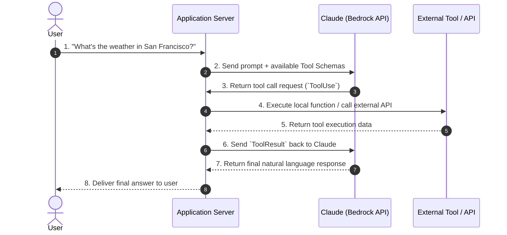
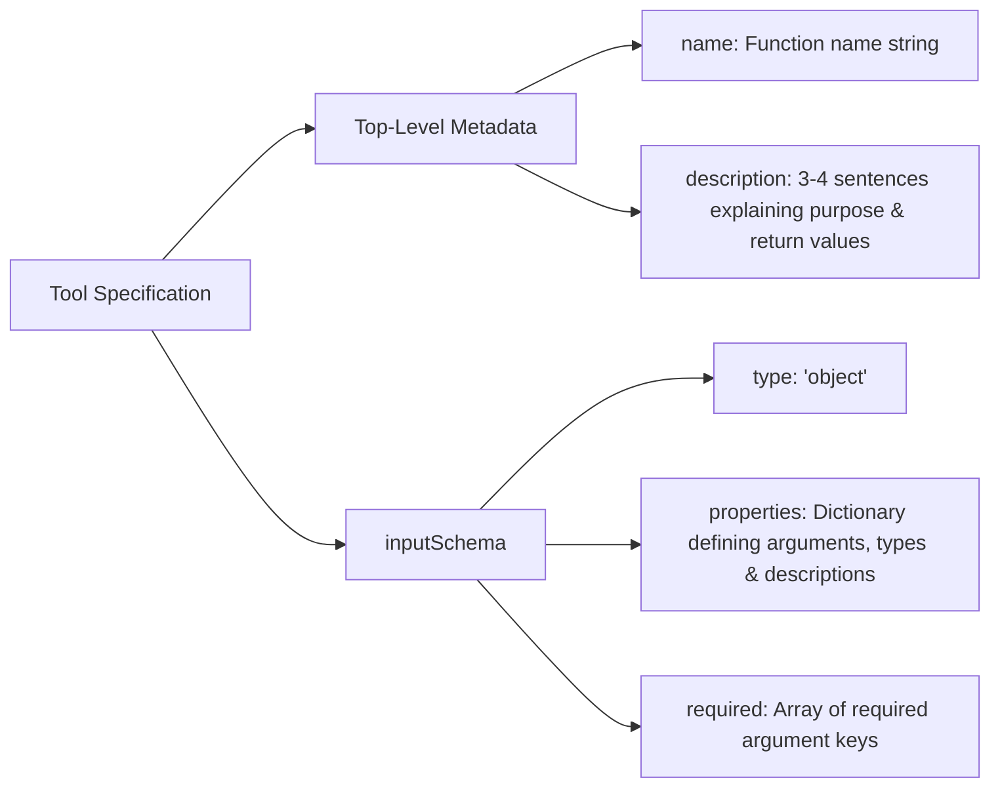
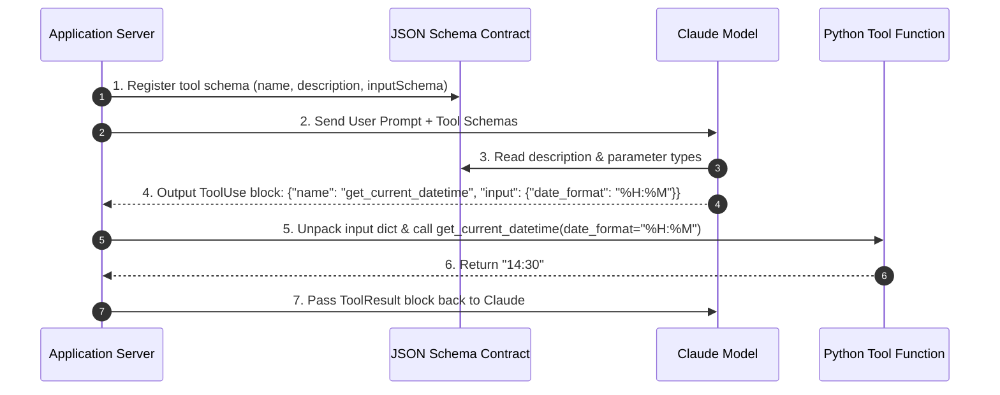
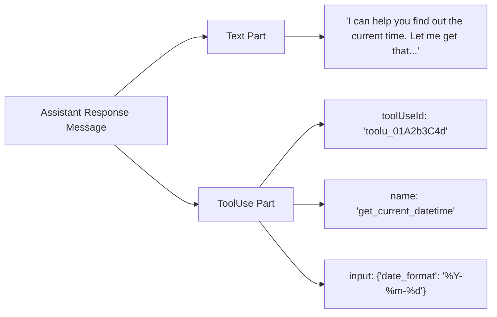
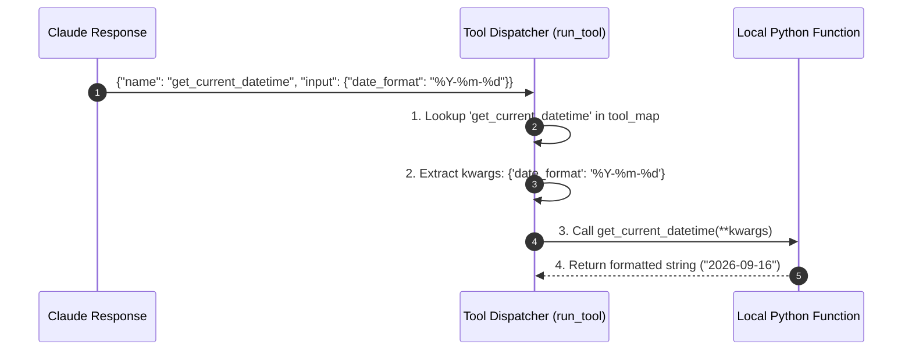

{% include video-summary.html
   id=""
   content="<p>This source provides a technical guide for <strong>integrating Claude models with Amazon Bedrock</strong> to enable advanced functional capabilities. It focuses primarily on <strong>tool use</strong>, a mechanism that allows the AI to <strong>interact with external APIs</strong>, databases, and custom code to perform real-time actions. The text details the <strong>multi-turn communication cycle</strong> between the application server and the model, using <strong>JSON schemas</strong> to define how tools are called and executed. Practical implementation is demonstrated through <strong>Python and Boto3</strong>, highlighting the importance of <strong>structured message histories</strong> and descriptive naming for reliability. Additionally, the documentation explains how to use <strong>Pydantic for automated schema generation</strong> and rigorous input validation. By following these workflows, developers can transition from static chat interfaces to <strong>autonomous, agentic AI systems</strong> capable of solving complex tasks.</p>" %}

<!--more-->

* TOC
{:toc}

---

## Introduction
Tool use is the mechanism that lets Claude go beyond generating text and actually **take actions or fetch information** by calling external functions — a calculator, a database query, a web search, an API, or a custom function you define.[^1] Instead of Claude guessing an answer from its training data, it can request a specific tool, receive a structured result back, and incorporate that into its response.

### The basic loop

1.  **You define tools** — each with a name, description, and an input schema (what parameters it expects), similar to defining a function signature.
2.  **You send a prompt + tool definitions** to Claude.
3.  **Claude decides** 👍 whether answering directly is enough, or whether it needs a tool. If it needs one, it responds with a structured `tool_use` block specifying which tool and what inputs to use — it does not execute anything itself.
4.  **Your code executes** the actual tool/function outside of Claude, then sends the result back as a `tool_result`.
5.  **Claude incorporates** that result into its next response, which might be the final answer or another tool call (multi-step/agentic behavior)[^2].

### Why it matters

This pattern is the foundation of **agentic AI** — systems where an LLM doesn't just chat, but plans, retrieves live data, calls APIs, writes/executes code, or orchestrates multi-step workflows[^3] [^4]. It's what separates a static chatbot from something like Claude Code, which can read files, run shell commands, and edit a codebase autonomously[^5].

The tools is the mechanism that enables Claude to interact with external APIs, databases, and code to fetch real-time information or perform actions outside its training data.
-   **The Limitation:** By default, Claude only knows what it was trained on. It cannot natively look up live data (e.g., current weather, financial data, or internal enterprise records). When asked about current events, it returns a standard limitation response (e.g., _"I don't have access to up-to-date weather information"_).
-   **The Solution:** Tool use acts as a bridge between Claude and your application backend, allowing Claude to request external data whenever needed to fulfill a query.



Tool execution relies on a multi-turn round-trip between your **Application Server**, **Claude**, and **External APIs**:

> the code implementation order differs from the execution runtime flow.
{:.warn}

The 4 Execution Steps:
1.   **Initial Request:** You send user instructions to Claude along with JSON schema descriptions of available tools.
2.   **Tool Request (`ToolUse`):** Claude analyzes the query, realizes it lacks context, and issues a structured request asking your server to run a specific tool with extracted parameters.
3.   **Data Retrieval:** Your backend server executes the requested tool (e.g., calling a REST API or querying a database).
4.   **Final Response (`ToolResult`):** Your server sends the tool's raw output back to Claude. Claude synthesizes the fresh data and returns a final answer to the user.

| Logical Execution Order | Code Development Order |
| --- | --- |
| 1. Send initial prompt & schemas | 1. Write the Python/JS tool function logic |
| 2. Claude decides to use tool | 2. Define the tool's JSON Schema specification |
| 3. Server executes function | 3. Build handlers for `ToolUse` & `ToolResult` messages |
| 4. Claude responds with answer | 4. Attach schemas to the initial API payload |

### What Are Tool Functions?

Tool functions are regular Python/backend functions that your server executes when Claude determines it needs external data or needs to perform an action. Claude does not run your server code directly; instead, it outputs a request asking your application to execute a specific tool with extracted parameters.

#### Best Practices for Writing Tool Functions

-   **Use Descriptive Naming:** Function names and parameter names must explicitly communicate their intent (e.g., `get_current_datetime` with `date_format` rather than `get_time` with `fmt`).
-   **Enforce Input Validation:** Always check that required parameters are valid and present before attempting execution (e.g., checking if `date_format` is empty).
-   **Provide Meaningful Error Messages:** When input validation fails or an exception occurs, return a clear, descriptive error message. Because Claude receives the error output as part of the tool result, explicit error messages allow Claude to self-correct on subsequent conversation turns.


```python
import boto3
import json
from datetime import datetime

# 1. Initialize Bedrock Runtime client
bedrock = boto3.client("bedrock-runtime", region_name="ap-southeast-2")
model_id = "au.anthropic.claude-haiku-4-5-20251001-v1:0"
```


```python
from datetime import datetime

# 2. Local Python Function & Registry Mapping
def get_current_datetime(date_format="%Y-%m-%d %H:%M:%S"):
    # 1. Input Validation
    if not date_format:
        raise ValueError("date_format cannot be empty")
    
    # 2. Execution
    return datetime.now().strftime(date_format)
```

## JSON Schema for Tools

### The Role of JSON Schema

A **JSON Schema** acts as a structural contract between your server and Claude. It informs Claude of:

1.  **When** to call the tool (via the tool name and description).
2.  **What** arguments the underlying Python function expects.
3.  **How** parameters must be formatted (data types, required fields, and constraints).



### The 4-Step Workflow to Create Tool Schemas

To simplify writing JSON schemas without getting bogged down in syntax:

1.  **Write Sample Keyword Arguments:** Create a standard Python dictionary containing representative values for your function arguments.
2.  **Convert to Valid JSON:** Format the dictionary as JSON (e.g., converting Python `True`/`False` to JSON `true`/`false`).
3.  **Generate JSON Schema:** Use an SDK helper or online converter to convert the sample JSON payload into JSON Schema structure (stripping unnecessary `$schema` declarations).
4.  **Add High-Quality Descriptions:** Enrich every property and top-level field with detailed explanations.


Here is how the get_current_datetime function translates into a Bedrock-compatible JSON schema specification:


```python
# 3. Bedrock Tool Specification Schema
tool_config = {
    "tools": [
        {
            "toolSpec": {
                "name": "get_current_datetime",
                "description": "Retrieves the current date and time formatted according to strftime format.",
                "inputSchema": {
                    "json": {
                        "type": "object",
                        "properties": {
                            "date_format": {
                                "type": "string",
                                "description": "Python strftime format string."
                            }
                        },
                        "required": []
                    }
                }
            }
        }
    ]
}
```





When writing descriptions for your tools and properties, follow these best practices[^6]:

-   Explain what the tool does, when to use it, and what it returns
-   Aim for 3-4 sentences in your tool description
-   Provide super detailed descriptions for each property
-   If you're stuck, paste your function into *Claude* and ask it to write descriptions for you

## Tool Use Responses

When Claude decides to call an external function, it does not output standard plain text alone. Instead, it returns a **multi-part response structure** that requires specific parsing and state management in your application.

### Tool Choice Configuration (`toolChoice`)

Before handling responses, the `toolChoice` parameter used in API requests to control _when_ and _how_ Claude uses available tools:

| Mode | Description | Primary Use Case |
| --- | --- | --- |
| **`auto`** | Claude autonomously decides whether to call a tool or answer directly _(Default)_. | Production conversational agents. |
| **`any`** | Forces Claude to call at least one tool, but lets Claude choose which tool from your schema list. | Workflows that must execute external tools. |
| **`specific tool`** | Forces Claude to call a specific tool designated by name. | Unit testing & enforcing single-purpose function calls. |


### Multi-Part Message

When Claude requests a tool, its response is returned as an assistant message containing **multiple content parts** rather than a simple string:



-   **Text Part:** Optional human-readable explanation emitted before calling the tool (e.g., _"Let me look up that information for you..."_).
-   **ToolUse Part:** The machine-readable instructions telling your backend server which function to execute and what parameters to pass.
    -   **`toolUseId`**: A unique string ID (e.g., `toolu_01...`) created by Claude. You **must** echo this ID back when sending the tool result so Claude can match the output to the correct request.
    -   **`name`**: The exact function name matching your JSON schema specification.
    -   **`input`**: A dictionary containing the arguments Claude extracted from the prompt to pass into your tool function.
  

## Tool Registry (Function Mapping)

To execute functions dynamically based on Claude’s string response, you create a **Tool Registry**—a dictionary mapping function name strings (matching your JSON schema names) directly to their Python function references.


```python
# Map schema tool names directly to callable Python functions
tool_map = {
    "get_current_datetime": get_current_datetime
}
```

This decoupling ensures that Claude can only invoke explicitly registered functions on your server, preventing arbitrary code execution.

## Extracting & Unpacking Arguments

When Claude emits a `toolUse` block, it returns a dictionary containing the tool `name` and an `input` object (a dictionary of argument key-value pairs).

Your server extracts these components and unpacks `input` into your Python function using keyword argument unpacking (`**input`):




```python
# 4. Initialize Conversation Messages
messages = [
    {
        "role": "user",
        "content": [{"text": "What is today's date in YYYY-MM-DD format?"}]
    }
]

# --- TURN 1: Send prompt + tools to Bedrock ---
response = bedrock.converse(
    modelId=model_id,
    messages=messages,
    toolConfig=tool_config
)

# Append Claude's initial response (containing the toolUse request) to history
assistant_message = response["output"]["message"]
messages.append(assistant_message)
```

Let's examin the response which used to construct the `assistant_message`:


    {'ResponseMetadata': {'RequestId': 'c48e8aab-3069-41c9-9ee4-fca3338660d6',
      'HTTPStatusCode': 200,
      'HTTPHeaders': {'date': 'Thu, 17 Sep 2026 23:46:18 GMT',
       'content-type': 'application/json',
       'content-length': '444',
       'connection': 'keep-alive',
       'x-amzn-requestid': 'c48e8aab-3069-41c9-9ee4-fca3338660d6'},
      'RetryAttempts': 0},
     'output': {'message': {'role': 'assistant',
       'content': [{'toolUse': {'toolUseId': 'tooluse_jfOe9bLWNDS6z8MvJyJ4jA',
          'name': 'get_current_datetime',
          'input': {'date_format': '%Y-%m-%d'},
          'type': 'tool_use'}}]}},
     'stopReason': 'tool_use',
     'usage': {'inputTokens': 591,
      'outputTokens': 63,
      'totalTokens': 654,
      'cacheReadInputTokens': 0,
      'cacheWriteInputTokens': 0},
     'metrics': {'latencyMs': 733}}


### Detecting Tool Call Requests (`stopReason`)

In Bedrock, every API response includes a top-level `stopReason` field that communicates why Claude stopped generating:

-   **`stopReason = "tool_use"`**: Signals that Claude paused output generation specifically because it needs a tool result before continuing.
-   **`stopReason = "end_turn"`**: Signals that Claude finished its text response naturally without needing any tools.

_(In code, you can also detect tool use by checking whether any item in the returned `parts` list contains a `"toolUse"` key)._  


```python
# --- TURN 2: Check stopReason and execute tool ---
if response.get("stopReason") == "tool_use":
    # Find the toolUse block in content
    for content_block in assistant_message["content"]:
        if "toolUse" in content_block:
            tool_use = content_block["toolUse"]
            tool_use_id = tool_use["toolUseId"]
            tool_name = tool_use["name"]
            tool_input = tool_use.get("input", {})
            
            # Execute local Python function safely
            try:
                result_text = str(tool_map[tool_name](**tool_input))
                status = "success"
            except Exception as e:
                result_text = f"Error: {str(e)}"
                status = "error"
            
            # Append ToolResult message block back to context
            tool_result_message = {
                "role": "user",
                "content": [
                    {
                        "toolResult": {
                            "toolUseId": tool_use_id,
                            "content": [{"text": result_text}],
                            "status": status
                        }
                    }
                ]
            }
            messages.append(tool_result_message)
```


```python
# --- TURN 3: Send tool result back to Bedrock for final synthesis ---
final_response = bedrock.converse(
    modelId=model_id,
    messages=messages,
    toolConfig=tool_config
)

final_text = final_response["output"]["message"]["content"][0]["text"]
print("Final Output:", final_text)
```

    Final Output: Today's date is **2026-09-18**.


Let's examin the `fianl_response`:


    {'ResponseMetadata': {'RequestId': '133b6286-890c-4903-a8bb-acaa76c0e306',
      'HTTPStatusCode': 200,
      'HTTPHeaders': {'date': 'Thu, 17 Sep 2026 23:53:11 GMT',
       'content-type': 'application/json',
       'content-length': '345',
       'connection': 'keep-alive',
       'x-amzn-requestid': '133b6286-890c-4903-a8bb-acaa76c0e306'},
      'RetryAttempts': 0},
     'output': {'message': {'role': 'assistant',
       'content': [{'text': "Today's date is **2026-09-18**."}]}},
     'stopReason': 'end_turn',
     'usage': {'inputTokens': 672,
      'outputTokens': 15,
      'totalTokens': 687,
      'cacheReadInputTokens': 0,
      'cacheWriteInputTokens': 0},
     'metrics': {'latencyMs': 640}}


## Helper Functions
The previous example used explicit dictionary manipulation to highlight the raw `boto3` API data structures so you could see the exact JSON contracts required by Bedrock without abstraction.

Using helper functions removes this boilerplate, handles type checks automatically, and makes multi-turn code much cleaner.


### Handling Execution Errors Gracefully

A critical pattern in tool execution is **defensive handling**. If your Python code throws an exception (e.g., missing API keys, network timeout, invalid arguments), the application should **not** crash.

Instead, the execution handler catches the exception and converts it into an informative string error message. This allows your server to pass the error back to Claude in the next turn so Claude can explain the failure or retry with corrected inputs.

#### Implementation: The `run_tool` Helper

Encapsulates dictionary extraction, tool lookup, argument unpacking (`**kwargs`), and exception handling in one reusable unit.


```python
def run_tool(tool_use, tool_map):
    tool_name = tool_use["name"]
    tool_input = tool_use.get("input", {})
    if tool_name not in tool_map:
        return f"Error: Tool '{tool_name}' missing", "error"
    try:
        return str(tool_map[tool_name](**tool_input)), "success"
    except Exception as e:
        return f"Error: {str(e)}", "error"
```

#### The ToolResult Payload Structure

When returning execution output to Claude, you must construct a `user` role message containing a `toolResult` content block. The `toolUseId` is the critical linking key—it pairs your execution result directly with Claude's original tool request.

> See the `# Append ToolResult message block back to context` in the `TURN 2` code above.

```json
{
  "role": "user",
  "content": [
    {
      "toolResult": {
        "toolUseId": "tooluse_jfOe9bLWNDS6z8MvJyJ4jA",
        "content": [{"text": "Today's date is **2026-09-18**."}],
        "status": "success"
      }
    }
  ]
}
```

**Key Schema Fields**

-   **`toolUseId`**: Must exactly match the ID returned in Claude's previous `toolUse` block.
-   **`content`**: An array of content blocks containing the execution output (text, structured JSON, or images).
-   **`status`**: `"success"` (default) or `"error"`. Setting status to `"error"` explicitly signals execution failure to Claude, allowing it to re-evaluate or explain the failure to the user gracefully.

**Maintaining History in the Round-Trip**

To maintain context, your application must append both the tool request and tool result to the conversation `messages` array in strict sequential order before making the second API call:

1.  **User Message:** Initial prompt (e.g., _"What is today's date?"_)
2.  **Assistant Message:** Claude's response containing the `toolUse` block.
3.  **User Message:** Your payload containing the `toolResult` block.

Formats the required `toolResult` block structure without having to write deeply nested dictionaries manually:


```python

def make_tool_result_message(tool_use_id, result_text, status="success"):
    return [
        {
            "toolResult": {
                "toolUseId": tool_use_id,
                "content": [{"text": result_text}],
                "status": status
            }
        }
    ]
```

#### user & assitant helper functions

Abstract away the verbose `{"role": "...", "content": [...]}` dictionary structures, accepting either plain string text or raw content lists using the following helper functions:


```python
def add_user_message(messages, content):
    if isinstance(content, str):
        messages.append({"role": "user", "content": [{"text": content}]})
    else:
        messages.append({"role": "user", "content": content})

def add_assistant_message(messages, content):
    if isinstance(content, str):
        messages.append({"role": "assistant", "content": [{"text": content}]})
    else:
        messages.append({"role": "assistant", "content": content})
```


```python
# Conversation execution using helper functions
messages = []
add_user_message(messages, "What is today's date in YYYY-MM-DD format?")

# Turn 1: Request
response = bedrock.converse(modelId=model_id, messages=messages, toolConfig=tool_config)
assistant_content = response["output"]["message"]["content"]
add_assistant_message(messages, assistant_content)

# Turn 2: Execute & Respond
if response.get("stopReason") == "tool_use":
    for block in assistant_content:
        if "toolUse" in block:
            tool_use = block["toolUse"]
            
            # Run tool via helper
            result_text, status = run_tool(tool_use, tool_map)
            
            # Build and append result message via helpers
            tool_result_content = make_tool_result_message(tool_use["toolUseId"], result_text, status)
            add_user_message(messages, tool_result_content)

# Turn 3: Final output
final_response = bedrock.converse(modelId=model_id, messages=messages, toolConfig=tool_config)
final_text = final_response["output"]["message"]["content"][0]["text"]
print("Final Output:", final_text)
```

    Final Output: Today's date is **2026-09-18**.


## Use of Pydantic

Pydantic[^7] (v2) simplifies tool use by generating Bedrock JSON schemas automatically from Python type hints and validating Claude’s input parameters before function execution.


```python
import boto3
from datetime import datetime
from typing import Callable, Dict, Type
from pydantic import BaseModel, Field
import json

# method to get current date and time
def get_current_datetime(date_format: str = "%Y-%m-%d %H:%M:%S") -> str:
    return datetime.now().strftime(date_format)

# Initialize Bedrock Runtime client
bedrock = boto3.client("bedrock-runtime", region_name="ap-southeast-2")
model_id = "au.anthropic.claude-haiku-4-5-20251001-v1:0"

# 1. Define Tool Inputs and Logic using Pydantic
class DateTimeInput(BaseModel):
    """Retrieves the current date and time formatted according to strftime format."""
    date_format: str = Field(
        default="%Y-%m-%d %H:%M:%S",
        description="Python strftime format string (e.g., '%Y-%m-%d')."
    )

# 2. Schema Generator for Bedrock
def pydantic_to_bedrock_tool(name: str, model: Type[BaseModel]) -> dict:
    schema = model.model_json_schema()
    # Strip Pydantic root metadata not needed by Bedrock
    schema.pop("title", None)
    
    return {
        "toolSpec": {
            "name": name,
            "description": model.__doc__ or "",
            "inputSchema": {"json": schema}
        }
    }

# Tool Registry associating Schemas, Models, and Functions
TOOL_REGISTRY: Dict[str, dict] = {
    "get_current_datetime": {
        "model": DateTimeInput,
        "func": get_current_datetime,
        "spec": pydantic_to_bedrock_tool("get_current_datetime", DateTimeInput)
    }
}

# 3. Pydantic-powered Execution Handler
def run_tool_with_pydantic(tool_use: dict) -> tuple[str, str]:
    tool_name = tool_use["name"]
    raw_input = tool_use.get("input", {})
    
    if tool_name not in TOOL_REGISTRY:
        return f"Error: Tool '{tool_name}' not registered.", "error"
    
    registry_entry = TOOL_REGISTRY[tool_name]
    model_cls = registry_entry["model"]
    func = registry_entry["func"]
    
    try:
        # Pydantic validates type constraints and applies defaults automatically
        validated_args = model_cls.model_validate(raw_input)
        result = func(**validated_args.model_dump())
        return str(result), "success"
    except Exception as e:
        return f"Validation/Execution Error: {str(e)}", "error"

# Build toolConfig dynamically from Registry
tool_config = {
    "tools": [entry["spec"] for entry in TOOL_REGISTRY.values()]
}

messages = [
    {"role": "user", "content": [{"text": "What is today's date in YYYY-MM-DD format?"}]}
]

# Turn 1: Send Request
response = bedrock.converse(modelId=model_id, messages=messages, toolConfig=tool_config)
assistant_message = response["output"]["message"]
messages.append(assistant_message)

# Turn 2: Validate & Run via Pydantic
if response.get("stopReason") == "tool_use":
    for block in assistant_message["content"]:
        if "toolUse" in block:
            tool_use = block["toolUse"]
            
            # Execute with Pydantic validation
            result_text, status = run_tool_with_pydantic(tool_use)
            
            # Send result back
            messages.append({
                "role": "user",
                "content": [{
                    "toolResult": {
                        "toolUseId": tool_use["toolUseId"],
                        "content": [{"text": result_text}],
                        "status": status
                    }
                }]
            })

# Turn 3: Final Output
final_response = bedrock.converse(modelId=model_id, messages=messages, toolConfig=tool_config)
print("Final Output:", final_response["output"]["message"]["content"][0]["text"])
```

    Final Output: Today's date is **2026-09-18** in YYYY-MM-DD format.


1. Tool Definition & Schema Generator**
    -   **`get_current_datetime()`**: The underlying Python function that returns a formatted datetime string.
    -   **`DateTimeInput`**: A Pydantic `BaseModel` that defines argument types, default values, and field descriptions. The model docstring serves as the tool description.
    -   **`pydantic_to_bedrock_tool()`**: Converts Pydantic's `model_json_schema()` into the nested `toolSpec` JSON structure required by Amazon Bedrock's Converse API.
2. Central Tool Registry & Validated Handler**
    -   **`TOOL_REGISTRY`**: Maps the tool name (`get_current_datetime`) to its Pydantic model, executable function, and generated Bedrock tool schema.
    -   **`run_tool_with_pydantic()`**: Extracts the model's tool call parameters and validates them against the Pydantic model using `model_cls.model_validate(raw_input)`. This guarantees type correctness and applies default values before passing kwargs (`**validated_args.model_dump()`) to the target Python function.

[^1]: Ryan Dickey, _Mastering Claude AI: Practical Journey from First Prompts to Pro with Claude AI_ (Apress, 2025). [learning.oreilly.com](https://learning.oreilly.com/library/view/-/9798868820014/?orm_source=mcp){:target="_blank" rel="noopener noreferrer"}

[^2]: Eden Marco, _Agentic Coding with Claude Code_ (Packt, 2026). [learning.oreilly.com](https://learning.oreilly.com/library/view/-/9781806022595/?orm_source=mcp){:target="_blank" rel="noopener noreferrer"}

[^3]: Maarten Grootendorst & Jay Alammar, _An Illustrated Guide to AI Agents_ (O'Reilly, 2026). [learning.oreilly.com](https://learning.oreilly.com/library/view/-/9798341662681/?orm_source=mcp){:target="_blank" rel="noopener noreferrer"}

[^4]: Salvatore Raieli & Gabriele Iuculano, _Building AI Agents with LLMs, RAG, and Knowledge Graphs_ (Packt, 2025). [learning.oreilly.com](https://learning.oreilly.com/library/view/-/9781835087060/?orm_source=mcp){:target="_blank" rel="noopener noreferrer"}

[^5]: Jia Huang, _The Claude Code Operating Model_ (Packt, 2026). [learning.oreilly.com](https://learning.oreilly.com/library/view/-/9781808082719/?orm_source=mcp){:target="_blank" rel="noopener noreferrer"}

[^6]: [JSON Schema for tools · Claude with Amazon Bedrock · Claude Academy](https://academy.claude.com/courses/claude-with-amazon-bedrock/json-schema-for-tools){:target="_blank" rel="noopener noreferrer"}

[^7]: [Structured Model for AI](){:target="_blank" rel="noopener noreferrer"}


{:gtxt: .message color="green"}

{:ytxt: .message color="yellow"}

{:rtxt: .message color="red"}


