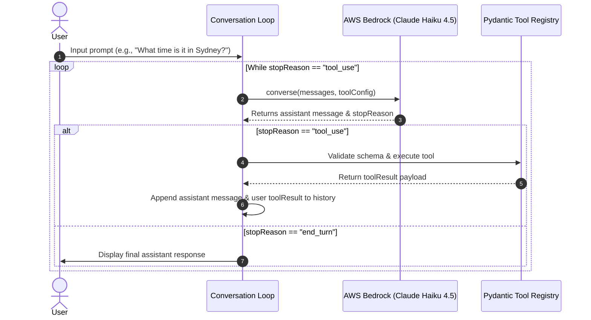
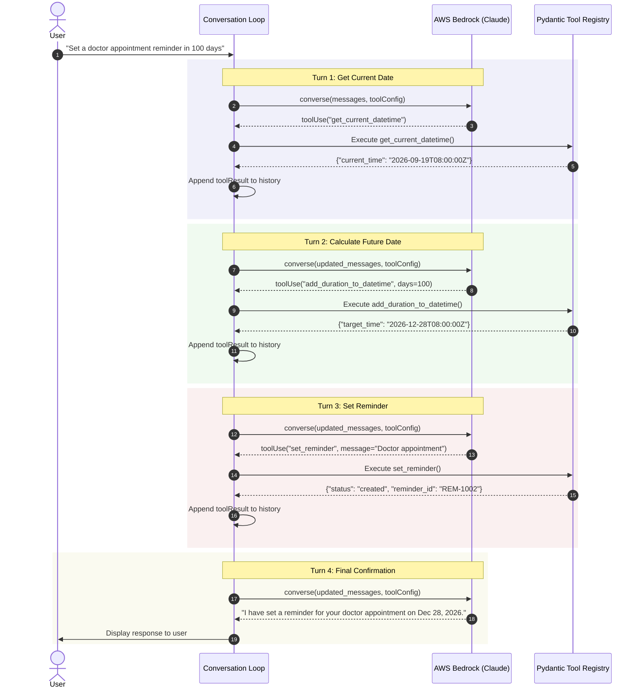
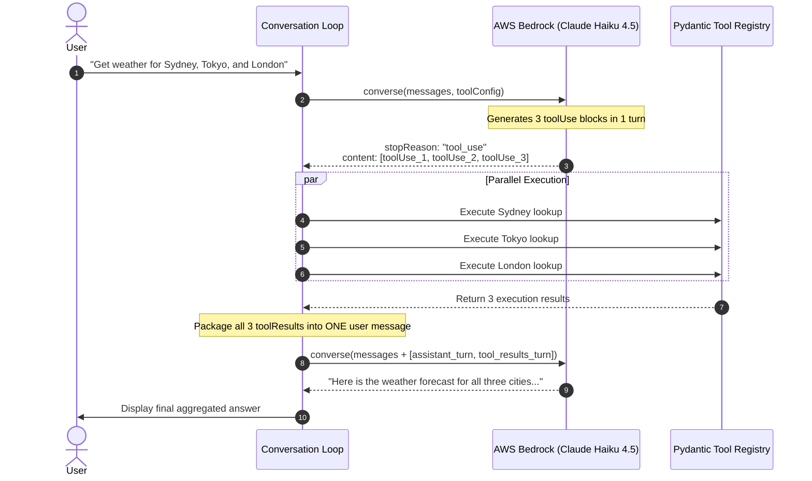
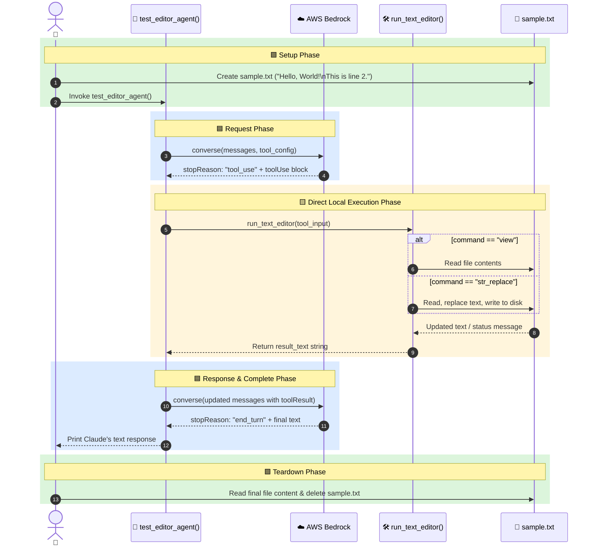

{% include video-summary.html
   id="aeSmBXJQHBY"
   content="<p>This technical guide details how to implement <strong>structured data extraction</strong> and <strong>multi-turn tool use</strong> using <strong>Claude on Amazon Bedrock</strong>. By defining <strong>Pydantic schemas</strong> as tool inputs, developers can force the model to return precise, type-safe data while bypassing unreliable conversational filler. The documentation explores advanced orchestration techniques, including <strong>batch tool execution</strong> for parallel processing and <strong>autonomous tool chaining</strong> for complex, multi-step tasks. Additionally, it highlights the use of <strong>built-in Anthropic tools</strong> like the text editor to perform direct file operations through validated backend handlers. The provided examples demonstrate a robust architecture for building resilient, <strong>agentic workflows</strong> that can self-correct when encountering validation errors. Overall, the text serves as a comprehensive manual for integrating <strong>large language models</strong> into production backend services with high reliability.</p>
" %}

<!--more-->

* TOC
{:toc}

---


## Structured Data with Tools

This post is continuation of the [Claude on Amazon Bedrock - Tool use basics](){:target="_blank" rel="noopener noreferrer"}.

### Tool-based structured Output
The core concept is straightforward: **instead of asking Claude to format its response as JSON, you create a tool whose input parameters match the exact structure of data you want to extract**{:gtxt}[^3]. Claude then "calls" this tool with the extracted data as arguments.

- **The Core Problem:** Asking an LLM to produce raw JSON in its text response often leads to formatting issues—such as markdown code block wrappers (```json ), trailing commas, or introductory conversational filler—making programmatic parsing fragile.
- 🛠️ **Tool-Based Extraction:** Instead of asking for JSON text, you define a schema as a tool definition (e.g., `extract_sentiment` or `record_database_entry`). When Claude calls the tool, the structured data is delivered in the typed `toolUse.input` parameter.
- **Forced Tool Choice (`toolChoice`):** By setting Bedrock's `toolChoice` parameter to force the specific tool (`{"tool": {"name": "..."}}`), you guarantee that Claude **must** respond by populating that exact data structure without writing conversational preamble.
- 🛡️ **Pydantic Type Safety:** Combining Pydantic with Bedrock allows you to generate the required JSON schema via `.model_json_schema()`, and immediately validate the returned `toolUse.input` back into a strongly typed Python object using `model_validate()`.


```python
import boto3
from typing import List
from pydantic import BaseModel, Field, ValidationError

# 🌐 1. Initialize Bedrock Runtime Client for Sydney Region
bedrock = boto3.client("bedrock-runtime", region_name="ap-southeast-2")
MODEL_ID = "au.anthropic.claude-haiku-4-5-20251001-v1:0"
```

_Write a JSON schema that describes the structure of data you want_:

⚙️ **Setup and Schema Registration:** The flow begins by defining a `MovieReview` Pydantic model, which specifies the exact data types and fields expected in the final output (such as `rating_out_of_10` as a float and `pros` as a list of strings). This schema is converted to JSON schema format and passed into AWS Bedrock's `toolConfig`.

Define Desired Output Schema with Pydantic:


```python
class MovieReview(BaseModel):
    """Target schema for structured movie review extraction."""
    movie_title: str = Field(description="Title of the movie")
    rating_out_of_10: float = Field(description="Numeric rating between 0.0 and 10.0")
    sentiment: str = Field(description="Overall sentiment: 'Positive', 'Negative', or 'Neutral'")
    pros: List[str] = Field(description="List of positive aspects mentioned")
    cons: List[str] = Field(description="List of negative aspects or critiques mentioned")
    is_recommended: bool = Field(description="True if recommended, False otherwise")

# Display the JSON schema for the MovieReview model
MovieReview.model_json_schema()
```


    {'description': 'Target schema for structured movie review extraction.',
     'properties': {'movie_title': {'description': 'Title of the movie',
       'title': 'Movie Title',
       'type': 'string'},
      'rating_out_of_10': {'description': 'Numeric rating between 0.0 and 10.0',
       'title': 'Rating Out Of 10',
       'type': 'number'},
      'sentiment': {'description': "Overall sentiment: 'Positive', 'Negative', or 'Neutral'",
       'title': 'Sentiment',
       'type': 'string'},
      'pros': {'description': 'List of positive aspects mentioned',
       'items': {'type': 'string'},
       'title': 'Pros',
       'type': 'array'},
      'cons': {'description': 'List of negative aspects or critiques mentioned',
       'items': {'type': 'string'},
       'title': 'Cons',
       'type': 'array'},
      'is_recommended': {'description': 'True if recommended, False otherwise',
       'title': 'Is Recommended',
       'type': 'boolean'}},
     'required': ['movie_title',
      'rating_out_of_10',
      'sentiment',
      'pros',
      'cons',
      'is_recommended'],
     'title': 'MovieReview',
     'type': 'object'}


_Create a tool with that schema as its input specification and force Claude to use the tool with the `toolChoice` parameter_:

By setting `toolChoice` to force the `extract_movie_review` tool, the application instructs Claude to skip writing conversational text and immediately output structured arguments matching the schema.

Configure Bedrock Tool with Forced Tool Choice


```python
TOOL_NAME = "extract_movie_review"

tool_config = {
    "tools": [
        {
            "toolSpec": {
                "name": TOOL_NAME,
                "description": "Extract structured analysis and metrics from a movie review text.",
                "inputSchema": {
                    "json": MovieReview.model_json_schema()
                }
            }
        }
    ],
    # 🔒 Force Claude to use this specific tool rather than responding in free text
    "toolChoice": {
        "tool": {
            "name": TOOL_NAME
        }
    }
}

# Display the tool configuration
tool_config
```


    {'tools': [{'toolSpec': {'name': 'extract_movie_review',
        'description': 'Extract structured analysis and metrics from a movie review text.',
        'inputSchema': {'json': {'description': 'Target schema for structured movie review extraction.',
          'properties': {'movie_title': {'description': 'Title of the movie',
            'title': 'Movie Title',
            'type': 'string'},
           'rating_out_of_10': {'description': 'Numeric rating between 0.0 and 10.0',
            'title': 'Rating Out Of 10',
            'type': 'number'},
           'sentiment': {'description': "Overall sentiment: 'Positive', 'Negative', or 'Neutral'",
            'title': 'Sentiment',
            'type': 'string'},
           'pros': {'description': 'List of positive aspects mentioned',
            'items': {'type': 'string'},
            'title': 'Pros',
            'type': 'array'},
           'cons': {'description': 'List of negative aspects or critiques mentioned',
            'items': {'type': 'string'},
            'title': 'Cons',
            'type': 'array'},
           'is_recommended': {'description': 'True if recommended, False otherwise',
            'title': 'Is Recommended',
            'type': 'boolean'}},
          'required': ['movie_title',
           'rating_out_of_10',
           'sentiment',
           'pros',
           'cons',
           'is_recommended'],
          'title': 'MovieReview',
          'type': 'object'}}}}],
     'toolChoice': {'tool': {'name': 'extract_movie_review'}}}


_Send your data and the tool schema to Claude_:

📝 **Processing the Review Text:** When the unstructured paragraph about _Cyberpunk Odyssey_ is passed to `extract_structured_review()`, it is wrapped in a user message prompt and sent to Bedrock. Claude analyzes the input text, reading specific details to populate the requested fields: it identifies the title (_Cyberpunk Odyssey_), calculates the sentiment, extracts the pros (visuals, soundtrack) and cons (pacing, dialogue), records the rating (`7.5`), and sets `is_recommended` to `True`. Claude places all these extracted insights directly into the `input` dictionary of the returned `toolUse` block.

Structured Extraction Handler:


```python
def extract_structured_review(unstructured_text: str) -> MovieReview:
    """Sends unstructured text to Bedrock and returns a validated Pydantic object."""
    messages = [
        {
            "role": "user",
            "content": [{"text": f"Extract the review details from this text:\n\n{unstructured_text}"}]
        }
    ]

    response = bedrock.converse(
        modelId=MODEL_ID,
        messages=messages,
        toolConfig=tool_config
    )

    output_message = response["output"]["message"]
    
    # Locate the toolUse block in the content array
    for block in output_message.get("content", []):
        if "toolUse" in block:
            tool_use = block["toolUse"]
            raw_data = tool_use.get("input", {})
            
            # 🧪 Validate and parse directly into Pydantic model instance
            try:
                extracted_review = MovieReview.model_validate(raw_data)
                return extracted_review
            except ValidationError as err:
                raise ValueError(f"Extracted data failed validation: {err}")

    raise RuntimeError("Model failed to return a tool_use block despite forced toolChoice.")

```

_Extract the structured data from the tool call arguments_:

🧪 **Validation and Object Creation:** Once Bedrock returns the response, the script extracts the raw `input` dictionary from the `toolUse` payload and passes it to `MovieReview.model_validate()`. Pydantic checks that every extracted value adheres to the defined types (for example, ensuring the rating is a number and not a string). Once validated, the dictionary becomes an instance of the `MovieReview` class, allowing individual attributes like `result.movie_title` or `result.pros` to be accessed directly in Python.

The test harness for the structured extraction flow. It takes a movie review in plain text, sends it to Bedrock through the `extract_structured_review()` helper, validates the response into a `MovieReview` Pydantic model, and prints the extracted fields. 


```python
review_text = """
I caught the weekend screening of 'Cyberpunk Odyssey'. The visual effects and world-building 
were absolutely breathtaking, and the synth soundtrack kept me on the edge of my seat. However, 
the pacing dragged significantly in the second act, and some of the dialogue felt forced. 
Overall, it's a solid watch for sci-fi fans—I'd give it a 7.5 out of 10 and recommend checking it out!
"""

print("📄 Processing Unstructured Text...")
result: MovieReview = extract_structured_review(review_text)

print("\n✅ Successfully Extracted Pydantic Object:")
print(f"🎬 Title:        {result.movie_title}")
print(f"⭐ Rating:       {result.rating_out_of_10}/10")
print(f"💭 Sentiment:    {result.sentiment}")
print(f"👍 Pros:         {result.pros}")
print(f"👎 Cons:         {result.cons}")
print(f"🍿 Recommended:  {result.is_recommended}")
```

    📄 Processing Unstructured Text...
    
    ✅ Successfully Extracted Pydantic Object:
    🎬 Title:        Cyberpunk Odyssey
    ⭐ Rating:       7.5/10
    💭 Sentiment:    Positive
    👍 Pros:         ['Visual effects and world-building were absolutely breathtaking', 'Synth soundtrack kept viewer on the edge of their seat']
    👎 Cons:         ['Pacing dragged significantly in the second act', 'Some of the dialogue felt forced']
    🍿 Recommended:  True


-   **Forced Execution (`toolChoice`):** Passing `"toolChoice": {"tool": {"name": "..."}}` ensures Claude bypasses any introductory conversational text and directly returns structured arguments.
-   **End-to-End Type Safety (`model_validate`):** Raw JSON dictionaries returned by Bedrock are parsed using `MovieReview.model_validate(raw_data)`, converting them into a Python object with full IDE auto-completion and type checking.
-   **Zero Parsing Hacks:** You do not need regular expressions, JSON string stripping, or markdown delimiter cleaning.

Forced Tool Choice (`toolChoice`) offers three huge advantages for production backend services compared to relying on system prompts:

1.  **100% Structural Reliability:** System prompts can still occasionally fail by adding conversational filler ("_Here is the JSON you requested:_") or wrapping output in markdown code blocks (` ```json `). `toolChoice` forces Claude to bypass free text entirely and populate your schema fields directly.
2.  **Reduced Latency & Token Costs:** Because Claude skips writing conversational preambles, responses generate faster and consume fewer output tokens.
3.  **Predictable API Contracts:** Your backend code can confidently expect `stopReason == "tool_use"` every single time, eliminating the need for fragile regex fallback parsers or text-cleaning scripts.


## Multi-Turn Conversations with Tools

<div style="display: flex; justify-content: center;">
  
</div>


The lesson **"Multi-Turn conversations with tools"** focuses on creating a flexible conversational loop that gracefully handles both tool requests and direct answers from Claude.

-   ⚠️ **The Core Problem:** Simple tool integrations often assume that _every_ assistant response requires a tool execution. When a user asks a direct question (e.g., _"What is 1+1?"_), Claude responds without invoking a tool. Naively expecting tool outputs leads to empty or invalid tool-result messages in the conversation history.
-   🚦 **The Solution (`stopReason` Inspection):** Every Bedrock `converse` response includes a `stopReason` metadata attribute:
    
    -   `"tool_use"`: Claude wants to invoke one or more tools. The app must execute the tools, return results in a `user` message block (`toolResult`), and continue the conversation loop.
    -   `"end_turn"`: Claude finished generating its complete answer naturally without requesting further tool calls. The app can display the text and exit the loop.
    -   `"max_tokens"` / `"stop_sequence"`: The model hit generation limits or encountered a stop sequence.



In the pervious post[^1], I've explained the use of the Pydantic[^2] to simplify the tool schema.


```python
import boto3
from typing import Any, Dict, List
from pydantic import BaseModel, Field, ValidationError
from datetime import datetime
from zoneinfo import ZoneInfo

# Initialize AWS Bedrock Runtime client for Sydney region
bedrock = boto3.client("bedrock-runtime", region_name="ap-southeast-2")
MODEL_ID = "au.anthropic.claude-haiku-4-5-20251001-v1:0"

# 📦 1. Define Tool Schemas using Pydantic
class GetDateTimeInput(BaseModel):
    """Get current date and time for a given timezone"""
    timezone: str = Field(
        default="UTC",
        description="Target timezone (e.g., 'Australia/Sydney', 'UTC', 'America/New_York')"
    )

# 🛠️ 2. Tool Implementation Functions
def get_current_datetime(data: GetDateTimeInput) -> Dict[str, str]:
    """Returns current datetime for specified timezone."""
    return {
        "timezone": data.timezone,
        "datetime": datetime.now(ZoneInfo(data.timezone)).strftime("%Y-%m-%d %H:%M:%S %Z")
    }

# Tool Registry mapping names to execution functions and Pydantic models
TOOL_REGISTRY = {
    "get_current_datetime": {
        "func": get_current_datetime,
        "schema": GetDateTimeInput
    }
}

# Convert Pydantic schema to Bedrock toolConfig format
tool_config = {
    "tools": [
        {
            "toolSpec": {
                "name": "get_current_datetime",
                "description": GetDateTimeInput.__doc__ or "",
                "inputSchema": {
                    "json": GetDateTimeInput.model_json_schema()
                }
            }
        }
    ]
}

# 🔄 3. Tool Execution Handler
def process_tool_calls(content_blocks: List[Dict[str, Any]]) -> List[Dict[str, Any]]:
    """Extracts toolUse blocks, validates parameters with Pydantic, and returns toolResult content."""
    tool_results = []
    
    for block in content_blocks:
        if "toolUse" in block:
            tool_use = block["toolUse"]
            tool_use_id = tool_use["toolUseId"]
            tool_name = tool_use["name"]
            raw_input = tool_use.get("input", {})

            if tool_name in TOOL_REGISTRY:
                try:
                    # Validate incoming arguments using Pydantic
                    validated_input = TOOL_REGISTRY[tool_name]["schema"](**raw_input)
                    result_data = TOOL_REGISTRY[tool_name]["func"](validated_input)
                    status = "success"
                except ValidationError as err:
                    result_data = {"error": f"Pydantic Validation Error: {err.errors()}"}
                    status = "error"
            else:
                result_data = {"error": f"Tool '{tool_name}' not found."}
                status = "error"

            tool_results.append({
                "toolResult": {
                    "toolUseId": tool_use_id,
                    "content": [{"json": result_data}],
                    "status": status
                }
            })
            
    return tool_results

# 💬 4. Dynamic Multi-Turn Conversation Loop
def run_conversation(user_prompt: str) -> List[Dict[str, Any]]:
    """Executes conversation, looping dynamically based on stopReason."""
    messages = [
        {"role": "user", "content": [{"text": user_prompt}]}
    ]

    print(f"\n👤 User: {user_prompt}")

    while True:
        # Call Bedrock Converse API
        response = bedrock.converse(
            modelId=MODEL_ID,
            messages=messages,
            toolConfig=tool_config
        )

        output_message = response["output"]["message"]
        stop_reason = response["stopReason"]

        # Append Claude's assistant message to history
        messages.append(output_message)

        # Print text response if generated
        for block in output_message.get("content", []):
            if "text" in block:
                print(f"🤖 Claude: {block['text']}")

        # Check stop condition
        if stop_reason == "tool_use":
            print("🛠️ Action: Claude requested tool execution. Running tools...")
            tool_results = process_tool_calls(output_message["content"])

            # Send tool results back as a user turn
            messages.append({
                "role": "user",
                "content": tool_results
            })
        else:
            print(f"🚦 Conversation turn complete (stopReason: '{stop_reason}')")
            break

    return messages


```

Test 1: Triggers tool execution


```python
run_conversation("What time is it right now in Sydney?")
```

    
    👤 User: What time is it right now in Sydney?
    🛠️ Action: Claude requested tool execution. Running tools...
    🤖 Claude: The current time in Sydney is **8:03 PM (20:03)** on September 18, 2026 (AEST - Australian Eastern Standard Time).
    🚦 Conversation turn complete (stopReason: 'end_turn')


    [{'role': 'user',
      'content': [{'text': 'What time is it right now in Sydney?'}]},
     {'role': 'assistant',
      'content': [{'toolUse': {'toolUseId': 'tooluse_5GzIh8sFOvyouGjG5ytKGg',
         'name': 'get_current_datetime',
         'input': {'timezone': 'Australia/Sydney'},
         'type': 'tool_use'}}]},
     {'role': 'user',
      'content': [{'toolResult': {'toolUseId': 'tooluse_5GzIh8sFOvyouGjG5ytKGg',
         'content': [{'json': {'timezone': 'Australia/Sydney',
            'datetime': '2026-09-18 20:03:03 AEST'}}],
         'status': 'success'}}]},
     {'role': 'assistant',
      'content': [{'text': 'The current time in Sydney is **8:03 PM (20:03)** on September 18, 2026 (AEST - Australian Eastern Standard Time).'}]}]


Test 2: Direct answer (No tool call required)


```python
run_conversation("What is the capital of Australia?")
```

    
    👤 User: What is the capital of Australia?
    🤖 Claude: The capital of Australia is **Canberra**. 
    
    Canberra is located in the Australian Capital Territory (ACT) and was purpose-built as the capital city, designed by American architects Walter Burley Griffin and Marion Mahoney Griffin. It was chosen as a compromise location between rivals Sydney and Melbourne and was established in 1927.
    🚦 Conversation turn complete (stopReason: 'end_turn')


    [{'role': 'user', 'content': [{'text': 'What is the capital of Australia?'}]},
     {'role': 'assistant',
      'content': [{'text': 'The capital of Australia is **Canberra**. \n\nCanberra is located in the Australian Capital Territory (ACT) and was purpose-built as the capital city, designed by American architects Walter Burley Griffin and Marion Mahoney Griffin. It was chosen as a compromise location between rivals Sydney and Melbourne and was established in 1927.'}]}]


<!--  -->

## Adding Multiple Tools
We discussed the  basic tool integration by demonstrating how to register multiple tools and handle multi-step tool orchestration.

- 🛠️ _Multi-Tool Registration_: Registering multiple tools requires passing a list of tool specifications inside the toolConfig array provided to the Bedrock converse API.
- 🔀 _Dynamic Tool Dispatching_: When Claude returns a toolUse block, your execution handler reads the requested tool name, routes the payload to the matching tool function, and returns the result.
- 🔗 _Autonomous Tool Chaining_: When faced with complex multi-step prompts (e.g., "Set a reminder to go to the doctor in 100 days"), Claude automatically decomposes the problem into a sequence of tool calls across conversational turns:
    1. Calls `get_current_datetime` to determine the current date and time.
    2. Calls `add_duration_to_datetime` to add 100 days to the current timestamp.
    3. Calls `set_reminder` using the newly computed date and time.

📈 Scalability: The core conversation loop remains unchanged regardless of how many tools you add. You only need to declare the tool schemas and extend your dispatch logic.




```python
import boto3
from datetime import datetime, timedelta
from typing import Any, Dict, List
from pydantic import BaseModel, Field, ValidationError

# Initialize AWS Bedrock Runtime client for Sydney region
bedrock = boto3.client("bedrock-runtime", region_name="ap-southeast-2")
MODEL_ID = "au.anthropic.claude-haiku-4-5-20251001-v1:0"

# -------------------------------------------------------------------
# 📦 1. Define Tool Schemas with Pydantic
# -------------------------------------------------------------------

class GetDateTimeInput(BaseModel):
    """Input for getting the current date and time."""
    timezone: str = Field(
        default="UTC",
        description="Target timezone string, e.g., 'UTC' or 'Australia/Sydney'"
    )

class AddDurationInput(BaseModel):
    """Input for calculating a future date by adding days/hours."""
    start_datetime: str = Field(
        description="Base ISO timestamp (e.g. '2026-09-19T08:00:00')"
    )
    days: int = Field(default=0, description="Number of days to add")
    hours: int = Field(default=0, description="Number of hours to add")

class SetReminderInput(BaseModel):
    """Input for creating a reminder."""
    message: str = Field(description="Content of the reminder")
    target_datetime: str = Field(
        description="Scheduled ISO timestamp for the reminder"
    )

# -------------------------------------------------------------------
# 🛠️ 2. Tool Implementation Functions
# -------------------------------------------------------------------

def get_current_datetime(data: GetDateTimeInput) -> Dict[str, Any]:
    now = datetime.now().strftime("%Y-%m-%dT%H:%M:%S")
    return {"timezone": data.timezone, "current_datetime": now}

def add_duration_to_datetime(data: AddDurationInput) -> Dict[str, Any]:
    base_dt = datetime.fromisoformat(data.start_datetime)
    future_dt = base_dt + timedelta(days=data.days, hours=data.hours)
    return {
        "start_datetime": data.start_datetime,
        "calculated_datetime": future_dt.strftime("%Y-%m-%dT%H:%M:%S")
    }

def set_reminder(data: SetReminderInput) -> Dict[str, Any]:
    # Simulated database/notification integration
    return {
        "status": "success",
        "reminder_id": "REM-8842",
        "message": data.message,
        "scheduled_for": data.target_datetime
    }

# -------------------------------------------------------------------
# 🗂️ 3. Tool Registry & Bedrock Config
# -------------------------------------------------------------------

TOOL_REGISTRY = {
    "get_current_datetime": {
        "func": get_current_datetime,
        "model": GetDateTimeInput,
        "description": "Get current date and time for a given timezone."
    },
    "add_duration_to_datetime": {
        "func": add_duration_to_datetime,
        "model": AddDurationInput,
        "description": "Add days or hours to an ISO timestamp to calculate a future date."
    },
    "set_reminder": {
        "func": set_reminder,
        "model": SetReminderInput,
        "description": "Create a calendar reminder for a specific date and time."
    }
}

# Auto-generate Bedrock toolConfig from Pydantic schemas
tool_config = {
    "tools": [
        {
            "toolSpec": {
                "name": name,
                "description": info["description"],
                "inputSchema": {
                    "json": info["model"].model_json_schema()
                }
            }
        }
        for name, info in TOOL_REGISTRY.items()
    ]
}

# -------------------------------------------------------------------
# ⚡ 4. Tool Execution Router
# -------------------------------------------------------------------

def execute_tool_call(tool_name: str, raw_input: Dict[str, Any]) -> Dict[str, Any]:
    """Validates arguments using Pydantic and executes the target tool."""
    if tool_name not in TOOL_REGISTRY:
        return {"error": f"Tool '{tool_name}' is not registered."}

    tool_info = TOOL_REGISTRY[tool_name]
    try:
        # Pydantic validation ensures type-safe tool inputs
        validated_args = tool_info["model"](**raw_input)
        return tool_info["func"](validated_args)
    except ValidationError as err:
        return {"error": f"Pydantic Validation Error: {err.errors()}"}

# -------------------------------------------------------------------
# 🔄 5. Multi-Turn Orchestration Loop
# -------------------------------------------------------------------

def run_multi_tool_conversation(user_prompt: str):
    """Executes multi-turn conversation loop with dynamic multi-tool support."""
    messages = [{"role": "user", "content": [{"text": user_prompt}]}]
    print(f"\n👤 User: {user_prompt}\n" + "-" * 50)

    while True:
        response = bedrock.converse(
            modelId=MODEL_ID,
            messages=messages,
            toolConfig=tool_config
        )

        output_message = response["output"]["message"]
        stop_reason = response["stopReason"]
        messages.append(output_message)

        # Print text output if provided
        for block in output_message.get("content", []):
            if "text" in block:
                print(f"🤖 Claude: {block['text']}")

        if stop_reason == "tool_use":
            tool_results = []
            for block in output_message.get("content", []):
                if "toolUse" in block:
                    tool_use = block["toolUse"]
                    tool_id = tool_use["toolUseId"]
                    name = tool_use["name"]
                    inputs = tool_use.get("input", {})

                    print(f"🛠️ Executing Tool [{name}] with inputs: {inputs}")
                    result_data = execute_tool_call(name, inputs)

                    tool_results.append({
                        "toolResult": {
                            "toolUseId": tool_id,
                            "content": [{"json": result_data}],
                            "status": "error" if "error" in result_data else "success"
                        }
                    })

            # Send tool results back to Claude
            messages.append({"role": "user", "content": tool_results})
        else:
            print(f"\n✅ Completed workflow (stopReason: '{stop_reason}')")
            break


if __name__ == "__main__":
    # Test complex prompt requiring tool chaining:
    # 1. get_current_datetime -> 2. add_duration_to_datetime -> 3. set_reminder
    run_multi_tool_conversation(
        "Set a reminder to go to the doctor. The appointment is in 100 days."
    )
```

    
    👤 User: Set a reminder to go to the doctor. The appointment is in 100 days.
    --------------------------------------------------
    🤖 Claude: I'll help you set a reminder for your doctor's appointment in 100 days. First, let me get the current date and time, then calculate when the appointment will be.
    🛠️ Executing Tool [get_current_datetime] with inputs: {'timezone': 'UTC'}
    🤖 Claude: Now I'll calculate the date 100 days from now:
    🛠️ Executing Tool [add_duration_to_datetime] with inputs: {'start_datetime': '2026-09-19T08:25:38', 'days': 100}
    🤖 Claude: Now I'll set the reminder for that date:
    🛠️ Executing Tool [set_reminder] with inputs: {'message': 'Go to the doctor', 'target_datetime': '2026-12-28T08:25:38'}
    🤖 Claude: Perfect! I've set a reminder for your doctor's appointment. Here are the details:
    
    - **Reminder Message:** Go to the doctor
    - **Appointment Date:** December 28, 2026 at 8:25 AM (UTC)
    - **Reminder ID:** REM-8842
    - **Status:** Successfully scheduled
    
    You'll be reminded in 100 days to go to your doctor's appointment!
    
    ✅ Completed workflow (stopReason: 'end_turn')


-   **Schema Centralization with Pydantic:** Using `.model_json_schema()` on Pydantic models automatically constructs compliant JSON Schema structures required by Bedrock `toolSpec`.
-   **Robust Type Validation:** Before executing a function, `GetDateTimeInput(**raw_input)` checks for missing or incorrect fields.
-   **Seamless Multi-Step Chaining:** The `while True` loop allows Claude to issue multiple single or batch tool calls in successive turns without needing custom workflow orchestration code.

When a tool returns an error status with error details (such as a Pydantic `ValidationError`), Claude doesn't crash! Instead, it analyzes the error feedback in the next turn and attempts to **self-correct** 🔄. For example, if Pydantic reports that `days` expected an `int` but received `"100 days"`, Claude reads this validation message, adjusts its parameter to `100`, and issues a new `toolUse` call with the corrected payload 🛠️.

> This error feedback loop makes agentic workflows remarkably resilient against minor parameter formatting mistakes.
{:.ok}

## Batch Tool Use
-   ⚡ **Parallel Requests:** When facing prompts with multiple independent sub-tasks (e.g., _"Check the weather in Sydney, Melbourne, and Brisbane"_), Claude generates multiple `toolUse` blocks within a **single** response message.
-   🧩 **Content Array Inspection:** The response `output.message.content` array contains several `toolUse` dictionary items, each with its own distinct `toolUseId`, `name`, and `input` dictionary.
-   📦 **Single Result Bundle:** Your application must process all requested tool calls and submit all corresponding `toolResult` blocks bundled inside a **single** `user` turn message back to Bedrock.
-   🚀 **Latency & Cost Efficiency:** Batching reduces multi-turn round trips from N separate turns down to a single parallel turn, lowering API latency and message overhead.




```python
import boto3
from concurrent.futures import ThreadPoolExecutor
from typing import Any, Dict, List
from pydantic import BaseModel, Field, ValidationError

# 🌐 1. Initialize Bedrock Client for Sydney Region
bedrock = boto3.client("bedrock-runtime", region_name="ap-southeast-2")
MODEL_ID = "au.anthropic.claude-haiku-4-5-20251001-v1:0"

# 📦 2. Define Pydantic Schema for Tool Inputs
class WeatherInput(BaseModel):
    """Input parameters for weather lookup."""
    city: str = Field(description="Name of the city, e.g., 'Sydney', 'Tokyo'")
    units: str = Field(default="Celsius", description="'Celsius' or 'Fahrenheit'")

# 🛠️ 3. Simulated Tool Execution Function
def get_weather(data: WeatherInput) -> Dict[str, Any]:
    """Mock weather lookup function."""
    mock_data = {
        "sydney": {"temp": "22°C", "condition": "Sunny"},
        "tokyo": {"temp": "16°C", "condition": "Cloudy"},
        "london": {"temp": "11°C", "condition": "Rain"}
    }
    city_key = data.city.lower()
    info = mock_data.get(city_key, {"temp": "20°C", "condition": "Clear"})
    return {"city": data.city, "temperature": info["temp"], "condition": info["condition"]}

# Tool Registry
TOOL_REGISTRY = {
    "get_weather": {
        "func": get_weather,
        "schema": WeatherInput
    }
}

# Bedrock toolConfig configuration
tool_config = {
    "tools": [
        {
            "toolSpec": {
                "name": "get_weather",
                "description": "Fetch current weather conditions for a specified city.",
                "inputSchema": {
                    "json": WeatherInput.model_json_schema()
                }
            }
        }
    ]
}

# ⚡ 4. Single Tool Executor with Pydantic Validation
def process_single_tool_call(tool_use: Dict[str, Any]) -> Dict[str, Any]:
    """Validates input using Pydantic and executes the tool function."""
    tool_id = tool_use["toolUseId"]
    tool_name = tool_use["name"]
    raw_input = tool_use.get("input", {})

    if tool_name in TOOL_REGISTRY:
        try:
            # 🧪 Validate inputs with Pydantic
            schema = TOOL_REGISTRY[tool_name]["schema"]
            validated_input = schema(**raw_input)
            result = TOOL_REGISTRY[tool_name]["func"](validated_input)
            status = "success"
        except ValidationError as err:
            result = {"error": f"Validation Error: {err.errors()}"}
            status = "error"
    else:
        result = {"error": f"Unknown tool: {tool_name}"}
        status = "error"

    return {
        "toolResult": {
            "toolUseId": tool_id,
            "content": [{"json": result}],
            "status": status
        }
    }

# 🔄 5. Batch Tool Processing Loop
def run_batch_tool_conversation(prompt: str):
    messages = [{"role": "user", "content": [{"text": prompt}]}]
    print(f"\n👤 User Prompt: {prompt}\n" + "-" * 50)

    while True:
        response = bedrock.converse(
            modelId=MODEL_ID,
            messages=messages,
            toolConfig=tool_config
        )

        output_msg = response["output"]["message"]
        stop_reason = response["stopReason"]
        messages.append(output_msg)

        # Print any generated text
        for block in output_msg.get("content", []):
            if "text" in block:
                print(f"🤖 Claude: {block['text']}")

        if stop_reason == "tool_use":
            # 🧩 Extract all toolUse blocks in this response turn
            tool_use_blocks = [
                block["toolUse"]
                for block in output_msg.get("content", [])
                if "toolUse" in block
            ]

            print(f"⚡ Batch Processing: Executing {len(tool_use_blocks)} tool call(s) concurrently...")

            # 🚀 Execute tool calls in parallel using ThreadPoolExecutor
            with ThreadPoolExecutor() as executor:
                tool_results = list(executor.map(process_single_tool_call, tool_use_blocks))

            # 📦 Append ALL tool results as a single user message turn
            messages.append({"role": "user", "content": tool_results})
        else:
            print(f"\n✅ Conversation Turn Completed (stopReason: '{stop_reason}')")
            break


if __name__ == "__main__":
    # Test batch execution across 3 locations in a single turn
    run_batch_tool_conversation("What is the current weather in Sydney, tokyo, and London?")
```

    
    👤 User Prompt: What is the current weather in Sydney, tokyo, and London?
    --------------------------------------------------
    ⚡ Batch Processing: Executing 3 tool call(s) concurrently...
    🤖 Claude: Here's the current weather for those three cities:
    
    **Sydney:** Sunny, 22°C
    
    **Tokyo:** Cloudy, 16°C
    
    **London:** Rain, 11°C
    
    Sydney is enjoying the warmest and sunniest weather of the three, while London is the coolest and experiencing rain.
    
    ✅ Conversation Turn Completed (stopReason: 'end_turn')


## Text Editor Tool

Unlike custom tools where you must write both the schema and execution logic, built-in Anthropic tools (such as `text_editor_20250728` or `computer_20241022`) have **pre-defined JSON schemas** embedded inside Claude. Your application only needs to register the tool string with Bedrock and provide the backend execution handler to perform the requested file operations safely on disk.

| Command | Purpose |
| --- | --- |
| `view` 👁️ | Reads file contents or directory listings (with optional line ranges). |
| `create` 📝 | Creates a new file at a specified path with initial content. |
| `str_replace` 🔄 | Replaces a specific snippet of text in an existing file with new text. |
| `insert` 📥 | Inserts text at a specific line number within an existing file. |




### Pydantic Schemas for Text Editor Commands

This section defines **type-safe data models** using Pydantic to validate parameters before running any file operations.

- **`Literal[...]` fields:** By using `Literal["view"]`, `Literal["create"]`, etc., Pydantic forces the `command` field to match that _exact_ string. This acts as a discriminator for command types.
- **Specific Command Models:** Each class specifies required arguments for a given action:
    -   `ViewCommand` only needs a file `path`.
    -   `CreateCommand` requires a `path` and the `file_text` to write.
    -   `StrReplaceCommand` requires `old_str` and `new_str` for search-and-replace.
    -   `InsertCommand` requires a specific `insert_line` number.
- **`EditorCommand` Union:** Combines all four model types into a single type hint, representing any valid command structure.


```python
import os
import boto3
from typing import Literal, Optional, Union
from pydantic import BaseModel, Field, ValidationError


# 📦 1. Pydantic Schemas for Text Editor Commands
class ViewCommand(BaseModel):
    command: Literal["view"]
    path: str

class CreateCommand(BaseModel):
    command: Literal["create"]
    path: str
    file_text: str

class StrReplaceCommand(BaseModel):
    command: Literal["str_replace"]
    path: str
    old_str: str
    new_str: str

class InsertCommand(BaseModel):
    command: Literal["insert"]
    path: str
    insert_line: int
    new_str: str

EditorCommand = Union[ViewCommand, CreateCommand, StrReplaceCommand, InsertCommand]
```

### Safe Local Text Editor Execution Handler

This function serves as the **backend logic** that receives raw dictionary data from Claude, validates it, and modifies the disk.

- **Command Routing:** It reads `raw_input.get("command")` to determine which command was requested.
- **Pydantic Instantiation:** Passing `**raw_input` into a class (e.g., `ViewCommand(**raw_input)`) automatically validates the incoming data. If required fields are missing or have wrong types, Pydantic raises a `ValidationError`.
- 🗂️ **File Operations:**
    -   For `"view"`, it either lists directory contents via `os.listdir()` or reads a file with `open()`.
    -   For `"create"`, it writes new text to the specified file path.
    -   For `"str_replace"`, it verifies `old_str` exists in the file before performing a single string replacement (`count=1`).
-   🛡️ **Error Handling:** The `try-except` block catches both data validation errors (`ValidationError`) and disk/permission issues (`Exception`), returning clean string error messages back to the caller instead of crashing the program.


```python
# 🛠️ 2. Safe Local Text Editor Execution Handler
def execute_text_editor_command(raw_input: dict) -> str:
    """Validates raw tool parameters with Pydantic and applies file operations."""
    try:
        # Validate discriminator command type
        cmd: EditorCommand = BaseModel.__subclasses__()
        if raw_input.get("command") == "view":
            data = ViewCommand(**raw_input)
            if os.path.isdir(data.path):
                return "\n".join(os.listdir(data.path))
            with open(data.path, "r", encoding="utf-8") as f:
                return f.read()

        elif raw_input.get("command") == "create":
            data = CreateCommand(**raw_input)
            with open(data.path, "w", encoding="utf-8") as f:
                f.write(data.file_text)
            return f"File successfully created at {data.path}"

        elif raw_input.get("command") == "str_replace":
            data = StrReplaceCommand(**raw_input)
            with open(data.path, "r", encoding="utf-8") as f:
                content = f.read()
            if data.old_str not in content:
                return f"Error: '{data.old_str}' not found in {data.path}"
            updated = content.replace(data.old_str, data.new_str, 1)
            with open(data.path, "w", encoding="utf-8") as f:
                f.write(updated)
            return f"Successfully replaced text in {data.path}"

    except ValidationError as err:
        return f"Validation Error: {err}"
    except Exception as e:
        return f"File System Error: {str(e)}"
```

### Tool Specification for Bedrock

This dictionary defines the **JSON Schema interface** sent to AWS Bedrock so Claude understands how to use the tool.
- **`name` & `description`:** Identifies the tool (`text_editor_20250728`)[^4] and explains its capability to Claude.
- **`inputSchema`:** Written in JSON Schema format, telling Claude:
  -   What properties exist (`command`, `path`, `old_str`, etc.).
  -   What allowed values exist for `command` using `"enum": ["view", "create", "str_replace", "insert"]`.
  -   Which fields are mandatory for every invocation (`"required": ["command", "path"]`).


```python
# 3. Tool Specification for Bedrock
tool_config = {
    "tools": [
        {
            "toolSpec": {
                "name": "text_editor_20250728",
                "description": "Built-in Anthropic text editor tool for reading and editing files.",
                "inputSchema": {
                    "json": {
                        "type": "object",
                        "properties": {
                            "command": {"type": "string", "enum": ["view", "create", "str_replace", "insert"]},
                            "path": {"type": "string"},
                            "file_text": {"type": "string"},
                            "old_str": {"type": "string"},
                            "new_str": {"type": "string"},
                            "insert_line": {"type": "integer"}
                        },
                        "required": ["command", "path"]
                    }
                }
            }
        }
    ]
}
```

To test this Python script locally, we need to wire up the tool execution function to a conversation loop. A loop that sends your prompt to Bedrock, checks if Claude returns a `tool_use` request for `text_editor_20250728`, executes `execute_text_editor_command()`, and sends the result back to Claude.


```python
import os
import boto3
from typing import Dict, Any

# 🌐 1. Setup Bedrock Client & Test File
bedrock = boto3.client("bedrock-runtime", region_name="ap-southeast-2")
MODEL_ID = "au.anthropic.claude-haiku-4-5-20251001-v1:0"

test_file = "sample.txt"
with open(test_file, "w", encoding="utf-8") as f:
    f.write("Hello, World!\nThis is line 2.")

print(f"📄 Initial File Content:\n{open(test_file).read()}\n" + "-"*40)

# 🛠️ 2. Execution Handler
def run_text_editor(tool_input: Dict[str, Any]) -> str:
    cmd = tool_input.get("command")
    path = tool_input.get("path")
    
    if cmd == "view":
        with open(path, "r", encoding="utf-8") as f:
            return f.read()
    elif cmd == "str_replace":
        old_str = tool_input.get("old_str", "")
        new_str = tool_input.get("new_str", "")
        with open(path, "r", encoding="utf-8") as f:
            text = f.read()
        if old_str in text:
            updated = text.replace(old_str, new_str, 1)
            with open(path, "w", encoding="utf-8") as f:
                f.write(updated)
            return f"Successfully replaced '{old_str}' with '{new_str}'"
        return f"Error: '{old_str}' not found."
    return "Unsupported command"

# 🗂️ 3. Tool Specification
tool_config = {
    "tools": [
        {
            "toolSpec": {
                "name": "text_editor_20250728",
                "description": "Read and edit files on disk.",
                "inputSchema": {
                    "json": {
                        "type": "object",
                        "properties": {
                            "command": {"type": "string", "enum": ["view", "str_replace"]},
                            "path": {"type": "string"},
                            "old_str": {"type": "string"},
                            "new_str": {"type": "string"}
                        },
                        "required": ["command", "path"]
                    }
                }
            }
        }
    ]
}

# 🔄 4. Main Test Loop
def test_editor_agent():
    prompt = f"In {test_file}, replace 'Hello, World!' with 'Hello, AWS Bedrock!'"
    messages = [{"role": "user", "content": [{"text": prompt}]}]

    while True:
        response = bedrock.converse(
            modelId=MODEL_ID,
            messages=messages,
            toolConfig=tool_config
        )
        
        output_msg = response["output"]["message"]
        stop_reason = response["stopReason"]
        messages.append(output_msg)

        if stop_reason == "tool_use":
            tool_results = []
            for block in output_msg.get("content", []):
                if "toolUse" in block:
                    tool_use = block["toolUse"]
                    result_text = run_text_editor(tool_use.get("input", {}))
                    tool_results.append({
                        "toolResult": {
                            "toolUseId": tool_use["toolUseId"],
                            "content": [{"json": {"result": result_text}}],
                            "status": "success"
                        }
                    })
            messages.append({"role": "user", "content": tool_results})
        else:
            for block in output_msg.get("content", []):
                if "text" in block:
                    print(f"🤖 Claude: {block['text']}")
            break

if __name__ == "__main__":
    test_editor_agent()
    print("-" * 40)
    print(f"📝 Final File Content on Disk:\n{open(test_file).read()}")
    if os.path.exists(test_file):
        os.remove(test_file)
```

    📄 Initial File Content:
    Hello, World!
    This is line 2.
    ----------------------------------------
    🤖 Claude: Done! I've successfully replaced 'Hello, World!' with 'Hello, AWS Bedrock!' in sample.txt. The file now contains:
    ```
    Hello, AWS Bedrock!
    This is line 2.
    ```
    ----------------------------------------
    📝 Final File Content on Disk:
    Hello, AWS Bedrock!
    This is line 2.


[^1]: [Claude on Amazon Bedrock - Tool use basics](){:target="_blank" rel="noopener noreferrer"}

[^2]: [Structured Model for AI](){:target="_blank" rel="noopener noreferrer"}

[^3]: [Structured data with tools · Claude with Amazon Bedrock · Claude Academy](https://academy.claude.com/courses/claude-with-amazon-bedrock/structured-data-with-tools){:target="_blank" rel="noopener noreferrer"}

[^4]: [Anthropic Claude tool use - Amazon Bedrock](https://docs.aws.amazon.com/bedrock/latest/userguide/model-parameters-anthropic-claude-messages-tool-use.html){:target="_blank" rel="noopener noreferrer"}


{:gtxt: .message color="green"}

{:ytxt: .message color="yellow"}

{:rtxt: .message color="red"}

