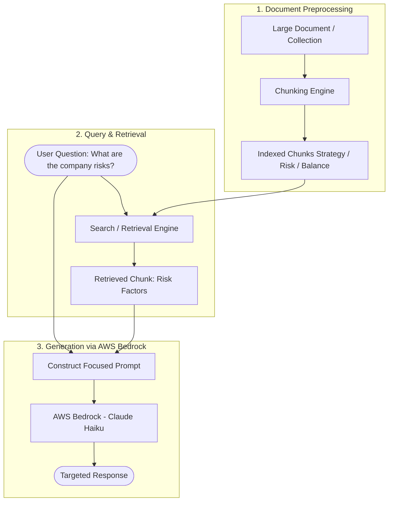
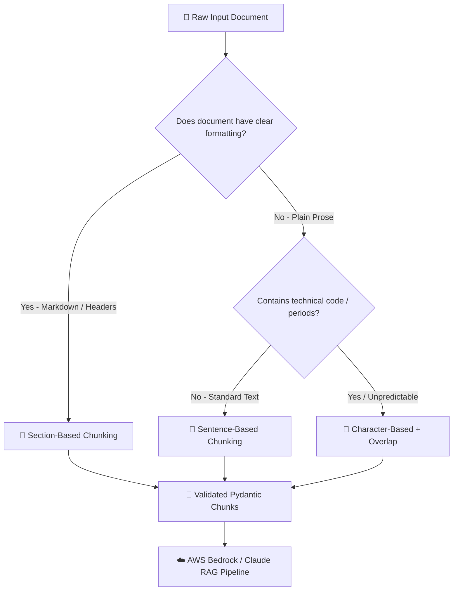
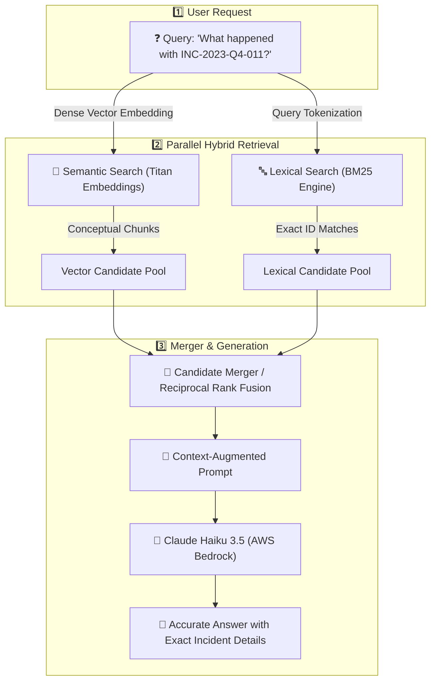
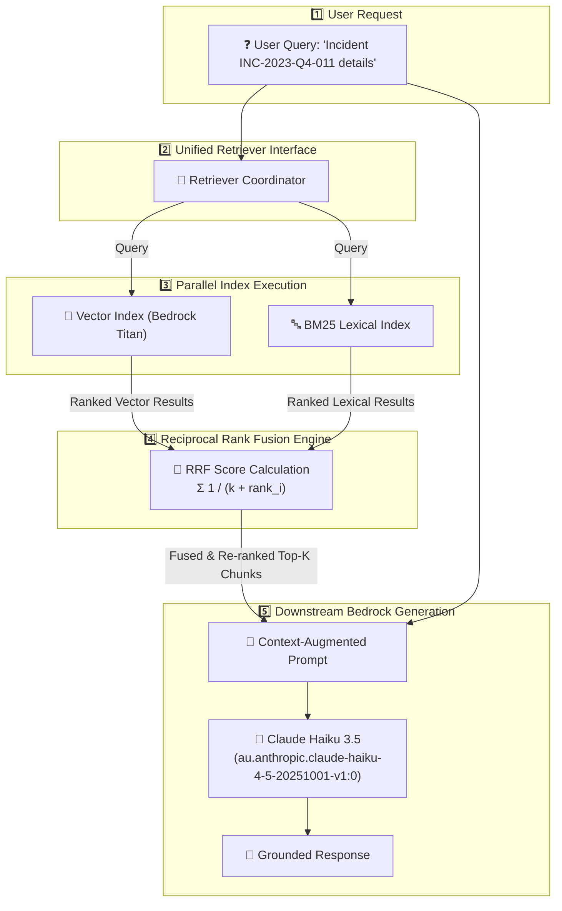
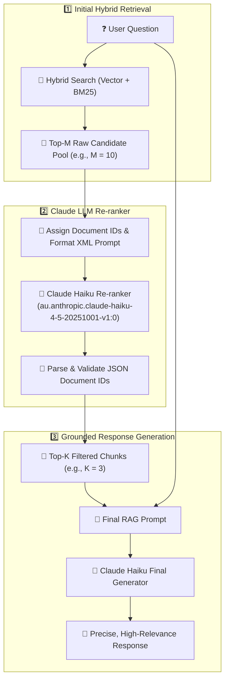
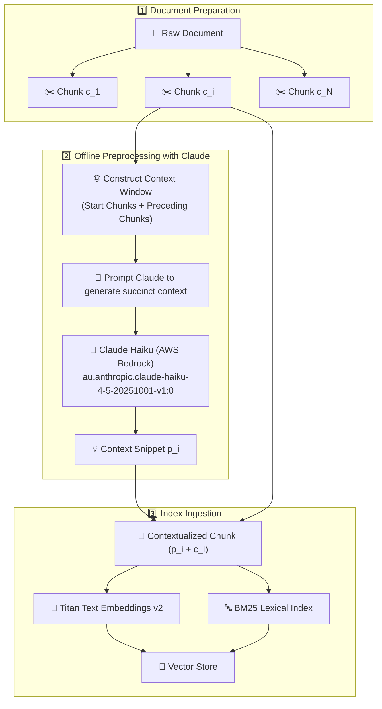

{% include video-summary.html
   id="2MprTXlKjus"
   content="<p>These documents examine advanced <strong>Retrieval-Augmented Generation (RAG)</strong> techniques implemented through <strong>Claude on Amazon Bedrock</strong> to handle large-scale data analysis. The text outlines essential architectural stages, beginning with <strong>document preprocessing</strong> and the strategic use of <strong>text chunking</strong> to maintain semantic integrity. It highlights the move towards <strong>hybrid search</strong>, which merges the conceptual strengths of <strong>vector embeddings</strong> with the precision of <strong>BM25 lexical matching</strong>. To ensure the highest accuracy, the sources describe sophisticated workflows involving <strong>Reciprocal Rank Fusion</strong> and <strong>LLM-based reranking</strong> to prioritise the most relevant data. Finally, the concept of <strong>contextual retrieval</strong> is introduced, where Claude generates snippets to anchor individual text fragments within their broader narrative. This comprehensive guide serves as a technical roadmap for building <strong>scalable, high-performance AI systems</strong> that are both cost-effective and contextually aware</p>" %}

<!--more-->

* TOC
{:toc}

---

## Introduction
### The Large Document Problem

When analyzing massive documents (such as an 800-page financial report), developers face a choice between two primary strategies:

| Strategy | Approach | Drawbacks / Challenges |
| --- | --- | --- |
| **Option 1: Full Context Prompting** | Extract all document text and stuff it into a single prompt to Claude. | • Reaches token limits on huge files<br/> • Higher API costs and latency<br/> • Performance degradation from irrelevant details<br/> |
| **Option 2: RAG (Chunking & Retrieval)** | Preprocess documents into smaller chunks and retrieve only relevant sections per query.<br/> | • Requires preprocessing setup<br/> • Needs search infrastructure<br/> • Risk of missing surrounding context<br/> |

> The table states the trade-offs without explaining them. Models do not use a long context uniformly, and information buried in the middle is often used less reliably. Cost and latency grow with prompt size, and prompt caching can change the maths when the same document is queried repeatedly. The choice is also not binary: an 800-page report may fit in a large context window, so the deciding factors are query volume, accuracy needs and budget[^14],[^4].
{:.note}

### How RAG Works

1.  **Preprocessing:** Split large documents into manageable text chunks (e.g., by header, semantic meaning, or length).
2.  **Analysis:** Evaluate the user's query to determine required information.
    
    > Real queries are rarely retrieval-ready. Follow-ups such as "what about the second one?" need rewriting into standalone questions. Multi-part questions may need decomposing into several searches. Techniques such as generating a hypothetical answer and embedding that (HyDE) can improve recall, and multi-hop questions may need iterative retrieval[^4],[^11].
    {:.note}

3.  **Retrieval:** Search and select only the chunks relevant to the specific question.
4.  **Generation:** Inject only those relevant chunks into the prompt sent to Claude on AWS Bedrock.



### Benefits & Challenges

#### Benefits

-   **Targeted Context:** Claude receives only information relevant to answering the prompt.
-   **Scalability:** Scales seamlessly across thousands of documents or vast knowledge bases.
-   **Efficiency:** Smaller prompt sizes dramatically reduce token costs and lower latency.

#### Implementation Challenges

-   Requires a pipeline for document ingestion, chunking, and indexing.
-   Selecting the right chunking strategy (fixed length, semantic, header-based) requires evaluation.
    
    > Evaluate retrieval and generation separately. For retrieval, use labelled query-to-chunk pairs and measure recall@k, precision@k, MRR and nDCG. For generation, check faithfulness to the retrieved context, answer relevance and citation correctness. Three-document demos can show the mechanics but cannot show whether a change actually improves quality[^12],[^13],[^4].
    {:.note}

-   Needs an accurate retrieval mechanism (e.g., vector embeddings or lexical search).

Here is a Python implementation demonstrating how to structure retrieved chunks, construct a RAG prompt using **Pydantic** for data validation,


### Text Chunking Strategies

Text chunking is a foundational step in any RAG pipeline. How you divide documents directly impacts retrieval quality and prevents model hallucinations caused by mixed or irrelevant context.

> **Going deeper:** Chunk size is a trade-off, not a setting. Small chunks give precise embeddings but lose surrounding context, while large chunks keep context but dilute the embedding and consume prompt tokens. Size is usually measured in tokens rather than characters, and hierarchical (parent–child) or semantic splitting are common upgrades over the three strategies above. The only dependable way to choose is to measure retrieval quality on your own corpus[^4],[^5].
{:.note}

1. 📏 Size-Based (Character/Token) Chunking
-   **How it works:** Splits text at fixed character or word lengths (e.g., 150 characters).
-   **Pros:** Universal and reliable fallback for any unstructured text.
-   **Cons:** Cuts words or sentences mid-thought, losing semantic meaning.
-   **Mitigation:** Adding **overlap** (e.g., 20 characters) between consecutive chunks preserves boundary context.

2. 💬 Sentence-Based Chunking
-   **How it works:** Uses NLP or regex punctuation rules (`[.!?]`) to split text into full sentences, grouping a fixed number per chunk.
-   **Pros:** Preserves complete thoughts and semantic coherence in general prose.
-   **Cons:** Can misinterpret periods in technical documents, acronyms, or source code.

3. 📐 Structure-Based Section Chunking
-   **How it works:** Leverages structural markers such as Markdown headers (`##` ) or HTML tags to separate sections.
-   **Pros:** Keeps logically grouped topics together.
-   **Cons:** Fails on plain text files or inconsistently formatted user uploads.




```python
import re
from typing import List, Literal
from pydantic import BaseModel, Field


# ⚙️ Runtime Settings Management
class ChunkingConfig(BaseModel):
    aws_region: str = Field(default="ap-southeast-2", description="Target AWS region")
    model_id: str = Field(
        default="au.anthropic.claude-haiku-4-5-20251001-v1:0",
        description="Bedrock Claude model identifier",
    )
    chunk_size: int = Field(default=150, gt=0)
    chunk_overlap: int = Field(default=20, ge=0)
    max_sentences: int = Field(default=3, gt=0)


# 🧩 Strict Data Schema for Output Chunks
class TextChunk(BaseModel):
    chunk_id: int
    strategy: Literal["character", "sentence", "section"]
    content: str
    char_count: int


# 🛠️ Strategy Implementations
class TextChunker:
    def __init__(self, config: ChunkingConfig):
        self.config = config

    def chunk_by_character(self, text: str) -> List[TextChunk]:
        """Splits text by fixed character length with overlap."""
        chunks: List[TextChunk] = []
        start = 0
        chunk_id = 0

        while start < len(text):
            end = min(start + self.config.chunk_size, len(text))
            chunk_str = text[start:end]

            chunks.append(
                TextChunk(
                    chunk_id=chunk_id,
                    strategy="character",
                    content=chunk_str,
                    char_count=len(chunk_str),
                )
            )

            chunk_id += 1
            if end == len(text):
                break
            start += self.config.chunk_size - self.config.chunk_overlap

        return chunks

    def chunk_by_section(self, text: str) -> List[TextChunk]:
        """Splits Markdown text on headers."""
        raw_sections = re.split(r"\n(?=## )", text)
        return [
            TextChunk(
                chunk_id=idx,
                strategy="section",
                content=section.strip(),
                char_count=len(section.strip()),
            )
            for idx, section in enumerate(raw_sections)
            if section.strip()
        ]


# 🧪 Example Usage
if __name__ == "__main__":
    config = ChunkingConfig()
    chunker = TextChunker(config)

    sample_doc = "## Introduction\nText chunking is essential for RAG.\n## Details\nCharacter based splitting provides a reliable fallback."

    validated_chunks = chunker.chunk_by_section(sample_doc)
    for chunk in validated_chunks:
        print(chunk.model_dump_json(indent=2))
```

> In building production Retrieval Augmented Generation (RAG) pipelines with Claude and AWS Bedrock, raw text chunks are eventually transformed into embeddings and stored in a vector database alongside metadata. Using Pydantic adds structural safety and reliability to this process in three main ways:
- Type Safety & Runtime Validation: It ensures configuration parameters (like chunk_size or chunk_overlap) meet specific rules (such as gt=0) before processing begins, preventing invalid indexing runs.
- Schema Enforcement for Vector Stores: Vector databases (like Amazon Bedrock Knowledge Bases or OpenSearch) require consistent metadata schemas. Pydantic guarantees that every generated chunk output contains all required fields (chunk_id, strategy, content, char_count) in the exact expected data type.
- ⚙️ Settings Management: It provides a clean way to define environment configuration defaults (such as aws_region and model_id) while validating them at runtime.
{:.ok}

## Text Embeddings 

Finding relevant document chunks for a user's prompt is fundamentally a semantic search problem. Standard keyword matching often fails when queries use different phrasing than the target documents.

1. What Are Text Embeddings?
    -   **Numerical Representations:** An embedding translates text into a dense vector (a list of numbers, typically 1,024 dimensions) ranging from -1 to +1.
    -   **Semantic Capture:** The vector captures the underlying meaning and context of the text rather than relying on exact word matches.
2. Understanding Vector Dimensions
    -   **Abstract Features:** Each dimension represents a learned feature or quality of the text (e.g., sentiment, subject domain, or tone).
        
        > Embedding models are typically transformer encoders trained contrastively: texts that belong together are pulled close and unrelated texts are pushed apart. Meaning is spread across all dimensions jointly rather than stored one feature per axis, which is why individual values can't be read as "sentiment" or "tone". Choose the similarity metric the model was trained for. For unit-normalised vectors, cosine similarity, dot product and Euclidean distance produce the same ranking[^6],[^7].
        {:.note}
        
    -   **Non-Interpretable:** Individual numbers are generated automatically during model training and are not directly human-interpretable.

3. Why Embeddings Matter for RAG
    -   **Proximity in Vector Space:** Semantically similar texts produce vectors that are close to each other mathematically.
    -   **Cosine Similarity:** By calculating mathematical distance (e.g., cosine similarity) between a query's embedding vector and stored chunk vectors, RAG systems retrieve the most contextually relevant information.

```mermaid
flowchart TD
    subgraph Ingestion ["1️⃣ Ingestion Phase"]
        A[📄 Document Chunk] --> B[🧠 Bedrock Embedding Model<br>amazon.titan-embed-text-v2:0]
        B --> C[🔢 Vector Array: 1024 floats]
        C --> D[(💾 Vector Store)]
    end

    subgraph Query ["2️⃣ Query & Retrieval Phase"]
        E[❓ User Query] --> F[🧠 Bedrock Embedding Model]
        F --> G[🔢 Query Vector]
        G --> H{📐 Cosine Similarity Match}
        D --> H
        H --> I[🎯 Top-K Relevant Chunks]
    end

    subgraph Generation ["3️⃣ Generation Phase"]
        I --> J[🤖 Claude Haiku 3.5 Model<br>au.anthropic.claude-haiku-4-5-20251001-v1:0]
        J --> K[💬 Grounded Answer]
    end
 flowing
 ```

 


```python
import json
from typing import List
import boto3
from pydantic import BaseModel, Field


# ⚙️ Settings Management with Pydantic
class BedrockSettings(BaseModel):
    aws_region: str = Field(default="ap-southeast-2", description="Target AWS region")
    embedding_model_id: str = Field(
        default="amazon.titan-embed-text-v2:0",
        description="Bedrock text embedding model",
    )
    # claude_model_id: str = Field(
    #     default="au.anthropic.claude-haiku-4-5-20251001-v1:0",
    #     description="Claude model for downstream RAG generation",
    # )
    dimensions: int = Field(default=1024, gt=0, le=1024)
    normalize: bool = Field(default=True)


# 🧩 Strict Data Schema for Embedding Inputs and Outputs
class EmbeddingRequest(BaseModel):
    input_text: str = Field(..., min_length=1, description="Text chunk or query")


class EmbeddingResponse(BaseModel):
    input_text: str
    vector: List[float] = Field(..., description="1024-dimensional embedding vector")
    dimensions: int
    model_used: str


# 🛠️ Embedding Service Class
class BedrockEmbeddingService:
    def __init__(self, settings: BedrockSettings):
        self.settings = settings
        self.client = boto3.client(
            service_name="bedrock-runtime",
            region_name=self.settings.aws_region,
        )

    def generate_embedding(self, request: EmbeddingRequest) -> EmbeddingResponse:
        """Invokes AWS Bedrock Titan Embeddings model to produce a vector."""
        payload = {
            "inputText": request.input_text,
            "dimensions": self.settings.dimensions,
            "normalize": self.settings.normalize,
        }

        response = self.client.invoke_model(
            modelId=self.settings.embedding_model_id,
            contentType="application/json",
            accept="application/json",
            body=json.dumps(payload),
        )

        response_body = json.loads(response["body"].read())
        embedding_vector = response_body["embedding"]

        # Validate output schema
        return EmbeddingResponse(
            input_text=request.input_text,
            vector=embedding_vector,
            dimensions=len(embedding_vector),
            model_used=self.settings.embedding_model_id,
        )
```

**Vector Comparison:** The `cosine_similarity` function measures the angle between two 1,024-dimensional vectors. Values closer to `1.0` mean high semantic similarity.

You'll often see ***cosine distance***[^1] in vector database documentation. This is simply `1 - cosine similarity`, which gives us an easier-to-interpret number where:
-   Values close to 0 mean high similarity
-   Larger values mean less similarity


```python
import numpy as np


def cosine_similarity(vec_a: List[float], vec_b: List[float]) -> float:
    """Calculates cosine similarity between two 1D vectors."""
    a, b = np.array(vec_a), np.array(vec_b)
    return float(np.dot(a, b) / (np.linalg.norm(a) * np.linalg.norm(b)))

```


```python

# ⚙️ 1. Initialize configuration and service
settings = BedrockSettings(aws_region="ap-southeast-2")
service = BedrockEmbeddingService(settings)

# 📚 2. Define document chunks to index
document_chunks = [
    "Comprehensive guide to fixing a car engine, replacing fan belts, and oil changes.",
    "Simple recipe for baking soft chocolate chip cookies at home.",
    "Software design patterns and guidelines for clean Python code.",
]

# 🔢 3. Generate and validate embeddings for all chunks
print("⚙️ Generating embeddings for document chunks...")
indexed_chunks: List[EmbeddingResponse] = [
    service.generate_embedding(EmbeddingRequest(input_text=chunk))
    for chunk in document_chunks
]

# ❓ 4. Generate embedding for a user query
query_text = "automobile repair guidelines"
print(f"🔍 Search Query: '{query_text}'\n")

query_response = service.generate_embedding(
    EmbeddingRequest(input_text=query_text)
)

# 📐 5. Compute cosine similarity against all indexed chunks
scored_results = []
for chunk_resp in indexed_chunks:
    score = cosine_similarity(query_response.vector, chunk_resp.vector)
    scored_results.append((score, chunk_resp.input_text))

# 🏆 6. Rank matches by highest similarity score
scored_results.sort(key=lambda x: x[0], reverse=True)

# 📺 7. Display top matches
print("--- 🎯 Semantic Search Results ---")
for rank, (score, text) in enumerate(scored_results, start=1):
    print(f"Rank {rank} (Score: {score:.4f}): {text}")
```

    ⚙️ Generating embeddings for document chunks...
    🔍 Search Query: 'automobile repair guidelines'
    
    --- 🎯 Semantic Search Results ---
    Rank 1 (Score: 0.4314): Comprehensive guide to fixing a car engine, replacing fan belts, and oil changes.
    Rank 2 (Score: 0.1595): Software design patterns and guidelines for clean Python code.
    Rank 3 (Score: 0.0217): Simple recipe for baking soft chocolate chip cookies at home.


**Semantic Matching 🎯:** Notice how `"automobile repair guidelines"` will score highest with the chunk discussing `"fixing a car engine"`, even though they share almost no identical words!

## The Full RAG Flow

The full RAG pipeline connects static document ingestion with dynamic LLM response generation in two distinct stages:

1. Ingestion Phase (Preprocessing / Offline)
    -   **Step 1: Chunk Source Text** — Break unstructured documents into coherent text blocks (e.g., medical research vs. software engineering).
    -   **Step 2: Generate & Normalize Embeddings** — Pass chunks through an embedding model to convert text into numerical vectors. Embeddings are normalized (scaled to a magnitude of 1.0 on a unit vector space) to streamline geometric comparison.
    -   **Step 3: Store in Vector Database 💾** — Index normalized vectors alongside original text chunks in a vector store for fast lookup.
        > The demo compares the query against every stored vector, which is exact but scales linearly with corpus size. Production vector stores use approximate nearest-neighbour indexes (for example HNSW, IVF or product quantisation) that trade a little recall for large gains in speed and memory. They also need metadata filtering and incremental updates. Note that Amazon Bedrock Knowledge Bases is a managed RAG service that sits on top of a vector store, not a vector database itself[^8],[^9].
        {:.note}
2. Query Phase (Runtime / Online)
    -   **Step 4: Process User Query ❓** — Vectorize the incoming user question using the **exact same** embedding model and normalization process.
    -   **Step 5: Find Similar Embeddings** — Measure vector proximity between query vector Q and stored chunk vectors C using **Cosine Similarity**:

        ---
        
        $\text{Cosine Similarity} = \frac{\mathbf{Q} \cdot \mathbf{C}}{\|\mathbf{Q}\| \|\mathbf{C}\|}$
        > (Values range from -1 to 1; values closer to 1 denote high semantic similarity. Cosine distance is calculated as 1−Cosine Similarity.)
        {:.note}
        
        ---

        

        --- Adapted from [Anthropic Claude Academy: Claude with Amazon Bedrock.](https://academy.claude.com/courses/claude-with-amazon-bedrock){:target="_blank" rel="noopener noreferrer"}
        
    -   **Step 6: Build Final Prompt & Generate 🤖** — Augment the user query with top-ranked text chunks into an XML-structured prompt and send it to **Claude** via Amazon Bedrock.

## BM25 Lexical Search

Semantic search using embeddings excels at understanding general meaning and context, but it frequently struggles with exact keyword matching. When queries contain specific identifiers, ticket numbers (such as `INC-2023-Q4-011`), code snippets, or rare proper nouns, pure vector search can return conceptually related but factually wrong chunks.

1. The Limitation of Pure Semantic Search
    -   Semantic embeddings represent text in abstract multi-dimensional vector spaces, focusing on semantic intent rather than exact character matching.
    -   Queries searching for precise strings like error codes or specific incident IDs can get drowned out by semantically similar sections that lack the exact keyword.
2. Hybrid Search Strategy
    -   Combines **Semantic Search** (vector embeddings for conceptual understanding) and **Lexical Search** (exact term frequency matching) in parallel.
    -   Results from both pipelines are merged to ensure the model receives both high-level context and exact keyword precision.
3. How BM25 Works
    -   **Tokenization:** Breaks search queries and document chunks into individual terms.
    -   **Term Frequency (TF):** Counts how often a query term appears within a document chunk.
    -   **Inverse Document Frequency (IDF):** Weights terms inversely based on their rarity across the entire document collection. Common words like "the" receive low scores, while rare identifiers like `INC-2023-Q4-011` receive high weights.
    -   **Document Length Normalization:** Adjusts term scores based on chunk length to prevent longer chunks from unnaturally dominating search results.

    <br/>
    > BM25 refines TF-IDF within the probabilistic relevance framework, and its saturation (`k1`) and length-normalisation (`b`) parameters are tuned per corpus rather than fixed. Its quality also depends on the text-analysis chain of tokenisation, lower-casing, stemming and stop-words. The regex tokenizer in the example keeps `INC-2023-Q4-011` as a single token, which suits identifiers, but with no stemming a query for "resolved" will not match "resolve"[^10],[^11].
    {:.note}
    
The BM25 score for a document $D$ given a query $$Q = \{q_1, q_2, \dots, q_n\}$$ is calculated as:

$$\text{BM25}(D, Q) = \sum_{i=1}^{n} \text{IDF}(q_i) \cdot \frac{f(q_i, D) \cdot (k_1 + 1)}{f(q_i, D) + k_1 \cdot \left(1 - b + b \cdot \frac{\vert{}D\vert{}}{\text{avgdl}}\right)}$$

Where the Robertson-Spärck Jones Inverse Document Frequency ($\text{IDF}$) is given by:

$$\text{IDF}(q_i) = \ln \left( \frac{N - n(q_i) + 0.5}{n(q_i) + 0.5} + 1 \right)$$


#### Parameter Reference:

-   $f(q_i, D)$: Frequency of query term $q_i$ in document $D$.
-   $\vert{}D\vert{}$: Length of document $D$ in words/tokens.
-   $\text{avgdl}$: Average document length across the full collection.
-   $N$: Total number of documents in the index.
-   $n(q_i)$: Number of documents containing query term $q_i$.
-   $k_1$: Term frequency saturation parameter (typically set between $1.2$ and $2.0$).
-   $b$: Document length normalization parameter (typically set to $0.75$).


### Hybrid Search Pipeline Architecture




Here the BM25 example:


```python
import json
import math
import re
from typing import Dict, List
import boto3
import numpy as np
from pydantic import BaseModel, Field


# ⚙️ 1. Pydantic Settings & Schemas
class BedrockSettings(BaseModel):
    aws_region: str = Field(
        default="ap-southeast-2", description="AWS Bedrock Region"
    )
    claude_model_id: str = Field(
        default="au.anthropic.claude-haiku-4-5-20251001-v1:0",
        description="Bedrock Claude Model ID for Generation",
    )
    embedding_model_id: str = Field(
        default="amazon.titan-embed-text-v2:0",
        description="Bedrock Embedding Model ID for Retrieval",
    )


class DocumentChunk(BaseModel):
    doc_id: str
    content: str


class HybridSearchResult(BaseModel):
    doc_id: str
    content: str
    semantic_score: float = Field(..., ge=-1.0, le=1.0)
    bm25_score: float = Field(..., ge=0.0)
    hybrid_score: float = Field(..., ge=0.0, le=1.0)


# 🧠 2. Semantic Search Engine (Bedrock Titan)
class BedrockSemanticSearch:
    def __init__(self, settings: BedrockSettings):
        self.settings = settings
        self.client = boto3.client(
            service_name="bedrock-runtime",
            region_name=self.settings.aws_region,
        )

    def generate_embedding(self, text: str) -> List[float]:
        payload = {"inputText": text, "dimensions": 1024, "normalize": True}
        response = self.client.invoke_model(
            modelId=self.settings.embedding_model_id,
            contentType="application/json",
            accept="application/json",
            body=json.dumps(payload),
        )
        response_body = json.loads(response["body"].read())
        return response_body["embedding"]


# 🔤 3. BM25 Lexical Search Engine
class BM25Index:
    def __init__(self, k1: float = 1.5, b: float = 0.75):
        self.k1 = k1
        self.b = b
        self.documents: Dict[str, DocumentChunk] = {}
        self.doc_tokens: Dict[str, List[str]] = {}
        self.doc_lengths: Dict[str, int] = {}
        self.doc_freqs: Dict[str, int] = {}
        self.avg_doc_len: float = 0.0

    @staticmethod
    def tokenize(text: str) -> List[str]:
        return re.findall(r"\b\w+(?:-\w+)*\b", text.lower())

    def add_document(self, doc: DocumentChunk) -> None:
        tokens = self.tokenize(doc.content)
        self.documents[doc.doc_id] = doc
        self.doc_tokens[doc.doc_id] = tokens
        self.doc_lengths[doc.doc_id] = len(tokens)

        for token in set(tokens):
            self.doc_freqs[token] = self.doc_freqs.get(token, 0) + 1

        self.avg_doc_len = sum(self.doc_lengths.values()) / len(
            self.doc_lengths
        )

    def get_bm25_score(self, query: str, doc_id: str) -> float:
        query_tokens = self.tokenize(query)
        N = len(self.documents)
        if N == 0 or doc_id not in self.documents:
            return 0.0

        score = 0.0
        doc_tokens = self.doc_tokens[doc_id]
        doc_len = self.doc_lengths[doc_id]

        for token in query_tokens:
            if token not in self.doc_freqs:
                continue

            n_q = self.doc_freqs[token]
            idf = math.log((N - n_q + 0.5) / (n_q + 0.5) + 1.0)
            f_q = doc_tokens.count(token)

            denom = f_q + self.k1 * (
                1 - self.b + self.b * (doc_len / self.avg_doc_len)
            )
            score += idf * (f_q * (self.k1 + 1)) / denom

        return score


# 🔀 4. Unified Hybrid Pipeline Engine (Containing `search` method)
class HybridSearchEngine:
    def __init__(self, settings: BedrockSettings):
        self.settings = settings
        self.semantic_search = BedrockSemanticSearch(settings)
        self.bm25_index = BM25Index()
        self.doc_embeddings: Dict[str, List[float]] = {}

    def index_document(self, doc: DocumentChunk) -> None:
        self.bm25_index.add_document(doc)
        embedding = self.semantic_search.generate_embedding(doc.content)
        self.doc_embeddings[doc.doc_id] = embedding

    @staticmethod
    def cosine_similarity(v1: List[float], v2: List[float]) -> float:
        a, b = np.array(v1), np.array(v2)
        return float(np.dot(a, b) / (np.linalg.norm(a) * np.linalg.norm(b)))

    def search(
        self, query: str, alpha: float = 0.5, top_k: int = 2
    ) -> List[HybridSearchResult]:
        """Executes combined BM25 and Titan Semantic search."""
        query_embedding = self.semantic_search.generate_embedding(query)

        semantic_scores = {
            doc_id: self.cosine_similarity(query_embedding, doc_emb)
            for doc_id, doc_emb in self.doc_embeddings.items()
        }

        bm25_scores = {
            doc_id: self.bm25_index.get_bm25_score(query, doc_id)
            for doc_id in self.bm25_index.documents
        }

        max_bm25 = max(bm25_scores.values()) if bm25_scores.values() else 1.0
        norm_bm25 = {
            k: (v / max_bm25 if max_bm25 > 0 else 0.0)
            for k, v in bm25_scores.items()
        }

        results = []
        for doc_id, doc in self.bm25_index.documents.items():
            raw_sem_s = semantic_scores[doc_id]
            # Clamp negative similarity to 0.0 to satisfy Pydantic schema
            clamped_sem_s = max(0.0, raw_sem_s)
            lex_s = norm_bm25[doc_id]

            combined = (alpha * clamped_sem_s) + ((1.0 - alpha) * lex_s)

            results.append(
                HybridSearchResult(
                    doc_id=doc_id,
                    content=doc.content,
                    semantic_score=round(raw_sem_s, 4),
                    bm25_score=round(bm25_scores[doc_id], 4),
                    hybrid_score=round(combined, 4),
                )
            )

        results.sort(key=lambda x: x.hybrid_score, reverse=True)
        return results[:top_k]


# 🤖 5. Response Generation using Claude Haiku on Bedrock
def generate_rag_answer(
    engine: HybridSearchEngine,
    query: str,
    top_chunks: List[HybridSearchResult],
) -> str:
    context_str = "\n".join(
        [f"<doc id='{res.doc_id}'>{res.content}</doc>" for res in top_chunks]
    )

    prompt = f"""Human: You are an expert AI assistant. Answer the user's question accurately using ONLY the context provided below.

<context>
{context_str}
</context>

Question: {query}

Assistant:"""

    payload = {
        "anthropic_version": "bedrock-2023-05-31",
        "max_tokens": 500,
        "temperature": 0.0,
        "messages": [{"role": "user", "content": prompt}],
    }

    response = engine.semantic_search.client.invoke_model(
        modelId=engine.settings.claude_model_id,
        contentType="application/json",
        accept="application/json",
        body=json.dumps(payload),
    )

    response_data = json.loads(response["body"].read())
    return response_data["content"][0]["text"]


# 🧪 6. Execution Block
if __name__ == "__main__":
    settings = BedrockSettings(
        aws_region="ap-southeast-2",
        claude_model_id="au.anthropic.claude-haiku-4-5-20251001-v1:0",
        embedding_model_id="amazon.titan-embed-text-v2:0",
    )

    engine = HybridSearchEngine(settings)

    print("1️⃣ Indexing Documents into BM25 + Bedrock Vector Store...")
    documents = [
        DocumentChunk(
            doc_id="doc_101",
            content="Q4 Finance Report: Total revenue reached $12.5 million across Sydney and Melbourne operations.",
        ),
        DocumentChunk(
            doc_id="doc_102",
            content="DevOps Incident Log: Server breach identified as INC-2023-Q4-011. Patched via SSH key rotation.",
        ),
        DocumentChunk(
            doc_id="doc_103",
            content="Employee Benefits Guide: Staff are entitled to annual wellness leave after 12 months.",
        ),
    ]

    for doc in documents:
        engine.index_document(doc)

    user_query = "How was incident INC-2023-Q4-011 resolved?"
    print(f"\n2️⃣ Running Hybrid Search for: '{user_query}'")

    top_matches = engine.search(user_query, alpha=0.5, top_k=2)

    for match in top_matches:
        print(
            f"   - Match [{match.doc_id}] Hybrid Score: {match.hybrid_score} "
            f"(Semantic: {match.semantic_score}, BM25: {match.bm25_score})"
        )

    print("\n3️⃣ Generating Grounded Answer with Claude Haiku...")
    answer = generate_rag_answer(engine, user_query, top_matches)

    print("\n--- 💬 Claude Response ---")
    print(answer)
```

    1️⃣ Indexing Documents into BM25 + Bedrock Vector Store...
    
    2️⃣ Running Hybrid Search for: 'How was incident INC-2023-Q4-011 resolved?'
       - Match [doc_102] Hybrid Score: 0.7573 (Semantic: 0.5147, BM25: 1.984)
       - Match [doc_101] Hybrid Score: 0.0515 (Semantic: 0.103, BM25: 0.0)
    
    3️⃣ Generating Grounded Answer with Claude Haiku...
    
    --- 💬 Claude Response ---
    According to the context provided, incident INC-2023-Q4-011 was resolved by patching via SSH key rotation.


### Hybrid Search Score Combination Formula

To merge dense vector similarity scores with sparse BM25 scores, we normalize and combine them using a weighted score sum:

$$\text{Score}_{\text{Hybrid}}(D, Q) = \alpha \cdot \text{Sim}_{\text{Cosine}}(E_Q, E_D) + (1 - \alpha) \cdot \text{Score}_{\text{BM25}}(D, Q)$$

> A weighted sum only works if both scores share a scale. Dividing BM25 by the batch maximum makes each score depend on the candidate set, and alternatives such as min-max or z-score normalisation behave differently. `alpha` should be tuned on labelled queries, not fixed at 0.5. RRF avoids calibration but discards score magnitude, and `k = 60` is a widely used default rather than a derived optimum. Learning-to-rank is the usual next step once you have relevance judgements[^11],[^5].
{:.note}

<!-- 

— Source: Claude with Amazon Bedrock[^2] by Anthropic -->

Here the example:


```python
import json
import math
import re
from typing import Dict, List
import boto3
import numpy as np
from pydantic import BaseModel, Field


# ⚙️ 1. Pydantic Runtime Settings Management
class BedrockSettings(BaseModel):
    aws_region: str = Field(
        default="ap-southeast-2", description="AWS Bedrock Target Region"
    )
    claude_model_id: str = Field(
        default="au.anthropic.claude-haiku-4-5-20251001-v1:0",
        description="Downstream Bedrock Claude Model ID",
    )
    embedding_model_id: str = Field(
        default="amazon.titan-embed-text-v2:0",
        description="Bedrock Text Embedding Model ID",
    )


# 🧩 2. Strict Schemas for Input / Output Data
class DocumentChunk(BaseModel):
    doc_id: str
    content: str


class HybridSearchResult(BaseModel):
    doc_id: str
    content: str
    semantic_score: float = Field(..., ge=-1.0, le=1.0)
    bm25_score: float = Field(..., ge=0.0)
    hybrid_score: float = Field(..., ge=0.0, le=1.0)


# 🧠 3. Semantic Search Engine Using AWS Bedrock Settings
class BedrockSemanticSearch:
    def __init__(self, settings: BedrockSettings):
        self.settings = settings
        # BedrockSettings directly used to configure the boto3 client
        self.client = boto3.client(
            service_name="bedrock-runtime",
            region_name=self.settings.aws_region,
        )

    def generate_embedding(self, text: str) -> List[float]:
        """Invokes Titan Embeddings via AWS Bedrock."""
        payload = {"inputText": text, "dimensions": 1024, "normalize": True}

        response = self.client.invoke_model(
            modelId=self.settings.embedding_model_id,
            contentType="application/json",
            accept="application/json",
            body=json.dumps(payload),
        )

        response_body = json.loads(response["body"].read())
        return response_body["embedding"]


# 🔤 4. BM25 Lexical Engine
class BM25Index:
    def __init__(self, k1: float = 1.5, b: float = 0.75):
        self.k1 = k1
        self.b = b
        self.documents: Dict[str, DocumentChunk] = {}
        self.doc_tokens: Dict[str, List[str]] = {}
        self.doc_lengths: Dict[str, int] = {}
        self.doc_freqs: Dict[str, int] = {}
        self.avg_doc_len: float = 0.0

    @staticmethod
    def tokenize(text: str) -> List[str]:
        return re.findall(r"\b\w+(?:-\w+)*\b", text.lower())

    def add_document(self, doc: DocumentChunk) -> None:
        tokens = self.tokenize(doc.content)
        self.documents[doc.doc_id] = doc
        self.doc_tokens[doc.doc_id] = tokens
        self.doc_lengths[doc.doc_id] = len(tokens)

        for token in set(tokens):
            self.doc_freqs[token] = self.doc_freqs.get(token, 0) + 1

        self.avg_doc_len = sum(self.doc_lengths.values()) / len(
            self.doc_lengths
        )

    def get_bm25_score(self, query: str, doc_id: str) -> float:
        query_tokens = self.tokenize(query)
        N = len(self.documents)
        if N == 0 or doc_id not in self.documents:
            return 0.0

        score = 0.0
        doc_tokens = self.doc_tokens[doc_id]
        doc_len = self.doc_lengths[doc_id]

        for token in query_tokens:
            if token not in self.doc_freqs:
                continue

            n_q = self.doc_freqs[token]
            idf = math.log((N - n_q + 0.5) / (n_q + 0.5) + 1.0)
            f_q = doc_tokens.count(token)

            denom = f_q + self.k1 * (
                1 - self.b + self.b * (doc_len / self.avg_doc_len)
            )
            score += idf * (f_q * (self.k1 + 1)) / denom

        return score


# 🔀 5. Unified Hybrid Pipeline Manager
class HybridSearchEngine:
    def __init__(self, settings: BedrockSettings):
        self.settings = settings
        self.semantic_search = BedrockSemanticSearch(settings)
        self.bm25_index = BM25Index()
        self.doc_embeddings: Dict[str, List[float]] = {}

    def index_document(self, doc: DocumentChunk) -> None:
        """Indexes a document for both BM25 and Bedrock Semantic Search."""
        self.bm25_index.add_document(doc)
        # Uses Bedrock Titan Embedding model specified in settings
        embedding = self.semantic_search.generate_embedding(doc.content)
        self.doc_embeddings[doc.doc_id] = embedding

    @staticmethod
    def cosine_similarity(v1: List[float], v2: List[float]) -> float:
        a, b = np.array(v1), np.array(v2)
        return float(np.dot(a, b) / (np.linalg.norm(a) * np.linalg.norm(b)))

    def search(
        self, query: str, alpha: float = 0.5, top_k: int = 2
    ) -> List[HybridSearchResult]:
        """Runs parallel retrieval and merges scores."""
        query_embedding = self.semantic_search.generate_embedding(query)

        # 1. Compute Semantic Scores
        semantic_scores = {}
        for doc_id, doc_emb in self.doc_embeddings.items():
            semantic_scores[doc_id] = self.cosine_similarity(
                query_embedding, doc_emb
            )

        # 2. Compute BM25 Scores
        bm25_scores = {}
        for doc_id in self.bm25_index.documents:
            bm25_scores[doc_id] = self.bm25_index.get_bm25_score(query, doc_id)

        # Normalize BM25 scores to [0, 1] range for fair comparison
        max_bm25 = max(bm25_scores.values()) if bm25_scores.values() else 1.0
        norm_bm25 = {
            k: (v / max_bm25 if max_bm25 > 0 else 0.0)
            for k, v in bm25_scores.items()
        }

        # 3. Hybrid Score Fusion
        results = []
        for doc_id, doc in self.bm25_index.documents.items():
            sem_s = semantic_scores[doc_id]
            lex_s = norm_bm25[doc_id]
            combined = (alpha * sem_s) + ((1.0 - alpha) * lex_s)

            results.append(
                HybridSearchResult(
                    doc_id=doc_id,
                    content=doc.content,
                    semantic_score=round(sem_s, 4),
                    bm25_score=round(bm25_scores[doc_id], 4),
                    hybrid_score=round(combined, 4),
                )
            )

        results.sort(key=lambda x: x.hybrid_score, reverse=True)
        return results[:top_k]


# 🧪 6. Execution Showing Active Bedrock Settings Utilization
if __name__ == "__main__":
    # Explicitly load and validate settings
    settings = BedrockSettings(
        aws_region="ap-southeast-2",
        claude_model_id="au.anthropic.claude-haiku-4-5-20251001-v1:0",
        embedding_model_id="amazon.titan-embed-text-v2:0",
    )

    print("--- ⚙️ Bedrock Configuration ---")
    print(f"Region: {settings.aws_region}")
    print(f"Embedding Model: {settings.embedding_model_id}")
    print(f"Claude Model: {settings.claude_model_id}\n")

    # Initialize Hybrid Engine with Bedrock Settings
    engine = HybridSearchEngine(settings)

    # Index sample documents
    print("📥 Indexing documents with Bedrock Titan Embeddings & BM25...")
    engine.index_document(
        DocumentChunk(
            doc_id="doc_1",
            content="Q4 Financial Report: Revenue increased across all departments.",
        )
    )
    engine.index_document(
        DocumentChunk(
            doc_id="doc_2",
            content="Security Incident Log: Resolved database breach INC-2023-Q4-011 in Sydney region.",
        )
    )

    # Search query requiring exact keyword matching + semantic context
    query = "Find information about incident INC-2023-Q4-011"
    print(f"\n🔍 Query: '{query}'")

    search_results = engine.search(query, alpha=0.5, top_k=2)

    print("\n--- 🎯 Hybrid Retrieval Results ---")
    for res in search_results:
        print(
            f"Doc ID: {res.doc_id} | Hybrid Score: {res.hybrid_score:.4f} "
            f"(Semantic: {res.semantic_score:.4f}, BM25: {res.bm25_score:.4f})"
        )
        print(f"Content: {res.content}\n")
```

    --- ⚙️ Bedrock Configuration ---
    Region: ap-southeast-2
    Embedding Model: amazon.titan-embed-text-v2:0
    Claude Model: au.anthropic.claude-haiku-4-5-20251001-v1:0
    
    📥 Indexing documents with Bedrock Titan Embeddings & BM25...
    
    🔍 Query: 'Find information about incident INC-2023-Q4-011'
    
    --- 🎯 Hybrid Retrieval Results ---
    Doc ID: doc_2 | Hybrid Score: 0.7830 (Semantic: 0.5660, BM25: 1.3203)
    Content: Security Incident Log: Resolved database breach INC-2023-Q4-011 in Sydney region.
    
    Doc ID: doc_1 | Hybrid Score: 0.0874 (Semantic: 0.1748, BM25: 0.0000)
    Content: Q4 Financial Report: Revenue increased across all departments.
    


## A Multi-Search RAG Pipeline

Combining semantic search (vector embeddings) and lexical search (BM25) into a unified retrieval pipeline allows RAG applications to handle both conceptual queries and exact keyword matching (such as incident IDs like `INC-2023-Q4-011` or code snippets).

1. Building a Unified Interface
    -   **Interface Consistency:** Both `VectorIndex` and `BM25Index` expose standardized `add_document()` and `search()` methods.
    -   **Coordinator Role:** A `Retriever` class coordinates multi-index queries by forwarding the user question to both retrieval systems, collecting ranked candidates, and merging them into a single sorted list.
2. Reciprocal Rank Fusion (RRF[^3])
    -   **Score Incomparability:** Raw vector similarity scores (e.g., Cosine Similarity in $[−1,1\]$) and BM25 scores (unbounded positive floats) cannot be added or compared directly.
    -   **Rank-Based Merging:** RRF bypasses score calibration issues by evaluating the **rank position** of each document across multiple search systems rather than relying on raw metric values.

The Reciprocal Rank Fusion score for a document $d$ across a set of retrieval systems $M$ is defined as:

$$\text{RRF\_score}(d \in D) = \sum_{m \in M} \frac{1}{k + \text{rank}_m(d)}$$

- $M$: The set of retrieval systems (e.g., $M = \{\text{VectorIndex}, \text{BM25Index}\}$).
- $d$: A document chunk present in one or more retrieved candidate lists.
- $\text{rank}_m(d)$: The 1-based ordinal position/rank of document $d$ in the output of system $m$. If document $d$ was not retrieved by system $m$, $\text{rank}_m(d) = \infty$, making its score contribution $0$.
- $k$: A smoothing constant (typically set to $60$ in production vector databases to reduce the impact of high rankings from a single noisy system).



This implementation demonstrates a Reciprocal Rank Fusion (RRF) retriever integrating **AWS Bedrock Titan Embeddings**, a **BM25 Lexical Index**, and **Claude Haiku** on Bedrock in region `ap-southeast-2`.


```python
import json
import math
import re
from typing import Dict, List, Protocol
import boto3
import numpy as np
from pydantic import BaseModel, Field


# ⚙️ 1. Settings Management with Pydantic
class BedrockSettings(BaseModel):
    aws_region: str = Field(
        default="ap-southeast-2", description="AWS Bedrock Target Region"
    )
    claude_model_id: str = Field(
        default="au.anthropic.claude-haiku-4-5-20251001-v1:0",
        description="Bedrock Claude Model ID for Response Generation",
    )
    embedding_model_id: str = Field(
        default="amazon.titan-embed-text-v2:0",
        description="Bedrock Titan Embedding Model ID",
    )


# 🧩 2. Data Schemas
class DocumentChunk(BaseModel):
    doc_id: str
    content: str


class IndexSearchResult(BaseModel):
    doc_id: str
    doc: DocumentChunk
    raw_score: float


class RRFResult(BaseModel):
    doc_id: str
    content: str
    rrf_score: float = Field(..., ge=0.0)
    rank_positions: Dict[str, int]


# 🔌 3. Unified Index Protocol / Interface
class SearchIndex(Protocol):
    name: str

    def add_document(self, doc: DocumentChunk) -> None: ...

    def search(self, query: str, top_k: int) -> List[IndexSearchResult]: ...


# 🧠 4. Bedrock Vector Index Implementation
class BedrockVectorIndex:
    name: str = "VectorIndex"

    def __init__(self, settings: BedrockSettings):
        self.settings = settings
        self.client = boto3.client(
            service_name="bedrock-runtime",
            region_name=self.settings.aws_region,
        )
        self.documents: Dict[str, DocumentChunk] = {}
        self.embeddings: Dict[str, List[float]] = {}

    def _embed(self, text: str) -> List[float]:
        payload = {"inputText": text, "dimensions": 1024, "normalize": True}
        response = self.client.invoke_model(
            modelId=self.settings.embedding_model_id,
            contentType="application/json",
            accept="application/json",
            body=json.dumps(payload),
        )
        return json.loads(response["body"].read())["embedding"]

    def add_document(self, doc: DocumentChunk) -> None:
        self.documents[doc.doc_id] = doc
        self.embeddings[doc.doc_id] = self._embed(doc.content)

    @staticmethod
    def _cosine_similarity(v1: List[float], v2: List[float]) -> float:
        a, b = np.array(v1), np.array(v2)
        return float(np.dot(a, b) / (np.linalg.norm(a) * np.linalg.norm(b)))

    def search(self, query: str, top_k: int = 5) -> List[IndexSearchResult]:
        q_emb = self._embed(query)
        scored = [
            IndexSearchResult(
                doc_id=doc_id,
                doc=self.documents[doc_id],
                raw_score=self._cosine_similarity(q_emb, doc_emb),
            )
            for doc_id, doc_emb in self.embeddings.items()
        ]
        scored.sort(key=lambda x: x.raw_score, reverse=True)
        return scored[:top_k]


# 🔤 5. BM25 Lexical Index Implementation
class BM25Index:
    name: str = "BM25Index"

    def __init__(self, k1: float = 1.5, b: float = 0.75):
        self.k1 = k1
        self.b = b
        self.documents: Dict[str, DocumentChunk] = {}
        self.doc_tokens: Dict[str, List[str]] = {}
        self.doc_lengths: Dict[str, int] = {}
        self.doc_freqs: Dict[str, int] = {}
        self.avg_doc_len: float = 0.0

    @staticmethod
    def tokenize(text: str) -> List[str]:
        return re.findall(r"\b\w+(?:-\w+)*\b", text.lower())

    def add_document(self, doc: DocumentChunk) -> None:
        tokens = self.tokenize(doc.content)
        self.documents[doc.doc_id] = doc
        self.doc_tokens[doc.doc_id] = tokens
        self.doc_lengths[doc.doc_id] = len(tokens)

        for token in set(tokens):
            self.doc_freqs[token] = self.doc_freqs.get(token, 0) + 1

        self.avg_doc_len = sum(self.doc_lengths.values()) / max(
            1, len(self.doc_lengths)
        )

    def search(self, query: str, top_k: int = 5) -> List[IndexSearchResult]:
        q_tokens = self.tokenize(query)
        N = len(self.documents)
        if N == 0:
            return []

        results = []
        for doc_id, doc in self.documents.items():
            score = 0.0
            doc_tokens = self.doc_tokens[doc_id]
            doc_len = self.doc_lengths[doc_id]

            for token in q_tokens:
                if token not in self.doc_freqs:
                    continue
                n_q = self.doc_freqs[token]
                idf = math.log((N - n_q + 0.5) / (n_q + 0.5) + 1.0)
                f_q = doc_tokens.count(token)
                denom = f_q + self.k1 * (
                    1 - self.b + self.b * (doc_len / self.avg_doc_len)
                )
                score += idf * (f_q * (self.k1 + 1)) / denom

            results.append(
                IndexSearchResult(
                    doc_id=doc_id, doc=doc, raw_score=round(score, 4)
                )
            )

        results.sort(key=lambda x: x.raw_score, reverse=True)
        return results[:top_k]


# 🔀 6. Unified Multi-Search Retriever Class (RRF Fusion)
class MultiSearchRetriever:
    def __init__(self, indexes: List[SearchIndex], k_rrf: int = 60):
        self.indexes = indexes
        self.k_rrf = k_rrf

    def add_document(self, doc: DocumentChunk) -> None:
        """Propagates new document chunk across all index search systems."""
        for index in self.indexes:
            index.add_document(doc)

    def search(self, query: str, top_k: int = 2) -> List[RRFResult]:
        """Executes parallel searches and applies Reciprocal Rank Fusion."""
        rrf_scores: Dict[str, float] = {}
        doc_map: Dict[str, DocumentChunk] = {}
        rank_tracker: Dict[str, Dict[str, int]] = {}

        for index in self.indexes:
            # Retrieve candidate pool from each search engine
            candidates = index.search(query, top_k=top_k * 2)

            for rank, candidate in enumerate(candidates, start=1):
                doc_id = candidate.doc_id
                doc_map[doc_id] = candidate.doc

                # Compute reciprocal rank score contribution
                rrf_contrib = 1.0 / (self.k_rrf + rank)
                rrf_scores[doc_id] = rrf_scores.get(doc_id, 0.0) + rrf_contrib

                if doc_id not in rank_tracker:
                    rank_tracker[doc_id] = {}
                rank_tracker[doc_id][index.name] = rank

        # Sort candidates by combined RRF score
        sorted_candidates = sorted(
            rrf_scores.items(), key=lambda x: x[1], reverse=True
        )[:top_k]

        return [
            RRFResult(
                doc_id=doc_id,
                content=doc_map[doc_id].content,
                rrf_score=round(score, 6),
                rank_positions=rank_tracker.get(doc_id, {}),
            )
            for doc_id, score in sorted_candidates
        ]


# 🤖 7. Bedrock Response Generator
def generate_rag_response(
    settings: BedrockSettings, query: str, retrieved_chunks: List[RRFResult]
) -> str:
    """Sends prompt augmented with RRF context to Claude Haiku on AWS Bedrock."""
    bedrock = boto3.client(
        service_name="bedrock-runtime", region_name=settings.aws_region
    )

    context_xml = "\n".join(
        [
            f"<doc id='{chunk.doc_id}' rrf_score='{chunk.rrf_score}'>{chunk.content}</doc>"
            for chunk in retrieved_chunks
        ]
    )

    prompt = f"""Human: Answer the question accurately using ONLY the provided context blocks.

<context>
{context_xml}
</context>

Question: {query}

Assistant:"""

    payload = {
        "anthropic_version": "bedrock-2023-05-31",
        "max_tokens": 500,
        "temperature": 0.0,
        "messages": [{"role": "user", "content": prompt}],
    }

    response = bedrock.invoke_model(
        modelId=settings.claude_model_id,
        contentType="application/json",
        accept="application/json",
        body=json.dumps(payload),
    )

    result = json.loads(response["body"].read())
    return result["content"][0]["text"]


# 🧪 8. Execution Example
if __name__ == "__main__":
    # Initialize validated settings
    settings = BedrockSettings(
        aws_region="ap-southeast-2",
        claude_model_id="au.anthropic.claude-haiku-4-5-20251001-v1:0",
        embedding_model_id="amazon.titan-embed-text-v2:0",
    )

    # Instantiate individual indexes
    vector_idx = BedrockVectorIndex(settings)
    bm25_idx = BM25Index()

    # Wrap indexes into MultiSearchRetriever with k_rrf=60
    retriever = MultiSearchRetriever(indexes=[vector_idx, bm25_idx], k_rrf=60)

    # Ingest document corpus
    print("1️⃣ Ingesting corpus into Multi-Search Retriever...")
    corpus = [
        DocumentChunk(
            doc_id="sec_2",
            content="Medical Research: Significant strides were made understanding XDR-47, a software bug reported in hospital infrastructure.",
        ),
        DocumentChunk(
            doc_id="sec_6",
            content="Software Engineering: Resolved system vulnerability incident INC-2023-Q4-011 in microservices cluster.",
        ),
        DocumentChunk(
            doc_id="sec_7",
            content="Cybersecurity Logs: Incident INC-2023-Q4-011 caused temporary API latency; patched via firewall update.",
        ),
    ]

    for doc in corpus:
        retriever.add_document(doc)

    # Execute Hybrid Search Query
    query = "What happened with incident INC-2023-Q4-011?"
    print(f"\n2️⃣ Running Multi-Search with RRF for: '{query}'")

    fused_results = retriever.search(query, top_k=2)

    for rank, res in enumerate(fused_results, start=1):
        print(f"\n   Rank {rank}: [{res.doc_id}] (RRF Score: {res.rrf_score})")
        print(f"   Individual System Ranks: {res.rank_positions}")
        print(f"   Content: {res.content}")

    # Final Generation Phase
    print("\n3️⃣ Generating final response with Claude Haiku...")
    answer = generate_rag_response(settings, query, fused_results)

    print("\n--- 💬 Claude Response ---")
    print(answer)
```

    1️⃣ Ingesting corpus into Multi-Search Retriever...
    
    2️⃣ Running Multi-Search with RRF for: 'What happened with incident INC-2023-Q4-011?'
    
       Rank 1: [sec_6] (RRF Score: 0.032787)
       Individual System Ranks: {'VectorIndex': 1, 'BM25Index': 1}
       Content: Software Engineering: Resolved system vulnerability incident INC-2023-Q4-011 in microservices cluster.
    
       Rank 2: [sec_7] (RRF Score: 0.032258)
       Individual System Ranks: {'VectorIndex': 2, 'BM25Index': 2}
       Content: Cybersecurity Logs: Incident INC-2023-Q4-011 caused temporary API latency; patched via firewall update.
    
    3️⃣ Generating final response with Claude Haiku...
    
    --- 💬 Claude Response ---
    Based on the provided context, incident INC-2023-Q4-011 involved:
    
    1. A system vulnerability in a microservices cluster that was resolved by the Software Engineering team
    2. Temporary API latency that resulted from the incident
    3. A patch that was applied via a firewall update to address the issue


## Reranking Results

LLM-based re-ranking is a post-processing stage applied after initial retrieval (such as hybrid vector embedding and BM25 lexical search) to refine the ordering of retrieved candidate chunks before passing them to the final generation prompt.

> Embedding retrieval is a bi-encoder design: query and document are encoded separately, so the corpus can be pre-indexed. Cross-encoders read the query and document together, which is more accurate but too slow to run over a whole corpus, hence the two-stage pattern. An LLM listwise reranker is one option, but it adds latency and cost, can be sensitive to the order in which candidates are presented, and may not be deterministic. Dedicated rerank models are the alternative, and either should be checked against the un-reranked baseline[^6],[^11],[^4].
{:.note}

1. Why Re-ranking is Necessary
    -   **Nuance Misalignment:** Hybrid search algorithms (even with Reciprocal Rank Fusion) can misorder results when queries contain subtle contextual constraints.
        -   **Example:** Searching for _"What did the eng team do with INC-2023-Q4-011?"_ might rank a cybersecurity report above a software engineering log simply because the incident ID appeared multiple times in the security log.
    -   **Contextual Comprehension:** Claude evaluates deep semantic intent and prioritizes candidate chunks that directly answer the query's specific context (e.g., filtering for the engineering team's actions).
2. The Re-ranking Flow
    1.  **Candidate Retrieval:** Perform hybrid retrieval (Vector + BM25 / RRF) to gather an initial candidate pool (e.g., Top-10 documents).
    2.  **Prompt Construction:** Wrap candidate documents into structured XML tags (`<documents>`) alongside unique document IDs (`<document_id>`) and the user's query (`<user_question>`).
    3.  **LLM Evaluation:** Send the structured prompt to Claude, instructing it to evaluate candidates and rank the top K documents in order of decreasing relevance.
    4.  **Parsing & Filtering:** Extract ordered document IDs from Claude's response and construct the final context window.
3. Efficiency Optimization
    -   **ID-Only Output:** Requiring Claude to output full text chunks introduces excessive token generation latency and API cost.
    -   **JSON Array Parsing:** Assign each document chunk a lightweight, unique identifier (e.g., `"doc_101"`) and instruct Claude to return only a JSON array of `document_ids` in decreasing relevance order.

In a two-stage retrieval pipeline, initial candidate selection yields a subset $C \subset D$ of size $M$:

$$C = \text{Top}_M \left( \left\{ d \in D \mid \text{Score}_{\text{RRF}}(d, Q) \right\} \right)$$

The LLM acts as a non-linear scoring function $f_{\text{LLM}}(Q, d_i)$ over candidate pairs:

$$\pi_{\text{rerank}} = \text{Argsort}_{d_i \in C} \left( f_{\text{LLM}}\left( Q, d_i \right) \right)$$

Where $\pi_{\text{rerank}}$ represents the permutation indices of the candidate documents, resulting in the top $K$ ($K \le M$) highest-relevance subset passed to final answer generation:

$$\mathcal{S}_{\text{final}} = \left( d_{\pi(1)}, d_{\pi(2)}, \dots, d_{\pi(K)} \right)$$




Here the example:


```python
import json
import re
from typing import List
import boto3
from botocore.exceptions import BotoCoreError, ClientError
from pydantic import BaseModel, Field, ValidationError

# ⚙️ 1. Settings & Schema Management
class BedrockSettings(BaseModel):
    aws_region: str = Field(
        default="ap-southeast-2", description="AWS Bedrock Target Region"
    )
    claude_model_id: str = Field(
        default="au.anthropic.claude-haiku-4-5-20251001-v1:0",
        description="Bedrock Claude Model ID for Re-ranking and Generation",
    )

# 🧩 2. Input / Output Schemas for Re-ranking
class DocumentCandidate(BaseModel):
    doc_id: str
    content: str

# 🧩 3. Output Schema for Re-ranking Response
class RerankResponse(BaseModel):
    ordered_doc_ids: List[str] = Field(
        ..., description="List of document IDs sorted by decreasing relevance"
    )

# 🛠️ 4. Claude-Powered Re-ranker Service
class ClaudeReranker:
    def __init__(self, settings: BedrockSettings):
        self.settings = settings
        self.bedrock_client = boto3.client(
            service_name="bedrock-runtime",
            region_name=self.settings.aws_region,
        )

    def _extract_json(self, text: str) -> str:
        """Extracts JSON substring even if Claude wraps it in markdown backticks."""
        # Search for ```json { ... } ``` or raw { ... }
        match = re.search(
            r"```(?:json)?\s*(\{.*?\})\s*```", text, re.DOTALL
        ) or re.search(r"(\{.*?\})", text, re.DOTALL)
        return match.group(1) if match else text.strip()

    def rerank(
        self, query: str, candidates: List[DocumentCandidate], top_k: int = 2
    ) -> List[DocumentCandidate]:
        if not candidates:
            return []

        xml_docs = "\n".join(
            [
                f"<document><document_id>{doc.doc_id}</document_id><content>{doc.content}</content></document>"
                for doc in candidates
            ]
        )

        prompt = f"""You are an expert search result re-ranker. Rank the candidate documents by relevance to the user's question.

                <user_question>
                {query}
                </user_question>

                <candidate_documents>
                {xml_docs}
                </candidate_documents>

                Return a JSON object containing the top {top_k} document IDs in order of DECREASING relevance.
                Example JSON structure:
                {{
                "ordered_doc_ids": ["doc_id_1", "doc_id_2"]
                }}"""

        payload = {
            "anthropic_version": "bedrock-2023-05-31",
            "max_tokens": 300,
            "temperature": 0.0,
            "messages": [{"role": "user", "content": prompt}],
        }

        try:
            response = self.bedrock_client.invoke_model(
                modelId=self.settings.claude_model_id,
                contentType="application/json",
                accept="application/json",
                body=json.dumps(payload),
            )
        except (ClientError, BotoCoreError) as err:
            print(f"❌ AWS Bedrock Invocation Error: {err}")
            raise err

        raw_body = json.loads(response["body"].read())
        llm_output_text = raw_body["content"][0]["text"]

        # Clean markdown code blocks from LLM response
        clean_json_str = self._extract_json(llm_output_text)

        try:
            parsed_json = json.loads(clean_json_str)
            validated_output = RerankResponse(**parsed_json)
        except (json.JSONDecodeError, ValidationError) as err:
            print(f"❌ Failed to parse LLM output: {llm_output_text}")
            raise ValueError(
                f"Failed to validate LLM re-ranking output: {err}"
            ) from err

        candidate_map = {doc.doc_id: doc for doc in candidates}
        reranked_docs = [
            candidate_map[doc_id]
            for doc_id in validated_output.ordered_doc_ids
            if doc_id in candidate_map
        ]

        return reranked_docs[:top_k]
```

In the prompt template, `<candidate_documents>{xml_docs}</candidate_documents>` serves **three critical functions** in a Claude-based RAG re-ranking pipeline:

1. Structural Scaffolding (Anthropic Best Practice): Anthropic models (like Claude Haiku) are specifically trained to recognize XML tags. Wrapping inputs inside tags like `<candidate_documents>` clearly separates the **system instructions** ("_Rank these documents_") from the **raw candidate data** being evaluated.
2. Dynamic Variable Injection (`{xml_docs}`): In Python `f-strings`, `{xml_docs}` is replaced at runtime with the list of candidate document objects formatted into individual XML blocks:
        
        <candidate_documents>
        <document>
            <document_id>doc_sec_7</document_id>
            <content>Cybersecurity Incident Log: INC-2023-Q4-011 caused temporary API latency...</content>
        </document>
        <document>
            <document_id>doc_sec_2</document_id>
            <content>Software Engineering Sprint Notes: The engineering team spent 3 days debugging INC-2023-Q4-011...</content>
        </document>
        </candidate_documents>
        
3. Fast, High-Precision Parsing for Claude: By providing explicit `<document_id>` boundaries, Claude doesn't get confused by the document text itself. It can inspect each document's text, evaluate its relevance to the user's question, and return **only the document IDs** (e.g., `["doc_sec_2", "doc_sec_7"]`) without wasting generation time reproducing full document text.

Test the above code with user query:


```python
# 🧪 5. Execution Example

settings = BedrockSettings()
reranker = ClaudeReranker(settings)

# Initial hybrid retrieval results (potentially misordered)
raw_hybrid_candidates = [
    DocumentCandidate(
        doc_id="doc_sec_7",
        content="Cybersecurity Incident Log: INC-2023-Q4-011 caused temporary API latency. Resolved via firewall rules.",
    ),
    DocumentCandidate(
        doc_id="doc_sec_2",
        content="Software Engineering Sprint Notes: The engineering team spent 3 days debugging INC-2023-Q4-011 and patched the memory leak in the microservice codebase.",
    ),
    DocumentCandidate(
        doc_id="doc_sec_1",
        content="Q4 Financial Report: Budget allocation for IT engineering projects increased by 10%.",
    ),
]

query_text = "What did the engineering team do with incident INC-2023-Q4-011?"

print(f"⚙️ AWS Region: {settings.aws_region}")
print(f"🤖 Re-ranker Model: {settings.claude_model_id}\n")
print(f"❓ User Query: '{query_text}'")
print("\n--- 📥 Raw Candidates Before Re-ranking ---")
for idx, c in enumerate(raw_hybrid_candidates, 1):
    print(f"{idx}. [{c.doc_id}] {c.content[:70]}...")

# Execute Re-ranking
reranked_results = reranker.rerank(
    query=query_text, candidates=raw_hybrid_candidates, top_k=2
)

print("\n--- 🎯 Re-ranked Results (Powered by Claude) ---")
for rank, doc in enumerate(reranked_results, 1):
    print(f"Rank {rank}: [{doc.doc_id}] {doc.content}")
```

    ⚙️ AWS Region: ap-southeast-2
    🤖 Re-ranker Model: au.anthropic.claude-haiku-4-5-20251001-v1:0
    
    ❓ User Query: 'What did the engineering team do with incident INC-2023-Q4-011?'
    
    --- 📥 Raw Candidates Before Re-ranking ---
    1. [doc_sec_7] Cybersecurity Incident Log: INC-2023-Q4-011 caused temporary API laten...
    2. [doc_sec_2] Software Engineering Sprint Notes: The engineering team spent 3 days d...
    3. [doc_sec_1] Q4 Financial Report: Budget allocation for IT engineering projects inc...
    
    --- 🎯 Re-ranked Results (Powered by Claude) ---
    Rank 1: [doc_sec_2] Software Engineering Sprint Notes: The engineering team spent 3 days debugging INC-2023-Q4-011 and patched the memory leak in the microservice codebase.
    Rank 2: [doc_sec_7] Cybersecurity Incident Log: INC-2023-Q4-011 caused temporary API latency. Resolved via firewall rules.


## Contextual Retrieval 
Contextual retrieval improves Retrieval-Augmented Generation (RAG) accuracy by addressing a core limitation of standard document chunking: when text is broken into individual chunks, each snippet loses its relationship and semantic connection to the broader document.

The Context Loss Problem: When documents are split into isolated chunks, critical background information—such as the document title, overall subject matter, section headers, or cross-references—is lost. This causes vector and lexical search engines to miss relevant chunks or misclassify ambiguous terms.

During the offline preprocessing phase, an LLM (Claude) generates a succinct context snippet for every individual chunk that situates it within the broader document. This generated context is prepended to the raw chunk text before indexing into vector embeddings and BM25 indices.

> Contextual retrieval needs one LLM call per chunk, so ingestion cost and latency scale with corpus size and with how much surrounding text you send each time. Caching the shared document prefix can reduce that cost. It is a trade of ingest-time cost for retrieval quality, so compare it against cheaper alternatives such as prepending document titles and section headers, or parent-document retrieval[^4],[^5].
{:.note}
    
$$\text{Contextualized Chunk} = \text{Generated Context Snippet} \mathbin{\Vert} \text{Raw Text Chunk}$$

If a document exceeds the model's token context window, a reduced context window $W_i$ is constructed using a combination of two strategies:   

- Global Context: Including the first few chunks of the document ($\{c_1, \dots, c_m\}$), which typically contain summaries, abstracts, or table of contents.
- Local Context: Including the $p$ chunks immediately preceding the target chunk ($\{c_{i-p}, \dots, c_{i-1}\}$). 

> Adding structural and relational awareness enables vector embeddings and BM25 lexical indices to correctly resolve cross-domain references, acronyms, and section relationships, leading to higher retrieval precision on complex enterprise documents
{:.ok}

Given a document $D$ split into $N$ ordered chunks $D = \{c_1, c_2, \dots, c_N\}$, the contextual prefix $p_i$ for chunk $c_i$ is generated via Claude:  

$$p_i = f_{\text{Claude}}\left( c_i, \text{Context}(c_i, D) \right)$$

where the context function $\text{Context}(c_i, D)$ is defined: 

$$\text{Context}(c_i, D) =  \begin{cases}  D & \text{if } \vert{}D\vert{} \le \text{Context Window} \\ \{c_1, \dots, c_m\} \cup \{c_{\max(1, i-p)}, \dots, c_{i-1}\} & \text{otherwise} \end{cases}$$

The final indexed candidate $c_i'$ passed to the embedding model $\mathbf{E}(c_i')$ and BM25 lexical index is defined as

$$c_i' = p_i \mathbin{\Vert} c_i$$





```python
import json
from typing import List
import boto3
from pydantic import BaseModel, Field


# ⚙️ 1. Runtime Settings & Configuration
class BedrockSettings(BaseModel):
    aws_region: str = Field(
        default="ap-southeast-2", description="Target AWS Region"
    )
    claude_model_id: str = Field(
        default="au.anthropic.claude-haiku-4-5-20251001-v1:0",
        description="Bedrock Claude Model ID for Context Generation",
    )
    num_start_chunks: int = Field(
        default=2, ge=1, description="Number of document-start chunks to retain"
    )
    num_prev_chunks: int = Field(
        default=2, ge=1, description="Number of preceding chunks to include"
    )


# 🧩 2. Strict Schemas for Data Objects
class RawChunk(BaseModel):
    chunk_index: int
    content: str


class ContextualizedChunk(BaseModel):
    chunk_index: int
    raw_content: str
    generated_context: str
    full_indexed_text: str


# 🛠️ 3. Contextual Retrieval Preprocessor
class ContextualRetrievalService:
    def __init__(self, settings: BedrockSettings):
        self.settings = settings
        self.bedrock_client = boto3.client(
            service_name="bedrock-runtime",
            region_name=self.settings.aws_region,
        )

    def _generate_context_snippet(
        self, target_chunk: str, context_window: str
    ) -> str:
        """Prompts Claude via Bedrock to produce a succinct context snippet for a chunk."""
        prompt = f"""Write a short and succinct snippet of text to situate this chunk within the overall source document for the purposes of improving search retrieval of the chunk.

                    Here is the context from the source document:
                    <document>
                    {context_window}
                    </document>

                    Here is the chunk we want to situate within the whole document:
                    <chunk>
                    {target_chunk}
                    </chunk>

                    Answer only with the succinct context and nothing else."""

        payload = {
            "anthropic_version": "bedrock-2023-05-31",
            "max_tokens": 150,
            "temperature": 0.0,
            "messages": [{"role": "user", "content": prompt}],
        }

        response = self.bedrock_client.invoke_model(
            modelId=self.settings.claude_model_id,
            contentType="application/json",
            accept="application/json",
            body=json.dumps(payload),
        )

        response_body = json.loads(response["body"].read())
        return response_body["content"][0]["text"].strip()

    def process_chunks(
        self, chunks: List[RawChunk]
    ) -> List[ContextualizedChunk]:
        """Processes a list of document chunks and builds contextualized output representations."""
        contextualized_results: List[ContextualizedChunk] = []
        raw_texts = [c.content for c in chunks]

        for i, chunk in enumerate(chunks):
            # 1. Build document-start context
            start_context = raw_texts[: min(self.settings.num_start_chunks, len(chunks))]

            # 2. Build local preceding context
            prev_start_idx = max(0, i - self.settings.num_prev_chunks)
            prev_context = raw_texts[prev_start_idx:i]

            # Combine distinct context parts without duplicate chunks
            combined_parts = list(dict.fromkeys(start_context + prev_context))
            context_window_str = "\n---\n".join(combined_parts)

            # 3. Generate context snippet with Claude
            snippet = self._generate_context_snippet(
                target_chunk=chunk.content,
                context_window=context_window_str,
            )

            # 4. Prepend context snippet to original chunk
            full_text = f"{snippet}\n\n{chunk.content}"

            contextualized_results.append(
                ContextualizedChunk(
                    chunk_index=chunk.chunk_index,
                    raw_content=chunk.content,
                    generated_context=snippet,
                    full_indexed_text=full_text,
                )
            )

        return contextualized_results


# 🧪 4. Execution Example
if __name__ == "__main__":
    settings = BedrockSettings(
        aws_region="ap-southeast-2",
        claude_model_id="au.anthropic.claude-haiku-4-5-20251001-v1:0",
    )

    service = ContextualRetrievalService(settings)

    # Sample chunks from an interdisciplinary enterprise report
    sample_raw_chunks = [
        RawChunk(
            chunk_index=0,
            content="Annual Interdisciplinary Research Review 2026. Executive Summary: Overview of engineering and security initiatives.",
        ),
        RawChunk(
            chunk_index=1,
            content="Software Engineering Section: Dedicated effort went into analyzing microservice infection vectors during Q4.",
        ),
        RawChunk(
            chunk_index=2,
            content="Resolution details for incident INC-2023-Q4-011: Database cluster memory leak patched via hotfix release.",
        ),
    ]

    print(f"⚙️ Target Region: {settings.aws_region}")
    print(f"🤖 Context Model: {settings.claude_model_id}\n")

    processed_chunks = service.process_chunks(sample_raw_chunks)

    print("--- 🎯 Contextualized Chunks Ready for Indexing ---")
    for res in processed_chunks:
        print(f"\nChunk #{res.chunk_index}:")
        print(f"💡 Generated Context: {res.generated_context}")
        print(f"📄 Full Text to Index:\n{res.full_indexed_text}")
```

    ⚙️ Target Region: ap-southeast-2
    🤖 Context Model: au.anthropic.claude-haiku-4-5-20251001-v1:0
    
    --- 🎯 Contextualized Chunks Ready for Indexing ---
    
    Chunk #0:
    💡 Generated Context: This is the title and executive summary header of the 2026 Annual Interdisciplinary Research Review, introducing the document's focus on engineering and security initiatives.
    📄 Full Text to Index:
    This is the title and executive summary header of the 2026 Annual Interdisciplinary Research Review, introducing the document's focus on engineering and security initiatives.
    
    Annual Interdisciplinary Research Review 2026. Executive Summary: Overview of engineering and security initiatives.
    
    Chunk #1:
    💡 Generated Context: This chunk is from the Software Engineering Section of the Annual Interdisciplinary Research Review 2026, which provides an overview of engineering and security initiatives. It describes Q4 research activities focused on microservice security vulnerabilities.
    📄 Full Text to Index:
    This chunk is from the Software Engineering Section of the Annual Interdisciplinary Research Review 2026, which provides an overview of engineering and security initiatives. It describes Q4 research activities focused on microservice security vulnerabilities.
    
    Software Engineering Section: Dedicated effort went into analyzing microservice infection vectors during Q4.
    
    Chunk #2:
    💡 Generated Context: This chunk documents a specific security incident resolution from Q4 2023, exemplifying the microservice infection vectors and engineering initiatives analyzed in the Software Engineering Section of the 2026 Annual Interdisciplinary Research Review.
    📄 Full Text to Index:
    This chunk documents a specific security incident resolution from Q4 2023, exemplifying the microservice infection vectors and engineering initiatives analyzed in the Software Engineering Section of the 2026 Annual Interdisciplinary Research Review.
    
    Resolution details for incident INC-2023-Q4-011: Database cluster memory leak patched via hotfix release.


[^1]: [Cosine Distance](https://academy.claude.com/courses/claude-with-amazon-bedrock/the-full-rag-flow#cosine-distance){:target="_blank" rel="noopener noreferrer"}

[^2]: [BM25 lexical search · Claude with Amazon Bedrock · Claude Academy](https://academy.claude.com/courses/claude-with-amazon-bedrock/bm25-lexical-search){:target="_blank" rel="noopener noreferrer"}

[^3]: [A multi-search RAG pipeline · Claude with Amazon Bedrock · Claude Academy](https://academy.claude.com/courses/claude-with-amazon-bedrock/a-multi-search-rag-pipeline){:target="_blank" rel="noopener noreferrer"}

[^4]: "Chapter 5: Retrieval-Augmented Generation" in [*AI Engineering*](https://learning.oreilly.com/library/view/-/9781098166298/){:target="_blank" rel="noopener noreferrer"} by Chip Huyen (O'Reilly, 2024).

[^5]: "Chapter 3: Chunking Strategies and Trade-offs" in [*Hands-On RAG for Production*](https://learning.oreilly.com/library/view/-/9798341621701/){:target="_blank" rel="noopener noreferrer"} by Ofer Mendelevitch and Forrest Sheng Bao (O'Reilly, 2026).

[^6]: "Chapter 2: Text Embeddings and Vector Representations" in [*Hands-On Large Language Models*](https://learning.oreilly.com/library/view/-/9781098150952/){:target="_blank" rel="noopener noreferrer"} by Jay Alammar and Maarten Grootendorst (O'Reilly, 2024).

[^7]: "Chapter 4: Semantic Search and Contrastive Embeddings" in [*Designing Large Language Model Applications*](https://learning.oreilly.com/library/view/-/9781098150495/){:target="_blank" rel="noopener noreferrer"} by Suhas Pai (O'Reilly, 2025).

[^8]: "Chapter 6: Vector Indexing and Approximate Nearest Neighbors" in [*Vector Databases*](https://learning.oreilly.com/library/view/-/9781098177584/){:target="_blank" rel="noopener noreferrer"} by Nitin Borwankar (O'Reilly, 2026).

[^9]: "Chapter 5: Dense Vector Search and HNSW Indexes" in [*Vector Search for Practitioners with Elastic*](https://learning.oreilly.com/library/view/-/9781805121022/){:target="_blank" rel="noopener noreferrer"} by Bahaaldine Azarmi and Jeff Vestal (Packt, 2023).

[^10]: "Chapter 3: Lexical Matching and BM25 Relevance Scoring" in [*Relevant Search*](https://learning.oreilly.com/library/view/-/9781617292774/){:target="_blank" rel="noopener noreferrer"} by John Berryman and Doug Turnbull (Manning, 2016).

[^11]: "Chapter 7: Hybrid Search and Fusion Scoring" in [*AI-Powered Search*](https://learning.oreilly.com/library/view/-/9781617296970/){:target="_blank" rel="noopener noreferrer"} by Trey Grainger (Manning, 2025).

[^12]: "Chapter 4: Evaluating Retrieval and Generation Pipelines" in [*Evals for AI Engineers*](https://learning.oreilly.com/library/view/-/9798341660717/){:target="_blank" rel="noopener noreferrer"} by Shreya Shankar and Hamel Husain (O'Reilly, 2026).

[^13]: "Chapter 5: RAG Quality Metrics and Faithfulness Evaluation" in [*Practical LLM Evaluation for Production Systems*](https://learning.oreilly.com/library/view/-/9781807423896/){:target="_blank" rel="noopener noreferrer"} by Ammar Mohanna, Indrajit Kar, and Zonunfeli Ralte (Packt, 2026).

[^14]: "Chapter 2: Managing Context Windows and Long Prompts" in [*Prompt Engineering for LLMs*](https://learning.oreilly.com/library/view/-/9781098156145/){:target="_blank" rel="noopener noreferrer"} by John Berryman and Albert Ziegler (O'Reilly, 2024).

[^15]: "Chapter 8: Building RAG Pipelines on AWS" in [*Generative AI on AWS*](https://learning.oreilly.com/library/view/-/9781098159214/){:target="_blank" rel="noopener noreferrer"} by Chris Fregly et al. (O'Reilly, 2023).

[^16]: "Chapter 4: Knowledge Bases and Retrieval in Amazon Bedrock" in [*A Practical Guide to Generative AI Using Amazon Bedrock*](https://learning.oreilly.com/library/view/-/9798868814143/){:target="_blank" rel="noopener noreferrer"} by Avik Bhattacharjee (Apress, 2025).


{:gtxt: .message color="green"}

{:ytxt: .message color="yellow"}

{:rtxt: .message color="red"}

