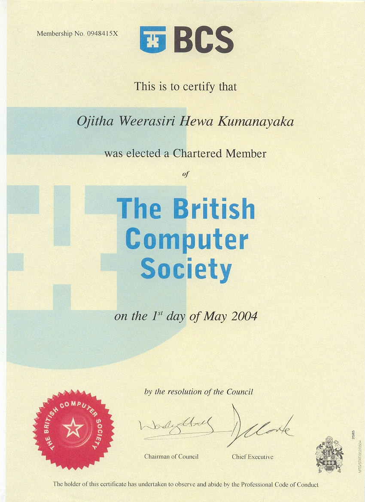

------

* TOC
{:toc}
------

<a class="libutton" href="https://www.linkedin.com/comm/mynetwork/discovery-see-all?usecase=PEOPLE_FOLLOWS&followMember=ojitha" target="_blank">Follow on LinkedIn</a>

[Credly Badges & Skills](https://www.credly.com/users/ojitha){:target="_blank"}

[AWS SkillBuilder Profile](https://skillsprofile.skillbuilder.aws/user/ojitha){:target="_blank"}

## Licenses & certifications

| Credentials Verification Link                                | Association                  | Badge                                                        | Issued Date |
| ------------------------------------------------------------ | ---------------------------- | ------------------------------------------------------------ | ----------- |
| [AWS AI Architect](https://www.credly.com/badges/a6635888-93a2-4a7c-b412-757815c81573/public_url){:target="_blank"} | AWS                          | {:width="150" height="150"} | 17/08/2025  |
| [AWS Machine Learning](https://www.credly.com/badges/97587daa-6f0a-465f-8dfc-583e5f8d6e7b/public_url){:target="_blank"} | AWS                          | {:width="150" height="150"} | 22/09/2025  |
| [AWS Data Analytics](https://www.credly.com/badges/ca47ca26-f81d-4120-ae69-8a19f54d52ff/public_url){:target="_blank"} | AWS                          | {:width="150" height="150"} | 14/08/2025  |
| [AWS Certified Developer – Associate](https://www.credly.com/badges/01dbe7bb-0b4d-4e9f-8811-95879ec2a1c8/public_url){:target="_blank"} | AWS                          | {:width="150" height="150"} | 30/04/2022  |
| [AWS Certified Solutions Architect – Associate](https://www.credly.com/badges/18763a84-f2b0-48fc-ac9a-ce156a4e70ce/public_url){:target="_blank"} | AWS                          | {:width="150" height="150"} | 02/08/2021  |
| Sun Certified Java Programmer Java 6                         | Sun Microsystems             | <object data="/assets/images/about/Sun_Certified.pdf" type="application/pdf" width="150" height="100"/> | 2009        |
| Chartered IT Professional                                    | The British Computer Society | {: width="12%" height="8% "target="_blank"} | 01/05/2004  |

## AI Certificates

| Verified Certificate                                         | Authority                                                    | Issued Date |
| ------------------------------------------------------------ | ------------------------------------------------------------ | ----------- |
| [Build intelligent agents with Agent Development Kit (ADK)](https://www.cloudskillsboost.google/public_profiles/2f9afd5c-feb5-4c93-bc07-9ff27a453225/badges/18673407){:target="_blank"} | Google                                                       | 28/09/2025  |
| [AWS Machine Learning](https://www.credly.com/badges/97587daa-6f0a-465f-8dfc-583e5f8d6e7b/public_url){:target="_blank"} | [AWS](/assets/images/about/AWS_ML_CoudQuest.pdf){:target="_blank"} | 22/09/2025  |
| [AI Agents with CrewAI](https://www.credly.com/badges/6a7f9ead-5c40-48bd-ba9e-b21fb45faf74/public_url){:target="_blank"} | [O`REILLY](/assets/images/about/ORMCertificate20250910-30-9xqyy0.pdf){:target="_blank"} | 10/09/2025  |
| [Azure AI for Developers: Building AI Agents](https://www.linkedin.com/learning/certificates/64eeed47948ce5968c835b8acac7874c158bb17d905fd53f085f424a7bf9271c){:target="_blank"} | [LinkedIn](/assets/images/about/CertificateOfCompletion_Azure_AI_for_Developers_Building_AI_Agents.pdf){:target="_blank"} | 10/09/2025  |
| [AI Agents with LangGraph](https://www.credly.com/badges/c7ad7b58-77a0-48ca-bded-0c3b1f2ace55/public_url){:target="_blank"} | [O`REILLY](/assets/images/about/AI_Agents_with_LangGraph.pdf){:target="_blank"} | 09/09/2025  |
| [Building AI Agents with AutoGen](https://www.linkedin.com/learning/certificates/29dad3d4593e229bdfc09c0b3ad6eeefc4230d733ff172c4053903e18a0e58f0?trk=share_certificate){:target="_blank"} | [LinkedIn](/assets/images/about/Building_AI_Agents_with_AutoGen.pdf){:target="_blank"} | 09/09/2025  |
| [Introduction to Agentic AI: Getting Started with AutoGen Studio](https://www.linkedin.com/learning/certificates/c99dc2be7323acb04fca35d69fb5b28f83619ec14d16cb3039396ad5ad6d2f06?trk=share_certificate){:target="_blank"} | [LinkedIn](/assets/images/about/CertificateOfCompletion_Introduction_AutoGen_Studio.pdf){:target="_blank"} | 02/09/2025  |
| [AI Agents with MCP](https://www.credly.com/badges/6841592a-a010-4f87-9557-be218b5cad61/public_url){:target="_blank"} | [O`REILLY](/assets/images/about/AI_Agents_with_MCP.pdf){:target="_blank"} | 29/08/2025  |
| [Model Context Protocol (MCP) – Simply explained](/assets/images/about/MCP_Simply_explained.pdf){:target="_blank"} | [AWS](https://skillbuilder.aws/learn/WSE7F92MPA/model-context-protocol-mcp--simply-explained/YP6AFKZECQ){:target="_blank"} | 28/08/2025  |
| [AWS Cloud Quest: Generative AI Architect](https://www.credly.com/badges/a6635888-93a2-4a7c-b412-757815c81573/public_url){:target="_blank"} | [AWS](/assets/images/about/Generative_AI_Architect.pdf){:target="_blank"} | 17/08/2025  |
| [Lab - Explore Amazon Bedrock Agents integrated with Amazon Bedrock Knowledge Bases and Amazon Bedrock Guardrails](/assets/images/about/Lab_Explore_Amazon_Bedrock_Agents_integrated_with_Amazon_Bedrock_Knowledge_Bases_and_Amazon_Bedrock_Guardrails.pdf){:target="_blank"} | [AWS](https://skillbuilder.aws/learn/EYJP8ZK9VK/lab--explore-amazon-bedrock-agents-integrated-with-amazon-bedrock-knowledge-bases-and-amazon-bedrock-guardrails/R3GGAEJHGG){:target="_blank"} | 23/07/2025  |
| [Amazon SageMaker JumpStart Foundations](/assets/images/about/Amazon_SageMaker_JumpStart_Foundations.pdf){:target="_blank"} | [AWS](https://skillbuilder.aws/learn/FXFTA818BY/amazon-sagemaker-jumpstart-foundations/JHCWA81C7B){:target="_blank"} | 22/07/2025  |
| [Lab - Build Machine Learning Models with Amazon SageMaker](/assets/images/about/Lab_-_Build_Machine_Learning_Models_with_Amazon_SageMaker.pdf){:target="_blank"} | [AWS](https://skillbuilder.aws/learn/V4N9X9XV6E/lab--build-machine-learning-models-with-amazon-sagemaker/HTVY1DP1CH){:target="_blank"} | 20/06/2025  |
| [Developing Generative Artificial Intelligence Solutions](/assets/images/about/19610_5_1510486_1738715402_AWS Skill Builder Course Completion Certificate.pdf){:target="_blank"} | [AWS](https://skillbuilder.aws/learn/PWJCMNXWHT/developing-generative-artificial-intelligence-solutions/JFB95SXNPF){:target="_blank"} | 05/02/2025  |
| [Amazon Bedrock Getting Started - Amazon Bedrock Getting Started](assets/images/about/17508_5_1510486_1738666602_AWS Skill Builder Course Completion Certificate.pdf){:target="_blank"} | [AWS](https://explore.skillbuilder.aws/learn/courses/17508/amazon-bedrock-getting-started/lessons/149606/amazon-bedrock-getting-started){:target="_blank"} | 04/02/2025  |
| [Essentials of Prompt Engineering](/assets/images/about/19611_5_1510486_1738629019_AWS Skill Builder Course Completion Certificate.pdf){:target="_blank"} | [AWS](https://explore.skillbuilder.aws/learn/courses/19611/essentials-of-prompt-engineering){:target="_blank"} | 04/02/2025  |
| [Exploring Artificial Intelligence Use Cases and Applications](assets/images/about/19579_5_1510486_1738558596_AWS Skill Builder Course Completion Certificate.pdf){:target="_blank"} | [AWS](https://explore.skillbuilder.aws/learn/courses/19579/exploring-artificial-intelligence-use-cases-and-applications/lessons/153615/exploring-artificial-intelligence-use-cases-and-applications){:target="_blank"} | 03/02/2025  |
| [Fundamentals of Machine Learning and Artificial Intelligence](/assets/images/about/19578_5_1510486_1735698940_AWS Skill Builder Course Completion Certificate.pdf){:target="_blank"} | [AWS](https://skillbuilder.aws/learn/16ASDUHF86/fundamentals-of-machine-learning-and-artificial-intelligence/M7JZCTA94N){:target="_blank"} | 01/01/2025  |

## Data Engineering Certificates

| Verified Certificate                                         | Authority                                                    | Issued Date |
| ------------------------------------------------------------ | ------------------------------------------------------------ | ----------- |
| [Microservices with Containers](https://www.credly.com/badges/72c3165b-bcb7-4cba-8462-f4a1b6c7d63c/public_url){:target="_blank"} | [O`REILLY](/assets/images/about/ORMCertificate20250911-30-nj6sst.pdf){:target="_blank"} | 11/09/2025  |
| [AWS Cloud Quest: Data Analytics](/assets/images/about/AWS_Data_Analytics.pdf){:target="_blank"} | [AWS](https://skillbuilder.aws/learn/ZZHVPSPF2S/aws-cloud-quest-data-analytics/YZYQPHY2VZ){:target="_blank"} | 14/08/2025  |
| [AWS SimuLearn: Secure Data Using Amazon S3 Access Points and VPC Endpoints](/assets/images/about/S3Access_VPCEndPoint.pdf){:target="_blank"} | [AWS](https://skillbuilder.aws/learn/34X7U1FY79/aws-simulearn-secure-data-using-amazon-s3-access-points-and-vpc-endpoints/GP9VVUAQEX){:target="_blank"} | 03/08/2025  |
| [Python Programming](https://www.credly.com/badges/e1952a4a-f162-46aa-91c4-a93ab3c0676e/public_url){:target="_blank"} | [O`REILLY](/assets/images/about/Python_Programming.pdf){:target="_blank"} | 03/08/2025  |
| [Advanced Python: Functional Programming](https://www.credly.com/badges/7df1cf03-c3f5-4e08-9fae-a430a7ad6abf/public_url){:target="_blank"} | [O`REILLY](/assets/images/about/ORMCertificate20250531-25-epsw1f.pdf){:target="_blank"} | 22/03/2025  |
| [Data Engineering on AWS - A Data Lake Solution (Includes Labs)](/assets/images/about/20316_5_1510486_1741746384_AWS%20Skill%20Builder%20Course%20Completion%20Certificate.pdf){:target="_blank"} | [AWS](https://skillbuilder.aws/learn/T7ZQ2ZQ435/data-engineering-on-aws--a-data-lake-solution-includes-labs/W4NU348ADM){:target="_blank"} | 12/03/2025  |
| [Knowledge Check: Get Started with Databricks for Data Engineering](/assets/images/about/2026_3_248029_1737415341_Databricks - Generic.pdf){:target="_blank"} | [Databricks](https://customer-academy.databricks.com/learn/courses/2026/knowledge-check-get-started-with-databricks-for-data-engineering?hash=bc44379a9e7268c2a0a84289e6c69d8d9308abd2&generated_by=248029){:target="_blank"} | 21/01/2025  |
| [Getting Started with AWS Control Tower](/assets/images/about/14823_3_4320000_1706403451_AWS Course Completion Certificate.pdf){:target="_blank"} | [AWS](https://skillbuilder.aws/learn/NHAM6FHVS8/getting-started-with-aws-control-tower/SGEKEHNZJP){:target="_blank"} | 28/01/2024  |
| [Introduction to Amazon Athena](https://explore.skillbuilder.aws/learn/course/152){:target="_blank"} | [AWS](assets/images/about/152_3_1510486_1700984961_AWS Course_Completion_Certificate.pdf){:target="_blank"} | 16/10/2023  |
| [AWS Hadoop Fundamentals](https://explore.skillbuilder.aws/learn/course/43){:target="_blank"} | [AWS](/assets/images/about/43_3_1510486_1697259883_AWS_Course_Completion_Certificate.pdf){:target="_blank"} | 11/09/2023  |
| [Introduction to Amazon Kinesis Streams](https://explore.skillbuilder.aws/learn/course/157){:target="_blank"} | [AWS](assets/images/about/157_3_1510486_1700984962_AWS_Course_Completion_Certificate.pdf){:target="_blank"} | 09/09/2023  |
| [Advanced CloudFormation: Macros](https://explore.skillbuilder.aws/learn/course/113){:target="_blank"} | [AWS](/assets/images/about/113_3_1510486_1700984960_AWS _Course_Completion_Certificate.pdf){:target="_blank"} | 10/07/2023  |
| [Getting Started with AWS CloudFormation](https://explore.skillbuilder.aws/learn/course/3627){:target="_blank"} | [AWS](assets/images/about/3627_3_1510486_1700984963_AWS_Course_Completion_Certificate.pdf){:target="_blank"} | 10/07/2023  |
| [Deep Dive into Concepts and Tools for Analyzing Streaming Data on AWS](https://explore.skillbuilder.aws/learn/course/138){:target="_blank"} | [AWS](/assets/images/about/138_3_1510486_1697259885_AWS Course_Completion_Certificate.pdf){:target="_blank"} | 10/09/2023  |
| [Amazon DynamoDB – Architecture and Features](https://explore.skillbuilder.aws/learn/course/50){:target="_blank"} | [AWS](/assets/images/about/50_3_1510486_1700984958_AWS_Course_Completion_Certificate.pdf){:target="_blank"} | 29/06/2023  |
| [AWS Certified Solutions Architect - Professional (Advanced Architecturing on AWS)](/assets/images/about/ADVANCED_ARCHITECTING_ON_AWS.pdf){:target="_blank"} | AWS                                                          | 05/06/2023  |
| [Amazon QuickSight - Getting Started](assets/images/about/14908_3_1510486_1700984964_AWS_Course_Completion_Certificate.pdf){:target="_blank"} | [AWS](https://explore.skillbuilder.aws/learn/course/14908){:target="_blank"} | 14/04/2023  |
| [Best Practices for Data Warehousing with Amazon Redshift](assets/images/about/100_3_1510486_1700984959_AWS_Course_Completion_Certificate.pdf){:target="_blank"} | [AWS](https://explore.skillbuilder.aws/learn/course/100/){:target="_blank"} | 09/03/2023  |
| [Introduction to Amazon Kinesis Analytics](/assets/images/about/131_3_1510486_1700984960_AWS _Course_Completion_Certificate.pdf){:target="_blank"} | [AWS](https://explore.skillbuilder.aws/learn/course/131){:target="_blank"} | 15/05/2022  |
| [Introduction to Amazon Quicksight](assets/images/about/137_3_1510486_1700984961_AWS Course_Completion_Certificate.pdf){:target="_blank"} | [AWS](https://explore.skillbuilder.aws/learn/course/137){:target="_blank"} | 22/08/2022  |
| [Introduction to Amazon Kinesis Data Analytics for Java Applications](assets/images/about/384_3_1510486_1700984962_AWS_Course_Completion_Certificate.pdf){:target="_blank"} | [AWS](https://explore.skillbuilder.aws/learn/course/384){:target="_blank"} | 15/05/2022  |
| [AWS Glue Getting Started](assets/images/about/8171_3_1510486_1700984964_AWS_Course_Completion_Certificate.pdf){:target="_blank"} | [AWS](https://explore.skillbuilder.aws/learn/course/8171){:target="_blank"} | 15/05/2022  |
| [Introduction to Designing Data Lakes on AWS](/assets/images/about/Coursera_DYBF9YW7WC4D.pdf){:target="_blank"} | [AWS](https://www.coursera.org/account/accomplishments/records/DYBF9YW7WC4D){:target="_blank"} | 06/2021     |
| [Building Modern Java Applications on AWS](/assets/images/about/Coursera_Z2S9MBWB2JPT.pdf){:target="_blank"} | [AWS](https://www.coursera.org/account/accomplishments/records/Z2S9MBWB2JPT){:target="_blank"} | 03/2021     |
| [Building Containerized Applications on AWS](/assets/images/about/Coursera_VCQY7EKLAUXW.pdf){:target="_blank"} | [AWS](https://www.coursera.org/account/accomplishments/records/VCQY7EKLAUXW){:target="_blank"} | 06/2020     |
| [CS120x: Distributed Machine Learning with Apache Spark](/assets/images/about/Spark_distributed_ML.png){:target="_blank"} | [Berkeley University](https://courses.edx.org/certificates/2fd76bd1bd7142fea5d427213b44ff60){:target="_blank"} | 08/2016     |
| [edX Verified Certificate for Introduction to Apache Spark](/assets/images/about/spark_intro.png){:target="_blank"} | [Berkeley University](https://courses.edx.org/certificates/6e14fca436b148569d1119d20c9ccad1){:target="_blank"} | 06/2016     |
| [Functional Programming Principles in Scala](/assets/images/about/Coursera_2BMLP7JQGUTW.pdf){:target="_blank"} | [EPFL](https://www.coursera.org/account/accomplishments/records/2BMLP7JQGUTW){:target="_blank"} | 07/2016     |
| [Introduction to Recommender Systems](/assets/images/about/Coursera_LU8A57ZX89HG.pdf){:target="_blank"} | [University of Minnesota](https://www.coursera.org/account/accomplishments/records/LU8A57ZX89HG){:target="_blank"} | 10/2015     |

## AI Research Publications

- Conference: [IEEE ICIIS 2007](https://ieeexplore.ieee.org/servlet/opac?punumber=4569827)
    Ojitha Kumanayaka and Nalin Ranasinghe. [Formalism for ontology validation](https://ieeexplore.ieee.org/abstract/document/4579189). In IEEE Second International Conference on Industrial and Information Systems. Faculty of Engineering, University of Peradeniya, August 2007.

- Conference: [IEEE ICIA 2006](https://ieeexplore.ieee.org/servlet/opac?punumber=4250170)
    Ojitha Kumanayaka and Nalin Ranasinghe. [Ontology-based web service personalisation](https://ieeexplore.ieee.org/abstract/document/4250244). In the IEEE Second International Conference on Information and Automation 2006, held at the Galadari Hotel, Colombo, Sri Lanka, December 2006. IEEE Sri Lanka Section.

- Conference: [IEEE ICIIS 2006](https://ieeexplore.ieee.org/servlet/opac?punumber=4216542)
    Ojitha Kumanayaka and Nalin Ranasinghe. [Personalised web services creation via dynamic composition](https://ieeexplore.ieee.org/document/4216623). In the IEEE First International Conference on Industrial and Information Systems. Faculty of Engineering, University of Peradeniya, August 2006.

## AI Documents

| Document                                                     | Institute                                                    | Published Date |
| ------------------------------------------------------------ | ------------------------------------------------------------ | -------------- |
| [Ontology Based Web Services Personalisation](https://raw.githubusercontent.com/ojitha/blog/master/assets/images/about/Thesis.pdf){:target="_blank"} | Thesis - [UCSC](https://cmb.ac.lk/category/ucsc){:target="_blank"} | 12/2007        |
| [Missing Manual Protege Ontology Tutorial](https://raw.githubusercontent.com/ojitha/blog/master/assets/images/about/tutorial.pdf){:target="_blank"} | Conslutation - [Sintelix](https://sintelix.com){:target="_blank"} | 08/2010        |

