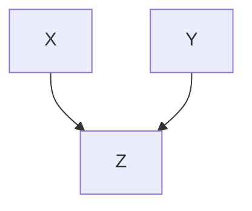

---
layout: page
title: Notes
permalink: /notes/
---

This is my day to day note book where I want to share. For example, it is very general to find the following information for date and time:

- Number of seconds per year  = $31536000$ seconds :v:
- Number of seconds per day (24h) = $86400$ seconds

## Important URLs

I would like to maintain the important URLs for some apps and tools found while I am searching. For example, there the good link found from the O'REILLY Programming Newsletter  relating to the VSC which is one of my favorite:

- If you are terminal lover: [ConEmu](https://conemu.github.io/) and [iTerm 2](https://www.iterm2.com/) in Mac.

## Productivity Tools
Productivity is a cross cutting concren each and very bit of work I do. 

### Diagraming tools
I was very enthustic to know markdown level diagraming. 

One of the best so far found is [mermaid](https://mermaid-js.github.io/mermaid/#/) which I cause use with the my blog tool stackedit.io. For example:



such a great diagraming.

## DevOps
Here the important commands and information collected while programming. 

### AWS console

configure the AWS console (For the region  http://docs.aws.amazon.com/general/latest/gr/rande.html)

```bash
aws configure
```

Find all the running EC2 instances:

```bash
aws ec2 describe-instances
```

To find Instance Id

```bash
ec2 describe-instances | grep InstanceId
```

Terminate the instance 

```bash
aws ec2 terminate-instances --instance-id i-07fbd393a04fdd22c
```

### AWS KMS

```bash
#encrypt the password: InsightReadWrite
aws kms encrypt --key-id cfc7acf7-4f20-49c3-aa11-8be4cdc3291d --output text --query CiphertextBlob --plaintext InsightReadWrite

#encrypt the password: InsightReadWrite
aws kms encrypt --key-id cfc7acf7-4f20-49c3-aa11-8be4cdc3291d --plaintext fileb://test.txt --output text | base64 --decode > out.txt

#decrypt the password: InsightReadWrite
aws kms decrypt  --ciphertext-blob fileb://out.txt --output text --query Plaintext | base64 --decode
```

### AWS Kinesis

AWS Kinesis shows only example shows only one sequence. This is the record I found from the log with multiple sequences:

```json
{
    u 'Records': [{
        u 'eventVersion': u '1.0',
        u 'eventID': u 'shardId-000000000000:49559921416499955208897145459995453707469374714070171650',
        u 'kinesis': {
            u 'approximateArrivalTimestamp': 1502065218.908,
            u 'partitionKey': u 'TI2I7c',
            u 'data': u '<data1>',
            u 'kinesisSchemaVersion': u '1.0',
            u 'sequenceNumber': u '49559921416499955208897145459995453707469374714070171650'
        },
        u 'invokeIdentityArn': u 'arn:aws:iam::389920326251:role/Lambda-execution-role-Uat',
        u 'eventName': u 'aws:kinesis:record',
        u 'eventSourceARN': u 'arn:aws:kinesis:ap-southeast-2:389920326251:stream/ticketing-uat',
        u 'eventSource': u 'aws:kinesis',
        u 'awsRegion': u 'ap-southeast-2'
    }, {
        u 'eventVersion': u '1.0',
        u 'eventID': u 'shardId-000000000000:49559921416499955208897145459996662633288989343244877826',
        u 'kinesis': {
            u 'approximateArrivalTimestamp': 1502065218.908,
            u 'partitionKey': u 'ihwN32',
            u 'data': u '<data2>',
            u 'kinesisSchemaVersion': u '1.0',
            u 'sequenceNumber': u '49559921416499955208897145459996662633288989343244877826'
        },
        u 'invokeIdentityArn': u 'arn:aws:iam::389920326251:role/Lambda-execution-role-Uat',
        u 'eventName': u 'aws:kinesis:record',
        u 'eventSourceARN': u 'arn:aws:kinesis:ap-southeast-2:389920326251:stream/ticketing-uat',
        u 'eventSource': u 'aws:kinesis',
        u 'awsRegion': u 'ap-southeast-2'
    }, {
        u 'eventVersion': u '1.0',
        u 'eventID': u 'shardId-000000000000:49559921416499955208897145460000289410747833230768996354',
        u 'kinesis': {
            u 'approximateArrivalTimestamp': 1502065218.913,
            u 'partitionKey': u 'PoGyUG',
            u 'data': u 'H4sIAAAAAAAAAzMAACHf2/QBAAAA',
            u 'kinesisSchemaVersion': u '1.0',
            u 'sequenceNumber': u '<data3>'
        },
        u 'invokeIdentityArn': u 'arn:aws:iam::389920326251:role/Lambda-execution-role-Uat',
        u 'eventName': u 'aws:kinesis:record',
        u 'eventSourceARN': u 'arn:aws:kinesis:ap-southeast-2:389920326251:stream/ticketing-uat',
        u 'eventSource': u 'aws:kinesis',
        u 'awsRegion': u 'ap-southeast-2'
    }]
}
```

### AWS Chalice

Package first :

```bash
aws cloudformation package --template-file out/sam.json --s3-bucket ojemr --output-template-file pkg.yaml
```

Deploy :

```bash
aws cloudformation deploy --template-file /home/cloudera/dev/hellochalice/pkg.yaml --stack-name hellochalice --capabilities CAPABILITY_IAM
```

SQL Server

Login to the docker:

```bash
docker exec -i -t 8ae7c51a90fe /bin/bash
```

Create a new folder in the /var/opt/mssql

```bash
cd /var/opt/mssql/
mkdir backup
```

Download the AdventureWork from https://msftdbprodsamples.codeplex.com/downloads/get/880661 to your local machine and unzip.

```bash
docker cp AdventureWorks2014.bak 8ae7c51a90fe:/var/opt/mssql/backup
```

In your host machine use the sqlcmd

```bash
sqlcmd -S 127.0.0.1 -U SA -P '<password>'
```

Following the link https://docs.microsoft.com/en-us/sql/linux/sql-server-linux-migrate-restore-database

Restore the backup file:

```bash
RESTORE DATABASE AdventureWorks
FROM DISK = '/var/opt/mssql/backup/AdventureWorks2014.bak'
WITH MOVE 'AdventureWorks2014_Data' TO '/var/opt/mssql/data/AdventureWorks2014_Data.mdf',
MOVE 'AdventureWorks2014_Log' TO '/var/opt/mssql/data/AdventureWorks2014_Log.ldf'
GO
```

How to start docker again

```bash
#find the container id
docker ps -a
#start that container id
docker start <container-id>
```


## Email

Most of the web application send email to their users.

### Fake the mail server
The application is currently running in the CentOS and it uses postfix mail server as a default. For my local development, I don't need this mail server and very happy with fake mail server which can help to find the email immediately from the console. 

- Stop the mail server if it is running in your development 
- Create a mail service using python

Here the code for the terminal:

```bash
sudo postfix stop
sudo python -m smtpd -n -c DebuggingServer localhost:25
```

Install python 2.7 on Centos:

```bash
sudo yum update # update yum
sudo yum install centos-release-scl # install SCL 
sudo yum install python27 # install Python 2.7
scl enable python27 bash
```

virtual env:

```bash
virtualenv -p /opt/rh/python27/root/usr/bin/python test
cd test
source test/activate
```

## NoSQL

Here are the NoSQL databases I used.

## Elasticsearch

#### Basic Operations

Add the book index:

```http
PUT /books
{
  "settings": {
    "number_of_shards": 1,
    "number_of_replicas": 0
  },
  "mappings": {
    "authors" : {
      "properties": {
        "name" : {
          "type": "string"
        },
        "book_count" : {
          "type" : "integer"
        },
        "date" : {
          "type" : "date"
        }
      }
    }
  }
}
```

## MongoDB

How to tunnel to mongo db using ssh:

```bash
ssh -L 27017:localhost:27017 <user name>@<host>
```
### Queries
Here the important pattern of query collection.

#### Basic Queries from MongDb University

Array find **all**

```javascript
db.getCollection('movieDetails').find({genres: {$all: ['Comedy', 'Crime', 'Drama']}})
```

#### elemMatch

```json
/*
{
    "_id" : "Ojitha",
    "name" : "Ojitha Hewa",
    "addresses" : [ 
        {
            "street" : "321 Fake Street",
            "city" : "Epping",
            "state" : "NSW",
            "zip" : "2121"
        }, 
        {
            "street" : "5 Waterloo Rd",
            "city" : "Marsfield",
            "state" : "NSW",
            "zip" : "2120"
        }
    ]
}
*/

//elemMatch example
db.getCollection('embbeded').find(
    {addresses:{
        $elemMatch:{"state":"NSW",'zip':'2121', "street" : "321 Fake Street"}
        }
    }
)
```

#### Aggregates

Query to find duplicates

```json
db.users.aggregate(
    {$group : {
        _id : {un:{userName: '$userName'}, 
        accountType:{accountType:'$accountType'}},
        count : {$sum : 1}
    }},
    {$match: {
        count : {$gt: 1}
    }}
)
```

#### Updates

Here the way to insert array elements:

```javascript
db.getCollection('embbeded').updateOne({"_id":"joe"},
    {$push: 
                {testing: {test1: "test1", test2:"test2"}}
    }
)

//result is
/*
	...
	...
    "testing" : [ 
        {
            "test1" : "test1",
            "test2" : "test2"
        }
    ]
}
*/
```

Above same thing can be achieve through the 

```javascript
db.getCollection('embbeded').updateOne({"_id":"joe"},
    {$push: 
                {testing: {$each : [
                        {test1: "test1", test2:"test2"}
                    ]}}
    }
)
```

Add new values without overwriting:

```javascript
db.getCollection('embbeded').updateOne({"_id":"joe"},
    {$push: 
                {testing: {$each : [
                        {test3: "test3", test4:"test4"}
                    ], $slice: 2}}
    }
)

//result is
/*
	...
	...
   ],
    "testing" : [ 
        {
            "test1" : "test1",
            "test2" : "test2"
        }, 
        {
            "test3" : "test3",
            "test4" : "test4"
        }
    ]
}
*/
```

But if you want to push to the front of the array:

```javascript
db.getCollection('embbeded').updateOne({"_id":"joe"},
    {$push: 
                {testing: {$each : [
                        {test5: "test5", test6:"test6"}
                    ], $position:0, $slice: 2}}
    }
)

//result is
/*
	...
	...
   ],
    "testing" : [ 
        {
            "test5" : "test5",
            "test6" : "test6"
        }, 
        {
            "test1" : "test1",
            "test2" : "test2"
        }
    ]
}
*/
```

Here the query to update the multiple documents, multi: true

```json
db.users.update(
    {$and: [ {userNId: {$exists: true}},
        {$or: [
        {accType:'Facebook'}, {accType:'Google'}, {accType:'Twitter'}
        ]}
     ]},
    {$unset: {userNId: ''}},
    {multi: true}
)
```

In the above query, userNId has been removed from all the documents where userNId exist and accType is Facebook, Google or Twitter.

```json
db.getCollection('users').find({
    $and: [ {userNId: {$exists: false}},
        {$or: [
        {accType:'Facebook'}, {accType:'Google'}, {accType:'Twitter'}
        ]}
     ]
 })
```

Above query shows you the changes have done in the above multi update query.

Mongo Replica

```bash
screen -d -m -S mongo-rs1 mongod --port 27017 --dbpath ~/mongo/data-rs1 --replSet rs0 --smallfiles --oplogSize 128 --logpath ~/mongo/logs/mongo-rs1.log
screen -d -m -S mongo-rs2 mongod --port 27018 --dbpath ~/mongo/data-rs2 --replSet rs0 --smallfiles --oplogSize 128 --logpath ~/mongo/logs/mongo-rs2.log
screen -d -m -S mongo-rs3 mongod --port 27019 --dbpath ~/mongo/data-rs3 --replSet rs0 --smallfiles --oplogSize 128 --logpath ~/mongo/logs/mongo-rs3.log

```

### Date offset for Australia:

It is important to find the proper date based on the offset in the mongo, for example consider the following dates ISODate("2016-08-31T03:49:13.857Z") <—> ISODate("2016-08-31T13:49:13.857Z")

```javascript
#to get the AU morning
var auDate = ISODate("2016-08-31T13:49:13.857Z") 
isoDate = new Date(date - (+600 * 60000))

#to get the AU date
var date = ISODate("2016-08-31T03:49:13.857Z") 
auDate = new Date(date - (-600 * 60000))
```

For example, beginning of the day

```javascript
var date = ISODate("2016-08-31T00:00:00.000Z") 
new Date(date - (+600 * 60000))
# ISODate("2016-08-30T14:00:00Z")
```

Run the following code to get the current Date and time

```javascript
var date = new Date()
db.getCollection('Orderlines').insert({"_id":"mytest",d:date})
db.getCollection('Orderlines').find({"_id":"mytest"})
```

or run

```javascript
var date = new ISODate()
```

Mongoldb oplog time stamp query

```javascript
var date = new ISODate()
db.getCollection('oplog.rs').find({
    ts: {$gt : date}, ns: 'OrdersTest.Orderlines',
    $or: [ {op:'i'}, {op: 'u'}]
}).limit(2)
```

#### Find the docs who has a field

It is sometimes important to find the all users who has particular key

```json
db.getCollection(<collection>).find({<target-field>:{$exists: true}})
```

####Update field of array
for example, Person document has addresses field and it is is an array of addresses: street is the first element. To convert all the street names to uppercase:

```javascript
db.getCollection(<collection>).find({<criteria>}).forEach(function(e){
    for ( i = 0; i < e.addresses.length ;i++){
        e.addresses[i].street=e.addresses[i].street.toUpperCase();
    }
    //save to the collection
    db.<collection>.save(e)

})
```

Update with the $pull:

```json
db.getCollection('Orderlines').update(
    {'_id':{$in: ['20161019,42121,2','20161109,39661,2','20161019,38036,2', '583ba80a09edaa2fc0d8ba61,1', '20161017,29051,9,cp']}},
    {$pull: {orderlineItems: {'fees.typeName':'test'}}},
    {multi: true}
)
```

### Backup

How to dump the backup and restore from the remote mong server ? Here you have to follow the three steps

1. First create a tunnel to the remote mongo server

```bash
   ssh -L 27018:<remote server>:27017 <username>@<remote server>
```

   Here the port 27018 fro the local machine. This port is map to the <remote server>:27017. 

2. dump the collection to the directory

   ```bash
   /usr/bin/mongodump --host localhost --port 27018  -u <mongodb user name> -p <mongodb password> -d <database> -c <mongo collection> -o <directory>	
   ```

   as  shown in the above  you have to provide the remote mongo server username/password, datatbase and the collection.

3. Now restore the backup

   ```bash
   /usr/bin/mongorestore --host 127.0.0.1 --port 27017 --db <database> --drop <directory>/user-admin
   ```

   backup and restore is completed.

#### Find the type of the field
Here the way to find the type of the field in the mongodb

```javascript
 db.users.find({userName:'oj_1'}).forEach( function(e) { return print(typeof(e.password)); } );
```

## RDBS

### H2 Database

For testing use the following to run in the watch expression:

```bash
org.h2.tools.Server.startWebServer(this.jdbcTemplate.getDataSource().getConnection())
```

if you need to run in the browser(start browser: **java -cp h2-1.4.193.jar org.h2.tools.Console -web -browser**) use the **jdbc:h2:mem:dataSourc**e as connection url for Spring testing.

##Tomcat

Configure the tomcat for CAS

```xml
    <Connector port="8443" 
	   protocol="org.apache.coyote.http11.Http11NioProtocol" 
	   SSLEnabled="true"
           maxThreads="150" scheme="https" secure="true"
           clientAuth="false" sslProtocol="TLS"
	   allowTrace="true" 
    	   keystoreFile="conf/abc-keys/keystore.jks" 
    	   keystorePass="<key-password>" 
    	   truststoreFile="conf/abc-keys/truststore.jks"
    	   URIEncoding="UTF-8" useBodyEncodingForURI="true"/>
```

Add the above code to the server.xml file before the `<Connector port="8009" protocol...` statement.

Install apahce web server

```bash
sudo yum install httpd -y
```

Start the service

```bash
sudo service httpd start
```

Configure to start every time:

```bash
sudo chkconfig httpd on
```

Show the disk volumes

```bash
lsblk
```

check the data in the volume:

```bash
sudo file -s /dev/xvdf
```

format the before mount the volume:

```bash
sudo mkfs -t ext4 /dev/xvdf
```

Now mount the volume:

```bash
#first create myfileserver
cd /
sudo mkdir myfileserver

#then mount
sudo mount /dev/xvdf /myfileserver
```

Unmount as a root:

```bash
umount /dev/xvdf
```

## Unix tools

change the shell to zsh

```bash
chsh -s /bin/zsh
```

Edit a file in a TextEdit

```bash
open -a TextEdit ~/.zshrc
```

Find the file names only with the text recusively

```bash
grep -il -r --include "*.py" 'text' .
```

Find all the files with wild card recursively:

```bash
find . -name "*.pyc" -exec ls {} \;
```

Another recursive example with include and exclude directory:

```bash
grep -rI --include='*.py'  --exclude-dir='lib' "S3Service" *
```

To show all the CHAPTERS:

```bash
grep -i chapter novel.txt
```

Cut only the chapter headings

```bash
grep -i chapter novel.txt | cut -d' ' -f3-
```

Read the line where CHAPTER contains but start with 'the' in the novel.txt.

```bash
grep -E '^CHAPTER (.*)\. The' novel.txt
```

Every word more 5 or more characters

```bash
grep -oE '\w{5,}' novel.txt
```

In the redhat to start the firewall GUI, type the following command:

```bash
sudo system-config-firewall
```

Here the way to validate xml file for schema and generate the report

```bash
	xmllint  --noout --valid --schema UserCentralClients.xsd sample2.xml > error.txt 2>&1
```

noout will stop xml written to the error.txt. 

### awk

Commandline

```bash
awk -F, '{$2="***"; print $1 $2}'  test.txt
```

Above logic in the file called f:

```bash
awk -F, -f t test.txt 
```

Both the above commands produce the same.

here the contents of the f file:

```bash
BEGIN {
  print "1 st \t 2nd"
  print "==== \t ==="
}

{
  $2="***";
  print $1 "\t" $2
}

END{
  print "the end"
}

```

## 

### Brew

List installed packages

```bash
brew list -1
```

### Terminal Commands

Find the type of the command

```bash
type -a pwd
```

create tar file

```bash
tar -czvf mylogs.tar.gz logs-*.log
```

find the directory in the Unix

```shell
find / -type d -name 'pyve*' 2>&1 | grep -v "Permission denied"
#or
find . -type d -name 'pyve*'  2>/dev/null
```

filter the file lines:

```bash
sed -n '1 , 3 p' my.txt > test.txt
```

Top occurrence words in a page

```bash
curl -s http://www.gutenberg.org/files/4300/4300-0.txt | tr '[:upper:]' '[:lower:]' | grep -oE '\w+' | sort | uniq -c | sort -nr | head -n 10
```

Use of Python as command line tool

```python
#!/usr/bin/env python
from sys import stdin, stdout
while True:
    line = stdin.readline()
    if not line:
        break
    stdout.write("%d\n" % int(line))
    stdout.flush()
```

Above will display the lines generated from the sequence. 

```bash
#permission
chmod u+x stream.py

#create the pipeline
seq 1000 | ./stream.py
```

Substitute seq

```bash
seq -f "Line %g" 10
```

Here the equlents, lines is a file

```
< lines head -n 3
< lines sed -n 1,3p
< lines awk 'NR<=3'
```

### Disk Management

To display size of the folder

```bash
du -hsx *
```

this will display the usage of the directory.
The following code show the top 20 files which used most of the file space

```bash
du -a | sort -n -r | head -n 20
```

This will show directory wise usage of file space

```bash
du -hsx * | sort -n -r | head -n 20
```

Here

>  - du command -h option : display sizes in human readable format.
>  - du command -s option : show only a total for each argument (summary).
>  - du command -x option : skip directories on different file systems.

## VCS

Git is the main version control system I am using currently.

### Git
Configuration commands are:

```bash
git config --global user.name
git config --global user.email
git config --global --list
```

Here the log to show all the branches

```bash
git log --oneline --all --graph --decorate
```

configure alias global level

```bash
git config --global alias.lg "log --oneline --all --graph --decorate"
```

To see the commit history

```bash
git reflog
```

Set the push limited only to the current branch:

```bash
git config --global push.default simple
```

List all the master branches:

```bash
git branch -a
```

Rename a file:

```bash
git mv index.html home.htm
```

Delete the file:

```bash
git rm index.html
```

Push only the tags:

```bash
git push --tags
```

Fetch without merging:

```bash
# currently in the master branch
git fetch
git checkout orign/master
cat test.com
git checkout master
git merge origin/master
```

rebasing

```bash
git pull --rebase
```

After commit and push if need to revert back due to the mistakes, follow the following command with SHA1

```bash
git revert <SHA1>
```

However, with the git lg above will show the history of the revert and the mistake.

To get rid of the last two commits:

-   completely throw away including files: `hard`
-   files back to the staging area from commit: `soft`
-   default will blow away the commits, remove the files from the staging area but leave the files: `mixed`

```shell
git reset HEAD~2
```

if you need to get back the ``` git reset --hard HEAD~2``` back use the SHA as follows

```shell
git reset --hard <SHA>
```

How to insert multiple commits:

```bash
# add new file
touch test.html
git add .
git commit -m "Add the test html file"
```

Now one way to insert SHA from another branch is cherry-pick as explained. The second way is (check the commit history if there is no new branch but recovering pervious commit and select that SHA)

```bash
# based on your SHA
# then create a new branch from that
git checkout SHA

#from the above checkout branch create a tmp branch
git checkout -b tmp

#now you can check with the "git lg", you will see new branch
#now rebase against master
git rebase master
```

Interactive rebase last 5 commits:

```bash
git rebase -i HEAD~5
```

find the commit from log message:

```bash
git log --all --grep='prepare release 1.0.12' 
```

find all the branches where commit is available:

```bash
git branch -r --contains 833187d69f6a776b715ddb5c0a1806d06e8159cb
#if need to checkout the commit
git checkout 833187d69f6a776b715ddb5c0a1806d06e8159cb
```

#### Alias 

(alias#git_alias)
Some important alias to **~/.gitconfig** :

```git
[alias]
	  show-last-commit = !sh -c 'git log $1@{1}..$1@{0} "$@"'
	  del-tag = !sh -c 'git tag -d $1 && git push origin :$1' -
	  del-branch = !sh -c 'git branch -d $1 && git push origin :$1' -
	  pt = !sh -c 'git tag $1 && git push origin $1' -	
```

the `git new` command shows the latest commit. I used this to find the change id for gerrit specially. The commands `git dt <tag name>` and `git db <branch name>` respectively delete the tag and the branch. if need to tag and push that tag with one command use: `git pt <tag name>`.

**Grog** 

to show the log

```git
git config --global alias.grog 'log --graph --abbrev-commit --decorate --all --format=format:"%C(bold blue)%h%C(reset) - %C(bold cyan)%aD%C(dim white) - %an%C(reset) %C(bold green)(%ar)%C(reset)%C(bold yellow)%d%C(reset)%n %C(white)%s%C(reset)"'
```

**Shorty**

Show the short status

```Shell
git config --global alias.shorty 'status --short --branch'
```

**Amend**

Amend the forget files after add

```git
git config --global alias.commend 'commit --amend --no-edit'
```

Here the short cut review command for the Gerrit:

```git
	  review = !sh -c 'git push origin HEAD:refs/for/develop%topic=$1,r=Easthope.Michael' -
```

#### Store password
Store Gerrit password in local workspace 

Instead of type password each time when you push or pull from the gerrit, you can store the password permanently:

```git
git config credential.helper store
```

Then issue the command and provide the password first time. Then after git will never ask the password until you unset as follows

```git
git config --unset credential.helper
```

Only once you have to do this.

#### Abort merge

In the new git,

```git
	git merge --abort
```

#### cherry pick

Apply one commit to another branch. Say you have a commit in the *WORK* branch and you need to bring this commit to the *DEVE* branch. First move to the *DEVE* branch. Then see the tree;

```git
	git checkout DEVE
	git log -n10 --oneline --graph WORK
	* 95d21d6 Changed the driver.
	*   a238007 release-1.42.0 - Resolved
	*  ... 
```

Then select the commit hash from the tree graph. Say commit hash is *95d21d6*

```git
	git cherry-pick 95d21d6
```

Now check the cherry pick has been applied ?

```git
	git log -n10 --oneline --graph DEVE
	* 5e7ee1a Changed the driver.
	*   9607ea0 Merge branch 'DEVE...
	* ...
```

Although commit has changed, from the comment you can find that changes are applied. For example, change commit 9607ea0 is the commit before the cherry pick. To diff 

```git
	git diff 9607ea0..HEAD
		...
		...
	git diff 9607ea0..HEAD --name-only
		...
		...
```

if you need to find the detail of the branch differences

```git
git log --graph --pretty=format:'%Cred%h%Creset -%C(yellow)%d%Creset %s %Cgreen(%cr)%Creset' --abbrev-commit --date=relative develop..release-1.42.3-develop
```

If you need to revert the cherry-pick due to the merge confilicts

```git
git reset --merge
```

#### Important 

Here the important information such as references and tutorials.

| topic            | Link                                                        |
| ---------------- | ----------------------------------------------------------- |
| Merge and Rebase | https://www.atlassian.com/git/tutorials/merging-vs-rebasing |

### Gerrit

#### Setup
Before commit for the review, Gerrit need to be enable for review. The change-id has to be attached with each and every commit.  Two steps to follow

- Make the hook

```bash
curl -Lo ABCID/.git/hooks/commit-msg http://<user>@<gerrit server>/gerrit/tools/hooks/commit-msg
```

- make the hook executable

```bash
chmod +x .git/hooks/commit-msg
```

 Now you are ready to do the first commit in the Gerrit.

#### Review

Gerrit is based on Git server, but support more features such as review because there is embedded workflow in the Gerrit.

```bash
git push origin HEAD:refs/for/<target branch>%topic=<topic to show in the dashboard>,r=<reviewer>
```

is the review command to run in Git prompt.

##Groovy
###XML
XML processing in the groovy, you need to read xml file to the variable in the groovy shell:

```groovy
	import groovy.xml.*
	clients = new XmlParser().parseText(new File('sampl.xml').text)
	
	//define namespace
	ns = new Namespace('http://www.my.net.au/uc/bulkexport/clientxml')
```

Say you need to display the Status of the first Clients/Client

```groovy
//	<Clients xmlns:'http://www.my.net.au/uc/bulkexport/clientxml'...>
// 		<Client>
//			<Status>Y</Status>
//		</Client>
//		...
//		...
//	</Clients>

println clients.Client[1][ns.Status][0].text()

```

Your output will be 'Y'.

```groovy
//	for all the clients
clients.Client.each { println it[ns.Status].text()}
```

### LDAP
Here the program to test the ldap in groovy. File name is hello.groovy:

```groovy
import org.apache.directory.groovyldap.LDAP
import org.apache.directory.groovyldap.SearchScope

LDAP con = LDAP.newInstance('ldap://10.25.192.242:389','cn=ojitha,OU=oj Users,DC=aus', 'password')
assert (con.exists('cn=ojitha,OU=oj Users,DC=aus')):" Not exists!"
```

run as: `groovy -cp  ~/applications/groovyldap/dist/groovy-ldap.jar hello.groovy`
The thridparty lib available at https://directory.apache.org/api/groovy-api/1-groovy-ldap-download.html.

## Scala

### XML
Read the xml file and write to the text file in Scala

```scala
import java.io.{File, PrintWriter}
import scala.xml.XML

val xml = XML.loadFile("/home/ojitha.../sampl.xml")
val clients = xml \\ "Clients" \ "Client"
val file = new PrintWriter(new File("test/id.text"))
clients.foreach{ n =>
  val client = n \ "ClientIdentifier"
  file.write(client.text+", ")
}
file.flush()
file.close()
```

the id.text will be available at the `~/text` folder.

## Python

Install Virtual environment for Python 3:

```bash
python3.5 -m venv t1
cd t1
source bin/activate
```

### Pyenv environment

List the virtual environments:

```bash
pyenv virtualenvs
```

To activate environment

```bash
pyenv activate <env>
```

To deactivate

```bash
pyenv deactivate
```

To delete

```bash
pyenv uninstall <environment>
```

To create new 

```bash
pyenv virtualenv <env>
```


## SFTP

To connect to the SFTF site:

```bash
sftp -o IdentityFile=live-lessons.pem sftpuser@ec2-54-252-168-81.ap-southeast-2.compute.amazonaws.com
```

Install AWS Chalice

```bash
sudo yum groupinstall -y "development tools"
```

next 

```bash
sudo yum install -y zlib-devel bzip2-devel openssl-devel ncurses-devel sqlite-devel readline-devel tk-devel gdbm-devel db4-devel libpcap-devel xz-devel expat-devel
```

download and install python 2.7.13

```bash
wget http://python.org/ftp/python/2.7.13/Python-2.7.13.tar.xz
tar xf Python-2.7.13.tar.xz
cd Python-2.7.13
./configure --prefix=/usr/local --enable-unicode=ucs4 --enable-shared LDFLAGS="-Wl,-rpath /usr/local/lib"
make 
sudo make altinstall
```

to optimize

```bash
strip /usr/local/lib/libpython2.7.so.1.0
```

create links

```shell
sudo ln -sf /usr/local/bin/python2.7 /usr/bin/python2.7
```

download pip:

```bash
curl -O https://svn.apache.org/repos/asf/oodt/tools/oodtsite.publisher/trunk/distribute_setup.py
```

install pip

```bash
sudo python2.7 distribute_setup.py
sudo easy_install pip
```

Install virtual environment

```bash
sudo pip2.7 install virtualenv
```

Install Chalice

```shell
virtualenv ~/.virtualenvs/chalice
```

activate the environment each and every time when new terminal open

```bash
source ~/.virtualenvs/chalice/bin/activate
```

but only once install the AWS Chalice

```bash
pip install chalice
```

Now create the project you want

```bash
chalice new-project <project name>
```

Install paramiko

```bash
pip install paramiko
```

following libs are installed

asn1crypto-0.22.0 cffi-1.10.0 cryptography-1.8.1 enum34-1.1.6 idna-2.5 ipaddress-1.0.18 paramiko-2.1.2 pyasn1-0.2.3 pycparser-2.17

> Written with [StackEdit](https://stackedit.io/).
