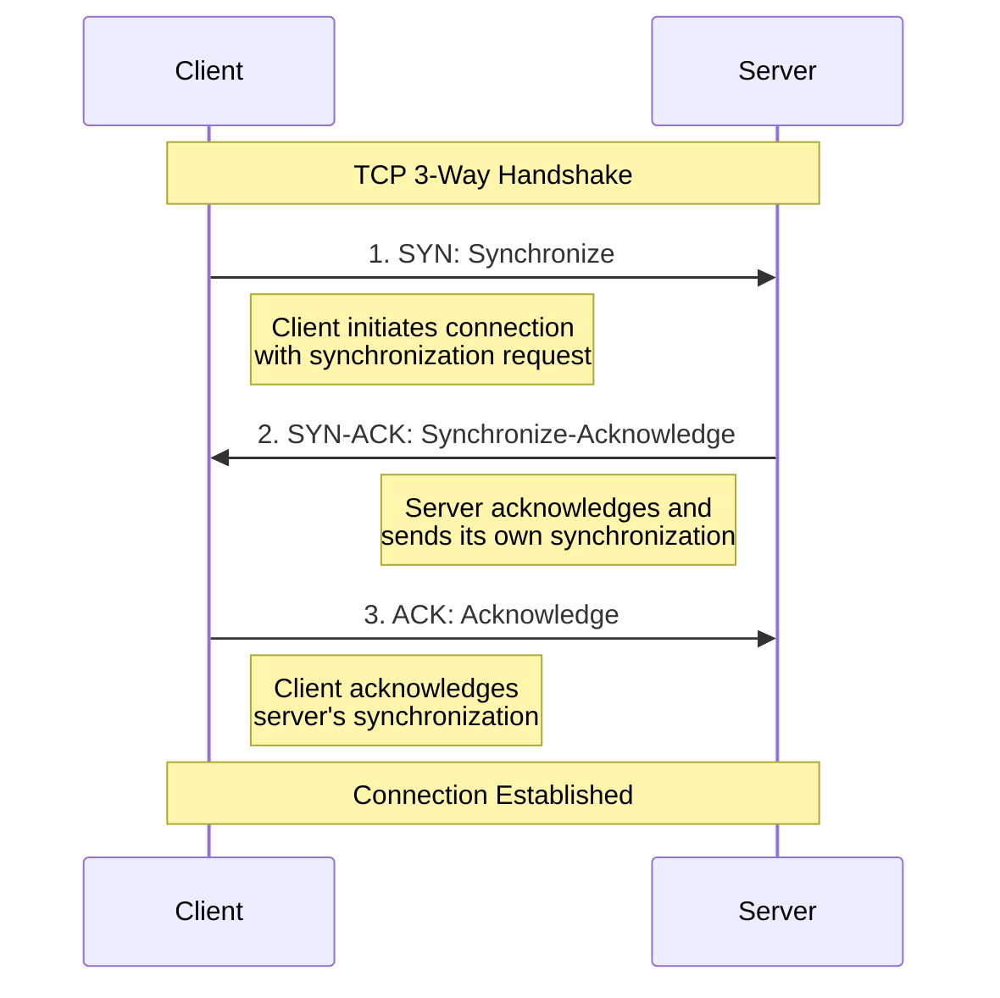

# Notes on REST
{:.no_toc}

---

* TOC
{:toc}

---

## Richardson Maturity Model

1. Level 0: Swamp of POX
    - Use HTTP to tunnel through. Ex: SOAP, XML-RPC
    - Usually use HTTP POST
2. Level 1: Resources
    - Multiple URIs to distinguish releated nouns. Ex: /person/1
3. Level 2: HTTP Verbs
    - Leverage transport-native properties to enhance service.
    - Use idimatic HTTP controls like status codes and headers
4. Level 3: Hypermedia Controls (HATEOAS)
    - No a prior knowledge of service required. Navigation is provided by service and hypermodia controls.
    - Promotes longevity through a uniform interface.

For more information, visit [Richardson Maturity Model](https://martinfowler.com/articles/richardsonMaturityModel.html).

## GitHub REST access
Before accessing the GitHub API[^1], it is better to authenticate first to increase the rate limit. You can get the access token from the GitHub App.

Before running the following REST access, I've exported the GITHUB_TOKEN environment variable.

```bash
curl --request GET \
--url "https://api.github.com/repos/ojitha/learn-ai" \
--header "Accept: application/vnd.github+json" \
--header "Authorization: Bearer $GITHUB_TOKEN"
```

If you are passing JWT, you must use `Authorization: Bearer`.

GitHub recommends using the built-in `GITHUB_TOKEN` instead of creating a token (what I did above is not the recommended way).
{:.warning}


Above command, you can run in the Powershell as follows

```powershell
Invoke-RestMethod -Method GET -Uri "https://api.github.com/repos/ojitha/learn-ai" -Headers @{
    "Accept" = "application/vnd.github+json"
    "Authorization" = "Bearer $env:GITHUB_TOKEN"
}
```


```bash
curl --request GET \
--url "https://api.github.com/events?per_page=2&page=1" \
--header "Accept: application/vnd.github+json" \
--header "X-GitHub-Api-Version: 2022-11-28" \
  https://api.github.com/events

```


## Monitoring network traffic


### tcpdump

Network interfaces are built to perform filtering, not to overwhelm the receiving operating system. They check the media access control (MAC) address in the frame's destination[^2]. 

The frame is the *layer two headers* for communication on the local, physical network. If the destination MAC address (belongs to IP) matches the address associated with the network interface (the physical address), the associated packet is forwarded to the OS. 

> To run tcpdump, you need sudo access.

Berkeley Packet Filters (BPF) to limit. BPF is a simple language that indicates elements of packets you want to filter on.

For example, if you want see only the network traffic for the GitHub API

```bash
sudo tcpdump host 4.237.22.34
```

Use the `nslookup api.github.io` to get the above IP address. Only for soruce or destination use `src` or `dst` instead of `host`.

### tshark

You can use the tshark same as above

```bash
sudo tshark host 4.237.22.34
```

To display only certain fields in tshark, you can use the switch `-Tfields`[^3].

```bash
tshark -Tfields -e ip.src
```

At a high level, 

1. When initiating a TCP connection between a client and server, the client sends the server a "SYN" request, asking for a connection to be established. 
2. Once the server has processed the response, a "SYN-ACK" response is sent back to the client, acknowledging it has been received. 
3. The client answers with an "ACK," and communication is established once the server receives it. This three-phase sequence of events is called the TCP 3-way handshake.




### nmap

To install

```bash
sudo apt install nmap -y
```

*TCP Connect Scan* uses the full TCP 3-way handshake to establish a connection to a host and see what ports are: 

| State           | Comment                                                      |
| :-------------- | :----------------------------------------------------------- |
| Open            | Service that is accepting TCP, UDP, SCTP packets.            |
| Closed          | A port with no active service taking requests.               |
| Filtered        | Unable to differentiate as the packets are being filtered, preventing the probes from reaching the port. |
| Open/Filtered   | Unable to determine between Open or Filtered and occurs when open ports typically do not give a response. |
| Closed/Filtered | Unable to determine between Closed or Filtered.              |

#### TCP Connect Scan (-sT)

*TCP Connect Scan* uses the full TCP 3-way handshake to establish a connection to a host:

```bash
nmap -sT 4.237.22.34
```


To limit the ports

```bash
nmap -sT -p 1-100 4.237.22.34
```

The following are the TCP connection scans:

| Status   | Response                | Comment                                   |
| :------- | :---------------------- | :---------------------------------------- |
| Open     | TCP SYN-ACK             | The service is listening on the port.     |
| Closed   | TCP RST                 | The service is not listening on the port. |
| Filtered | No response from target | The port is firewalled.                   |

#### TCP SYN Scan (-sS)

*TCP SYN Scan* is the most popular scan when using Nmap and is often called "half-open scanning".

For TCP SYN use `-sS` insted of `-sT`.

| Status   | Response                                                | Comment                                   |
| :------- | :------------------------------------------------------ | :---------------------------------------- |
| Open     | TCP SYN-ACK                                             | The service is listening on the port.     |
| Closed   | TCP RST                                                 | The Service is not listening on the port. |
| Filtered | No response from target or ICMP destination unreachable | The port is firewalled.                   |

For the specific port:

```bash
nmap -sS -p 443 4.237.22.34
```


#### TCP FIN Scan (-sF)

Use TCP FIN Scan if a firewall has spotted a SYN or TCP Connect scan. This type of scan sends a FIN packet to a target port and expects an RST packet back. If the port is open, it would have ignored the FIN packet; however, if the port is closed, an RST packet is sent.

```bash
sudo nmap -sF -p 443 4.237.22.34
```


status codes can be marked as follows:

| Status        | Response                        | Comment                              |
| :------------ | :------------------------------ | :----------------------------------- |
| Filtered      | ICMP unreachable error received | Closed port should respond with RST. |
| Closed        | RST packet received             | Closed port should respond with RST. |
| Open/Filtered | No response received            | Open port should drop FIN.           |

#### Host discovery

By default the scan sends an ICMP echo request, TCP SYN to port 443, TCP ACK to port 80, and ICMP timestamp request.

```bash
 sudo nmap -sn 4.237.22.34
```


[^1]: [Quickstart for GitHub REST API - GitHub Docs](https://docs.github.com/en/rest/quickstart?apiVersion=2022-11-28)

[^2]: [Interactive Lab: Security Testing and Monitoring with Kali Linux: Capturing Network Traffic Using tcpdump](https://learning.oreilly.com/interactive-lab/security-testing-and/9781098110857/lab/)

[^3]: [Wireshark · Display Filter Reference: Index](https://www.wireshark.org/docs/dfref/)