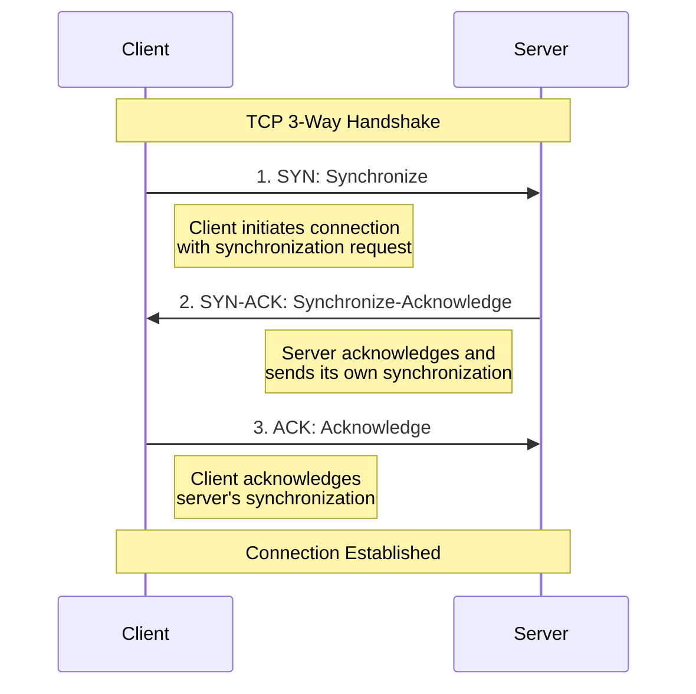

---

* TOC
{:toc}

---

## Richardson Maturity Model

1. Level 0: Swamp of POX
    - Use HTTP to tunnel through. Ex: SOAP, XML-RPC
    - Usually use HTTP POST
2. Level 1: Resources
    - Multiple URIs to distinguish releated nouns. Ex: /person/1
3. Level 2: HTTP Verbs
    - Leverage transport-native properties to enhance service.
    - Use idimatic HTTP controls like status codes and headers
4. Level 3: Hypermedia Controls (HATEOAS)
    - No a prior knowledge of service required. Navigation is provided by service and hypermodia controls.
    - Promotes longevity through a uniform interface.

For more information, visit [Richardson Maturity Model](https://martinfowler.com/articles/richardsonMaturityModel.html).

## GitHub REST access
Before accessing the GitHub API[^1], it is better to authenticate first to increase the rate limit. You can get the access token from the GitHub App.

Before running the following REST access, I've exported the GITHUB_TOKEN environment variable.

```bash
curl --request GET \
--url "https://api.github.com/repos/ojitha/learn-ai" \
--header "Accept: application/vnd.github+json" \
--header "Authorization: Bearer $GITHUB_TOKEN"
```

If you are passing JWT, you must use `Authorization: Bearer`.

> GitHub recommends using the built-in `GITHUB_TOKEN` instead of creating a token (what I did above is not the recommended way).


Above command, you can run in the Powershell as follows

```powershell
Invoke-RestMethod -Method GET -Uri "https://api.github.com/repos/ojitha/learn-ai" -Headers @{
    "Accept" = "application/vnd.github+json"
    "Authorization" = "Bearer $env:GITHUB_TOKEN"
}
```


```bash
curl --request GET \
--url "https://api.github.com/events?per_page=2&page=1" \
--header "Accept: application/vnd.github+json" \
--header "X-GitHub-Api-Version: 2022-11-28" \
  https://api.github.com/events

```


## Monitoring network traffic

Any machine that communicates over the network has at least one network adapter. All the components between this adapter and an application form a networking stack[^5]: a set of networking components that process and move networking traffic. In traditional scenarios, the networking stack is small, and all the packet routing and switching happens in external devices.

](https://learn.microsoft.com/en-us/windows-server/networking/technologies/pktmon/media/networking-stack.png)

However, with the advent of network virtualization, the size of the networking stack has multiplied.

](https://learn.microsoft.com/en-us/windows-server/networking/technologies/pktmon/media/packet-capture.png)

Packet Monitor intercepts packets at multiple locations throughout the networking stack, exposing the packet route. The microsoft tool **pktmon**[^6] supports TXT log analysis based on **TcpDump** packet parsing.

Network interfaces are built to perform filtering, not to overwhelm the receiving operating system. They check the media access control (MAC) address in the frame's destination[^2]. 

The frame is the *layer two headers* for communication on the local, physical network. If the destination MAC address (belongs to IP) matches the address associated with the network interface (the physical address), the associated packet is forwarded to the OS. 

To find network interfaces:

```bash
tcpdump -D
```


> To run tcpdump, you need sudo access.

### tcpdump

You can run tcpdump[^4] on the br-xxx(from the above command, find the bridge interface) interface for Docker:

```bash
tcpdump -i br-1eb30f278167
```


Berkeley Packet Filters (BPF) to limit. BPF is a simple language that indicates elements of packets you want to filter on.

For example, if you want to see only the network traffic for the GitHub API

```bash
sudo tcpdump host 4.237.22.34
```

Use the `nslookup api.github.io` to get the above IP address. Only for source or destination use `src` or `dst` instead of `host`.

### tshark

In many cases, the host will have one more interface. For example in the WSL:

```bash
ip link
```


you can use following command to find the route for example in the docker:

```bash
ip route
```

For example, see how ubuntu and the dockers are bound on the


To find all scanable interfaces, Tshark also provides the `-D` or `--list-interfaces` arguments that will list all scannable interfaces.

```bash
tshark -D
```

To run on the above interface:

```bash
tshark -i br-1eb30f278167
```


If you are runing a docker the better command is:

```bash
ip -brie a  | grep br- | awk '{print $1}' | xargs tshark -i
```

Above is the bridge network where dockers are connected.

To save to the file:

```bash
tshark -w FILENAME.pcap -i br-1eb30f278167
```

To read the file

```bash
tshark -r FILENAME.pcap
```

To export in JSON:

```bash
tshark -T json -i br-1eb30f278167
```

If you only want `http`:

```bash
tshark -f "port http" -i br-1eb30f278167
```

```bash
tshark -f "icmp[icmptype]==icmp-echo" -i br-1eb30f278167
```

You can use tshark the same way you can use tpcdump.

```bash
sudo tshark host 4.237.22.34
```

To display only specific fields in tshark, you can use the switch `-Tfields`[^3].

```bash
tshark -Tfields -e ip.src
```

At a high level, 

1. When initiating a TCP connection between a client and server, the client sends the server a "SYN" request, asking for a connection to be established. 
2. Once the server has processed the response, a "SYN-ACK" response is sent back to the client, acknowledging receipt. 
3. The client answers with an "ACK," and communication is established once the server receives it. This three-phase sequence of events is called the TCP 3-way handshake.




### nmap

To install

```bash
sudo apt install nmap -y
```

*TCP Connect Scan* uses the full TCP 3-way handshake to establish a connection to a host and see what ports are: 

| State           | Comment                                                      |
| :-------------- | :----------------------------------------------------------- |
| Open            | Service that is accepting TCP, UDP, SCTP packets.            |
| Closed          | A port with no active service taking requests.               |
| Filtered        | Unable to differentiate as the packets are being filtered, preventing the probes from reaching the port. |
| Open/Filtered   | Unable to determine between Open or Filtered and occurs when open ports typically do not give a response. |
| Closed/Filtered | Unable to determine between Closed or Filtered.              |

#### TCP Connect Scan (-sT)

*TCP Connect Scan* uses the full TCP 3-way handshake to establish a connection to a host:

```bash
nmap -sT 4.237.22.34
```


To limit the ports

```bash
nmap -sT -p 1-100 4.237.22.34
```

The following are the TCP connection scans:

| Status   | Response                | Comment                                   |
| :------- | :---------------------- | :---------------------------------------- |
| Open     | TCP SYN-ACK             | The service is listening on the port.     |
| Closed   | TCP RST                 | The service is not listening on the port. |
| Filtered | No response from target | The port is firewalled.                   |

#### TCP SYN Scan (-sS)

*TCP SYN Scan* is the most popular scan when using Nmap and is often called "half-open scanning".

For TCP SYN use `-sS` insted of `-sT`.

| Status   | Response                                                | Comment                                   |
| :------- | :------------------------------------------------------ | :---------------------------------------- |
| Open     | TCP SYN-ACK                                             | The service is listening on the port.     |
| Closed   | TCP RST                                                 | The Service is not listening on the port. |
| Filtered | No response from target or ICMP destination unreachable | The port is firewalled.                   |

For the specific port:

```bash
nmap -sS -p 443 4.237.22.34
```


#### TCP FIN Scan (-sF)

Use TCP FIN Scan if a firewall has spotted a SYN or TCP Connect scan. This type of scan sends a FIN packet to a target port and expects an RST packet back. If the port is open, it would have ignored the FIN packet; however, if the port is closed, an RST packet is sent.

```bash
sudo nmap -sF -p 443 4.237.22.34
```


Status codes can be marked as follows:

| Status        | Response                        | Comment                              |
| :------------ | :------------------------------ | :----------------------------------- |
| Filtered      | ICMP unreachable error received | Closed port should respond with RST. |
| Closed        | RST packet received             | Closed port should respond with RST. |
| Open/Filtered | No response received            | Open port should drop FIN.           |

#### Host discovery

By default, the scan sends an ICMP echo request, TCP SYN to port 443, TCP ACK to port 80, and an ICMP timestamp request.

```bash
 sudo nmap -sn 4.237.22.34
```


## Spark Remote Connections

### Livy Server Access

#### REST API endpoints and curl syntax

Apache Livy offers two primary submission approaches: interactive sessions for exploratory work and batch jobs for production workloads. [Zeotap +3](https://zeotap.com/blog/apachelivy/)

##### Session-based approach for interactive development

Interactive sessions provide the most flexibility for development and testing. Create a PySpark session first, then submit code statements within that session context. [Cloudera +2](https://docs.cloudera.com/HDPDocuments/HDP3/HDP-3.1.5/running-spark-applications/content/running_an_interactive_session_with_the_livy_api.html)

```bash
curl -X POST \
  -H "Content-Type: application/json" \
  -H "X-Requested-By: admin" \
  -d '{
    "kind": "pyspark",
    "driverMemory": "2g",
    "executorMemory": "1g",
    "executorCores": 2,
    "numExecutors": 2,
    "conf": {
      "spark.sql.adaptive.enabled": "true"
    }
  }' \
  http://localhost:8998/sessions
```

#### Livy Server

Livy server is a REST API for the Spark 2. Here the sample

```python
import requests
import json
import time
import sys
import os

# Configuration
livy_url = "http://localhost:8998"  # Default Livy port, adjust if needed
max_retries = 20
retry_interval = 10  # seconds

def check_livy_server():
    """Check if Livy server is running"""
    try:
        response = requests.get(f"{livy_url}/sessions")
        if response.status_code == 200:
            print("Livy server is running.")
            return True
        else:
            print(f"Livy server returned status code: {response.status_code}")
            return False
    except requests.exceptions.ConnectionError:
        print("Cannot connect to Livy server.")
        return False

def get_active_sessions():
    """Get list of active sessions"""
    try:
        response = requests.get(f"{livy_url}/sessions")
        if response.status_code == 200:
            return response.json()["sessions"]
        else:
            print(f"Error listing sessions: {response.status_code}")
            return []
    except requests.exceptions.ConnectionError:
        print("Cannot connect to Livy server.")
        return []

def check_session_statements(session_id):
    """Check if session has any active statements running"""
    try:
        response = requests.get(f"{livy_url}/sessions/{session_id}/statements")
        if response.status_code == 200:
            statements = response.json().get("statements", [])
            active_statements = [s for s in statements if s.get("state") not in ["available", "cancelled", "error"]]
            if active_statements:
                print(f"Session {session_id} has {len(active_statements)} active statements running.")
                return False  # Session is busy
            else:
                print(f"Session {session_id} has no active statements running.")
                return True  # Session is not busy
        else:
            print(f"Error checking statements for session {session_id}: {response.status_code}")
            return False
    except requests.exceptions.ConnectionError:
        print("Cannot connect to Livy server.")
        return False

def create_session(name="PySpark-Job-Session", spark_conf=None):
    """Create a new Spark session"""
    # Default session configuration
    data = {
        "kind": "pyspark",
        "name": name,
        "heartbeatTimeoutInSecond": 60
    }
    
    # Add custom Spark configurations if provided
    if spark_conf:
        data["conf"] = spark_conf
    
    headers = {"Content-Type": "application/json"}
    
    try:
        print("Creating a new Spark session...")
        response = requests.post(
            f"{livy_url}/sessions", 
            data=json.dumps(data), 
            headers=headers
        )
        
        if response.status_code == 201:  # 201 Created
            session_info = response.json()
            session_id = session_info["id"]
            print(f"Created new session with ID: {session_id}")
            return session_id
        else:
            print(f"Failed to create session. Status code: {response.status_code}")
            print(f"Response: {response.text}")
            return None
    except requests.exceptions.ConnectionError:
        print("Cannot connect to Livy server.")
        return None

def check_session_state(session_id):
    """Check the state of a specific session"""
    try:
        response = requests.get(f"{livy_url}/sessions/{session_id}")
        if response.status_code == 200:
            session_info = response.json()
            state = session_info.get("state")
            print(f"Session {session_id} state: {state}")
            return state
        else:
            print(f"Error checking session {session_id}: {response.status_code}")
            return None
    except requests.exceptions.ConnectionError:
        print("Cannot connect to Livy server.")
        return None

def wait_for_session_to_be_ready(session_id):
    """Wait until a session is in 'idle' state (ready to accept statements)"""
    for i in range(max_retries):
        state = check_session_state(session_id)
        
        if state == "idle":
            print(f"Session {session_id} is now ready.")
            return True
        elif state in ["dead", "error", "killed", "shutting_down"]:
            print(f"Session {session_id} failed with state: {state}")
            return False
        
        print(f"Waiting for session to be ready... (Attempt {i+1}/{max_retries})")
        time.sleep(retry_interval)
    
    print("Max retries reached. Session still not ready.")
    return False

def find_or_create_available_session():
    """Find a session that is not busy or create a new one if none found"""
    # First check if Livy server is running
    if not check_livy_server():
        for i in range(max_retries):
            print(f"Retrying Livy server connection in {retry_interval} seconds...")
            time.sleep(retry_interval)
            if check_livy_server():
                break
        else:
            print("Max retries reached. Livy server is not available.")
            return None
    
    # Check for active sessions
    sessions = get_active_sessions()
    
    if sessions:
        print(f"Found {len(sessions)} active sessions:")
        for session in sessions:
            print(f"Session ID: {session['id']}, State: {session['state']}, Name: {session.get('name', 'N/A')}")
        
        # First priority: Find an idle session with no active statements
        for session in sessions:
            if session['state'] == 'idle':
                session_id = session['id']
                print(f"Checking if session {session_id} is busy...")
                if check_session_statements(session_id):
                    print(f"Using existing non-busy session with ID: {session_id}")
                    return session_id
                else:
                    print(f"Session {session_id} is currently busy, checking others...")
        
        # Second priority: Wait for any non-terminal session to become idle
        for session in sessions:
            if session['state'] not in ["dead", "error", "killed", "shutting_down"]:
                session_id = session['id']
                print(f"Waiting for session {session_id} to become ready...")
                if wait_for_session_to_be_ready(session_id):
                    if check_session_statements(session_id):
                        print(f"Using session {session_id} which is now idle and not busy")
                        return session_id
    
    # No suitable active sessions found, create a new one
    print("No available non-busy sessions found. Creating a new session...")
    session_id = create_session()
    
    if session_id is not None:
        if wait_for_session_to_be_ready(session_id):
            return session_id
    
    return None

def submit_job_to_livy(session_id, job_path="job.py", job_args=None):
    """Submit a PySpark job to Livy server"""
    # Read the content of the job script
    try:
        with open(job_path, 'r') as file:
            job_code = file.read()
    except Exception as e:
        print(f"Failed to read job script: {e}")
        return False
    
    # Prepare the code to be submitted
    # If job_args were provided, we'll add them as variables at the top
    if job_args and len(job_args) > 0:
        args_dict = {}
        for i in range(0, len(job_args), 2):
            if i + 1 < len(job_args):
                # Convert arg name from --arg-name to arg_name
                arg_name = job_args[i].lstrip('-').replace('-', '_')
                arg_value = job_args[i + 1]
                args_dict[arg_name] = arg_value
        
        # Add arguments as variables at the top of the code
        args_code = "# Command line arguments\n"
        for name, value in args_dict.items():
            # Try to convert to appropriate type if it looks like a number
            if value.isdigit():
                args_code += f"{name} = {value}\n"
            else:
                args_code += f"{name} = \"{value}\"\n"
        
        job_code = args_code + "\n" + job_code
    
    # Prepare the request data
    data = {
        "code": job_code
    }
    
    headers = {"Content-Type": "application/json"}
    
    try:
        print(f"Submitting job to Livy session {session_id}...")
        response = requests.post(
            f"{livy_url}/sessions/{session_id}/statements",
            data=json.dumps(data),
            headers=headers
        )
        
        if response.status_code == 201:  # 201 Created
            statement_info = response.json()
            statement_id = statement_info["id"]
            print(f"Job submitted successfully. Statement ID: {statement_id}")
            return track_statement_progress(session_id, statement_id)
        else:
            print(f"Failed to submit job. Status code: {response.status_code}")
            print(f"Response: {response.text}")
            return False
    except requests.exceptions.ConnectionError:
        print("Cannot connect to Livy server.")
        return False

def track_statement_progress(session_id, statement_id):
    """Track the progress of a submitted statement/job"""
    print(f"Tracking progress of statement {statement_id}...")
    
    for i in range(max_retries * 2):  # More retries for job execution
        try:
            response = requests.get(f"{livy_url}/sessions/{session_id}/statements/{statement_id}")
            
            if response.status_code == 200:
                statement_info = response.json()
                state = statement_info.get("state")
                
                print(f"Statement {statement_id} state: {state}")
                
                if state == "available":
                    # Job completed
                    output = statement_info.get("output", {})
                    status = output.get("status")
                    
                    if status == "ok":
                        # Print the result if any
                        data = output.get("data", {})
                        if "text/plain" in data:
                            print(f"Job Result:\n{data['text/plain']}")
                        print("Job completed successfully")
                        return True
                    elif status == "error":
                        # Print error information
                        traceback = output.get("traceback", [])
                        if traceback:
                            print("Job Error:")
                            for line in traceback:
                                print(line)
                        else:
                            print(f"Job failed: {output.get('evalue', 'Unknown error')}")
                        return False
                
                elif state == "error" or state == "cancelled":
                    print(f"Job failed with state: {state}")
                    return False
                
                # Still running
                print(f"Job is still running. Checking again in {retry_interval} seconds...")
                time.sleep(retry_interval)
            else:
                print(f"Error checking statement: {response.status_code}")
                return False
                
        except requests.exceptions.ConnectionError:
            print("Cannot connect to Livy server.")
            return False
    
    print("Max retries reached. Job is taking too long.")
    return False

if __name__ == "__main__":
    print("Finding or creating an available Spark session for PySpark job...")
    session_id = find_or_create_available_session()
    
    if session_id is not None:
        print(f"Found non-busy session with ID: {session_id}. Ready to run PySpark job.")
        
        # Get job.py path from command line args if provided, otherwise use default
        job_script = "job.py"
        additional_args = []
        
        # Parse command line args
        if len(sys.argv) > 1:
            # First argument could be job script path
            if sys.argv[1].endswith(".py"):
                job_script = sys.argv[1]
                additional_args = sys.argv[2:]
            else:
                # All arguments are for the job
                additional_args = sys.argv[1:]
        
        # Check if job script exists
        if not os.path.exists(job_script):
            print(f"ERROR: Job script '{job_script}' does not exist.")
            sys.exit(1)
        
        # Submit the PySpark job to Livy
        success = submit_job_to_livy(session_id, job_script, additional_args)
        
        if not success:
            sys.exit(1)
    else:
        print("Failed to find or create an available Spark session. PySpark job will not run.")
        sys.exit(1)
```

Sample Job

```python
from pyspark.sql import SparkSession
import findspark
import time

findspark.init()


spark = SparkSession \
    .builder.appName("job-0") \
        .config("spark.sql.legacy.timeParserPolicy","LEGACY") \
    .getOrCreate()

sc = spark.sparkContext

# sel the log leve
sc.setLogLevel('ERROR')

from py4j.java_gateway import java_import
java_import(spark._sc._jvm, "org.apache.spark.sql.api.python.*")

from pyspark.sql import Row

MyDate = Row('name', 'a_date', 'b_date')
df = spark.createDataFrame([
    MyDate('A', '2021-02-10', '2021-06-10')
    , MyDate('B', '2021-02-11', '2022-02-11')
])
df.show()
time.sleep(30) 
```

### Spark Connect Setup and Job Submission

```bash
# Navigate to your Spark home directory
cd $SPARK_HOME

# Start Spark Connect server (default port 15002)
./sbin/start-connect-server.sh

# Verify it's running
netstat -tulpn | grep 15002
# Should show: tcp6 0 0 :::15002 :::* LISTEN
```

Direct python spark connect library:

```python
#!/usr/bin/env python3
"""
Direct Spark Connect job submission
Compatible with Spark 3.4.4
"""
from pyspark.sql import SparkSession
from pyspark.sql.functions import explode, split, lower, trim, count
import sys

def submit_wordcount_job(spark_connect_url="sc://localhost:15002"):
    """
    Submit a word count job using Spark Connect
    """
    try:
        # Create Spark session with Connect
        spark = SparkSession.builder \
            .remote(spark_connect_url) \
            .appName("SparkConnect-WordCount") \
            .getOrCreate()
        
        print(f"✅ Connected to Spark Connect at {spark_connect_url}")
        print(f"Spark version: {spark.version}")
        
        # Sample data for word count
        sample_texts = [
            "Apache Spark is a unified analytics engine",
            "Spark Connect enables remote Spark connectivity", 
            "PySpark jobs can be submitted programmatically",
            "REST APIs provide flexible job submission"
        ]
        
        # Create DataFrame from sample data
        df = spark.createDataFrame([(text,) for text in sample_texts], ["text"])
        
        print("\n📊 Processing sample data:")
        df.show(truncate=False)
        
        # Perform word count operation
        words_df = df.select(explode(split(lower(trim(df.text)), " ")).alias("word"))
        word_counts = words_df.groupBy("word").count().orderBy("count", ascending=False)
        
        print("\n📈 Word count results:")
        word_counts.show()
        
        # Collect results for return
        results = word_counts.collect()
        
        # Stop the session
        spark.stop()
        
        print("✅ Job completed successfully!")
        return {"status": "success", "word_count": len(results), "top_words": [row.asDict() for row in results[:5]]}
        
    except Exception as e:
        print(f"❌ Job failed: {str(e)}")
        return {"status": "error", "message": str(e)}

if __name__ == "__main__":
    # Allow custom Spark Connect URL as command line argument
    connect_url = sys.argv[1] if len(sys.argv) > 1 else "sc://localhost:15002"
    result = submit_wordcount_job(connect_url)
    print(f"\n🔄 Final result: {result}")
```

Run the python script:

```bash
# Save as spark_connect_wordcount.py
python3 spark_connect_wordcount.py

# Or with custom URL
python3 spark_connect_wordcount.py sc://your-server:15002
```

### Python Client Library for Easy integration

```python
#!/usr/bin/env python3
"""
Python client library for Spark Connect REST API
"""
import requests
import json
import time

class SparkConnectClient:
    def __init__(self, api_url="http://localhost:8080"):
        self.api_url = api_url.rstrip('/')
        
    def submit_job(self, job_config):
        """Submit a job and return job ID"""
        response = requests.post(
            f"{self.api_url}/submit-connect-job",
            json=job_config,
            headers={"Content-Type": "application/json"}
        )
        response.raise_for_status()
        return response.json()
    
    def get_job_status(self, job_id):
        """Get job status"""
        response = requests.get(f"{self.api_url}/job-status/{job_id}")
        response.raise_for_status()
        return response.json()
    
    def get_job_result(self, job_id):
        """Get job results"""
        response = requests.get(f"{self.api_url}/job-result/{job_id}")
        response.raise_for_status()
        return response.json()
    
    def wait_for_completion(self, job_id, timeout=300, poll_interval=5):
        """Wait for job to complete"""
        start_time = time.time()
        
        while time.time() - start_time < timeout:
            status = self.get_job_status(job_id)
            
            if status['status'] in ['completed', 'failed']:
                return status
                
            time.sleep(poll_interval)
        
        raise TimeoutError(f"Job {job_id} did not complete within {timeout} seconds")

# Usage example
if __name__ == "__main__":
    client = SparkConnectClient()
    
    # Submit job
    job_config = {
        "job_type": "wordcount",
        "app_name": "Python-Client-Example",
        "input_data": [
            "Python client libraries simplify integration",
            "Spark Connect provides excellent remote capabilities"
        ]
    }
    
    result = client.submit_job(job_config)
    job_id = result['job_id']
    print(f"✅ Job submitted: {job_id}")
    
    # Wait for completion
    final_status = client.wait_for_completion(job_id)
    print(f"🏁 Job completed with status: {final_status['status']}")
    
    # Get results
    if final_status['status'] == 'completed':
        results = client.get_job_result(job_id)
        print("📊 Results:", json.dumps(results, indent=2))
```


[^1]: [Quickstart for GitHub REST API - GitHub Docs](https://docs.github.com/en/rest/quickstart?apiVersion=2022-11-28)

[^2]: [Interactive Lab: Security Testing and Monitoring with Kali Linux: Capturing Network Traffic Using tcpdump](https://learning.oreilly.com/interactive-lab/security-testing-and/9781098110857/lab/)

[^3]: [Wireshark · Display Filter Reference: Index](https://www.wireshark.org/docs/dfref/)

[^4]: [tcpdump man page \| TCPDUMP & LIBPCAP](https://www.tcpdump.org/manpages/tcpdump.1.html)

[^5]: [Packet Monitor (Pktmon) \| Microsoft Learn](https://learn.microsoft.com/en-us/windows-server/networking/technologies/pktmon/pktmon)

[^6]: [Pktmon command formatting \| Microsoft Learn](https://learn.microsoft.com/en-us/windows-server/networking/technologies/pktmon/pktmon-syntax)