# Notes on AI
{:.no_toc}

---

* TOC
{:toc}

---

## AWS
Reading List:

```mermaid
---
config:
  securityLevel: 'loose'
  theme: default
  look: handDrawn
  baclground: grid
---  
flowchart TB
    root((AWS)) --> A(Agent)
    root --> L(LLM)
    L --> N(Nova)
    root --> T(Tools)
    T --> K(Kiro)
    T --> NA(Nova Act)
    T --> Q(Q Developer)
    A --> SA(Strand)
    root --> B(Bedrock)
    B --> BA(Bedrock Agent)
    B --> AC(AgentCore)
    root --> S[Summits]
    S --> S25[New York, 2025]
    S25 --> S2501[[ Top announcements of the 2025 ]]

    %% This is the line that creates the link
    click S2501 "https://aws.amazon.com/blogs/aws/top-announcements-of-the-aws-summit-in-new-york-2025/" "Top announcements of the AWS Summit in New York, 2025"
    click NA "#nova-act" "Amazon Nova Act | Amazon AGI Labs"
    click BA "#bedrock-agents" "AI Agents – Amazon Bedrock Agents"


```



### Agents

### Bedrock

#### Bedrock Agents
[Home](https://aws.amazon.com/bedrock/agents/){:target="_blank"}

#### Strand

### Tools

#### Nova Act
[Home](https://labs.amazon.science/blog/nova-act){:target="_blank"}

Test

## MCP

Models are only as good as the **context** in which they are given. MCP[^1] is an open standard protocol that standardises how LLM applications connect to and work with your tools and sources.

> MCP standardises how AI applications interact with external systems.
{:.green}

MCP is based on the client-server architecture.


Sagemaker

```python
from sagemaker.predictor import retrieve_default
endpoint_name = "jumpstart-dft-llama-3-1-8b-instruct-20250722-121006"
predictor = retrieve_default(endpoint_name)
payload = {
    "inputs": "<|begin_of_text|><|start_header_id|>user<|end_header_id|>\n\nwhat is the recipe of mayonnaise?<|eot_id|><|start_header_id|>assistant<|end_header_id|>\n\n",
    "parameters": {
        "max_new_tokens": 256,
        "top_p": 0.9,
        "temperature": 0.6
    }
}
response = predictor.predict(payload)
print(response)
payload = {
    "inputs": "<|begin_of_text|><|start_header_id|>user<|end_header_id|>\n\nI am going to Paris, what should I see?<|eot_id|><|start_header_id|>assistant<|end_header_id|>\n\nParis, the capital of France, is known for its stunning architecture, art museums, historical landmarks, and romantic atmosphere. Here are some of the top attractions to see in Paris:\n\n1. The Eiffel Tower: The iconic Eiffel Tower is one of the most recognizable landmarks in the world and offers breathtaking views of the city.\n2. The Louvre Museum: The Louvre is one of the world's largest and most famous museums, housing an impressive collection of art and artifacts, including the Mona Lisa.\n3. Notre-Dame Cathedral: This beautiful cathedral is one of the most famous landmarks in Paris and is known for its Gothic architecture and stunning stained glass windows.\n\nThese are just a few of the many attractions that Paris has to offer. With so much to see and do, it's no wonder that Paris is one of the most popular tourist destinations in the world.<|eot_id|><|start_header_id|>user<|end_header_id|>\n\nWhat is so great about #1?<|eot_id|><|start_header_id|>assistant<|end_header_id|>\n\n",
    "parameters": {
        "max_new_tokens": 256,
        "top_p": 0.9,
        "temperature": 0.6
    }
}
response = predictor.predict(payload)
print(response)
payload = {
    "inputs": "<|begin_of_text|><|start_header_id|>system<|end_header_id|>\n\nAlways answer with Haiku<|eot_id|><|start_header_id|>user<|end_header_id|>\n\nI am going to Paris, what should I see?<|eot_id|><|start_header_id|>assistant<|end_header_id|>\n\n",
    "parameters": {
        "max_new_tokens": 256,
        "top_p": 0.9,
        "temperature": 0.6
    }
}
response = predictor.predict(payload)
print(response)
payload = {
    "inputs": "<|begin_of_text|><|start_header_id|>system<|end_header_id|>\n\nAlways answer with emojis<|eot_id|><|start_header_id|>user<|end_header_id|>\n\nHow to go from Beijing to NY?<|eot_id|><|start_header_id|>assistant<|end_header_id|>\n\n",
    "parameters": {
        "max_new_tokens": 256,
        "top_p": 0.9,
        "temperature": 0.6
    }
}
response = predictor.predict(payload)
print(response)
```


[^1]: [MCP: Build Rich-Context AI Apps with Anthropic](https://learn.deeplearning.ai/courses/mcp-build-rich-context-ai-apps-with-anthropic/lesson/fkbhh/introduction){:target="_blank"}
