# Notes on AI
{:.no_toc}

---

* TOC
{:toc}

---

## AWS
Reading List:

```mermaid
---
config:
  securityLevel: 'loose'
  theme: default
  look: handDrawn
  baclground: grid
---  
flowchart TB
    root((AWS)) --> A(Agent)
    root --> L(LLM)
    L --> N(Nova)
    root --> T(Tools)
    T --> K(Kiro)
    T --> NA(Nova Act)
    T --> Q(Q Developer)
    A --> SA(Strand)
    root --> B(Bedrock)
    B --> BA(Bedrock Agent)
    B --> AC(AgentCore)
    root --> S[Summits]
    S --> S25[New York, 2025]
    S25 --> S2501[[ Top announcements of the 2025 ]]

    %% This is the line that creates the link
    click S2501 "https://aws.amazon.com/blogs/aws/top-announcements-of-the-aws-summit-in-new-york-2025/" "Top announcements of the AWS Summit in New York, 2025"
    click NA "#nova-act" "Amazon Nova Act | Amazon AGI Labs"
    click BA "#bedrock-agents" "AI Agents – Amazon Bedrock Agents"


```

### Agents

### Bedrock

#### Bedrock Agents
[Home](https://aws.amazon.com/bedrock/agents/){:target="_blank"}

#### Strand

### Tools

#### Nova Act
[Home](https://labs.amazon.science/blog/nova-act){:target="_blank"}

Test

