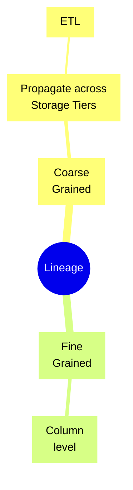

---
 
* TOC
{:toc}

---

## Data Lineage




- Coarse-grained: This data lineage often targets business users, focuses on capturing the high-level business processes and overall data workflows. Typically, it captures and visualises the relationships between datasets and how they’re propagated across storage tiers, including ETL jobs and operational information. 
- Fine-grained: This data lineage gives access to column-level lineage and the data transformation steps in the processing and analytical pipelines.

You can use the [Spline agent](https://github.com/AbsaOSS/spline-spark-agent) to capture runtime lineage information from Spark jobs, powered by [AWS Glue](https://aws.amazon.com/glue/). For those interested in lineage tracking for workloads combining graph data and machine learning, Amazon Web Services announced [Amazon SageMaker ML Lineage Tracking](https://docs.aws.amazon.com/sagemaker/latest/dg/lineage-tracking.html) at re: Invent 2021[^1].

SageMaker ML Lineage Tracking integrates with [SageMaker Pipelines](https://aws.amazon.com/sagemaker/pipelines/), creates and stores information about the steps of automated ML workflows from data preparation to model deployment.


## Partitioning

**Data skew** in partitioning occurs when your data is not evenly distributed across partitions, resulting in some partitions holding significantly more records (or bytes) than others.

- **Adaptive Partitioning**: Dynamically adjust partitioning based on data characteristics to ensure a more balanced distribution.
- **Salting**: Introduce a random factor or "salt" to the data to distribute randomly across partitions.
- **Repartitioning**
- **Sampling**: Using a sample, determine the distribution and adjust the processing strategy accordingly.
- **Custom partitioning**: involves partitioning based on domain knowledge, ensuring better distribution.

## AWS SNS

Amazon SNS is a managed <u>pub/sub messaging service</u> for reliable real-time event notifications to multiple recipients. Subscribers can be different AWS services.

- Decoupled communication
- Reliable message delivery
- Scalability with higher volumes
- Cross-platform notifications
- Event-driven architecture
- Seamless integration

> 📝 Amazon SNS does not guarantee message ordering. For strict message ordering, **Amazon SQS FIFO** queues would be more appropriate.

SNS can deliver:

1. Application to a person (email, SMS or mobile push)

2. Application to Application 

    

### Topic

A topic decouples message publishers from subscribers. Publishers send messages to a topic, and all subscribers to that topic receive the same messages. Two type of topics:

- FIFO (first-in, first-out)
    - Strictly-preserved message ordering
    - **Exactly-once** message delivery
    - Subscription protocols: 
        - SQS 

- Standard
    - Best-effort message ordering
    - **At least once**, message delivery
    - Subscription protocols:
        - Application to application 
            - SQS, 
            - Lambda, 
            - Data Firehose,
        - Application to Person
            - HTTP, 
            - SMS, 
            - email, and 
            - mobile application endpoints

{: width="30%" height="30%"}

> 📝 Standard topics use at-least-once delivery and best-effort ordering. FIFO topics use **no duplication** and first-in-first-out **ordered** delivery. 

SNS support a Fan-out pattern because multiple subscribers can subscribe to a topic simultaneously.  

SNS is capable of message filtering. AWS Lambda can directly integrate with SNS and trigger automated actions based on published messages.

## AWS SQS

Amazon SQS acts as an intermediary to 

- send, 

- store, 

- offers SSE (Server Side Encryption). Two offers:

    - SSE-SQS 
    - SSE-KMS

- and receive messages between software components which can use to: 

    - communicate **asynchronously** and independently 

    - securely and reliably: Messages store redundantly across multiple AZs as they safeguard against potential failures 

    - without message loss or service dependencies

AWS Services Integrations:

- SNS
- IoT
- Step Functions
- EventBridge

### Queue

1. **Standard queues**: Application can process messages that arrive more than once and out of order, standard queues use
    1. At-Least-Once delivery and 
    2. Best-Effort ordering
2. **FIFO queues**: Designed to enhance messaging between applications when the order of operations and events is critical, or where duplicates can't be tolerated. FIFO queues use 
    1. Exactly-Once processing and 
    2. First-In-First-Out delivery

### Message

Text or binary data, up to 256 KB in size. 

**Message groups** include a tag that specifies that a message belongs to a specific message group. Messages of the same message group are always processed in sequence, in a strict order relative to the message group. 

> 📝 Messages that belong to different message groups might be processed out of order.

Message **deduplication ID** is a token used to prevent duplication in **FIFO queues only**. 

### DLQ

A dead-letter queue (DLQ) is a separate queue. 

DQL holds messages that could not be successfully processed by a consumer after a specified number of attempts.

### Visibility timeout

The visibility timeout is the amount of time for a message to be invisible to other consumers after a one consumer picks that message. 

> 📝 This technique prevents duplicate processing of messages.

### Short polling

Consumer queries to find available messages and gets an immediate response, even if no messages are found.

### Long polling

Consumer can wait for messages to arrive in an SQS queue up to a **configurable timeout**, rather than continually polling the queue for new messages. 

> 📝 This method can reduce the number of empty responses and subsequent requests made.

### Batching

SQS provides batch actions to help you reduce costs and manipulate up to **10 messages with a single action**. These batch actions include, 

- sending, 
- deleting, 
- changing the visibility timeout of messages

### Delay Queues

Postpone the delivery of new messages to consumers for a number of seconds when consumer needs additional time to process messages. 

> 📝 Any messages that you send to the queue remain invisible to the consumers for the duration of the delay period set.

## AWS lambda

Say your loabmda function is `lambda_function.py`:

```bash
zip lambda_function.zip lambda_function.py
```

Uisng AWS CLI:

```bash
aws lambda update-function-code  --function-name <function name> --zip-file fileb://lambda_function.zip
```

Above you can do on Sagemaker AI terminal for example.

To get grep the S3 bucket to a variable:

```bash
WEB_BUCKET=`aws s3 ls | grep www- | awk '{ print $3 }'`
```


##  

---

[^1]:[Build data lineage for data lakes using AWS Glue, Amazon Neptune, and Spline \| AWS Big Data Blog](https://aws.amazon.com/blogs/big-data/build-data-lineage-for-data-lakes-using-aws-glue-amazon-neptune-and-spline/)
