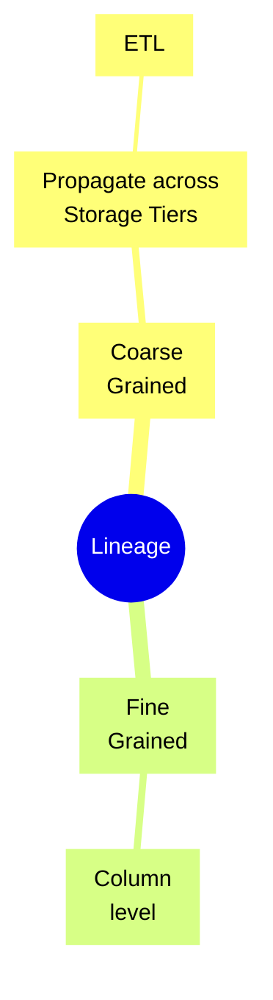

# Notes on Data Engineering
{:.no_toc}

---

* TOC
{:toc}

---

## Data Lineage

- Coarse-grained: This data lineage often targets business users, focuses on capturing the high-level business processes and overall data workflows. Typically, it captures and visualises the relationships between datasets and how they’re propagated across storage tiers, including ETL jobs and operational information. 
- Fine-grained: This data lineage gives access to column-level lineage and the data transformation steps in the processing and analytical pipelines.

You can use the [Spline agent](https://github.com/AbsaOSS/spline-spark-agent) to capture runtime lineage information from Spark jobs, powered by [AWS Glue](https://aws.amazon.com/glue/). For those interested in lineage tracking for workloads combining graph data and machine learning, Amazon Web Services announced [Amazon SageMaker ML Lineage Tracking](https://docs.aws.amazon.com/sagemaker/latest/dg/lineage-tracking.html) at re: Invent 2021[^1].

SageMaker ML Lineage Tracking integrates with [SageMaker Pipelines](https://aws.amazon.com/sagemaker/pipelines/), creates and stores information about the steps of automated ML workflows from data preparation to model deployment.

## Partitioning

**Data skew** in partitioning occurs when your data is not evenly distributed across partitions, resulting in some partitions holding significantly more records (or bytes) than others.

- **Adaptive Partitioning**: Dynamically adjust partitioning based on data characteristics to ensure a more balanced distribution.
- **Salting**: Introduce a random factor or "salt" to the data to distribute randomly across partitions.
- **Repartitioning**
- **Sampling**: Using a sample, determine the distribution and adjust the processing strategy accordingly.
- **Custom partitioning**: involves partitioning based on domain knowledge, ensuring better distribution.

---

[^1]:[Build data lineage for data lakes using AWS Glue, Amazon Neptune, and Spline \| AWS Big Data Blog](https://aws.amazon.com/blogs/big-data/build-data-lineage-for-data-lakes-using-aws-glue-amazon-neptune-and-spline/)
