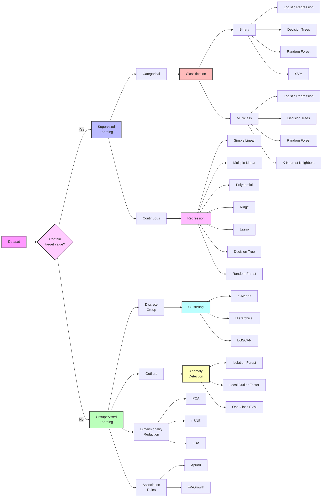

# Notes on ML
{:.no_toc}

---

* TOC
{:toc}

---

## ML

Algorithms

## Linear Algebra for ML

What is Linear Algebra?

If it has an exponential term, it isn't linear algebra such as $2x^2+5 = 13$ or $2\sqrt{x}+6=13$. There can be 3 solutions in linear algebra:

1. one solution
2. no solution
3. infinite solution

In a given system, there could be many equations and many unknowns as $y=a+bx_{1}+cx_{2}+\ldots +mx_{n}$.

[^1]: [Linear Algebra for Machine Learning](https://learning.oreilly.com/course/linear-algebra-for/9780137398119/){:target="_blank"}

